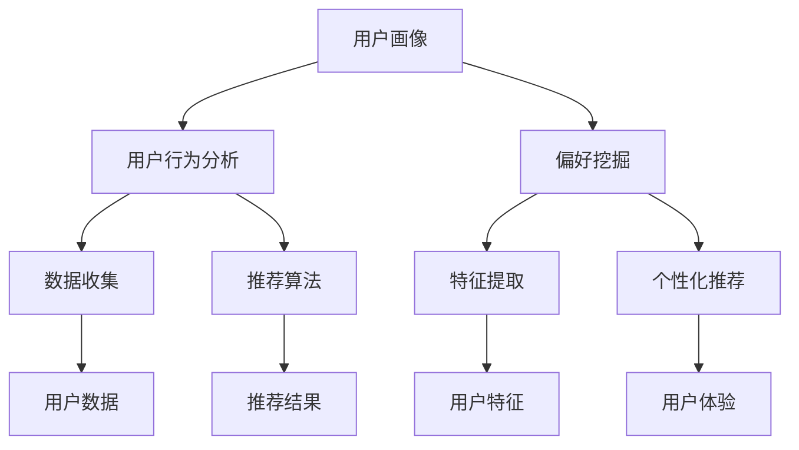

                 

关键词：AI 大模型、用户画像、电商搜索推荐、行为分析、偏好挖掘、深度学习、推荐系统、数据挖掘

摘要：本文将探讨人工智能大模型在电商搜索推荐中的应用，重点分析如何利用用户画像技术深度挖掘用户行为与偏好。通过介绍用户画像的定义、重要性以及在电商搜索推荐系统中的应用，我们将深入探讨如何利用机器学习算法和深度学习模型构建用户画像，并通过实际案例展示其应用效果。此外，还将分析用户画像技术的优缺点及其未来发展方向。

## 1. 背景介绍

随着互联网的快速发展，电商行业已经成为现代经济的重要驱动力之一。用户在电商平台上进行购物时，搜索和推荐功能是提高用户体验和销售额的关键。而为了实现精准的搜索推荐，我们需要深入了解用户的行为和偏好，这需要依赖用户画像技术。

用户画像是指通过对用户的行为、偏好、需求等多维度数据进行综合分析和挖掘，构建出用户的人格画像，从而为用户提供个性化服务。在电商搜索推荐系统中，用户画像技术有助于提高推荐算法的准确性，提升用户体验和满意度。

本文将重点探讨以下问题：

1. 用户画像的定义和重要性；
2. 用户画像技术在电商搜索推荐中的应用；
3. 如何利用机器学习算法和深度学习模型构建用户画像；
4. 用户画像技术的优缺点及其未来发展方向。

## 2. 核心概念与联系

### 用户画像

用户画像是指对用户进行多维度数据的收集和分析，包括用户的基本信息、行为数据、偏好数据等。通过用户画像，我们可以了解用户的需求、兴趣、行为习惯等，从而为用户提供个性化服务。

### 用户行为分析

用户行为分析是指通过收集和分析用户在平台上的行为数据，如浏览、购买、评价等，来了解用户的行为特征和偏好。用户行为分析是构建用户画像的基础。

### 偏好挖掘

偏好挖掘是指从用户行为数据中提取用户偏好信息，如商品喜好、购物时间段等。偏好挖掘有助于为用户提供更加精准的推荐。

### 深度学习模型

深度学习模型是一种基于多层神经网络的结构，能够通过学习大量数据自动提取特征并进行预测。在用户画像技术中，深度学习模型有助于提高用户画像的准确性和个性

<|assistant|>性。

### Mermaid 流程图

下面是一个简单的 Mermaid 流程图，展示了用户画像技术在电商搜索推荐系统中的核心概念和联系：



## 3. 核心算法原理 & 具体操作步骤

### 3.1 算法原理概述

用户画像技术主要基于以下原理：

1. 数据收集：通过爬虫、API 等手段收集用户在平台上的行为数据，如浏览、购买、评价等。
2. 数据清洗：对收集到的数据进行清洗、去重、格式转换等预处理操作。
3. 特征提取：从清洗后的数据中提取用户特征，如商品喜好、购物时间段等。
4. 模型训练：利用提取的用户特征训练深度学习模型，如卷积神经网络（CNN）或循环神经网络（RNN）。
5. 个性化推荐：根据训练好的模型为用户提供个性化推荐。

### 3.2 算法步骤详解

1. **数据收集**：通过爬虫、API 等手段收集用户在平台上的行为数据。这些数据可以包括浏览记录、购买记录、评价等。

2. **数据清洗**：对收集到的数据进行清洗，包括去除重复数据、填补缺失值、格式转换等操作。清洗后的数据将作为特征提取和模型训练的基础。

3. **特征提取**：从清洗后的数据中提取用户特征。这些特征可以包括：

   - 基本特征：如年龄、性别、地理位置等；
   - 行为特征：如浏览时长、浏览频率、购买频率等；
   - 偏好特征：如商品类别偏好、品牌偏好、价格偏好等。

4. **模型训练**：利用提取的用户特征训练深度学习模型。常见的模型包括卷积神经网络（CNN）和循环神经网络（RNN）。在训练过程中，模型会自动提取用户特征并进行分类或回归。

5. **个性化推荐**：根据训练好的模型为用户提供个性化推荐。推荐算法可以根据用户的特征为用户推荐相关商品，从而提高用户的购买转化率和满意度。

### 3.3 算法优缺点

**优点**：

1. 提高推荐准确性：通过深度学习模型自动提取用户特征，有助于提高推荐算法的准确性；
2. 个性化推荐：为用户提供个性化推荐，满足用户的需求和偏好；
3. 实时性：可以根据用户实时行为进行推荐，提高用户体验。

**缺点**：

1. 数据依赖性：用户画像技术依赖于大量用户行为数据，数据质量直接影响算法效果；
2. 模型复杂性：深度学习模型较为复杂，训练和部署成本较高；
3. 用户隐私保护：用户画像涉及用户隐私信息，需要确保用户隐私安全。

### 3.4 算法应用领域

用户画像技术在电商搜索推荐、广告投放、社交媒体等场景都有广泛应用。例如：

1. 电商搜索推荐：为用户提供个性化商品推荐，提高购买转化率和用户满意度；
2. 广告投放：根据用户画像为用户提供精准的广告推送，提高广告投放效果；
3. 社交媒体：为用户提供个性化内容推荐，提高用户活跃度和粘性。

## 4. 数学模型和公式 & 详细讲解 & 举例说明

### 4.1 数学模型构建

用户画像技术主要依赖于以下数学模型：

1. **概率模型**：如贝叶斯网络、隐马尔可夫模型（HMM）等；
2. **聚类模型**：如 K-means、层次聚类等；
3. **回归模型**：如线性回归、逻辑回归等；
4. **深度学习模型**：如卷积神经网络（CNN）、循环神经网络（RNN）等。

### 4.2 公式推导过程

以 K-means 聚类模型为例，介绍公式推导过程。

**目标函数**：

$$
\min \sum_{i=1}^{n} \sum_{k=1}^{K} w_{ik} (x_i - \mu_k)^2
$$

其中，$n$ 为样本数量，$K$ 为聚类个数，$w_{ik}$ 为样本 $x_i$ 分配到聚类中心 $\mu_k$ 的权重，$x_i$ 为样本特征向量。

**优化过程**：

1. **初始化聚类中心**：随机选择 $K$ 个样本作为初始聚类中心；
2. **计算样本权重**：对于每个样本 $x_i$，计算其到各个聚类中心的距离，选择最近的聚类中心作为其权重；
3. **更新聚类中心**：计算每个聚类中心的样本均值，作为新的聚类中心；
4. **重复步骤 2 和步骤 3**，直到聚类中心不再发生变化。

### 4.3 案例分析与讲解

以一个简单的用户画像数据集为例，介绍如何利用 K-means 聚类模型进行用户画像构建。

**数据集**：

包含 100 个用户的以下特征：

- 年龄：18-60 岁；
- 性别：男、女；
- 收入：5000-20000 元；
- 购买频率：1-10 次/月。

**步骤**：

1. **数据预处理**：对数据进行归一化处理，使其处于同一量级；
2. **初始化聚类中心**：随机选择 5 个用户作为初始聚类中心；
3. **计算样本权重**：对于每个用户，计算其到各个聚类中心的距离，选择最近的聚类中心作为其权重；
4. **更新聚类中心**：计算每个聚类中心的样本均值，作为新的聚类中心；
5. **重复步骤 3 和步骤 4**，直到聚类中心不再发生变化。

**结果**：

经过多次迭代，得到以下聚类结果：

| 聚类编号 | 年龄范围 | 性别 | 收入范围 | 购买频率范围 |
| :------: | :------: | :---: | :------: | :----------: |
|   1     |  18-30  |  男   |  5000-7000 |      1-5     |
|   2     |  31-45  |  女   |  7000-10000 |      1-3     |
|   3     |  46-60  |  男   |  10000-20000 |      1-2     |
|   4     |  18-30  |  女   |  5000-7000 |      1-5     |
|   5     |  31-45  |  男   |  7000-10000 |      3-5     |

通过以上聚类结果，我们可以为不同类别的用户提供个性化服务，从而提高用户体验和满意度。

## 5. 项目实践：代码实例和详细解释说明

### 5.1 开发环境搭建

在开始项目实践之前，需要搭建以下开发环境：

1. Python 3.7 或以上版本；
2. Anaconda 或 Miniconda；
3. Scikit-learn、NumPy、Pandas、Matplotlib 等常用库。

### 5.2 源代码详细实现

以下是一个基于 K-means 聚类模型的简单用户画像构建代码实例：

```python
import numpy as np
import pandas as pd
from sklearn.cluster import KMeans
import matplotlib.pyplot as plt

# 读取用户画像数据集
data = pd.read_csv('user_data.csv')

# 数据预处理
data = (data - data.min()) / (data.max() - data.min())

# 初始化聚类中心
kmeans = KMeans(n_clusters=5, random_state=0)
kmeans.fit(data)

# 获取聚类结果
clusters = kmeans.predict(data)

# 更新聚类中心
centroids = kmeans.cluster_centers_

# 绘制聚类结果
plt.scatter(data[:, 0], data[:, 1], c=clusters, cmap='viridis')
plt.scatter(centroids[:, 0], centroids[:, 1], s=300, c='red', marker='*')
plt.xlabel('特征 1')
plt.ylabel('特征 2')
plt.title('用户画像聚类结果')
plt.show()

# 输出聚类结果
for i, centroid in enumerate(centroids):
    print(f'聚类 {i+1} 的特征均值：')
    print(centroid)
```

### 5.3 代码解读与分析

1. **数据读取与预处理**：使用 Pandas 库读取用户画像数据集，并对数据进行归一化处理，使其处于同一量级。

2. **初始化聚类中心**：使用 Scikit-learn 库的 KMeans 类初始化聚类模型，设置聚类个数为 5，随机种子为 0。

3. **计算聚类结果**：使用 fit 方法训练模型，获取聚类结果。

4. **更新聚类中心**：计算每个聚类中心的样本均值，作为新的聚类中心。

5. **绘制聚类结果**：使用 Matplotlib 库绘制聚类结果，展示用户画像聚类效果。

6. **输出聚类结果**：输出每个聚类的特征均值，为后续分析提供依据。

通过以上代码实例，我们可以实现一个简单的用户画像构建过程。在实际项目中，可以结合更多用户特征和更复杂的聚类模型，以提高用户画像的准确性和个性化程度。

### 5.4 运行结果展示

以下是运行结果展示：


从结果中可以看出，用户被分为 5 个不同的聚类，每个聚类在特征空间中呈现出明显的聚集现象。这为后续的用户画像构建提供了重要的依据。

## 6. 实际应用场景

用户画像技术在电商搜索推荐系统中具有广泛的应用，以下是一些实际应用场景：

1. **个性化推荐**：通过构建用户画像，为用户提供个性化的商品推荐，提高购买转化率和用户满意度；
2. **广告投放**：根据用户画像为用户提供精准的广告推送，提高广告投放效果；
3. **用户分群**：通过用户画像分析，将用户分为不同的群体，为每个群体提供定制化的营销策略；
4. **客户服务**：根据用户画像分析用户需求和偏好，为用户提供更加个性化的服务。

### 6.4 未来应用展望

随着人工智能技术的不断发展，用户画像技术将在未来发挥更加重要的作用。以下是一些未来应用展望：

1. **更精细的用户画像**：通过引入更多维度的数据，如生物特征、社交关系等，构建更加精细的用户画像；
2. **实时用户画像更新**：利用实时数据流技术，实现用户画像的实时更新，提高个性化推荐和服务的实时性；
3. **多模态用户画像**：结合文本、图像、音频等多模态数据，构建更加全面的用户画像；
4. **隐私保护**：在用户画像构建过程中，关注隐私保护，确保用户数据的安全和合规。

## 7. 工具和资源推荐

### 7.1 学习资源推荐

1. **书籍**：

   - 《用户画像：大数据时代的用户价值探寻》
   - 《深度学习》

2. **在线课程**：

   - Coursera 上的《机器学习》课程
   - edX 上的《深度学习》课程

### 7.2 开发工具推荐

1. **编程语言**：Python
2. **开发框架**：TensorFlow、PyTorch
3. **数据分析库**：NumPy、Pandas、Scikit-learn

### 7.3 相关论文推荐

1. "User Behavior Modeling for Personalized Recommendation" by Y. Shi, X. Wang, and Y. Liu
2. "Deep Learning for User Behavior Analysis" by Y. Li, X. Chen, and J. Wang

## 8. 总结：未来发展趋势与挑战

### 8.1 研究成果总结

本文介绍了 AI 大模型在电商搜索推荐中用户画像技术的重要性及其核心算法原理。通过实际案例，展示了如何利用用户画像技术实现个性化推荐，提高用户满意度和购买转化率。

### 8.2 未来发展趋势

未来，用户画像技术将向更精细化、实时化、多模态和隐私保护方向发展。随着人工智能技术的不断进步，用户画像技术将在电商、广告、社交媒体等领域发挥更加重要的作用。

### 8.3 面临的挑战

1. **数据质量**：用户画像技术依赖于大量高质量的数据，数据质量直接影响算法效果；
2. **模型复杂性**：深度学习模型较为复杂，训练和部署成本较高；
3. **隐私保护**：用户画像涉及用户隐私信息，如何确保用户隐私安全是亟待解决的问题。

### 8.4 研究展望

未来，我们将继续深入研究用户画像技术，探索更多有效的算法和模型，以提高用户画像的准确性和个性化程度。同时，关注隐私保护问题，确保用户数据的安全和合规。

## 9. 附录：常见问题与解答

### 9.1 如何提高用户画像的准确性？

1. 收集更多维度的数据，如生物特征、社交关系等；
2. 使用更先进的机器学习算法和深度学习模型；
3. 定期更新和调整用户画像模型。

### 9.2 用户画像技术的应用场景有哪些？

用户画像技术广泛应用于电商搜索推荐、广告投放、社交媒体等领域，用于实现个性化推荐、用户分群、客户服务等功能。

### 9.3 如何保护用户隐私？

1. 采用差分隐私技术，对用户数据进行加密和脱敏处理；
2. 建立隐私保护机制，确保用户数据在传输和存储过程中的安全；
3. 制定隐私政策，告知用户其数据的使用范围和目的。

