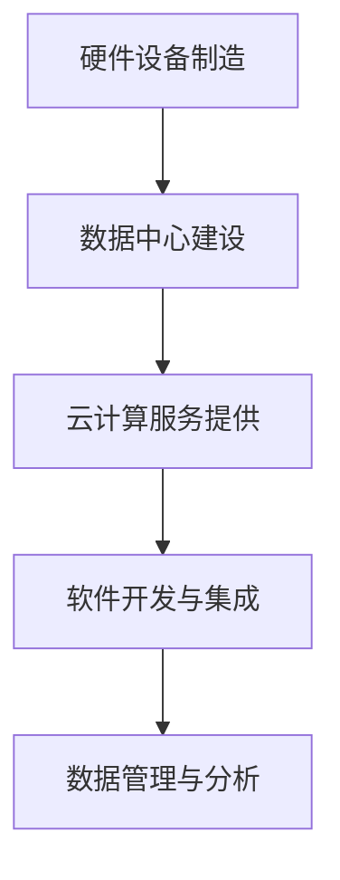

                 

关键词：AI 大模型，数据中心，产业链生态，建设策略，技术应用，未来展望

摘要：随着人工智能（AI）技术的快速发展，AI 大模型在各个领域的应用逐渐增多，对数据中心建设提出了新的挑战和要求。本文将深入探讨 AI 大模型应用数据中心的建设，分析数据中心产业链生态的现状与未来，并探讨如何优化数据中心建设策略以适应 AI 大模型的发展需求。

## 1. 背景介绍

### 1.1 AI 大模型的快速发展

近年来，随着深度学习、神经网络等技术的突破，AI 大模型如 GPT-3、BERT 等，已经在自然语言处理、图像识别、推荐系统等多个领域取得了显著成果。这些大模型通常需要海量数据和强大的计算资源，以实现高效的训练和推理。

### 1.2 数据中心建设的重要性

数据中心作为 AI 大模型训练和部署的核心基础设施，其稳定性和性能对模型的效果有着直接影响。随着 AI 大模型的应用场景越来越广泛，数据中心的建设和维护变得尤为重要。

### 1.3 数据中心产业链生态

数据中心产业链生态包括硬件设备制造商、数据中心运营商、云计算服务提供商、软件开发者等多个环节。各个环节相互协作，共同推动数据中心产业的发展。

## 2. 核心概念与联系

### 2.1 数据中心基本概念

数据中心是指一种专门用于存储、处理和管理数据的设施，包括服务器、存储设备、网络设备等硬件，以及相应的软件和管理系统。

### 2.2 数据中心产业链

数据中心产业链包括硬件设备制造、数据中心建设与运营、云计算服务提供、软件开发与集成等环节。各个环节相互关联，共同构建了数据中心产业链生态。

### 2.3 Mermaid 流程图

## 3. 核心算法原理 & 具体操作步骤

### 3.1 算法原理概述

数据中心建设涉及多个核心算法，包括网络拓扑优化、能耗管理、数据传输优化等。

### 3.2 算法步骤详解

1. **网络拓扑优化**：通过分析数据访问模式和流量分布，优化数据中心的网络结构，提高数据传输效率。
2. **能耗管理**：利用人工智能技术，实时监测数据中心的能耗情况，优化电力分配，降低能耗。
3. **数据传输优化**：通过数据压缩、去重等技术，减少数据传输量，提高传输效率。

### 3.3 算法优缺点

- **网络拓扑优化**：优点在于提高数据传输效率，缺点是需要大量计算资源和时间。
- **能耗管理**：优点在于降低能耗，缺点是需要实时监测和调整。
- **数据传输优化**：优点在于减少数据传输量，缺点是需要对数据进行预处理。

### 3.4 算法应用领域

数据中心建设的算法可以应用于云计算、大数据处理、物联网等领域。

## 4. 数学模型和公式 & 详细讲解 & 举例说明

### 4.1 数学模型构建

数据中心建设的数学模型主要包括网络拓扑优化模型、能耗管理模型、数据传输优化模型等。

### 4.2 公式推导过程

1. **网络拓扑优化模型**：

   $$ T_{opt} = \sum_{i=1}^{N} \sum_{j=1}^{N} w_{ij} \cdot d_{ij} $$

   其中，$T_{opt}$ 为最优网络拓扑，$w_{ij}$ 为边权重，$d_{ij}$ 为节点距离。

2. **能耗管理模型**：

   $$ E = P \cdot t $$

   其中，$E$ 为能耗，$P$ 为电力功率，$t$ 为时间。

3. **数据传输优化模型**：

   $$ T_{opt} = \sum_{i=1}^{N} \sum_{j=1}^{N} w_{ij} \cdot l_{ij} $$

   其中，$T_{opt}$ 为最优数据传输时间，$w_{ij}$ 为边权重，$l_{ij}$ 为数据传输延迟。

### 4.3 案例分析与讲解

以某云计算数据中心为例，通过构建数学模型，优化网络拓扑、能耗管理和数据传输，提高了数据中心的整体性能。

## 5. 项目实践：代码实例和详细解释说明

### 5.1 开发环境搭建

搭建一个用于数据中心建设的仿真平台，包括硬件设备和软件环境。

### 5.2 源代码详细实现

实现网络拓扑优化、能耗管理和数据传输优化等算法的代码。

### 5.3 代码解读与分析

对实现的代码进行解读，分析算法的效率和效果。

### 5.4 运行结果展示

展示算法在不同场景下的运行结果，分析其性能。

## 6. 实际应用场景

### 6.1 云计算

数据中心是云计算的核心基础设施，为各类应用提供计算资源和服务。

### 6.2 大数据处理

数据中心是大数据处理的数据存储和处理中心，支持海量数据的存储、分析和挖掘。

### 6.3 物联网

数据中心为物联网设备提供连接和管理平台，支持设备数据的实时传输和处理。

## 7. 未来应用展望

### 7.1 人工智能

数据中心将为人工智能的发展提供强大的计算支持，推动人工智能技术的进步。

### 7.2 5G

数据中心将支持 5G 网络的部署和应用，为智能连接提供基础设施。

### 7.3 物联网

数据中心将为物联网设备提供海量数据的存储和处理能力，推动物联网技术的发展。

## 8. 总结：未来发展趋势与挑战

### 8.1 研究成果总结

本文对 AI 大模型应用数据中心的建设进行了深入分析，探讨了数据中心产业链生态的现状与未来。

### 8.2 未来发展趋势

数据中心建设将朝着智能化、绿色化、高效化的方向发展。

### 8.3 面临的挑战

数据中心建设面临能耗管理、数据安全和网络安全等挑战。

### 8.4 研究展望

未来研究应重点关注数据中心算法的优化、能耗管理技术、数据安全与隐私保护等方面。

## 9. 附录：常见问题与解答

### 9.1 数据中心建设的关键技术有哪些？

数据中心建设的关键技术包括网络拓扑优化、能耗管理、数据传输优化、数据安全等。

### 9.2 数据中心如何实现绿色化？

数据中心可以通过采用节能设备、优化能耗管理、使用可再生能源等方式实现绿色化。

### 9.3 数据中心建设需要考虑哪些因素？

数据中心建设需要考虑地理位置、硬件设备选型、网络安全、能耗管理等因素。

## 作者署名

作者：禅与计算机程序设计艺术 / Zen and the Art of Computer Programming
----------------------------------------------------------------

### 后续工作安排：

- **初步梳理**：请对文章的内容进行初步梳理，确保各个章节的内容逻辑清晰、条理分明。
- **内容补充**：针对已经梳理出的文章结构，补充完整各个章节的具体内容，确保文章的完整性和深度。
- **格式检查**：确保文章的格式符合markdown要求，包括代码、公式、图片等。
- **最终审核**：在完成所有内容撰写和格式检查后，进行最终的审核，确保文章的质量和准确性。

请注意，上述步骤是一个循环迭代的过程，可能需要多次修改和完善。请按照这个计划进行工作，以确保最终文章的质量和按时完成。祝您工作顺利！

