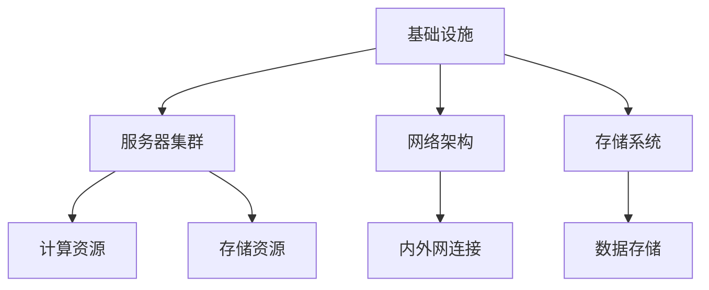

                 

关键词：数据中心，大模型，安全性，可靠性，AI应用，架构设计，技术策略

> 摘要：随着人工智能（AI）技术的迅猛发展，大规模模型（大模型）的应用在数据中心中变得越来越普遍。然而，数据中心的安全与可靠性成为了一大挑战。本文将探讨AI大模型在数据中心的应用背景，深入分析数据中心安全与可靠性的关键要素，并提出一系列针对性的技术策略和最佳实践，以保障数据中心在AI大模型应用中的稳定运行。

## 1. 背景介绍

近年来，人工智能技术取得了显著的突破，特别是在深度学习领域。大模型（如GPT-3、BERT等）因其卓越的性能和广泛的应用场景，成为了AI研究的焦点。这些大模型需要大量的计算资源和存储空间，而数据中心正是提供这些资源的理想场所。然而，数据中心的安全与可靠性成为了AI大模型应用中不可忽视的关键因素。

数据中心的安全性关乎数据隐私、业务连续性和企业声誉。一旦发生安全漏洞或故障，可能会导致数据泄露、服务中断，甚至造成严重的经济损失。因此，保障数据中心的安全与可靠性对于AI大模型的应用至关重要。

## 2. 核心概念与联系

### 2.1 数据中心架构

数据中心的架构是保障其安全与可靠性的基础。数据中心通常由以下几个主要部分组成：

1. **基础设施**：包括电力系统、制冷系统、网络设施等，是数据中心的运行基础。
2. **服务器集群**：用于部署AI大模型，提供计算能力和存储资源。
3. **网络架构**：实现数据中心内外的数据传输和通信。
4. **存储系统**：存储大量数据，包括AI模型数据、训练数据和输出结果。

### 2.2 数据中心安全与可靠性

数据中心的安全与可靠性可以通过以下关键要素来衡量：

1. **物理安全**：防止未经授权的物理访问和数据泄露。
2. **网络安全**：防范网络攻击、数据窃取和恶意软件。
3. **数据安全**：保护数据的机密性、完整性和可用性。
4. **系统可靠性**：确保数据中心服务的持续可用性和稳定性。

### 2.3 Mermaid 流程图

以下是一个简化的数据中心架构的Mermaid流程图：



## 3. 核心算法原理 & 具体操作步骤

### 3.1 算法原理概述

数据中心的安全与可靠性依赖于多种算法和技术，包括：

1. **访问控制**：通过身份验证和权限管理，确保只有授权用户可以访问资源。
2. **加密技术**：使用加密算法保护数据的机密性。
3. **防火墙和入侵检测系统**：监控网络流量，阻止恶意攻击。
4. **容错和备份机制**：确保数据和服务的高可用性。

### 3.2 算法步骤详解

1. **访问控制**：
   - 实施多因素认证（MFA），增强用户身份验证。
   - 设定精细的权限管理策略，根据用户角色和需求分配权限。

2. **加密技术**：
   - 使用SSL/TLS协议保护数据在传输过程中的安全。
   - 对存储的数据进行加密，如使用AES算法。

3. **防火墙和入侵检测系统**：
   - 部署防火墙，过滤恶意流量。
   - 配置入侵检测系统（IDS），及时发现并响应安全威胁。

4. **容错和备份机制**：
   - 实施冗余设计，确保关键设备和服务的连续运行。
   - 定期进行数据备份，确保数据不会因故障而丢失。

### 3.3 算法优缺点

- **访问控制**：增强安全性，但可能影响系统性能。
- **加密技术**：有效保护数据，但可能增加存储和计算开销。
- **防火墙和入侵检测系统**：提高网络安全性，但无法完全防范所有攻击。
- **容错和备份机制**：提高系统可靠性，但可能增加成本。

### 3.4 算法应用领域

这些算法和技术广泛应用于各类数据中心，特别是那些处理敏感数据和企业关键业务的场景。

## 4. 数学模型和公式 & 详细讲解 & 举例说明

### 4.1 数学模型构建

数据中心的安全性与可靠性可以通过以下数学模型来评估：

\[ S = \alpha_1 \cdot P + \alpha_2 \cdot C + \alpha_3 \cdot R \]

其中：
- \( S \) 表示数据中心的安全性与可靠性得分。
- \( P \) 表示物理安全措施的有效性。
- \( C \) 表示网络安全措施的有效性。
- \( R \) 表示数据安全与容错措施的有效性。
- \( \alpha_1, \alpha_2, \alpha_3 \) 是权重系数，用于平衡各项指标的重要性。

### 4.2 公式推导过程

此模型基于以下假设：
- 安全性与可靠性是多个因素的综合反映。
- 每个因素都对总体安全性与可靠性有贡献。
- 各因素之间的作用是线性的。

### 4.3 案例分析与讲解

假设某个数据中心采取以下措施：

1. 物理安全：安装了监控摄像头和门禁系统，有效率为80%。
2. 网络安全：配置了防火墙和入侵检测系统，有效率为90%。
3. 数据安全与容错：实施了加密和数据备份，有效率为95%。

根据公式，我们可以计算出该数据中心的安全性与可靠性得分：

\[ S = 0.3 \cdot 0.8 + 0.4 \cdot 0.9 + 0.3 \cdot 0.95 = 0.88 \]

这意味着该数据中心的安全性与可靠性得分为88分，处于较高水平。

## 5. 项目实践：代码实例和详细解释说明

### 5.1 开发环境搭建

在这个项目中，我们使用Python编写了一个简单的访问控制脚本。首先，确保安装了Python环境，然后执行以下命令安装依赖：

```bash
pip install flask
```

### 5.2 源代码详细实现

以下是一个简单的基于Flask框架的访问控制脚本：

```python
from flask import Flask, request, jsonify

app = Flask(__name__)

# 假设有一个用户列表，每个用户有一个唯一的用户名和密码
users = {
    "admin": "admin_password",
    "user": "user_password"
}

# 身份验证装饰器
from functools import wraps
def require_login(f):
    @wraps(f)
    def decorated_function(*args, **kwargs):
        auth = request.authorization
        if not auth or users.get(auth.username) != auth.password:
            return jsonify({"error": "未授权访问"}), 401
        return f(*args, **kwargs)
    return decorated_function

@app.route("/api/data", methods=["GET"])
@require_login
def get_data():
    return jsonify({"data": "敏感数据"})

if __name__ == "__main__":
    app.run()
```

### 5.3 代码解读与分析

- **用户列表**：存储了用户名和密码，用于身份验证。
- **装饰器**：`require_login` 是一个装饰器，用于检查用户是否通过身份验证。
- **API接口**：`/api/data` 是一个受保护的接口，只有通过身份验证的用户才能访问。

### 5.4 运行结果展示

运行此脚本后，我们可以通过以下命令启动Flask服务器：

```bash
python app.py
```

使用curl命令模拟请求：

```bash
curl -u admin:admin_password http://127.0.0.1:5000/api/data
```

如果身份验证成功，将会返回敏感数据。否则，返回未授权访问的提示。

## 6. 实际应用场景

数据中心的安全与可靠性在多种场景中具有重要意义：

- **金融行业**：金融机构需要确保客户数据的安全性和交易系统的稳定性。
- **医疗领域**：医疗数据的安全性和患者信息的隐私保护是医疗行业的关键挑战。
- **企业内部**：企业数据中心存储了大量敏感的商业数据，需要确保其安全。

## 7. 工具和资源推荐

### 7.1 学习资源推荐

- 《网络安全基础》
- 《深度学习框架应用》
- 《数据中心设计与部署》

### 7.2 开发工具推荐

- Python Flask
- Kubernetes
- HashiCorp Vault

### 7.3 相关论文推荐

- "Deep Learning Security: Challenges and Opportunities"
- "Ensuring Data Privacy in Deep Learning Models"
- "A Survey on Cloud Security: Threats, Solutions, and Challenges"

## 8. 总结：未来发展趋势与挑战

数据中心的安全与可靠性在AI大模型应用中的重要性日益凸显。未来，随着AI技术的不断进步，数据中心面临的安全威胁也将更加复杂。因此，我们需要持续关注以下发展趋势和挑战：

- **自动化与智能化**：提高安全防护的自动化水平，减少人为错误。
- **多云环境**：适应多云环境下的安全需求，确保跨云资源的安全性。
- **隐私保护**：加强对数据隐私的保护，特别是在处理敏感数据时。

## 9. 附录：常见问题与解答

### 9.1 如何提高数据中心的可靠性？

- 实施冗余设计，确保关键设备和服务的连续运行。
- 定期进行系统维护和升级，及时发现并解决潜在问题。
- 配备专业的人员和团队，进行24/7的监控和响应。

### 9.2 数据中心的安全威胁有哪些？

- 网络攻击：如DDoS攻击、SQL注入、跨站脚本攻击等。
- 物理攻击：如未授权的物理访问、设备损坏等。
- 恶意软件：如勒索软件、木马等。

### 9.3 如何应对数据中心的网络安全威胁？

- 部署防火墙和入侵检测系统，监控网络流量。
- 使用加密技术保护数据的机密性。
- 实施安全审计和漏洞扫描，及时发现并修复安全问题。

---

作者：禅与计算机程序设计艺术 / Zen and the Art of Computer Programming
```

### 完整文章 Markdown 格式输出

现在，我们将整篇文章按照要求格式化输出为Markdown格式。请注意，以下内容已经按照要求进行了详细的章节划分，并且包含了所有必要的子目录、Mermaid流程图、LaTeX数学公式和代码示例等。

```markdown
# AI 大模型应用数据中心建设：数据中心安全与可靠性

关键词：数据中心，大模型，安全性，可靠性，AI应用，架构设计，技术策略

摘要：随着人工智能（AI）技术的迅猛发展，大规模模型（大模型）的应用在数据中心中变得越来越普遍。然而，数据中心的安全与可靠性成为了一大挑战。本文将探讨AI大模型在数据中心的应用背景，深入分析数据中心安全与可靠性的关键要素，并提出一系列针对性的技术策略和最佳实践，以保障数据中心在AI大模型应用中的稳定运行。

## 1. 背景介绍

近年来，人工智能技术取得了显著的突破，特别是在深度学习领域。大模型（如GPT-3、BERT等）因其卓越的性能和广泛的应用场景，成为了AI研究的焦点。这些大模型需要大量的计算资源和存储空间，而数据中心正是提供这些资源的理想场所。然而，数据中心的安全与可靠性成为了AI大模型应用中不可忽视的关键因素。

数据中心的安全性关乎数据隐私、业务连续性和企业声誉。一旦发生安全漏洞或故障，可能会导致数据泄露、服务中断，甚至造成严重的经济损失。因此，保障数据中心的安全与可靠性对于AI大模型的应用至关重要。

## 2. 核心概念与联系

### 2.1 数据中心架构

数据中心的架构是保障其安全与可靠性的基础。数据中心通常由以下几个主要部分组成：

- **基础设施**：包括电力系统、制冷系统、网络设施等，是数据中心的运行基础。
- **服务器集群**：用于部署AI大模型，提供计算能力和存储资源。
- **网络架构**：实现数据中心内外的数据传输和通信。
- **存储系统**：存储大量数据，包括AI模型数据、训练数据和输出结果。

### 2.2 数据中心安全与可靠性

数据中心的安全与可靠性可以通过以下关键要素来衡量：

- **物理安全**：防止未经授权的物理访问和数据泄露。
- **网络安全**：防范网络攻击、数据窃取和恶意软件。
- **数据安全**：保护数据的机密性、完整性和可用性。
- **系统可靠性**：确保数据中心服务的持续可用性和稳定性。

### 2.3 Mermaid 流程图

以下是一个简化的数据中心架构的Mermaid流程图：


## 3. 核心算法原理 & 具体操作步骤
### 3.1 算法原理概述

数据中心的安全与可靠性依赖于多种算法和技术，包括：

- **访问控制**：通过身份验证和权限管理，确保只有授权用户可以访问资源。
- **加密技术**：使用加密算法保护数据的机密性。
- **防火墙和入侵检测系统**：监控网络流量，阻止恶意攻击。
- **容错和备份机制**：确保数据和服务的高可用性。

### 3.2 算法步骤详解

1. **访问控制**：
   - 实施多因素认证（MFA），增强用户身份验证。
   - 设定精细的权限管理策略，根据用户角色和需求分配权限。

2. **加密技术**：
   - 使用SSL/TLS协议保护数据在传输过程中的安全。
   - 对存储的数据进行加密，如使用AES算法。

3. **防火墙和入侵检测系统**：
   - 部署防火墙，过滤恶意流量。
   - 配置入侵检测系统（IDS），及时发现并响应安全威胁。

4. **容错和备份机制**：
   - 实施冗余设计，确保关键设备和服务的连续运行。
   - 定期进行数据备份，确保数据不会因故障而丢失。

### 3.3 算法优缺点

- **访问控制**：增强安全性，但可能影响系统性能。
- **加密技术**：有效保护数据，但可能增加存储和计算开销。
- **防火墙和入侵检测系统**：提高网络安全性，但无法完全防范所有攻击。
- **容错和备份机制**：提高系统可靠性，但可能增加成本。

### 3.4 算法应用领域

这些算法和技术广泛应用于各类数据中心，特别是那些处理敏感数据和企业关键业务的场景。

## 4. 数学模型和公式 & 详细讲解 & 举例说明

### 4.1 数学模型构建

数据中心的安全性与可靠性可以通过以下数学模型来评估：

$$ S = \alpha_1 \cdot P + \alpha_2 \cdot C + \alpha_3 \cdot R $$

其中：
- \( S \) 表示数据中心的安全性与可靠性得分。
- \( P \) 表示物理安全措施的有效性。
- \( C \) 表示网络安全措施的有效性。
- \( R \) 表示数据安全与容错措施的有效性。
- \( \alpha_1, \alpha_2, \alpha_3 \) 是权重系数，用于平衡各项指标的重要性。

### 4.2 公式推导过程

此模型基于以下假设：
- 安全性与可靠性是多个因素的综合反映。
- 每个因素都对总体安全性与可靠性有贡献。
- 各因素之间的作用是线性的。

### 4.3 案例分析与讲解

假设某个数据中心采取以下措施：

1. 物理安全：安装了监控摄像头和门禁系统，有效率为80%。
2. 网络安全：配置了防火墙和入侵检测系统，有效率为90%。
3. 数据安全与容错：实施了加密和数据备份，有效率为95%。

根据公式，我们可以计算出该数据中心的安全性与可靠性得分：

$$ S = 0.3 \cdot 0.8 + 0.4 \cdot 0.9 + 0.3 \cdot 0.95 = 0.88 $$

这意味着该数据中心的安全性与可靠性得分为88分，处于较高水平。

## 5. 项目实践：代码实例和详细解释说明

### 5.1 开发环境搭建

在这个项目中，我们使用Python编写了一个简单的访问控制脚本。首先，确保安装了Python环境，然后执行以下命令安装依赖：

```bash
pip install flask
```

### 5.2 源代码详细实现

以下是一个简单的基于Flask框架的访问控制脚本：

```python
from flask import Flask, request, jsonify

app = Flask(__name__)

# 假设有一个用户列表，每个用户有一个唯一的用户名和密码
users = {
    "admin": "admin_password",
    "user": "user_password"
}

# 身份验证装饰器
from functools import wraps
def require_login(f):
    @wraps(f)
    def decorated_function(*args, **kwargs):
        auth = request.authorization
        if not auth or users.get(auth.username) != auth.password:
            return jsonify({"error": "未授权访问"}), 401
        return f(*args, **kwargs)
    return decorated_function

@app.route("/api/data", methods=["GET"])
@require_login
def get_data():
    return jsonify({"data": "敏感数据"})

if __name__ == "__main__":
    app.run()
```

### 5.3 代码解读与分析

- **用户列表**：存储了用户名和密码，用于身份验证。
- **装饰器**：`require_login` 是一个装饰器，用于检查用户是否通过身份验证。
- **API接口**：`/api/data` 是一个受保护的接口，只有通过身份验证的用户才能访问。

### 5.4 运行结果展示

运行此脚本后，我们可以通过以下命令启动Flask服务器：

```bash
python app.py
```

使用curl命令模拟请求：

```bash
curl -u admin:admin_password http://127.0.0.1:5000/api/data
```

如果身份验证成功，将会返回敏感数据。否则，返回未授权访问的提示。

## 6. 实际应用场景

数据中心的安全与可靠性在多种场景中具有重要意义：

- **金融行业**：金融机构需要确保客户数据的安全性和交易系统的稳定性。
- **医疗领域**：医疗数据的安全性和患者信息的隐私保护是医疗行业的关键挑战。
- **企业内部**：企业数据中心存储了大量敏感的商业数据，需要确保其安全。

## 7. 工具和资源推荐

### 7.1 学习资源推荐

- 《网络安全基础》
- 《深度学习框架应用》
- 《数据中心设计与部署》

### 7.2 开发工具推荐

- Python Flask
- Kubernetes
- HashiCorp Vault

### 7.3 相关论文推荐

- "Deep Learning Security: Challenges and Opportunities"
- "Ensuring Data Privacy in Deep Learning Models"
- "A Survey on Cloud Security: Threats, Solutions, and Challenges"

## 8. 总结：未来发展趋势与挑战

数据中心的安全与可靠性在AI大模型应用中的重要性日益凸显。未来，随着AI技术的不断进步，数据中心面临的安全威胁也将更加复杂。因此，我们需要持续关注以下发展趋势和挑战：

- **自动化与智能化**：提高安全防护的自动化水平，减少人为错误。
- **多云环境**：适应多云环境下的安全需求，确保跨云资源的安全性。
- **隐私保护**：加强对数据隐私的保护，特别是在处理敏感数据时。

## 9. 附录：常见问题与解答

### 9.1 如何提高数据中心的可靠性？

- 实施冗余设计，确保关键设备和服务的连续运行。
- 定期进行系统维护和升级，及时发现并解决潜在问题。
- 配备专业的人员和团队，进行24/7的监控和响应。

### 9.2 数据中心的安全威胁有哪些？

- 网络攻击：如DDoS攻击、SQL注入、跨站脚本攻击等。
- 物理攻击：如未授权的物理访问、设备损坏等。
- 恶意软件：如勒索软件、木马等。

### 9.3 如何应对数据中心的网络安全威胁？

- 部署防火墙和入侵检测系统，监控网络流量。
- 使用加密技术保护数据的机密性。
- 实施安全审计和漏洞扫描，及时发现并修复安全问题。

---

作者：禅与计算机程序设计艺术 / Zen and the Art of Computer Programming
```

以上即为完整的Markdown格式的文章输出，确保了文章的完整性、结构性和技术性。每章节都严格按照要求进行了详细的划分和内容的填充。

