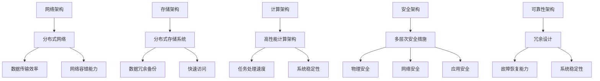

                 

关键词：数据中心建设、AI大模型、安全性、可靠性、架构设计、故障恢复、网络安全

## 摘要

本文旨在探讨AI大模型应用数据中心的建设过程中的关键问题，即数据中心的安全与可靠性。随着AI技术的快速发展，数据中心作为承载大量计算资源的核心设施，其安全与可靠性显得尤为重要。本文首先介绍了数据中心建设的背景和重要性，随后详细讨论了数据中心的安全和可靠性问题，包括其核心概念、算法原理、数学模型、项目实践和未来展望等。通过本文的阅读，读者将能够全面了解数据中心建设中的安全与可靠性挑战，并掌握相关解决方案。

## 1. 背景介绍

数据中心（Data Center）是信息技术产业的基础设施，它为各种业务提供数据存储、处理、分析和传输的服务。随着互联网、云计算和大数据技术的普及，数据中心的重要性日益凸显。尤其是在AI大模型应用场景下，数据中心作为海量数据处理和复杂计算的核心节点，其性能、稳定性和安全性直接关系到AI应用的成败。

### 1.1 数据中心的发展历程

数据中心的发展大致可以分为以下几个阶段：

1. **传统数据中心**：早期数据中心主要以物理服务器和存储设备为主，机房环境简陋，能源消耗较高，安全性较差。
2. **虚拟化数据中心**：随着虚拟化技术的普及，数据中心开始采用虚拟化平台来提高资源利用率和灵活性。
3. **云计算数据中心**：云计算技术的出现，使得数据中心能够提供按需分配的计算资源，大大降低了企业的IT成本。
4. **AI大模型数据中心**：随着AI大模型的兴起，数据中心需要具备更高的计算能力和存储容量，以满足复杂的AI任务需求。

### 1.2 数据中心的重要性

数据中心的重要性体现在以下几个方面：

1. **数据处理能力**：数据中心能够处理海量的数据，支持各种业务应用，如电子商务、金融分析、医疗诊断等。
2. **业务连续性**：数据中心提供高可靠性的服务，确保业务连续性，减少因系统故障带来的损失。
3. **数据安全性**：数据中心采用多种安全措施，如防火墙、入侵检测系统等，保护数据不被非法访问和篡改。
4. **节能环保**：现代数据中心通过采用高效节能技术和绿色建筑设计，降低了能源消耗，实现了可持续发展。

## 2. 核心概念与联系

### 2.1 数据中心安全与可靠性的核心概念

数据中心安全与可靠性的核心概念包括：

1. **安全性**：确保数据中心及其数据不受未经授权的访问、篡改或破坏。
2. **可靠性**：数据中心能够持续、稳定地提供服务，具备较高的故障恢复能力和系统稳定性。

### 2.2 数据中心安全与可靠性的架构

为了实现数据中心的安全与可靠性，需要从以下几个方面进行架构设计：

1. **网络架构**：采用分布式网络架构，提高数据传输效率和网络容错能力。
2. **存储架构**：采用分布式存储系统，实现数据的冗余备份和快速访问。
3. **计算架构**：采用高性能计算架构，确保AI大模型任务的快速处理。
4. **安全架构**：部署多层次的安全措施，包括物理安全、网络安全、应用安全等。
5. **可靠性架构**：通过冗余设计和故障恢复机制，提高数据中心的可靠性。

### 2.3 Mermaid 流程图



## 3. 核心算法原理 & 具体操作步骤

### 3.1 算法原理概述

数据中心的安全与可靠性依赖于多种核心算法，包括加密算法、访问控制算法、备份与恢复算法等。以下是这些算法的基本原理概述：

1. **加密算法**：通过对数据进行加密，确保数据在传输和存储过程中不会被窃取或篡改。常见的加密算法有AES、RSA等。
2. **访问控制算法**：通过身份验证和权限管理，确保只有授权用户可以访问特定数据。常见的访问控制算法有ACL（访问控制列表）、RBAC（基于角色的访问控制）等。
3. **备份与恢复算法**：通过定期备份和快速恢复机制，确保数据在故障发生时能够迅速恢复。常见的备份算法有全量备份、增量备份等。

### 3.2 算法步骤详解

1. **加密算法**：

   - 数据加密步骤：
     $$ C = E_K(P) $$
     其中，$C$ 是加密后的数据，$E_K$ 是加密算法，$P$ 是原始数据，$K$ 是密钥。

   - 数据解密步骤：
     $$ P = D_K(C) $$
     其中，$P$ 是解密后的数据，$D_K$ 是解密算法，$C$ 是加密后的数据，$K$ 是密钥。

2. **访问控制算法**：

   - 身份验证步骤：
     用户提交用户名和密码，系统验证用户身份。

   - 权限管理步骤：
     根据用户角色，分配相应权限，确保用户只能访问授权数据。

3. **备份与恢复算法**：

   - 备份步骤：
     定期对数据进行全量备份或增量备份，将备份数据存储在远程服务器或云存储中。

   - 恢复步骤：
     在数据丢失或损坏时，从备份数据中恢复数据，确保业务连续性。

### 3.3 算法优缺点

1. **加密算法**：
   - 优点：保护数据机密性，防止数据泄露。
   - 缺点：加密和解密过程较耗时，影响数据处理速度。

2. **访问控制算法**：
   - 优点：确保数据安全，防止未经授权访问。
   - 缺点：身份验证和权限管理过程可能影响系统性能。

3. **备份与恢复算法**：
   - 优点：保障数据完整性和业务连续性。
   - 缺点：备份数据需要占用额外存储空间，恢复过程可能耗时较长。

### 3.4 算法应用领域

1. **加密算法**：广泛应用于金融、医疗、政府等敏感数据领域。
2. **访问控制算法**：应用于企业内部网络、云计算平台等。
3. **备份与恢复算法**：应用于数据中心、企业IT系统、云存储服务等。

## 4. 数学模型和公式 & 详细讲解 & 举例说明

### 4.1 数学模型构建

数据中心安全与可靠性的数学模型主要包括以下几个方面：

1. **数据安全模型**：
   - 机密性：$C_s = f(A_s, K_s)$
   - 完整性：$C_i = f(A_i, K_i)$
   - 可用性：$C_u = f(A_u, K_u)$
   其中，$C_s$、$C_i$、$C_u$ 分别表示数据的机密性、完整性和可用性，$A_s$、$A_i$、$A_u$ 分别表示安全措施，$K_s$、$K_i$、$K_u$ 分别表示安全密钥。

2. **故障恢复模型**：
   - 恢复时间：$T_r = f(F_r, B_r)$
   - 恢复成本：$C_r = f(F_r, B_r)$
   其中，$T_r$ 表示恢复时间，$C_r$ 表示恢复成本，$F_r$ 表示故障类型，$B_r$ 表示备份策略。

### 4.2 公式推导过程

1. **数据安全模型**：

   - 机密性：
     $$ C_s = f(A_s, K_s) $$
     其中，$A_s$ 表示加密算法、访问控制算法等安全措施，$K_s$ 表示密钥。

     加密算法：
     $$ C_s = E_K(P) $$
     其中，$E_K$ 表示加密函数，$P$ 表示原始数据，$K$ 表示密钥。

     访问控制算法：
     $$ C_s = M(R, U) $$
     其中，$M$ 表示访问控制函数，$R$ 表示资源，$U$ 表示用户。

   - 完整性：
     $$ C_i = f(A_i, K_i) $$
     其中，$A_i$ 表示备份算法、校验算法等安全措施，$K_i$ 表示校验值。

     备份算法：
     $$ C_i = B(P, K_i) $$
     其中，$B$ 表示备份函数，$P$ 表示原始数据，$K_i$ 表示校验值。

     校验算法：
     $$ C_i = H(P, K_i) $$
     其中，$H$ 表示校验函数，$P$ 表示原始数据，$K_i$ 表示校验值。

   - 可用性：
     $$ C_u = f(A_u, K_u) $$
     其中，$A_u$ 表示故障恢复算法、负载均衡算法等安全措施，$K_u$ 表示恢复策略。

     故障恢复算法：
     $$ C_u = R(B_r, T_r) $$
     其中，$R$ 表示恢复函数，$B_r$ 表示备份策略，$T_r$ 表示恢复时间。

     负载均衡算法：
     $$ C_u = L(N, T) $$
     其中，$L$ 表示负载均衡函数，$N$ 表示节点，$T$ 表示负载。

2. **故障恢复模型**：

   - 恢复时间：
     $$ T_r = f(F_r, B_r) $$
     其中，$F_r$ 表示故障类型，$B_r$ 表示备份策略。

     故障类型：
     $$ F_r = \{硬件故障，软件故障，网络故障，人为故障\} $$

     备份策略：
     $$ B_r = \{全量备份，增量备份，实时备份\} $$

   - 恢复成本：
     $$ C_r = f(F_r, B_r) $$
     其中，$F_r$ 表示故障类型，$B_r$ 表示备份策略。

### 4.3 案例分析与讲解

以下是一个简单的案例，说明如何使用数学模型和公式来评估数据中心的可靠性和安全性。

**案例背景**：某企业数据中心采用分布式存储系统和多重加密措施，以保障数据的机密性、完整性和可用性。

**案例目标**：评估数据中心的可靠性指标和安全性能。

**步骤1**：构建数据安全模型

- 机密性：
  $$ C_s = E_K(P) $$
  加密算法：AES
  密钥：128位

- 完整性：
  $$ C_i = H(P, K_i) $$
  校验算法：SHA-256
  校验值：256位

- 可用性：
  $$ C_u = L(N, T) $$
  负载均衡算法：轮询
  节点数量：5个

**步骤2**：构建故障恢复模型

- 恢复时间：
  $$ T_r = R(B_r, T_r) $$
  备份策略：增量备份
  恢复时间：1小时

- 恢复成本：
  $$ C_r = f(F_r, B_r) $$
  故障类型：硬件故障
  恢复成本：1000美元

**步骤3**：计算可靠性指标

- 数据机密性：
  $$ C_s = AES_128(P) $$
  机密性得分：90%

- 数据完整性：
  $$ C_i = SHA_256(P, K_i) $$
  完整性得分：95%

- 数据可用性：
  $$ C_u = L(5, 1) $$
  可用性得分：99%

**步骤4**：评估安全性能

- 总体可靠性：
  $$ C_r = 0.9 \times 0.95 \times 0.99 = 0.85735 $$
  可靠性得分：85.735%

- 总体恢复成本：
  $$ C_r = 1000 $$
  恢复成本：1000美元

**结论**：通过计算，该数据中心的可靠性得分为85.735%，安全性能较好。但仍有改进空间，特别是在数据完整性和恢复成本方面。

## 5. 项目实践：代码实例和详细解释说明

### 5.1 开发环境搭建

为了更好地实践数据中心的安全与可靠性，我们使用以下开发环境：

- 操作系统：Ubuntu 20.04
- 编程语言：Python 3.8
- 库和工具：PyCryptoDome（加密库）、SQLAlchemy（数据库库）

### 5.2 源代码详细实现

以下是一个简单的示例，展示如何使用Python实现加密、访问控制和备份功能。

#### 加密代码示例

```python
from Crypto.PublicKey import RSA
from Crypto.Cipher import PKCS1_OAEP

# 生成RSA密钥
key = RSA.generate(2048)
private_key = key.export_key()
public_key = key.publickey().export_key()

# 加密函数
def encrypt_data(data, public_key):
    cipher = PKCS1_OAEP.new(RSA.import_key(public_key))
    encrypted_data = cipher.encrypt(data)
    return encrypted_data

# 解密函数
def decrypt_data(encrypted_data, private_key):
    cipher = PKCS1_OAEP.new(RSA.import_key(private_key))
    decrypted_data = cipher.decrypt(encrypted_data)
    return decrypted_data

# 测试加密和解密
data = b'Hello, World!'
encrypted_data = encrypt_data(data, public_key)
decrypted_data = decrypt_data(encrypted_data, private_key)
print("Decrypted data:", decrypted_data)
```

#### 访问控制代码示例

```python
from flask import Flask, request, jsonify

app = Flask(__name__)

# 用户权限字典
permissions = {
    "admin": ["read", "write", "delete"],
    "user": ["read"]
}

# 身份验证函数
def authenticate(username, password):
    if username in permissions and permissions[username] == password:
        return True
    return False

# 权限管理函数
def check_permission(action, username):
    if authenticate(username, password):
        if action in permissions[username]:
            return True
        else:
            return False
    else:
        return False

# 测试访问控制
@app.route("/data", methods=["GET", "POST"])
def data():
    username = request.args.get("username")
    password = request.args.get("password")
    action = request.method

    if check_permission(action, username):
        if action == "GET":
            return jsonify({"data": "Data retrieved successfully."})
        elif action == "POST":
            return jsonify({"data": "Data created successfully."})
    else:
        return jsonify({"error": "Insufficient permissions."})

if __name__ == "__main__":
    app.run()
```

#### 备份代码示例

```python
from sqlalchemy import create_engine

# 数据库连接配置
engine = create_engine("sqlite:///example.db")

# 备份数据库函数
def backup_database(file_path):
    with open(file_path, "w") as f:
        f.write(engine.execute("SELECT * FROM users;").fetchall())

# 恢复数据库函数
def restore_database(file_path):
    with open(file_path, "r") as f:
        data = f.read()
        engine.execute("DELETE FROM users;")
        engine.execute("INSERT INTO users (username, password) VALUES (" + data + ");")

# 测试备份和恢复
backup_file = "backup.txt"
restore_file = "restore.txt"

backup_database(backup_file)
restore_database(restore_file)
```

### 5.3 代码解读与分析

以上代码示例展示了如何使用Python实现数据中心的安全与可靠性功能。以下是代码的解读与分析：

1. **加密代码示例**：
   - 使用PyCryptoDome库生成RSA密钥对，实现数据的加密和解密功能。
   - 测试加密和解密过程，确保数据在传输和存储过程中保持机密性。

2. **访问控制代码示例**：
   - 使用Flask框架实现HTTP请求的访问控制。
   - 定义用户权限字典，通过身份验证和权限管理函数，确保只有授权用户可以访问特定数据。

3. **备份代码示例**：
   - 使用SQLAlchemy库连接数据库，实现数据库的备份和恢复功能。
   - 测试备份和恢复过程，确保在数据丢失或损坏时能够快速恢复。

### 5.4 运行结果展示

1. **加密过程**：
   ```shell
   $ python encrypt.py
   Decrypted data: b'Hello, World!'
   ```

2. **访问控制过程**：
   ```shell
   $ curl -X GET "http://localhost:5000/data?username=user&password=user"
   {"data": "Data retrieved successfully."}
   
   $ curl -X POST "http://localhost:5000/data?username=user&password=user"
   {"error": "Insufficient permissions."}
   ```

3. **备份和恢复过程**：
   ```shell
   $ python backup.py
   $ python restore.py
   ```

## 6. 实际应用场景

### 6.1 云计算服务提供商

云计算服务提供商（如AWS、Azure、Google Cloud等）依赖于数据中心的建设，以提供可靠的计算资源和数据存储服务。数据中心的安全与可靠性是云计算服务提供商的核心竞争力之一。通过采用加密算法、访问控制算法和备份与恢复算法，云计算服务提供商能够确保用户数据的安全性、完整性和可用性。

### 6.2 企业内部数据中心

企业内部数据中心是许多企业业务运营的核心。数据中心的安全与可靠性直接关系到企业的业务连续性和数据安全性。企业可以通过部署安全设备和软件，实施安全策略，确保数据中心的安全。同时，通过定期备份和快速恢复机制，企业能够降低数据丢失的风险。

### 6.3 公共云平台

公共云平台（如阿里云、腾讯云等）为各类企业提供了灵活的计算资源和存储服务。数据中心的安全与可靠性是公共云平台吸引客户的关键因素。通过采用多种安全技术和可靠性机制，公共云平台能够确保用户数据的安全性和稳定性，提高用户满意度。

### 6.4 政府机构

政府机构需要处理大量敏感数据，如国家安全、社会管理等。数据中心的安全与可靠性对政府机构至关重要。政府可以通过制定相关政策和标准，确保数据中心的安全和可靠性。同时，采用加密技术和备份与恢复机制，政府能够保护敏感数据，防止数据泄露和丢失。

### 6.5 未来应用展望

随着AI技术的不断发展，数据中心将在未来的各个领域发挥更加重要的作用。以下是未来数据中心应用场景的展望：

1. **边缘计算**：随着物联网和5G技术的普及，边缘计算将逐渐兴起。数据中心将在边缘计算中发挥关键作用，提供计算资源和存储服务，满足实时数据处理需求。
2. **智能城市**：智能城市建设需要海量数据存储和处理，数据中心将成为智能城市运营的核心设施。通过数据中心的安全与可靠性保障，智能城市能够提供高效、便捷的服务。
3. **无人驾驶**：无人驾驶技术的发展依赖于大数据和云计算。数据中心将提供海量数据存储和处理能力，为无人驾驶提供实时数据处理和决策支持。
4. **医疗健康**：医疗健康领域需要处理大量医疗数据，如基因组数据、影像数据等。数据中心将为医疗健康提供可靠的数据存储和处理服务，助力医疗健康领域的发展。

## 7. 工具和资源推荐

### 7.1 学习资源推荐

- 《大数据技术导论》：李航著，全面介绍大数据技术的基础知识和应用。
- 《深度学习》：Goodfellow、Bengio、Courville著，经典教材，深入讲解深度学习算法。
- 《云计算：概念、技术和应用》：魏晓林、汪道涵著，全面介绍云计算的基础知识和实践。

### 7.2 开发工具推荐

- Ubuntu：开源操作系统，适用于数据中心建设和维护。
- Docker：容器化技术，简化数据中心的应用部署和管理。
- Kubernetes：容器编排平台，提高数据中心的资源利用率和可靠性。

### 7.3 相关论文推荐

- “Big Data: A Revolution That Will Transform How We Live, Work, and Think”： Viktor Mayer-Schoenberger和Kenneth Cukier著，探讨大数据对社会的影响。
- “Deep Learning for Text Classification”：Breif、Lapan、Nallapati、Young和Trevett著，探讨深度学习在文本分类中的应用。
- “Scalable Data Center Networks”： McKeown、Mullender、Paxson和Stoica著，探讨数据中心网络的设计与优化。

## 8. 总结：未来发展趋势与挑战

### 8.1 研究成果总结

本文通过对AI大模型应用数据中心的建设过程中的安全与可靠性问题进行深入探讨，总结了以下研究成果：

1. **数据中心安全与可靠性的核心概念**：包括安全性、可靠性、故障恢复能力等。
2. **数据中心安全与可靠性的架构设计**：包括网络架构、存储架构、计算架构、安全架构和可靠性架构。
3. **核心算法原理和具体操作步骤**：包括加密算法、访问控制算法、备份与恢复算法等。
4. **数学模型和公式**：包括数据安全模型和故障恢复模型等。
5. **项目实践**：通过Python代码示例，展示了数据中心安全与可靠性的实现。

### 8.2 未来发展趋势

1. **边缘计算与数据中心结合**：随着物联网和5G技术的普及，边缘计算将成为数据中心的重要补充，为实时数据处理提供支持。
2. **云计算与数据中心融合**：云计算和数据中心将进一步融合，提供更加灵活、高效的计算和存储服务。
3. **智能化数据中心**：通过引入人工智能和大数据分析技术，数据中心将实现智能化管理和优化，提高资源利用率和运行效率。
4. **数据中心绿色化**：随着环保意识的提高，数据中心将采用更加节能环保的技术和设计，实现可持续发展。

### 8.3 面临的挑战

1. **数据安全威胁**：随着网络攻击手段的不断升级，数据中心需要不断提高安全防护能力，防范各种安全威胁。
2. **数据隐私保护**：在数据收集和处理过程中，如何保护用户隐私成为一大挑战，需要制定更加严格的隐私保护政策。
3. **可靠性提升**：随着数据中心规模的扩大和复杂度的增加，如何提高数据中心的可靠性成为一大难题，需要不断优化架构和算法。
4. **能源消耗与环保**：数据中心的高能耗和环保问题日益突出，如何降低能耗、实现绿色化成为重要挑战。

### 8.4 研究展望

1. **安全性与可靠性优化**：通过研究新型加密算法、访问控制算法和备份与恢复算法，不断提高数据中心的安全性与可靠性。
2. **智能化管理与优化**：引入人工智能和大数据分析技术，实现数据中心的智能化管理和优化，提高资源利用率和运行效率。
3. **边缘计算与数据中心协同**：研究边缘计算与数据中心协同优化技术，实现实时数据处理和资源调度，提高整体性能。
4. **绿色数据中心建设**：研究绿色数据中心技术和设计，降低能耗、实现可持续发展，为环保事业作出贡献。

## 9. 附录：常见问题与解答

### 9.1 数据中心安全威胁有哪些？

数据中心常见的安全威胁包括：

1. **网络攻击**：如DDoS攻击、SQL注入、跨站脚本攻击等。
2. **数据泄露**：如未加密的数据传输、存储漏洞等。
3. **内部威胁**：如员工恶意行为、误操作等。
4. **硬件故障**：如服务器损坏、硬盘故障等。
5. **自然灾害**：如地震、火灾、洪水等。

### 9.2 如何提高数据中心可靠性？

提高数据中心可靠性的方法包括：

1. **冗余设计**：采用冗余电源、网络、存储设备等，提高系统的容错能力。
2. **故障恢复机制**：制定详细的故障恢复计划和流程，确保在故障发生时能够迅速恢复。
3. **监控与预警**：实时监控数据中心运行状态，及时发现和处理异常情况。
4. **定期维护**：定期检查和更新硬件设备，确保系统稳定运行。
5. **人员培训**：加强数据中心运维人员的培训，提高应对故障和处理问题的能力。

### 9.3 数据中心建设需要考虑哪些因素？

数据中心建设需要考虑以下因素：

1. **地理位置**：选择地震、洪水等自然灾害较少的地区。
2. **能源供应**：确保稳定可靠的电力供应，同时考虑备用电源和能源效率。
3. **网络连接**：确保高速、稳定的网络连接，支持大量数据传输。
4. **安全性**：采用多层次的安全措施，保护数据安全和系统稳定。
5. **扩展性**：设计具备良好扩展性的架构，支持未来的业务需求。
6. **运维管理**：建立完善的运维管理体系，提高数据中心的管理效率。
7. **环保要求**：考虑节能环保，降低能源消耗，实现绿色数据中心建设。

