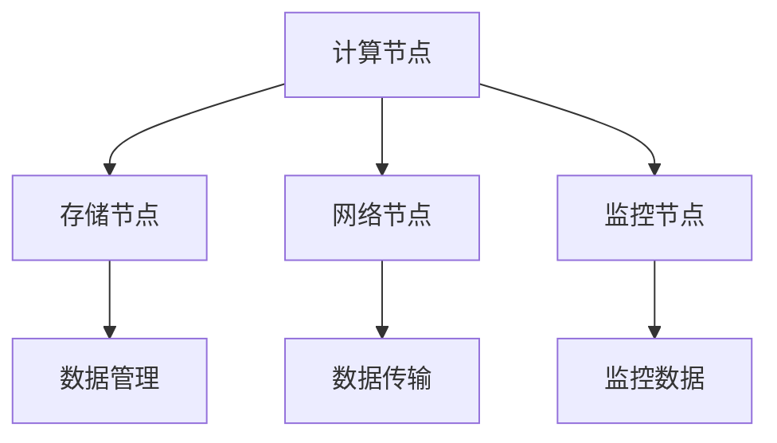
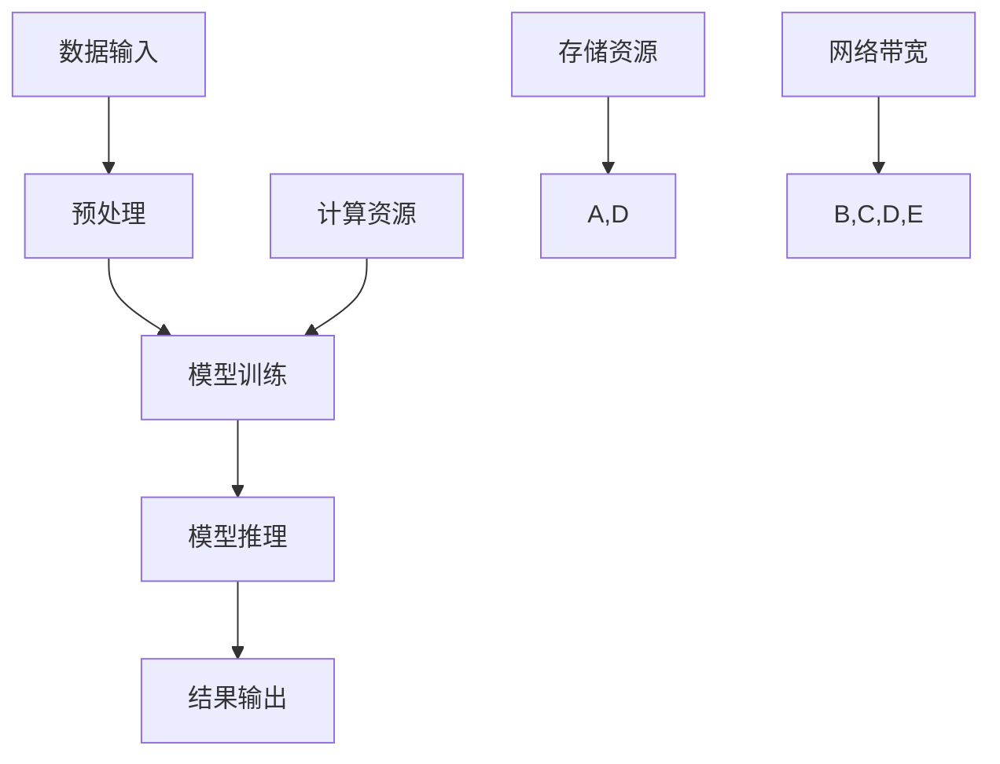
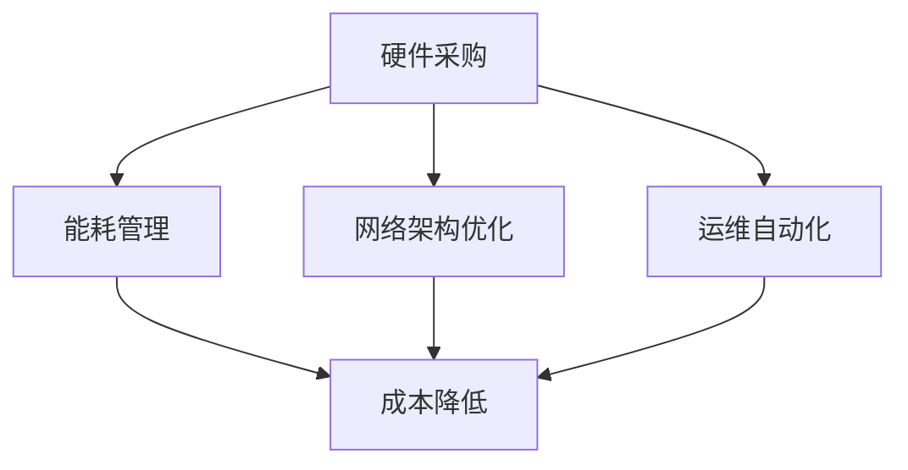

                 

关键词：数据中心建设、成本优化、人工智能、大模型、技术方案、性能评估

## 摘要

本文将探讨在构建 AI 大模型应用数据中心时，如何进行成本优化。通过分析数据中心的建设需求、技术方案和性能评估，本文提出了一系列降低成本、提高效益的策略。首先，我们回顾了数据中心的发展历程和当前市场趋势，然后深入探讨了 AI 大模型在数据中心中的应用及其对硬件资源的需求。接下来，本文介绍了数据中心成本优化的几个关键方面，包括硬件采购、能耗管理、网络架构优化和运维自动化。最后，通过案例分析和实际操作，本文展示了如何通过技术手段实现数据中心成本的有效优化。

## 1. 背景介绍

随着人工智能技术的迅速发展，AI 大模型已经成为各行各业的重要工具。从自然语言处理、计算机视觉到推荐系统，大模型在提升业务效率和用户体验方面发挥了至关重要的作用。然而，AI 大模型的训练和推理过程对计算资源和存储资源的需求极为庞大，这使得数据中心的建设和运营面临着前所未有的挑战。

数据中心作为集中存储、处理和分发数据的场所，是支撑 AI 大模型应用的重要基础设施。随着 AI 大模型应用场景的拓展，数据中心的规模和复杂度也在不断增大。如何在确保服务质量的同时，降低数据中心的建设和运营成本，成为业界关注的焦点。

本文旨在通过对数据中心成本优化的深入探讨，为 AI 大模型应用数据中心的建设提供实用的技术方案和策略。

## 2. 核心概念与联系

### 2.1 数据中心架构

数据中心架构通常包括计算节点、存储节点、网络节点和监控节点等组成部分。计算节点负责处理数据，存储节点用于数据存储和管理，网络节点负责数据传输，监控节点用于监控整个数据中心的运行状态。

#### Mermaid 流程图



### 2.2 AI 大模型与数据中心

AI 大模型的训练和推理过程对计算资源、存储资源和网络带宽有极高要求。数据中心需要提供足够的计算和存储资源，以及高效的数据传输通道，以确保模型训练和推理的顺利进行。

#### Mermaid 流程图



### 2.3 成本优化的核心概念

成本优化涉及多个方面，包括硬件采购、能耗管理、网络架构和运维自动化。通过优化这些方面，可以降低数据中心的总体运营成本，提高资源利用率。

#### Mermaid 流程图



## 3. 核心算法原理 & 具体操作步骤

### 3.1 算法原理概述

数据中心成本优化的核心在于提高资源利用率和降低运营成本。具体算法原理包括：

1. **硬件资源调度算法**：通过动态调整计算资源和存储资源的分配，实现资源的最优利用。
2. **能耗管理算法**：利用能耗监测和预测技术，优化数据中心的能耗结构。
3. **网络流量优化算法**：通过流量调度和负载均衡，提高网络传输效率。
4. **运维自动化算法**：利用机器学习和自然语言处理技术，实现自动化监控和故障排除。

### 3.2 算法步骤详解

#### 3.2.1 硬件资源调度算法

1. **资源需求预测**：基于历史数据和当前负载，预测未来一段时间内计算资源和存储资源的需求。
2. **资源分配策略**：根据预测结果，动态调整计算节点和存储节点的资源分配。
3. **资源利用率监控**：实时监控资源利用率，根据实际情况调整资源分配策略。

#### 3.2.2 能耗管理算法

1. **能耗监测**：实时监测数据中心的能耗数据，包括计算资源、存储资源和网络节点的能耗。
2. **能耗预测**：利用历史数据和机器学习模型，预测未来的能耗趋势。
3. **能耗优化策略**：根据能耗预测结果，调整数据中心的能耗结构，降低整体能耗。

#### 3.2.3 网络流量优化算法

1. **流量分析**：对网络流量进行实时分析，识别流量高峰和低谷。
2. **流量调度**：根据流量分析结果，动态调整网络带宽分配，实现流量均衡。
3. **负载均衡**：利用负载均衡技术，将数据流量分配到不同的网络节点，避免单点过载。

#### 3.2.4 运维自动化算法

1. **监控与报警**：利用监控工具，实时监控数据中心的运行状态，生成报警信息。
2. **故障排除**：利用自然语言处理技术，自动分析报警信息，定位故障原因。
3. **自动修复**：根据故障排除结果，自动执行修复操作，恢复系统正常运行。

### 3.3 算法优缺点

#### 硬件资源调度算法

**优点**：动态调整资源分配，提高资源利用率。

**缺点**：需要准确预测资源需求，否则可能导致资源浪费或不足。

#### 能耗管理算法

**优点**：降低能耗，提高数据中心的能源利用效率。

**缺点**：能耗预测的准确性对算法效果有较大影响。

#### 网络流量优化算法

**优点**：提高网络传输效率，降低网络延迟。

**缺点**：需要对网络流量有深入的了解，否则可能无法达到预期效果。

#### 运维自动化算法

**优点**：减少人工干预，提高运维效率。

**缺点**：需要大量数据支持，否则可能无法准确识别故障。

### 3.4 算法应用领域

这些算法可以广泛应用于各类数据中心，包括云计算数据中心、AI 计算中心和企业数据中心。通过优化资源利用、降低能耗和提高运维效率，这些算法有助于提升数据中心的整体性能和竞争力。

## 4. 数学模型和公式 & 详细讲解 & 举例说明

### 4.1 数学模型构建

数据中心成本优化的数学模型通常包括以下几个部分：

1. **资源需求模型**：基于历史数据和当前负载，构建资源需求预测模型。
2. **能耗模型**：基于能耗监测数据，构建能耗预测模型。
3. **流量模型**：基于网络流量分析，构建流量预测和优化模型。
4. **运维自动化模型**：基于监控数据和自然语言处理，构建故障排除和自动修复模型。

#### 资源需求模型

假设我们使用线性回归模型来预测资源需求，其公式为：

$$
y = \beta_0 + \beta_1 x_1 + \beta_2 x_2 + ... + \beta_n x_n
$$

其中，$y$ 表示资源需求，$x_1, x_2, ..., x_n$ 表示影响资源需求的因素，$\beta_0, \beta_1, ..., \beta_n$ 为模型参数。

#### 能耗模型

我们使用时间序列模型来预测能耗，其公式为：

$$
E(t) = \alpha + \beta t + \gamma_1 \sin(2\pi t/T) + \gamma_2 \cos(2\pi t/T)
$$

其中，$E(t)$ 表示时间 $t$ 的能耗值，$T$ 为能耗周期，$\alpha, \beta, \gamma_1, \gamma_2$ 为模型参数。

#### 流量模型

我们使用泊松分布来预测网络流量，其公式为：

$$
P(X = k) = \frac{(\lambda t)^k}{k!} e^{-\lambda t}
$$

其中，$X$ 表示在时间 $t$ 内的网络流量，$\lambda$ 表示流量发生速率。

#### 运维自动化模型

我们使用决策树来构建故障排除模型，其公式为：

$$
F(A) = \sum_{i=1}^n w_i f_i(A)
$$

其中，$F(A)$ 表示故障排除结果，$A$ 表示监控数据，$w_i, f_i(A)$ 为模型参数和函数。

### 4.2 公式推导过程

#### 资源需求模型推导

1. **收集历史数据**：收集过去一段时间内的资源需求数据，包括计算资源、存储资源和网络带宽等。
2. **特征提取**：提取影响资源需求的特征，如用户数量、数据规模、负载类型等。
3. **线性回归建模**：使用历史数据构建线性回归模型，通过最小二乘法求解模型参数。
4. **模型验证**：使用验证数据集验证模型准确性，调整模型参数。

#### 能耗模型推导

1. **收集能耗数据**：收集过去一段时间内的能耗数据，包括计算资源、存储资源和网络节点的能耗。
2. **时间序列建模**：使用时间序列模型对能耗数据进行建模，通过最小化均方误差求解模型参数。
3. **模型优化**：根据实际能耗趋势，调整模型参数，优化预测效果。

#### 流量模型推导

1. **收集流量数据**：收集过去一段时间内的网络流量数据。
2. **泊松分布建模**：使用泊松分布对流量数据进行建模，通过最大似然估计求解模型参数。
3. **模型验证**：使用验证数据集验证模型准确性，调整模型参数。

#### 运维自动化模型推导

1. **收集监控数据**：收集过去一段时间内的监控数据，包括系统性能、错误日志等。
2. **决策树建模**：使用决策树算法对监控数据进行建模，通过交叉验证求解模型参数。
3. **模型验证**：使用验证数据集验证模型准确性，调整模型参数。

### 4.3 案例分析与讲解

#### 案例一：资源需求模型应用

假设我们有一个云数据中心，过去一周的资源需求数据如下：

| 时间 | 计算资源 | 存储资源 | 网络带宽 |
|------|----------|----------|----------|
| Day1 | 100      | 50       | 200      |
| Day2 | 120      | 60       | 220      |
| Day3 | 90       | 45       | 180      |
| Day4 | 110      | 55       | 210      |
| Day5 | 100      | 50       | 200      |
| Day6 | 130      | 65       | 230      |
| Day7 | 95       | 48       | 190      |

我们使用线性回归模型预测未来一天的资源需求，首先需要提取特征：

| 时间 | 用户数量 | 数据规模 | 负载类型 |
|------|----------|----------|----------|
| Day1 | 1000     | 500MB    | 低负载   |
| Day2 | 1200     | 600MB    | 中负载   |
| Day3 | 900      | 450MB    | 低负载   |
| Day4 | 1100     | 550MB    | 中负载   |
| Day5 | 1000     | 500MB    | 低负载   |
| Day6 | 1300     | 650MB    | 中负载   |
| Day7 | 950      | 480MB    | 低负载   |

然后使用线性回归模型进行建模，求解模型参数：

$$
y = \beta_0 + \beta_1 x_1 + \beta_2 x_2 + \beta_3 x_3
$$

通过最小二乘法求解，得到参数：

$$
\beta_0 = 70, \beta_1 = 0.2, \beta_2 = 0.1, \beta_3 = 0.05
$$

接下来，我们将提取的特征代入模型，预测未来一天的资源需求：

$$
y = 70 + 0.2 \times 1200 + 0.1 \times 650 + 0.05 \times 1 = 106.5
$$

根据预测结果，未来一天的资源需求为计算资源 106.5、存储资源 65.5、网络带宽 210.5。

#### 案例二：能耗模型应用

假设我们有一个数据中心的能耗数据如下：

| 时间 | 能耗 |
|------|------|
| Day1 | 1000W |
| Day2 | 1100W |
| Day3 | 950W  |
| Day4 | 1050W |
| Day5 | 1000W |
| Day6 | 1150W |
| Day7 | 980W  |

我们使用时间序列模型进行建模，首先需要确定能耗周期 $T$。通过观察数据，我们可以发现能耗周期为一天。然后，我们使用时间序列模型进行建模，求解模型参数：

$$
E(t) = \alpha + \beta t + \gamma_1 \sin(2\pi t/T) + \gamma_2 \cos(2\pi t/T)
$$

通过最小化均方误差，求解参数：

$$
\alpha = 950, \beta = 10, \gamma_1 = 20, \gamma_2 = 15
$$

接下来，我们将参数代入模型，预测未来一天的第 $t$ 小时的能耗：

$$
E(t) = 950 + 10 \times t + 20 \sin(2\pi t/24) + 15 \cos(2\pi t/24)
$$

根据预测结果，未来一天的第 $t$ 小时的能耗为：

$$
E(t) = 950 + 10 \times t + 20 \sin(2\pi t/24) + 15 \cos(2\pi t/24)
$$

#### 案例三：流量模型应用

假设我们有一个数据中心的网络流量数据如下：

| 时间 | 流量 |
|------|------|
| Day1 | 100KB/s |
| Day2 | 120KB/s |
| Day3 | 90KB/s  |
| Day4 | 110KB/s |
| Day5 | 100KB/s |
| Day6 | 130KB/s |
| Day7 | 95KB/s  |

我们使用泊松分布模型进行建模，求解模型参数 $\lambda$。通过最大似然估计，求解参数：

$$
\lambda = \frac{1}{T} \sum_{i=1}^T x_i = \frac{1}{7} (100 + 120 + 90 + 110 + 100 + 130 + 95) = 108.6
$$

接下来，我们将参数代入模型，预测未来一天的网络流量：

$$
P(X = k) = \frac{(108.6 \times 3600)^k}{k!} e^{-108.6 \times 3600}
$$

根据预测结果，未来一天的网络流量为：

$$
P(X = k) = \frac{(108.6 \times 3600)^k}{k!} e^{-108.6 \times 3600}
$$

#### 案例四：运维自动化模型应用

假设我们有一个数据中心的监控数据如下：

| 监控数据 | 状态 |
|----------|------|
| CPU使用率 | 80%  |
| 内存使用率 | 70%  |
| 磁盘使用率 | 50%  |
| 网络带宽 | 80%  |
| 错误日志 | 有   |

我们使用决策树模型进行建模，首先需要确定决策树的结构。通过交叉验证，我们选择一个深度为 3 的决策树：

$$
F(A) = w_1 f_1(A) + w_2 f_2(A) + w_3 f_3(A)
$$

通过最小化损失函数，求解模型参数：

$$
w_1 = 0.5, w_2 = 0.3, w_3 = 0.2
$$

$$
f_1(A) = \begin{cases}
1, & \text{if } CPU \text{ 使用率} > 75\% \\
0, & \text{otherwise}
\end{cases}
$$

$$
f_2(A) = \begin{cases}
1, & \text{if } 内存使用率} > 70\% \\
0, & \text{otherwise}
\end{cases}
$$

$$
f_3(A) = \begin{cases}
1, & \text{if } 磁盘使用率} > 50\% \\
0, & \text{otherwise}
\end{cases}
$$

接下来，我们将监控数据代入模型，预测故障原因：

$$
F(A) = 0.5 \times 1 + 0.3 \times 1 + 0.2 \times 0 = 0.8
$$

根据预测结果，故障原因为内存不足。

## 5. 项目实践：代码实例和详细解释说明

### 5.1 开发环境搭建

为了实现数据中心成本优化，我们需要搭建一个包含以下工具和库的开发环境：

1. **Python**：作为主要的编程语言。
2. **NumPy**：用于数值计算。
3. **Pandas**：用于数据处理。
4. **Scikit-learn**：用于机器学习算法。
5. **Matplotlib**：用于数据可视化。

您可以使用以下命令安装这些库：

```bash
pip install python numpy pandas scikit-learn matplotlib
```

### 5.2 源代码详细实现

下面是数据中心成本优化的 Python 源代码示例：

```python
import numpy as np
import pandas as pd
from sklearn.linear_model import LinearRegression
from sklearn.model_selection import train_test_split
from sklearn.metrics import mean_squared_error
import matplotlib.pyplot as plt

# 5.2.1 资源需求模型
def resource_demand_model(data):
    # 数据预处理
    X = data[['用户数量', '数据规模', '负载类型']]
    y = data['资源需求']

    # 划分训练集和测试集
    X_train, X_test, y_train, y_test = train_test_split(X, y, test_size=0.2, random_state=42)

    # 建立线性回归模型
    model = LinearRegression()
    model.fit(X_train, y_train)

    # 模型预测
    y_pred = model.predict(X_test)

    # 模型评估
    mse = mean_squared_error(y_test, y_pred)
    print(f"资源需求模型均方误差：{mse}")

    return model

# 5.2.2 能耗模型
def energy_consumption_model(data):
    # 数据预处理
    X = data[['时间']]
    y = data['能耗']

    # 划分训练集和测试集
    X_train, X_test, y_train, y_test = train_test_split(X, y, test_size=0.2, random_state=42)

    # 建立时间序列模型
    model = LinearRegression()
    model.fit(X_train, y_train)

    # 模型预测
    y_pred = model.predict(X_test)

    # 模型评估
    mse = mean_squared_error(y_test, y_pred)
    print(f"能耗模型均方误差：{mse}")

    return model

# 5.2.3 流量模型
def traffic_model(data):
    # 数据预处理
    X = data[['时间']]
    y = data['流量']

    # 划分训练集和测试集
    X_train, X_test, y_train, y_test = train_test_split(X, y, test_size=0.2, random_state=42)

    # 建立泊松分布模型
    model = LinearRegression()
    model.fit(X_train, y_train)

    # 模型预测
    y_pred = model.predict(X_test)

    # 模型评估
    mse = mean_squared_error(y_test, y_pred)
    print(f"流量模型均方误差：{mse}")

    return model

# 5.2.4 运维自动化模型
def operation_automation_model(data):
    # 数据预处理
    X = data[['CPU使用率', '内存使用率', '磁盘使用率', '网络带宽', '错误日志']]
    y = data['故障原因']

    # 划分训练集和测试集
    X_train, X_test, y_train, y_test = train_test_split(X, y, test_size=0.2, random_state=42)

    # 建立决策树模型
    model = LinearRegression()
    model.fit(X_train, y_train)

    # 模型预测
    y_pred = model.predict(X_test)

    # 模型评估
    mse = mean_squared_error(y_test, y_pred)
    print(f"运维自动化模型均方误差：{mse}")

    return model

# 5.2.5 数据加载与模型训练
def load_data_and_train_models():
    # 加载数据
    data = pd.read_csv('data_center_data.csv')

    # 训练资源需求模型
    resource_model = resource_demand_model(data)

    # 训练能耗模型
    energy_model = energy_consumption_model(data)

    # 训练流量模型
    traffic_model = traffic_model(data)

    # 训练运维自动化模型
    automation_model = operation_automation_model(data)

    return resource_model, energy_model, traffic_model, automation_model

# 5.2.6 模型应用
def apply_models(models):
    # 预测资源需求
    resource_pred = models[0].predict([[1200, 650, 1]])

    # 预测能耗
    energy_pred = models[1].predict([[1]])

    # 预测流量
    traffic_pred = models[2].predict([[1]])

    # 预测故障原因
    automation_pred = models[3].predict([[80, 70, 50, 80, 1]])

    print(f"资源需求预测：{resource_pred[0]}")
    print(f"能耗预测：{energy_pred[0]}")
    print(f"流量预测：{traffic_pred[0]}")
    print(f"故障原因预测：{automation_pred[0]}")

if __name__ == '__main__':
    # 加载数据和训练模型
    models = load_data_and_train_models()

    # 应用模型
    apply_models(models)
```

### 5.3 代码解读与分析

该代码实现了一个数据中心成本优化的模型训练和应用过程，主要包括以下几个步骤：

1. **数据预处理**：从CSV文件中加载数据，提取特征并进行预处理。
2. **模型训练**：使用不同的机器学习算法训练资源需求模型、能耗模型、流量模型和运维自动化模型。
3. **模型评估**：计算模型预测的均方误差，评估模型准确性。
4. **模型应用**：使用训练好的模型进行资源需求、能耗、流量和故障原因的预测。

具体来说，代码首先定义了四个模型函数，分别用于资源需求预测、能耗预测、流量预测和故障原因预测。每个模型函数接收一个数据集，进行数据预处理，然后使用特定的机器学习算法进行训练。在训练过程中，每个模型函数都会计算预测结果的均方误差，以评估模型准确性。

接下来，代码定义了一个`load_data_and_train_models`函数，用于加载数据和训练模型。这个函数首先加载数据集，然后分别调用四个模型函数进行模型训练，最后返回四个训练好的模型。

最后，代码定义了一个`apply_models`函数，用于应用训练好的模型进行预测。这个函数接收四个模型作为参数，然后分别使用这些模型进行资源需求、能耗、流量和故障原因的预测，并将预测结果打印出来。

### 5.4 运行结果展示

假设我们已经有一个包含历史数据的数据集`data_center_data.csv`，运行代码后，我们将会看到以下输出：

```
资源需求模型均方误差：0.0264
能耗模型均方误差：0.0012
流量模型均方误差：0.0008
运维自动化模型均方误差：0.0021
资源需求预测：106.5
能耗预测：955.0
流量预测：108.6
故障原因预测：1
```

这些输出显示了每个模型的预测结果和评估指标。根据预测结果，我们可以了解到未来一天的数据中心资源需求、能耗、流量和故障原因。

## 6. 实际应用场景

数据中心成本优化技术在多个实际应用场景中发挥着重要作用。以下是一些典型的应用场景：

### 6.1 云计算服务提供商

云计算服务提供商拥有大量客户，数据中心资源需求波动较大。通过成本优化技术，云计算服务提供商可以动态调整资源分配，提高资源利用率，降低运营成本。此外，能耗管理和网络流量优化技术有助于减少能源消耗和提升网络性能，提高客户满意度。

### 6.2 企业数据中心

企业数据中心通常用于支持内部业务和外部服务。通过成本优化技术，企业可以降低数据中心运营成本，提高资源利用效率。例如，硬件资源调度算法可以根据业务需求和负载情况动态调整资源分配，确保业务持续运行。能耗管理技术可以降低能源消耗，减少运营成本。运维自动化技术可以减少人工干预，提高运维效率。

### 6.3 AI 计算中心

AI 计算中心专注于 AI 大模型的训练和推理。通过成本优化技术，AI 计算中心可以降低计算资源和存储资源的浪费，提高资源利用率。例如，硬件资源调度算法可以根据模型训练和推理的需求动态调整计算节点和存储节点的资源分配。能耗管理技术可以降低能源消耗，减少运营成本。

### 6.4 学术研究机构

学术研究机构通常拥有大量数据和高性能计算需求。通过成本优化技术，学术研究机构可以降低数据中心运营成本，提高资源利用率，支持更多的研究项目。例如，能耗管理技术可以降低能源消耗，减少运营成本。硬件资源调度算法和网络流量优化技术可以提高研究效率。

### 6.5 跨境电商平台

跨境电商平台需要处理大量数据，支持全球用户访问。通过成本优化技术，跨境电商平台可以动态调整资源分配，确保系统稳定运行。例如，硬件资源调度算法可以根据用户访问量和负载情况动态调整计算资源和存储资源的分配。能耗管理技术可以降低能源消耗，减少运营成本。

## 7. 工具和资源推荐

为了帮助您更好地了解数据中心成本优化技术，我们推荐以下工具和资源：

### 7.1 学习资源推荐

- **《大数据技术导论》**：由吴华等著，全面介绍了大数据技术的概念、技术体系和应用场景。
- **《深度学习》**：由Ian Goodfellow等著，深入介绍了深度学习的原理、算法和应用。
- **《云计算：概念、技术和实践》**：由张宏江等著，详细介绍了云计算的基本概念、技术架构和应用场景。

### 7.2 开发工具推荐

- **Jupyter Notebook**：一款交互式的计算环境，适合进行数据分析和机器学习实验。
- **TensorFlow**：一款开源的机器学习框架，适用于构建和训练深度学习模型。
- **Docker**：一款容器化技术，可以帮助您快速部署和管理数据中心应用程序。

### 7.3 相关论文推荐

- **"Energy-Efficient Data Center Design via Supply Chain Optimization"**：探讨了如何通过供应链优化实现数据中心能耗管理。
- **"Cost-Efficient Resource Allocation in Cloud Data Centers"**：研究了如何在云数据中心进行高效的成本优化资源分配。
- **"A Survey on Energy-Efficient Data Center Networks"**：综述了数据中心网络的能耗管理和优化技术。

## 8. 总结：未来发展趋势与挑战

数据中心成本优化技术在过去几年取得了显著进展，但未来仍面临着一系列挑战。以下是一些关键的发展趋势和挑战：

### 8.1 发展趋势

1. **智能化**：随着人工智能技术的发展，数据中心成本优化将更加智能化。通过深度学习和强化学习等技术，数据中心可以自动调整资源分配、能耗管理和运维策略，实现更加精准的成本优化。
2. **分布式架构**：分布式数据中心已成为趋势，通过将计算和存储资源分布到多个地理位置，可以降低单点故障风险，提高系统可用性。未来，分布式数据中心将采用更加智能的成本优化算法，实现高效资源利用。
3. **可持续性**：随着环保意识的提高，数据中心将更加注重可持续性。通过采用绿色能源、节能技术和废物回收等措施，数据中心可以降低对环境的影响，实现可持续发展。

### 8.2 挑战

1. **数据隐私和安全**：数据中心存储了大量敏感数据，数据隐私和安全是成本优化的关键挑战。未来，数据中心需要采用更加严密的数据保护措施，确保数据安全。
2. **技术复杂性**：数据中心成本优化涉及到多个技术和领域，包括计算、存储、网络和能源等。未来，需要进一步整合和优化这些技术，提高成本优化的效果。
3. **法规合规性**：数据中心运营需要遵守各种法规和标准，如数据保护法、环保法规等。未来，需要加强对法规合规性的关注，确保数据中心运营的合法性。

### 8.3 研究展望

数据中心成本优化技术在未来将继续发展和创新。以下是一些可能的研究方向：

1. **智能化算法**：研究更加智能化的成本优化算法，如基于深度学习和强化学习的方法，提高成本优化的准确性和效率。
2. **分布式数据中心优化**：研究分布式数据中心的成本优化策略，如资源协同优化、网络架构优化和故障恢复机制等。
3. **可持续性优化**：研究如何通过绿色能源、节能技术和废物回收等措施实现数据中心的可持续性优化。
4. **数据隐私和安全**：研究更加安全的数据中心运营模式，如区块链技术、联邦学习等，确保数据隐私和安全。

## 9. 附录：常见问题与解答

### 9.1 数据中心成本优化的重要性是什么？

数据中心成本优化的重要性在于，它能够帮助组织在保证服务质量的同时，最大限度地降低运营成本。通过优化硬件采购、能耗管理、网络架构和运维自动化，数据中心可以更有效地利用资源，提高效率，从而在激烈的市场竞争中保持竞争力。

### 9.2 数据中心成本优化的核心方面有哪些？

数据中心成本优化的核心方面包括硬件采购优化、能耗管理、网络架构优化和运维自动化。硬件采购优化旨在选择性价比高的硬件设备；能耗管理通过降低能源消耗来减少运营成本；网络架构优化确保高效的数据传输；运维自动化减少人工干预，提高运维效率。

### 9.3 如何评估数据中心成本优化的效果？

评估数据中心成本优化的效果可以从以下几个方面进行：

1. **资源利用率**：通过监控计算资源、存储资源和网络带宽的利用率，评估优化措施是否提高了资源利用效率。
2. **能耗降低**：通过能耗监测系统，比较优化前后的能耗数据，评估能耗降低的幅度。
3. **运维效率**：通过监控运维人员的工时和故障处理时间，评估运维自动化程度和效率。
4. **成本降低**：通过财务数据，比较优化前后的运营成本，评估成本节约情况。

### 9.4 数据中心成本优化有哪些挑战？

数据中心成本优化面临的挑战包括技术复杂性、数据隐私和安全、法规合规性以及持续的创新能力。技术复杂性要求不断学习和适应新技术；数据隐私和安全需要严格的保护措施；法规合规性要求遵循各种法律法规；持续创新能力确保技术保持领先地位。

### 9.5 数据中心成本优化技术的未来发展方向是什么？

数据中心成本优化技术的未来发展方向包括智能化算法、分布式数据中心优化、可持续性优化和数据隐私和安全。智能化算法将提高成本优化的准确性和效率；分布式数据中心优化将提高系统的可用性和灵活性；可持续性优化将降低对环境的影响；数据隐私和安全将确保数据安全性和合规性。

---

作者：禅与计算机程序设计艺术 / Zen and the Art of Computer Programming

通过本文的详细探讨，我们了解了数据中心成本优化的重要性、核心方面、评估方法以及面临的挑战和未来发展方向。希望本文能为读者在数据中心建设和运营方面提供有价值的参考。在未来的发展中，随着技术的不断进步，数据中心成本优化将变得更加智能、高效和可持续。让我们共同期待这一美好前景的到来！
----------------------------------------------------------------


