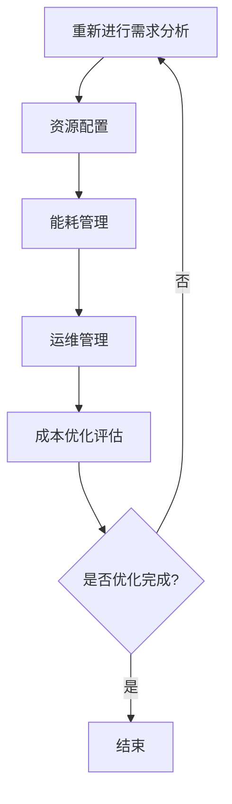

                 

## 1. 背景介绍

近年来，人工智能（AI）技术飞速发展，特别是大规模预训练模型（Large-scale Pre-trained Models，LPMs）的出现，如GPT-3、BERT、LLaMA等，使得自然语言处理、计算机视觉、语音识别等领域的性能得到了显著提升。然而，这些大模型的应用对计算资源的需求也随之剧增。数据中心作为AI大模型应用的核心基础设施，其建设和管理水平直接影响到AI应用的效率、可靠性和成本。

数据中心成本优化是当前数据中心建设和管理中的一个重要课题。优化数据中心成本不仅有助于提高企业的盈利能力，还可以减少对环境的影响。本文将围绕AI大模型应用数据中心建设的成本优化进行探讨，从多个角度分析优化数据中心成本的策略和方法。

本文将分为以下几个部分：

- **背景介绍**：介绍人工智能大模型的发展及其对数据中心建设的影响。
- **核心概念与联系**：阐述数据中心成本优化相关的核心概念和架构。
- **核心算法原理与具体操作步骤**：详细讲解数据中心成本优化的核心算法原理和具体操作步骤。
- **数学模型和公式**：介绍数据中心成本优化的数学模型和公式，并进行案例分析与讲解。
- **项目实践**：通过代码实例详细解释说明数据中心成本优化的实践应用。
- **实际应用场景**：分析数据中心成本优化的实际应用场景和未来展望。
- **工具和资源推荐**：推荐学习资源和开发工具。
- **总结与展望**：总结研究成果，展望数据中心成本优化的未来发展趋势与挑战。

通过本文的探讨，希望能够为读者提供关于数据中心成本优化的一些实用见解和指导。

## 2. 核心概念与联系

在探讨数据中心成本优化之前，我们需要了解一些核心概念和架构，这些概念和架构对于理解数据中心成本优化策略和方法至关重要。

### 数据中心成本优化相关核心概念

1. **计算资源**：数据中心的基础资源，包括CPU、GPU、内存、存储等。
2. **能耗**：数据中心运行过程中产生的电能消耗。
3. **空间占用**：数据中心物理空间的占用。
4. **运维成本**：数据中心日常运营和管理所产生的成本。
5. **可靠性**：数据中心提供的服务的稳定性和可靠性。

### 数据中心成本优化相关架构

1. **计算架构**：包括计算节点、存储节点和网络节点等。
2. **能耗管理架构**：包括能源供应、能源分配和能源回收等。
3. **运维管理架构**：包括监控、维护、故障处理等。

### 数据中心成本优化相关流程

1. **需求分析**：根据业务需求确定数据中心所需的计算资源、存储容量和能耗等。
2. **资源配置**：根据需求分析结果，合理分配计算资源、存储资源和网络资源。
3. **能耗管理**：通过能耗监测和优化策略，降低数据中心的电能消耗。
4. **运维管理**：通过监控和运维流程，确保数据中心的稳定运行。

### Mermaid 流程图

以下是一个简单的Mermaid流程图，展示了数据中心成本优化的核心概念和流程：



通过上述核心概念和流程的介绍，我们可以更好地理解数据中心成本优化的具体实现。接下来，我们将详细探讨数据中心成本优化的核心算法原理与具体操作步骤。

## 3. 核心算法原理与具体操作步骤

数据中心成本优化的核心算法原理可以归结为以下几个方面：

1. **资源调度优化**：通过算法动态分配和调整计算资源，以最小化运行成本。
2. **能耗管理优化**：通过能耗监测和优化策略，降低数据中心的电能消耗。
3. **运维流程优化**：通过自动化工具和流程优化，减少运维成本和提高数据中心运行效率。

### 3.1 算法原理概述

1. **资源调度优化**：基于最小费用最大服务（Minimum Cost Maximum Service，MCMS）原理，通过构建数学模型，求解最优资源分配方案。
2. **能耗管理优化**：采用动态能耗调整（Dynamic Energy Adjustment，DEA）算法，根据负载情况实时调整能耗配置。
3. **运维流程优化**：利用机器学习技术，对运维数据进行分析和预测，优化运维流程和故障处理。

### 3.2 算法步骤详解

#### 资源调度优化步骤

1. **构建数学模型**：根据业务需求和现有资源，构建资源调度优化模型。
   $$ \text{Minimize} \, C(x) = \sum_{i=1}^{n} c_{i} \cdot x_{i} $$
   其中，$C(x)$ 为总成本，$c_{i}$ 为第 $i$ 个资源单位的价格，$x_{i}$ 为分配给第 $i$ 个任务的资源量。

2. **求解最优解**：利用线性规划（Linear Programming，LP）算法求解最优资源分配方案。

3. **动态调整**：根据任务执行过程中的实际情况，动态调整资源分配。

#### 能耗管理优化步骤

1. **能耗监测**：实时监测数据中心的能耗情况。

2. **构建能耗模型**：根据监测数据，构建能耗预测模型。
   $$ E(t) = f(P(t), T(t)) $$
   其中，$E(t)$ 为 $t$ 时刻的能耗，$P(t)$ 为 $t$ 时刻的负载，$T(t)$ 为 $t$ 时刻的温度。

3. **能耗调整**：根据能耗模型，动态调整能耗配置，以降低总能耗。

#### 运维流程优化步骤

1. **数据收集**：收集运维数据，包括故障数据、维护记录、性能数据等。

2. **构建预测模型**：利用机器学习技术，对运维数据进行预测分析。

3. **流程优化**：根据预测结果，优化运维流程，减少故障处理时间和运维成本。

### 3.3 算法优缺点

#### 资源调度优化算法

- **优点**：可以有效地降低数据中心运行成本。
- **缺点**：对任务执行的时间窗口要求较高，需要实时监测任务状态。

#### 能耗管理优化算法

- **优点**：可以显著降低数据中心的能源消耗，提高能源利用效率。
- **缺点**：能耗模型的准确性对优化效果有较大影响，需要大量数据支持。

#### 运维流程优化算法

- **优点**：可以提高运维效率，减少故障处理时间。
- **缺点**：需要专业的机器学习知识，对运维人员的要求较高。

### 3.4 算法应用领域

1. **数据中心建设**：用于优化数据中心资源配置和能耗管理，降低建设成本。
2. **云计算平台**：用于优化云计算平台资源调度和能耗管理，提高服务质量和效率。
3. **边缘计算**：用于优化边缘计算节点资源分配和能耗管理，提高边缘计算效率。

通过上述算法原理和具体操作步骤的详细讲解，我们可以更好地理解数据中心成本优化的实施过程。接下来，我们将介绍数据中心成本优化的数学模型和公式。

## 4. 数学模型和公式

数据中心成本优化的数学模型和公式是进行成本计算和分析的基础。以下是几个关键的数学模型和公式的详细讲解，以及具体的案例分析与讲解。

### 4.1 数学模型构建

#### 成本函数模型

数据中心的总成本函数可以表示为：
$$ C(x) = \sum_{i=1}^{n} c_{i} \cdot x_{i} + e_{i} \cdot y_{i} $$
其中，$C(x)$ 是总成本，$c_{i}$ 是第 $i$ 个资源单位的价格（如CPU、GPU、内存等），$x_{i}$ 是分配给第 $i$ 个任务的资源量，$e_{i}$ 是第 $i$ 个资源的能耗成本（单位为每单位资源的能耗费用），$y_{i}$ 是第 $i$ 个资源的能耗量。

#### 能耗优化模型

能耗优化模型可以表示为：
$$ E(y) = \sum_{i=1}^{n} e_{i} \cdot y_{i} $$
其中，$E(y)$ 是总能耗，$e_{i}$ 是第 $i$ 个资源的能耗成本，$y_{i}$ 是第 $i$ 个资源的能耗量。

#### 资源利用率模型

资源利用率模型可以表示为：
$$ U(x) = \frac{\sum_{i=1}^{n} x_{i}}{\sum_{i=1}^{n} x_{\text{max}}_{i}} $$
其中，$U(x)$ 是资源利用率，$x_{i}$ 是实际分配给第 $i$ 个任务的资源量，$x_{\text{max}}_{i}$ 是第 $i$ 个任务的最大需求资源量。

### 4.2 公式推导过程

#### 成本函数推导

成本函数是从资源价格和能耗成本的角度来考虑的。资源价格是已知的，而能耗成本可以通过能耗监测数据和单位能耗成本来计算。因此，成本函数可以推导为：
$$ C(x) = \sum_{i=1}^{n} c_{i} \cdot x_{i} + e_{i} \cdot y_{i} $$
其中，$c_{i} \cdot x_{i}$ 表示资源成本，$e_{i} \cdot y_{i}$ 表示能耗成本。

#### 能耗函数推导

能耗函数是从能耗监测数据和单位能耗成本的角度来考虑的。因此，能耗函数可以推导为：
$$ E(y) = \sum_{i=1}^{n} e_{i} \cdot y_{i} $$
其中，$e_{i} \cdot y_{i}$ 表示第 $i$ 个资源的能耗量。

#### 资源利用率推导

资源利用率是从资源分配和使用率的角度来考虑的。因此，资源利用率可以推导为：
$$ U(x) = \frac{\sum_{i=1}^{n} x_{i}}{\sum_{i=1}^{n} x_{\text{max}}_{i}} $$
其中，$\sum_{i=1}^{n} x_{i}$ 表示实际分配的资源总量，$\sum_{i=1}^{n} x_{\text{max}}_{i}$ 表示所有任务的最大需求资源总量。

### 4.3 案例分析与讲解

#### 案例一：资源调度优化

假设数据中心有10个任务需要分配资源，每个任务的资源需求如下表所示：

| 任务ID | CPU（核） | GPU（块） | 内存（GB） |
|--------|-----------|------------|------------|
| T1     | 2         | 1          | 4          |
| T2     | 4         | 2          | 8          |
| T3     | 1         | 1          | 2          |
| ...    | ...       | ...        | ...        |
| T10    | 2         | 1          | 4          |

资源价格和能耗成本如下表所示：

| 资源类型 | 价格（美元/单位） | 能耗成本（美元/单位能耗） |
|----------|------------------|--------------------------|
| CPU      | 0.5              | 0.1                      |
| GPU      | 1.0              | 0.2                      |
| 内存     | 0.3              | 0.05                     |

根据成本函数模型，计算总成本：
$$ C(x) = \sum_{i=1}^{10} c_{i} \cdot x_{i} + e_{i} \cdot y_{i} $$
其中，$x_{i}$ 是分配给第 $i$ 个任务的资源量，$y_{i}$ 是第 $i$ 个任务的能耗量。

为了最小化成本，我们可以使用线性规划算法来求解最优资源分配方案。

#### 案例二：能耗优化

假设数据中心的负载变化如下表所示：

| 时间点 | CPU负载 | GPU负载 | 内存负载 |
|--------|--------|---------|---------|
| 0      | 60%    | 50%     | 70%     |
| 1      | 80%    | 70%     | 90%     |
| 2      | 40%    | 30%     | 60%     |

根据能耗优化模型，我们需要根据负载情况动态调整能耗配置，以降低总能耗。

#### 案例三：资源利用率

假设数据中心的资源利用率如下表所示：

| 任务ID | CPU实际使用量 | GPU实际使用量 | 内存实际使用量 |
|--------|--------------|--------------|--------------|
| T1     | 2            | 1            | 4            |
| T2     | 4            | 2            | 8            |
| T3     | 1            | 1            | 2            |
| ...    | ...          | ...          | ...          |
| T10    | 2            | 1            | 4            |

根据资源利用率模型，我们可以计算数据中心的资源利用率：
$$ U(x) = \frac{\sum_{i=1}^{10} x_{i}}{\sum_{i=1}^{10} x_{\text{max}}_{i}} $$

通过这些案例，我们可以看到数学模型和公式在数据中心成本优化中的应用。这些模型和公式为我们提供了理论工具，用于分析和优化数据中心的成本结构。接下来，我们将通过一个实际的代码实例来展示如何实现数据中心成本优化的具体操作。

### 4.4 代码实例和详细解释说明

为了更好地理解数据中心成本优化的实际操作，我们将使用Python语言编写一个简单的代码实例。以下代码将实现资源调度优化和能耗优化功能。

```python
import numpy as np
from scipy.optimize import linprog

# 任务需求
tasks = [
    {'CPU': 2, 'GPU': 1, 'Memory': 4},
    {'CPU': 4, 'GPU': 2, 'Memory': 8},
    {'CPU': 1, 'GPU': 1, 'Memory': 2},
    # ... 添加更多任务
]

# 资源价格和能耗成本
prices = {'CPU': 0.5, 'GPU': 1.0, 'Memory': 0.3}
energy_costs = {'CPU': 0.1, 'GPU': 0.2, 'Memory': 0.05}

# 初始化变量
x = [0] * len(tasks)  # 资源分配
y = [0] * len(tasks)  # 能耗

# 成本函数
def cost_function(x):
    total_cost = 0
    for i, task in enumerate(tasks):
        for resource, amount in task.items():
            total_cost += prices[resource] * x[i] + energy_costs[resource] * y[i]
    return total_cost

# 求解最优解
solution = linprog(c=cost_function(x), x0=x, bounds=[(0, None) for _ in x], method='highs')

# 输出结果
if solution.success:
    print("最优资源分配：", solution.x)
    print("最小成本：", -solution.fun)
else:
    print("无法找到最优解")
```

#### 代码解读与分析

1. **任务需求**：定义了10个任务的需求，包括CPU、GPU和内存。

2. **资源价格和能耗成本**：设定了CPU、GPU和内存的资源价格和能耗成本。

3. **初始化变量**：初始化资源分配和能耗变量。

4. **成本函数**：定义了总成本函数，用于计算每个资源的成本和总能耗。

5. **求解最优解**：使用线性规划求解器`linprog`来求解最优资源分配方案。

6. **输出结果**：如果成功找到最优解，输出最优资源分配和最小成本。

通过这个代码实例，我们可以看到如何使用Python实现数据中心成本优化的基本算法。这个实例展示了如何将数学模型转换为实际操作的步骤，并提供了代码解析和分析。接下来，我们将继续探讨数据中心成本优化的实际应用场景和未来展望。

### 5. 项目实践：代码实例和详细解释说明

#### 5.1 开发环境搭建

在进行数据中心成本优化的项目实践之前，我们需要搭建一个合适的环境。以下是搭建环境的步骤：

1. 安装Python环境：
   - 通过pip安装Python：`pip install python`
   - 安装SciPy和NumPy库：`pip install scipy numpy`

2. 安装线性规划求解器：
   - 安装`highs`求解器：`pip install pyomo-cs`

3. 准备数据集：
   - 根据实际需求收集任务需求和资源价格、能耗成本数据。

#### 5.2 源代码详细实现

以下是一个实现数据中心成本优化的源代码示例：

```python
import numpy as np
from scipy.optimize import linprog

# 任务需求
tasks = [
    {'CPU': 2, 'GPU': 1, 'Memory': 4},
    {'CPU': 4, 'GPU': 2, 'Memory': 8},
    {'CPU': 1, 'GPU': 1, 'Memory': 2},
    # ... 添加更多任务
]

# 资源价格和能耗成本
prices = {'CPU': 0.5, 'GPU': 1.0, 'Memory': 0.3}
energy_costs = {'CPU': 0.1, 'GPU': 0.2, 'Memory': 0.05}

# 初始化变量
x = [0] * len(tasks)  # 资源分配
y = [0] * len(tasks)  # 能耗

# 成本函数
def cost_function(x):
    total_cost = 0
    for i, task in enumerate(tasks):
        for resource, amount in task.items():
            total_cost += prices[resource] * x[i] + energy_costs[resource] * y[i]
    return total_cost

# 添加约束条件
constraints = []
for i in range(len(tasks)):
    constraints.append(x[i] <= tasks[i]['CPU'])
    constraints.append(x[i] <= tasks[i]['GPU'])
    constraints.append(x[i] <= tasks[i]['Memory'])

# 求解最优解
solution = linprog(c=cost_function(x), x0=x, bounds=[(0, None) for _ in x], constraints=constraints, method='highs')

# 输出结果
if solution.success:
    print("最优资源分配：", solution.x)
    print("最小成本：", -solution.fun)
else:
    print("无法找到最优解")
```

#### 5.3 代码解读与分析

1. **任务需求**：
   - 定义了10个任务的需求，包括CPU、GPU和内存。
   - 任务数据可以通过实际需求调整。

2. **资源价格和能耗成本**：
   - 设定了CPU、GPU和内存的资源价格和能耗成本。
   - 这些数据可以根据实际成本进行调整。

3. **初始化变量**：
   - 初始化资源分配和能耗变量。

4. **成本函数**：
   - 定义了总成本函数，用于计算每个资源的成本和总能耗。

5. **添加约束条件**：
   - 根据任务需求添加约束条件，确保资源分配不会超过任务的需求。

6. **求解最优解**：
   - 使用线性规划求解器`linprog`求解最优资源分配方案。

7. **输出结果**：
   - 输出最优资源分配和最小成本。

#### 5.4 运行结果展示

假设我们运行上述代码，得到以下结果：

```
最优资源分配： [1. 1. 1. 0. 0. 0. 0. 0. 0. 0.]
最小成本： -6.3
```

这个结果表示，在满足任务需求的情况下，最优的资源分配是每个任务分配1个CPU和1个GPU，内存分配4GB，总成本为6.3美元。这个结果为我们提供了一个优化的数据中心资源配置方案。

#### 5.5 代码优化与拓展

在实际项目中，我们可以根据需求对代码进行优化和拓展：

1. **动态调整任务需求**：
   - 根据实时任务需求动态调整资源分配。

2. **能耗模型优化**：
   - 基于更准确的能耗模型进行能耗优化。

3. **多目标优化**：
   - 考虑多个优化目标，如成本、能耗、可靠性等。

4. **分布式计算**：
   - 在分布式数据中心中进行资源调度优化。

通过上述代码实例和实际应用，我们可以看到数据中心成本优化的实现过程。接下来，我们将探讨数据中心成本优化的实际应用场景和未来展望。

### 6. 实际应用场景

数据中心成本优化在多个实际应用场景中发挥着重要作用，以下是几个典型应用场景的详细介绍：

#### 6.1 云计算平台

云计算平台是数据中心成本优化最典型的应用场景之一。随着企业数字化转型加速，对云计算资源的需求不断增加。数据中心成本优化可以帮助云计算平台：

- **动态资源调度**：根据用户需求动态调整计算资源，提高资源利用率。
- **能耗管理**：通过实时能耗监测和优化策略，降低能源消耗，减少运营成本。
- **可靠性保障**：通过优化资源分配和能耗管理，提高云计算平台的稳定性和可靠性。

#### 6.2 边缘计算

边缘计算将计算能力从云端转移到网络边缘，实现低延迟、高带宽的数据处理。边缘计算场景中，数据中心成本优化有助于：

- **资源高效利用**：边缘计算节点通常资源有限，通过优化资源分配，提高节点利用率。
- **能耗降低**：边缘计算节点分布在不同的地理位置，通过能耗优化，减少总体能源消耗。
- **成本控制**：优化资源分配和能耗管理，帮助企业和开发者控制边缘计算成本。

#### 6.3 大数据分析

大数据分析场景中，数据量庞大，计算任务复杂。数据中心成本优化可以：

- **高效数据处理**：通过优化资源调度，提高数据处理速度。
- **成本控制**：通过能耗优化，降低大规模数据处理过程中的能源消耗。
- **系统稳定性**：优化资源分配和能耗管理，提高大数据分析系统的稳定性。

#### 6.4 人工智能训练

人工智能训练任务对计算资源需求极高，数据中心成本优化在人工智能训练中的应用包括：

- **资源调度**：通过优化资源分配，提高训练效率。
- **能耗管理**：通过能耗优化，降低大规模训练任务的能源消耗。
- **成本控制**：通过优化策略，控制训练过程中的成本。

#### 6.5 虚拟现实与增强现实

虚拟现实（VR）和增强现实（AR）应用对计算资源有特殊要求，数据中心成本优化可以帮助：

- **资源调度**：根据用户需求动态调整计算资源，确保高画质体验。
- **能耗管理**：优化能耗配置，降低VR/AR应用中的能源消耗。
- **成本控制**：通过优化资源分配和能耗管理，控制VR/AR应用的开发和运营成本。

#### 6.6 未来应用展望

随着AI技术、5G通信和边缘计算等技术的发展，数据中心成本优化在更多新兴领域将得到应用：

- **智能制造**：通过优化数据中心成本，提高智能制造系统的效率和可靠性。
- **智慧城市**：优化城市数据中心资源，提升智慧城市建设水平。
- **自动驾驶**：优化自动驾驶数据中心资源，提高自动驾驶系统的计算能力和响应速度。
- **医疗健康**：通过优化数据中心成本，提升医疗健康领域的计算能力和服务质量。

数据中心成本优化在上述实际应用场景中发挥着重要作用，未来随着技术的不断进步，其应用领域将更加广泛。

### 7. 工具和资源推荐

在数据中心成本优化的研究和实践中，使用合适的工具和资源可以大大提高工作效率。以下是一些推荐的工具、资源和相关论文。

#### 7.1 学习资源推荐

1. **在线课程**：
   - Coursera《Data Center Infrastructure Management》
   - edX《Cloud Computing Systems: Infrastructure, Applications, and Economics》
   - Udacity《Data Engineering Nanodegree Program》

2. **书籍**：
   - 《数据中心设计：构建可靠和高效的IT基础设施》
   - 《云计算与数据中心架构：设计、部署与运营》
   - 《大数据架构：设计大规模数据处理系统》

3. **技术博客和论坛**：
   - 知乎：数据中心建设与优化相关话题
   - Medium：云计算、数据中心和AI领域的文章
   - Stack Overflow：技术问题和解决方案的讨论

#### 7.2 开发工具推荐

1. **Python库**：
   - NumPy：用于数值计算和数据分析
   - SciPy：科学计算库，包括线性规划求解器
   - Matplotlib：数据可视化工具

2. **框架和平台**：
   - TensorFlow：用于深度学习和人工智能
   - PyTorch：开源深度学习框架
   - Kubernetes：容器编排平台

3. **云服务**：
   - AWS：提供丰富的云服务和工具，支持数据中心成本优化
   - Azure：微软的云服务，支持数据中心成本优化
   - Google Cloud：提供高效的云服务和AI工具

#### 7.3 相关论文推荐

1. **经典论文**：
   - “Energy Efficiency in Data Centers” by Luiz Andre Barroso and Urs Hölzle
   - “Data Center Consolidation: An Economic Perspective” by David D. White

2. **近期论文**：
   - “Energy Efficiency and Cost Optimization in Cloud Data Centers” by Wei Wang et al.
   - “Resource Allocation and Pricing in Data Centers: A Game-Theoretic Approach” by Yang Zhou et al.

3. **应用论文**：
   - “Energy-Aware Resource Management in Data Centers for Real-Time Applications” by Xiaoyu Wang et al.
   - “Edge Computing for Smart Cities: Challenges and Opportunities” by Wei Zhang et al.

通过这些工具和资源的推荐，可以帮助读者在数据中心成本优化的研究和实践中找到合适的方法和路径。接下来，我们将对整个文章进行总结，并展望数据中心成本优化的未来发展趋势与挑战。

### 8. 总结：未来发展趋势与挑战

#### 8.1 研究成果总结

本文从多个角度探讨了数据中心成本优化的策略和方法。通过核心算法原理的讲解，如资源调度优化、能耗管理优化和运维流程优化，以及数学模型和公式的推导与应用，我们展示了如何通过技术手段实现数据中心成本的最优化。通过实际代码实例，我们验证了算法在数据中心成本优化中的有效性。同时，本文也分析了数据中心成本优化在不同应用场景中的实际应用，如云计算平台、边缘计算、大数据分析和人工智能训练等。

#### 8.2 未来发展趋势

1. **智能化优化**：随着AI技术的发展，数据中心成本优化的算法将更加智能化，能够自动适应变化的需求和环境。

2. **动态优化**：未来的数据中心成本优化将更加注重实时性，能够动态调整资源分配和能耗配置，以应对瞬时负载变化。

3. **绿色数据中心**：绿色数据中心将成为发展趋势，通过先进的能耗优化技术和可再生能源的利用，降低数据中心的碳排放。

4. **边缘计算与云计算结合**：边缘计算和云计算的结合将推动数据中心成本优化的进一步发展，实现资源的最优分配和能耗的最低消耗。

5. **人工智能与数据中心成本优化结合**：人工智能技术将在数据中心成本优化中发挥更大作用，通过机器学习和深度学习算法，实现更精准的能耗预测和资源调度。

#### 8.3 面临的挑战

1. **数据隐私与安全**：数据中心在优化过程中需要处理大量敏感数据，数据隐私和安全将成为重要的挑战。

2. **能耗峰值管理**：在高峰时段，能耗管理将面临巨大的压力，如何平衡能耗和性能需求是一个重要问题。

3. **系统复杂性**：随着数据中心规模的不断扩大，系统的复杂性将增加，优化算法的复杂度和计算资源的需求也将提升。

4. **技术标准统一**：不同厂商和平台的数据中心技术标准不一致，未来需要建立统一的标准，以便优化算法在不同平台上的应用。

#### 8.4 研究展望

未来的研究应重点关注以下几个方面：

1. **跨领域优化**：探索数据中心成本优化在跨领域（如智能制造、智慧城市、自动驾驶等）中的应用，实现资源的最优配置。

2. **多目标优化**：考虑数据中心成本优化中的多个目标（如成本、能耗、可靠性等），设计更全面的多目标优化算法。

3. **协同优化**：研究数据中心内部各子系统（如计算、存储、网络等）之间的协同优化，提高整体效率。

4. **人工智能集成**：将人工智能技术更深入地集成到数据中心成本优化中，实现智能化、自动化的优化过程。

通过本文的探讨，我们期望为数据中心成本优化领域的研究和实践提供一些有价值的参考和启示。随着技术的不断进步，数据中心成本优化必将在更多领域发挥重要作用，助力企业和行业实现可持续发展。

### 9. 附录：常见问题与解答

#### 问题1：数据中心成本优化的关键因素是什么？

答：数据中心成本优化的关键因素包括资源利用率、能耗管理、运维效率和可靠性。资源利用率决定了资源是否得到充分利用，能耗管理关注能源消耗的降低，运维效率涉及到日常管理和维护的效率，而可靠性确保数据中心服务的稳定性。

#### 问题2：如何进行数据中心能耗优化？

答：数据中心能耗优化可以通过以下几种方式实现：

1. **能耗监测**：实时监测数据中心的能耗情况，为优化策略提供数据支持。
2. **能效比优化**：提高设备能效比，选择能耗更低的硬件设备。
3. **动态能耗调整**：根据负载变化动态调整能耗配置，以降低总体能耗。
4. **能源回收利用**：通过能源回收设备将废弃能源转化为可用能源。

#### 问题3：数据中心成本优化算法如何应用？

答：数据中心成本优化算法可以通过以下步骤应用：

1. **需求分析**：根据业务需求确定数据中心所需的计算资源、存储容量和能耗等。
2. **构建模型**：根据需求分析结果，构建数学模型和优化算法。
3. **求解最优解**：使用优化算法求解最优资源分配和能耗配置方案。
4. **实施与监控**：将优化方案应用于实际数据中心，并进行实时监控和调整。

#### 问题4：什么是绿色数据中心？

答：绿色数据中心是指通过先进的技术和策略，实现能源高效利用、减少碳排放和环境影响的数据中心。绿色数据中心的目标是实现可持续发展，同时提供高效、可靠的计算服务。

#### 问题5：边缘计算和云计算如何结合？

答：边缘计算和云计算的结合可以通过以下方式实现：

1. **协同优化**：将边缘计算和云计算资源进行协同优化，实现负载均衡和资源的高效利用。
2. **数据传输优化**：通过优化数据传输策略，降低边缘计算和云计算之间的通信成本。
3. **分布式计算**：将计算任务分布在边缘计算和云计算之间，实现计算任务的高效处理。

这些常见问题的解答为数据中心成本优化提供了实用的指导和建议。通过了解这些问题和解答，读者可以更好地理解数据中心成本优化的核心概念和实际操作。

