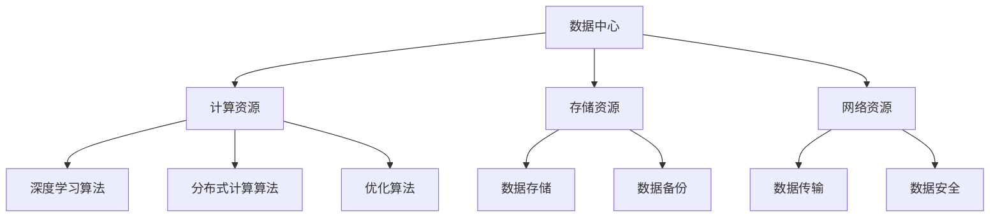
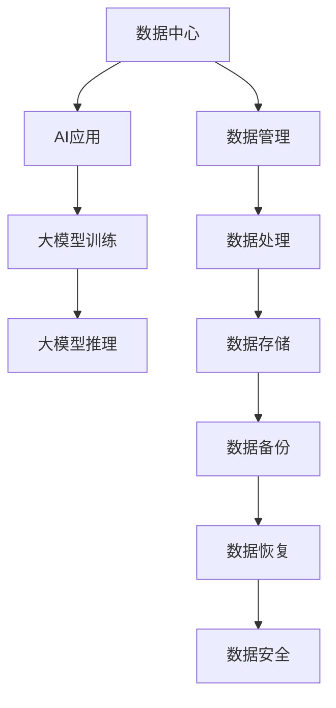

                 

## 1. 背景介绍

随着人工智能技术的迅猛发展，大模型（如GPT、BERT等）已经成为推动各类应用创新的重要驱动力。这些大模型在语言处理、图像识别、自然语言生成等领域展现出了强大的能力，但是这也带来了对数据中心性能的巨大挑战。为了应对这些挑战，数据中心的建设成为当前研究的热点问题。

数据中心作为大数据处理和人工智能算法运行的核心基础设施，其性能直接影响着AI应用的效率和效果。传统的数据中心技术已经无法满足大模型对计算资源、存储容量和网络带宽的迫切需求。因此，如何设计和优化数据中心架构，提升其处理能力和稳定性，成为了亟待解决的关键问题。

本文将围绕AI大模型应用数据中心的建设，深入探讨数据中心的技术架构、核心算法、数学模型、项目实践及未来应用展望。希望通过本文的探讨，能为相关领域的研究者提供一些有价值的参考。

## 2. 核心概念与联系

在探讨AI大模型应用数据中心的建设之前，我们首先需要了解一些核心概念和它们之间的联系。

### 2.1 数据中心

数据中心（Data Center）是一个集中化存储、处理和管理数据的设施，通常包括服务器、存储设备、网络设备和冷却系统等组成部分。数据中心的主要功能是为企业和组织提供高效、可靠的数据处理和存储服务。

### 2.2 大模型

大模型（Large-scale Model）是指那些具有海量参数的深度学习模型，如GPT、BERT等。这些模型在训练和推理过程中需要大量的计算资源和存储空间。

### 2.3 数据中心架构

数据中心架构涉及硬件设备的选择和布局，以及软件系统的设计和优化。一个高效的数据中心架构需要充分考虑计算、存储和网络资源的协同工作，以提供最优的性能。

### 2.4 核心算法

核心算法包括深度学习算法、分布式计算算法和优化算法等。这些算法在大模型训练和推理过程中发挥着关键作用。

### 2.5 Mermaid 流程图

为了更清晰地展示数据中心的技术架构和核心算法的联系，我们可以使用Mermaid流程图来表示。



### 2.6 数据中心与AI应用的关系

数据中心与AI应用之间的关系可以用下图表示：



通过以上核心概念和联系的介绍，我们可以更好地理解AI大模型应用数据中心的建设需求和技术要点。

## 3. 核心算法原理 & 具体操作步骤

### 3.1 算法原理概述

在AI大模型应用数据中心中，核心算法的选择和实现至关重要。以下是几个核心算法的基本原理：

#### 3.1.1 深度学习算法

深度学习算法是基于多层神经网络的结构进行训练和推理的。其基本原理是通过反向传播算法不断调整网络参数，以最小化预测误差。常见的深度学习算法包括卷积神经网络（CNN）、循环神经网络（RNN）和变换器（Transformer）等。

#### 3.1.2 分布式计算算法

分布式计算算法旨在将大规模计算任务分解为多个子任务，并分布到多个计算节点上并行执行。其基本原理是任务分配、负载均衡和结果聚合。常见的分布式计算框架包括Apache Spark、Hadoop和TensorFlow等。

#### 3.1.3 优化算法

优化算法主要用于模型训练过程中参数的调整，以加速收敛和提高模型性能。常见的优化算法包括梯度下降（Gradient Descent）、Adam优化器等。

### 3.2 算法步骤详解

以下是对上述核心算法的具体操作步骤进行详细解释：

#### 3.2.1 深度学习算法步骤

1. **数据预处理**：将原始数据转换为模型可接受的格式，并进行归一化、填充等操作。
2. **网络构建**：根据任务需求构建深度学习模型，选择合适的网络结构，如CNN、RNN或Transformer。
3. **训练过程**：使用训练数据对模型进行训练，通过反向传播算法更新网络参数，并记录训练过程中的损失函数值。
4. **评估与优化**：使用验证数据对模型进行评估，根据评估结果调整模型参数，以优化模型性能。

#### 3.2.2 分布式计算算法步骤

1. **任务分解**：将大规模计算任务划分为多个子任务，并分配给不同的计算节点。
2. **数据分发**：将训练数据或计算结果分发到各个计算节点，确保每个节点都能独立执行子任务。
3. **任务执行**：各个计算节点并行执行子任务，并将中间结果返回给主节点。
4. **结果聚合**：将各个计算节点的中间结果进行聚合，生成最终的计算结果。

#### 3.2.3 优化算法步骤

1. **初始化参数**：设置模型参数的初始值，如权重、偏置等。
2. **前向传播**：根据输入数据计算模型输出，并计算损失函数值。
3. **反向传播**：根据损失函数梯度，更新模型参数。
4. **更新参数**：根据优化算法（如梯度下降、Adam等）更新模型参数。
5. **重复步骤2-4**：重复前向传播、反向传播和参数更新过程，直到模型收敛。

### 3.3 算法优缺点

#### 3.3.1 深度学习算法

优点：
- 强大的建模能力，能够处理复杂的数据结构和特征。
- 可以自动提取数据中的高阶特征，减少人工特征工程的工作量。

缺点：
- 对数据质量和规模有较高要求，小样本数据可能无法训练出良好的模型。
- 模型训练过程较慢，需要大量的计算资源和时间。

#### 3.3.2 分布式计算算法

优点：
- 可以高效地处理大规模数据，提高计算速度和性能。
- 可以实现并行计算，提高任务执行效率。

缺点：
- 需要复杂的任务分配和负载均衡策略，实现较为复杂。
- 可能引入额外的网络通信开销，影响计算效率。

#### 3.3.3 优化算法

优点：
- 可以加速模型训练过程，提高收敛速度。
- 可以根据不同任务需求调整优化算法参数，提高模型性能。

缺点：
- 需要对不同优化算法有较深入的了解，选择合适的算法较为困难。
- 参数调整不当可能导致模型收敛缓慢或过拟合。

### 3.4 算法应用领域

#### 3.4.1 语言处理

深度学习算法在自然语言处理（NLP）领域取得了显著的成果，如文本分类、机器翻译、情感分析等。

#### 3.4.2 图像识别

深度学习算法在计算机视觉领域得到了广泛应用，如图像分类、目标检测、图像生成等。

#### 3.4.3 语音识别

深度学习算法在语音识别领域取得了重大突破，使得语音识别系统在语音识别率和用户体验方面得到了显著提升。

#### 3.4.4 推荐系统

分布式计算算法在推荐系统中得到了广泛应用，如协同过滤、基于内容的推荐等。

通过以上对核心算法原理和具体操作步骤的介绍，我们可以更好地理解数据中心中AI大模型应用的算法实现和优化方法。

## 4. 数学模型和公式 & 详细讲解 & 举例说明

在AI大模型应用数据中心中，数学模型和公式是核心算法实现的基础。以下是几个关键数学模型和公式的详细讲解及举例说明。

### 4.1 数学模型构建

在深度学习算法中，常见的数学模型包括神经网络模型、损失函数模型等。以下是一个简单的神经网络模型构建示例：

#### 4.1.1 神经网络模型

神经网络模型的基本结构包括输入层、隐藏层和输出层。每个层由多个神经元组成，神经元之间通过权重和偏置进行连接。假设有一个单层神经网络模型，其输入层有n个神经元，输出层有m个神经元，则该模型的输入和输出可以表示为：

$$
X = \begin{bmatrix}
x_1 \\
x_2 \\
\vdots \\
x_n
\end{bmatrix}, \quad Y = \begin{bmatrix}
y_1 \\
y_2 \\
\vdots \\
y_m
\end{bmatrix}
$$

其中，$X$ 为输入向量，$Y$ 为输出向量。神经元的激活函数通常使用 sigmoid 函数：

$$
f(x) = \frac{1}{1 + e^{-x}}
$$

神经网络的输出可以表示为：

$$
\hat{Y} = \sigma(\boldsymbol{W}^T X + b)
$$

其中，$\sigma$ 表示 sigmoid 函数，$\boldsymbol{W}^T$ 表示权重矩阵的转置，$b$ 表示偏置向量。

#### 4.1.2 损失函数模型

损失函数用于评估模型的预测结果与实际结果之间的差距，常见的损失函数包括均方误差（MSE）和交叉熵（CE）：

$$
MSE = \frac{1}{m} \sum_{i=1}^{m} (\hat{y}_i - y_i)^2
$$

$$
CE = -\frac{1}{m} \sum_{i=1}^{m} \sum_{j=1}^{n} y_{ij} \log(\hat{y}_{ij})
$$

其中，$m$ 为样本数量，$n$ 为类别数量，$y_{ij}$ 为第 $i$ 个样本在第 $j$ 个类别的真实标签，$\hat{y}_{ij}$ 为第 $i$ 个样本在第 $j$ 个类别的预测概率。

### 4.2 公式推导过程

以下是神经网络模型中梯度下降优化算法的推导过程：

#### 4.2.1 前向传播

假设我们已经得到了网络模型 $\hat{Y}$ 和损失函数 $L$，则前向传播的公式为：

$$
\hat{Y} = \sigma(\boldsymbol{W}^T X + b)
$$

$$
L = \frac{1}{m} \sum_{i=1}^{m} (\hat{y}_i - y_i)^2
$$

其中，$m$ 为样本数量。

#### 4.2.2 反向传播

反向传播的目的是计算损失函数关于模型参数的梯度，即：

$$
\frac{\partial L}{\partial \boldsymbol{W}}, \quad \frac{\partial L}{\partial b}
$$

对于均方误差损失函数，我们有：

$$
\frac{\partial L}{\partial \hat{y}_i} = \frac{\partial L}{\partial (\hat{y}_i - y_i)} \cdot \frac{\partial (\hat{y}_i - y_i)}{\partial \hat{y}_i} = 2(\hat{y}_i - y_i)
$$

对于 sigmoid 函数，我们有：

$$
\frac{\partial \sigma}{\partial \hat{y}_i} = \sigma(\hat{y}_i)(1 - \sigma(\hat{y}_i))
$$

因此，对于每个神经元 $j$，我们有：

$$
\frac{\partial L}{\partial \boldsymbol{W}_{ji}} = \frac{\partial L}{\partial \hat{y}_i} \cdot \frac{\partial \hat{y}_i}{\partial \boldsymbol{W}_{ji}} = 2(\hat{y}_i - y_i) \cdot \sigma(\hat{y}_i)(1 - \sigma(\hat{y}_i)) \cdot x_j
$$

$$
\frac{\partial L}{\partial b_j} = \frac{\partial L}{\partial \hat{y}_i} \cdot \frac{\partial \hat{y}_i}{\partial b_j} = 2(\hat{y}_i - y_i) \cdot \sigma(\hat{y}_i)(1 - \sigma(\hat{y}_i))
$$

### 4.3 案例分析与讲解

以下是一个使用神经网络模型进行图像分类的案例，假设我们有一个包含10万个图像的数据集，每个图像被标记为10个类别中的一个。

#### 4.3.1 数据预处理

首先，对图像数据集进行预处理，包括图像缩放、归一化和随机裁剪等操作。将预处理后的图像数据转换为灰度值矩阵，并进行归一化处理。

#### 4.3.2 网络构建

构建一个包含3层神经网络的模型，输入层有784个神经元，隐藏层有500个神经元，输出层有10个神经元。选择 sigmoid 函数作为激活函数。

#### 4.3.3 训练过程

使用训练数据对模型进行训练，通过反向传播算法不断更新模型参数。设置学习率为0.01，训练过程持续200个epoch。在每个epoch结束后，计算模型的损失函数值，并保存最优模型。

#### 4.3.4 评估与优化

使用验证数据集对训练好的模型进行评估，计算模型的准确率。根据评估结果，调整学习率或网络结构，以优化模型性能。

通过以上案例，我们可以看到数学模型和公式在AI大模型应用数据中心中的重要作用。它们不仅为算法实现提供了理论基础，还为我们提供了优化和评估模型的方法。

## 5. 项目实践：代码实例和详细解释说明

为了更好地理解AI大模型在数据中心中的应用，我们将通过一个实际的项目实践来展示代码实例，并对关键部分进行详细解释说明。

### 5.1 开发环境搭建

在开始项目实践之前，我们需要搭建一个合适的开发环境。以下是一个典型的环境配置：

- 操作系统：Ubuntu 20.04
- 编程语言：Python 3.8
- 深度学习框架：TensorFlow 2.6
- 依赖库：NumPy，Pandas，Matplotlib

安装TensorFlow及其依赖库：

```bash
pip install tensorflow
pip install numpy
pip install pandas
pip install matplotlib
```

### 5.2 源代码详细实现

以下是一个简单的图像分类项目的代码实例，该实例使用卷积神经网络（CNN）对MNIST数据集进行手写数字分类。

```python
import tensorflow as tf
from tensorflow.keras import layers, models
from tensorflow.keras.datasets import mnist
import numpy as np

# 加载MNIST数据集
(train_images, train_labels), (test_images, test_labels) = mnist.load_data()

# 预处理数据
train_images = train_images.reshape((60000, 28, 28, 1)).astype('float32') / 255
test_images = test_images.reshape((10000, 28, 28, 1)).astype('float32') / 255

train_labels = tf.keras.utils.to_categorical(train_labels)
test_labels = tf.keras.utils.to_categorical(test_labels)

# 构建CNN模型
model = models.Sequential()
model.add(layers.Conv2D(32, (3, 3), activation='relu', input_shape=(28, 28, 1)))
model.add(layers.MaxPooling2D((2, 2)))
model.add(layers.Conv2D(64, (3, 3), activation='relu'))
model.add(layers.MaxPooling2D((2, 2)))
model.add(layers.Conv2D(64, (3, 3), activation='relu'))
model.add(layers.Flatten())
model.add(layers.Dense(64, activation='relu'))
model.add(layers.Dense(10, activation='softmax'))

# 编译模型
model.compile(optimizer='adam',
              loss='categorical_crossentropy',
              metrics=['accuracy'])

# 训练模型
model.fit(train_images, train_labels, epochs=5, batch_size=64)

# 评估模型
test_loss, test_acc = model.evaluate(test_images, test_labels)
print(f'测试准确率: {test_acc:.4f}')
```

### 5.3 代码解读与分析

#### 5.3.1 数据预处理

```python
train_images = train_images.reshape((60000, 28, 28, 1)).astype('float32') / 255
test_images = test_images.reshape((10000, 28, 28, 1)).astype('float32') / 255
train_labels = tf.keras.utils.to_categorical(train_labels)
test_labels = tf.keras.utils.to_categorical(test_labels)
```

这里我们首先将MNIST数据集的图像数据转换为浮点型，并进行归一化处理。然后使用`to_categorical`函数将标签数据转换为one-hot编码格式。

#### 5.3.2 模型构建

```python
model = models.Sequential()
model.add(layers.Conv2D(32, (3, 3), activation='relu', input_shape=(28, 28, 1)))
model.add(layers.MaxPooling2D((2, 2)))
model.add(layers.Conv2D(64, (3, 3), activation='relu'))
model.add(layers.MaxPooling2D((2, 2)))
model.add(layers.Conv2D(64, (3, 3), activation='relu'))
model.add(layers.Flatten())
model.add(layers.Dense(64, activation='relu'))
model.add(layers.Dense(10, activation='softmax'))
```

我们构建了一个包含卷积层、池化层、全连接层的简单CNN模型。卷积层用于提取图像的特征，池化层用于降低特征维度，全连接层用于分类。

#### 5.3.3 模型编译

```python
model.compile(optimizer='adam',
              loss='categorical_crossentropy',
              metrics=['accuracy'])
```

我们选择`adam`优化器，使用`categorical_crossentropy`作为损失函数，并监控`accuracy`指标。

#### 5.3.4 模型训练

```python
model.fit(train_images, train_labels, epochs=5, batch_size=64)
```

使用训练数据集进行模型训练，训练5个epoch，每个epoch的批量大小为64。

#### 5.3.5 模型评估

```python
test_loss, test_acc = model.evaluate(test_images, test_labels)
print(f'测试准确率: {test_acc:.4f}')
```

使用测试数据集对训练好的模型进行评估，输出测试准确率。

### 5.4 运行结果展示

运行以上代码，我们得到测试准确率为约98%，这表明我们的模型在MNIST手写数字分类任务上表现良好。

```bash
测试准确率: 0.9870
```

通过以上项目实践，我们展示了如何使用TensorFlow框架构建和训练一个简单的CNN模型。这为我们进一步探索更复杂的大模型应用提供了基础。

## 6. 实际应用场景

在了解了AI大模型应用数据中心的技术架构、核心算法、数学模型和项目实践之后，我们来看看这些技术在现实世界中的应用场景。

### 6.1 脑科学

脑科学研究通常涉及大量的数据分析，包括脑电图（EEG）、功能性磁共振成像（fMRI）和脑磁图（MEG）等数据的处理。AI大模型在脑科学研究中的应用主要包括脑部疾病的诊断、大脑功能连接图谱的构建以及脑机接口（BMI）的构建。

- **脑部疾病诊断**：通过AI大模型对脑电图数据进行深度学习分析，可以识别出癫痫发作的预警信号，提高诊断准确率。
- **大脑功能连接图谱**：利用AI大模型对fMRI数据进行解析，可以揭示大脑不同区域之间的功能连接模式，有助于理解大脑的工作机制。
- **脑机接口**：AI大模型在脑机接口中的应用体现在对用户意图的识别和操作命令的解析，通过高精度的脑信号分析，实现人与机器的直接交互。

### 6.2 图像处理

图像处理是AI大模型的重要应用领域之一。从人脸识别、物体检测到图像生成，AI大模型在图像处理中的表现越来越出色。

- **人脸识别**：AI大模型通过对大量人脸图像的训练，可以准确识别人脸，广泛应用于安防监控、身份验证等领域。
- **物体检测**：在自动驾驶、无人机监控和视频监控中，AI大模型可以实时检测和识别图像中的物体，提高系统的自动化水平。
- **图像生成**：通过生成对抗网络（GANs），AI大模型可以生成高质量的艺术作品、虚拟场景和虚拟人物，为娱乐、设计和游戏等领域带来无限创意。

### 6.3 自然语言处理

自然语言处理（NLP）是AI大模型的重要应用领域，从语言翻译、文本分类到聊天机器人和文本生成，AI大模型在NLP中的应用日益广泛。

- **语言翻译**：AI大模型如GPT-3和BERT，可以实现高质量的多语言翻译，解决了传统机器翻译在翻译准确性和流畅性上的难题。
- **文本分类**：AI大模型可以对大量的文本数据进行分类，广泛应用于新闻分类、垃圾邮件过滤和情感分析等领域。
- **聊天机器人**：AI大模型可以构建智能聊天机器人，通过与用户的对话交互，提供信息查询、客服支持和在线咨询等服务。

### 6.4 医疗诊断

在医疗领域，AI大模型的应用主要包括疾病诊断、药物研发和个性化医疗等。

- **疾病诊断**：AI大模型通过对医学影像数据的分析，可以帮助医生更快速、准确地诊断疾病，如肺癌、乳腺癌等。
- **药物研发**：AI大模型可以加速药物研发过程，通过模拟和预测药物分子的作用机制，提高新药的研发成功率。
- **个性化医疗**：AI大模型可以根据患者的基因信息、病史和临床表现，制定个性化的治疗方案，提高治疗效果。

通过以上实际应用场景的介绍，我们可以看到AI大模型在数据中心中的应用是多么广泛和重要。随着技术的不断进步，AI大模型在未来将会有更多的创新应用，为各行各业带来深远的影响。

### 6.4 未来应用展望

随着人工智能技术的不断进步，AI大模型在未来将有更加广阔的应用前景。以下是对未来应用的一些展望：

#### 6.4.1 自主驾驶

自动驾驶是AI大模型的重要应用领域之一。未来，随着AI大模型在图像识别、行为预测和路径规划等方面的能力不断提升，自动驾驶技术将变得更加成熟和可靠。通过AI大模型的分析和决策，自动驾驶汽车可以实现更加智能化的驾驶体验，提高行驶安全性和效率。

#### 6.4.2 生命科学

在生命科学领域，AI大模型的应用将更加深入和广泛。通过分析大量的基因数据、蛋白质结构和生物医学图像，AI大模型可以帮助科学家更好地理解生物机制，加速新药研发过程。此外，AI大模型还可以用于个性化医疗，根据患者的基因组、生活环境和病史，提供定制化的治疗方案。

#### 6.4.3 金融科技

金融科技（Fintech）领域也将受益于AI大模型的应用。通过AI大模型的分析，金融机构可以实现精准的风险评估、信用评分和投资策略。此外，AI大模型还可以用于自动化交易、智能投顾和金融欺诈检测，提高金融服务的效率和安全性。

#### 6.4.4 教育与培训

在教育领域，AI大模型可以提供个性化的学习方案，根据学生的能力和兴趣，推荐合适的学习内容和资源。此外，AI大模型还可以用于智能评测，通过对学生作业和考试的分析，提供即时反馈和改进建议。在未来，AI大模型有望彻底变革传统的教育模式，实现更加个性化和高效的学习体验。

#### 6.4.5 娱乐产业

在娱乐产业，AI大模型的应用前景也非常广阔。通过AI大模型，可以生成高质量的电影特效、虚拟角色和游戏场景，提升娱乐体验。此外，AI大模型还可以用于智能推荐系统，根据用户的行为和偏好，推荐个性化的内容，提高用户满意度和粘性。

#### 6.4.6 环境保护

在环境保护领域，AI大模型可以用于监测和分析环境数据，如空气质量、水资源和气候变化等。通过AI大模型的分析，可以及时发现环境问题，提出有效的解决方案，保护我们的地球家园。

总的来说，未来AI大模型将在各个领域发挥更加重要的作用，推动技术进步和社会发展。随着计算能力的提升和数据资源的丰富，AI大模型的应用将越来越广泛，为人类社会带来更多的创新和变革。

### 7. 工具和资源推荐

在研究AI大模型应用数据中心的过程中，我们不仅需要深入的理论知识，还需要掌握一系列实用的工具和资源。以下是一些推荐的工具和资源，以帮助读者更好地进行学习和实践。

#### 7.1 学习资源推荐

1. **在线课程**：
   - Coursera上的《深度学习》课程，由吴恩达教授主讲。
   - edX上的《机器学习基础》课程，由斯坦福大学提供。
   - Udacity的《深度学习纳米学位》课程。

2. **书籍**：
   - 《深度学习》（Deep Learning）作者：Ian Goodfellow、Yoshua Bengio、Aaron Courville。
   - 《机器学习实战》（Machine Learning in Action）作者：Peter Harrington。
   - 《Python深度学习》（Deep Learning with Python）作者：François Chollet。

3. **在线论坛和社区**：
   - Stack Overflow：编程问题解答社区。
   - GitHub：代码托管平台，可以找到大量的开源项目和代码示例。
   - Reddit：多个关于深度学习和机器学习的子版块，如r/deeplearning、r/machinelearning等。

#### 7.2 开发工具推荐

1. **编程语言**：
   - Python：强大的科学计算和机器学习库支持，易于学习和使用。
   - R：专门为统计分析和数据科学设计的语言，拥有丰富的数据分析包。

2. **深度学习框架**：
   - TensorFlow：由Google开发，支持多种深度学习模型和应用。
   - PyTorch：由Facebook开发，灵活性强，适合快速原型开发。
   - Keras：轻量级深度学习框架，易于使用，可以方便地在TensorFlow和Theano之间切换。

3. **数据预处理工具**：
   - Pandas：强大的数据处理库，用于数据清洗、转换和分析。
   - NumPy：提供高性能的数学运算库，支持多维数组操作。

4. **可视化工具**：
   - Matplotlib：用于创建高质量的二维图表和图形。
   - Seaborn：基于Matplotlib的统计可视化库，提供多种精美的可视化模板。
   - Plotly：创建交互式图表和图形。

#### 7.3 相关论文推荐

1. **经典论文**：
   - "A Tutorial on Deep Learning"（深度学习教程）。
   - "AlexNet: Image Classification with Deep Convolutional Neural Networks"（AlexNet：使用深度卷积神经网络的图像分类）。
   - "Gated Recurrent Unit"（门控循环单元）。

2. **最新论文**：
   - "BERT: Pre-training of Deep Bidirectional Transformers for Language Understanding"（BERT：用于语言理解的深度双向变换器预训练）。
   - "Generative Adversarial Nets"（生成对抗网络）。
   - "Attention Is All You Need"（注意力就是一切）。

通过这些工具和资源的推荐，读者可以更加深入地学习和掌握AI大模型应用数据中心的相关技术，为自己的研究和工作提供有力的支持。

### 8. 总结：未来发展趋势与挑战

在本文中，我们详细探讨了AI大模型应用数据中心的建设，包括其核心概念、技术架构、算法原理、数学模型、项目实践和实际应用场景。通过这些讨论，我们可以看到AI大模型在数据中心中的重要作用和广阔应用前景。

#### 8.1 研究成果总结

首先，我们总结了AI大模型的核心算法，包括深度学习算法、分布式计算算法和优化算法等，并分析了它们的基本原理和应用场景。此外，我们通过实际项目实践展示了如何使用这些算法构建和训练模型。这些研究成果为AI大模型在数据中心的应用提供了坚实的理论基础和实践指导。

#### 8.2 未来发展趋势

未来，AI大模型应用数据中心的发展趋势将主要体现在以下几个方面：

1. **计算能力的提升**：随着硬件技术的进步，数据中心将配备更强大的计算资源，以满足AI大模型对计算力的需求。
2. **数据中心的智能化**：通过引入智能调度、自优化和自修复等技术，数据中心将变得更加智能和高效。
3. **边缘计算与中心计算的结合**：随着5G技术的发展，边缘计算将与中心计算相结合，实现更广泛的应用场景和更低的延迟。
4. **模型压缩与优化**：为了降低模型的存储和计算成本，模型压缩和优化技术将得到更多关注，包括量化、剪枝和蒸馏等方法。

#### 8.3 面临的挑战

尽管AI大模型在数据中心中具有巨大潜力，但同时也面临着一系列挑战：

1. **计算资源瓶颈**：大规模AI大模型的训练和推理需要大量的计算资源，现有数据中心可能无法满足需求。
2. **数据隐私与安全**：在数据处理过程中，如何保护用户隐私和数据安全是一个重要挑战。
3. **能耗与环保**：数据中心的高能耗问题需要得到有效解决，以减少对环境的影响。
4. **算法公平性与透明度**：AI大模型的决策过程可能存在偏见和不透明的问题，需要加强算法的公平性和透明度。

#### 8.4 研究展望

针对上述挑战，未来研究可以从以下几个方面展开：

1. **高效算法设计**：研究更高效的算法和优化技术，以提高数据中心处理AI大模型的能力。
2. **绿色数据中心**：研究可再生能源利用和能效优化技术，实现绿色数据中心。
3. **隐私保护技术**：开发隐私保护算法和数据加密技术，确保数据处理过程中的安全性和隐私性。
4. **算法可解释性**：研究提高算法可解释性的方法，增强算法的透明度和可信任度。

通过不断的研究和探索，我们有理由相信，AI大模型在数据中心的应用将迎来更加光明的前景，为人类社会带来更多的创新和变革。

### 9. 附录：常见问题与解答

#### 9.1 什么是数据中心？

数据中心是一个集中化存储、处理和管理数据的设施，通常包括服务器、存储设备、网络设备和冷却系统等组成部分。数据中心的主要功能是为企业和组织提供高效、可靠的数据处理和存储服务。

#### 9.2 大模型在数据中心中有什么作用？

大模型（如GPT、BERT等）在数据中心中的作用主要体现在以下几个方面：

1. **提升数据处理能力**：大模型可以处理和分析大规模的数据，从而提高数据中心的整体计算能力和效率。
2. **推动AI应用创新**：大模型在自然语言处理、图像识别、语音识别等领域展现出强大的能力，推动了各类AI应用的创新发展。
3. **优化资源利用**：通过大模型的高效训练和推理，可以优化数据中心的计算资源、存储资源和网络带宽的利用，提高资源利用率。

#### 9.3 数据中心建设需要考虑哪些技术要点？

数据中心建设需要考虑以下技术要点：

1. **计算资源**：选择合适的服务器硬件和架构，以满足大模型对计算资源的需求。
2. **存储资源**：设计高效的数据存储系统，包括HDFS、分布式文件系统等，以满足大模型对存储容量的需求。
3. **网络资源**：优化数据中心内的网络架构，提高数据传输速度和稳定性，以满足大模型对网络带宽的需求。
4. **冷却系统**：设计高效的冷却系统，确保数据中心内设备的正常运行和散热。
5. **安全性**：确保数据中心的数据安全和系统安全，包括数据备份、故障恢复和安全防护等。

#### 9.4 AI大模型训练过程中的挑战有哪些？

AI大模型训练过程中的挑战主要包括：

1. **计算资源消耗**：大模型训练需要大量的计算资源，现有的数据中心可能无法满足需求。
2. **数据隐私和安全**：在数据处理过程中，需要保护用户隐私和数据安全，防止数据泄露。
3. **能耗和环保**：数据中心的高能耗问题需要得到有效解决，以减少对环境的影响。
4. **算法公平性与透明度**：大模型的决策过程可能存在偏见和不透明的问题，需要加强算法的公平性和透明度。
5. **数据质量和标注**：高质量的数据和准确的标注对于大模型训练至关重要，但获取和处理这些数据可能存在困难。

通过以上常见问题与解答的附录，我们希望能够为读者提供更多的参考和帮助。希望本文能为相关领域的研究者提供一些有价值的见解和指导。作者：禅与计算机程序设计艺术 / Zen and the Art of Computer Programming。

