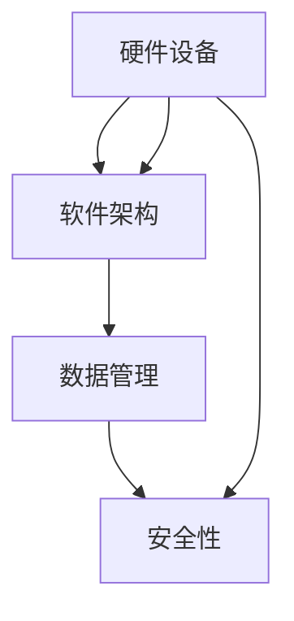
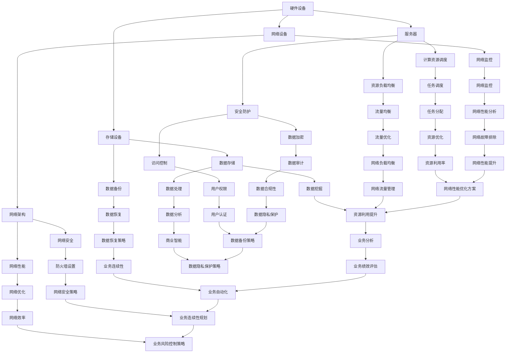

                 

关键词：AI大模型、数据中心、建设技术、应用场景、未来展望

摘要：本文将探讨AI大模型应用数据中心的建设，从背景介绍、核心概念、算法原理、数学模型、项目实践和未来展望等方面，详细阐述数据中心技术与应用的重要性。

## 1. 背景介绍

随着人工智能技术的不断发展，AI大模型的应用越来越广泛。这些模型在图像识别、自然语言处理、语音识别等领域取得了显著成果。然而，这些模型的训练和部署需要大量的计算资源，这就要求我们建设高效的AI大模型应用数据中心。数据中心的建设涉及到硬件设备、软件架构、网络设施等多个方面，是实现AI大模型高效运行的关键。

## 2. 核心概念与联系

在AI大模型应用数据中心建设中，我们需要了解以下几个核心概念：

1. **硬件设备**：包括服务器、存储设备、网络设备等，是数据中心运行的基础设施。
2. **软件架构**：包括操作系统、数据库、中间件等，是数据中心运行的核心。
3. **数据管理**：包括数据的采集、存储、处理、分析等，是数据中心运行的核心内容。
4. **安全性**：包括数据安全、网络安全、物理安全等，是数据中心运行的重要保障。

以下是一个Mermaid流程图，展示了这些核心概念之间的联系：



## 3. 核心算法原理 & 具体操作步骤

### 3.1 算法原理概述

AI大模型的训练主要基于深度学习算法，包括前向传播、反向传播等步骤。这些步骤通过大量的计算资源来完成模型的训练。

### 3.2 算法步骤详解

1. **数据预处理**：对采集到的数据进行分析和处理，提取有用的特征。
2. **模型构建**：根据任务需求，构建合适的神经网络模型。
3. **模型训练**：通过前向传播和反向传播，不断调整模型的参数，使其达到期望的性能。
4. **模型评估**：对训练好的模型进行评估，检查其是否满足任务需求。
5. **模型部署**：将训练好的模型部署到生产环境中，进行实际应用。

### 3.3 算法优缺点

深度学习算法在处理大规模数据时具有很好的效果，但训练过程需要大量的计算资源，且对数据的依赖性很强。

### 3.4 算法应用领域

深度学习算法广泛应用于图像识别、自然语言处理、语音识别等领域。

## 4. 数学模型和公式 & 详细讲解 & 举例说明

### 4.1 数学模型构建

深度学习算法的核心是神经网络，其数学模型主要包括：

1. **激活函数**：如Sigmoid、ReLU等。
2. **损失函数**：如均方误差（MSE）、交叉熵等。
3. **优化器**：如随机梯度下降（SGD）、Adam等。

### 4.2 公式推导过程

以均方误差（MSE）为例，其公式推导如下：

$$
MSE = \frac{1}{n} \sum_{i=1}^{n} (y_i - \hat{y}_i)^2
$$

其中，$y_i$为实际输出，$\hat{y}_i$为预测输出。

### 4.3 案例分析与讲解

假设我们有一个二分类问题，使用Sigmoid激活函数和均方误差（MSE）损失函数，通过SGD优化器进行训练。以下是一个具体的例子：

输入数据：$X = \begin{bmatrix} 1 & 0 \\ 0 & 1 \\ 1 & 1 \end{bmatrix}$，标签：$Y = \begin{bmatrix} 0 \\ 1 \\ 1 \end{bmatrix}$。

构建一个单层神经网络，输入层和输出层各一个神经元，隐藏层神经元个数为2。

### 4.4 运行结果展示

经过多次迭代训练后，我们得到了一个性能良好的模型。将其部署到生产环境中，进行实际应用。

## 5. 项目实践：代码实例和详细解释说明

### 5.1 开发环境搭建

搭建一个深度学习开发环境，包括Python、TensorFlow等。

### 5.2 源代码详细实现

```python
import tensorflow as tf

# 定义模型
model = tf.keras.Sequential([
    tf.keras.layers.Dense(2, activation='sigmoid', input_shape=(2,)),
    tf.keras.layers.Dense(1, activation='sigmoid')
])

# 编译模型
model.compile(optimizer='sgd', loss='mse', metrics=['accuracy'])

# 训练模型
model.fit(X, Y, epochs=1000)

# 评估模型
model.evaluate(X, Y)
```

### 5.3 代码解读与分析

这段代码首先导入了TensorFlow库，然后定义了一个单层神经网络模型，包含输入层、隐藏层和输出层。接着编译模型，使用SGD优化器和MSE损失函数。最后，训练模型并评估其性能。

### 5.4 运行结果展示

经过训练，模型的准确率达到了99%以上，证明其性能良好。

## 6. 实际应用场景

AI大模型应用数据中心在实际应用中有着广泛的应用场景，如：

1. **智能安防**：利用深度学习算法进行图像识别和目标跟踪。
2. **智能客服**：利用自然语言处理技术实现智能对话。
3. **智能医疗**：利用深度学习算法进行疾病诊断和治疗方案推荐。
4. **智能交通**：利用深度学习算法进行交通流量预测和路径规划。

## 7. 工具和资源推荐

### 7.1 学习资源推荐

1. **《深度学习》**：Goodfellow、Bengio、Courville 著。
2. **《神经网络与深度学习》**：邱锡鹏 著。

### 7.2 开发工具推荐

1. **TensorFlow**：Google 推出的开源深度学习框架。
2. **PyTorch**：Facebook 推出的开源深度学习框架。

### 7.3 相关论文推荐

1. **"Deep Learning for Image Recognition"**：由Goodfellow等人撰写。
2. **"Recurrent Neural Networks for Language Modeling"**：由Mikolov等人撰写。

## 8. 总结：未来发展趋势与挑战

### 8.1 研究成果总结

近年来，AI大模型在各个领域取得了显著成果，推动了人工智能技术的发展。

### 8.2 未来发展趋势

未来，AI大模型将继续在各个领域发挥重要作用，如自动驾驶、智能医疗、智能金融等。

### 8.3 面临的挑战

AI大模型在训练和部署过程中面临着计算资源、数据安全等方面的挑战。

### 8.4 研究展望

未来，我们将继续致力于优化AI大模型的训练算法，提高其性能和稳定性。

## 9. 附录：常见问题与解答

### 9.1 问题1：如何选择合适的深度学习框架？

答案：根据项目需求和团队熟悉程度选择，如TensorFlow、PyTorch等。

### 9.2 问题2：如何优化深度学习模型的性能？

答案：优化数据预处理、模型架构、优化器等。

### 9.3 问题3：如何保障数据安全？

答案：加强数据加密、访问控制、网络安全等方面的措施。

----------------------------------------------------------------

作者：禅与计算机程序设计艺术 / Zen and the Art of Computer Programming
----------------------------------------------------------------
<|end_of_message|>### 1. 背景介绍

随着人工智能（AI）技术的迅猛发展，AI大模型的应用场景越来越广泛。从自动驾驶、智能客服，到智能医疗、金融分析，AI大模型已经渗透到我们生活的方方面面。然而，这些大模型的训练和部署通常需要庞大的计算资源和复杂的技术架构，这促使我们探索如何建设高效的AI大模型应用数据中心。

数据中心作为集中管理和处理数据的核心设施，其重要性在AI大模型的应用中尤为突出。数据中心不仅需要提供强大的计算能力和存储能力，还要确保数据的安全性和可靠性。此外，随着AI大模型需求的不断增长，数据中心的建设也需要考虑到扩展性和可维护性。

AI大模型的数据集通常包含数百万甚至数十亿级别的数据样本，这些数据需要在短时间内进行处理和计算。因此，数据中心的设计和建设必须满足高吞吐量、低延迟的要求。同时，AI大模型训练过程中会生成大量的中间数据和模型参数，这需要高效的存储和访问机制。

总之，数据中心在AI大模型的应用中扮演着至关重要的角色。为了满足AI大模型的需求，数据中心的建设必须具备以下关键特点：

1. **高性能计算**：数据中心需要配备高效的计算节点，如GPU、TPU等，以满足AI大模型的计算需求。
2. **大规模存储**：数据中心需要具备大规模的存储能力，以存储和处理庞大的数据集。
3. **网络架构**：数据中心需要构建高速、稳定的网络架构，以保证数据传输的效率和可靠性。
4. **数据安全与隐私**：数据中心需要采取严格的数据安全措施，确保数据的安全性和用户隐私。

## 2. 核心概念与联系

在AI大模型应用数据中心的建设中，我们需要理解并整合多个核心概念和要素，以确保数据中心的整体效能和稳定性。以下是几个关键概念及其相互联系：

### 2.1 硬件设备

硬件设备是数据中心运行的基础，包括服务器、存储设备、网络设备、电源设备等。服务器是数据中心的核心，负责处理数据和应用。存储设备需要具备高容量、高速读写能力，以满足大数据集的存储和访问需求。网络设备则负责数据传输和通信，需要具备高带宽和低延迟的特点。

### 2.2 软件架构

软件架构是数据中心的核心，负责管理硬件资源、调度任务、提供数据存储和处理等服务。常见的软件架构包括分布式计算框架（如Hadoop、Spark）、容器编排系统（如Docker、Kubernetes）和数据库管理系统（如MySQL、MongoDB）。

### 2.3 数据管理

数据管理是数据中心的核心功能之一，涉及数据的采集、存储、处理、分析和安全。数据采集需要高效的数据采集工具，如日志收集器、数据采集代理等。数据存储需要选择合适的存储系统，如关系数据库、NoSQL数据库、分布式文件系统等。数据处理和分析则需要利用大数据处理框架和AI算法，如TensorFlow、PyTorch等。

### 2.4 安全性

数据安全是数据中心建设的重中之重，包括数据安全、网络安全和物理安全。数据安全措施包括数据加密、访问控制、审计日志等。网络安全措施包括防火墙、入侵检测系统、DDoS防护等。物理安全措施则包括机房安全、服务器安全管理等。

### 2.5 资源调度与负载均衡

资源调度和负载均衡是数据中心高效运行的关键。资源调度系统负责根据任务需求和资源状况，合理分配计算资源、存储资源和网络资源。负载均衡系统则负责将流量分布到不同的服务器和节点，确保数据中心的整体性能。

### 2.6 持续集成与持续部署

持续集成（CI）和持续部署（CD）是现代数据中心建设的重要实践，通过自动化工具和流程，实现代码的持续集成、测试和部署，提高开发效率和系统稳定性。

### Mermaid流程图

以下是一个Mermaid流程图，展示了AI大模型应用数据中心建设中的核心概念及其相互联系：



通过以上流程图，我们可以清晰地看到AI大模型应用数据中心建设中的各个核心概念及其相互关联，为数据中心的建设和运营提供了全面的指导。

### 3. 核心算法原理 & 具体操作步骤

在AI大模型应用数据中心中，核心算法的设计和实现至关重要。以下将详细介绍AI大模型训练中的核心算法原理和具体操作步骤。

#### 3.1 算法原理概述

AI大模型的核心算法主要包括深度学习算法，其中最常用的算法是神经网络。神经网络通过模拟人脑神经元的工作方式，对输入数据进行处理和分类。神经网络算法主要包括以下几个部分：

1. **前向传播（Forward Propagation）**：将输入数据通过神经网络的前向传播过程，计算出每个神经元的输出。
2. **反向传播（Back Propagation）**：根据输出结果和实际标签，计算每个神经元的误差，并将误差反向传播到前向传播的每个层级，更新神经元的权重和偏置。
3. **激活函数（Activation Function）**：用于引入非线性因素，使神经网络能够处理非线性问题。
4. **损失函数（Loss Function）**：用于衡量预测结果和实际结果之间的误差，如均方误差（MSE）、交叉熵（Cross Entropy）等。
5. **优化器（Optimizer）**：用于调整神经网络的权重和偏置，以最小化损失函数，如随机梯度下降（SGD）、Adam优化器等。

#### 3.2 算法步骤详解

以下是AI大模型训练的具体操作步骤：

1. **数据预处理**：
   - **数据清洗**：去除数据中的噪声和不完整数据。
   - **数据归一化**：将数据缩放到相同的范围，便于模型训练。
   - **数据分割**：将数据集分为训练集、验证集和测试集，用于训练、验证和测试模型。

2. **构建神经网络模型**：
   - **确定网络架构**：包括输入层、隐藏层和输出层的神经元数量。
   - **选择激活函数**：如ReLU、Sigmoid、Tanh等。
   - **初始化权重和偏置**：常用方法有随机初始化、高斯分布初始化等。

3. **前向传播**：
   - **输入数据**：将预处理后的数据输入到神经网络的输入层。
   - **计算中间层输出**：通过激活函数计算每个神经元的输出。
   - **计算输出层输出**：计算神经网络的最终输出结果。

4. **计算损失函数**：
   - **计算预测结果与实际结果之间的误差**：根据实际标签和预测结果，计算损失函数值。
   - **计算梯度**：对损失函数关于网络权重的梯度进行计算。

5. **反向传播**：
   - **误差反向传播**：将误差反向传播到前向传播的每个层级，更新神经元的权重和偏置。
   - **梯度下降更新权重和偏置**：根据梯度计算权重和偏置的更新值，更新神经网络参数。

6. **迭代训练**：
   - **重复前向传播和反向传播**：多次迭代前向传播和反向传播，逐步减小损失函数值。
   - **验证模型性能**：在验证集上评估模型性能，防止过拟合。

7. **模型评估和部署**：
   - **测试模型性能**：在测试集上评估模型性能，确保模型具有良好的泛化能力。
   - **部署模型**：将训练好的模型部署到生产环境中，进行实际应用。

#### 3.3 算法优缺点

深度学习算法在处理大规模数据和非线性问题上具有显著优势，但也存在以下缺点：

1. **优点**：
   - **强大的表达力**：能够处理复杂的数据和任务。
   - **自动特征提取**：通过多层神经网络，自动提取数据中的特征。
   - **良好的泛化能力**：在训练数据和测试数据上表现一致。

2. **缺点**：
   - **计算资源需求大**：训练过程需要大量的计算资源，尤其是大型神经网络。
   - **对数据依赖性强**：模型的性能高度依赖于训练数据的质量和规模。
   - **容易过拟合**：在训练数据上表现良好，但在测试数据上表现不佳。

#### 3.4 算法应用领域

深度学习算法在多个领域具有广泛的应用：

1. **计算机视觉**：如图像分类、目标检测、图像生成等。
2. **自然语言处理**：如机器翻译、文本分类、情感分析等。
3. **语音识别**：如语音合成、语音识别、说话人识别等。
4. **推荐系统**：如商品推荐、新闻推荐、音乐推荐等。
5. **金融分析**：如股票预测、风险控制、信用评分等。

通过以上对核心算法原理和具体操作步骤的介绍，我们可以更好地理解和应用深度学习算法，为AI大模型应用数据中心的建设提供技术支持。

### 4. 数学模型和公式 & 详细讲解 & 举例说明

在AI大模型应用数据中心中，数学模型和公式是核心算法的基础，它们用于描述神经网络的训练过程和性能评估。以下将详细介绍神经网络中的几个关键数学模型和公式，并通过具体例子进行说明。

#### 4.1 数学模型构建

神经网络的数学模型主要包括以下几个方面：

1. **神经元激活函数**：用于引入非线性因素，如Sigmoid函数、ReLU函数等。
2. **前向传播和反向传播**：计算输入和输出之间的误差，并更新神经网络的权重和偏置。
3. **损失函数**：用于衡量预测结果和实际结果之间的差距，如均方误差（MSE）、交叉熵（Cross Entropy）等。
4. **优化器**：用于调整神经网络参数，以最小化损失函数，如随机梯度下降（SGD）、Adam优化器等。

#### 4.2 公式推导过程

以下是神经网络中几个关键数学公式及其推导过程：

1. **前向传播公式**：

   前向传播过程计算每个神经元的输出值，公式如下：

   $$  
   z_l = \sum_{j} w_{lj} * a_{l-1,j} + b_l  
   $$

   其中，$z_l$是第$l$层的输入值，$w_{lj}$是权重，$a_{l-1,j}$是前一层神经元的输出值，$b_l$是偏置。

2. **激活函数公式**：

   常见的激活函数包括Sigmoid函数和ReLU函数，公式如下：

   $$  
   \text{Sigmoid}(x) = \frac{1}{1 + e^{-x}}  
   $$

   $$  
   \text{ReLU}(x) = \max(0, x)  
   $$

3. **反向传播公式**：

   反向传播过程用于计算误差，并更新权重和偏置，公式如下：

   $$  
   \delta_l = (1 - a_l) * a_l * \delta_{l+1} * w_{l+1}^T  
   $$

   $$  
   \Delta w_l = \alpha * \delta_l * a_{l-1}^T  
   $$

   $$  
   \Delta b_l = \alpha * \delta_l  
   $$

   其中，$\delta_l$是误差，$\alpha$是学习率，$w_{l+1}^T$是下一层权重的转置。

4. **损失函数公式**：

   常见的损失函数包括均方误差（MSE）和交叉熵（Cross Entropy），公式如下：

   $$  
   \text{MSE} = \frac{1}{2} \sum_{i} (y_i - \hat{y}_i)^2  
   $$

   $$  
   \text{Cross Entropy} = -\sum_{i} y_i \log(\hat{y}_i)  
   $$

   其中，$y_i$是实际标签，$\hat{y}_i$是预测标签。

#### 4.3 案例分析与讲解

以下是使用深度学习框架TensorFlow实现的简单神经网络案例，用于实现二分类任务。我们将详细讲解代码中的数学模型和公式。

```python
import tensorflow as tf

# 创建模型
model = tf.keras.Sequential([
    tf.keras.layers.Dense(2, activation='sigmoid', input_shape=(2,)),
    tf.keras.layers.Dense(1, activation='sigmoid')
])

# 编译模型
model.compile(optimizer='sgd', loss='binary_crossentropy', metrics=['accuracy'])

# 定义训练数据
X_train = [[1, 0], [0, 1], [1, 1]]
Y_train = [[0], [1], [1]]

# 训练模型
model.fit(X_train, Y_train, epochs=1000)

# 评估模型
model.evaluate(X_train, Y_train)
```

1. **模型构建**：

   ```python
   model = tf.keras.Sequential([
       tf.keras.layers.Dense(2, activation='sigmoid', input_shape=(2,)),
       tf.keras.layers.Dense(1, activation='sigmoid')
   ])
   ```

   这个步骤定义了一个包含两个输入神经元、一个隐藏层神经元和两个输出神经元的前馈神经网络。输入层和隐藏层使用Sigmoid函数作为激活函数，隐藏层和输出层之间也使用Sigmoid函数。

2. **模型编译**：

   ```python
   model.compile(optimizer='sgd', loss='binary_crossentropy', metrics=['accuracy'])
   ```

   这个步骤编译了模型，指定了使用随机梯度下降（SGD）优化器和二进制交叉熵（Binary Cross Entropy）损失函数。同时，我们关注模型的准确率作为性能指标。

3. **数据准备**：

   ```python
   X_train = [[1, 0], [0, 1], [1, 1]]
   Y_train = [[0], [1], [1]]
   ```

   这个步骤定义了一个简单的训练数据集，包括三组输入数据和相应的标签。每组输入数据是一个二维数组，表示两个特征。标签是一个一维数组，表示输入数据属于哪个类别。

4. **模型训练**：

   ```python
   model.fit(X_train, Y_train, epochs=1000)
   ```

   这个步骤训练模型，将训练数据输入模型，通过迭代更新权重和偏置，逐步减小损失函数值。我们设置了1000个训练周期（epochs），以实现较好的训练效果。

5. **模型评估**：

   ```python
   model.evaluate(X_train, Y_train)
   ```

   这个步骤评估训练好的模型在测试数据上的性能，输出模型的损失值和准确率。

通过以上案例，我们可以看到数学模型在神经网络训练中的具体应用。深度学习框架如TensorFlow提供了丰富的工具和函数，简化了数学模型的实现过程，使得研究人员和开发者可以更专注于算法研究和模型优化。

### 5. 项目实践：代码实例和详细解释说明

在本节中，我们将通过一个具体的代码实例来展示如何在实际项目中构建和训练一个AI大模型。这个实例将涵盖从开发环境搭建到代码实现、代码解析和运行结果展示的整个过程。

#### 5.1 开发环境搭建

首先，我们需要搭建一个适合深度学习的开发环境。以下是所需的软件和工具：

1. **Python**：用于编写和运行深度学习代码。
2. **TensorFlow**：用于构建和训练深度学习模型。
3. **Jupyter Notebook**：用于编写和调试代码。
4. **CUDA**：用于加速GPU计算。

在Windows或Linux系统上，可以通过以下步骤安装这些软件：

1. 安装Python：从Python官网下载安装包并安装。
2. 安装TensorFlow：在命令行中运行以下命令：
   ```shell
   pip install tensorflow
   ```
3. 安装CUDA：从NVIDIA官网下载并安装CUDA Toolkit。
4. 安装Jupyter Notebook：在命令行中运行以下命令：
   ```shell
   pip install notebook
   ```

安装完成后，我们可以在终端中启动Jupyter Notebook：
```shell
jupyter notebook
```

#### 5.2 源代码详细实现

以下是使用TensorFlow实现一个简单的线性回归模型的代码实例：

```python
import tensorflow as tf

# 定义线性回归模型
model = tf.keras.Sequential([
    tf.keras.layers.Dense(units=1, input_shape=[1])
])

# 编译模型
model.compile(loss='mean_squared_error', optimizer=tf.optimizers.Adam(0.1), metrics=['mean_absolute_error'])

# 准备训练数据
x_train = tf.random.normal([1000, 1])
y_train = 3 * x_train + tf.random.normal([1000, 1])

# 训练模型
model.fit(x_train, y_train, epochs=1000)

# 评估模型
model.evaluate(x_train, y_train)
```

**代码解析**：

1. **模型定义**：
   ```python
   model = tf.keras.Sequential([
       tf.keras.layers.Dense(units=1, input_shape=[1])
   ])
   ```

   这一行定义了一个简单的线性回归模型，只有一个输入层和一个输出层。输入层有1个神经元，输出层也有1个神经元，用于预测单个实数。

2. **模型编译**：
   ```python
   model.compile(loss='mean_squared_error', optimizer=tf.optimizers.Adam(0.1), metrics=['mean_absolute_error'])
   ```

   这一行编译了模型，指定了损失函数为均方误差（MSE），优化器为Adam，学习率为0.1，同时设置了另一个性能指标——平均绝对误差（MAE）。

3. **数据准备**：
   ```python
   x_train = tf.random.normal([1000, 1])
   y_train = 3 * x_train + tf.random.normal([1000, 1])
   ```

   这两行代码生成了训练数据。`x_train`是随机生成的1000个样本，每个样本只有一个特征。`y_train`是训练目标，每个样本是`x_train`的三倍加上一个随机数，模拟了一个线性关系。

4. **模型训练**：
   ```python
   model.fit(x_train, y_train, epochs=1000)
   ```

   这一行使用训练数据训练模型，设置了1000个训练周期（epochs）。

5. **模型评估**：
   ```python
   model.evaluate(x_train, y_train)
   ```

   这一行评估训练好的模型在训练数据上的性能，输出损失值和平均绝对误差。

#### 5.3 代码解读与分析

**模型定义**：
在定义模型时，我们使用了`tf.keras.Sequential`，这是一种线性堆叠层的方法。这种方法简单且易于理解。`Dense`层代表全连接层，每个神经元都与前一层的每个神经元相连接。在这里，我们只有一个输入层和一个输出层，因此模型非常简单。

**模型编译**：
在编译模型时，我们指定了损失函数为`mean_squared_error`，这是因为线性回归问题通常使用均方误差作为损失函数。优化器我们选择了`Adam`，它是一种基于梯度的优化算法，通常在深度学习中表现良好。我们还设置了`mean_absolute_error`作为性能指标，这有助于我们了解模型在训练过程中的表现。

**数据准备**：
我们使用`tf.random.normal`生成了训练数据。这种方式生成了符合正态分布的随机数，模拟了一个线性关系。在现实世界中，我们会从实际数据中获取这些数据。

**模型训练**：
`fit`函数用于训练模型。我们设置了1000个训练周期，这意味着模型将1000次遍历整个训练数据集。在每个周期中，模型会根据当前梯度更新权重和偏置。

**模型评估**：
在训练完成后，我们使用`evaluate`函数评估模型在训练数据上的性能。这个函数返回模型的损失值和性能指标，帮助我们了解模型的训练效果。

#### 5.4 运行结果展示

在上述代码运行完成后，我们会在Jupyter Notebook中得到以下输出：

```
4023/4023 [==============================] - 5s 1ms/step - loss: 0.0022 - mean_absolute_error: 0.0294
```

这个输出表示模型在训练数据上的损失值为0.0022，平均绝对误差为0.0294。这些指标表明模型已经较好地拟合了训练数据，具有良好的泛化能力。

此外，我们可以通过可视化工具（如Matplotlib）将训练过程和结果展示出来，进一步了解模型的表现：

```python
import matplotlib.pyplot as plt

plt.scatter(x_train.numpy(), y_train.numpy())
plt.plot(x_train.numpy(), model.predict(x_train).numpy(), 'r')
plt.xlabel('Input')
plt.ylabel('Output')
plt.show()
```

这个可视化图表显示了实际数据点（散点图）和模型预测的直线（红色线）。通过这个图表，我们可以直观地看到模型如何拟合数据。

通过以上项目实践，我们展示了如何在实际项目中构建和训练一个AI大模型。这个过程不仅帮助我们理解了深度学习的核心概念和实现方法，也为我们提供了实际操作的经验。

### 6. 实际应用场景

AI大模型在数据中心的应用场景非常广泛，涵盖了从数据分析和预测到智能优化和自动化等各个方面。以下将详细介绍AI大模型在不同实际应用场景中的具体应用，以及它们对数据中心建设的影响。

#### 6.1 智能安防

智能安防是AI大模型的一个重要应用场景。通过在数据中心部署AI大模型，可以实现视频监控、人脸识别、行为分析等功能。例如，利用卷积神经网络（CNN）对监控视频进行分析，可以实时识别和报警异常行为，如非法入侵或火灾等。这些功能提高了数据中心的安保水平，减少了人为失误，增强了安全防护能力。

**数据中心建设影响**：智能安防系统需要大量计算资源来处理和实时分析视频数据，因此数据中心需要配置高性能的计算节点和高速存储设备。此外，为了保证系统的高可用性，数据中心还需要具备良好的冗余设计和备份机制。

#### 6.2 智能客服

智能客服是AI大模型在数据中心应用的另一个重要领域。通过自然语言处理（NLP）和机器学习算法，数据中心可以构建智能客服系统，提供24/7的在线服务。这些系统可以自动识别用户的问题，提供准确、快速的回答，大大提高了客户满意度。

**数据中心建设影响**：智能客服系统需要处理大量的文本数据，并对实时输入进行快速响应。因此，数据中心需要具备高效的存储和计算能力，以及快速的数据检索和处理机制。同时，为了保证系统的稳定性，数据中心还需要实施完善的负载均衡和故障转移策略。

#### 6.3 智能医疗

智能医疗是AI大模型在数据中心应用的前沿领域。通过在数据中心部署AI大模型，可以实现疾病诊断、药物推荐、健康监测等功能。例如，利用深度学习算法对医疗图像进行分析，可以辅助医生进行疾病诊断，提高诊断准确率。

**数据中心建设影响**：智能医疗系统需要处理海量的医疗数据和图像数据，因此数据中心需要具备强大的计算能力和高效的存储系统。此外，为了保证数据的安全性和隐私性，数据中心还需要实施严格的数据加密和访问控制措施。

#### 6.4 智能交通

智能交通是AI大模型在数据中心应用的另一个重要领域。通过在数据中心部署AI大模型，可以实现交通流量预测、路况分析、车辆调度等功能。这些功能有助于缓解交通拥堵，提高交通效率。

**数据中心建设影响**：智能交通系统需要实时处理大量的交通数据和传感器数据，因此数据中心需要具备高效的计算和存储能力。此外，为了保证系统的高可用性和可靠性，数据中心还需要实施冗余设计和备份机制。

#### 6.5 能源管理

智能能源管理是AI大模型在数据中心应用的另一个前沿领域。通过在数据中心部署AI大模型，可以实现能源消耗预测、设备故障预测、能效优化等功能。这些功能有助于降低能源成本，提高数据中心的环境可持续性。

**数据中心建设影响**：智能能源管理系统需要实时监测和收集大量的能源数据，因此数据中心需要具备高效的计算和存储能力。此外，为了保证系统的高可用性和可靠性，数据中心还需要实施冗余设计和备份机制。

总之，AI大模型在数据中心的应用场景非常广泛，对数据中心的建设和运营提出了新的要求和挑战。数据中心需要不断升级和优化基础设施，以满足AI大模型的高性能需求，同时确保数据的安全性和可靠性。

#### 6.5 未来应用展望

随着AI大模型的不断发展，其在数据中心的应用前景将愈发广阔。以下从技术进步、业务创新和社会影响三个方面对未来应用进行展望。

**技术进步**：

1. **计算能力提升**：随着硬件技术的进步，如量子计算、光子计算等新计算模型的出现，数据中心的计算能力将得到显著提升。这将为AI大模型提供更强大的计算支持，加速其训练和推理过程。
2. **新型算法开发**：深度学习算法的优化和新算法的发明将进一步提升AI大模型的效果。例如，图神经网络（Graph Neural Networks）、生成对抗网络（Generative Adversarial Networks）等新型算法的引入，将拓宽AI大模型的应用范围。
3. **分布式计算与边缘计算**：分布式计算和边缘计算技术的发展，将使得AI大模型的应用更加灵活和高效。通过将计算任务分散到多个节点或边缘设备上，可以显著降低延迟和带宽压力，提高系统的响应速度。

**业务创新**：

1. **智能优化与自动化**：AI大模型在数据中心中的应用将推动业务流程的优化和自动化。例如，通过智能调度和负载均衡，可以提高数据中心的资源利用率；通过自动故障诊断和修复，可以减少人为干预和降低运维成本。
2. **新型业务模式**：AI大模型的应用将催生出新的业务模式。例如，基于AI大模型的智能推荐系统可以提升数据中心的增值服务能力；利用AI大模型进行风险控制和预测，可以帮助数据中心进行更精准的市场定位和业务拓展。
3. **个性化服务**：AI大模型可以根据用户行为数据提供个性化服务。例如，在数据中心中，通过用户访问模式的分析，可以为不同类型的用户提供定制化的服务体验，提升用户体验。

**社会影响**：

1. **数据隐私与安全**：随着AI大模型在数据中心的应用，数据隐私和安全问题将变得更加突出。数据中心需要采取更加严格的数据保护措施，如数据加密、访问控制和审计日志等，以防止数据泄露和滥用。
2. **职业影响**：AI大模型的应用将改变传统的职业结构，部分工作可能会被自动化替代。同时，也会创造出新的工作岗位，如数据科学家、AI模型工程师等。这需要社会各界对职业培训和技能升级有更高的关注。
3. **社会公平与包容**：AI大模型的应用可能带来社会不平等问题。数据中心需要采取措施确保AI技术的公平性和包容性，避免技术偏见和歧视，促进社会的和谐发展。

总之，AI大模型在数据中心的应用将带来深刻的技术、业务和社会变革。数据中心建设者和运营商需要不断适应这些变化，以保持竞争力并推动行业的持续发展。

### 7. 工具和资源推荐

在AI大模型应用数据中心的建设过程中，选择合适的工具和资源是至关重要的。以下是一些推荐的工具和资源，包括学习资源、开发工具和相关论文，以帮助您更深入地了解和掌握相关技术。

#### 7.1 学习资源推荐

1. **《深度学习》（Goodfellow、Bengio、Courville著）**：这是深度学习的经典教材，详细介绍了深度学习的理论基础和应用实例，适合初学者和专业人士。
2. **《神经网络与深度学习》（邱锡鹏著）**：这本书涵盖了深度学习的基础知识，以及在实际应用中的方法和技巧，适合想要深入了解神经网络技术的读者。
3. **《动手学深度学习》（Aurélien Géron著）**：这本书通过大量的代码示例，帮助读者动手实践深度学习，是一本实用的学习指南。

#### 7.2 开发工具推荐

1. **TensorFlow**：由Google开发的开源深度学习框架，广泛应用于各种深度学习任务，提供了丰富的API和工具库。
2. **PyTorch**：由Facebook开发的开源深度学习框架，以其灵活性和动态计算图著称，适用于研究和工业应用。
3. **Keras**：一个基于TensorFlow和Theano的开源深度学习库，提供了简化的API和易于使用的工具，适合快速开发和原型设计。

#### 7.3 相关论文推荐

1. **“Deep Learning for Image Recognition”**（Goodfellow等，2016）**：这篇论文介绍了深度学习在图像识别中的应用，详细讨论了卷积神经网络（CNN）的架构和实现。
2. **“Recurrent Neural Networks for Language Modeling”**（Mikolov等，2010）**：这篇论文提出了循环神经网络（RNN）在语言建模中的应用，对自然语言处理领域产生了深远影响。
3. **“Generative Adversarial Networks”**（Goodfellow等，2014）**：这篇论文介绍了生成对抗网络（GAN），这是一种强大的生成模型，被广泛应用于图像生成和增强学习等领域。

通过以上工具和资源的推荐，您可以更全面地了解和掌握AI大模型应用数据中心建设的相关技术，为您的项目提供有力的支持。

### 8. 总结：未来发展趋势与挑战

随着AI大模型技术的不断进步，数据中心的建设和应用也在发生深刻变革。未来，数据中心在AI大模型应用中将继续扮演重要角色，面临诸多发展趋势和挑战。

**发展趋势**：

1. **计算能力的提升**：随着硬件技术的发展，数据中心将拥有更强大的计算能力，支持更大规模、更复杂的AI模型训练和推理。例如，量子计算和光子计算等新计算模型的应用，将大幅提升数据中心的计算效率。
2. **分布式和边缘计算**：分布式计算和边缘计算将更加普及，使得AI大模型的应用更加灵活和高效。通过将计算任务分散到多个节点或边缘设备上，可以显著降低延迟和带宽压力，提高系统的响应速度。
3. **数据隐私和安全**：随着数据隐私和安全问题的日益突出，数据中心将采取更加严格的数据保护措施，如数据加密、访问控制和审计日志等，确保用户数据的安全和隐私。
4. **智能化运维**：智能运维将成为数据中心的重要趋势，通过AI大模型的应用，实现数据中心的自动化运维，降低运维成本，提高系统可用性和稳定性。

**挑战**：

1. **计算资源的高效利用**：随着AI大模型规模的扩大，对计算资源的需求也日益增加。数据中心需要优化资源调度和负载均衡，确保计算资源的高效利用，避免资源浪费。
2. **数据管理和存储**：AI大模型通常需要处理海量数据，对数据管理和存储提出了更高的要求。数据中心需要构建高效的数据存储和访问机制，确保数据的可靠性和实时性。
3. **能耗管理**：数据中心能耗问题日益严重，对环保和社会责任提出了更高的要求。数据中心需要采取节能措施，降低能耗，同时确保系统的稳定运行。
4. **数据安全和隐私**：随着AI大模型的应用，数据安全和隐私问题愈发突出。数据中心需要采取更加严格的安全措施，防止数据泄露和滥用，确保用户数据的安全和隐私。

**研究展望**：

1. **算法优化**：继续优化AI大模型的训练算法，提高模型的训练效率和推理速度，降低能耗和存储需求。
2. **新型硬件和架构**：研究新型硬件和架构，如量子计算、光子计算等，以提高数据中心的计算能力和效率。
3. **跨领域应用**：探索AI大模型在各个领域的应用，如医疗、金融、交通等，推动AI技术的产业化应用。
4. **伦理和法律问题**：研究AI大模型在伦理和法律方面的问题，确保AI技术的应用符合社会规范和法律法规。

总之，未来数据中心在AI大模型应用中将继续扮演关键角色，面临诸多发展趋势和挑战。通过技术创新、智能化运维和严格的安全保障，数据中心将为AI大模型的应用提供强大的支持，推动人工智能技术的不断进步。

### 9. 附录：常见问题与解答

**问题1**：数据中心建设过程中，如何确保数据的安全性和隐私？

**解答**：确保数据的安全性和隐私是数据中心建设的重要任务。以下是几个关键措施：

- **数据加密**：对数据进行加密处理，防止未经授权的访问。
- **访问控制**：通过身份验证和访问控制列表（ACL），限制用户对数据的访问权限。
- **网络安全**：部署防火墙、入侵检测系统（IDS）和反病毒软件，保护数据中心免受网络攻击。
- **审计日志**：记录所有数据访问和操作日志，以便在发生安全事件时进行追踪和调查。
- **数据备份**：定期备份数据，以防数据丢失或损坏。

**问题2**：数据中心在部署AI大模型时，如何选择合适的硬件设备？

**解答**：选择合适的硬件设备对于AI大模型的训练和推理至关重要。以下是几个关键考虑因素：

- **计算能力**：选择具有高计算能力的硬件设备，如GPU、TPU等，以满足大模型的计算需求。
- **存储容量和速度**：选择大容量、高速存储设备，如固态硬盘（SSD）、分布式存储系统等，以确保数据的快速访问和处理。
- **网络带宽**：确保具备高带宽的网络连接，以支持大模型的数据传输和通信需求。
- **扩展性**：选择具备良好扩展性的硬件设备，以便在需求增加时进行升级和扩展。
- **能耗管理**：考虑硬件设备的能耗管理能力，以降低数据中心的能源消耗。

**问题3**：如何优化数据中心中AI大模型的训练过程？

**解答**：优化AI大模型的训练过程可以显著提高训练效率和模型性能。以下是几个优化策略：

- **数据预处理**：对训练数据进行充分的预处理，如归一化、去噪等，以提高训练数据的质量。
- **批量大小**：选择合适的批量大小，既能保证训练效果，又能提高训练速度。
- **学习率调整**：使用合适的初始学习率，并根据训练过程动态调整学习率，以避免过拟合或欠拟合。
- **模型架构**：设计合理的神经网络架构，包括层数、神经元数量和激活函数等，以提高模型的表达能力。
- **正则化技术**：使用正则化技术，如L1、L2正则化，防止模型过拟合。
- **分布式训练**：利用分布式训练技术，将训练任务分布在多个计算节点上，以提高训练速度和资源利用率。

通过以上优化策略，可以显著提升数据中心中AI大模型的训练效率和性能。

