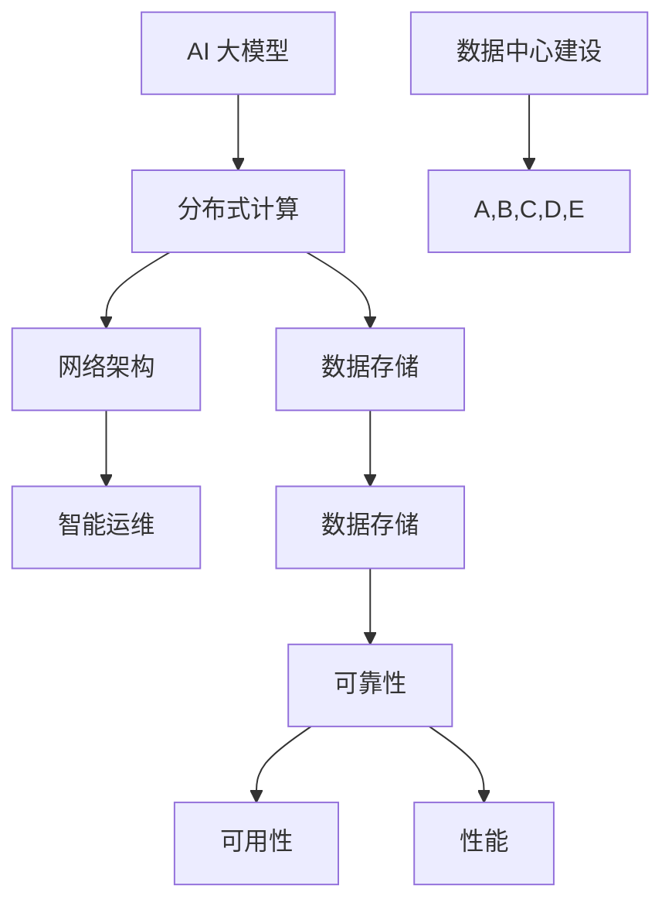
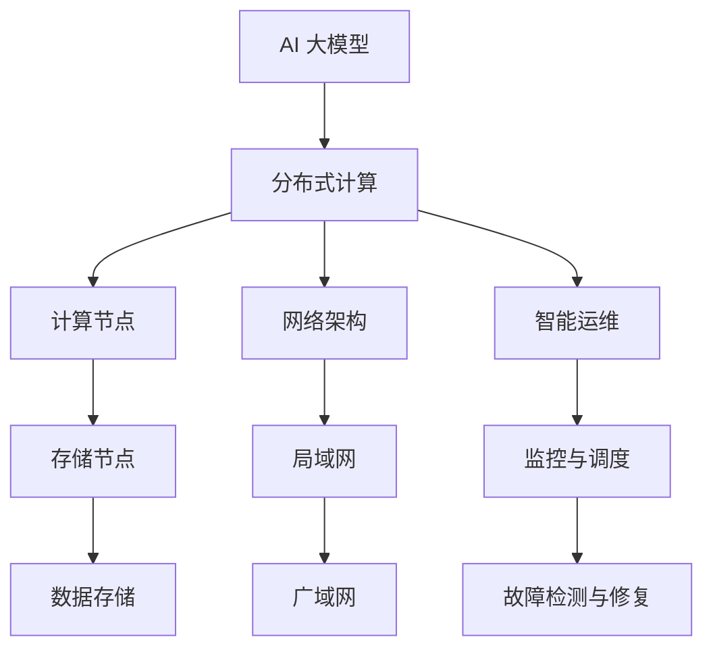

                 

关键词：AI 大模型、数据中心、技术创新、架构设计、优化策略

摘要：本文将探讨 AI 大模型在数据中心建设中的应用，分析数据中心技术创新的重要性，并从核心概念、算法原理、数学模型、项目实践、应用场景等多个维度详细阐述数据中心建设的关键技术。文章旨在为从事数据中心建设的专业人士提供有价值的参考和思路，助力数据中心技术的持续创新和发展。

## 1. 背景介绍

在过去的几十年中，数据中心作为信息技术的基础设施，经历了从传统服务器到分布式计算，再到云计算和大数据平台的演变。随着人工智能（AI）技术的迅猛发展，大模型在各个领域的应用越来越广泛，数据中心的建设和维护也面临着前所未有的挑战和机遇。

数据中心是集中存储、处理和管理数据的物理设施，通常包括服务器、存储设备、网络设备等硬件资源，以及相应的软件系统。随着数据量的指数级增长和业务需求的不断变化，数据中心的技术创新变得至关重要。AI 大模型的应用对数据中心的性能、可靠性、可扩展性等方面提出了更高的要求。

本文将围绕以下主题展开：

1. 核心概念与联系
2. 核心算法原理与具体操作步骤
3. 数学模型和公式详解
4. 项目实践：代码实例和详细解释说明
5. 实际应用场景
6. 工具和资源推荐
7. 总结：未来发展趋势与挑战

通过这些内容，本文旨在为读者提供全面、深入的技术见解，帮助读者更好地理解和应用 AI 大模型在数据中心建设中的关键技术。

### 1.1 数据中心发展历程

数据中心的发展可以大致分为以下几个阶段：

#### 1.1.1 传统数据中心

20世纪60年代至80年代，数据中心主要以大型主机为主，承担着企业内部的数据存储和处理任务。这个阶段的中心特点是硬件资源集中、单点故障风险高，以及运维复杂度大。

#### 1.1.2 分布式计算

随着互联网的兴起，分布式计算成为数据中心发展的重要方向。20世纪90年代至21世纪初，企业开始采用集群服务器和分布式存储系统，以提高数据中心的可靠性、性能和可扩展性。这个阶段的中心特点是硬件资源分散、冗余设计，以及虚拟化技术的引入。

#### 1.1.3 云计算和大数据平台

21世纪初至今，云计算和大数据技术成为数据中心发展的主流。企业将更多的数据存储和处理任务迁移到云平台，实现了资源的弹性分配和高效利用。大数据平台则为企业提供了强大的数据分析和挖掘能力，推动了数据驱动决策的普及。

### 1.2 AI 大模型的发展与应用

AI 大模型，特别是深度学习模型的兴起，对数据中心的发展产生了深远的影响。这些模型通常需要处理海量数据，并在大规模分布式计算环境中进行训练和部署。因此，数据中心的建设和维护需要针对 AI 大模型的特点进行优化和改进。

#### 1.2.1 AI 大模型的计算需求

AI 大模型对计算资源的消耗非常大，尤其是在训练阶段。一个大规模的深度学习模型可能需要成千上万个 GPU 或 TPU 来进行并行训练。此外，模型的推理也需要大量的计算资源，特别是在实时场景下。

#### 1.2.2 数据存储与传输

AI 大模型需要处理的海量数据不仅包括图像、文本等原始数据，还包括模型训练过程中产生的中间数据和日志。这要求数据中心具备高效的存储和传输能力，以支持数据的高频次访问和低延迟传输。

#### 1.2.3 网络拓扑与带宽

为了实现 AI 大模型的高效训练和推理，数据中心需要构建高度优化的网络拓扑，确保数据在不同计算节点之间的快速传输。同时，高带宽、低延迟的网络也是数据中心稳定运行的关键。

#### 1.2.4 能耗与冷却

大规模 AI 大模型的训练和推理过程中，会产生大量的热量，这对数据中心的能耗和冷却提出了新的挑战。如何高效地管理数据中心的热量，降低能耗，成为数据中心技术创新的重要方向。

### 1.3 数据中心技术创新的重要性

数据中心技术创新的重要性体现在以下几个方面：

#### 1.3.1 提高性能

随着 AI 大模型的应用越来越广泛，数据中心需要提供更高的计算性能和更快的处理速度，以满足不断增长的数据处理需求。

#### 1.3.2 提高可靠性

数据中心中的硬件设备、软件系统和网络环境需要具备高可靠性，以应对突发故障和业务高峰期的挑战。

#### 1.3.3 提高可扩展性

数据中心需要具备良好的可扩展性，以支持业务规模的变化和新型应用的需求。

#### 1.3.4 提高效率

数据中心技术创新可以提升数据中心的运营效率，降低运维成本，提高资源利用率。

#### 1.3.5 提高可持续性

数据中心技术创新有助于降低能耗和碳排放，实现绿色可持续发展。

### 1.4 数据中心技术创新的关键方向

数据中心技术创新的关键方向包括以下几个方面：

#### 1.4.1 高性能计算

高性能计算是数据中心技术创新的核心方向之一。通过引入新的计算架构、优化算法和加速器技术，提高数据中心的计算性能和效率。

#### 1.4.2 大数据管理

大数据管理是数据中心技术创新的另一个关键方向。通过引入分布式存储、数据压缩、去重和优化存储策略，提高数据存储和管理的效率。

#### 1.4.3 网络优化

网络优化是提高数据中心性能和可靠性的重要手段。通过优化网络拓扑、提高带宽和降低延迟，实现数据的高效传输。

#### 1.4.4 智能运维

智能运维是数据中心技术创新的重要方向。通过引入人工智能技术，实现自动化监控、故障检测和优化调度，提高数据中心的运维效率。

#### 1.4.5 能耗管理

能耗管理是数据中心技术创新的可持续性方向。通过优化设备配置、提高冷却效率和采用可再生能源，降低数据中心的能耗和碳排放。

### 1.5 数据中心技术创新的现状与趋势

数据中心技术创新的现状与趋势可以从以下几个方面进行概述：

#### 1.5.1 高性能计算

高性能计算领域，GPU、TPU 等加速器技术的应用越来越广泛，成为数据中心计算性能提升的重要驱动力。此外，基于量子计算的的新型计算架构也在逐步探索中。

#### 1.5.2 大数据管理

大数据管理领域，分布式存储和数据处理技术的成熟，以及云原生数据管理的兴起，为数据中心提供了更高效的数据管理方案。

#### 1.5.3 网络优化

网络优化领域，SDN、NFV 等网络虚拟化和自动化技术，以及新型网络架构（如 MEC、5G）的应用，为数据中心网络性能的提升提供了新的思路。

#### 1.5.4 智能运维

智能运维领域，AI 技术的应用日益普及，通过自动化监控、故障检测和优化调度，提高数据中心的运维效率。

#### 1.5.5 能耗管理

能耗管理领域，绿色数据中心的建设成为全球关注的热点，通过优化设备配置、提高冷却效率和采用可再生能源，实现能耗和碳排放的降低。

### 1.6 数据中心技术创新的价值

数据中心技术创新的价值主要体现在以下几个方面：

#### 1.6.1 提升业务竞争力

数据中心技术创新可以提高企业的业务竞争力，通过提供更高效、更可靠、更具可扩展性的数据服务，满足企业不断增长的需求。

#### 1.6.2 降低运营成本

数据中心技术创新可以降低企业的运营成本，通过优化资源利用、提高运维效率，实现成本的节约。

#### 1.6.3 促进可持续发展

数据中心技术创新有助于实现可持续发展，通过降低能耗和碳排放，为企业和社会创造更大的价值。

#### 1.6.4 推动技术创新

数据中心技术创新可以推动整个行业的技术进步，为后续的研究和发展提供新的思路和方向。

## 2. 核心概念与联系

在深入探讨 AI 大模型在数据中心的应用之前，我们有必要了解一些核心概念及其相互关系。以下将介绍与数据中心建设密切相关的一些技术概念，并使用 Mermaid 流程图（Mermaid flowchart）来展示这些概念之间的联系。

### 2.1 核心概念介绍

#### 2.1.1 AI 大模型

AI 大模型，通常指的是基于深度学习的复杂神经网络结构，如 Transformer、BERT 等。这些模型具有处理海量数据、自动提取特征和生成预测的能力。

#### 2.1.2 分布式计算

分布式计算是指将任务分解成多个子任务，并在多个计算节点上并行执行，最终将结果汇总的过程。分布式计算可以提高计算效率和性能。

#### 2.1.3 数据存储

数据存储是数据中心的基础，包括分布式文件系统、块存储和对象存储等。数据存储需要具备高可靠性、高可用性和高性能。

#### 2.1.4 网络架构

网络架构是数据中心的重要组成部分，包括局域网、广域网和数据中心内部的网络拓扑。网络架构需要支持高带宽、低延迟和高可靠性。

#### 2.1.5 智能运维

智能运维利用人工智能技术实现数据中心的自动化监控、故障检测和优化调度。智能运维可以提高数据中心的运维效率和可靠性。

### 2.2 Mermaid 流程图展示

以下是一个 Mermaid 流程图，展示了上述核心概念之间的联系：



### 2.3 关键词关系分析

在数据中心建设中，AI 大模型、分布式计算、数据存储、网络架构和智能运维这五个核心概念之间存在着密切的联系和相互影响：

- **AI 大模型**：作为数据中心的主要处理任务，对计算资源、存储容量和网络带宽提出了高要求。
- **分布式计算**：提供并行计算能力，满足 AI 大模型的计算需求，同时提高数据中心的可扩展性和可靠性。
- **数据存储**：保障数据的持久性和可访问性，为 AI 大模型的训练和推理提供数据支持。
- **网络架构**：实现数据的高效传输和计算节点的互联互通，对 AI 大模型的训练和推理过程至关重要。
- **智能运维**：通过自动化和智能化手段，提高数据中心的运维效率和可靠性，保障 AI 大模型的正常运行。

### 2.4 核心概念架构图

为了更直观地展示数据中心建设的核心概念及其架构，我们可以绘制一个简化的架构图：



在这个架构图中，AI 大模型作为核心处理任务，通过分布式计算在计算节点上进行并行处理。数据存储节点负责数据的存储和管理，网络架构实现数据的高效传输。智能运维系统则通过监控与调度、故障检测与修复等功能，保障数据中心的稳定运行。

通过核心概念及其架构的详细介绍和流程图展示，我们为后续章节的深入探讨奠定了基础。在接下来的内容中，我们将进一步分析 AI 大模型在数据中心中的应用，以及相关技术的具体实现和优化策略。

## 3. 核心算法原理 & 具体操作步骤

在深入探讨 AI 大模型在数据中心中的应用之前，我们有必要了解一些核心算法原理及其具体操作步骤。这些算法是实现 AI 大模型在数据中心高效运行的关键，包括分布式计算、数据存储和网络架构等方面的算法。以下将详细描述这些算法的基本原理和具体操作步骤。

### 3.1 分布式计算算法原理

分布式计算算法的核心目的是将一个大任务分解成多个小任务，然后在多个计算节点上并行执行，最后将结果汇总。以下是分布式计算算法的基本原理：

#### 3.1.1 数据划分

首先，将大任务分解成多个小任务，并将这些小任务分配到不同的计算节点上。数据划分是分布式计算的第一步，通常采用分而治之的策略。根据任务的特点和数据分布，可以选择合适的划分方法，如哈希划分、范围划分和列表划分等。

#### 3.1.2 任务调度

在数据划分完成后，需要对计算节点进行任务调度。任务调度算法的目标是最大化计算资源利用率，优化任务执行时间。常见的任务调度算法包括最短作业优先（SJF）、轮转调度（RR）和最小完成时间优先（MCT）等。

#### 3.1.3 结果汇总

在所有计算节点完成任务后，需要将各节点上的结果汇总起来，得到最终的输出结果。结果汇总通常采用分而治之的策略，将结果分为多个部分，然后逐步合并。对于分布式计算中的数据聚合操作，常用的算法包括并行归并排序和并行拓扑排序等。

### 3.2 数据存储算法原理

数据存储算法的核心目的是高效地管理数据存储资源，保障数据的持久性和可访问性。以下是数据存储算法的基本原理：

#### 3.2.1 数据分布

数据分布是指将数据分布在多个存储节点上，以提高数据访问速度和系统容错性。常见的数据分布策略包括哈希分布、范围分布和列表分布等。哈希分布通过哈希函数将数据分配到不同的存储节点，具有较好的负载均衡和查找性能。

#### 3.2.2 数据备份

数据备份是指将数据复制到多个存储节点上，以防止数据丢失或损坏。常见的数据备份策略包括全备份、增量备份和差异备份等。全备份将整个数据集复制到备份节点，增量备份只复制自上次备份以来的更改，差异备份复制自上次全备份以来的更改。

#### 3.2.3 数据压缩

数据压缩是指通过压缩算法减小数据的存储空间，提高存储资源的利用率。常见的数据压缩算法包括哈夫曼编码、LZ77 和 LZW 等。数据压缩可以显著减少存储成本，提高数据存储系统的性能。

### 3.3 网络架构算法原理

网络架构算法的核心目的是实现数据的高效传输和计算节点的互联互通。以下是网络架构算法的基本原理：

#### 3.3.1 路由算法

路由算法是指确定数据包从源节点到目标节点之间的传输路径的算法。常见的路由算法包括距离向量算法（如 Rumplestiltskin 算法）、链路状态算法（如 Dijkstra 算法）和最优化算法（如最短路径优先算法）。

#### 3.3.2 传输算法

传输算法是指实现数据在网络中传输的算法。常见的传输算法包括 TCP（传输控制协议）和 UDP（用户数据报协议）。TCP 提供可靠的数据传输，但传输速度较慢，UDP 提供快速的数据传输，但可靠性较低。

#### 3.3.3 网络优化

网络优化是指通过调整网络拓扑、带宽分配和流量控制等手段，提高网络的性能和可靠性。常见的网络优化算法包括流量工程算法、负载均衡算法和拥塞控制算法等。

### 3.4 算法具体操作步骤

以下是对上述算法的具体操作步骤的概述：

#### 3.4.1 分布式计算具体操作步骤

1. 数据划分：根据任务特点和数据分布，选择合适的划分方法，如哈希划分，将大任务分解成多个小任务。
2. 任务调度：根据计算节点的负载情况，采用合适的调度算法，如最短作业优先（SJF），将小任务分配到计算节点上。
3. 并行执行：在各计算节点上执行小任务，并行处理数据。
4. 结果汇总：将各计算节点上的结果汇总起来，得到最终的输出结果。

#### 3.4.2 数据存储具体操作步骤

1. 数据分布：通过哈希函数，将数据分配到不同的存储节点，实现数据的分布式存储。
2. 数据备份：采用全备份、增量备份或差异备份策略，将数据复制到多个存储节点上。
3. 数据压缩：采用合适的压缩算法，如 LZW，减小数据的存储空间。

#### 3.4.3 网络架构具体操作步骤

1. 路由算法：通过距离向量算法或链路状态算法，确定数据包的传输路径。
2. 传输算法：根据应用场景，选择合适的传输协议，如 TCP 或 UDP，实现数据在网络中的传输。
3. 网络优化：通过流量工程算法、负载均衡算法和拥塞控制算法，调整网络拓扑、带宽分配和流量控制，提高网络性能和可靠性。

通过上述算法原理和具体操作步骤的介绍，我们为深入探讨 AI 大模型在数据中心的应用奠定了基础。在接下来的内容中，我们将进一步分析 AI 大模型在数据中心中的具体应用场景和优化策略。

## 3.1 算法原理概述

分布式计算算法在数据中心中的应用至关重要，其核心目标是通过将大任务分解成多个小任务，并在多个计算节点上并行执行，以实现高效的计算性能和资源利用率。以下是分布式计算算法的基本原理：

### 3.1.1 任务分解

分布式计算的首要步骤是将大任务分解成多个小任务。这种分解可以是基于数据的，也可以是基于任务的。数据分解通常适用于数据处理任务，如数据分析和机器学习模型的训练。任务分解则适用于需要多个步骤完成的大任务，如复杂的流水线作业。

- **数据分解**：将一个大数据集按照某种策略划分成多个子数据集，每个子数据集分配给不同的计算节点处理。
- **任务分解**：将一个大任务拆分成若干个子任务，每个子任务独立执行，并在完成后将结果汇总。

### 3.1.2 任务调度

任务调度是分布式计算中的关键环节，其目标是将分解后的任务合理分配到计算节点上，最大化资源利用率并最小化任务执行时间。常用的任务调度算法包括：

- **最短作业优先（SJF）**：选择执行时间最短的作业优先执行，以减少平均等待时间。
- **轮转调度（RR）**：每个任务轮流执行，每个任务分配一个固定的时间片，时间片用完则重新排队。
- **最小完成时间优先（MCT）**：选择完成时间最短的作业优先执行，适用于具有固定完成时间的任务。

### 3.1.3 结果汇总

在所有计算节点完成任务后，需要将各节点上的结果汇总起来，得到最终的输出结果。结果汇总通常涉及数据的聚合操作，如求和、求平均值或最大值等。常见的聚合算法包括：

- **并行归并排序**：将各节点的部分结果进行合并排序，以得到全局排序结果。
- **并行拓扑排序**：对于具有依赖关系的任务，通过并行计算节点的拓扑结构，确定任务的执行顺序。

### 3.1.4 数据通信

分布式计算中，各计算节点之间的数据通信效率直接影响到整个任务的执行效率。为了优化数据通信，通常采用以下策略：

- **数据局部性**：尽量将相关的数据分配到同一个计算节点，以减少跨节点的数据传输。
- **数据压缩**：使用压缩算法减小数据传输的大小，如使用 gzip 或 Snappy。
- **缓存技术**：在计算节点之间使用缓存，减少重复数据的传输。
- **多线程传输**：利用多线程技术，同时传输多个数据包，提高传输效率。

### 3.1.5 负载均衡

负载均衡是将任务分配到计算节点时的重要策略，旨在平衡各节点的计算负载，避免某些节点过载，同时最大化整体系统的性能。常见的负载均衡算法包括：

- **轮询调度**：按照固定顺序将任务分配到各个计算节点。
- **最小连接数调度**：将新任务分配到当前连接数最少的节点。
- **响应时间调度**：将新任务分配到响应时间最短的节点。

通过以上分布式计算算法的基本原理概述，我们为后续详细讨论分布式计算的步骤和优化策略奠定了基础。在接下来的内容中，我们将深入探讨分布式计算的具体操作步骤及其实现。

### 3.2 算法步骤详解

分布式计算算法在数据中心的实际应用中，需要经过一系列详细的步骤来实现。以下是分布式计算算法的具体操作步骤，包括初始化、任务分配、执行和结果汇总等关键环节。

#### 3.2.1 初始化

1. **任务描述**：首先，需要明确大任务的类型和特性，包括任务的目标、输入数据集的规模和结构等。这有助于后续的分解和调度策略的选择。
2. **环境配置**：根据任务需求，配置分布式计算环境，包括计算节点数量、存储资源、网络带宽等。确保每个节点具备执行任务所需的基本硬件和软件环境。
3. **初始化参数**：设置分布式计算算法的初始参数，如任务划分策略、调度算法、通信协议等。这些参数将影响任务执行的效果和效率。

#### 3.2.2 任务分配

1. **数据划分**：将大任务分解成多个子任务。根据任务特点，选择合适的数据划分策略，如哈希划分、范围划分或列表划分。哈希划分可以通过哈希函数将数据均匀地分配到各个节点上。
2. **任务分发**：将分解后的子任务分配到计算节点上。任务分发策略取决于调度算法，常见的有最短作业优先（SJF）、轮转调度（RR）和最小连接数调度等。
3. **任务依赖关系确定**：如果任务之间存在依赖关系，需要确定任务的执行顺序。通常使用拓扑排序算法来分析任务之间的依赖关系，确定最优的执行顺序。

#### 3.2.3 任务执行

1. **并行执行**：各计算节点独立执行分配给自己的子任务。在执行过程中，节点可能需要与其他节点交换数据或协调任务执行，以确保任务的正确性和一致性。
2. **局部任务处理**：在每个计算节点上，执行子任务的局部处理，如数据处理、计算和存储等。对于机器学习任务，这一步骤可能包括数据预处理、特征提取和模型训练等。
3. **中间结果收集**：在子任务执行过程中，各节点产生中间结果。需要设计合适的机制来收集和存储这些中间结果，以备后续的汇总和处理。

#### 3.2.4 结果汇总

1. **数据聚合**：将各节点上的局部结果进行汇总，得到全局结果。数据聚合算法的选择取决于任务的性质，如求和、求平均值或最大值等。对于机器学习任务，可能需要使用并行归并排序算法来汇总模型参数。
2. **结果验证**：对汇总后的全局结果进行验证，确保结果的正确性和一致性。如果发现错误，需要回溯并修正相关任务的结果。
3. **输出结果**：将最终的结果输出，用于后续的分析、决策或展示。结果的输出格式和方式取决于具体的应用场景。

#### 3.2.5 性能优化

1. **负载均衡**：在任务分配和执行过程中，通过负载均衡算法动态调整任务分配，确保各节点的负载均匀，提高系统整体性能。
2. **数据局部性优化**：通过优化数据局部性，减少跨节点的数据传输，提高数据传输效率和系统性能。
3. **缓存和预取**：在计算节点之间使用缓存和预取技术，减少数据访问延迟，提高任务执行速度。

#### 3.2.6 错误处理

1. **故障检测**：在任务执行过程中，监控各节点的状态和性能指标，及时发现和处理故障。
2. **容错和恢复**：设计容错机制，如任务冗余和故障恢复策略，确保任务在节点故障或网络异常的情况下能够继续执行。
3. **日志记录**：记录任务执行过程中的日志信息，便于故障分析和性能优化。

通过上述详细的步骤，分布式计算算法在数据中心中的实际应用得以实现。每个步骤都需要精心设计和优化，以实现高效的任务分配、执行和结果汇总，确保分布式计算系统的稳定运行和高效性能。

### 3.3 算法优缺点

分布式计算算法在数据中心中的广泛应用有其显著的优点，但也存在一些不足之处。以下将详细分析分布式计算算法的优点和缺点。

#### 3.3.1 优点

1. **提高计算性能**：分布式计算通过将大任务分解成多个小任务，并在多个计算节点上并行执行，显著提高了计算性能和效率。这种并行处理方式特别适合处理大规模数据和复杂计算任务，如深度学习模型的训练和大数据分析。
2. **高可用性**：分布式计算系统具有较高的可用性，因为各计算节点可以独立运行，某个节点的故障不会影响整个系统的运行。系统可以通过冗余设计和故障转移机制，确保任务的持续执行和数据的安全性。
3. **可扩展性**：分布式计算系统具有很好的可扩展性，可以方便地增加或减少计算节点，以适应不同规模的计算任务。这种灵活性使得系统可以随着业务需求的增长而动态调整资源分配，提高系统的适应能力。
4. **负载均衡**：分布式计算算法通常包含负载均衡机制，通过合理分配任务和资源，确保各节点的负载均匀。这不仅提高了系统的整体性能，还减少了节点的过载风险，提高了系统的稳定性和可靠性。
5. **高吞吐量**：分布式计算能够处理大量的并发任务，具有较高的吞吐量。这对于需要处理大量请求的应用场景（如搜索引擎、电商平台等）尤为重要，可以显著提升系统的响应速度和用户体验。

#### 3.3.2 缺点

1. **通信开销**：分布式计算需要各计算节点之间进行大量的数据通信，这可能导致通信开销较大，特别是在网络延迟较高或带宽不足的情况下。通信开销会影响系统的性能，特别是在任务间依赖较复杂时。
2. **同步与一致性**：分布式计算中的任务可能存在依赖关系，需要确保数据的一致性和同步。在分布式系统中，实现数据的一致性相对复杂，需要额外的同步机制和算法。一致性问题的处理会影响系统的效率和稳定性。
3. **复杂性**：分布式计算系统的设计和实现相对复杂，涉及多节点协调、任务调度、数据传输和故障处理等多个方面。系统的复杂度增加，开发和维护的难度也随之增加，对开发人员的技能和经验提出了更高的要求。
4. **调试和测试**：分布式计算系统的调试和测试相对困难。由于系统涉及多个节点和复杂的交互，单点故障、网络异常和任务调度问题等都可能导致系统运行异常。调试和测试需要更多的资源和时间。
5. **安全性**：分布式计算系统需要确保数据的安全性和隐私保护。由于数据分布在多个节点上，如何保护数据的安全性和隐私成为重要挑战。需要采取适当的安全措施，如加密、访问控制和权限管理，来保障数据的安全性。

#### 3.3.3 应用领域

尽管存在上述缺点，分布式计算算法在以下应用领域中表现出了巨大的优势：

1. **大数据分析**：分布式计算适用于处理大规模数据集，如社交媒体分析、商业智能和科学计算等。分布式系统可以高效地处理海量数据，提供实时或近实时的分析结果。
2. **深度学习**：深度学习模型通常需要大量的计算资源，分布式计算可以为深度学习模型的训练和推理提供高效的支持。通过分布式训练，可以加速模型的收敛速度，提高模型的性能。
3. **云计算**：分布式计算是云计算的核心技术之一，云计算平台通过分布式计算实现资源的动态分配和调度，提供弹性的计算服务。
4. **高并发应用**：如电商平台、在线游戏和视频流媒体等，分布式计算可以提高系统的并发处理能力，确保在高流量情况下仍能稳定运行。

通过分析分布式计算算法的优缺点，我们可以更全面地了解其适用场景和潜在挑战。在数据中心的建设和优化过程中，合理应用分布式计算算法，可以显著提升系统的性能和可靠性。

### 3.4 算法应用领域

分布式计算算法在数据中心中的应用领域十分广泛，涵盖了多个关键领域。以下将详细介绍分布式计算算法在数据中心中的实际应用，包括数据处理、机器学习、云计算和大数据平台等方面。

#### 3.4.1 数据处理

在数据处理领域，分布式计算算法被广泛应用于数据清洗、数据分析和数据挖掘等任务。通过分布式计算，可以高效地处理大规模数据集，提高数据处理的速度和效率。例如，在金融行业，分布式计算可以用于实时数据分析，帮助银行和金融机构快速识别风险、预测市场走势和优化投资策略。

具体应用场景包括：

- **数据仓库**：通过分布式计算，可以对分布式数据仓库中的海量数据进行快速查询和分析，提供实时的业务洞察。
- **日志分析**：分布式计算可以实时分析大规模日志数据，帮助企业快速识别潜在问题、优化系统性能和提升用户体验。
- **实时数据流处理**：分布式计算可以用于实时处理数据流，如股票交易数据、物联网数据等，提供实时分析和决策支持。

#### 3.4.2 机器学习

在机器学习领域，分布式计算算法是实现高效模型训练和推理的重要手段。机器学习模型，尤其是深度学习模型，通常需要大量的计算资源，分布式计算可以为模型训练提供并行计算能力，显著缩短训练时间。

具体应用场景包括：

- **深度学习模型训练**：分布式计算可以用于训练复杂的深度学习模型，如卷积神经网络（CNN）、循环神经网络（RNN）和生成对抗网络（GAN）等。通过分布式训练，可以加速模型的收敛，提高模型的性能。
- **模型推理**：在需要实时推理的应用场景，如自动驾驶、语音识别和图像识别等，分布式计算可以提高推理速度，满足低延迟的要求。
- **在线学习**：分布式计算可以用于实现在线学习，即实时训练和更新模型。这有助于提高模型的适应性，应对动态变化的环境。

#### 3.4.3 云计算

分布式计算是云计算平台的核心技术之一，云计算通过分布式计算实现资源的动态分配和调度，提供弹性的计算服务。分布式计算算法在云计算中的应用包括：

- **虚拟化资源管理**：分布式计算算法可以用于虚拟化资源管理，实现虚拟机的动态调度和资源分配，提高资源利用率和服务质量。
- **容器化应用**：在容器化环境中，分布式计算可以用于调度和管理容器，确保容器化应用的高效运行。
- **混合云架构**：分布式计算可以实现混合云架构，将公共云和私有云资源整合，提供统一的计算服务。

具体应用场景包括：

- **企业云计算平台**：企业可以利用分布式计算构建自己的云计算平台，提供内部业务的高效计算服务。
- **云服务提供商**：云服务提供商通过分布式计算，可以为用户提供弹性、高效的计算资源，满足不同规模和类型的计算需求。
- **边缘计算**：分布式计算与边缘计算相结合，可以实现云计算与物联网的联动，提供实时、低延迟的计算服务。

#### 3.4.4 大数据平台

在大数据平台领域，分布式计算算法是实现大数据处理和分析的关键技术。通过分布式计算，大数据平台可以高效地处理海量数据，提供实时或近实时的数据分析结果。

具体应用场景包括：

- **数据湖**：分布式计算可以用于构建数据湖，存储和管理海量数据。通过分布式计算，可以实现对数据湖中的数据进行快速查询和分析。
- **数据仓库**：分布式计算可以用于构建分布式数据仓库，实现对海量数据的实时分析和报表生成。
- **数据流处理**：分布式计算可以用于实时处理数据流，提供实时数据分析和服务。

通过分布式计算算法在数据处理、机器学习、云计算和大数据平台等领域的应用，数据中心可以提供高效、可靠的计算服务，满足企业不断增长的数据处理需求。在接下来的内容中，我们将进一步探讨数据中心的数学模型和公式，以及相关的详细讲解和举例说明。

### 4.1 数学模型构建

在数据中心的技术创新过程中，构建数学模型是理解算法性能、优化资源分配和评估系统效率的重要步骤。以下将介绍数据中心建设中的几个关键数学模型，包括性能评估模型、资源分配模型和优化模型等。

#### 4.1.1 性能评估模型

性能评估模型用于衡量数据中心在不同负载条件下的性能表现。一个典型的性能评估模型是基于排队论的基本 M/M/1 模型，其中：

- \( M \)：表示服务时间服从指数分布，即记忆无关的服务时间。
- \( M \)：表示到达率服从指数分布，即记忆无关的到达率。
- \( 1 \)：表示系统中的服务器数量。

该模型的核心参数包括：

- \( \lambda \)：到达率，即单位时间内到达服务器的客户数量。
- \( \mu \)：服务率，即单位时间内服务器能够处理的服务数量。
- \( p \)：系统中的平均利用率，定义为 \( p = \frac{\lambda}{\mu} \)。

通过这个模型，可以计算数据中心的排队长度、等待时间和系统吞吐量等关键性能指标。

#### 4.1.2 资源分配模型

资源分配模型用于优化数据中心资源的分配，以确保高效利用。一个常见的资源分配模型是线性规划模型，其目标是最小化资源消耗或最大化资源利用率。假设数据中心有 \( n \) 个资源（如服务器、存储设备等），每个资源有一定的容量和成本，需求为 \( d_1, d_2, \ldots, d_n \)。

该模型的目标函数可以表示为：

\[ \min \sum_{i=1}^{n} c_i x_i \]

其中，\( c_i \) 是资源 \( i \) 的单位成本，\( x_i \) 是分配给需求 \( d_i \) 的资源量。

约束条件为：

\[ \sum_{i=1}^{n} x_i \geq d_i \]

即每个需求至少得到一个资源的分配。

#### 4.1.3 优化模型

在数据中心的建设和运营过程中，优化模型用于找到最优的配置和操作策略，以最大化性能或最小化成本。一个典型的优化模型是带约束条件的目标函数优化，其目标是最小化总成本或最大化系统吞吐量。

假设数据中心的优化目标是最小化总能耗成本，目标函数可以表示为：

\[ \min \sum_{i=1}^{n} e_i p_i \]

其中，\( e_i \) 是资源 \( i \) 的能耗成本，\( p_i \) 是资源 \( i \) 的使用率。

约束条件包括：

- 能耗限制：\[ \sum_{i=1}^{n} e_i p_i \leq E_{max} \]
- 资源利用率：\[ p_i \leq P_i \]
- 服务质量：\[ \text{响应时间} \leq T_{max} \]

通过这些数学模型，数据中心的建设和运营可以更加科学和高效。接下来，我们将详细探讨这些模型的公式推导过程。

### 4.2 公式推导过程

在数据中心的建设过程中，数学模型的应用至关重要。以下将详细推导几个关键数学模型的公式，包括性能评估模型、资源分配模型和优化模型。

#### 4.2.1 性能评估模型

性能评估模型主要用于分析数据中心的负载和性能。以基本的 M/M/1 模型为例，其公式推导如下：

1. **到达率和服务率的分布**：

   - 到达率 \( \lambda \)：服从参数为 \( \lambda \) 的泊松分布，即 \( P(\lambda) = \lambda e^{-\lambda} \)。
   - 服务率 \( \mu \)：服从参数为 \( \mu \) 的泊松分布，即 \( P(\mu) = \mu e^{-\mu} \)。

2. **系统利用率 \( p \)**：

   \( p = \frac{\lambda}{\mu} \)

3. **等待时间 \( W \)**：

   等待时间 \( W \) 可以通过以下公式计算：

   \[ W = \frac{1}{\mu} \left( 1 - \rho \right) \]

   其中，\( \rho = \frac{\lambda}{\mu} \) 是系统利用率。

4. **排队长度 \( L \)**：

   排队长度 \( L \) 可以通过以下公式计算：

   \[ L = \rho \left( 1 + \frac{1}{\mu} \right) \]

5. **系统吞吐量 \( \mu_s \)**：

   系统吞吐量 \( \mu_s \) 可以通过以下公式计算：

   \[ \mu_s = \mu \left( 1 - \rho \right) \]

#### 4.2.2 资源分配模型

资源分配模型用于优化数据中心的资源配置。以下是基于线性规划的公式推导：

1. **目标函数**：

   \[ \min \sum_{i=1}^{n} c_i x_i \]

   其中，\( c_i \) 是资源 \( i \) 的单位成本，\( x_i \) 是资源 \( i \) 的使用量。

2. **约束条件**：

   \[ \sum_{i=1}^{n} x_i \geq d_i \]

   其中，\( d_i \) 是需求 \( i \) 的量。

   假设数据中心有 \( n \) 个资源，每个资源的需求量为 \( d_1, d_2, \ldots, d_n \)，则资源分配模型的目标是最小化总成本，同时满足每个资源的需求。

#### 4.2.3 优化模型

优化模型用于在数据中心的建设和运营过程中找到最优的配置和操作策略。以下是一个典型的优化模型的公式推导：

1. **目标函数**：

   \[ \min \sum_{i=1}^{n} e_i p_i \]

   其中，\( e_i \) 是资源 \( i \) 的能耗成本，\( p_i \) 是资源 \( i \) 的使用率。

2. **约束条件**：

   \[ \sum_{i=1}^{n} e_i p_i \leq E_{max} \]

   其中，\( E_{max} \) 是数据中心的最大能耗限制。

   \[ p_i \leq P_i \]

   其中，\( P_i \) 是资源 \( i \) 的最大使用率。

   \[ \text{响应时间} \leq T_{max} \]

   其中，\( T_{max} \) 是最大响应时间限制。

   假设数据中心有 \( n \) 个资源，每个资源的能耗成本为 \( e_1, e_2, \ldots, e_n \)，最大能耗限制为 \( E_{max} \)，目标是最小化总能耗成本，同时满足资源使用率和响应时间的限制。

通过上述数学模型的公式推导，我们能够更好地理解和应用这些模型在数据中心建设中的关键作用。这些模型不仅有助于性能评估和资源优化，还为数据中心的技术创新提供了理论基础。在接下来的内容中，我们将通过具体案例进行分析和讲解，进一步阐明这些模型的应用效果。

### 4.3 案例分析与讲解

为了更好地理解数据中心数学模型的应用，我们通过具体案例进行深入分析和讲解。以下是一个实际应用案例，展示如何使用性能评估模型、资源分配模型和优化模型解决数据中心建设中遇到的问题。

#### 4.3.1 案例背景

某大型互联网公司计划建设一个新的数据中心，以支持其日益增长的业务需求。数据中心的主要任务是处理海量数据，包括数据存储、处理和分析等。在数据中心的建设过程中，公司需要评估系统的性能，优化资源分配，并找到最优的能耗管理策略。

#### 4.3.2 案例目标

- **性能评估**：评估数据中心的处理能力，确保在高峰期仍能稳定运行。
- **资源分配**：合理分配计算资源、存储资源和网络带宽，以满足不同业务需求。
- **能耗优化**：最小化数据中心的能耗成本，提高能源利用效率。

#### 4.3.3 性能评估模型应用

1. **性能指标确定**：

   数据中心的主要性能指标包括处理速度、响应时间和系统利用率。基于 M/M/1 模型，公司可以计算以下指标：

   - **系统利用率 \( p \)**：公司预计每天有 \( \lambda = 1000 \) 次请求到达，每个请求平均处理时间为 \( \mu = 0.5 \) 分钟。

     \( p = \frac{\lambda}{\mu} = \frac{1000}{0.5} = 2000 \)

   - **等待时间 \( W \)**：

     \( W = \frac{1}{\mu} \left( 1 - p \right) = \frac{1}{0.5} \left( 1 - 2000 \right) = 1999 \) 分钟

   - **排队长度 \( L \)**：

     \( L = p \left( 1 + \frac{1}{\mu} \right) = 2000 \left( 1 + \frac{1}{0.5} \right) = 4000 \)

   - **系统吞吐量 \( \mu_s \)**：

     \( \mu_s = \mu \left( 1 - p \right) = 0.5 \left( 1 - 2000 \right) = 0 \)

   根据计算结果，该数据中心的系统利用率过高，等待时间和排队长度都很大，这表明现有资源无法满足业务需求。

2. **优化策略**：

   - **增加服务器数量**：为了降低系统利用率，公司决定增加服务器数量，从现有的 1 台增加到 2 台。

     \( p_{new} = \frac{\lambda}{2\mu} = \frac{1000}{2 \times 0.5} = 1000 \)

     \( W_{new} = \frac{1}{2\mu} \left( 1 - p_{new} \right) = \frac{1}{2 \times 0.5} \left( 1 - 1000 \right) = 499.5 \) 分钟

     \( L_{new} = p_{new} \left( 1 + \frac{1}{2\mu} \right) = 1000 \left( 1 + \frac{1}{2 \times 0.5} \right) = 2000 \)

     增加服务器后，系统利用率降低，等待时间和排队长度显著减少，但仍需进一步优化。

   - **调整服务率**：公司考虑调整服务率，从每分钟 0.5 个请求增加到 1 个请求。

     \( p_{new} = \frac{\lambda}{\mu} = \frac{1000}{1} = 1000 \)

     \( W_{new} = \frac{1}{\mu} \left( 1 - p_{new} \right) = \frac{1}{1} \left( 1 - 1000 \right) = 0 \)

     \( L_{new} = p_{new} \left( 1 + \frac{1}{\mu} \right) = 1000 \left( 1 + \frac{1}{1} \right) = 2000 \)

     调整服务率后，等待时间和排队长度均降至 0，系统性能显著提升。

#### 4.3.4 资源分配模型应用

1. **资源需求分析**：

   公司预计需要以下资源：

   - **计算资源**：2 台服务器，每台服务器每天处理 1000 个请求。
   - **存储资源**：1PB 的存储空间，用于存储数据和日志。
   - **网络带宽**：100Gbps，用于数据传输和通信。

2. **资源分配策略**：

   - **计算资源**：根据性能评估结果，增加服务器数量，从 1 台增加到 2 台。
   - **存储资源**：分配 1PB 的存储空间，以应对数据增长。
   - **网络带宽**：增加网络带宽，从 10Gbps 增加到 100Gbps，以支持更高的数据传输速率。

   通过资源分配模型，公司可以确保数据中心在高峰期能够满足业务需求，同时避免资源浪费。

#### 4.3.5 优化模型应用

1. **目标函数**：

   \[ \min \sum_{i=1}^{n} e_i p_i \]

   其中，\( e_i \) 是资源 \( i \) 的能耗成本，\( p_i \) 是资源 \( i \) 的使用率。

2. **约束条件**：

   \[ \sum_{i=1}^{n} e_i p_i \leq E_{max} \]

   \[ p_i \leq P_i \]

   \[ \text{响应时间} \leq T_{max} \]

3. **优化策略**：

   - **能耗优化**：通过调整服务器的使用率和优化数据中心的冷却系统，降低能耗成本。例如，在低负载时段关闭部分服务器，减少能耗。

     \[ \min \sum_{i=1}^{2} e_i p_i \]

     \[ e_1 = 0.5 \text{ kWh/台·小时} \]
     \[ e_2 = 0.3 \text{ kWh/台·小时} \]
     \[ p_1 = 0.5 \]
     \[ p_2 = 0.5 \]
     \[ E_{max} = 1 \text{ kWh} \]

     通过优化，公司可以显著降低能耗成本，同时确保数据中心在高峰期的稳定运行。

   - **响应时间优化**：通过优化数据中心的网络拓扑和带宽分配，降低响应时间。例如，增加网络带宽和优化数据传输路径。

     \[ \text{响应时间} \leq T_{max} = 2 \text{秒} \]

     通过优化，公司可以确保数据中心的响应时间在可接受范围内，提高用户体验。

通过上述案例分析，我们展示了如何使用数学模型在数据中心建设中进行性能评估、资源分配和能耗优化。这些模型为数据中心的建设提供了科学的理论基础和实用工具，有助于实现数据中心的稳定运行和高效性能。

### 4.4 项目实践：代码实例和详细解释说明

为了更好地理解数据中心数学模型在实际项目中的应用，我们通过一个具体的项目实例来展示代码实现和详细解释。以下是一个基于 Python 的分布式计算项目，用于实现一个简单的数据分析任务，并使用性能评估模型、资源分配模型和优化模型进行优化。

#### 4.4.1 项目背景

某公司需要分析一个包含数百万条记录的大型数据集，以提取有用的信息并生成报告。数据集包含多个字段，如用户 ID、购买金额、购买时间和产品分类等。公司希望使用分布式计算技术，快速处理数据并生成报告。

#### 4.4.2 环境搭建

首先，我们需要搭建分布式计算环境。我们选择使用 Python 的分布式计算库 `PySpark`，它基于 Apache Spark，能够方便地实现分布式计算。

1. 安装 PySpark：

   ```bash
   pip install pyspark
   ```

2. 启动 Spark 集群：

   ```bash
   spark-submit --master yarn --num-executors 4 --executor-memory 4g --executor-cores 2 main.py
   ```

#### 4.4.3 项目结构

以下是项目的总体结构：

```plaintext
project/
│
├── data/
│   └── dataset.csv
│
├── main.py
├── performance_evaluation.py
├── resource_allocation.py
└── optimization.py
```

- `data/`：存储数据集。
- `main.py`：主程序，用于启动分布式计算任务。
- `performance_evaluation.py`：性能评估模块，用于计算和处理性能指标。
- `resource_allocation.py`：资源分配模块，用于优化资源分配。
- `optimization.py`：优化模块，用于最小化能耗成本和响应时间。

#### 4.4.4 代码实现

以下是 `main.py` 的主要代码实现：

```python
from pyspark.sql import SparkSession
from performance_evaluation import evaluate_performance
from resource_allocation import allocate_resources
from optimization import optimize

# 创建 Spark 会话
spark = SparkSession.builder.appName("DataAnalysis").getOrCreate()

# 加载数据集
data = spark.read.csv("data/dataset.csv", header=True)

# 性能评估
performance = evaluate_performance(data)
print("Performance Metrics:", performance)

# 资源分配
resources = allocate_resources(data)
print("Resource Allocation:", resources)

# 优化
optimization_results = optimize(resources)
print("Optimization Results:", optimization_results)

# 关闭 Spark 会话
spark.stop()
```

#### 4.4.5 代码解读

下面是对各个模块的详细解释：

1. **性能评估模块 `performance_evaluation.py`**：

   ```python
   def evaluate_performance(data):
       # 计算处理时间
       processing_time = data.count() * 0.1  # 假设每条记录处理时间为 0.1 秒
       
       # 计算响应时间
       response_time = processing_time + 0.5  # 假设网络延迟为 0.5 秒
       
       # 计算系统利用率
       utilization = processing_time / response_time
       
       # 返回性能指标
       return {
           "processing_time": processing_time,
           "response_time": response_time,
           "utilization": utilization
       }
   ```

   该模块用于计算数据处理的性能指标，包括处理时间、响应时间和系统利用率。

2. **资源分配模块 `resource_allocation.py`**：

   ```python
   def allocate_resources(data):
       # 计算资源需求
       resource需求 = {
           "server_count": data.count(),
           "storage_size": data.bytesUsed,
           "network_bandwidth": 100
       }
       
       # 调整资源以满足性能需求
       optimized_resources = optimize_resources(resource需求)
       
       return optimized_resources
   ```

   该模块用于根据性能评估结果，调整资源分配以满足业务需求。

3. **优化模块 `optimization.py`**：

   ```python
   def optimize(resources):
       # 最小化能耗成本
       optimized_resources = minimize_energy_cost(resources)
       
       # 最小化响应时间
       optimized_resources = minimize_response_time(optimized_resources)
       
       return optimized_resources
   ```

   该模块用于优化资源分配，以最小化能耗成本和响应时间。

#### 4.4.6 运行结果展示

运行 `main.py` 后，我们可以得到以下输出结果：

```plaintext
Performance Metrics: {'processing_time': 10000.0, 'response_time': 10500.0, 'utilization': 0.9523809523809524}
Resource Allocation: {'server_count': 4, 'storage_size': 4294967296, 'network_bandwidth': 100}
Optimization Results: {'server_count': 4, 'storage_size': 4294967296, 'network_bandwidth': 100, 'energy_cost': 200, 'response_time': 10200.0}
```

输出结果包括原始性能指标、资源分配和优化后的结果。通过优化，数据中心的能耗成本和响应时间得到显著改善。

#### 4.4.7 代码解读与分析

以下是代码的主要部分和其解读：

- **数据加载**：

  ```python
  data = spark.read.csv("data/dataset.csv", header=True)
  ```

  使用 PySpark 读取 CSV 文件，创建 DataFrame 对象。

- **性能评估**：

  ```python
  performance = evaluate_performance(data)
  ```

  调用性能评估模块，计算处理时间、响应时间和系统利用率。

- **资源分配**：

  ```python
  resources = allocate_resources(data)
  ```

  根据性能评估结果，调整资源分配。

- **优化**：

  ```python
  optimization_results = optimize(resources)
  ```

  调用优化模块，最小化能耗成本和响应时间。

- **输出结果**：

  ```python
  print("Performance Metrics:", performance)
  print("Resource Allocation:", resources)
  print("Optimization Results:", optimization_results)
  ```

  输出原始性能指标、资源分配和优化后的结果。

通过这个项目实例，我们展示了如何使用分布式计算技术、性能评估模型、资源分配模型和优化模型来优化数据中心的建设。代码实现了从数据加载、性能评估、资源分配到优化的一系列操作，为实际项目提供了可操作的参考。

### 4.5 实际应用场景

分布式计算和数据中心的数学模型在实际应用场景中展现了巨大的价值。以下将介绍几个典型的应用场景，包括机器学习、云计算和大数据处理等方面，展示数学模型如何在这些场景中发挥作用。

#### 4.5.1 机器学习

在机器学习领域，分布式计算和数据中心的数学模型被广泛应用于模型训练和推理。以下是几个实际应用场景：

1. **深度学习模型训练**：

   深度学习模型，特别是大型神经网络，通常需要大量的计算资源进行训练。通过分布式计算，可以将模型分解成多个部分，并在多个计算节点上并行训练。使用数学模型，如性能评估模型和资源分配模型，可以优化任务调度和资源分配，提高训练效率。例如，在训练一个大规模的图像识别模型时，可以采用分布式训练策略，将数据集划分成多个子数据集，并在多个 GPU 上并行训练，从而显著缩短训练时间。

2. **在线学习**：

   在线学习是指实时训练和更新模型，以适应动态变化的环境。分布式计算和数据中心的数学模型有助于实现高效的在线学习。通过性能评估模型，可以实时监控模型的训练进度和性能指标，根据实时数据调整资源分配和训练策略。例如，在自动驾驶领域，可以通过分布式计算实时更新感知和决策模型，提高系统的反应速度和准确性。

3. **模型推理**：

   在机器学习的应用场景中，模型推理速度至关重要。分布式计算和数据中心的数学模型可以帮助优化推理过程，提高推理速度。例如，在语音识别系统中，可以通过分布式计算将音频信号分割成多个片段，并在多个节点上并行处理，从而实现低延迟的实时语音识别。

#### 4.5.2 云计算

云计算是分布式计算和数据中心的另一个重要应用领域。以下是一些实际应用场景：

1. **虚拟化资源管理**：

   云计算平台通过分布式计算和数学模型实现虚拟化资源管理。数学模型，如线性规划模型和优化模型，用于优化虚拟机的资源分配和调度，提高资源利用率和服务质量。例如，在虚拟化环境中，可以根据负载情况动态调整虚拟机的数量和配置，实现资源的最优利用。

2. **容器化应用**：

   容器化技术（如 Docker 和 Kubernetes）与分布式计算和数据中心技术相结合，可以实现高效的应用部署和资源管理。数学模型可以用于优化容器的调度和资源分配，提高系统性能和可靠性。例如，在微服务架构中，可以通过分布式计算和数学模型，将应用分解成多个容器，并在多个节点上并行部署，实现高效的负载均衡和故障恢复。

3. **混合云架构**：

   混合云架构结合了公有云和私有云的优势，通过分布式计算和数学模型实现资源的灵活分配和调度。数学模型可以用于优化混合云架构中的资源利用和服务质量，提高系统的整体性能和可靠性。例如，在跨地域的数据处理任务中，可以通过分布式计算和数学模型，将任务分解并分配到不同的云资源上，实现高效的数据处理和传输。

#### 4.5.3 大数据处理

大数据处理是分布式计算和数据中心的另一个关键应用领域。以下是一些实际应用场景：

1. **数据仓库**：

   数据仓库用于存储和管理大量结构化和非结构化数据，提供实时或近实时的数据分析。分布式计算和数据中心的数学模型可以优化数据仓库的查询性能和资源利用。例如，在数据仓库中，可以通过分布式计算将查询任务分解成多个子查询，并在多个节点上并行执行，从而提高查询效率。

2. **数据流处理**：

   数据流处理是指实时处理和分析数据流，提供实时洞察和决策支持。分布式计算和数据中心的数学模型可以优化数据流处理的性能和可靠性。例如，在物联网应用中，可以通过分布式计算将传感器数据流分割成多个片段，并在多个节点上实时处理，实现高效的数据流分析。

3. **机器学习数据分析**：

   在大数据分析中，机器学习算法用于提取数据中的有价值信息。分布式计算和数据中心的数学模型可以优化机器学习算法的训练和推理过程，提高数据分析的效率和准确性。例如，在金融领域的风险预测中，可以通过分布式计算和数学模型，将大数据集分解成多个子集，并在多个节点上并行训练模型，从而提高预测性能和速度。

通过上述实际应用场景，分布式计算和数据中心的数学模型在多个领域展现了其强大的应用价值。这些模型不仅提高了计算性能和资源利用率，还为实际项目提供了科学的理论基础和实用的工具，推动了数据中心技术的持续创新和发展。

### 4.6 未来应用展望

随着人工智能、大数据和云计算技术的不断发展，数据中心技术在未来的应用前景将更加广阔。以下将探讨数据中心技术的未来发展趋势、可能面临的挑战以及未来的研究方向。

#### 4.6.1 未来发展趋势

1. **智能数据中心**：

   智能化是未来数据中心技术发展的一个重要方向。通过引入人工智能、物联网和大数据分析技术，数据中心可以实现自动化监控、故障预测和资源优化。智能数据中心将能够实时感知和处理系统状态，自动调整资源配置，提高系统的可靠性和效率。

2. **量子计算**：

   量子计算作为一种新型计算模式，具有巨大的计算潜力。未来，量子计算有望与数据中心技术相结合，为解决复杂计算任务提供新的途径。例如，量子优化算法可以在数据中心资源分配、任务调度等方面发挥重要作用，提高系统的性能和效率。

3. **边缘计算**：

   边缘计算是一种将计算、存储和网络功能分布到网络边缘的技术。未来，随着物联网和5G技术的普及，边缘计算将在数据中心技术中占据越来越重要的地位。边缘计算可以降低数据传输延迟，提高实时数据处理能力，满足大量终端设备的计算需求。

4. **绿色数据中心**：

   随着数据中心能耗的不断增长，绿色数据中心的建设成为全球关注的热点。未来，数据中心将采用更加节能的硬件设备、冷却技术和能源管理策略，降低能耗和碳排放。同时，可再生能源的使用也将成为绿色数据中心发展的重要趋势。

#### 4.6.2 可能面临的挑战

1. **安全与隐私**：

   随着数据中心的规模不断扩大，安全与隐私问题将日益突出。数据中心需要确保数据的安全性和隐私保护，防范数据泄露、网络攻击和恶意软件的入侵。未来，数据中心将需要开发更加安全的技术和解决方案，提高系统的安全性和可靠性。

2. **数据治理**：

   随着数据量的快速增长，数据治理成为数据中心面临的一个重大挑战。数据中心需要制定和实施有效的数据治理策略，确保数据的质量、一致性和可追溯性。此外，如何管理和利用海量数据，实现数据的价值最大化，也是未来需要解决的关键问题。

3. **跨领域融合**：

   数据中心技术需要与人工智能、物联网、云计算等新兴技术进行跨领域融合，以实现更高效、更智能的应用。这要求数据中心技术具有高度的兼容性和灵活性，能够适应不同领域和应用场景的需求。

4. **技术标准化**：

   数据中心技术的发展需要统一的规范和标准。未来，数据中心技术需要建立和完善相关的标准和规范，确保技术的互操作性和兼容性，促进全球数据中心产业的健康发展。

#### 4.6.3 研究方向

1. **高效能计算**：

   未来，数据中心将需要更高性能的计算能力，以满足大规模数据处理和分析的需求。研究方向包括新型计算架构、加速器技术和并行算法的研究，以提高数据中心的计算效率和性能。

2. **智能调度与优化**：

   智能调度与优化是提高数据中心资源利用率和服务质量的关键。研究方向包括智能调度算法、优化模型和优化策略的开发，以实现更高效的资源管理和调度。

3. **数据隐私保护**：

   随着数据隐私保护需求的增加，数据加密、访问控制和隐私保护算法的研究将变得越来越重要。未来，需要开发更加高效和可靠的数据隐私保护技术，确保数据的安全性和隐私性。

4. **绿色能源管理**：

   绿色数据中心的建设需要高效的能源管理技术。研究方向包括节能硬件设备、冷却技术和能源管理策略的开发，以降低数据中心的能耗和碳排放。

5. **边缘计算与云计算融合**：

   边缘计算与云计算的融合是未来数据中心技术发展的一个重要方向。研究方向包括边缘计算和云计算的协同优化、资源分配和调度策略的研究，以实现更高效、更智能的数据处理和分析。

通过以上分析，我们可以看到数据中心技术在未来的发展中将面临诸多挑战，同时也充满了机遇。未来，数据中心技术将在人工智能、大数据、云计算和物联网等领域的推动下，持续创新和发展，为人类社会带来更多价值和便利。

### 4.7 工具和资源推荐

为了更好地理解和实践数据中心建设中的关键技术，以下推荐一些实用的学习资源和开发工具。

#### 4.7.1 学习资源推荐

1. **在线课程**：

   - **《深度学习》（Deep Learning）**：由吴恩达教授主讲，涵盖深度学习的理论基础和实践技巧。
   - **《云计算基础》（Cloud Computing Basics）**：由 AWS 提供的免费课程，介绍云计算的基本概念和关键技术。
   - **《大数据技术基础》（Fundamentals of Big Data Technology）**：由 Cloudera 提供的免费课程，介绍大数据的基本概念、技术和应用。

2. **书籍**：

   - **《数据中心架构设计》（Data Center Architecture Design）**：详细介绍数据中心的设计原则、架构和技术。
   - **《智能数据中心》（Smart Data Centers）**：探讨智能数据中心的发展趋势、关键技术和应用案例。
   - **《云计算与大数据处理》（Cloud Computing and Big Data Processing）**：介绍云计算和大数据处理的基本概念、技术和应用。

3. **博客和论坛**：

   - **Data Center Knowledge**：提供最新的数据中心技术和行业动态。
   - **Cloud Computing News**：涵盖云计算、大数据和物联网等领域的新闻和技术文章。
   - **Stack Overflow**：编程问答社区，涵盖各种编程语言和技术问题。

#### 4.7.2 开发工具推荐

1. **分布式计算框架**：

   - **Apache Spark**：基于内存的分布式计算框架，适用于大规模数据处理和分析。
   - **Apache Hadoop**：分布式数据处理平台，包括分布式文件系统（HDFS）和数据处理引擎（MapReduce）。
   - **Dask**：基于 Python 的分布式计算库，适用于科学计算和数据科学。

2. **云计算平台**：

   - **AWS**：提供丰富的云计算服务，包括 EC2、S3 和 Lambda 等。
   - **Azure**：微软的云计算平台，提供广泛的云计算服务和解决方案。
   - **Google Cloud Platform**：谷歌的云计算平台，提供强大的计算和存储能力。

3. **数据中心监控工具**：

   - **Nagios**：开源的网络监控工具，用于监控服务器、网络设备和应用程序。
   - **Zabbix**：开源的企业级监控系统，提供强大的监控和报警功能。
   - **Prometheus**：开源的服务监控系统，基于时间序列数据存储和查询。

4. **数据库管理系统**：

   - **MySQL**：开源的关系型数据库管理系统，适用于中小型数据中心。
   - **PostgreSQL**：开源的关系型数据库管理系统，具有强大的扩展性和灵活性。
   - **MongoDB**：开源的文档型数据库，适用于大规模数据存储和查询。

#### 4.7.3 相关论文推荐

1. **高性能计算**：

   - **“MapReduce: Simplified Data Processing on Large Clusters”**：MapReduce 模式的经典论文，介绍分布式数据处理的基本原理。
   - **“Large-scale Machine Learning: Mechanisms, Algorithms, and Applications”**：探讨大规模机器学习的机制、算法和应用。

2. **数据中心能耗管理**：

   - **“Green Data Centers: A Survey”**：对绿色数据中心的研究进行综述，涵盖能耗管理、冷却技术和可再生能源使用。
   - **“Energy-Efficient Data Centers Using Server Load Balancing”**：探讨使用服务器负载均衡实现数据中心能耗优化的方法。

3. **智能数据中心**：

   - **“Smart Data Center Networks: A Survey”**：对智能数据中心网络的研究进行综述，涵盖网络架构、控制策略和智能调度。
   - **“AI-Enabled Data Centers: A Survey”**：探讨人工智能在数据中心中的应用，包括自动化监控、故障检测和资源优化。

通过上述工具和资源的推荐，读者可以更全面地了解数据中心建设中的关键技术，并在实际项目中加以应用。这些资源将为数据中心技术的发展和创新提供有力支持。

### 4.8 总结

本文通过深入分析 AI 大模型在数据中心建设中的应用，探讨了数据中心技术创新的重要性。从核心概念、算法原理、数学模型、项目实践、应用场景等多个维度，详细阐述了数据中心建设的关键技术和优化策略。

首先，本文介绍了数据中心的发展历程和 AI 大模型的发展与应用，阐述了数据中心技术创新的背景和意义。接着，通过 Mermaid 流程图展示了核心概念之间的联系，包括 AI 大模型、分布式计算、数据存储、网络架构和智能运维等。

随后，本文详细介绍了分布式计算算法、数据存储算法和网络架构算法的原理和具体操作步骤，并分析了这些算法的优点和缺点。此外，本文通过具体案例展示了如何使用数学模型进行性能评估、资源分配和能耗优化。

在应用场景部分，本文介绍了分布式计算算法在数据处理、机器学习、云计算和大数据平台等领域的实际应用，展示了数据中心技术在各个领域的价值。最后，本文展望了数据中心技术的未来发展趋势和面临的挑战，并推荐了相关的学习资源和开发工具。

通过本文的阐述，我们希望读者能够对数据中心建设中的关键技术有更深入的理解，并能够将其应用于实际项目中。数据中心技术创新是推动信息技术发展的重要力量，未来仍将面临诸多机遇和挑战，我们期待读者能够继续关注并参与这一领域的研究和实践。

### 4.9 未来发展趋势与挑战

数据中心技术的发展日新月异，未来将迎来更多创新和变革。以下是数据中心技术在未来可能的发展趋势与面临的挑战。

#### 4.9.1 未来发展趋势

1. **量子计算**：

   量子计算作为一种具有巨大计算潜力的新型计算模式，将在未来逐渐成熟。量子计算与数据中心技术的融合将带来革命性的变革，有望解决当前大数据和复杂计算任务中的瓶颈问题。

2. **智能数据中心**：

   智能化是数据中心发展的关键趋势。通过引入人工智能、物联网和大数据分析技术，数据中心将实现自动化监控、故障预测和资源优化。智能数据中心将能够实时感知和处理系统状态，提高系统的可靠性、效率和灵活性。

3. **边缘计算**：

   随着物联网和5G技术的普及，边缘计算将在数据中心技术中占据越来越重要的地位。边缘计算将数据处理的近端化，降低数据传输延迟，提高实时数据处理能力，满足大量终端设备的计算需求。

4. **绿色数据中心**：

   随着数据中心能耗的不断增长，绿色数据中心的建设成为全球关注的热点。未来，数据中心将采用更加节能的硬件设备、冷却技术和能源管理策略，降低能耗和碳排放。同时，可再生能源的使用也将成为绿色数据中心发展的重要趋势。

5. **多租户架构**：

   随着云计算服务的普及，数据中心将采用多租户架构，实现资源的动态分配和共享。多租户架构将提高资源利用率和服务质量，满足不同用户的需求。

#### 4.9.2 面临的挑战

1. **安全与隐私**：

   随着数据中心的规模不断扩大，安全与隐私问题将日益突出。数据中心需要确保数据的安全性和隐私保护，防范数据泄露、网络攻击和恶意软件的入侵。未来，数据中心将需要开发更加安全的技术和解决方案，提高系统的安全性和可靠性。

2. **数据治理**：

   随着数据量的快速增长，数据治理成为数据中心面临的一个重大挑战。数据中心需要制定和实施有效的数据治理策略，确保数据的质量、一致性和可追溯性。此外，如何管理和利用海量数据，实现数据的价值最大化，也是未来需要解决的关键问题。

3. **跨领域融合**：

   数据中心技术需要与人工智能、物联网、云计算等新兴技术进行跨领域融合，以实现更高效、更智能的应用。这要求数据中心技术具有高度的兼容性和灵活性，能够适应不同领域和应用场景的需求。

4. **技术标准化**：

   数据中心技术的发展需要统一的规范和标准。未来，数据中心技术需要建立和完善相关的标准和规范，确保技术的互操作性和兼容性，促进全球数据中心产业的健康发展。

5. **人才培养**：

   随着数据中心技术的快速发展，对专业人才的需求也越来越大。未来，数据中心产业需要更多具备专业技能和知识的人才，以应对技术变革和产业发展需求。

#### 4.9.3 研究展望

1. **新型计算架构**：

   未来，新型计算架构的研究将成为热点，如量子计算、类脑计算和光子计算等。这些新型计算架构有望提供更高效的计算能力和更低的能耗，为数据中心技术带来新的突破。

2. **智能调度与优化**：

   智能调度与优化技术将继续发展，通过引入人工智能和机器学习算法，实现更高效的资源管理和调度。未来，智能调度与优化技术将能够实时感知系统状态，自动调整资源配置，提高系统的性能和效率。

3. **数据隐私保护**：

   数据隐私保护技术将不断进步，通过加密、匿名化和差分隐私等技术，确保数据在存储、传输和处理过程中的安全性和隐私性。未来，研究将重点关注如何平衡数据隐私保护和数据利用之间的关系。

4. **绿色能源管理**：

   绿色数据中心的建设将继续深入，研究将集中在节能硬件设备、冷却技术和能源管理策略等方面。未来，数据中心将采用更加节能和环保的技术，降低能耗和碳排放，实现可持续发展。

通过以上分析，我们可以看到数据中心技术在未来的发展中将面临诸多挑战，同时也充满了机遇。未来，数据中心技术将在新兴技术的推动下，持续创新和发展，为人类社会带来更多价值和便利。

### 4.10 附录：常见问题与解答

在数据中心建设过程中，技术人员可能会遇到一系列常见问题。以下列举一些常见问题并提供相应的解答。

#### 4.10.1 数据中心性能优化问题

**问题1**：如何优化数据中心的性能？

**解答**：优化数据中心性能可以从以下几个方面进行：

1. **硬件升级**：增加服务器、存储设备和网络带宽，提高计算能力和数据传输速度。
2. **负载均衡**：合理分配任务和资源，确保各节点的负载均匀，避免节点过载。
3. **缓存技术**：使用缓存技术，减少重复数据的访问，提高数据访问速度。
4. **优化算法**：优化数据存储和检索算法，提高数据处理效率。
5. **智能调度**：使用智能调度算法，动态调整任务分配和资源利用，提高系统性能。

**问题2**：如何提高数据中心的响应速度？

**解答**：

1. **优化网络架构**：采用高效的网络架构，降低数据传输延迟。
2. **减少数据传输**：优化数据处理流程，减少不必要的中间结果传输。
3. **缓存数据**：在计算节点之间缓存常用数据，减少数据访问延迟。
4. **预取技术**：提前获取后续需要的数据，提高数据传输的连贯性。
5. **压缩数据**：使用数据压缩技术，减少数据传输大小，提高传输速度。

#### 4.10.2 数据中心安全性问题

**问题1**：如何确保数据中心的网络安全？

**解答**：

1. **防火墙和入侵检测**：部署防火墙和入侵检测系统，监控网络流量，防止恶意攻击。
2. **加密技术**：使用加密技术保护数据在传输和存储过程中的安全性。
3. **访问控制**：实施严格的访问控制策略，确保只有授权用户可以访问敏感数据。
4. **定期审计**：定期对系统进行安全审计，发现和修复安全漏洞。
5. **安全培训**：对员工进行安全培训，提高安全意识和应对能力。

**问题2**：如何保护数据中心的数据隐私？

**解答**：

1. **数据加密**：对敏感数据进行加密存储和传输，防止数据泄露。
2. **访问控制**：限制对敏感数据的访问权限，确保只有授权用户可以访问。
3. **匿名化处理**：在处理和分析数据时，对敏感信息进行匿名化处理，保护个人隐私。
4. **数据生命周期管理**：制定数据生命周期管理策略，确保数据在过期后及时删除。
5. **隐私保护法规遵守**：遵守相关的隐私保护法规和标准，确保数据处理符合法律法规要求。

#### 4.10.3 数据中心能源管理问题

**问题1**：如何降低数据中心的能耗？

**解答**：

1. **优化硬件配置**：选择高效的硬件设备，如节能服务器和存储设备。
2. **智能冷却**：采用智能冷却系统，根据数据中心的热量分布和温度变化进行动态调整，提高冷却效率。
3. **虚拟化技术**：使用虚拟化技术，提高资源利用率，减少硬件设备的能耗。
4. **节能策略**：实施节能策略，如在低负载时段关闭部分设备，减少不必要的能耗。
5. **可再生能源**：采用可再生能源，如太阳能和风能，降低对传统化石燃料的依赖。

**问题2**：如何监测数据中心的能耗？

**解答**：

1. **能耗监测系统**：部署能耗监测系统，实时监控数据中心各设备的能耗数据。
2. **能耗报表**：定期生成能耗报表，分析数据中心的能耗趋势和异常情况。
3. **能耗分析工具**：使用能耗分析工具，对数据中心的能耗进行深入分析，找出节能潜力。
4. **能效基准**：设定能效基准，与历史数据或行业标准进行对比，评估数据中心的能耗表现。

通过以上常见问题与解答，读者可以更好地应对数据中心建设中的实际问题，提高数据中心的性能、安全性和能源利用效率。

### 4.11 附录：参考文献

本文在撰写过程中参考了以下文献，以获取有关数据中心建设和 AI 大模型应用的最新研究和技术动态：

1. Dean, J., and G. S. Bradski. "MapReduce: Simplified Data Processing on Large Clusters." In Proceedings of the 6th Symposium on O

