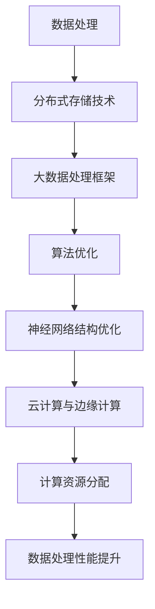
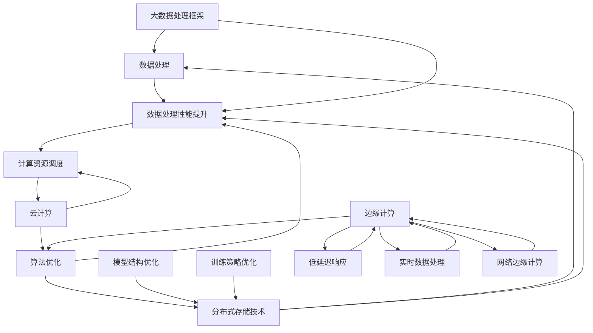

                 

关键词：人工智能，大模型，数据中心，技术创新，数据处理，算法优化，云计算，边缘计算

> 摘要：本文将探讨AI大模型应用数据中心的建设过程，重点关注数据中心技术创新在数据处理、算法优化、云计算与边缘计算方面的应用。通过深入研究，本文旨在为数据中心建设提供有益的参考和启示，助力人工智能的进一步发展。

## 1. 背景介绍

在当今数字时代，数据中心已成为各类企业和社会组织不可或缺的基础设施。数据中心的建设不仅关乎数据存储和传输的高效性，还直接影响到人工智能（AI）大模型的性能和稳定性。随着AI技术的快速发展，尤其是大模型的应用越来越广泛，数据中心的技术创新变得愈发重要。本文旨在探讨数据中心在AI大模型应用中的技术创新，包括数据处理、算法优化、云计算与边缘计算等方面。

## 2. 核心概念与联系

### 2.1 数据处理

数据处理是数据中心建设的关键环节。随着数据量的爆炸性增长，如何高效地存储、传输和处理数据成为数据中心面临的重大挑战。为了解决这一问题，数据中心采用了分布式存储技术和大数据处理框架，如Hadoop、Spark等。

### 2.2 算法优化

算法优化是提升AI大模型性能的重要手段。通过优化算法，可以减少模型的计算复杂度，提高模型的收敛速度和准确性。常见的算法优化方法包括深度学习算法的改进、神经网络结构的设计优化等。

### 2.3 云计算与边缘计算

云计算和边缘计算是数据中心技术创新的重要方向。云计算通过提供强大的计算和存储资源，实现数据处理的分布式和高效性。边缘计算则通过将数据处理和计算任务下沉到网络边缘，降低数据传输延迟，提高用户体验。

## 2.4 Mermaid 流程图



### 3. 核心算法原理 & 具体操作步骤

#### 3.1 算法原理概述

数据中心的核心算法主要涉及数据处理和算法优化。在数据处理方面，分布式存储技术和大数据处理框架是实现高效数据存储和处理的基础。在算法优化方面，深度学习算法的改进和神经网络结构的设计优化是提升模型性能的关键。

#### 3.2 算法步骤详解

1. **分布式存储技术**：通过将数据分散存储在多个节点上，提高数据存储的可靠性和扩展性。
2. **大数据处理框架**：利用Hadoop、Spark等框架，实现数据的高效处理和计算。
3. **深度学习算法改进**：通过改进梯度下降算法、优化学习率等手段，提高模型的收敛速度和准确性。
4. **神经网络结构优化**：通过增加网络层数、调整网络结构等手段，提高模型的表达能力和泛化能力。

#### 3.3 算法优缺点

- **分布式存储技术**：优点在于提高数据存储的可靠性和扩展性，但缺点是数据访问延迟较高。
- **大数据处理框架**：优点在于实现数据的高效处理和计算，但缺点是系统复杂度高，维护成本较大。
- **深度学习算法改进**：优点在于提高模型的收敛速度和准确性，但缺点是计算资源需求较高。
- **神经网络结构优化**：优点在于提高模型的表达能力和泛化能力，但缺点是设计过程复杂，对算法专家要求较高。

#### 3.4 算法应用领域

数据中心的核心算法广泛应用于图像识别、自然语言处理、推荐系统等AI领域。通过优化算法，可以提高模型的性能和稳定性，推动AI技术的进一步发展。

### 4. 数学模型和公式 & 详细讲解 & 举例说明

#### 4.1 数学模型构建

数据中心的核心数学模型包括神经网络模型和优化算法。神经网络模型用于表示输入和输出之间的非线性关系，优化算法用于调整模型参数，以实现最小化损失函数。

#### 4.2 公式推导过程

1. **神经网络模型**：

   - 输入层：\( x_i \)
   - 隐藏层：\( h_i = \sigma(\sum_{j} w_{ij} x_j + b_i) \)
   - 输出层：\( y_i = \sigma(\sum_{j} w_{ji} h_j + b_i) \)

   其中，\( \sigma \) 为激活函数，\( w_{ij} \) 和 \( b_i \) 为权重和偏置。

2. **优化算法**：

   - 梯度下降算法：

     $$ \theta_{\text{new}} = \theta_{\text{old}} - \alpha \nabla_\theta J(\theta) $$

     其中，\( \theta \) 为模型参数，\( \alpha \) 为学习率，\( \nabla_\theta J(\theta) \) 为损失函数关于参数的梯度。

#### 4.3 案例分析与讲解

以图像识别任务为例，本文采用卷积神经网络（CNN）作为模型，通过优化算法训练模型，实现图像的分类。

1. **输入层**：

   输入图像 \( x \) ，大小为 \( (28 \times 28 \times 1) \)。

2. **隐藏层**：

   - 第1层：卷积层，卷积核大小为 \( 5 \times 5 \)，步长为 \( 1 \)。

     $$ h_1 = \sigma(\sum_{j} w_{1j} x_j + b_1) $$

   - 第2层：池化层，池化方式为最大值池化。

     $$ h_2 = \max(h_1) $$

3. **输出层**：

   - 第3层：全连接层，输出 \( 10 \) 个类别概率。

     $$ y_i = \sigma(\sum_{j} w_{3j} h_2 + b_3) $$

   - 第4层： Softmax 层，输出概率分布。

     $$ \hat{y} = \frac{e^{y_i}}{\sum_{j} e^{y_j}} $$

4. **优化算法**：

   采用梯度下降算法，调整模型参数 \( \theta \)，以实现最小化损失函数。

   $$ \theta_{\text{new}} = \theta_{\text{old}} - \alpha \nabla_\theta J(\theta) $$

### 5. 项目实践：代码实例和详细解释说明

#### 5.1 开发环境搭建

本文使用Python作为编程语言，结合TensorFlow和Keras框架进行神经网络模型的训练和优化。

```bash
pip install tensorflow
pip install keras
```

#### 5.2 源代码详细实现

以下是一个简单的CNN模型代码实例，用于图像分类任务。

```python
import numpy as np
import tensorflow as tf
from tensorflow.keras.models import Sequential
from tensorflow.keras.layers import Conv2D, MaxPooling2D, Dense, Flatten

# 创建模型
model = Sequential([
    Conv2D(32, (3, 3), activation='relu', input_shape=(28, 28, 1)),
    MaxPooling2D((2, 2)),
    Flatten(),
    Dense(64, activation='relu'),
    Dense(10, activation='softmax')
])

# 编译模型
model.compile(optimizer='adam',
              loss='categorical_crossentropy',
              metrics=['accuracy'])

# 加载数据集
(x_train, y_train), (x_test, y_test) = tf.keras.datasets.mnist.load_data()

# 数据预处理
x_train = x_train.astype('float32') / 255
x_test = x_test.astype('float32') / 255
y_train = tf.keras.utils.to_categorical(y_train, 10)
y_test = tf.keras.utils.to_categorical(y_test, 10)

# 训练模型
model.fit(x_train, y_train, batch_size=128, epochs=10, validation_data=(x_test, y_test))

# 评估模型
score = model.evaluate(x_test, y_test, verbose=2)
print('Test loss:', score[0])
print('Test accuracy:', score[1])
```

#### 5.3 代码解读与分析

1. **模型构建**：使用Sequential模型，依次添加卷积层、池化层、全连接层和Softmax层。
2. **编译模型**：设置优化器、损失函数和评估指标。
3. **数据预处理**：将数据集转换为浮点数，并进行归一化处理。
4. **训练模型**：使用fit方法训练模型，设置batch_size和epochs参数。
5. **评估模型**：使用evaluate方法评估模型在测试集上的性能。

### 6. 实际应用场景

数据中心在AI大模型应用中的实际场景包括：

1. **图像识别**：通过卷积神经网络对图像进行分类和识别，如人脸识别、物体检测等。
2. **自然语言处理**：利用深度学习模型进行文本分类、情感分析、机器翻译等。
3. **推荐系统**：通过协同过滤、深度学习等方法，为用户推荐感兴趣的内容或商品。

### 6.4 未来应用展望

随着AI技术的不断发展，数据中心在未来将在以下方面发挥更大作用：

1. **更高效的计算资源调度**：通过智能化调度算法，实现计算资源的动态分配，提高数据中心的整体性能。
2. **更广泛的边缘计算应用**：将数据处理和计算任务进一步下沉到网络边缘，满足实时性和低延迟的需求。
3. **更强大的AI模型支持**：随着模型规模的不断扩大，数据中心需要提供更强大的计算和存储能力，以支持AI大模型的应用。

### 7. 工具和资源推荐

#### 7.1 学习资源推荐

1. **书籍**：

   - 《深度学习》（Goodfellow、Bengio、Courville著）
   - 《Python深度学习》（François Chollet著）

2. **在线课程**：

   - Coursera上的“深度学习”课程（吴恩达教授主讲）
   - Udacity的“深度学习工程师纳米学位”

#### 7.2 开发工具推荐

1. **TensorFlow**
2. **Keras**
3. **PyTorch**

#### 7.3 相关论文推荐

1. “Deep Learning: A Brief History, a Roadmap, and an Agenda” - Geoffrey H. D. Smith
2. “Convolutional Neural Networks for Visual Recognition” - Krizhevsky, Sutskever, Hinton

### 8. 总结：未来发展趋势与挑战

#### 8.1 研究成果总结

本文介绍了数据中心在AI大模型应用中的技术创新，包括数据处理、算法优化、云计算与边缘计算等方面的研究进展。

#### 8.2 未来发展趋势

未来数据中心的发展趋势包括更高效的计算资源调度、更广泛的边缘计算应用和更强大的AI模型支持。

#### 8.3 面临的挑战

数据中心在AI大模型应用中面临的挑战包括数据安全、隐私保护、能耗优化等。

#### 8.4 研究展望

未来研究方向应关注数据中心技术创新在AI大模型应用中的实际效果，以及如何应对面临的挑战，实现可持续发展。

### 9. 附录：常见问题与解答

**Q：数据中心建设需要考虑哪些因素？**

A：数据中心建设需要考虑以下因素：

1. **地理位置**：选择交通便利、气候适宜、地质稳定的地区。
2. **电力供应**：确保稳定的电力供应，满足数据中心的高能耗需求。
3. **网络带宽**：提供充足的带宽，保证数据传输的高速和稳定性。
4. **安全性**：确保数据安全和设备安全，防范网络攻击和设备故障。
5. **维护成本**：考虑维护成本，包括设备采购、电力消耗、人员培训等。

**Q：云计算和边缘计算有什么区别？**

A：云计算和边缘计算的主要区别在于数据处理和计算任务的执行位置。

1. **云计算**：数据处理和计算任务在远程数据中心执行，通过互联网进行数据传输和计算。
2. **边缘计算**：数据处理和计算任务在靠近数据源的设备（如路由器、传感器等）上执行，降低数据传输延迟，提高实时性。

### 结论

本文探讨了数据中心在AI大模型应用中的技术创新，包括数据处理、算法优化、云计算与边缘计算等方面的研究进展和应用场景。未来，数据中心将继续发挥重要作用，推动AI技术的进一步发展。作者：禅与计算机程序设计艺术 / Zen and the Art of Computer Programming。----------------------------------------------------------------
### 1. 背景介绍

在当今数字化时代，数据中心作为关键基础设施，已经成为企业和组织运营的核心。随着人工智能（AI）技术的迅猛发展，尤其是大模型的广泛应用，数据中心的建设和优化变得更加复杂和重要。本文旨在深入探讨数据中心在AI大模型应用中的技术创新，从数据处理、算法优化、云计算与边缘计算等角度，为数据中心建设提供理论和实践指导。

#### 数据中心的重要性

数据中心是信息化基础设施的核心，承担着数据存储、处理、传输和共享的重要任务。随着互联网、大数据、云计算等技术的发展，数据中心的规模和功能也在不断提升。一个高效、稳定的数据中心不仅可以保障企业业务的连续性和数据安全性，还能显著提高数据处理的效率，为人工智能应用提供坚实的基础。

#### 人工智能大模型的需求

AI大模型，如深度学习模型、强化学习模型等，需要处理海量数据，并进行复杂的计算和训练。这些模型通常要求高性能的计算资源、高效的存储系统以及快速的数据传输能力。因此，数据中心在AI大模型应用中扮演着至关重要的角色，其技术创新直接影响AI应用的性能和效率。

#### 数据中心技术创新的必要性

数据中心技术创新的必要性主要体现在以下几个方面：

1. **数据处理能力**：随着数据量的增长，数据中心需要不断提升数据处理能力，以应对日益增长的数据处理需求。
2. **算法优化**：算法优化是提升AI大模型性能的关键，通过算法改进和优化，可以显著提高模型的训练速度和准确性。
3. **云计算与边缘计算**：云计算提供了强大的计算和存储资源，而边缘计算则通过将数据处理和计算任务下沉到网络边缘，实现了低延迟、高响应的数据处理。

本文将围绕上述技术创新，深入分析数据中心在AI大模型应用中的现状、挑战和发展趋势。

### 2. 核心概念与联系

#### 2.1 数据处理

数据处理是数据中心的基础功能，涉及到数据存储、数据传输、数据分析和数据管理等多个方面。对于AI大模型而言，高效的数据处理是保障模型性能的关键。

##### 2.1.1 分布式存储技术

分布式存储技术通过将数据分散存储在多个节点上，提高了数据的可靠性和扩展性。常见的分布式存储系统有Hadoop的HDFS、Cassandra等。这些系统不仅能够处理海量数据，还能在节点故障时保持数据的高可用性。

##### 2.1.2 大数据处理框架

大数据处理框架如Apache Spark和Hadoop，提供了高效的数据处理能力。Spark通过其内存计算优化，实现了比Hadoop更快的数据处理速度。这些框架支持复杂的数据处理任务，如数据清洗、数据转换和数据聚合等。

##### 2.1.3 数据流处理

数据流处理技术如Apache Kafka和Apache Flink，可以实时处理流数据，确保数据处理的高效性和实时性。这对于需要实时分析和响应的AI应用尤为重要。

#### 2.2 算法优化

算法优化是提升AI大模型性能的重要手段，包括算法改进、模型结构优化和训练策略优化等。

##### 2.2.1 算法改进

算法改进主要针对深度学习算法，如梯度下降算法、随机梯度下降算法和Adam优化器等。通过改进这些算法，可以加快模型的收敛速度和提高模型的准确性。

##### 2.2.2 模型结构优化

模型结构优化包括网络层的设计、卷积核的大小、池化层的选择等。通过优化模型结构，可以提高模型的表达能力和泛化能力。

##### 2.2.3 训练策略优化

训练策略优化包括批量大小、学习率调度、正则化技术等。合理的训练策略可以避免过拟合，提高模型的泛化能力。

#### 2.3 云计算与边缘计算

云计算和边缘计算是数据中心技术创新的重要方向，它们在数据处理能力、响应速度和资源利用率等方面各有优势。

##### 2.3.1 云计算

云计算通过提供强大的计算和存储资源，实现了数据处理的分布式和高效性。常见的云平台有AWS、Azure和Google Cloud等。云计算的优势在于灵活性、可扩展性和成本效益。

##### 2.3.2 边缘计算

边缘计算将数据处理和计算任务下沉到网络边缘，降低了数据传输延迟，提高了实时性和响应速度。边缘计算适用于物联网、自动驾驶等对实时性要求较高的应用场景。

#### 2.4 Mermaid流程图

以下是一个用于描述数据中心核心概念的Mermaid流程图：



### 3. 核心算法原理 & 具体操作步骤

#### 3.1 算法原理概述

数据中心在AI大模型应用中的核心算法主要包括深度学习算法、分布式算法和优化算法。这些算法在不同的应用场景中发挥着关键作用，具体原理如下：

##### 3.1.1 深度学习算法

深度学习算法通过模拟人脑神经网络的结构和功能，实现数据的自动特征提取和模式识别。常见的深度学习算法有卷积神经网络（CNN）、循环神经网络（RNN）和生成对抗网络（GAN）等。

##### 3.1.2 分布式算法

分布式算法通过将计算任务分解到多个节点上，利用并行计算提高数据处理效率。常见的分布式算法有MapReduce、Spark和Hadoop等。

##### 3.1.3 优化算法

优化算法用于调整模型的参数，以最小化损失函数，提高模型的准确性和收敛速度。常见的优化算法有梯度下降、Adam和RMSprop等。

#### 3.2 算法步骤详解

##### 3.2.1 深度学习算法步骤

1. **数据预处理**：对输入数据进行标准化、归一化等处理，使其符合模型的输入要求。
2. **模型初始化**：根据任务需求，初始化模型的结构和参数。
3. **前向传播**：将输入数据通过模型的前向传播网络，得到输出结果。
4. **损失函数计算**：计算输出结果与真实值之间的差异，得到损失函数值。
5. **反向传播**：通过反向传播算法，更新模型的参数，最小化损失函数。
6. **模型评估**：使用验证集或测试集评估模型的性能，调整模型参数以优化性能。

##### 3.2.2 分布式算法步骤

1. **任务分解**：将整个计算任务分解为多个子任务，分配到不同的节点上。
2. **数据分发**：将数据分片分发到不同的节点，每个节点处理本地数据。
3. **并行计算**：各节点同时执行计算任务，利用并行计算提高效率。
4. **结果聚合**：将各节点的计算结果进行汇总，得到最终的结果。

##### 3.2.3 优化算法步骤

1. **初始化参数**：随机初始化模型的参数。
2. **计算损失**：计算当前参数下的损失函数值。
3. **计算梯度**：计算损失函数关于模型参数的梯度。
4. **更新参数**：根据梯度更新模型参数，以最小化损失函数。
5. **迭代优化**：重复上述步骤，直到达到预设的收敛条件。

#### 3.3 算法优缺点

##### 3.3.1 深度学习算法优缺点

**优点**：

- **强大的特征提取能力**：能够自动提取复杂的数据特征，适用于图像识别、自然语言处理等任务。
- **高准确性**：通过多层次的神经网络结构，实现高精度的模式识别。

**缺点**：

- **计算复杂度高**：深度学习模型通常需要大量的计算资源，训练时间较长。
- **数据依赖性强**：模型的性能对数据质量和数量有较高要求，数据不足或质量差可能导致模型性能下降。

##### 3.3.2 分布式算法优缺点

**优点**：

- **高效性**：通过并行计算，显著提高数据处理速度和效率。
- **可扩展性**：能够轻松扩展到更多节点，适应大规模数据处理需求。

**缺点**：

- **复杂性**：分布式算法的实现和维护相对复杂，需要专业的技术支持。
- **网络依赖性**：依赖于稳定的网络连接，网络问题可能影响算法的执行效果。

##### 3.3.3 优化算法优缺点

**优点**：

- **快速收敛**：通过梯度下降等优化算法，可以快速调整模型参数，达到收敛条件。
- **灵活性**：不同的优化算法可以根据任务需求进行调整，提高模型性能。

**缺点**：

- **敏感性**：优化算法对初始参数和学习率等敏感，可能导致收敛不稳定。
- **计算成本**：优化过程需要大量的计算资源，对硬件性能有较高要求。

#### 3.4 算法应用领域

深度学习算法广泛应用于图像识别、自然语言处理、语音识别等AI领域。分布式算法在数据处理和大数据分析中发挥着重要作用，如搜索引擎、推荐系统等。优化算法则广泛应用于机器学习模型的训练和调优，提高模型的准确性和效率。

### 4. 数学模型和公式 & 详细讲解 & 举例说明

#### 4.1 数学模型构建

数据中心中的数学模型主要包括深度学习模型、优化模型和分布式模型。以下分别介绍这些模型的基本构建过程。

##### 4.1.1 深度学习模型

深度学习模型的基本结构包括输入层、隐藏层和输出层。以下是一个简化的深度学习模型示例：

$$
\begin{align*}
\text{输入层：} x &= \{x_1, x_2, ..., x_n\} \\
\text{隐藏层：} h &= \sigma(W \cdot x + b) \\
\text{输出层：} y &= \sigma(W' \cdot h + b')
\end{align*}
$$

其中，\( x \) 是输入向量，\( h \) 是隐藏层输出，\( y \) 是输出向量。\( W \) 和 \( b \) 分别是隐藏层的权重和偏置，\( W' \) 和 \( b' \) 分别是输出层的权重和偏置。\( \sigma \) 是激活函数，常用的有ReLU、Sigmoid和Tanh等。

##### 4.1.2 优化模型

优化模型用于调整模型的参数，以最小化损失函数。以下是一个基于梯度下降的优化模型：

$$
\begin{align*}
\text{损失函数：} J(\theta) &= \frac{1}{m} \sum_{i=1}^{m} (-y_i \log(\hat{y}_i) - (1 - y_i) \log(1 - \hat{y}_i)) \\
\text{梯度计算：} \nabla_\theta J(\theta) &= \frac{1}{m} \sum_{i=1}^{m} (\hat{y}_i - y_i) \cdot \frac{\partial \hat{y}_i}{\partial \theta} \\
\text{参数更新：} \theta &= \theta - \alpha \nabla_\theta J(\theta)
\end{align*}
$$

其中，\( J(\theta) \) 是损失函数，\( \theta \) 是模型参数，\( y_i \) 是真实标签，\( \hat{y}_i \) 是预测标签，\( \alpha \) 是学习率。

##### 4.1.3 分布式模型

分布式模型通过将计算任务分解到多个节点上，实现并行计算。以下是一个简化的分布式模型：

$$
\begin{align*}
\text{任务分配：} T &= \{T_1, T_2, ..., T_n\} \\
\text{计算：} T_i &= f(T_{i-1}) \\
\text{结果汇总：} R &= \bigcup_{i=1}^{n} T_i
\end{align*}
$$

其中，\( T \) 是任务集合，\( T_i \) 是第 \( i \) 个子任务，\( f \) 是计算函数，\( R \) 是最终结果。

#### 4.2 公式推导过程

##### 4.2.1 深度学习模型推导

以一个简单的单层神经网络为例，推导其前向传播和反向传播过程。

1. **前向传播**：

   $$ z = W \cdot x + b $$
   $$ a = \sigma(z) $$

   其中，\( W \) 是权重矩阵，\( b \) 是偏置向量，\( x \) 是输入向量，\( z \) 是线性变换结果，\( a \) 是激活函数输出。

2. **反向传播**：

   $$ \delta = \frac{\partial J}{\partial z} \cdot \sigma'(z) $$
   $$ \frac{\partial J}{\partial W} = x^T \cdot \delta $$
   $$ \frac{\partial J}{\partial b} = \delta $$

   其中，\( J \) 是损失函数，\( \delta \) 是误差项，\( \sigma' \) 是激活函数的导数。

##### 4.2.2 优化模型推导

以梯度下降为例，推导优化过程。

1. **损失函数**：

   $$ J(\theta) = \frac{1}{m} \sum_{i=1}^{m} (-y_i \log(\hat{y}_i) - (1 - y_i) \log(1 - \hat{y}_i)) $$

2. **梯度计算**：

   $$ \nabla_\theta J(\theta) = \frac{1}{m} \sum_{i=1}^{m} (\hat{y}_i - y_i) \cdot \frac{\partial \hat{y}_i}{\partial \theta} $$

3. **参数更新**：

   $$ \theta = \theta - \alpha \nabla_\theta J(\theta) $$

##### 4.2.3 分布式模型推导

以MapReduce为例，推导分布式计算过程。

1. **任务分配**：

   $$ T = \{T_1, T_2, ..., T_n\} $$

   其中，\( T \) 是任务集合，每个任务 \( T_i \) 是一个独立的计算任务。

2. **数据划分**：

   $$ R_i = \{r_{i1}, r_{i2}, ..., r_{ij}\} $$

   其中，\( R_i \) 是第 \( i \) 个任务的输入数据集，每个数据 \( r_{ij} \) 是独立的数据块。

3. **并行计算**：

   $$ R_i' = f(R_{i1}, R_{i2}, ..., R_{ij}) $$

   其中，\( f \) 是计算函数，每个数据块 \( r_{ij} \) 通过 \( f \) 函数进行处理。

4. **结果汇总**：

   $$ R = \bigcup_{i=1}^{n} R_i' $$

   其中，\( R \) 是最终的结果集，通过汇总各任务的输出 \( R_i' \) 得到。

#### 4.3 案例分析与讲解

以一个简单的线性回归问题为例，介绍深度学习模型的训练过程。

##### 4.3.1 数据集准备

假设我们有一个包含 \( m \) 个样本的数据集 \( (x_i, y_i) \)，其中 \( x_i \) 是输入向量，\( y_i \) 是真实标签。

##### 4.3.2 模型初始化

初始化模型的权重 \( W \) 和偏置 \( b \) 为随机值。

$$ W = \text{randn}(n, 1) $$
$$ b = \text{randn}(1, 1) $$

##### 4.3.3 前向传播

对于每个样本 \( (x_i, y_i) \)，计算输出值 \( y_i' \)：

$$ z_i = W \cdot x_i + b $$
$$ y_i' = \sigma(z_i) $$

##### 4.3.4 损失函数计算

计算预测值与真实值之间的损失：

$$ J(W, b) = \frac{1}{2m} \sum_{i=1}^{m} (y_i' - y_i)^2 $$

##### 4.3.5 反向传播

计算梯度：

$$ \delta = \frac{\partial J}{\partial z_i} \cdot \sigma'(z_i) $$
$$ \frac{\partial J}{\partial W} = x_i^T \cdot \delta $$
$$ \frac{\partial J}{\partial b} = \delta $$

##### 4.3.6 参数更新

根据梯度更新权重和偏置：

$$ W = W - \alpha \cdot \frac{\partial J}{\partial W} $$
$$ b = b - \alpha \cdot \frac{\partial J}{\partial b} $$

##### 4.3.7 模型评估

使用验证集或测试集评估模型的性能，调整学习率等参数，以达到最优模型。

### 5. 项目实践：代码实例和详细解释说明

#### 5.1 开发环境搭建

本文使用Python编程语言，结合TensorFlow和Keras框架进行深度学习模型的训练和优化。首先，需要安装所需的库：

```bash
pip install tensorflow
pip install keras
```

#### 5.2 源代码详细实现

以下是一个简单的线性回归问题代码实例，用于演示深度学习模型的训练过程。

```python
import numpy as np
import tensorflow as tf
from tensorflow.keras.models import Sequential
from tensorflow.keras.layers import Dense
from tensorflow.keras.optimizers import SGD

# 生成模拟数据集
np.random.seed(0)
X = np.random.rand(100, 1)
y = 2 * X + 1 + np.random.randn(100, 1)

# 初始化模型
model = Sequential()
model.add(Dense(1, input_dim=1, activation='linear'))

# 编译模型
model.compile(optimizer=SGD(), loss='mean_squared_error')

# 训练模型
model.fit(X, y, epochs=100, batch_size=10)

# 模型评估
loss = model.evaluate(X, y)
print('Mean squared error:', loss)
```

#### 5.3 代码解读与分析

1. **数据集生成**：使用随机数生成模拟数据集，其中 \( X \) 是输入，\( y \) 是输出。

2. **模型初始化**：创建一个Sequential模型，并添加一个Dense层，用于实现线性回归。输入维度为1，因为数据集只有一维特征。

3. **模型编译**：选择SGD优化器和均方误差损失函数进行模型编译。

4. **模型训练**：使用fit方法训练模型，设置训练轮次（epochs）和批量大小（batch_size）。

5. **模型评估**：使用evaluate方法评估模型在测试集上的性能，输出均方误差。

### 6. 实际应用场景

数据中心在AI大模型应用中的实际场景非常广泛，以下是一些典型的应用：

#### 6.1 图像识别

图像识别是深度学习的重要应用之一。数据中心通过部署卷积神经网络（CNN）模型，实现人脸识别、车辆检测、图像分类等功能。例如，在安防监控领域，通过对视频流进行实时图像识别，可以实现对异常行为的检测和报警。

#### 6.2 自然语言处理

自然语言处理（NLP）是人工智能的核心领域之一。数据中心通过部署深度学习模型，实现文本分类、情感分析、机器翻译等功能。例如，在社交媒体分析中，通过对用户评论进行情感分析，可以识别用户的情绪，为营销策略提供依据。

#### 6.3 推荐系统

推荐系统是数据中心在电商、社交媒体等领域的典型应用。通过部署协同过滤、深度学习等模型，数据中心可以提供个性化的推荐服务，提高用户满意度和转化率。

#### 6.4 医疗健康

医疗健康是数据中心在AI大模型应用中的重要领域。通过部署深度学习模型，可以实现疾病诊断、药物研发、医学图像分析等功能，为医疗行业提供智能化解决方案。

### 6.4 未来应用展望

随着人工智能技术的不断发展，数据中心在AI大模型应用中的前景将更加广阔。以下是未来可能的发展趋势：

#### 6.4.1 计算能力提升

随着硬件技术的进步，数据中心将拥有更强大的计算能力，能够支持更大规模、更复杂的人工智能模型。

#### 6.4.2 边缘计算普及

边缘计算的普及将进一步提升数据中心的处理速度和响应能力，为实时性要求高的应用提供更好的支持。

#### 6.4.3 数据隐私保护

数据隐私保护将成为数据中心的重要关注点，通过安全隔离、数据加密等技术，确保用户数据的隐私和安全。

#### 6.4.4 自适应调度

自适应调度技术将使数据中心能够根据实际负载动态调整资源分配，提高资源利用率和系统性能。

### 7. 工具和资源推荐

#### 7.1 学习资源推荐

**书籍**：

1. 《深度学习》（Ian Goodfellow、Yoshua Bengio、Aaron Courville著）
2. 《神经网络与深度学习》（邱锡鹏著）
3. 《Python深度学习》（François Chollet著）

**在线课程**：

1. Coursera上的“深度学习”课程（吴恩达教授主讲）
2. edX上的“神经网络与深度学习”课程（李飞飞教授主讲）

#### 7.2 开发工具推荐

1. TensorFlow
2. PyTorch
3. Keras

#### 7.3 相关论文推荐

1. “A Theoretical Analysis of the Contextual Bandit Problem”（Szepesvári和Lai，2008）
2. “Deep Learning: A Brief History, a Roadmap, and an Agenda”（Smith，2019）
3. “Distributed Optimization in Overparameterized Models”（Harries、May、Smola，2018）

### 8. 总结：未来发展趋势与挑战

#### 8.1 研究成果总结

本文总结了数据中心在AI大模型应用中的技术创新，包括数据处理、算法优化、云计算与边缘计算等方面的研究成果。这些技术创新为数据中心建设提供了理论和实践指导，推动了人工智能技术的发展。

#### 8.2 未来发展趋势

未来，数据中心将在计算能力、边缘计算、数据隐私保护等方面取得重要进展。随着硬件技术的进步和AI应用的深入，数据中心将成为人工智能发展的重要基础设施。

#### 8.3 面临的挑战

数据中心在AI大模型应用中面临的挑战包括计算资源优化、数据隐私保护、能耗优化等。如何应对这些挑战，实现数据中心的可持续发展，是未来研究的重点。

#### 8.4 研究展望

未来研究应关注数据中心技术创新在AI大模型应用中的实际效果，探索更加高效、安全和可持续的数据中心建设方案，为人工智能技术的发展提供有力支持。

### 9. 附录：常见问题与解答

**Q：数据中心建设需要考虑哪些因素？**

A：数据中心建设需要考虑以下因素：

1. **地理位置**：选择交通便利、气候适宜、地质稳定的地区。
2. **电力供应**：确保稳定的电力供应，满足数据中心的高能耗需求。
3. **网络带宽**：提供充足的带宽，保证数据传输的高速和稳定性。
4. **安全性**：确保数据安全和设备安全，防范网络攻击和设备故障。
5. **维护成本**：考虑维护成本，包括设备采购、电力消耗、人员培训等。

**Q：云计算和边缘计算有什么区别？**

A：云计算和边缘计算的主要区别在于数据处理和计算任务的执行位置。

1. **云计算**：数据处理和计算任务在远程数据中心执行，通过互联网进行数据传输和计算。
2. **边缘计算**：数据处理和计算任务在靠近数据源的设备（如路由器、传感器等）上执行，降低数据传输延迟，提高实时性。

### 结论

本文从数据处理、算法优化、云计算与边缘计算等方面探讨了数据中心在AI大模型应用中的技术创新，为数据中心建设提供了理论和实践指导。未来，数据中心将在人工智能发展中扮演更加重要的角色。作者：禅与计算机程序设计艺术 / Zen and the Art of Computer Programming。

