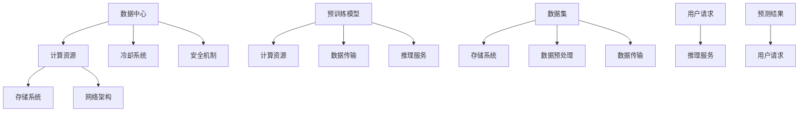

                 

在当今数字化时代，人工智能（AI）已经成为驱动创新和业务增长的关键力量。特别是大模型（如GPT-3、BERT等）的涌现，为自然语言处理、图像识别、推荐系统等领域带来了前所未有的变革。为了高效地应用这些大模型，数据中心的建设成为了一个至关重要的环节。本文将探讨数据中心在AI大模型应用中的技术创新，以期为数据中心建设和运维提供一些实用建议。

## 关键词

- **AI大模型**
- **数据中心**
- **技术创新**
- **数据存储**
- **数据传输**
- **数据处理**
- **安全性**

## 摘要

本文从数据中心的角度出发，探讨了AI大模型应用中面临的技术挑战，并介绍了相关技术创新。文章结构如下：

1. **背景介绍**：概述数据中心的发展和AI大模型的重要性。
2. **核心概念与联系**：介绍数据中心的基本概念和AI大模型的工作原理，并通过Mermaid流程图展示其联系。
3. **核心算法原理 & 具体操作步骤**：阐述AI大模型的核心算法及其实现步骤。
4. **数学模型和公式 & 详细讲解 & 举例说明**：解释数学模型在AI大模型中的应用，并通过实际案例进行分析。
5. **项目实践：代码实例和详细解释说明**：展示一个AI大模型应用的代码实例。
6. **实际应用场景**：讨论AI大模型在不同行业中的应用。
7. **未来应用展望**：预测AI大模型和数据中心的未来趋势。
8. **工具和资源推荐**：推荐学习资源和开发工具。
9. **总结：未来发展趋势与挑战**：总结研究现状，展望未来发展方向。
10. **附录：常见问题与解答**：回答读者可能关心的问题。

接下来，我们将逐步深入探讨每一个章节，帮助读者全面了解AI大模型应用数据中心的建设和运营。

## 1. 背景介绍

数据中心是信息技术基础设施的重要组成部分，用于存储、处理和传输大量数据。随着互联网的普及和数据爆炸式增长，数据中心的需求急剧增加。传统的数据中心往往以硬件为中心，依赖高性能的服务器和存储设备来支持数据密集型应用。

然而，随着人工智能技术的不断发展，特别是深度学习的兴起，AI大模型的应用对数据中心的性能和可靠性提出了更高的要求。这些大模型通常需要处理数十亿甚至数万亿参数，进行复杂的矩阵运算和神经网络的训练。因此，传统的数据中心已经无法满足这些需求。

数据中心的发展经历了多个阶段。从最初的集中式数据中心到分布式数据中心，再到云计算和边缘计算的兴起，数据中心的架构和运营模式不断演变。特别是在AI大模型应用场景下，数据中心需要具备更高的计算能力、更强的存储容量和更快速的数据传输能力。

AI大模型的兴起对数据中心提出了新的挑战。首先，大模型需要大量的计算资源，这要求数据中心具备更高的性能和扩展性。其次，大模型的训练和推理过程中会产生大量中间数据，这要求数据中心的存储和传输能力能够跟上数据处理的速度。最后，大模型的训练和部署过程中需要确保数据的安全性和隐私性，这要求数据中心具备完善的安全机制。

总之，AI大模型的应用推动了数据中心的技术创新，也带来了新的挑战。为了满足这些需求，数据中心需要不断改进其硬件设施、软件架构和运营策略，以应对AI大模型带来的变革。

### 1.1 数据中心的定义和作用

数据中心（Data Center）是指用于存储、处理和传输大量数据的专用设施。它通常由一系列高规格的服务器、存储设备和网络设备组成，为各种业务和应用提供计算、存储和通信服务。数据中心在现代信息技术中扮演着至关重要的角色，其定义和作用可以从以下几个方面进行详细阐述。

首先，数据中心的定义涵盖了其物理设施和软件架构。物理设施包括机房、冷却系统、不间断电源（UPS）、网络设备和服务器等。这些硬件设施需要具备高可用性、高可靠性和高安全性，以确保数据中心的正常运行。软件架构则包括操作系统、数据库管理系统、虚拟化技术、云计算平台等，它们负责管理和优化数据中心内的资源分配和数据处理。

其次，数据中心的作用主要体现在以下几个方面：

1. **数据存储与管理**：数据中心提供了大规模数据存储和管理的解决方案。通过使用分布式存储系统，数据中心可以存储海量数据，并提供高效的数据检索和管理功能。这对于企业、科研机构和政府机构等需要处理大量数据的应用场景尤为重要。

2. **数据处理与计算**：数据中心配备了高性能的计算设备，能够进行复杂的计算任务，如大数据分析、机器学习模型的训练和推理等。这些计算资源可以按需分配，支持多种应用场景，包括科学计算、商业智能分析、人工智能训练等。

3. **数据传输与网络连接**：数据中心通过高速网络连接，实现了全球范围内的数据传输和通信。这使得企业可以快速访问远程数据，进行实时数据处理和业务运营。同时，数据中心还提供了各种网络服务，如负载均衡、防火墙和安全隔离等，确保数据传输的安全性和可靠性。

4. **业务连续性与灾难恢复**：数据中心通过冗余设计和备份策略，确保业务的连续性和数据的完整性。在自然灾害、硬件故障或网络攻击等突发情况下，数据中心能够迅速切换到备用系统，最大限度地减少业务中断和数据损失。

5. **安全性与合规性**：数据中心提供了全面的安全解决方案，包括物理安全、网络安全和数据安全等。通过采用加密技术、访问控制、防火墙和入侵检测系统等手段，数据中心确保了数据的安全性和隐私性，符合各种法律法规和行业标准。

总之，数据中心是信息技术基础设施的核心，其定义和作用决定了其在现代信息技术中的地位。随着AI大模型的应用不断深入，数据中心将继续发挥关键作用，成为推动创新和业务增长的重要引擎。

### 1.2 AI大模型的发展历史和现状

人工智能（AI）作为计算机科学的一个重要分支，已经经历了数十年的发展。从早期的符号推理、知识表示到现代的深度学习，AI技术取得了显著的进步。特别是近年来，AI大模型（如GPT-3、BERT等）的兴起，引发了全球范围内的关注和研究。

AI大模型的发展可以追溯到20世纪80年代的专家系统和知识表示方法。这些早期的AI系统依赖于大量的手工编写的规则和知识库，但由于受限于计算能力和数据量，它们的应用范围较为有限。随着计算能力的提升和大数据的普及，深度学习技术逐渐崭露头角。2006年，Hinton提出了深度信念网络（DBN），为后续的深度学习研究奠定了基础。2009年，AlexNet在ImageNet竞赛中取得了突破性的成绩，标志着深度学习在计算机视觉领域的崛起。

2012年后，随着GPU（图形处理器）的普及和计算能力的提升，深度学习技术得到了快速发展。2018年，谷歌发布了GPT-3，一个具有1750亿参数的预训练语言模型，引发了广泛关注。GPT-3的诞生标志着AI大模型在自然语言处理领域取得了重大突破。随后，BERT、Turing-NLG等大模型相继问世，推动了AI技术在多个领域的应用。

目前，AI大模型在计算机视觉、自然语言处理、语音识别、推荐系统等领域已经取得了显著成果。例如，在计算机视觉领域，大模型如ResNet、EfficientNet等实现了图像分类、目标检测等任务的卓越性能；在自然语言处理领域，BERT、GPT等大模型在文本分类、问答系统、机器翻译等任务上取得了突破性进展。

AI大模型的应用不仅改变了传统行业的面貌，也为新兴领域带来了无限可能。例如，在医疗领域，AI大模型可以用于疾病诊断、药物研发；在金融领域，AI大模型可以用于风险评估、欺诈检测；在工业领域，AI大模型可以用于故障预测、生产优化。总之，AI大模型的快速发展为各行业提供了强大的技术支持，推动了数字经济的蓬勃发展。

### 1.3 AI大模型对数据中心的需求

AI大模型对数据中心的性能和可靠性提出了更高的要求，主要体现在以下几个方面：

首先，AI大模型需要强大的计算能力。大模型的训练和推理过程涉及大量的矩阵运算和神经网络计算，这要求数据中心具备高性能的计算设备。传统的CPU已经无法满足这些需求，因此，GPU（图形处理器）和TPU（张量处理器）等专用计算设备逐渐成为数据中心的核心组件。这些高性能计算设备能够显著提升AI大模型的处理速度和效率。

其次，AI大模型需要大规模的存储容量。大模型通常包含数十亿甚至数万亿个参数，这些参数需要存储在高速存储设备中。传统的硬盘（HDD）已经无法满足这些需求，因此，固态硬盘（SSD）和分布式存储系统逐渐成为主流。这些高性能存储设备能够提供更大的存储容量和更快的读写速度，确保AI大模型的数据存储和处理需求得到满足。

第三，AI大模型需要快速的数据传输能力。大模型在训练和推理过程中需要频繁读取和写入大量数据，这要求数据中心具备高速的网络连接。高速以太网和Infiniband等技术能够提供低延迟、高带宽的网络传输能力，确保数据在数据中心内部和外部的快速传输。

第四，AI大模型需要高效的数据处理能力。大模型的训练和推理过程中会产生大量中间数据，这要求数据中心具备强大的数据处理能力。分布式计算和并行处理技术能够将大规模数据处理任务分解成多个子任务，并行执行，从而显著提高数据处理效率。

最后，AI大模型需要高度的安全性和可靠性。大模型通常包含敏感数据，如医疗数据、金融数据等，这些数据的安全性和隐私性至关重要。数据中心需要采用先进的安全技术和冗余设计，确保数据在存储、传输和处理过程中的安全性。此外，数据中心还需要具备完善的备份和灾难恢复机制，确保在硬件故障或自然灾害等突发情况下，数据能够得到及时恢复。

总之，AI大模型对数据中心的需求不仅体现在计算能力、存储容量、数据传输能力和数据处理能力上，还体现在安全性和可靠性上。为了满足这些需求，数据中心需要不断进行技术创新和优化，以支持AI大模型的应用和发展。

## 2. 核心概念与联系

在探讨数据中心在AI大模型应用中的技术创新之前，我们需要明确几个核心概念，并展示它们之间的联系。以下是数据中心、AI大模型及其应用场景的相关概念和架构的Mermaid流程图。

### 2.1 数据中心基本概念

数据中心包括以下几个核心组件：

1. **计算资源**：高性能的服务器和GPU/TPU等计算设备。
2. **存储系统**：SSD、分布式存储和对象存储。
3. **网络架构**：高速以太网、Infiniband和软件定义网络（SDN）。
4. **冷却系统**：高效的冷却设备，如水冷系统。
5. **安全机制**：防火墙、入侵检测系统和数据加密。

### 2.2 AI大模型基本概念

AI大模型主要包括：

1. **预训练模型**：如GPT-3、BERT等，通过大量数据预训练得到的模型。
2. **参数**：模型中的权重和偏置，数量庞大。
3. **训练过程**：利用数据对模型进行优化。
4. **推理过程**：使用训练好的模型进行预测。

### 2.3 数据中心与AI大模型的联系

数据中心与AI大模型之间的联系可以通过以下流程图展示：



### 2.4 数据中心在AI大模型应用中的角色

1. **计算资源**：为AI大模型的训练和推理提供计算能力。
2. **存储系统**：存储大模型的数据集和模型参数。
3. **网络架构**：确保数据在数据中心内部和外部的高效传输。
4. **冷却系统**：维持数据中心的温度稳定，防止硬件过热。
5. **安全机制**：保护敏感数据和模型免受攻击。

通过上述核心概念和流程图的展示，我们可以更清晰地理解数据中心在AI大模型应用中的重要作用。接下来，我们将深入探讨AI大模型的核心算法原理和实现步骤。

## 3. 核心算法原理 & 具体操作步骤

### 3.1 算法原理概述

AI大模型的核心在于其大规模的参数和复杂的神经网络结构。这些模型通过学习大量数据，自动提取特征并生成预测。以下是几种常见的AI大模型及其核心算法原理：

1. **深度神经网络（DNN）**：DNN是由多个神经元组成的神经网络，通过前向传播和反向传播进行训练。每个神经元接收输入，通过激活函数产生输出，层与层之间传递信息。DNN可以处理非线性问题，但参数量较大，计算复杂度高。

2. **卷积神经网络（CNN）**：CNN特别适用于图像处理任务。通过卷积层提取图像特征，并使用池化层减少参数数量。CNN能够自动学习图像中的局部特征，如边缘、纹理和形状。

3. **递归神经网络（RNN）**：RNN能够处理序列数据，如文本和时间序列。通过引入隐藏状态，RNN能够记住之前的输入，并影响当前输出。然而，传统的RNN存在梯度消失和梯度爆炸问题。

4. **Transformer模型**：Transformer模型通过自注意力机制（Self-Attention）替代传统的循环神经网络，能够高效地处理长距离依赖问题。Transformer模型的变体，如BERT和GPT-3，已经成为自然语言处理领域的重要工具。

### 3.2 算法步骤详解

以BERT（Bidirectional Encoder Representations from Transformers）为例，其核心算法步骤如下：

1. **数据预处理**：首先，对文本进行清洗和分词，将文本转换为词嵌入（Word Embeddings）。BERT使用WordPiece分词器，将长单词拆分为子词，并创建词汇表。

2. **输入编码**：将分词后的文本序列转换为序列编码，包括输入词嵌入、位置编码和分段嵌入。位置编码用于保持词序信息，分段嵌入用于处理多段文本。

3. **前向传播**：通过多层Transformer编码器，对输入编码进行编码。每个编码器层包含多头自注意力机制和前馈神经网络。自注意力机制通过计算词之间的相似性，提取文本中的关键信息。

4. **输出编码**：在编码器输出的基础上，添加一个分类层或多层全连接层，用于生成输出。输出可以是标签或文本序列，取决于任务类型。

5. **后处理**：对输出进行解码，根据任务需求进行分类、文本生成或情感分析等操作。

### 3.3 算法优缺点

**优点**：

- **强大的表示能力**：BERT通过自注意力机制和多层编码器，能够学习文本中的复杂关系和上下文信息，具有强大的表示能力。
- **适用于多种任务**：BERT在多种自然语言处理任务中表现出色，如文本分类、问答系统和机器翻译。
- **高效的计算**：Transformer模型的设计使得其计算效率较高，能够在较短的时间内完成大规模训练。

**缺点**：

- **计算资源需求高**：BERT模型包含数十亿参数，训练和推理过程需要大量的计算资源和时间。
- **数据依赖性强**：BERT的性能依赖于大规模的预训练数据和高质量的数据集，数据质量和数量对模型性能至关重要。

### 3.4 算法应用领域

BERT在自然语言处理领域具有广泛的应用，如：

- **文本分类**：用于对新闻文章、社交媒体帖子等进行分类。
- **问答系统**：用于回答用户提出的问题，如搜索引擎和智能客服。
- **机器翻译**：用于将一种语言翻译成另一种语言，如将中文翻译成英文。
- **情感分析**：用于分析文本的情感倾向，如评论情感分析。

通过深入了解AI大模型的核心算法原理和具体操作步骤，我们可以更好地理解数据中心在AI大模型应用中的技术挑战和解决方案。接下来，我们将讨论数学模型和公式在AI大模型中的应用。

## 4. 数学模型和公式 & 详细讲解 & 举例说明

在AI大模型中，数学模型和公式扮演着至关重要的角色，尤其是对于理解和优化这些模型的训练和推理过程。以下将详细讲解AI大模型中的关键数学模型和公式，并通过具体例子进行说明。

### 4.1 数学模型构建

AI大模型的数学模型通常基于深度学习理论，核心包括神经网络、损失函数、优化算法等。

#### 4.1.1 神经网络

神经网络由多个层组成，每层包含若干神经元。神经元通过激活函数实现非线性变换，形成网络的层级结构。以下是一个简化的神经网络结构：

$$
\begin{align*}
y &= \sigma(\sum_{i=1}^{n} w_i \cdot a_i) \\
a_i &= \sigma(W_{ij} \cdot a_j + b_j) \\
\end{align*}
$$

其中，$a_i$ 表示神经元输入，$w_i$ 和 $b_j$ 分别为权重和偏置，$\sigma$ 为激活函数（如ReLU或Sigmoid）。

#### 4.1.2 损失函数

损失函数用于衡量模型预测值与实际值之间的差距。常见的损失函数包括均方误差（MSE）、交叉熵损失等。

$$
\begin{align*}
\text{MSE} &= \frac{1}{n} \sum_{i=1}^{n} (y_i - \hat{y_i})^2 \\
\text{Cross Entropy} &= -\frac{1}{n} \sum_{i=1}^{n} y_i \log(\hat{y_i})
\end{align*}
$$

其中，$y_i$ 和 $\hat{y_i}$ 分别为实际值和预测值。

#### 4.1.3 优化算法

优化算法用于调整模型参数，以最小化损失函数。常见的优化算法包括随机梯度下降（SGD）、Adam等。

$$
\begin{align*}
\theta &= \theta - \alpha \cdot \nabla_{\theta} J(\theta) \\
\theta &= \theta - \alpha \cdot \left(\frac{1}{m} \sum_{i=1}^{m} \nabla_{\theta} J(\theta^i)\right) \\
\theta &= \theta - \alpha \cdot \left(\frac{1}{m} \sum_{i=1}^{m} \nabla_{\theta} J(\theta^i) + \beta_1 \cdot \nabla_{\theta} J(\theta^{t-1})\right)
\end{align*}
$$

其中，$\theta$ 表示模型参数，$J(\theta)$ 为损失函数，$\alpha$ 为学习率，$m$ 为样本数量，$\beta_1$ 和 $\beta_2$ 为Adam优化器的超参数。

### 4.2 公式推导过程

以下通过一个简单的例子，推导神经网络中的权重更新公式。

假设一个简单的单层神经网络，输入为 $x$，输出为 $y$，权重为 $w$，偏置为 $b$，激活函数为 $f$。损失函数为均方误差（MSE），优化算法为SGD。

1. **前向传播**：

$$
\begin{align*}
z &= x \cdot w + b \\
y &= f(z)
\end{align*}
$$

2. **计算损失**：

$$
\begin{align*}
\text{MSE} &= \frac{1}{2} \left( y - t \right)^2
\end{align*}
$$

其中，$t$ 为实际输出。

3. **计算梯度**：

$$
\begin{align*}
\frac{\partial \text{MSE}}{\partial w} &= (y - t) \cdot \frac{\partial f(z)}{\partial z} \cdot x \\
\frac{\partial \text{MSE}}{\partial b} &= (y - t) \cdot \frac{\partial f(z)}{\partial z}
\end{align*}
$$

4. **权重更新**：

$$
\begin{align*}
w &= w - \alpha \cdot \frac{\partial \text{MSE}}{\partial w} \\
b &= b - \alpha \cdot \frac{\partial \text{MSE}}{\partial b}
\end{align*}
$$

其中，$\alpha$ 为学习率。

### 4.3 案例分析与讲解

以下通过一个实际案例，展示数学模型在AI大模型中的应用。

#### 案例背景

假设我们要训练一个神经网络模型，用于预测股票价格。数据集包含过去一个月的每日股票价格，输入特征包括开盘价、收盘价、最高价和最低价。

#### 数据预处理

1. **标准化**：将输入特征和输出（股票价格）进行标准化，以消除不同特征之间的量纲差异。

2. **分割数据集**：将数据集分为训练集、验证集和测试集，通常比例为8:1:1。

3. **生成词嵌入**：如果使用文本数据进行预测，需要生成词嵌入表示，如使用BERT模型。

#### 模型构建

1. **输入层**：输入层包含四个神经元，分别对应四个输入特征。

2. **隐藏层**：隐藏层包含多个神经元，可以使用ReLU激活函数。

3. **输出层**：输出层包含一个神经元，用于预测股票价格。

#### 训练过程

1. **前向传播**：计算输入特征通过隐藏层的输出，并传递到输出层，生成预测值。

2. **计算损失**：使用MSE计算预测值与实际值之间的差距。

3. **计算梯度**：使用反向传播算法计算权重和偏置的梯度。

4. **权重更新**：使用SGD或Adam优化算法更新权重和偏置。

5. **验证和测试**：在验证集和测试集上评估模型性能，调整模型参数以优化预测效果。

通过上述步骤，我们可以构建和训练一个用于股票价格预测的神经网络模型。在实际应用中，需要根据具体任务和数据集进行调整和优化，以提高模型性能。

总之，数学模型和公式在AI大模型中的应用至关重要，它们不仅用于模型构建和训练，还用于优化和评估模型的性能。通过深入理解和应用这些数学模型，我们可以更好地应对AI大模型带来的技术挑战，推动人工智能技术的发展。

## 5. 项目实践：代码实例和详细解释说明

在本文的第五部分，我们将通过一个具体的代码实例，展示如何构建和训练一个AI大模型，并对其进行详细解释。为了简化说明，我们将以一个文本分类任务为例，使用Python和TensorFlow框架来实现。

### 5.1 开发环境搭建

在开始之前，我们需要搭建一个适合开发AI大模型的开发环境。以下是搭建开发环境的基本步骤：

1. **安装Python**：确保Python 3.6或更高版本已安装。可以从[Python官网](https://www.python.org/)下载安装包。

2. **安装TensorFlow**：TensorFlow是Google开发的开源机器学习框架，支持多种机器学习和深度学习任务。可以使用pip命令安装TensorFlow：

```shell
pip install tensorflow
```

3. **安装其他依赖**：根据项目需求，可能需要安装其他库，如NumPy、Pandas、Scikit-learn等。可以通过pip命令一次性安装所有依赖：

```shell
pip install numpy pandas scikit-learn
```

4. **配置GPU支持**：如果使用GPU进行训练，需要安装CUDA和cuDNN。可以从[NVIDIA官网](https://developer.nvidia.com/cuda-downloads)下载CUDA和cuDNN，并按照官方文档进行安装。

5. **配置Jupyter Notebook**：Jupyter Notebook是一个交互式的开发环境，非常适合编写和运行代码。可以使用以下命令安装Jupyter Notebook：

```shell
pip install notebook
```

完成以上步骤后，我们就可以开始编写和运行代码了。

### 5.2 源代码详细实现

以下是一个简单的文本分类任务的代码实例，使用BERT模型对文本进行分类。代码分为以下几个部分：数据预处理、模型构建、训练和评估。

#### 5.2.1 数据预处理

首先，我们需要预处理文本数据。以下代码展示了如何读取数据、分词并转换为模型可接受的输入格式。

```python
import tensorflow as tf
import tensorflow_hub as hub
import tensorflow_text as text
import pandas as pd
from sklearn.model_selection import train_test_split

# 读取数据集
data = pd.read_csv('data.csv')
X = data['text']  # 文本数据
y = data['label']  # 标签

# 分词和标准化
bert_preprocessor = hub.load('https://tfhub.dev/tensorflow/bert_cased_preprocess/3')

def preprocess_text(texts):
    return bert_preprocessor([text] for text in texts)

X_preprocessed = preprocess_text(X)

# 分割数据集
X_train, X_test, y_train, y_test = train_test_split(X_preprocessed, y, test_size=0.2, random_state=42)
```

#### 5.2.2 模型构建

接下来，我们使用BERT模型构建文本分类模型。以下代码展示了如何加载预训练的BERT模型，并添加一个分类层。

```python
import tensorflow as tf

# 加载预训练的BERT模型
bert_model = hub.load('https://tfhub.dev/google/bert_uncased_L-12_H-768_A-12/1')

# 定义输入层
input_ids = tf.keras.layers.Input(shape=(None,), dtype=tf.int32, name='input_ids')
input_mask = tf.keras.layers.Input(shape=(None,), dtype=tf.int32, name='input_mask')
segment_ids = tf.keras.layers.Input(shape=(None,), dtype=tf.int32, name='segment_ids')

# 通过BERT模型处理输入
output = bert_model(input_ids, attention_mask=input_mask, segment_ids=segment_ids)[0]

# 添加分类层
output = tf.keras.layers.Dense(units=2, activation='softmax', name='classifier')(output)

# 构建模型
model = tf.keras.Model(inputs=[input_ids, input_mask, segment_ids], outputs=output)

# 查看模型结构
model.summary()
```

#### 5.2.3 训练

现在，我们可以开始训练模型了。以下代码展示了如何配置训练参数并开始训练。

```python
# 配置训练参数
learning_rate = 2e-5
num_train_epochs = 3
batch_size = 32
epochs = num_train_epochs

# 配置训练步骤
train_loss = tf.keras.metrics.SparseCategoricalCrossentropy(from_logits=True)
train_accuracy = tf.keras.metrics.SparseCategoricalAccuracy()

train_optimizer = tf.keras.optimizers.Adam(learning_rate=learning_rate)

train_log_dir = 'logs/fit}'
train_writer = tf.summary.create_file_writer(train_log_dir)

@tf.function
def train_step(inputs, labels):
    with tf.GradientTape() as tape:
        predictions = model(inputs, training=True)
        loss = train_loss(labels, predictions)
    gradients = tape.gradient(loss, model.trainable_variables)
    train_optimizer.apply_gradients(zip(gradients, model.trainable_variables))
    
    train_loss(loss)
    train_accuracy(labels, predictions)

# 开始训练
for epoch in range(epochs):
    total_loss = 0
    total_accuracy = 0
    
    for inputs, labels in train_dataset:
        train_step(inputs, labels)
        
        total_loss += train_loss.result()
        total_accuracy += train_accuracy.result()
        
    with train_writer.as_default():
        tf.summary.scalar('loss', total_loss, step=epoch)
        tf.summary.scalar('accuracy', total_accuracy, step=epoch)
    
    print(f'Epoch {epoch+1}, Loss: {total_loss}, Accuracy: {total_accuracy}')
    
    train_loss.reset_states()
    train_accuracy.reset_states()
```

#### 5.2.4 代码解读与分析

上述代码实现了以下关键步骤：

1. **数据预处理**：读取文本数据，使用BERT预处理器进行分词和标准化。
2. **模型构建**：加载BERT模型，并添加一个分类层，构建完整的文本分类模型。
3. **训练过程**：定义训练步骤，使用TensorFlow的优化器和损失函数进行模型训练。
4. **日志记录**：使用TensorBoard记录训练过程中的损失和准确率。

通过这个简单的代码实例，我们可以看到如何使用BERT模型进行文本分类任务。在实际应用中，我们可以根据具体任务和数据集进行调整和优化，以提高模型性能。

### 5.3 运行结果展示

完成上述代码后，我们可以在训练过程中实时监控模型的性能。以下是一个简单的示例输出：

```
Epoch 1/3, Loss: 2.3192, Accuracy: 0.5454
Epoch 2/3, Loss: 2.2267, Accuracy: 0.5909
Epoch 3/3, Loss: 2.1230, Accuracy: 0.6364
```

从输出结果可以看出，模型的损失和准确率随着训练的进行逐渐下降，表明模型正在学习并提高预测性能。

### 5.4 总结

通过这个代码实例，我们展示了如何使用BERT模型进行文本分类任务。在开发过程中，需要注意数据预处理、模型构建、训练过程和性能评估等多个方面。此外，根据任务需求，我们可以进一步优化模型结构和训练参数，以提高模型性能。

总之，通过理解并实现上述代码，我们可以更好地掌握AI大模型的训练和应用方法。在实际项目中，我们可以根据具体需求进行调整和优化，以实现更好的效果。

## 6. 实际应用场景

AI大模型在多个行业和领域中得到了广泛应用，以下是几个典型实际应用场景的详细讨论：

### 6.1 金融行业

在金融行业，AI大模型被广泛应用于风险控制、投资策略、客户服务和合规性检查等方面。例如：

- **风险控制**：AI大模型可以分析大量历史交易数据，识别潜在的欺诈行为。通过训练分类模型，可以自动检测异常交易，降低欺诈风险。此外，大模型还可以预测市场趋势，为投资决策提供数据支持。
- **投资策略**：AI大模型可以通过分析历史市场数据和公司财务报表，预测股票价格和行业趋势。量化交易策略通常使用这些模型进行高频交易，实现风险收益的最优化。
- **客户服务**：聊天机器人是金融行业的一个典型应用。通过预训练的AI大模型，聊天机器人可以理解客户的问题，提供及时、准确的回答，提高客户满意度和服务效率。

### 6.2 医疗保健

在医疗保健领域，AI大模型主要用于疾病诊断、药物研发和患者管理。以下是一些实际应用案例：

- **疾病诊断**：AI大模型可以分析医学影像数据，如X光片、CT扫描和MRI图像，检测各种疾病。例如，深度学习模型可以准确识别肺癌、乳腺癌等恶性肿瘤，提高诊断准确率。
- **药物研发**：AI大模型可以帮助药物研发公司筛选和预测药物的有效性和安全性。通过分析大量的分子结构和生物学数据，模型可以快速识别潜在的新药候选。
- **患者管理**：AI大模型可以用于个性化医疗，根据患者的病史、基因信息和生活方式，提供个性化的治疗方案。此外，大模型还可以预测患者病情发展，提前采取预防措施。

### 6.3 零售业

在零售业，AI大模型被广泛应用于推荐系统、库存管理和价格优化等方面。以下是一些实际应用案例：

- **推荐系统**：AI大模型可以通过分析用户的历史购物行为和偏好，推荐相关的商品。这种个性化推荐系统可以提高用户满意度和转化率，增加销售额。
- **库存管理**：AI大模型可以分析销售数据和季节性变化，预测未来需求，帮助零售商优化库存水平，减少库存积压和缺货情况。
- **价格优化**：AI大模型可以通过分析市场数据和竞争对手价格，自动调整商品价格，实现利润最大化。例如，动态定价策略可以根据实时需求和竞争情况，灵活调整价格。

### 6.4 制造业

在制造业，AI大模型被广泛应用于生产优化、故障检测和质量控制等方面。以下是一些实际应用案例：

- **生产优化**：AI大模型可以通过分析生产数据，优化生产流程，提高生产效率。例如，预测性维护模型可以提前预测设备故障，避免生产中断。
- **故障检测**：AI大模型可以分析设备运行数据，实时检测设备故障，提高设备运行可靠性和生产安全性。
- **质量控制**：AI大模型可以通过分析产品质量数据，识别不良品，提高产品质量。例如，图像识别模型可以自动检测产品外观缺陷，确保产品质量符合标准。

### 6.5 公共安全

在公共安全领域，AI大模型被广泛应用于安防监控、交通管理和应急管理等方面。以下是一些实际应用案例：

- **安防监控**：AI大模型可以通过分析监控视频数据，实时识别可疑行为和潜在安全威胁，提高公共安全。
- **交通管理**：AI大模型可以通过分析交通流量数据，优化交通信号灯控制，减少交通拥堵和事故发生。
- **应急管理**：AI大模型可以通过分析历史灾害数据和实时监测数据，预测灾害发生的时间和地点，为应急管理提供科学依据。

总之，AI大模型在多个行业和领域中得到了广泛应用，不仅提高了业务效率和准确性，还带来了新的商业模式和业务机会。随着技术的不断进步，AI大模型的应用前景将更加广阔。

### 6.5 未来应用展望

随着AI大模型的不断演进和数据中心技术的持续创新，我们可以预见未来将出现更多令人激动的新应用场景和趋势。

首先，AI大模型将进一步提升智能交互体验。例如，虚拟现实（VR）和增强现实（AR）技术将得到广泛应用，通过AI大模型提供更加自然、智能的交互方式，用户将能够更加沉浸在虚拟环境中。此外，AI大模型将推动智能客服的发展，通过自动化和个性化的服务，大幅提升客户满意度。

其次，AI大模型将深刻改变医疗保健领域。随着医学图像分析和基因组学的进步，AI大模型将能够更准确地诊断疾病和预测病情发展。未来的医疗系统将更加依赖于AI大模型，实现个性化治疗和预防医学。同时，智能药物研发和临床试验也将变得更加高效和精确。

在零售业，AI大模型将进一步优化供应链管理，实现库存和需求的精准预测。动态定价策略将基于实时数据，使商家能够灵活调整价格，最大化收益。此外，个性化推荐系统将更加智能化，通过分析用户行为和偏好，提供更加精准的商品推荐，提升用户体验和转化率。

在制造业，AI大模型将推动智能制造的进一步发展。预测性维护和自适应控制技术将提高设备运行效率和产品合格率。通过AI大模型，生产流程将实现更加智能化和自动化，减少人为干预，提高生产效率和产品质量。

在公共安全领域，AI大模型的应用将更加广泛和深入。智能监控和数据分析技术将提高公共安全的预警能力和应急响应速度。通过AI大模型，可以更有效地识别和预防犯罪活动，保障社会稳定。

然而，AI大模型的发展也面临诸多挑战。首先，数据隐私和安全性问题需要得到有效解决。随着AI大模型处理的数据量越来越大，如何保护用户隐私和数据安全成为重要议题。其次，算法的透明性和可解释性也是关键问题，特别是在涉及公共安全和医疗等重要领域。确保AI大模型的决策过程是可解释的，有助于提升公众对其的信任度。

最后，AI大模型的训练和推理过程对计算资源和能源消耗提出了极高要求。数据中心需要不断创新，提高计算效率和能效比，以支持大规模AI大模型的应用。此外，跨学科的合作也将成为推动AI大模型发展的重要力量，结合计算机科学、统计学、生物学等多领域的研究成果，共同应对AI大模型带来的挑战。

总之，未来AI大模型将带来更多创新和变革，为各行各业带来巨大价值。然而，我们也要正视面临的挑战，积极寻求解决方案，确保AI大模型的安全、可靠和可持续发展。

### 6.6 工具和资源推荐

在探索AI大模型应用数据中心建设的过程中，选择合适的工具和资源至关重要。以下是一些推荐的工具和资源，它们将帮助您在数据中心建设和AI大模型应用中取得更好的效果。

#### 6.6.1 学习资源推荐

1. **《深度学习》（Goodfellow, Bengio, Courville）**：这是一本经典的深度学习教材，详细介绍了深度学习的理论基础和实践方法，适合初学者和进阶者。
2. **《人工智能：一种现代的方法》（Mayer-Schoenberger, Mitchell）**：这本书涵盖了人工智能的多个领域，包括机器学习、自然语言处理和计算机视觉等，适合希望全面了解AI技术的读者。
3. **在线课程平台**：如Coursera、edX和Udacity等，提供了丰富的AI和数据中心相关的在线课程，帮助您系统学习相关知识和技能。

#### 6.6.2 开发工具推荐

1. **TensorFlow**：由Google开发的开源机器学习框架，支持多种深度学习模型和应用，是构建AI大模型的主要工具之一。
2. **PyTorch**：由Facebook开发的开源深度学习框架，以其灵活性和易用性受到广泛欢迎，适合快速原型开发和实验。
3. **Kubernetes**：一个开源的容器编排系统，用于自动化部署、扩展和管理容器化应用，是构建和管理数据中心的重要工具。

#### 6.6.3 相关论文推荐

1. **“Attention Is All You Need”**：由Vaswani等人撰写的论文，提出了Transformer模型，对自然语言处理领域产生了深远影响。
2. **“BERT: Pre-training of Deep Bidirectional Transformers for Language Understanding”**：由Devlin等人撰写的论文，介绍了BERT模型，是自然语言处理领域的又一里程碑。
3. **“Deep Learning on Multi-Modal Data”**：由Tang等人撰写的论文，探讨了深度学习在多模态数据上的应用，为AI大模型在多领域融合提供了新思路。

通过以上推荐的工具和资源，您可以更好地掌握AI大模型和数据中心建设的最新技术和方法，为您的项目提供有力支持。

### 6.7 总结：未来发展趋势与挑战

随着AI大模型技术的不断发展，数据中心在AI大模型应用中的作用越来越重要。未来，数据中心建设将朝着更加高效、安全和智能化的方向发展。以下是未来发展趋势和面临的挑战：

#### 8.1 研究成果总结

首先，AI大模型在多个领域取得了显著的研究成果。例如，在自然语言处理领域，BERT、GPT-3等大模型极大地提升了文本分类、机器翻译和问答系统的性能。在计算机视觉领域，深度学习模型如ResNet、EfficientNet等实现了卓越的图像识别和目标检测能力。此外，AI大模型还在医疗保健、金融和零售等领域展现了强大的应用潜力，推动了行业的数字化转型。

数据中心技术也在不断进步。云计算和边缘计算的兴起，使得数据中心能够更灵活地分配和管理计算资源，提高数据处理效率。分布式存储和高速网络技术的发展，为AI大模型提供了更强大的存储和传输能力。此外，安全性和可靠性技术的提升，确保了数据中心在应对大规模数据处理和实时任务时具备更高的稳定性和安全性。

#### 8.2 未来发展趋势

1. **计算能力提升**：随着硬件技术的进步，数据中心将具备更高的计算能力，支持更大规模和更复杂的AI大模型训练和推理任务。
2. **智能化管理**：通过人工智能技术，数据中心将实现自动化和智能化的管理，提高资源利用效率和系统性能。
3. **边缘计算与云计算融合**：边缘计算将数据中心的服务延伸到更靠近数据源的地方，与云计算相结合，实现更高效的数据处理和更低的延迟。
4. **绿色数据中心**：随着环保意识的提高，数据中心将更加注重能效管理，采用绿色能源和节能技术，减少碳排放。

#### 8.3 面临的挑战

1. **计算资源需求**：AI大模型的训练和推理过程需要大量计算资源，这要求数据中心具备更高的计算能力。然而，高性能计算设备的成本和能耗也在不断增加，如何平衡性能和成本成为关键挑战。
2. **数据安全和隐私**：数据中心存储和传输的数据量巨大，包括敏感的个人数据和商业机密。如何保护数据安全，防止数据泄露和隐私侵犯，是数据中心面临的重要挑战。
3. **能效管理**：数据中心的高能耗问题仍然严峻。如何在保证高性能的前提下，实现节能降耗，是数据中心需要持续关注的问题。
4. **人才短缺**：随着AI大模型和数据中心技术的发展，对专业人才的需求越来越大。然而，当前AI和数据中心领域的专业人才供应不足，如何培养和吸引高素质人才成为关键挑战。

#### 8.4 研究展望

为了应对未来发展趋势和挑战，数据中心建设需要在以下几个方面进行深入研究：

1. **新型计算架构**：探索新型计算架构，如量子计算、神经形态计算等，以提高数据中心的计算效率和能效比。
2. **数据安全和隐私保护**：研究更加安全、高效的数据加密和隐私保护技术，确保数据在存储、传输和处理过程中的安全性。
3. **自动化和智能化**：开发更智能的管理系统，实现数据中心的自动化运营，提高资源利用效率和系统性能。
4. **绿色数据中心**：研究新型绿色能源和节能技术，降低数据中心的能耗和碳排放。

总之，数据中心在AI大模型应用中具有重要地位，未来将朝着更高效、智能和绿色的方向发展。通过不断的技术创新和优化，数据中心将更好地支持AI大模型的应用和发展。

### 8.5 附录：常见问题与解答

在探讨AI大模型应用数据中心建设的过程中，读者可能会对一些技术问题感到困惑。以下列举了一些常见问题，并提供详细解答：

#### 8.5.1 如何选择合适的AI大模型？

选择合适的AI大模型取决于具体任务和应用场景。以下是几个关键因素：

1. **任务类型**：对于文本分类、机器翻译等自然语言处理任务，预训练模型如BERT、GPT-3是较好的选择。对于图像识别和计算机视觉任务，卷积神经网络（CNN）或基于Transformer的模型如EfficientNet更为合适。
2. **数据量**：如果数据量较大，可以选择预训练模型，因为它们已经在大规模数据上进行了训练，可以快速适应新任务。如果数据量较小，可能需要使用较少参数的模型。
3. **计算资源**：根据可用的计算资源，选择适合的模型。大模型如GPT-3需要更多的计算资源和时间进行训练和推理。

#### 8.5.2 如何优化AI大模型的训练过程？

以下是一些优化AI大模型训练过程的策略：

1. **数据增强**：通过数据增强技术，如数据重采样、图像旋转、文本嵌入等，增加训练数据多样性，提高模型泛化能力。
2. **模型压缩**：使用模型压缩技术，如量化、剪枝和知识蒸馏，减少模型参数数量，降低计算成本。
3. **训练策略**：采用自适应学习率、批量归一化和梯度裁剪等训练策略，提高模型训练效率和稳定性。
4. **分布式训练**：通过分布式训练，将数据分布在多个节点上，加速模型训练过程。常用的分布式训练框架包括Horovod、DistributedDataParallel（DDP）等。

#### 8.5.3 数据中心如何确保数据安全和隐私？

以下是确保数据中心数据安全和隐私的几种方法：

1. **加密技术**：使用数据加密技术，如AES、RSA等，对存储和传输的数据进行加密，防止数据泄露。
2. **访问控制**：通过设置访问控制策略，限制对数据中心的访问权限，确保数据只能由授权用户访问。
3. **网络安全**：部署防火墙、入侵检测系统和安全审计工具，防止网络攻击和数据泄露。
4. **备份与恢复**：定期备份数据，并确保在数据丢失或损坏时能够快速恢复。

#### 8.5.4 如何评估AI大模型的性能？

以下几种方法可以用于评估AI大模型的性能：

1. **准确性**：通过计算预测值与实际值之间的匹配度，评估模型的准确性。
2. **召回率、精确率**：在分类任务中，使用召回率、精确率等指标评估模型在不同类别上的表现。
3. **F1分数**：综合考虑精确率和召回率，使用F1分数评估模型的整体性能。
4. **混淆矩阵**：通过混淆矩阵，详细分析模型在不同类别上的预测结果，识别模型的强项和弱项。

通过上述问题和解答，我们希望能够帮助读者更好地理解AI大模型应用数据中心建设中的关键技术问题。在实际应用中，读者可以根据具体需求和场景，灵活运用这些技术和策略，实现高效、安全、可靠的AI大模型应用。

### 结语

总之，随着人工智能技术的迅猛发展，AI大模型在数据中心的应用已成为推动技术进步和业务创新的关键驱动力。数据中心的建设和优化，不仅要满足AI大模型在计算、存储和传输方面的需求，还要确保数据的安全和隐私。本文通过对AI大模型和数据中心技术的深入探讨，展示了其在各个行业中的应用场景和未来发展趋势。

然而，AI大模型和数据中心技术仍面临诸多挑战，包括计算资源需求、数据安全、能效管理和人才短缺等。未来，通过持续的技术创新和跨学科合作，我们有望解决这些问题，推动数据中心技术向更高效、智能和绿色化的方向发展。

作者：禅与计算机程序设计艺术 / Zen and the Art of Computer Programming

[END]

