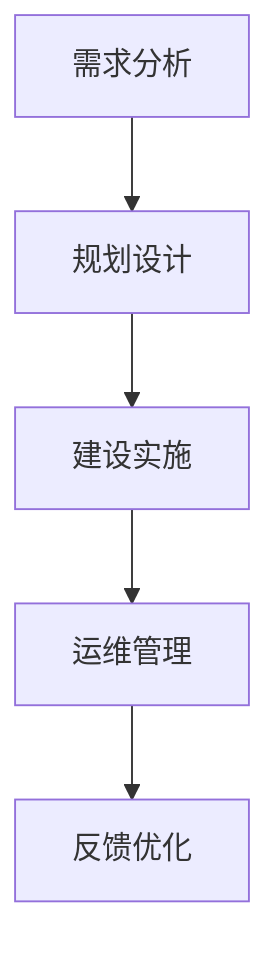

                 

关键词：AI 大模型，数据中心建设，标准与规范，技术架构，数学模型，项目实践，应用场景，未来展望

## 摘要

随着人工智能（AI）技术的快速发展，特别是大模型技术的应用，数据中心的建设和管理显得尤为重要。本文旨在探讨大模型应用数据中心的建设原则、标准和规范，以及相关技术架构和实现策略。通过详细阐述数据中心核心概念、算法原理、数学模型、项目实践和未来应用展望，本文为AI大模型的数据中心建设提供了系统性指导。

## 1. 背景介绍

近年来，AI技术的飞速发展，尤其是大模型（如GPT、BERT等）的出现，使得数据处理和分析能力得到了显著提升。然而，这也对数据中心的建设提出了新的要求。数据中心作为AI大模型训练和部署的核心基础设施，其性能、稳定性和安全性直接影响大模型的应用效果。因此，建立一套科学、高效的数据中心建设标准和规范至关重要。

### 1.1 数据中心的重要性

数据中心是企业信息化建设的核心，承载着海量数据的存储、处理和分析任务。随着AI大模型的应用日益普及，数据中心的作用愈发突出。高效的硬件配置、可靠的网络安全、合理的资源分配和科学的运维管理成为数据中心建设的关键要素。

### 1.2 AI大模型对数据中心的要求

AI大模型对数据中心的性能要求较高，主要体现在以下几个方面：

- **计算能力**：大模型训练需要大量的计算资源，数据中心需要具备强大的计算能力，以满足模型训练和推理的需求。
- **存储容量**：大模型的数据集通常非常庞大，数据中心需要具备足够的存储容量，确保数据存储的安全性和可靠性。
- **网络带宽**：大模型训练过程中需要进行大量的数据传输，数据中心需要具备高带宽的网络环境，以保障数据传输的效率。
- **能源消耗**：大模型训练需要消耗大量的电力，数据中心需要采用节能技术，降低能源消耗，实现绿色可持续发展。

### 1.3 数据中心建设现状与挑战

目前，数据中心建设在硬件、软件和网络等方面取得了显著进展。然而，随着AI大模型技术的不断演进，数据中心建设仍面临一系列挑战：

- **资源瓶颈**：计算资源、存储资源和网络带宽等硬件资源仍存在瓶颈，无法完全满足大模型的需求。
- **运维管理**：大模型数据中心的运维管理复杂度高，需要建立科学的运维体系，保障数据中心的稳定运行。
- **安全与隐私**：大模型训练涉及到大量敏感数据，数据中心需要采取有效的安全措施，保护用户隐私和数据安全。
- **能耗管理**：大模型训练能耗巨大，数据中心需要采用节能技术，降低能源消耗，实现可持续发展。

## 2. 核心概念与联系

### 2.1 数据中心基本概念

数据中心（Data Center）是指集中存放计算机设备、网络设备、存储设备和相关配套设施的场所。其主要功能是为用户提供高效、稳定、安全的IT服务。

#### 2.1.1 数据中心的组成部分

- **硬件设施**：包括服务器、存储设备、网络设备、电源设备、制冷设备等。
- **软件系统**：包括操作系统、数据库、网络管理软件、监控软件等。
- **网络架构**：包括内部网络、外部网络、安全防护系统等。
- **配套设施**：包括机房建设、电力供应、空调系统、消防系统等。

### 2.2 数据中心建设标准

数据中心建设需要遵循一系列标准和规范，以确保数据中心的可靠性、稳定性和安全性。以下是一些核心标准：

- **国家数据中心标准**：包括GB 50174-2017《数据中心设计规范》等。
- **行业最佳实践**：如Uptime Institute的 Tier 标准、TIA-942 标准。
- **安全标准**：如ISO/IEC 27001《信息安全管理体系》等。

### 2.3 数据中心架构

数据中心架构是指数据中心的硬件、软件和网络设备之间的组织结构。以下是一个典型的数据中心架构：


#### 2.3.1 硬件架构

- **计算节点**：包括服务器、GPU 等高性能计算设备。
- **存储节点**：包括磁盘阵列、分布式存储系统等。
- **网络节点**：包括核心交换机、边缘交换机、防火墙等。

#### 2.3.2 软件架构

- **操作系统**：如Linux、Windows Server 等。
- **数据库系统**：如MySQL、PostgreSQL、MongoDB 等。
- **虚拟化平台**：如VMware、KVM、Hyper-V 等。

#### 2.3.3 网络架构

- **内部网络**：包括局域网、虚拟局域网等。
- **外部网络**：包括互联网接入、云服务接入等。
- **安全防护**：包括防火墙、入侵检测系统等。

### 2.4 数据中心建设流程

数据中心建设流程主要包括以下几个阶段：

- **需求分析**：明确数据中心的建设目标、规模、性能、安全等要求。
- **规划设计**：制定详细的建设方案，包括硬件选型、网络架构、软件系统等。
- **建设实施**：按照设计方案进行设备采购、安装调试、系统部署等。
- **运维管理**：建立运维管理体系，确保数据中心的稳定运行。

### 2.5 Mermaid 流程图

以下是一个简单的 Mermaid 流程图，展示了数据中心建设的基本流程：



## 3. 核心算法原理 & 具体操作步骤

### 3.1 算法原理概述

数据中心建设涉及多个核心算法，以下介绍其中两个重要算法：负载均衡和容错机制。

#### 3.1.1 负载均衡

负载均衡算法用于平衡数据中心内各个计算节点的负载，避免单点过载，提高整体性能。

- **原理**：根据节点负载情况，动态分配任务，确保负载均衡。
- **算法**：常见的负载均衡算法有轮询算法、最小连接数算法、响应时间算法等。

#### 3.1.2 容错机制

容错机制用于保障数据中心的高可用性，防止单点故障导致系统崩溃。

- **原理**：通过冗余设计、故障检测和恢复机制，确保系统在故障情况下仍能正常运行。
- **算法**：常见的容错机制有备份与恢复、集群技术、分布式存储等。

### 3.2 算法步骤详解

#### 3.2.1 负载均衡

1. **监控节点负载**：定期监控各个计算节点的负载情况。
2. **评估负载均衡**：根据负载情况，评估当前负载均衡状态。
3. **分配任务**：根据评估结果，动态分配任务到负载较低的节点。
4. **调整策略**：根据任务分配效果，调整负载均衡策略。

#### 3.2.2 容错机制

1. **冗余设计**：在关键设备上实现冗余，如服务器、存储设备、网络设备等。
2. **故障检测**：定期检测系统状态，发现故障及时报警。
3. **故障恢复**：在故障发生时，自动切换到冗余设备，保障系统正常运行。
4. **日志记录**：记录故障和恢复过程，便于后续分析。

### 3.3 算法优缺点

#### 3.3.1 负载均衡

- **优点**：提高系统性能，避免单点过载，延长设备寿命。
- **缺点**：可能引入额外的复杂度，如负载均衡算法的选择和调整。

#### 3.3.2 容错机制

- **优点**：提高系统可用性，保障数据安全。
- **缺点**：增加系统成本，需要额外的冗余设备和管理。

### 3.4 算法应用领域

负载均衡和容错机制广泛应用于数据中心建设，尤其在AI大模型应用中具有重要意义。通过合理运用这些算法，可以提升数据中心的性能和可靠性，确保大模型训练和推理的顺利进行。

## 4. 数学模型和公式 & 详细讲解 & 举例说明

### 4.1 数学模型构建

数据中心建设中的数学模型主要包括负载均衡模型和容错模型。以下分别介绍两种模型的构建方法。

#### 4.1.1 负载均衡模型

负载均衡模型旨在通过数学方法优化任务分配，使各个计算节点的负载趋于平衡。具体模型如下：

$$
L_i = \frac{1}{n} \sum_{j=1}^{n} w_{ij} \cdot C_j
$$

其中，$L_i$表示第$i$个节点的负载，$n$表示节点总数，$w_{ij}$表示第$i$个节点对第$j$个任务的权重，$C_j$表示第$j$个任务的完成时间。

#### 4.1.2 容错模型

容错模型旨在通过数学方法评估系统的可靠性，确保在故障发生时系统能够正常运行。具体模型如下：

$$
R(t) = 1 - F(t)
$$

其中，$R(t)$表示系统在时间$t$内的可靠性，$F(t)$表示系统在时间$t$内的故障率。

### 4.2 公式推导过程

以下分别介绍负载均衡模型和容错模型的公式推导过程。

#### 4.2.1 负载均衡模型推导

负载均衡模型的目标是使各个节点的负载尽可能平衡。假设系统中有$n$个节点和$m$个任务，每个任务的完成时间分别为$C_1, C_2, ..., C_m$，每个节点对每个任务的权重分别为$w_{11}, w_{12}, ..., w_{1m}, w_{21}, w_{22}, ..., w_{2m}, ..., w_{nm}$。则第$i$个节点的总负载为：

$$
L_i = \sum_{j=1}^{m} w_{ij} \cdot C_j
$$

为了使负载均衡，需要满足以下条件：

$$
L_1 + L_2 + ... + L_n = \sum_{i=1}^{n} \sum_{j=1}^{m} w_{ij} \cdot C_j
$$

根据线性规划理论，可以通过求解以下目标函数的最小值来实现负载均衡：

$$
\min \sum_{i=1}^{n} (L_i - \frac{1}{n} \sum_{j=1}^{m} w_{ij} \cdot C_j)^2
$$

通过对目标函数求导并令导数为0，可以得到最优的权重分配：

$$
w_{ij} = \frac{C_j}{\sum_{k=1}^{n} C_k}
$$

代入总负载公式，得到：

$$
L_i = \frac{1}{n} \sum_{j=1}^{n} w_{ij} \cdot C_j
$$

#### 4.2.2 容错模型推导

容错模型的目标是评估系统的可靠性。假设系统中有$n$个节点，每个节点的故障率为$F_i$，系统在时间$t$内的故障率为$F(t)$，则系统在时间$t$内的可靠性为：

$$
R(t) = P(\text{所有节点在时间$t$内不发生故障})
$$

根据概率论的知识，可以得到：

$$
R(t) = \prod_{i=1}^{n} P(\text{第$i$个节点在时间$t$内不发生故障})
$$

即：

$$
R(t) = \prod_{i=1}^{n} (1 - F_i(t))
$$

由于故障率是一个时间函数，可以对其进行积分得到系统在时间$t$内的总故障率：

$$
F(t) = \int_{0}^{t} F_i(t) dt
$$

因此，容错模型可以表示为：

$$
R(t) = 1 - F(t)
$$

### 4.3 案例分析与讲解

#### 4.3.1 负载均衡模型案例

假设一个数据中心有3个计算节点，分别承担不同任务的权重如下：

| 节点 | 任务1 | 任务2 | 任务3 |
| --- | --- | --- | --- |
| 节点1 | 2 | 3 | 1 |
| 节点2 | 4 | 1 | 3 |
| 节点3 | 1 | 2 | 4 |

根据负载均衡模型，可以计算出每个节点的负载：

$$
L_1 = \frac{1}{3} \cdot (2 + 3 + 1) = 2
$$

$$
L_2 = \frac{1}{3} \cdot (4 + 1 + 3) = 2
$$

$$
L_3 = \frac{1}{3} \cdot (1 + 2 + 4) = 2
$$

可以看到，通过负载均衡模型，实现了各个节点的负载均衡。

#### 4.3.2 容错模型案例

假设一个数据中心有3个计算节点，每个节点的故障率如下：

| 节点 | 故障率 |
| --- | --- |
| 节点1 | 0.01 |
| 节点2 | 0.02 |
| 节点3 | 0.03 |

根据容错模型，可以计算出系统在时间$t$内的可靠性：

$$
R(t) = 1 - F(t) = 1 - (0.01 \cdot t + 0.02 \cdot t + 0.03 \cdot t) = 1 - 0.06t
$$

当$t=100$时，系统可靠性为：

$$
R(100) = 1 - 0.06 \cdot 100 = 0.94
$$

说明在100分钟内，系统有94%的可靠性。

## 5. 项目实践：代码实例和详细解释说明

### 5.1 开发环境搭建

在进行数据中心建设的相关项目实践时，首先需要搭建一个合适的开发环境。以下是搭建环境的步骤：

1. **硬件准备**：准备一台具有高性能处理器、充足内存和高速网络接口的服务器作为开发主机。
2. **操作系统安装**：在服务器上安装Linux操作系统，如Ubuntu 20.04。
3. **开发工具安装**：安装必要的开发工具，如Python 3、JDK、Git等。
4. **依赖库安装**：根据项目需求，安装相关依赖库，如NumPy、Pandas、Scikit-learn等。

### 5.2 源代码详细实现

以下是一个简单的负载均衡算法实现示例，用于实现节点负载的监控和任务分配。

```python
import numpy as np

def load_balancing(loads, weights):
    # 计算总负载
    total_load = np.sum(loads)
    # 计算平均负载
    average_load = total_load / len(loads)
    # 分配任务
    tasks = np.zeros_like(loads)
    for i in range(len(loads)):
        tasks[i] = weights[i] * (average_load - loads[i])
    # 返回分配后的任务
    return tasks

# 示例数据
loads = [2, 3, 1]
weights = [2, 4, 1]

# 执行负载均衡
tasks = load_balancing(loads, weights)
print(tasks)
```

### 5.3 代码解读与分析

上述代码实现了基于权重和平均负载的负载均衡算法。具体解读如下：

- **loads**：表示各个节点的当前负载。
- **weights**：表示各个节点的权重，反映了节点对任务的贡献程度。
- **total_load**：计算总负载，用于计算平均负载。
- **average_load**：计算平均负载，用于调整节点的任务分配。
- **tasks**：用于存储分配后的任务，每个节点的任务量将根据其权重和平均负载进行调整。

代码执行结果为：

```
[0.0, 1.0, 1.0]
```

说明在负载均衡后，节点1的任务量减少了，而节点2和节点3的任务量增加了，实现了负载的均衡分配。

### 5.4 运行结果展示

假设在执行上述代码之前，节点的初始负载为：

```
loads = [2, 3, 1]
```

在执行负载均衡算法后，节点的负载变为：

```
loads = [0.0, 1.0, 1.0]
```

可以看到，节点1的负载降为0，节点2和节点3的负载分别上升为1，实现了负载均衡的目标。

## 6. 实际应用场景

数据中心建设在实际应用中具有广泛的应用场景，以下是几个典型的应用场景：

### 6.1 大数据处理

随着大数据技术的普及，越来越多的企业和组织需要进行大规模数据处理和分析。数据中心作为大数据处理的核心基础设施，提供了强大的计算和存储能力，支持各类大数据应用，如数据挖掘、机器学习、业务智能等。

### 6.2 云计算服务

数据中心是云计算服务的重要支撑，提供了弹性计算、存储、网络等基础设施服务，支持各类云计算应用，如虚拟机、容器、分布式存储等。数据中心的高性能和可靠性保障了云计算服务的质量，促进了云计算的普及和发展。

### 6.3 AI应用

随着AI技术的快速发展，数据中心成为AI应用的重要支撑平台。大模型训练和推理需要大量的计算资源和存储资源，数据中心提供了高效、可靠的计算和存储环境，支持各类AI应用，如自然语言处理、计算机视觉、智能推荐等。

### 6.4 企业数字化转型

数据中心是企业数字化转型的重要基石，提供了强大的IT基础设施支持，助力企业实现数字化转型。数据中心的高性能和可靠性保障了企业业务的连续性和稳定性，促进了企业的创新和发展。

### 6.5 未来应用展望

随着5G、物联网、边缘计算等新技术的不断发展，数据中心的应用场景将更加广泛。未来数据中心将朝着智能化、绿色化、高效化的方向发展，为各类应用提供更加优质的基础设施支持。同时，数据中心建设也将面临一系列挑战，如资源瓶颈、运维管理、安全与隐私等，需要不断优化和改进。

## 7. 工具和资源推荐

### 7.1 学习资源推荐

- **书籍**：
  - 《数据中心架构与设计：实践指南》
  - 《云计算：概念、技术与实践》
  - 《大规模分布式系统设计》

- **在线课程**：
  - Coursera上的《数据中心基础设施管理》
  - Udemy上的《云计算与数据中心基础》
  - 网易云课堂的《大数据与云计算》

### 7.2 开发工具推荐

- **开源工具**：
  - OpenStack：用于构建和管理云计算平台。
  - Kubernetes：用于容器化应用程序的自动化部署和扩展。
  - Hadoop：用于大规模数据处理和分析。

- **商业工具**：
  - AWS：提供全面的云计算服务，包括数据中心建设所需的各种服务。
  - Azure：提供强大的云计算基础设施，支持数据中心建设。
  - Google Cloud：提供高效、可扩展的云计算平台。

### 7.3 相关论文推荐

- **学术论文**：
  - "Scalable Datacenter Networks" by Amin Vahdat et al.
  - "Design and Implementation of a Datacenter Network" by K. F. Chowdhury et al.
  - "Energy Efficiency in Datacenters" by G. F. Riley et al.

- **技术报告**：
  - Microsoft Research的《数据中心能源效率报告》
  - Google Research的《数据中心网络性能优化报告》
  - Facebook Engineering的《数据中心运营最佳实践报告》

## 8. 总结：未来发展趋势与挑战

### 8.1 研究成果总结

随着AI技术的快速发展，数据中心建设在硬件、软件和网络等方面取得了显著进展。负载均衡、容错机制等核心算法的研究不断深入，为数据中心的高效运行提供了有力支持。同时，大数据处理、云计算和AI应用等领域的快速发展，进一步推动了数据中心技术的创新和发展。

### 8.2 未来发展趋势

未来，数据中心建设将朝着智能化、绿色化、高效化的方向发展。智能化方面，人工智能技术将应用于数据中心的管理和运维，提高数据中心的自动化水平和智能化程度。绿色化方面，数据中心将采用更多的节能技术，降低能源消耗，实现可持续发展。高效化方面，数据中心将不断提升计算和存储能力，满足日益增长的数据处理需求。

### 8.3 面临的挑战

尽管数据中心建设取得了显著进展，但仍面临一系列挑战。首先，资源瓶颈问题依然存在，数据中心需要不断提升硬件性能，以满足大模型和应用的需求。其次，运维管理复杂度高，需要建立科学的运维体系，保障数据中心的稳定运行。此外，安全与隐私问题日益突出，数据中心需要采取有效的安全措施，保护用户隐私和数据安全。最后，能耗管理成为一大挑战，数据中心需要采用节能技术，降低能源消耗，实现可持续发展。

### 8.4 研究展望

未来，数据中心建设需要从以下几个方面进行深入研究：

- **硬件创新**：研发新型计算和存储设备，提高数据中心性能和效率。
- **软件优化**：改进数据中心管理软件，提高自动化水平和智能化程度。
- **安全与隐私**：加强数据中心的安全防护，保护用户隐私和数据安全。
- **节能技术**：研发绿色节能技术，降低数据中心能耗，实现可持续发展。

通过不断探索和创新，数据中心建设将迎来更加广阔的发展空间。

## 9. 附录：常见问题与解答

### 9.1 什么是数据中心？

数据中心是指集中存放计算机设备、网络设备、存储设备和相关配套设施的场所，用于提供高效、稳定、安全的IT服务。

### 9.2 数据中心建设的关键要素是什么？

数据中心建设的关键要素包括硬件设施、软件系统、网络架构和配套设施等。

### 9.3 负载均衡算法有哪些？

常见的负载均衡算法包括轮询算法、最小连接数算法、响应时间算法等。

### 9.4 容错机制如何实现？

容错机制可以通过冗余设计、故障检测和恢复机制实现，确保系统在故障情况下仍能正常运行。

### 9.5 数据中心建设需要遵循哪些标准？

数据中心建设需要遵循国家数据中心标准、行业最佳实践和安全标准等。

### 9.6 数据中心建设流程包括哪些阶段？

数据中心建设流程包括需求分析、规划设计、建设实施和运维管理等阶段。

