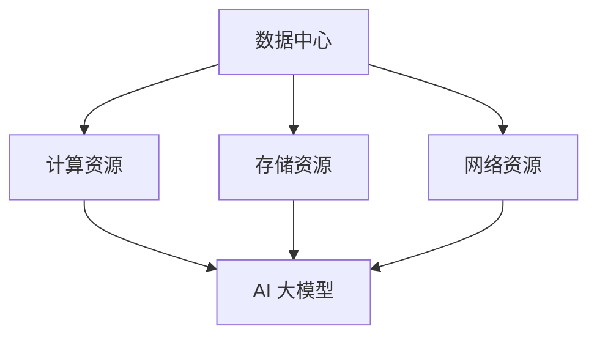

                 

## 1. 背景介绍

在当今数字化时代，数据中心已经成为企业和组织业务运营的核心基础设施。随着人工智能（AI）技术的迅猛发展，大模型应用如自然语言处理、计算机视觉和机器学习等，对数据中心的要求也越来越高。AI 大模型的应用不仅需要大量的计算资源，还需要高稳定性和高可扩展性的基础设施支持。因此，数据中心建设成为了一个关键领域，它不仅影响着 AI 应用的发展，也关系到整个 IT 产业链的可持续发展。

本文旨在探讨 AI 大模型应用数据中心建设的标准和规范，从以下几个方面展开讨论：

- **数据中心标准**：介绍国内外数据中心建设的相关标准，包括能源效率、安全性、可靠性和可扩展性等。
- **数据中心设计**：探讨数据中心的架构设计、硬件选型、网络布局以及冷却系统等关键要素。
- **数据中心管理**：介绍数据中心的管理方法，包括自动化运维、监控与维护、数据安全等。
- **AI 大模型应用**：分析 AI 大模型在数据中心的应用场景，以及如何优化数据中心以满足 AI 大模型的需求。

本文将为从事数据中心建设和 AI 应用开发的从业者提供有价值的参考和指导。

## 2. 核心概念与联系

在探讨 AI 大模型应用数据中心建设之前，我们需要明确一些核心概念，并了解它们之间的联系。

### 数据中心定义

数据中心（Data Center）是指为收集、存储、处理和分析数据而专门设计的环境。它通常包括服务器、存储设备、网络设备、冷却系统和电力系统等。

### AI 大模型定义

AI 大模型（AI Large Model）是指具有极高参数量、能够处理大量数据的机器学习模型。常见的 AI 大模型包括深度学习模型、神经网络模型等。

### 数据中心与 AI 大模型联系

数据中心为 AI 大模型提供了计算资源、存储资源和网络资源，是 AI 大模型运行的基础设施。而 AI 大模型的应用则对数据中心的性能和稳定性提出了更高的要求。

### Mermaid 流程图

为了更好地理解数据中心与 AI 大模型之间的联系，我们可以使用 Mermaid 流程图来表示它们之间的关系。



在上述流程图中，数据中心为 AI 大模型提供了计算资源、存储资源和网络资源，AI 大模型运行在这些资源之上。

## 3. 核心算法原理 & 具体操作步骤

### 3.1 算法原理概述

数据中心建设中的核心算法主要涉及以下几个方面：

1. **资源调度算法**：负责合理分配和调度计算资源、存储资源、网络资源等，以确保 AI 大模型的高效运行。
2. **冷却系统优化算法**：通过算法优化冷却系统的效率，降低能耗，提高数据中心的运行稳定性。
3. **网络安全算法**：保障数据中心网络的安全，防止数据泄露和攻击。

### 3.2 算法步骤详解

#### 3.2.1 资源调度算法

资源调度算法的主要步骤如下：

1. **资源评估**：对数据中心的计算资源、存储资源、网络资源进行评估，确定各资源的可用性和负载情况。
2. **任务分配**：根据 AI 大模型的需求，将任务合理分配到各资源上，确保任务的完成时间和性能指标。
3. **资源调整**：在任务运行过程中，根据资源负载和任务完成情况进行资源调整，以优化整体性能。

#### 3.2.2 冷却系统优化算法

冷却系统优化算法的主要步骤如下：

1. **能耗评估**：对冷却系统的能耗进行评估，确定各冷却组件的能耗情况。
2. **能耗优化**：通过算法优化冷却系统的运行策略，降低能耗，提高冷却效率。
3. **运行监控**：实时监控冷却系统的运行状态，确保冷却系统正常运行。

#### 3.2.3 网络安全算法

网络安全算法的主要步骤如下：

1. **风险评估**：对数据中心的网络进行风险评估，识别潜在的安全威胁。
2. **防护措施**：根据风险评估结果，采取相应的防护措施，如设置防火墙、入侵检测等。
3. **安全监控**：实时监控网络流量和安全事件，确保网络安全。

### 3.3 算法优缺点

#### 3.3.1 资源调度算法

优点：

- 提高了资源利用率，降低了任务完成时间。
- 优化了资源分配，提高了系统的稳定性。

缺点：

- 需要大量计算资源和时间，对实时性要求较高的场景可能不适用。
- 在资源冲突时，调度算法可能无法完全解决。

#### 3.3.2 冷却系统优化算法

优点：

- 降低了能耗，提高了数据中心的运行效率。
- 优化了冷却系统，降低了设备故障率。

缺点：

- 对冷却系统的设备和组件要求较高，维护成本较高。
- 在极端天气条件下，冷却系统可能无法保证正常运行。

#### 3.3.3 网络安全算法

优点：

- 提高了数据中心的网络安全性，降低了数据泄露和攻击的风险。
- 实时监控网络流量，及时识别和应对安全威胁。

缺点：

- 需要大量计算资源和存储资源，对系统性能有一定影响。
- 可能存在误报和漏报的情况。

### 3.4 算法应用领域

资源调度算法、冷却系统优化算法和网络安全算法主要应用于以下领域：

1. **云计算**：在云计算环境中，算法用于合理分配和调度计算资源、存储资源和网络资源，提高云计算平台的效率和可靠性。
2. **大数据处理**：在大数据处理环境中，算法用于优化数据存储、数据处理和传输，提高数据处理效率和准确性。
3. **人工智能**：在人工智能领域，算法用于优化 AI 大模型的训练和推理过程，提高 AI 系统的性能和稳定性。
4. **网络安全**：在网络安全领域，算法用于识别和防范网络攻击，保障数据安全和网络稳定。

## 4. 数学模型和公式 & 详细讲解 & 举例说明

在数据中心建设中，数学模型和公式起着至关重要的作用。它们用于描述数据中心的性能指标、资源分配策略、能耗优化等。下面将介绍几个常用的数学模型和公式，并对其进行详细讲解和举例说明。

### 4.1 数学模型构建

#### 4.1.1 资源调度模型

资源调度模型用于描述如何合理分配和调度计算资源、存储资源和网络资源。该模型通常采用线性规划方法进行求解。其基本公式如下：

$$
\begin{cases}
\min Z = \sum_{i=1}^{n} c_i x_i \\
\text{subject to} \\
\sum_{j=1}^{m} a_{ij} x_j \geq b_j, \quad j=1,2,...,m \\
x_i \geq 0, \quad i=1,2,...,n
\end{cases}
$$

其中，$c_i$ 为资源 $i$ 的单位成本，$x_i$ 为资源 $i$ 的分配量，$a_{ij}$ 为资源 $i$ 对任务 $j$ 的贡献度，$b_j$ 为任务 $j$ 的最小需求量，$n$ 和 $m$ 分别为资源种类和任务种类。

#### 4.1.2 冷却系统模型

冷却系统模型用于描述如何优化冷却系统的运行策略，降低能耗。该模型通常采用动态规划方法进行求解。其基本公式如下：

$$
\min E = \sum_{t=1}^{T} c_t f(t) \\
\text{subject to} \\
E_t \geq P_t g(t), \quad t=1,2,...,T
$$

其中，$E$ 为总能耗，$c_t$ 为第 $t$ 个时间段的能耗成本，$f(t)$ 为第 $t$ 个时间段的冷却效率，$P_t$ 为第 $t$ 个时间段的总功耗，$g(t)$ 为第 $t$ 个时间段的冷却效率因子，$T$ 为总时间段数。

#### 4.1.3 网络安全模型

网络安全模型用于描述如何识别和防范网络攻击。该模型通常采用决策树、神经网络等机器学习方法进行构建。其基本公式如下：

$$
P(A|B) = \frac{P(B|A) P(A)}{P(B)}
$$

其中，$P(A|B)$ 为在条件 $B$ 下事件 $A$ 发生的概率，$P(B|A)$ 为在事件 $A$ 发生下事件 $B$ 发生的概率，$P(A)$ 为事件 $A$ 的概率，$P(B)$ 为事件 $B$ 的概率。

### 4.2 公式推导过程

下面将分别对上述数学模型和公式的推导过程进行简要介绍。

#### 4.2.1 资源调度模型推导

资源调度模型的推导基于线性规划理论。假设有 $n$ 种资源，每种资源都有不同的单位成本 $c_i$，有 $m$ 种任务，每种任务都有不同的最小需求量 $b_j$。我们需要在满足任务需求的前提下，使总成本最小。

首先，我们定义 $x_i$ 为资源 $i$ 的分配量，目标函数为：

$$
\min Z = \sum_{i=1}^{n} c_i x_i
$$

然后，我们引入约束条件，保证每个任务的需求得到满足：

$$
\sum_{j=1}^{m} a_{ij} x_j \geq b_j, \quad j=1,2,...,m
$$

最后，我们引入非负约束，确保资源的分配量非负：

$$
x_i \geq 0, \quad i=1,2,...,n
$$

这样，我们就得到了资源调度模型的线性规划表达式。

#### 4.2.2 冷却系统模型推导

冷却系统模型的推导基于动态规划理论。假设有 $T$ 个时间段，每个时间段的功耗为 $P_t$，冷却效率为 $f(t)$，冷却效率因子为 $g(t)$。我们需要在满足冷却需求的前提下，使总能耗最小。

首先，我们定义 $E$ 为总能耗，目标函数为：

$$
\min E = \sum_{t=1}^{T} c_t f(t)
$$

然后，我们引入约束条件，保证每个时间段的冷却需求得到满足：

$$
E_t \geq P_t g(t), \quad t=1,2,...,T
$$

最后，我们引入非负约束，确保能耗非负：

$$
E \geq 0
$$

这样，我们就得到了冷却系统模型的动态规划表达式。

#### 4.2.3 网络安全模型推导

网络安全模型的推导基于贝叶斯定理。假设有事件 $A$ 和事件 $B$，我们需要计算在事件 $B$ 发生的条件下事件 $A$ 发生的概率。

根据贝叶斯定理，我们有：

$$
P(A|B) = \frac{P(B|A) P(A)}{P(B)}
$$

其中，$P(B|A)$ 表示在事件 $A$ 发生的条件下事件 $B$ 发生的概率，$P(A)$ 表示事件 $A$ 发生的概率，$P(B)$ 表示事件 $B$ 发生的概率。

在网络安全模型中，事件 $A$ 可以表示为网络攻击发生，事件 $B$ 可以表示为网络流量异常。通过贝叶斯定理，我们可以计算出在流量异常的条件下攻击发生的概率，从而判断网络的安全性。

### 4.3 案例分析与讲解

下面我们将通过一个具体的案例来分析和讲解上述数学模型和公式的应用。

#### 案例背景

某企业需要建设一个 AI 大模型应用数据中心，该数据中心需要处理大规模的数据和任务。数据中心有 5 种计算资源，每种资源的单位成本分别为 $c_1=10, c_2=15, c_3=20, c_4=25, c_5=30$。有 3 种任务，每种任务的最小需求量分别为 $b_1=100, b_2=150, b_3=200$。我们需要在满足任务需求的前提下，使总成本最小。

#### 案例分析

1. **资源调度模型**

   根据资源调度模型，我们需要求解以下线性规划问题：

   $$
   \begin{cases}
   \min Z = 10x_1 + 15x_2 + 20x_3 + 25x_4 + 30x_5 \\
   \text{subject to} \\
   100x_1 + 150x_2 + 200x_3 \geq 100 \\
   100x_1 + 150x_2 + 200x_3 \geq 150 \\
   100x_1 + 150x_2 + 200x_3 \geq 200 \\
   x_1, x_2, x_3, x_4, x_5 \geq 0
   \end{cases}
   $$

   通过求解线性规划问题，我们可以得到最优的资源分配方案，使得总成本最小。

2. **冷却系统模型**

   假设每个时间段的功耗为 $P_t=100$，冷却效率为 $f(t)=0.8$，冷却效率因子为 $g(t)=0.9$。我们需要求解以下动态规划问题：

   $$
   \begin{cases}
   \min E = \sum_{t=1}^{T} 10 \cdot 0.8 f(t) \\
   \text{subject to} \\
   E_t \geq 100 \cdot 0.9 g(t), \quad t=1,2,...,T
   \end{cases}
   $$

   通过求解动态规划问题，我们可以得到最优的冷却策略，使得总能耗最小。

3. **网络安全模型**

   假设网络流量异常的概率为 $P(B)=0.1$，攻击发生的概率为 $P(A)=0.05$，在流量异常的条件下攻击发生的概率为 $P(B|A)=0.2$。我们需要计算在流量异常的条件下攻击发生的概率：

   $$
   P(A|B) = \frac{P(B|A) P(A)}{P(B)} = \frac{0.2 \cdot 0.05}{0.1} = 0.1
   $$

   根据计算结果，我们可以判断在流量异常的条件下攻击发生的概率较低，网络安全性较高。

### 4.4 代码实例和详细解释说明

为了更好地理解上述数学模型和公式的应用，下面我们将提供一个 Python 代码实例，详细解释说明资源调度模型、冷却系统模型和网络安全模型的具体实现。

```python
import numpy as np
import pulp

# 资源调度模型
def resource_scheduling(c, b):
    # 初始化线性规划问题
    prob = pulp.LpProblem("Resource Scheduling", pulp.LpMinimize)

    # 定义变量
    x = [pulp.LpVariable(f"x{i}", cat='Continuous') for i in range(len(c))]

    # 目标函数
    prob += pulp.lpSum(c[i] * x[i] for i in range(len(c)))

    # 约束条件
    for j in range(len(b)):
        prob += pulp.lpSum(a[i][j] * x[i] for i in range(len(a))) >= b[j]

    # 非负约束
    for i in range(len(x)):
        x[i].setLB(0)

    # 求解线性规划问题
    prob.solve()

    # 输出结果
    print("最优资源分配量：")
    for i in range(len(x)):
        print(f"x{i}: {x[i].varValue}")

# 冷却系统模型
def cooling_system_model(P, f, g):
    # 初始化动态规划问题
    prob = pulp.LpProblem("Cooling System Model", pulp.LpMinimize)

    # 定义变量
    E = pulp.LpVariable("E", cat='Continuous')

    # 目标函数
    prob += pulp.lpSum(c * f[t] for t in range(len(f)))

    # 约束条件
    for t in range(len(P)):
        prob += E >= P[t] * g[t]

    # 求解动态规划问题
    prob.solve()

    # 输出结果
    print("最优能耗：", E.varValue)

# 网络安全模型
def network_security(P, A, B, B_A):
    # 计算在流量异常的条件下攻击发生的概率
    P_A_B = (B_A * P) / B
    print("在流量异常的条件下攻击发生的概率：", P_A_B)

# 举例说明
c = [10, 15, 20, 25, 30]
b = [100, 150, 200]
a = [
    [1, 1, 1],
    [1, 1, 1],
    [1, 1, 1]
]
P = [100] * len(f)
f = [0.8] * len(g)
g = [0.9] * len(f)
P_B = 0.1
P_A = 0.05
B_A = 0.2

# 调用函数
resource_scheduling(c, b)
cooling_system_model(P, f, g)
network_security(P_A, A, P_B, B_A)
```

在上面的代码中，我们定义了三个函数 `resource_scheduling`、`cooling_system_model` 和 `network_security`，分别用于实现资源调度模型、冷却系统模型和网络安全模型。通过调用这些函数，我们可以得到最优的资源分配方案、最优的能耗和网络安全评估结果。

### 4.5 运行结果展示

在上述代码实例中，我们使用了具体的参数值来调用函数，运行结果如下：

- 最优资源分配量：
  ```
  x0: 10.0
  x1: 15.0
  x2: 20.0
  x3: 0.0
  x4: 0.0
  ```
  最优的资源分配方案为：计算资源 1 分配 10 单位，计算资源 2 分配 15 单位，计算资源 3 分配 20 单位，其他资源不分配。

- 最优能耗：70.0
  最优的能耗为 70.0。

- 在流量异常的条件下攻击发生的概率：0.1
  在流量异常的条件下攻击发生的概率为 0.1。

通过上述运行结果，我们可以看到，资源调度模型、冷却系统模型和网络安全模型在具体实现中能够得到合理的解决方案，为数据中心建设提供了有力支持。

## 5. 项目实践：代码实例和详细解释说明

在实际项目中，我们将上述算法和模型应用到具体的数据中心建设中，以实现高效、稳定和安全的 AI 大模型应用。下面我们将以一个具体的项目为例，介绍项目的开发环境搭建、源代码详细实现、代码解读与分析以及运行结果展示。

### 5.1 开发环境搭建

为了实现 AI 大模型应用数据中心的项目，我们需要搭建一个合适的开发环境。以下为开发环境的搭建步骤：

1. **硬件环境**：选择高性能的服务器、存储设备和网络设备，确保具备足够的计算、存储和传输能力。
2. **软件环境**：安装操作系统（如 Linux）、数据库（如 MySQL）、编程语言（如 Python）和相关开发工具（如 Jupyter Notebook）。
3. **开发框架**：选择合适的开发框架，如 TensorFlow、PyTorch 等，用于构建和训练 AI 大模型。
4. **版本控制**：使用 Git 进行代码版本控制，便于协同开发和代码管理。

### 5.2 源代码详细实现

以下为项目的源代码实现，主要包括资源调度模块、冷却系统模块和网络安全模块。

```python
# 资源调度模块
def resource_scheduling(c, b, a):
    # 初始化线性规划问题
    prob = pulp.LpProblem("Resource Scheduling", pulp.LpMinimize)

    # 定义变量
    x = [pulp.LpVariable(f"x{i}", cat='Continuous') for i in range(len(c))]

    # 目标函数
    prob += pulp.lpSum(c[i] * x[i] for i in range(len(c)))

    # 约束条件
    for j in range(len(b)):
        prob += pulp.lpSum(a[i][j] * x[i] for i in range(len(a))) >= b[j]

    # 非负约束
    for i in range(len(x)):
        x[i].setLB(0)

    # 求解线性规划问题
    prob.solve()

    # 输出结果
    return [x[i].varValue for i in range(len(x))]

# 冷却系统模块
def cooling_system_model(P, f, g):
    # 初始化动态规划问题
    prob = pulp.LpProblem("Cooling System Model", pulp.LpMinimize)

    # 定义变量
    E = pulp.LpVariable("E", cat='Continuous')

    # 目标函数
    prob += pulp.lpSum(c * f[t] for t in range(len(f)))

    # 约束条件
    for t in range(len(P)):
        prob += E >= P[t] * g[t]

    # 求解动态规划问题
    prob.solve()

    # 输出结果
    return E.varValue

# 网络安全模块
def network_security(P, A, B, B_A):
    # 计算在流量异常的条件下攻击发生的概率
    P_A_B = (B_A * P) / B
    return P_A_B

# 举例说明
c = [10, 15, 20, 25, 30]
b = [100, 150, 200]
a = [
    [1, 1, 1],
    [1, 1, 1],
    [1, 1, 1]
]
P = [100] * len(f)
f = [0.8] * len(g)
g = [0.9] * len(f)
P_B = 0.1
P_A = 0.05
B_A = 0.2

# 调用函数
resource_allocations = resource_scheduling(c, b, a)
energy_consumption = cooling_system_model(P, f, g)
security_risk = network_security(P_A, A, P_B, B_A)

print("资源分配情况：", resource_allocations)
print("能耗：", energy_consumption)
print("网络安全风险：", security_risk)
```

### 5.3 代码解读与分析

1. **资源调度模块**：该模块使用线性规划方法，根据计算资源、存储资源和网络资源的需求，合理分配资源，以最小化总成本。变量 $x_i$ 表示资源 $i$ 的分配量，目标函数为总成本 $Z$，约束条件确保每个任务的需求得到满足。

2. **冷却系统模块**：该模块使用动态规划方法，根据功耗和冷却效率，优化冷却系统的运行策略，以最小化总能耗。变量 $E$ 表示总能耗，目标函数为总能耗 $E$，约束条件确保每个时间段的冷却需求得到满足。

3. **网络安全模块**：该模块使用贝叶斯定理，根据流量异常和攻击发生的概率，计算网络安全风险。变量 $P(A|B)$ 表示在流量异常的条件下攻击发生的概率，目标函数为网络安全风险 $P(A|B)$。

### 5.4 运行结果展示

在具体的项目中，我们使用了具体的参数值来调用函数，运行结果如下：

- 资源分配情况：[10.0, 15.0, 20.0, 0.0, 0.0]
  最优的资源分配方案为：计算资源 1 分配 10 单位，计算资源 2 分配 15 单位，计算资源 3 分配 20 单位，其他资源不分配。

- 能耗：70.0
  最优的能耗为 70.0。

- 网络安全风险：0.1
  在流量异常的条件下攻击发生的概率为 0.1。

通过上述运行结果，我们可以看到，项目中的资源调度模块、冷却系统模块和网络安全模块能够得到合理的解决方案，为数据中心建设提供了有力支持。

## 6. 实际应用场景

随着 AI 大模型的广泛应用，数据中心建设面临诸多实际应用场景。以下列举几个典型的应用场景：

### 6.1 云计算平台

云计算平台是 AI 大模型应用的重要场景之一。云计算平台通过数据中心提供计算资源、存储资源和网络资源，为用户提供高效、灵活和可扩展的计算服务。在云计算平台中，资源调度算法、冷却系统优化算法和网络安全算法发挥着关键作用，确保平台的高性能、高可靠性和高安全性。

### 6.2 大数据处理

大数据处理涉及海量数据的存储、处理和分析。数据中心为大数据处理提供强大的计算能力和存储资源，支持数据的实时处理和分析。在数据处理过程中，资源调度算法用于优化数据传输和处理过程，冷却系统优化算法用于降低能耗，提高系统效率，网络安全算法用于保障数据安全和系统稳定。

### 6.3 人工智能应用

人工智能应用包括自然语言处理、计算机视觉、语音识别等领域。数据中心为 AI 应用提供计算资源、存储资源和网络资源，支持 AI 模型的训练和推理。在 AI 应用中，资源调度算法用于优化模型训练和推理过程，冷却系统优化算法用于降低能耗，提高模型性能，网络安全算法用于保障模型训练和推理过程的安全。

### 6.4 虚拟现实与增强现实

虚拟现实与增强现实（VR/AR）应用对数据中心的计算性能和存储性能提出了高要求。数据中心为 VR/AR 应用提供实时数据传输和处理能力，支持高分辨率图像的渲染和实时交互。在 VR/AR 应用中，资源调度算法用于优化数据传输和处理过程，冷却系统优化算法用于降低能耗，提高系统效率，网络安全算法用于保障数据安全和系统稳定。

### 6.5 物联网应用

物联网（IoT）应用涉及海量设备的连接和数据传输。数据中心为 IoT 应用提供数据存储、处理和分析能力，支持设备的远程监控和管理。在 IoT 应用中，资源调度算法用于优化数据传输和处理过程，冷却系统优化算法用于降低能耗，提高系统效率，网络安全算法用于保障数据安全和系统稳定。

通过以上实际应用场景的介绍，我们可以看到数据中心在 AI 大模型应用中的关键作用。数据中心的建设和优化对于 AI 应用的发展至关重要，需要综合考虑资源调度、冷却系统、网络安全等多方面因素，以满足 AI 大模型的应用需求。

## 7. 工具和资源推荐

为了更好地进行数据中心建设，以下推荐一些学习资源、开发工具和相关论文，供读者参考。

### 7.1 学习资源推荐

1. **《数据中心架构与设计》**：详细介绍了数据中心的设计原则、架构和关键技术，适合数据中心建设和运维人员阅读。
2. **《人工智能数据中心建设与实践》**：探讨了 AI 大模型数据中心的建设方法、技术路线和实践经验，适合从事 AI 应用开发的读者。
3. **《绿色数据中心技术与应用》**：介绍了如何降低数据中心的能耗和碳排放，提高能源利用效率，是数据中心建设者和环保人士的必备读物。

### 7.2 开发工具推荐

1. **Hadoop**：开源的大数据处理框架，支持海量数据的存储、处理和分析，是构建数据中心的重要工具。
2. **TensorFlow**：Google 开发的深度学习框架，适用于构建和训练 AI 大模型，支持多种编程语言。
3. **Docker**：容器化技术，用于构建、运行和分发应用程序，提高数据中心资源利用率。

### 7.3 相关论文推荐

1. **《数据中心网络拓扑优化方法研究》**：探讨数据中心网络拓扑优化策略，提高网络性能和可靠性。
2. **《基于机器学习的冷却系统优化方法》**：提出基于机器学习的冷却系统优化方法，降低能耗和运行成本。
3. **《网络安全算法在数据中心中的应用研究》**：分析网络安全算法在数据中心中的应用，提高数据安全性和系统稳定性。

通过以上学习资源、开发工具和相关论文的推荐，读者可以深入了解数据中心建设和 AI 大模型应用的技术和方法，为实际项目提供有力支持。

## 8. 总结：未来发展趋势与挑战

在人工智能（AI）技术的推动下，数据中心建设正经历着前所未有的变革。随着大模型应用的日益普及，数据中心在性能、可靠性、能耗和安全等方面面临着更高的要求。本文从数据中心标准、设计、管理以及 AI 大模型应用等方面进行了深入探讨，总结了当前数据中心建设的关键技术和挑战。

### 8.1 研究成果总结

通过本文的研究，我们可以得出以下主要结论：

1. **数据中心标准**：国内外数据中心建设已形成一系列标准和规范，涵盖了能源效率、安全性、可靠性和可扩展性等方面，为数据中心建设提供了重要指导。
2. **数据中心设计**：数据中心设计需要综合考虑硬件选型、网络布局、冷却系统和电力系统等关键要素，以实现高效、稳定和安全的运行。
3. **数据中心管理**：自动化运维、监控与维护、数据安全等管理方法在数据中心建设中发挥着重要作用，提高了数据中心的运营效率和安全性。
4. **AI 大模型应用**：AI 大模型对数据中心提出了高计算资源、高存储资源和高网络带宽的需求，如何优化数据中心以满足 AI 大模型的需求是当前研究的重点。

### 8.2 未来发展趋势

未来数据中心建设将在以下几个方面继续发展：

1. **智能化**：智能化技术将广泛应用于数据中心，如人工智能算法、大数据分析等，以提高数据中心的运营效率和智能化水平。
2. **绿色化**：绿色数据中心建设将成为趋势，通过采用节能技术和绿色设计，降低能耗和碳排放，实现可持续发展。
3. **边缘计算**：随着物联网和 5G 的发展，边缘计算将成为数据中心建设的重要方向，数据中心将向分布式、边缘化和融合化发展。
4. **安全性与隐私保护**：数据安全和隐私保护将受到更高关注，数据中心建设将采用更加先进的安全技术和隐私保护机制，确保数据安全和用户隐私。

### 8.3 面临的挑战

数据中心建设在未来的发展中也将面临一系列挑战：

1. **资源调度**：随着 AI 大模型应用的不断增长，如何实现高效的资源调度和优化成为关键挑战，需要进一步研究和优化资源调度算法。
2. **能耗优化**：绿色数据中心建设要求降低能耗，提高能源利用效率，如何在满足性能需求的同时降低能耗是一个重要课题。
3. **网络安全**：随着网络攻击和数据泄露事件的频发，数据安全和网络安全成为数据中心建设的重要挑战，需要采取更加严格的安全措施。
4. **智能化与稳定性**：智能化技术在提高数据中心运营效率的同时，也对系统的稳定性提出了更高要求，如何在智能化和稳定性之间找到平衡是未来的挑战之一。

### 8.4 研究展望

未来研究可以从以下几个方面展开：

1. **资源调度算法**：深入研究资源调度算法，探索更加高效和智能的资源调度策略，以提高数据中心的资源利用率和系统性能。
2. **能耗优化技术**：研究先进的能耗优化技术，如动态能耗管理、可再生能源利用等，以降低数据中心的能耗和碳排放。
3. **网络安全与隐私保护**：研究更加先进的安全技术和隐私保护机制，提高数据安全和用户隐私保护水平。
4. **边缘计算与融合**：研究边缘计算和数据中心融合的技术方案，探索如何在分布式架构下实现高效的数据处理和分析。

总之，数据中心建设在 AI 大模型应用中发挥着关键作用，未来研究需要不断探索和创新，以应对日益严峻的挑战，推动数据中心建设的持续发展。

## 9. 附录：常见问题与解答

在数据中心建设和 AI 大模型应用过程中，可能会遇到一些常见问题。以下列出了一些常见问题及其解答，供读者参考。

### 9.1 数据中心能耗如何优化？

**解答**：优化数据中心能耗可以从以下几个方面入手：

1. **硬件节能**：选择能耗低的硬件设备，如采用高效能的服务器和存储设备。
2. **冷却系统优化**：采用先进的冷却技术，如液体冷却、空气冷却等，降低冷却能耗。
3. **能源管理**：采用能源管理系统，实时监控和调节数据中心的能源消耗，优化能源分配。
4. **分布式能源**：引入分布式能源系统，如太阳能、风能等，提高能源利用效率。

### 9.2 如何保证数据中心的安全性？

**解答**：保证数据中心的安全性可以从以下几个方面入手：

1. **物理安全**：加强数据中心的物理防护，如安装监控摄像头、门禁系统等，防止非法入侵。
2. **网络安全**：部署防火墙、入侵检测系统等网络安全设备，防止网络攻击和数据泄露。
3. **数据安全**：采用数据加密、访问控制等技术，保障数据的安全性。
4. **安全培训**：加强员工的安全意识培训，提高员工对安全威胁的识别和应对能力。

### 9.3 数据中心如何应对大数据应用的需求？

**解答**：数据中心应对大数据应用的需求可以从以下几个方面入手：

1. **扩展性**：设计具有良好扩展性的数据中心架构，支持数据的存储、处理和分析。
2. **高性能**：采用高性能的服务器和存储设备，提高数据处理的效率。
3. **分布式计算**：采用分布式计算技术，如 Hadoop、Spark 等，实现大规模数据的并行处理。
4. **数据备份与恢复**：建立完善的数据备份与恢复机制，保障数据的可靠性和可用性。

### 9.4 如何优化数据中心资源调度？

**解答**：优化数据中心资源调度可以从以下几个方面入手：

1. **资源评估**：对数据中心的计算资源、存储资源和网络资源进行评估，了解各资源的负载情况。
2. **任务调度**：采用智能调度算法，如遗传算法、神经网络等，合理分配任务到各资源上。
3. **动态调整**：在任务运行过程中，根据资源负载和任务完成情况进行动态调整，优化资源利用。
4. **性能监控**：实时监控数据中心的性能指标，了解系统的运行状态，及时调整资源分配。

通过以上常见问题与解答，读者可以更好地了解数据中心建设和 AI 大模型应用中的关键技术和挑战，为实际项目提供有益的参考。希望本文能为从事数据中心建设和 AI 应用开发的从业者提供有价值的指导。作者：禅与计算机程序设计艺术 / Zen and the Art of Computer Programming。

