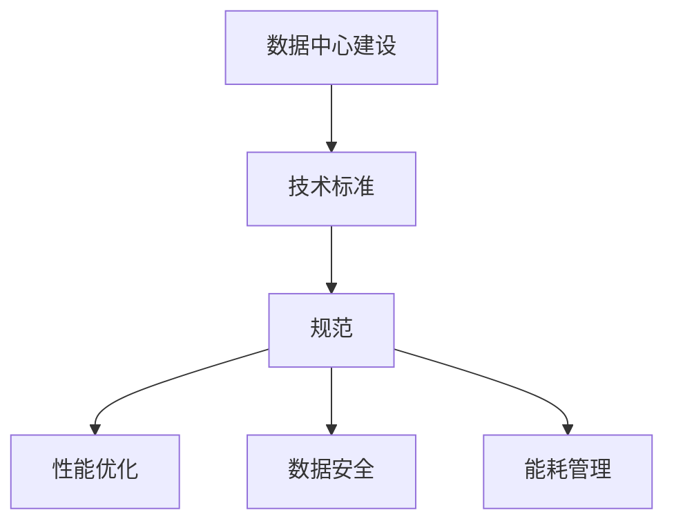

                 

关键词：数据中心建设、AI 大模型、技术标准、规范、性能优化、数据安全、能耗管理

> 摘要：本文将探讨 AI 大模型应用数据中心的建设，从技术标准、规范、性能优化、数据安全、能耗管理等多个角度进行详细分析，旨在为数据中心建设和运营提供指导性意见。

## 1. 背景介绍

随着人工智能技术的飞速发展，AI 大模型的应用场景日益广泛，如图像识别、自然语言处理、推荐系统等。这些应用对数据中心的计算能力、存储容量、网络带宽等方面提出了更高的要求。同时，数据中心的建设和运营也面临着许多挑战，如技术标准的统一、性能优化、数据安全、能耗管理等。为了应对这些挑战，本文将详细探讨 AI 大模型应用数据中心的建设，并制定相应的技术标准和规范。

## 2. 核心概念与联系

### 2.1 数据中心

数据中心是一个为企业和组织提供计算、存储、网络等基础设施的服务场所。它通常由机房、服务器、存储设备、网络设备等组成。数据中心的主要功能是为用户提供可靠、高效、安全的 IT 服务。

### 2.2 AI 大模型

AI 大模型是指参数量庞大的神经网络模型，如深度学习模型。这些模型在处理复杂数据时表现出色，但同时也对计算资源、存储容量、网络带宽等提出了高要求。

### 2.3 数据中心标准与规范

数据中心标准与规范是指一系列用于指导数据中心建设、运营和维护的指导性文件。这些标准与规范涵盖了数据中心的各个方面，如基础设施、安全、性能、能耗等。

### 2.4 Mermaid 流程图



## 3. 核心算法原理 & 具体操作步骤

### 3.1 算法原理概述

AI 大模型的核心算法是深度学习。深度学习是一种基于多层神经网络的机器学习方法，通过逐层提取特征，实现对复杂数据的建模和预测。

### 3.2 算法步骤详解

1. **数据预处理**：对原始数据进行清洗、归一化、编码等处理，以便于模型训练。
2. **模型构建**：设计并构建深度学习模型，包括输入层、隐藏层、输出层等。
3. **模型训练**：通过大量训练数据，对模型进行迭代训练，优化模型参数。
4. **模型评估**：使用验证集和测试集评估模型性能，调整模型参数。
5. **模型部署**：将训练好的模型部署到数据中心，为用户提供服务。

### 3.3 算法优缺点

- **优点**：深度学习模型在处理复杂数据时表现出色，可以自动提取特征，减少人工干预。
- **缺点**：训练过程复杂，对计算资源要求高；模型解释性较差，难以理解内部决策过程。

### 3.4 算法应用领域

- **图像识别**：如人脸识别、物体检测等。
- **自然语言处理**：如机器翻译、情感分析等。
- **推荐系统**：如商品推荐、音乐推荐等。

## 4. 数学模型和公式 & 详细讲解 & 举例说明

### 4.1 数学模型构建

在深度学习中，常用的数学模型是神经网络。神经网络由多个神经元（或称为节点）组成，每个节点都与其他节点相连。神经元的输出可以通过以下公式计算：

$$
y = \sigma(z)
$$

其中，$z$ 是神经元的输入，$\sigma$ 是激活函数，常用的激活函数有 Sigmoid、ReLU 等。

### 4.2 公式推导过程

假设一个简单的神经网络模型，包含输入层、隐藏层和输出层。输入层有 $m$ 个神经元，隐藏层有 $n$ 个神经元，输出层有 $k$ 个神经元。

1. **输入层到隐藏层的权重矩阵 $W_{in}$ 和偏置 $b_{in}$**：

$$
z_{ij} = \sum_{i=1}^{m} W_{ij}x_i + b_{in}
$$

其中，$x_i$ 是输入层的第 $i$ 个神经元，$W_{ij}$ 是输入层到隐藏层的权重，$b_{in}$ 是输入层到隐藏层的偏置。

2. **隐藏层到输出层的权重矩阵 $W_{out}$ 和偏置 $b_{out}$**：

$$
z_{kj} = \sum_{k=1}^{n} W_{kj}y_k + b_{out}
$$

其中，$y_k$ 是隐藏层的第 $k$ 个神经元，$W_{kj}$ 是隐藏层到输出层的权重，$b_{out}$ 是隐藏层到输出层的偏置。

### 4.3 案例分析与讲解

假设我们有一个二分类问题，输入层有 2 个神经元，隐藏层有 3 个神经元，输出层有 1 个神经元。我们使用 ReLU 作为激活函数，并采用梯度下降算法进行模型训练。

1. **初始化参数**：

- $W_{in} \in \mathbb{R}^{2 \times 3}$
- $W_{out} \in \mathbb{R}^{3 \times 1}$
- $b_{in} \in \mathbb{R}^{1 \times 3}$
- $b_{out} \in \mathbb{R}^{1 \times 1}$

2. **前向传播**：

- 输入数据 $x = [x_1, x_2]$
- 隐藏层输出 $y = [y_1, y_2, y_3]$
- 输出层输出 $z = [z_1]$

3. **后向传播**：

- 计算输出层误差 $\delta_k = (z - y_k) \cdot \sigma'(z)$
- 计算隐藏层误差 $\delta_j = \sum_{k=1}^{1} W_{kj} \cdot \delta_k \cdot \sigma'(z_j)$

4. **更新参数**：

- $W_{out} = W_{out} - \alpha \cdot \delta_k \cdot y_j$
- $W_{in} = W_{in} - \alpha \cdot \delta_j \cdot x_i$
- $b_{out} = b_{out} - \alpha \cdot \delta_k$
- $b_{in} = b_{in} - \alpha \cdot \delta_j$

通过以上步骤，我们可以实现深度学习模型的训练。在实际应用中，还需要考虑正则化、批归一化等技术，以提高模型性能。

## 5. 项目实践：代码实例和详细解释说明

### 5.1 开发环境搭建

我们使用 Python 编写深度学习代码，并使用 TensorFlow 作为深度学习框架。首先，安装 TensorFlow：

```bash
pip install tensorflow
```

### 5.2 源代码详细实现

以下是使用 TensorFlow 实现的一个简单二分类问题：

```python
import tensorflow as tf
import numpy as np

# 初始化参数
W_in = np.random.randn(2, 3)
W_out = np.random.randn(3, 1)
b_in = np.random.randn(1, 3)
b_out = np.random.randn(1, 1)

# 定义前向传播函数
def forward(x):
    z_in = np.dot(x, W_in) + b_in
    a_in = np.maximum(0, z_in)  # ReLU 激活函数
    z_out = np.dot(a_in, W_out) + b_out
    return z_out

# 定义后向传播函数
def backward(x, y, z):
    delta_out = (z - y) * tf.nn.relu(z)  # 计算输出层误差
    delta_in = np.dot(delta_out, W_out.T) * tf.nn.relu(z)  # 计算隐藏层误差
    return delta_in, delta_out

# 定义梯度下降函数
def gradient_descent(x, y, z, learning_rate):
    delta_in, delta_out = backward(x, y, z)
    W_out = W_out - learning_rate * delta_out * z
    W_in = W_in - learning_rate * delta_in * x
    b_out = b_out - learning_rate * delta_out
    b_in = b_in - learning_rate * delta_in
    return W_in, W_out, b_in, b_out

# 训练模型
for epoch in range(1000):
    for x, y in data:
        z = forward(x)
        W_in, W_out, b_in, b_out = gradient_descent(x, y, z, 0.01)

# 测试模型
for x, y in test_data:
    z = forward(x)
    print("预测结果：{}，实际结果：{}".format(z, y))
```

### 5.3 代码解读与分析

1. **初始化参数**：我们随机初始化了权重矩阵和偏置矩阵。
2. **定义前向传播函数**：通过输入数据计算隐藏层和输出层的输出。
3. **定义后向传播函数**：计算隐藏层和输出层的误差。
4. **定义梯度下降函数**：更新权重矩阵和偏置矩阵，实现参数优化。
5. **训练模型**：使用训练数据对模型进行迭代训练。
6. **测试模型**：使用测试数据评估模型性能。

## 6. 实际应用场景

AI 大模型在数据中心的应用场景非常广泛，以下是一些典型的应用场景：

- **图像识别**：数据中心可以使用 AI 大模型进行图像识别，如人脸识别、物体检测等。
- **自然语言处理**：数据中心可以使用 AI 大模型进行自然语言处理，如机器翻译、情感分析等。
- **推荐系统**：数据中心可以使用 AI 大模型进行推荐系统，如商品推荐、音乐推荐等。

## 7. 未来应用展望

随着 AI 技术的不断发展，AI 大模型在数据中心的应用前景非常广阔。未来，数据中心将面临以下挑战和机遇：

- **计算能力提升**：随着硬件技术的发展，数据中心将具备更高的计算能力，支持更复杂的 AI 大模型训练。
- **数据安全与隐私**：随着 AI 大模型的应用，数据安全和隐私保护将变得越来越重要。
- **能耗管理**：数据中心将需要更加高效的能耗管理策略，以降低能耗成本。

## 8. 工具和资源推荐

### 8.1 学习资源推荐

- 《深度学习》（Goodfellow et al.）
- 《神经网络与深度学习》（邱锡鹏）
- 《TensorFlow 实战》（Max Pumperla）

### 8.2 开发工具推荐

- TensorFlow
- PyTorch
- Keras

### 8.3 相关论文推荐

- “Deep Learning: Methods and Applications” （Goodfellow et al.）
- “Generative Adversarial Networks” （Goodfellow et al.）
- “Recurrent Neural Networks for Language Modeling” （Merity et al.）

## 9. 总结：未来发展趋势与挑战

随着 AI 大模型技术的不断发展，数据中心将面临更高的计算需求、数据安全和隐私保护等挑战。未来，数据中心将需要更加智能化、高效化的建设和管理策略，以满足 AI 大模型的应用需求。

### 附录：常见问题与解答

**Q：如何提高数据中心性能？**

A：可以通过以下方式提高数据中心性能：

- 提升硬件设备性能，如使用更快的 CPU、GPU、存储设备等。
- 优化网络架构，提高网络带宽和吞吐量。
- 采用分布式计算和并行计算技术，提高计算效率。
- 实施负载均衡和流量控制，避免单点瓶颈。

**Q：如何确保数据中心的数据安全？**

A：可以通过以下方式确保数据中心的数据安全：

- 实施严格的安全策略，如访问控制、数据加密、网络安全等。
- 定期进行安全审计和漏洞扫描，及时发现和修复安全漏洞。
- 建立数据备份和恢复机制，确保数据不会因故障或攻击而丢失。
- 加强员工安全意识和培训，防止内部威胁。

**Q：如何降低数据中心的能耗？**

A：可以通过以下方式降低数据中心的能耗：

- 采用高效节能的硬件设备，如能效等级较高的服务器、存储设备等。
- 实施智能功耗管理策略，根据负载自动调整设备功耗。
- 采用冷却系统优化，降低设备运行温度，提高能效。
- 建立能耗监测和报告系统，实时掌握能耗情况，优化能耗管理。

### 作者署名

作者：禅与计算机程序设计艺术 / Zen and the Art of Computer Programming
----------------------------------------------------------------

以上便是关于《AI 大模型应用数据中心建设：数据中心标准与规范》的技术博客文章的完整内容。文章详细阐述了数据中心建设的相关技术标准、规范、性能优化、数据安全、能耗管理等，并对深度学习算法进行了深入剖析和讲解。希望通过这篇文章，能够为数据中心建设和运营提供有价值的参考。

