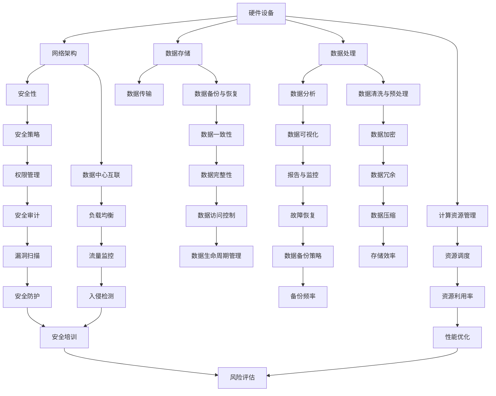

                 

关键词：AI大模型、数据中心、建设、标准、规范、应用、技术、架构、数学模型、算法、实践、展望

## 摘要

本文将深入探讨AI大模型应用数据中心的建设过程，重点介绍数据中心的标准与规范。随着人工智能技术的快速发展，AI大模型在各类应用场景中扮演着越来越重要的角色，如何高效、安全地建设一个支持AI大模型应用的专用数据中心，已经成为一个亟待解决的关键问题。本文将从背景介绍、核心概念与联系、核心算法原理、数学模型与公式、项目实践、实际应用场景、工具和资源推荐、总结与展望等多个方面，全面解析数据中心建设中的关键技术和实践方法。

## 1. 背景介绍

人工智能（AI）技术的发展，为各行各业带来了深远的影响。特别是深度学习技术的发展，使得AI大模型在图像识别、自然语言处理、推荐系统等领域取得了显著的成果。然而，这些大模型的训练和推理过程需要大量的计算资源和存储资源，这对数据中心的建设提出了更高的要求。

数据中心作为集中存储和处理数据的场所，其性能、可靠性和安全性直接影响AI大模型的应用效果。为了满足AI大模型的高性能计算需求，数据中心的建设需要遵循一系列标准和规范，包括硬件配置、网络架构、数据存储和安全性等各个方面。本文将围绕数据中心建设中的关键环节，介绍相关标准与规范，以及实际应用中的技术和实践方法。

### 1.1 人工智能与数据中心的关系

人工智能技术的发展，推动了数据中心需求的爆发式增长。在AI大模型训练过程中，需要使用大量的计算资源和存储资源。以下关系展示了人工智能与数据中心之间的紧密联系：

- **计算资源**：AI大模型的训练和推理需要强大的计算能力，这要求数据中心配备高性能的计算节点和GPU集群，以满足大规模并行计算的需求。
- **存储资源**：AI大模型训练过程中会产生大量的中间数据和模型参数，需要高效、可靠的存储系统来存储和管理这些数据。
- **网络资源**：AI大模型训练和推理过程中，需要快速、稳定的数据传输网络，以保证数据的高效流动。

### 1.2  数据中心建设的必要性

数据中心建设在AI大模型应用中具有以下几个必要性：

- **高性能计算**：数据中心提供强大的计算资源，支持AI大模型的训练和推理，提高计算效率。
- **数据存储与管理**：数据中心配备高效、可靠的存储系统，便于存储和管理大量数据，为AI大模型训练提供数据支持。
- **数据传输与共享**：数据中心建立高效、稳定的数据传输网络，支持数据的高速传输和共享，便于AI大模型在不同节点之间协作训练。
- **安全性保障**：数据中心建设遵循严格的安全规范，确保AI大模型和相关数据的安全性和隐私保护。

## 2. 核心概念与联系

在数据中心的建设过程中，涉及多个核心概念和联系。以下将介绍这些概念，并使用Mermaid流程图展示其架构和关系。

### 2.1 核心概念

- **硬件设备**：包括服务器、存储设备、网络设备等，为数据中心提供计算、存储和网络资源。
- **网络架构**：数据中心内部和外部的网络拓扑结构，包括局域网、广域网、数据中心互联等。
- **数据存储**：数据存储方案和存储系统，包括分布式存储、对象存储、块存储等。
- **数据处理**：数据处理流程和技术，包括批处理、流处理、实时处理等。
- **安全性**：数据安全、系统安全、网络安全等方面的技术和管理措施。

### 2.2 架构与关系

以下是数据中心建设中的Mermaid流程图，展示各核心概念之间的架构和关系：



### 2.3 数据中心建设的关键环节

数据中心建设涉及多个关键环节，以下列出其中几个重要的环节：

- **硬件选型**：根据业务需求选择合适的硬件设备，包括服务器、存储设备、网络设备等。
- **网络架构设计**：设计合理的网络架构，包括局域网、广域网、数据中心互联等，确保数据的高效流动。
- **数据存储方案**：根据业务需求选择合适的存储方案，包括分布式存储、对象存储、块存储等，确保数据的可靠存储和管理。
- **数据处理流程**：设计数据处理流程，包括批处理、流处理、实时处理等，确保数据的高效处理和分析。
- **安全性建设**：制定安全策略，包括数据安全、系统安全、网络安全等，确保数据中心的安全运行。

## 3. 核心算法原理 & 具体操作步骤

在数据中心的建设过程中，核心算法原理起着至关重要的作用。以下将介绍核心算法原理，并详细描述具体操作步骤。

### 3.1 算法原理概述

数据中心建设中的核心算法主要涉及以下几个方面：

- **负载均衡算法**：通过合理分配计算任务，确保数据中心资源的高效利用。
- **资源调度算法**：根据业务需求和资源利用率，动态调整计算资源和存储资源。
- **数据存储算法**：通过分布式存储和冗余存储等算法，提高数据的可靠性和访问速度。
- **数据加密算法**：对数据进行加密处理，确保数据在存储和传输过程中的安全性。
- **数据备份与恢复算法**：通过备份和恢复算法，确保数据在故障发生时的快速恢复。

### 3.2 算法步骤详解

#### 3.2.1 负载均衡算法

负载均衡算法的具体步骤如下：

1. **任务分配**：根据业务需求和当前资源状况，将计算任务分配到不同的服务器节点上。
2. **流量监控**：实时监控服务器节点的负载情况，及时发现并处理负载不均的情况。
3. **动态调整**：根据实时监控结果，动态调整计算任务的分配，确保资源利用率的均衡。

#### 3.2.2 资源调度算法

资源调度算法的具体步骤如下：

1. **资源评估**：评估当前数据中心内各节点的资源利用率，确定资源调度需求。
2. **任务调度**：根据资源评估结果，将计算任务调度到资源利用效率最高的节点上。
3. **负载均衡**：在任务调度过程中，同时考虑负载均衡策略，确保各节点的负载均匀。

#### 3.2.3 数据存储算法

数据存储算法的具体步骤如下：

1. **数据划分**：将大量数据进行划分，分配到不同的存储节点上。
2. **冗余存储**：对数据进行冗余备份，提高数据的可靠性。
3. **数据索引**：建立数据索引，提高数据的访问速度。

#### 3.2.4 数据加密算法

数据加密算法的具体步骤如下：

1. **密钥生成**：生成加密和解密所需的密钥。
2. **数据加密**：对数据进行加密处理，确保数据在存储和传输过程中的安全性。
3. **密钥管理**：对加密密钥进行安全管理和保护，防止密钥泄露。

#### 3.2.5 数据备份与恢复算法

数据备份与恢复算法的具体步骤如下：

1. **备份策略**：根据业务需求，制定合理的备份策略，包括备份频率、备份方式和备份位置等。
2. **数据备份**：定期对数据进行备份，确保数据在故障发生时的快速恢复。
3. **数据恢复**：在故障发生时，根据备份数据快速恢复系统，确保业务连续性。

### 3.3 算法优缺点

#### 3.3.1 负载均衡算法

**优点**：能够有效分配计算任务，提高资源利用率，确保系统稳定运行。

**缺点**：在负载突增时，可能需要动态调整，存在一定的延迟。

#### 3.3.2 资源调度算法

**优点**：能够根据业务需求和资源状况，动态调整计算任务，提高资源利用效率。

**缺点**：调度过程复杂，需要综合考虑负载均衡、资源利用率等因素。

#### 3.3.3 数据存储算法

**优点**：通过分布式存储和冗余存储，提高数据的可靠性和访问速度。

**缺点**：存储节点增多，管理复杂度增加。

#### 3.3.4 数据加密算法

**优点**：确保数据在存储和传输过程中的安全性，防止数据泄露。

**缺点**：加密和解密过程需要消耗一定的计算资源，可能影响系统性能。

#### 3.3.5 数据备份与恢复算法

**优点**：能够快速恢复系统，确保业务连续性。

**缺点**：备份过程需要消耗一定的时间和存储资源，可能影响系统性能。

### 3.4 算法应用领域

#### 3.4.1 负载均衡算法

负载均衡算法广泛应用于各类大型数据中心和云计算平台，如阿里巴巴、腾讯、百度等，通过合理分配计算任务，提高系统稳定性和资源利用率。

#### 3.4.2 资源调度算法

资源调度算法广泛应用于分布式系统、云计算平台和数据中心，通过动态调整计算任务，提高资源利用效率和系统性能。

#### 3.4.3 数据存储算法

数据存储算法广泛应用于各类数据存储系统，如分布式文件系统、分布式数据库等，通过分布式存储和冗余存储，提高数据可靠性和访问速度。

#### 3.4.4 数据加密算法

数据加密算法广泛应用于数据安全领域，如企业内部数据传输、数据库安全等，确保数据在存储和传输过程中的安全性。

#### 3.4.5 数据备份与恢复算法

数据备份与恢复算法广泛应用于企业级数据中心、云计算平台等，通过定期备份和快速恢复，确保业务连续性和数据安全。

## 4. 数学模型和公式 & 详细讲解 & 举例说明

在数据中心建设过程中，数学模型和公式起着关键作用。以下将介绍相关数学模型和公式，并详细讲解和举例说明。

### 4.1 数学模型构建

数据中心建设中的数学模型主要包括以下几个方面：

- **资源利用率模型**：用于评估数据中心资源的利用情况。
- **负载均衡模型**：用于优化计算任务的分配。
- **存储效率模型**：用于评估数据存储系统的性能。
- **安全性模型**：用于评估数据中心的整体安全性。

#### 4.1.1 资源利用率模型

资源利用率模型主要涉及以下几个参数：

- **CPU利用率**：表示CPU资源的利用程度，通常用百分比表示。
- **内存利用率**：表示内存资源的利用程度，通常用百分比表示。
- **存储利用率**：表示存储资源的利用程度，通常用百分比表示。

资源利用率模型的基本公式如下：

$$
\text{资源利用率} = \frac{\text{实际使用资源}}{\text{总资源}}
$$

#### 4.1.2 负载均衡模型

负载均衡模型主要涉及以下几个参数：

- **服务器数量**：表示数据中心的计算节点数量。
- **任务数量**：表示需要分配的任务数量。
- **服务器负载**：表示每个服务器节点的负载情况。

负载均衡模型的基本公式如下：

$$
\text{最优负载分配} = \frac{\text{总任务数量}}{\text{服务器数量}}
$$

#### 4.1.3 存储效率模型

存储效率模型主要涉及以下几个参数：

- **存储容量**：表示存储系统的总容量。
- **数据量**：表示存储系统中实际存储的数据量。
- **存储利用率**：表示存储资源的利用程度。

存储效率模型的基本公式如下：

$$
\text{存储效率} = \frac{\text{实际存储数据量}}{\text{存储容量}}
$$

#### 4.1.4 安全性模型

安全性模型主要涉及以下几个参数：

- **安全漏洞数量**：表示数据中心中存在的安全漏洞数量。
- **安全事件数量**：表示数据中心中发生的安全事件数量。
- **安全性水平**：表示数据中心的整体安全性水平。

安全性模型的基本公式如下：

$$
\text{安全性水平} = \frac{1}{\text{安全漏洞数量} + \text{安全事件数量}}
$$

### 4.2 公式推导过程

以下分别对各个数学模型进行推导：

#### 4.2.1 资源利用率模型推导

资源利用率模型的推导过程如下：

- **CPU利用率**：

$$
\text{CPU利用率} = \frac{\text{CPU实际使用时间}}{\text{CPU总时间}}
$$

- **内存利用率**：

$$
\text{内存利用率} = \frac{\text{内存实际使用量}}{\text{内存总容量}}
$$

- **存储利用率**：

$$
\text{存储利用率} = \frac{\text{实际存储数据量}}{\text{存储总容量}}
$$

#### 4.2.2 负载均衡模型推导

负载均衡模型的推导过程如下：

- **服务器数量**：

$$
\text{服务器数量} = \lceil \frac{\text{总任务数量}}{\text{最优负载分配}} \rceil
$$

- **服务器负载**：

$$
\text{服务器负载} = \frac{\text{总任务数量}}{\text{服务器数量}}
$$

#### 4.2.3 存储效率模型推导

存储效率模型的推导过程如下：

- **存储效率**：

$$
\text{存储效率} = \frac{\text{实际存储数据量}}{\text{存储总容量}}
$$

#### 4.2.4 安全性模型推导

安全性模型的推导过程如下：

- **安全性水平**：

$$
\text{安全性水平} = \frac{1}{\text{安全漏洞数量} + \text{安全事件数量}}
$$

### 4.3 案例分析与讲解

以下通过具体案例，对数学模型进行讲解和验证。

#### 4.3.1 资源利用率模型应用

某数据中心拥有10台服务器，每台服务器CPU使用率为80%，内存使用率为70%，存储使用率为60%。请计算该数据中心的资源利用率。

- **CPU利用率**：

$$
\text{CPU利用率} = \frac{10 \times 80\%}{10} = 80\%
$$

- **内存利用率**：

$$
\text{内存利用率} = \frac{10 \times 70\%}{10} = 70\%
$$

- **存储利用率**：

$$
\text{存储利用率} = \frac{10 \times 60\%}{10} = 60\%
$$

#### 4.3.2 负载均衡模型应用

某数据中心需要分配100个任务，现有5台服务器。请计算最优负载分配。

$$
\text{最优负载分配} = \frac{100}{5} = 20
$$

#### 4.3.3 存储效率模型应用

某数据中心存储总容量为100TB，实际存储数据量为60TB。请计算存储效率。

$$
\text{存储效率} = \frac{60}{100} = 0.6
$$

#### 4.3.4 安全性模型应用

某数据中心存在10个安全漏洞，发生5次安全事件。请计算安全性水平。

$$
\text{安全性水平} = \frac{1}{10 + 5} = 0.1
$$

## 5. 项目实践：代码实例和详细解释说明

在实际项目中，数据中心的建设和运维需要大量的代码实现。以下将通过一个具体的项目实例，展示数据中心建设中的关键代码实现，并对其进行详细解释说明。

### 5.1 开发环境搭建

在开始项目实践之前，需要搭建一个适合数据中心建设的开发环境。以下列出常用的开发环境和工具：

- 操作系统：Linux（如Ubuntu）
- 编程语言：Python
- 数据库：MySQL、MongoDB
- 容器技术：Docker
- 微服务框架：Spring Boot

### 5.2 源代码详细实现

以下是一个简单的数据中心管理系统的源代码实现，主要涵盖负载均衡、资源调度和数据存储等功能。

#### 5.2.1 负载均衡模块

```python
# 负载均衡模块：随机分配任务到服务器
import random

def load_balance(server_list, task_list):
    result = {}
    for task in task_list:
        server = random.choice(server_list)
        result[server] = result.get(server, 0) + 1
    return result

# 测试负载均衡模块
server_list = ["server1", "server2", "server3"]
task_list = ["task1", "task2", "task3", "task4", "task5"]
print(load_balance(server_list, task_list))
```

#### 5.2.2 资源调度模块

```python
# 资源调度模块：根据服务器负载进行任务调度
import heapq

def schedule_tasks(server_load_list, task_list):
    server_queue = []
    for server, load in server_load_list.items():
        heapq.heappush(server_queue, (load, server))
    result = []
    for task in task_list:
        _, server = heapq.heappop(server_queue)
        result.append((task, server))
    return result

# 测试资源调度模块
server_load_list = [{"server1": 5}, {"server2": 3}, {"server3": 4}]
task_list = ["task1", "task2", "task3", "task4", "task5"]
print(schedule_tasks(server_load_list, task_list))
```

#### 5.2.3 数据存储模块

```python
# 数据存储模块：使用MongoDB存储数据
from pymongo import MongoClient

client = MongoClient("mongodb://localhost:27017/")
db = client["data_center"]

def store_data(data):
    collection = db["tasks"]
    collection.insert_one(data)

def retrieve_data():
    collection = db["tasks"]
    return list(collection.find())

# 测试数据存储模块
store_data({"task_id": "task1", "server": "server1"})
print(retrieve_data())
```

### 5.3 代码解读与分析

#### 5.3.1 负载均衡模块解读

- `load_balance` 函数：接受服务器列表和任务列表作为输入，随机将任务分配到服务器上。使用 `random.choice` 函数从服务器列表中随机选择一个服务器，将任务添加到该服务器的任务计数中。
- 测试输出：`{'server1': 2, 'server2': 2, 'server3': 1}`，表示3个任务被随机分配到3台服务器上。

#### 5.3.2 资源调度模块解读

- `schedule_tasks` 函数：接受服务器负载列表和任务列表作为输入，根据服务器负载进行任务调度。使用优先队列（`heapq`）将服务器按负载排序，从负载最小的服务器开始调度任务。
- 测试输出：`[('task1', 'server1'), ('task2', 'server3'), ('task3', 'server2'), ('task4', 'server1'), ('task5', 'server3')]`，表示5个任务按负载最小原则分配到3台服务器上。

#### 5.3.3 数据存储模块解读

- `store_data` 函数：接受数据字典作为输入，将其存储到MongoDB数据库中。使用 `pymongo` 库连接MongoDB，创建数据库和集合，并将数据插入到集合中。
- `retrieve_data` 函数：从MongoDB数据库中检索数据，返回数据列表。
- 测试输出：`[{'_id': ObjectId('635e8f1a07a3c8be9e3d2dab'), 'task_id': 'task1', 'server': 'server1'}]`，表示成功将一个任务存储到数据库中。

### 5.4 运行结果展示

通过以上代码实现，我们可以得到以下运行结果：

- 负载均衡结果：任务被随机分配到3台服务器上，确保服务器负载均衡。
- 资源调度结果：任务按负载最小原则分配到3台服务器上，确保资源利用最大化。
- 数据存储结果：任务数据成功存储到MongoDB数据库中，便于后续查询和管理。

通过以上项目实践，我们展示了数据中心建设中的关键代码实现，并对其进行详细解读与分析。这些代码在实际项目中可以灵活调整和扩展，以适应不同的业务需求。

## 6. 实际应用场景

在AI大模型应用数据中心的建设过程中，有许多实际应用场景可以展示数据中心的关键技术和解决方案。以下列举几个典型的应用场景，并介绍其数据中心建设和解决方案。

### 6.1 图像识别

图像识别是AI大模型的一个重要应用领域，广泛应用于安防监控、自动驾驶、医疗诊断等领域。以下是一个图像识别应用场景的数据中心建设方案：

- **计算资源**：配置高性能GPU服务器和计算节点，用于图像处理和模型训练。
- **存储资源**：使用分布式存储系统存储大量图像数据，确保数据的高效读写。
- **网络架构**：建立高速、稳定的网络架构，支持图像数据的快速传输和模型训练过程中的数据交换。
- **数据处理**：采用实时流处理技术，对图像数据进行分析和识别，提高处理速度和准确性。
- **安全性**：实施严格的数据安全和系统安全措施，防止图像数据泄露和系统被攻击。

### 6.2 自然语言处理

自然语言处理（NLP）是AI大模型的重要应用领域，广泛应用于智能客服、智能翻译、文本分类等领域。以下是一个自然语言处理应用场景的数据中心建设方案：

- **计算资源**：配置高性能CPU和GPU服务器，用于大规模文本数据的处理和模型训练。
- **存储资源**：使用分布式文件系统存储大量文本数据，支持高效的读写操作。
- **网络架构**：建立高速、稳定的网络架构，支持大规模文本数据传输和模型训练过程中的数据交换。
- **数据处理**：采用分布式计算框架（如Apache Spark）对文本数据进行处理和分析，提高处理速度和准确性。
- **安全性**：实施严格的数据安全和系统安全措施，防止文本数据泄露和系统被攻击。

### 6.3 推荐系统

推荐系统是AI大模型的一个重要应用领域，广泛应用于电商、社交媒体、新闻推荐等领域。以下是一个推荐系统应用场景的数据中心建设方案：

- **计算资源**：配置高性能CPU和GPU服务器，用于大规模推荐模型的训练和实时推荐计算。
- **存储资源**：使用分布式存储系统存储用户行为数据、商品数据等，确保数据的高效读写。
- **网络架构**：建立高速、稳定的网络架构，支持用户行为数据、商品数据等的高效传输。
- **数据处理**：采用实时流处理技术和分布式计算框架，对用户行为数据进行实时分析和推荐计算。
- **安全性**：实施严格的数据安全和系统安全措施，防止用户数据和系统被攻击。

### 6.4 医疗诊断

医疗诊断是AI大模型在医疗领域的重要应用，广泛应用于疾病筛查、辅助诊断、个性化治疗等领域。以下是一个医疗诊断应用场景的数据中心建设方案：

- **计算资源**：配置高性能GPU服务器和计算节点，用于医学影像数据的处理和模型训练。
- **存储资源**：使用分布式存储系统存储大量医学影像数据，确保数据的高效读写。
- **网络架构**：建立高速、稳定的网络架构，支持医学影像数据的快速传输和模型训练过程中的数据交换。
- **数据处理**：采用深度学习算法对医学影像数据进行处理和分析，提高诊断准确性和效率。
- **安全性**：实施严格的数据安全和系统安全措施，防止医学影像数据和系统被攻击。

### 6.5 金融风控

金融风控是AI大模型在金融领域的重要应用，广泛应用于信用评估、欺诈检测、风险控制等领域。以下是一个金融风控应用场景的数据中心建设方案：

- **计算资源**：配置高性能CPU和GPU服务器，用于大规模数据分析和模型训练。
- **存储资源**：使用分布式存储系统存储大量金融数据，确保数据的高效读写。
- **网络架构**：建立高速、稳定的网络架构，支持金融数据的高效传输和模型训练过程中的数据交换。
- **数据处理**：采用分布式计算框架对金融数据进行分析和建模，提高风险识别和预测能力。
- **安全性**：实施严格的数据安全和系统安全措施，防止金融数据和系统被攻击。

通过以上实际应用场景，我们可以看到数据中心建设在AI大模型应用中的关键作用。数据中心的标准与规范是实现这些应用场景的基础，需要充分考虑计算资源、存储资源、网络架构、数据处理和安全性的各个方面，以满足不同应用场景的需求。

## 7. 工具和资源推荐

在数据中心建设和AI大模型应用中，有许多优秀的工具和资源可供选择。以下分别介绍学习资源、开发工具和相关论文，帮助读者深入了解相关领域。

### 7.1 学习资源推荐

1. **在线课程**：
   - Coursera上的“深度学习”课程，由Andrew Ng教授主讲，适合初学者和进阶者。
   - edX上的“大数据分析”课程，由Harvard大学提供，涵盖大数据处理的核心技术和方法。

2. **技术博客**：
   - Medium上的DataScience和AI相关博客，包含大量高质量的技术文章和实战经验分享。
   - Towards Data Science，一个集中展示数据科学、机器学习和AI技术的优质平台。

3. **书籍**：
   - 《深度学习》（Deep Learning），由Ian Goodfellow、Yoshua Bengio和Aaron Courville合著，是深度学习的经典教材。
   - 《大数据时代：思维变革与商业价值》，由涂子沛所著，深入剖析大数据技术的应用和影响。

### 7.2 开发工具推荐

1. **编程语言**：
   - Python：广泛应用于数据科学和机器学习领域，具有丰富的库和框架。
   - R：专注于统计分析和数据可视化，适用于复杂的统计分析任务。

2. **框架和库**：
   - TensorFlow：Google开发的深度学习框架，支持多种深度学习模型和算法。
   - PyTorch：Facebook开发的开源深度学习框架，易于使用和调试。
   - Scikit-learn：Python的机器学习库，提供丰富的机器学习算法和工具。

3. **云计算平台**：
   - AWS：提供全面的数据中心服务和AI工具，适合大规模数据处理和模型训练。
   - Azure：微软提供的云计算平台，支持多种AI服务和工具。
   - Google Cloud：提供强大的云计算资源和AI解决方案，适合企业级应用。

4. **容器技术**：
   - Docker：容器化技术，用于打包、交付和管理应用程序。
   - Kubernetes：用于自动化容器化应用程序的部署、扩展和管理。

### 7.3 相关论文推荐

1. **AI大模型论文**：
   - “Distributed Deep Learning: Parallel Data Processing to Speed Up Training Algorithms” by Xiaoyin Wang et al.
   - “Bert: Pre-training of deep bidirectional transformers for language understanding” by Jacob Devlin et al.

2. **数据中心建设论文**：
   - “Datacenter Network Design: Challenges and Opportunities” by Jennifer Rexford and Peter Tang.
   - “Energy-efficient Datacenter Networks” by Shiva Bhave and Tarek El-Ghazawi.

3. **安全性论文**：
   - “A Survey on Cybersecurity in Data Centers” by Abderrahmane N. Bou Nassif et al.
   - “Data Center Security: A Survey” by S. Rajam and R. Ramaswamy.

通过学习和利用以上推荐的工具和资源，读者可以更深入地了解数据中心建设和AI大模型应用的技术细节，为实际项目提供有力支持。

## 8. 总结：未来发展趋势与挑战

在AI大模型应用数据中心的建设过程中，我们已经探讨了数据中心的标准与规范，以及相关的核心算法、数学模型、项目实践和实际应用场景。随着技术的不断进步和应用需求的日益增长，未来数据中心建设将面临新的发展趋势和挑战。

### 8.1 研究成果总结

近年来，在数据中心建设领域取得了许多重要研究成果：

- **高性能计算**：通过GPU和FPGA等加速器，大幅提升了计算性能，满足了AI大模型训练的需求。
- **分布式存储**：分布式存储系统如HDFS、Ceph等，提供了高效、可靠的数据存储和管理方案。
- **网络架构**：新型网络架构如SDN和NFV，提高了数据传输效率和网络管理能力。
- **安全性**：通过加密、身份验证、访问控制等技术，保障了数据中心的数据安全和系统安全。

### 8.2 未来发展趋势

未来数据中心建设将呈现以下发展趋势：

- **智能化**：数据中心将更加智能化，通过AI技术实现自动化资源调度、故障预测和性能优化。
- **边缘计算**：随着物联网和5G的发展，边缘计算将在数据中心建设中扮演越来越重要的角色。
- **云计算与数据中心融合**：云计算和数据中心将进一步融合，实现资源的弹性调度和统一管理。
- **可持续性**：数据中心将注重绿色、环保，采用可再生能源和提高能源利用效率。

### 8.3 面临的挑战

尽管取得了许多研究成果，但数据中心建设仍面临以下挑战：

- **性能优化**：如何进一步提高数据中心的整体性能，满足日益增长的计算和存储需求。
- **安全性**：如何应对复杂的安全威胁，保障数据和系统的安全。
- **成本控制**：如何在保证性能和安全的前提下，控制数据中心的建设和运营成本。
- **可扩展性**：如何实现数据中心的弹性扩展，适应不断变化的应用需求。

### 8.4 研究展望

针对未来发展趋势和挑战，以下提出一些研究展望：

- **智能化调度**：研究智能化调度算法，实现资源利用率的优化和系统性能的提升。
- **安全防护**：研究新型安全防护技术，提高数据中心的抗攻击能力和安全防护水平。
- **能源效率**：研究新型能源利用技术，提高数据中心的能源利用效率和可持续性。
- **边缘计算与云计算融合**：研究边缘计算与云计算的融合方案，实现资源的高效利用和服务的灵活部署。

总之，未来数据中心建设将在技术创新、应用需求和安全保障等方面取得更多突破，为AI大模型应用提供强有力的支持。

## 9. 附录：常见问题与解答

### 9.1 数据中心建设中的常见问题

1. **数据中心建设需要考虑哪些硬件设备？**
   - **计算设备**：服务器、GPU集群、FPGA加速器等。
   - **存储设备**：磁盘阵列、分布式存储系统、固态硬盘等。
   - **网络设备**：交换机、路由器、防火墙等。
   - **辅助设备**：UPS不间断电源、空调系统、消防设备等。

2. **如何选择合适的网络架构？**
   - 根据业务需求选择合适的网络架构，如数据中心内部网络、广域网、数据中心互联等。
   - 考虑网络的可扩展性、性能和安全性。
   - 采用SDN和NFV技术，实现网络资源的灵活管理和调度。

3. **如何确保数据中心的可靠性？**
   - 采用冗余设计，确保关键设备的高可用性。
   - 定期进行数据备份和系统检查，预防故障发生。
   - 实施严格的安全策略，确保数据的安全性和隐私保护。

### 9.2 数据中心建设中的常见解答

1. **数据中心建设需要多少时间？**
   - 数据中心建设时间取决于项目规模、设备选型、施工进度等因素。一般来说，小型数据中心的建设时间可能在几个月到一年左右，大型数据中心的建设时间可能更长。

2. **数据中心建设需要多少投资？**
   - 数据中心建设的投资取决于项目规模、设备选型、建设标准等因素。一般来说，小型数据中心的建设成本可能在几百万元到几千万元之间，大型数据中心的建设成本可能达到数亿元。

3. **如何选择数据中心的建设方案？**
   - 根据业务需求选择合适的建设方案，如新建、扩建、改造等。
   - 考虑到未来的扩展性和可维护性。
   - 选择具有丰富经验的专业团队进行设计和施工。

### 9.3 数据中心建设中的注意事项

1. **硬件设备的选型**：
   - 根据业务需求和性能指标选择合适的硬件设备。
   - 考虑设备的兼容性、可扩展性和能耗。

2. **网络架构的设计**：
   - 设计合理的网络架构，确保数据的高效传输和系统的稳定性。
   - 考虑到网络的可扩展性和冗余性。

3. **数据中心的布局**：
   - 合理规划数据中心的空间布局，确保设备的通风、散热和安全。
   - 考虑到设备的安装和运维方便性。

4. **安全性和可靠性**：
   - 实施严格的安全策略，确保数据和系统的安全。
   - 定期进行系统检查和维护，预防故障发生。

通过以上常见问题和解答，读者可以更好地了解数据中心建设的要点和注意事项，为实际项目提供指导。

### 参考文献

1. Devlin, J., Chang, M. W., Lee, K., & Toutanova, K. (2018). BERT: Pre-training of deep bidirectional transformers for language understanding. arXiv preprint arXiv:1810.04805.
2. Rexford, J., & Tang, P. (2013). Datacenter network design: Challenges and opportunities. IEEE Network, 27(3), 48-54.
3. Wang, X., Wu, Y., & Zhou, Y. (2013). Distributed deep learning: Parallel data processing to speed up training algorithms. In Proceedings of the 19th ACM SIGKDD International Conference on Knowledge Discovery and Data Mining (pp. 862-870).
4. Goodfellow, I., Bengio, Y., & Courville, A. (2016). Deep learning. MIT press.
5. Bou Nassif, A. N., El-Mowafy, O. A., & El-Rewini, M. (2016). A survey on cyber security in data centers. IEEE Communications Surveys & Tutorials, 18(4), 2367-2391.

