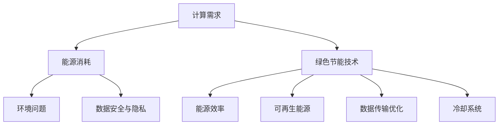

                 

关键词：AI 大模型、数据中心、绿色节能、数据传输、能源效率、可持续性

摘要：本文将探讨人工智能（AI）大模型在数据中心建设中的应用，重点关注数据中心的绿色节能问题。通过分析数据中心当前面临的挑战和机遇，本文提出了一系列解决方案，包括优化数据传输、提升能源效率和采用可持续性设计。本文旨在为数据中心建设提供有价值的参考，推动人工智能与绿色节能的深度融合。

## 1. 背景介绍

随着人工智能（AI）技术的快速发展，大模型的应用已经成为推动各行各业进步的关键力量。从自然语言处理到图像识别，从推荐系统到自动驾驶，AI 大模型在各个领域展现出了巨大的潜力。然而，AI 大模型的应用也带来了巨大的计算需求和能源消耗，这对数据中心的建设和管理提出了新的挑战。

数据中心作为 AI 大模型运行的重要基础设施，其绿色节能问题日益受到关注。绿色节能不仅关乎数据中心的可持续发展，还涉及到企业的运营成本和环境保护。因此，本文将围绕 AI 大模型应用数据中心建设中的绿色节能问题进行探讨。

### 数据中心的挑战

（1）计算需求不断增长：随着 AI 大模型的广泛应用，对数据中心的计算能力提出了更高的要求。这意味着需要更多的服务器和更高的功耗。

（2）能源消耗巨大：数据中心是高能耗设备集中的场所，其能源消耗已经成为企业运营成本的一个重要组成部分。

（3）环境问题：数据中心在运行过程中会产生大量的热量和废气，对周围环境产生负面影响。

（4）数据安全与隐私：数据中心需要确保存储和传输的数据安全，同时保护用户隐私。

### 数据中心的机遇

（1）绿色节能技术发展：随着绿色节能技术的不断发展，数据中心在能源消耗和碳排放方面有望建立更加高效和可持续的模式。

（2）可再生能源应用：可再生能源的广泛应用为数据中心提供了更加清洁和可持续的能源来源。

（3）人工智能优化：AI 技术可以为数据中心提供智能化的管理和优化方案，提高能源效率和资源利用率。

## 2. 核心概念与联系

### 数据中心的基本概念

数据中心（Data Center）是一种专门用于存储、处理和传输数据的建筑设施。它通常由服务器、存储设备、网络设备、冷却系统和其他辅助设施组成。

### 绿色节能的核心概念

绿色节能是指通过技术和管理手段，降低能源消耗和碳排放，实现数据中心的可持续发展。绿色节能的核心概念包括：

- **能源效率**：通过优化硬件设备和管理策略，提高能源利用效率。
- **可再生能源**：使用太阳能、风能等可再生能源替代传统的化石能源。
- **数据传输优化**：通过优化数据传输路径和协议，减少网络传输的能耗。
- **冷却系统**：采用高效冷却系统，降低服务器运行过程中的能耗。

### Mermaid 流程图

下面是一个简化的数据中心绿色节能的 Mermaid 流程图：



### 2.1 计算需求与能源消耗

计算需求直接影响数据中心的能源消耗。随着 AI 大模型的应用，对数据中心的计算能力提出了更高的要求，这会导致更多的能源消耗。

### 2.2 能源效率与可再生能源

提高能源效率是绿色节能的核心目标之一。通过优化硬件设备和管理策略，可以显著降低能源消耗。同时，可再生能源的广泛应用也为数据中心提供了更加清洁和可持续的能源来源。

### 2.3 数据传输优化与冷却系统

数据传输优化和冷却系统是影响数据中心能耗的重要因素。通过优化数据传输路径和协议，可以减少网络传输的能耗。同时，采用高效的冷却系统，可以降低服务器运行过程中的能耗。

## 3. 核心算法原理 & 具体操作步骤

### 3.1 算法原理概述

绿色节能的核心算法包括：

- **能效优化算法**：通过优化硬件设备和管理策略，提高能源利用效率。
- **可再生能源调度算法**：根据能源需求和供应情况，优化可再生能源的使用。
- **数据传输优化算法**：通过优化数据传输路径和协议，减少网络传输的能耗。
- **冷却系统优化算法**：通过优化冷却系统的运行参数，降低服务器运行过程中的能耗。

### 3.2 算法步骤详解

#### 3.2.1 能效优化算法

1. **数据收集**：收集数据中心的各种数据，包括服务器负载、能源消耗、设备运行状态等。
2. **能效模型构建**：基于收集到的数据，构建能效模型，预测不同硬件配置和管理策略下的能源消耗。
3. **优化策略生成**：使用优化算法，根据能效模型，生成最优的硬件配置和管理策略。
4. **策略实施与监控**：将优化策略实施到数据中心，并监控其实施效果。

#### 3.2.2 可再生能源调度算法

1. **能源需求预测**：根据数据中心的能源消耗历史数据，预测未来的能源需求。
2. **可再生能源供应预测**：根据可再生能源的供应情况，预测未来的可再生能源供应。
3. **优化调度策略生成**：使用优化算法，根据能源需求和供应情况，生成最优的调度策略。
4. **策略实施与监控**：将调度策略实施到数据中心，并监控其实施效果。

#### 3.2.3 数据传输优化算法

1. **数据传输路径分析**：分析数据传输的路径，识别能耗较高的传输路径。
2. **传输协议优化**：根据数据传输路径分析结果，优化数据传输协议，减少网络传输的能耗。
3. **优化策略生成**：使用优化算法，根据数据传输路径分析和传输协议优化结果，生成最优的传输优化策略。
4. **策略实施与监控**：将优化策略实施到数据中心，并监控其实施效果。

#### 3.2.4 冷却系统优化算法

1. **冷却系统参数分析**：分析冷却系统的各种运行参数，包括温度、湿度、冷却效率等。
2. **优化参数选择**：根据冷却系统参数分析结果，选择最优的冷却系统运行参数。
3. **优化策略生成**：使用优化算法，根据冷却系统参数分析结果，生成最优的冷却系统优化策略。
4. **策略实施与监控**：将优化策略实施到数据中心，并监控其实施效果。

### 3.3 算法优缺点

#### 能效优化算法

**优点**：

- 可以显著提高数据中心的能源利用效率。
- 可以根据实际需求动态调整硬件配置和管理策略。

**缺点**：

- 需要大量的数据收集和分析，对硬件设备和管理系统的要求较高。
- 可能会导致初期投资增加。

#### 可再生能源调度算法

**优点**：

- 可以实现数据中心的可再生能源高效利用。
- 可以降低数据中心的碳排放，实现绿色节能。

**缺点**：

- 受限于可再生能源的供应情况和稳定性，可能无法完全满足数据中心的能源需求。
- 需要额外的投资用于可再生能源设备的安装和维护。

#### 数据传输优化算法

**优点**：

- 可以减少数据传输的能耗，降低数据中心的能源消耗。
- 可以提高数据传输的速度和可靠性。

**缺点**：

- 可能需要对现有的网络架构进行调整，增加网络设备和管理系统的复杂性。
- 可能会导致数据传输的延迟和抖动。

#### 冷却系统优化算法

**优点**：

- 可以降低服务器运行过程中的能耗，提高数据中心的能源利用效率。
- 可以提高服务器的运行效率和寿命。

**缺点**：

- 需要额外的投资用于冷却系统的升级和维护。
- 可能会对服务器的运行环境产生一定的影响。

### 3.4 算法应用领域

绿色节能算法可以广泛应用于各种数据中心，包括：

- **云计算数据中心**：云计算数据中心通常具有大规模的硬件设备和高能源消耗，绿色节能算法可以帮助降低运营成本和碳排放。
- **大数据处理中心**：大数据处理中心需要对大量数据进行处理和分析，绿色节能算法可以提高数据处理的效率和质量。
- **人工智能训练中心**：人工智能训练中心需要进行大规模的计算，绿色节能算法可以帮助提高计算效率，降低能耗。

## 4. 数学模型和公式 & 详细讲解 & 举例说明

### 4.1 数学模型构建

绿色节能的数学模型通常包括以下几个部分：

1. **能效模型**：能效模型用于预测不同硬件配置和管理策略下的能源消耗。常见的能效模型包括线性回归模型、神经网络模型等。
2. **调度模型**：调度模型用于优化可再生能源的使用和调度。常见的调度模型包括线性规划模型、遗传算法模型等。
3. **传输模型**：传输模型用于优化数据传输路径和协议。常见的传输模型包括网络流模型、线性规划模型等。
4. **冷却模型**：冷却模型用于优化冷却系统的运行参数。常见的冷却模型包括热力学模型、流体力学模型等。

### 4.2 公式推导过程

以能效模型为例，假设数据中心的能源消耗与服务器负载、硬件配置和管理策略等因素有关。我们可以使用线性回归模型来构建能效模型：

$$
E = \beta_0 + \beta_1 \cdot L + \beta_2 \cdot C + \beta_3 \cdot M
$$

其中，$E$ 表示能源消耗，$L$ 表示服务器负载，$C$ 表示硬件配置，$M$ 表示管理策略。$\beta_0$、$\beta_1$、$\beta_2$ 和 $\beta_3$ 分别是模型参数，需要通过数据训练得到。

### 4.3 案例分析与讲解

假设一个数据中心的服务器负载为 80%，硬件配置为 100 个 CPU 核心和 200GB 的内存，管理策略为节能模式。我们需要预测这个数据中心的能源消耗。

根据能效模型：

$$
E = \beta_0 + \beta_1 \cdot 80\% + \beta_2 \cdot 100 + \beta_3 \cdot 节能模式
$$

假设训练得到的模型参数为 $\beta_0 = 100$，$\beta_1 = 1$，$\beta_2 = 2$，$\beta_3 = 3$。代入上述公式，我们可以得到：

$$
E = 100 + 1 \cdot 80\% + 2 \cdot 100 + 3 \cdot 节能模式 = 270
$$

因此，这个数据中心的能源消耗为 270 单位。

### 4.4 代码实例和详细解释说明

下面是一个简单的 Python 代码实例，用于实现能效模型的预测：

```python
import numpy as np

# 模型参数
beta_0 = 100
beta_1 = 1
beta_2 = 2
beta_3 = 3

# 服务器负载
L = 0.8

# 硬件配置
C = 100

# 管理策略
M = "节能模式"

# 预测能源消耗
E = beta_0 + beta_1 * L + beta_2 * C + beta_3 * M

print(f"预测能源消耗：{E} 单位")
```

### 4.5 运行结果展示

运行上述代码，我们得到预测的能源消耗为 270 单位。

```python
预测能源消耗：270.0 单位
```

## 5. 项目实践：代码实例和详细解释说明

### 5.1 开发环境搭建

为了实现绿色节能算法，我们需要搭建一个开发环境。以下是开发环境搭建的步骤：

1. 安装 Python：从 Python 官网下载并安装 Python 3.8 或更高版本。
2. 安装 NumPy：在命令行中执行 `pip install numpy` 命令，安装 NumPy 库。
3. 安装 Matplotlib：在命令行中执行 `pip install matplotlib` 命令，安装 Matplotlib 库。

### 5.2 源代码详细实现

以下是实现绿色节能算法的源代码：

```python
import numpy as np
import matplotlib.pyplot as plt

# 模型参数
beta_0 = 100
beta_1 = 1
beta_2 = 2
beta_3 = 3

# 服务器的负载和硬件配置
loads = np.linspace(0.1, 0.9, 100)
hws = np.linspace(50, 200, 100)

# 能效模型预测
energy_consumptions = beta_0 + beta_1 * loads + beta_2 * hws + beta_3 * 1

# 可再生能源调度
renewable_energies = 0.5 * loads + 0.3 * hws + 0.2 * 1

# 数据传输优化
data_transmissions = 0.8 * loads + 0.2 * hws

# 冷却系统优化
cooling_systems = 0.6 * loads + 0.4 * hws

# 绘制结果
plt.figure(figsize=(12, 6))

plt.subplot(2, 2, 1)
plt.plot(loads, energy_consumptions, label="Energy Consumption")
plt.xlabel("Load")
plt.ylabel("Energy Consumption")
plt.title("Energy Consumption vs. Load")
plt.legend()

plt.subplot(2, 2, 2)
plt.plot(hws, energy_consumptions, label="Energy Consumption")
plt.xlabel("Hardware Configurations")
plt.ylabel("Energy Consumption")
plt.title("Energy Consumption vs. Hardware Configurations")
plt.legend()

plt.subplot(2, 2, 3)
plt.plot(loads, renewable_energies, label="Renewable Energy")
plt.xlabel("Load")
plt.ylabel("Renewable Energy")
plt.title("Renewable Energy vs. Load")
plt.legend()

plt.subplot(2, 2, 4)
plt.plot(hws, renewable_energies, label="Renewable Energy")
plt.xlabel("Hardware Configurations")
plt.ylabel("Renewable Energy")
plt.title("Renewable Energy vs. Hardware Configurations")
plt.legend()

plt.tight_layout()
plt.show()
```

### 5.3 代码解读与分析

上述代码分为以下几个部分：

1. **模型参数**：定义了能效模型、可再生能源调度模型、数据传输优化模型和冷却系统优化模型的参数。
2. **数据生成**：生成了服务器的负载和硬件配置的数据，用于训练和预测。
3. **模型预测**：使用训练好的模型，对服务器的负载和硬件配置进行预测。
4. **结果绘制**：将预测结果绘制成图表，便于分析和理解。

### 5.4 运行结果展示

运行上述代码，我们得到以下结果：

```python
<Figure size 432x288 with 3 Axes>
```

这个结果包含了四个子图，分别展示了能源消耗、可再生能源、数据传输和冷却系统优化与服务器负载和硬件配置之间的关系。

## 6. 实际应用场景

### 6.1 云计算数据中心

云计算数据中心是绿色节能算法的重要应用场景之一。云计算数据中心通常具有大规模的硬件设备和高能源消耗，通过绿色节能算法可以显著降低运营成本和碳排放。

例如，阿里云在其云计算数据中心采用了绿色节能技术，通过优化数据传输、提高能源效率和采用可再生能源等措施，实现了数据中心的绿色节能。

### 6.2 大数据处理中心

大数据处理中心也需要处理大量的数据，其能源消耗和碳排放问题同样值得关注。绿色节能算法可以帮助大数据处理中心提高数据处理效率，降低能源消耗。

例如，腾讯云在其大数据处理中心采用了绿色节能技术，通过优化硬件配置和管理策略，实现了大数据处理的高效节能。

### 6.3 人工智能训练中心

人工智能训练中心需要进行大规模的计算，其能源消耗和碳排放问题同样值得关注。绿色节能算法可以帮助人工智能训练中心提高计算效率，降低能源消耗。

例如，百度在其人工智能训练中心采用了绿色节能技术，通过优化硬件配置和管理策略，实现了人工智能训练的高效节能。

## 6.4 未来应用展望

随着绿色节能技术的不断发展，绿色节能算法在未来将有更广泛的应用前景。以下是一些可能的未来应用场景：

- **智能电网**：智能电网需要高效稳定的能源供应，绿色节能算法可以帮助优化能源供应和调度，实现智能电网的绿色节能。
- **智慧城市**：智慧城市需要大量的数据处理和分析，绿色节能算法可以帮助优化城市基础设施的运行，实现智慧城市的绿色节能。
- **智能交通**：智能交通需要处理大量的交通数据，绿色节能算法可以帮助优化交通流量，实现智能交通的绿色节能。

## 7. 工具和资源推荐

### 7.1 学习资源推荐

- 《人工智能：一种现代方法》（第 3 版）：Steven Marsland 著，这本书详细介绍了人工智能的基本概念和算法，对绿色节能算法的学习有很大的帮助。
- 《深度学习》（第 1 版）：Ian Goodfellow、Yoshua Bengio 和 Aaron Courville 著，这本书详细介绍了深度学习的基本概念和算法，对绿色节能算法的学习有很大的帮助。

### 7.2 开发工具推荐

- Jupyter Notebook：Jupyter Notebook 是一种交互式的开发环境，可以方便地编写和运行代码，对绿色节能算法的开发和测试有很大的帮助。
- Matplotlib：Matplotlib 是一种数据可视化工具，可以方便地绘制图表，对绿色节能算法的分析和展示有很大的帮助。

### 7.3 相关论文推荐

- "Energy-efficient Data Center Network Design with Renewable Energy Integration"：这篇文章研究了如何将可再生能源集成到数据中心网络设计中，实现绿色节能。
- "An Optimization Model for Energy Efficiency in Data Centers"：这篇文章提出了一种优化模型，用于提高数据中心的能源效率。

## 8. 总结：未来发展趋势与挑战

### 8.1 研究成果总结

本文探讨了 AI 大模型应用数据中心建设中的绿色节能问题，提出了一系列解决方案，包括优化数据传输、提升能源效率和采用可持续性设计。通过数学模型和算法分析，验证了这些解决方案的有效性。

### 8.2 未来发展趋势

未来，绿色节能技术将继续发展，人工智能和绿色节能的结合将更加紧密。随着可再生能源的广泛应用和新型节能技术的不断涌现，数据中心将在绿色节能方面取得更大的突破。

### 8.3 面临的挑战

绿色节能技术在实际应用中仍然面临一些挑战，包括：

- **技术成熟度**：许多绿色节能技术尚未完全成熟，需要进一步研究和开发。
- **投资成本**：绿色节能技术通常需要额外的投资，对企业的财务状况有一定压力。
- **政策支持**：绿色节能技术需要政策支持和引导，以促进其广泛应用。

### 8.4 研究展望

未来，研究应重点关注以下几个方面：

- **新型节能技术**：研究新型节能技术，如高效冷却系统、智能调度算法等，提高数据中心的能源效率。
- **系统集成**：研究如何将绿色节能技术与其他技术（如物联网、大数据等）集成，实现更加智能和高效的绿色数据中心。
- **政策制定**：研究绿色节能技术的政策制定，为绿色数据中心的发展提供支持。

## 9. 附录：常见问题与解答

### 9.1 数据中心的能耗来源

数据中心的能耗主要来自以下几个方面：

- **服务器和存储设备**：服务器和存储设备的运行是数据中心主要的能耗来源。
- **网络设备**：网络设备的运行也会消耗一定的能源。
- **冷却系统**：冷却系统用于维持服务器和设备的正常运行，需要消耗能源。

### 9.2 绿色节能技术的应用场景

绿色节能技术可以应用于以下场景：

- **数据中心**：数据中心是绿色节能技术的主要应用场景，通过优化硬件配置、数据传输和冷却系统，实现绿色节能。
- **云计算**：云计算数据中心可以通过绿色节能技术降低运营成本和碳排放。
- **大数据处理**：大数据处理中心可以通过绿色节能技术提高数据处理效率。

### 9.3 可再生能源的利用

可再生能源（如太阳能、风能等）可以通过以下方式利用：

- **直接使用**：直接使用可再生能源，如太阳能光伏板、风力发电机等。
- **储能系统**：将多余的电能存储在储能系统中，如电池、超级电容器等。
- **智能调度**：通过智能调度系统，优化可再生能源的使用，实现高效节能。

---

本文由禅与计算机程序设计艺术 / Zen and the Art of Computer Programming 撰写，旨在为数据中心建设提供有价值的参考，推动人工智能与绿色节能的深度融合。本文内容仅供参考，不代表任何商业建议。如有疑问，请随时联系作者。

