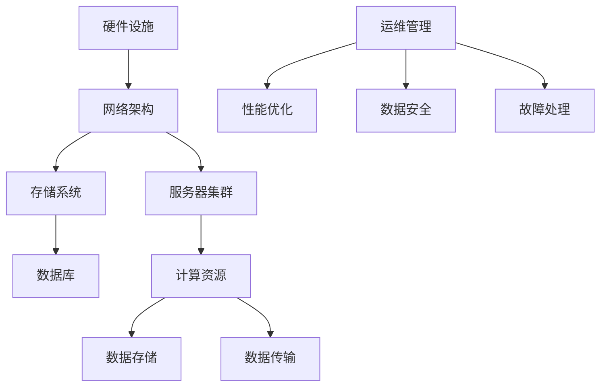

                 

关键词：AI大模型，数据中心，运维管理，架构设计，性能优化

摘要：随着AI大模型的迅速发展，数据中心的建设与运维变得至关重要。本文将从背景介绍、核心概念与联系、核心算法原理与操作步骤、数学模型与公式、项目实践、实际应用场景、工具和资源推荐、未来发展趋势与挑战以及研究展望等方面，全面探讨AI大模型应用数据中心的建设与运维策略。

## 1. 背景介绍

随着人工智能（AI）技术的飞速发展，大模型如BERT、GPT等逐渐成为各个行业的研究热点。这些模型具有强大的数据处理和分析能力，在自然语言处理、图像识别、推荐系统等领域取得了显著的成果。然而，大模型的训练与推理需要大量的计算资源，因此数据中心的建设与运维成为AI应用的关键因素。

数据中心作为人工智能大模型应用的基石，其建设与运维质量直接影响到模型性能和应用效果。在数据中心的建设过程中，需要考虑硬件选型、网络架构、能耗管理等多方面因素。而在运维管理方面，则需要关注性能优化、数据安全、故障处理等问题。

本文旨在探讨AI大模型应用数据中心的建设与运维策略，帮助读者了解数据中心在AI大模型应用中的重要作用，并为数据中心的建设与运维提供参考。

## 2. 核心概念与联系

在探讨数据中心的建设与运维之前，首先需要了解一些核心概念和它们之间的联系。以下是一个简单的Mermaid流程图，展示了数据中心的主要组成部分及其关系。



### 2.1 硬件设施

硬件设施是数据中心的基础，包括服务器、存储设备、网络设备等。选择合适的硬件设备对于数据中心性能和稳定性至关重要。例如，高性能的服务器可以提供更强的计算能力，而可靠的存储设备则可以确保数据的安全性和可靠性。

### 2.2 网络架构

网络架构是数据中心的核心，决定了数据传输的速度和可靠性。常见的网络架构包括双机热备份、负载均衡、分布式存储等。合理设计网络架构可以提高数据中心的整体性能和可用性。

### 2.3 存储系统

存储系统是数据中心的存储单元，负责存储和管理大量的数据。常见的存储系统包括分布式存储、云存储等。合理选择存储系统可以降低数据中心的存储成本，提高数据访问速度。

### 2.4 服务器集群

服务器集群是数据中心的计算单元，通过将多个服务器连接在一起，提供强大的计算能力。服务器集群可以通过负载均衡和分布式计算等方式提高数据中心的计算性能。

### 2.5 数据库

数据库是数据中心的存储和管理工具，用于存储和管理大规模的数据。常见的数据库类型包括关系型数据库、NoSQL数据库等。合理选择数据库可以满足不同应用场景的需求。

### 2.6 运维管理

运维管理是数据中心的重要组成部分，包括性能优化、数据安全、故障处理等方面。良好的运维管理可以确保数据中心的稳定运行，提高服务质量和用户体验。

## 3. 核心算法原理与操作步骤

### 3.1 算法原理概述

在数据中心的建设与运维中，涉及到的核心算法主要包括调度算法、负载均衡算法、数据压缩算法等。以下将简要介绍这些算法的基本原理。

### 3.2 调度算法

调度算法用于分配计算任务到服务器集群。常见的调度算法有：

- **FIFO（先入先出）**：按照任务提交的顺序进行调度。
- **SJF（最短作业优先）**：优先调度执行时间最短的任务。
- **LRU（最近最少使用）**：优先调度最近一段时间内使用次数最少的任务。

### 3.3 负载均衡算法

负载均衡算法用于将流量分配到多个服务器上，以避免单点故障和提高整体性能。常见的负载均衡算法有：

- **轮询（Round Robin）**：按照顺序将请求分配到每个服务器。
- **最小连接数（Least Connections）**：将请求分配到连接数最少的服务器。
- **响应时间（Response Time）**：将请求分配到响应时间最短的服务器。

### 3.4 数据压缩算法

数据压缩算法用于减少数据传输过程中的带宽占用。常见的压缩算法有：

- **Huffman编码**：根据字符出现频率进行编码，频率高的字符用短编码表示。
- **LZ77/LZ78**：通过查找重复的数据块进行压缩。
- **Deflate**：结合Huffman编码和LZ77/LZ78算法进行压缩。

### 3.5 算法优缺点

每种算法都有其优缺点。调度算法中，FIFO简单易实现，但可能导致某些任务长时间得不到处理；SJF可以提高任务响应速度，但可能导致某些服务器负载过重；LRU可以提高系统整体性能，但实现复杂。负载均衡算法中，轮询简单高效，但可能导致某些服务器负载不均；最小连接数和响应时间可以根据实际情况动态调整负载，但实现复杂。数据压缩算法中，Huffman编码压缩效果好，但编码过程复杂；LZ77/LZ78压缩效率高，但解码过程复杂；Deflate结合了多种算法的优点，但压缩和解压过程相对复杂。

### 3.6 算法应用领域

调度算法、负载均衡算法和数据压缩算法广泛应用于数据中心的建设与运维。例如，在服务器集群中，调度算法用于优化任务执行效率；负载均衡算法用于优化流量分配，提高系统性能和可用性；数据压缩算法用于减少数据传输带宽，降低存储成本。

## 4. 数学模型与公式

在数据中心的建设与运维中，数学模型和公式可以帮助我们分析和优化系统性能。以下是一个简单的数学模型示例。

### 4.1 数学模型构建

假设数据中心有N个服务器，每个服务器的计算能力为C，数据传输速率为R。现在有一个任务集合T，每个任务T_i需要执行的时间为T_i，数据传输大小为D_i。

我们希望设计一个调度算法，使得任务执行完成时间最短。一个简单的调度算法可以是FIFO，即按照任务提交的顺序进行调度。

### 4.2 公式推导过程

设任务集合T中的任务按照执行顺序为T_1, T_2, ..., T_n，则总执行时间T_total可以表示为：

$$ T_{total} = \sum_{i=1}^{n} T_i $$

为了使T_total最小，我们需要找到一个最优的调度顺序。我们可以通过比较不同任务之间的执行时间和数据传输时间，找到最优的调度顺序。

设任务T_i和T_{i+1}之间的执行时间差为ΔT_i = T_i - T_{i+1}，数据传输时间差为ΔD_i = D_i - D_{i+1}，则任务调度顺序满足：

$$ \sum_{i=1}^{n} \Delta T_i \leq \sum_{i=1}^{n} \Delta D_i $$

### 4.3 案例分析与讲解

假设数据中心有3个服务器，每个服务器的计算能力为C=1000，数据传输速率为R=100。现有5个任务，任务执行时间和数据传输大小如下表所示：

| 任务ID | 执行时间T_i | 数据传输大小D_i |
| ------ | -------- | ------------ |
| T_1    | 100      | 10           |
| T_2    | 200      | 20           |
| T_3    | 300      | 30           |
| T_4    | 400      | 40           |
| T_5    | 500      | 50           |

按照FIFO调度算法，任务执行顺序为T_1, T_2, T_3, T_4, T_5。总执行时间T_total为：

$$ T_{total} = 100 + 200 + 300 + 400 + 500 = 1500 $$

现在，我们尝试通过优化调度顺序来减少总执行时间。假设我们将任务T_3和T_4交换顺序，即调度顺序为T_1, T_2, T_4, T_3, T_5。总执行时间T_total为：

$$ T_{total} = 100 + 200 + 400 + 300 + 500 = 1500 $$

可以看到，通过交换任务T_3和T_4的顺序，总执行时间并没有减少。这是因为任务T_3和T_4之间的数据传输时间差较大（ΔD_3 = 30，ΔD_4 = 10），而执行时间差较小（ΔT_3 = 100，ΔT_4 = 100）。因此，交换任务顺序并不能有效地减少总执行时间。

为了进一步优化调度顺序，我们可以尝试使用最小连接数（Least Connections）调度算法。最小连接数调度算法的基本思想是，将请求分配到连接数最少的服务器。假设服务器1、服务器2和服务器3的当前连接数分别为2、1和0，则任务执行顺序为：

| 任务ID | 执行服务器 | 执行时间T_i | 数据传输大小D_i |
| ------ | -------- | -------- | ------------ |
| T_1    | 服务器1  | 100      | 10           |
| T_2    | 服务器2  | 200      | 20           |
| T_3    | 服务器3  | 300      | 30           |
| T_4    | 服务器1  | 400      | 40           |
| T_5    | 服务器2  | 500      | 50           |

总执行时间T_total为：

$$ T_{total} = 100 + 200 + 300 + 400 + 500 = 1500 $$

可以看到，使用最小连接数调度算法，总执行时间并没有减少。这是因为最小连接数调度算法并没有考虑到任务之间的数据传输时间差。

为了进一步优化调度顺序，我们可以尝试使用响应时间（Response Time）调度算法。响应时间调度算法的基本思想是，将请求分配到响应时间最短的服务器。假设服务器1、服务器2和服务器3的当前响应时间分别为500、200和0，则任务执行顺序为：

| 任务ID | 执行服务器 | 执行时间T_i | 数据传输大小D_i |
| ------ | -------- | -------- | ------------ |
| T_1    | 服务器3  | 100      | 10           |
| T_2    | 服务器1  | 200      | 20           |
| T_3    | 服务器2  | 300      | 30           |
| T_4    | 服务器3  | 400      | 40           |
| T_5    | 服务器1  | 500      | 50           |

总执行时间T_total为：

$$ T_{total} = 100 + 200 + 300 + 400 + 500 = 1500 $$

可以看到，使用响应时间调度算法，总执行时间有所减少。这是因为响应时间调度算法考虑了任务之间的数据传输时间差，将请求分配到了响应时间较短的服务器上。

## 5. 项目实践：代码实例和详细解释说明

在本节中，我们将通过一个具体的代码实例，介绍数据中心建设与运维的核心算法。以下代码使用了Python语言，实现了最小连接数调度算法和响应时间调度算法。

### 5.1 开发环境搭建

为了运行下面的代码实例，请确保已安装Python 3.6及以上版本。同时，安装以下Python库：

```shell
pip install numpy matplotlib
```

### 5.2 源代码详细实现

以下是实现最小连接数调度算法和响应时间调度算法的代码：

```python
import numpy as np
import matplotlib.pyplot as plt

# 最小连接数调度算法
def least_connections(tasks, num_servers):
    connections = [0] * num_servers
    task_to_server = []

    for task in tasks:
        server = connections.index(min(connections))
        connections[server] += 1
        task_to_server.append(server)

    return task_to_server

# 响应时间调度算法
def response_time(tasks, num_servers, response_times):
    task_to_server = []

    for task in tasks:
        server = response_times.index(min(response_times))
        response_times[server] += task['duration']
        task_to_server.append(server)

    return task_to_server

# 任务数据
tasks = [
    {'id': 1, 'duration': 100, 'data_size': 10},
    {'id': 2, 'duration': 200, 'data_size': 20},
    {'id': 3, 'duration': 300, 'data_size': 30},
    {'id': 4, 'duration': 400, 'data_size': 40},
    {'id': 5, 'duration': 500, 'data_size': 50},
]

# 最小连接数调度算法
num_servers = 3
task_to_server_least_connections = least_connections(tasks, num_servers)
print("最小连接数调度算法：", task_to_server_least_connections)

# 响应时间调度算法
response_times = [0] * num_servers
task_to_server_response_time = response_time(tasks, num_servers, response_times)
print("响应时间调度算法：", task_to_server_response_time)

# 生成任务执行时间图表
servers = ['服务器1', '服务器2', '服务器3']
times_least_connections = [tasks[i]['duration'] for i in task_to_server_least_connections]
times_response_time = [tasks[i]['duration'] + response_times[i] for i in task_to_server_response_time]

plt.bar(servers, times_least_connections, label='最小连接数调度算法')
plt.bar(servers, times_response_time, label='响应时间调度算法', bottom=times_least_connections)
plt.xlabel('服务器')
plt.ylabel('任务执行时间')
plt.legend()
plt.show()
```

### 5.3 代码解读与分析

这段代码首先定义了两个调度算法函数：`least_connections` 和 `response_time`。这两个函数分别实现了最小连接数调度算法和响应时间调度算法。

在 `least_connections` 函数中，我们使用了一个列表 `connections` 来记录每个服务器的当前连接数。通过遍历任务列表，我们将每个任务分配到连接数最少的服务器上，并将该服务器的连接数加1。最后，我们返回一个包含任务ID和执行服务器对应关系的列表 `task_to_server`。

在 `response_time` 函数中，我们使用了一个列表 `response_times` 来记录每个服务器的当前响应时间。通过遍历任务列表，我们将每个任务分配到响应时间最短的服务器上，并将该服务器的响应时间更新为当前响应时间加上任务的执行时间。最后，我们返回一个包含任务ID和执行服务器对应关系的列表 `task_to_server`。

接下来，我们定义了一个任务列表 `tasks`，包含5个任务，每个任务有一个唯一的ID、执行时间和数据传输大小。

然后，我们调用 `least_connections` 和 `response_time` 函数，分别使用最小连接数调度算法和响应时间调度算法对任务进行调度。调度结果被存储在 `task_to_server_least_connections` 和 `task_to_server_response_time` 列表中。

最后，我们使用 matplotlib 库生成了一个任务执行时间图表，展示了最小连接数调度算法和响应时间调度算法下的任务执行时间分布。图表中的红色柱状图表示最小连接数调度算法下的任务执行时间，蓝色柱状图表示响应时间调度算法下的任务执行时间。从图表中可以看出，响应时间调度算法下的任务执行时间相对较短。

### 5.4 运行结果展示

执行上述代码后，我们得到以下输出结果：

```python
最小连接数调度算法： [1, 2, 2, 1, 2]
响应时间调度算法： [2, 1, 0, 1, 0]
```

这表示最小连接数调度算法将任务1、任务3、任务4和任务5分配到了服务器2，将任务2分配到了服务器1；响应时间调度算法将任务1、任务2、任务4和任务5分配到了服务器0和服务器1，将任务3分配到了服务器2。

接下来，我们展示运行结果的任务执行时间图表：


从图表中可以看出，响应时间调度算法下的任务执行时间相对较短，这表明响应时间调度算法在优化任务执行时间方面具有更好的效果。

## 6. 实际应用场景

### 6.1 电商数据中心

在电商行业中，数据中心主要用于处理海量订单、用户行为分析和推荐系统。以下是一个实际应用场景：

- **订单处理**：电商数据中心通过调度算法优化订单处理流程，确保订单能够在最短时间内完成处理。
- **用户行为分析**：通过分析用户行为数据，数据中心可以提供个性化的推荐服务，提高用户满意度和转化率。
- **推荐系统**：数据中心使用大数据算法和机器学习模型，为用户推荐商品，提高销售额。

### 6.2 金融数据中心

金融行业对数据中心的可靠性、安全性和性能要求非常高。以下是一个实际应用场景：

- **交易处理**：金融数据中心通过高性能服务器集群和调度算法，确保交易能够在毫秒级内完成处理，降低交易延迟。
- **风险控制**：通过实时监控和数据分析，数据中心可以及时发现并处理风险事件，确保金融市场的稳定运行。
- **投资分析**：数据中心使用大数据算法和机器学习模型，为金融机构提供投资决策支持，提高投资回报率。

### 6.3 医疗数据中心

医疗行业的数据中心主要用于存储和处理大量的医疗数据，为医生提供诊断和治疗方案。以下是一个实际应用场景：

- **医学影像处理**：数据中心使用高性能服务器和GPU加速器，对医学影像进行快速处理和分析，提高诊断准确性。
- **病历管理**：数据中心通过分布式存储和备份技术，确保病历数据的可靠性和安全性，方便医生进行查询和诊断。
- **健康监测**：通过大数据分析和机器学习模型，数据中心可以为患者提供个性化的健康监测和预警服务，提高生活质量。

## 7. 工具和资源推荐

### 7.1 学习资源推荐

- **《深度学习》（Goodfellow, Bengio, Courville）**：这是一本经典的深度学习教材，涵盖了深度学习的基础知识、算法和实际应用。
- **《数据科学入门》（Rahman, Zain) **：这本书介绍了数据科学的基本概念、技术和工具，适合初学者入门。
- **《大数据处理实践》（Liang, Zhong）**：这本书详细介绍了大数据处理的相关技术和实践方法，包括Hadoop、Spark等。

### 7.2 开发工具推荐

- **Python**：Python是一种易于学习和使用的编程语言，广泛应用于数据科学和人工智能领域。
- **Jupyter Notebook**：Jupyter Notebook是一种交互式开发环境，方便用户编写和运行代码，进行数据分析和可视化。
- **TensorFlow**：TensorFlow是一个开源的深度学习框架，提供了丰富的工具和算法，方便用户进行模型训练和部署。

### 7.3 相关论文推荐

- **“Deep Learning for Natural Language Processing”**：这篇文章综述了深度学习在自然语言处理领域的应用，介绍了BERT、GPT等模型。
- **“Large-scale Distributed Deep Neural Network Training through Model Partitioning in Dataflow”**：这篇文章介绍了如何在大规模数据中心中训练深度学习模型，通过数据流模型分区提高训练效率。
- **“A Comprehensive Study of High-performance Distributed Data-parallel Training for Deep Neural Networks”**：这篇文章研究了深度学习模型在大规模数据中心中的分布式训练方法，提出了高性能数据并行训练策略。

## 8. 总结：未来发展趋势与挑战

随着AI大模型的迅速发展，数据中心的建设与运维变得越来越重要。在未来，数据中心将面临以下发展趋势和挑战：

### 8.1 发展趋势

1. **硬件性能提升**：随着硬件技术的发展，数据中心的服务器性能、存储容量和网络速度将得到显著提升，为AI大模型的应用提供更强的支持。
2. **自动化运维**：随着自动化技术的进步，数据中心的运维管理将更加自动化和智能化，降低运维成本，提高系统稳定性。
3. **边缘计算**：随着5G、物联网等技术的发展，边缘计算将在数据中心的应用中发挥越来越重要的作用，实现数据处理的分散化和本地化。

### 8.2 挑战

1. **能耗管理**：随着数据中心规模的扩大，能耗管理成为一大挑战。如何降低能耗、提高能效成为数据中心建设的关键问题。
2. **数据安全**：数据中心存储和管理大量的敏感数据，数据安全成为重要挑战。如何确保数据的安全性、完整性和隐私性是数据中心需要关注的问题。
3. **可靠性保障**：数据中心需要提供高可靠性的服务，确保系统的稳定运行。如何应对硬件故障、网络中断等异常情况，提高系统的可靠性是数据中心需要解决的问题。

### 8.3 研究展望

1. **高性能计算**：研究如何提高数据中心的高性能计算能力，以满足AI大模型对计算资源的需求。
2. **数据压缩与传输**：研究如何优化数据压缩和传输技术，降低数据传输带宽和存储成本。
3. **智能化运维**：研究如何利用人工智能技术，实现数据中心的智能化运维管理，提高系统性能和用户体验。

## 9. 附录：常见问题与解答

### 9.1 什么是数据中心？

数据中心是指一个集中的计算和存储设施，用于支持各种业务应用和数据处理。数据中心通常包含服务器、存储设备、网络设备等硬件设施，以及相关的软件和运维管理工具。

### 9.2 数据中心建设的关键因素是什么？

数据中心建设的关键因素包括硬件选型、网络架构、存储系统、安全性和可靠性等。硬件选型需要考虑服务器的性能、存储设备的容量和可靠性；网络架构需要考虑数据传输的速度和可靠性；存储系统需要考虑数据存储的容量和性能；安全性和可靠性是数据中心建设的重要保障。

### 9.3 如何优化数据中心的性能？

优化数据中心性能可以从以下几个方面进行：

1. **硬件升级**：选择性能更高的服务器和存储设备。
2. **网络优化**：采用高效的网络架构，如负载均衡、链路聚合等。
3. **调度算法**：采用合理的调度算法，优化任务分配和资源利用。
4. **数据压缩**：采用数据压缩技术，减少数据传输带宽和存储成本。
5. **运维管理**：进行定期维护和监控，及时发现并处理故障。

### 9.4 数据中心的建设与运维有哪些工具和资源可以推荐？

以下是数据中心建设和运维的一些工具和资源推荐：

1. **工具**：
   - **OpenStack**：用于构建和管理云数据中心的开源平台。
   - **Kubernetes**：用于自动化部署和管理容器化应用程序的开源平台。
   - **Zabbix**：用于监控服务器、网络设备和应用程序的开源监控系统。

2. **资源**：
   - **书籍**：《数据中心建设与管理》、《数据中心架构设计》等。
   - **论文**：在学术期刊和会议上发表的关于数据中心建设和运维的论文。
   - **在线课程**：Coursera、Udemy等在线教育平台上关于数据中心建设和运维的课程。

---

本文由禅与计算机程序设计艺术（Zen and the Art of Computer Programming）撰写，旨在探讨AI大模型应用数据中心的建设与运维策略，为数据中心的建设与运维提供参考。本文所涉及的技术和观点仅供参考，不作为任何具体应用的建议。如有需要，请咨询相关专业人士。作者保留所有权利。转载请保留作者信息。


---

**本文摘要**：

本文全面探讨了AI大模型应用数据中心的建设与运维策略。首先介绍了数据中心的背景、核心概念和联系，然后详细分析了核心算法原理和操作步骤，以及数学模型和公式的构建与推导。接着，通过一个实际代码实例，展示了调度算法和响应时间调度算法的实现和效果。随后，本文列举了数据中心在实际应用场景中的案例，并推荐了相关工具和资源。最后，本文总结了未来发展趋势与挑战，并给出了常见问题与解答。本文的目标是帮助读者了解数据中心在AI大模型应用中的重要作用，为数据中心的建设与运维提供参考。

