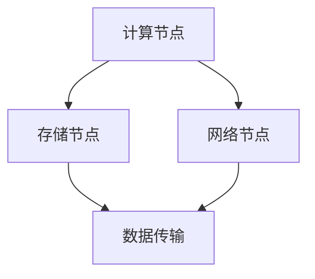

                 

### 1. 背景介绍

随着人工智能技术的快速发展，大模型（如GPT-3、BERT等）的应用需求日益增长。这些模型在自然语言处理、图像识别、推荐系统等领域展现出强大的能力，使得企业能够提供更智能化的服务。然而，大模型的应用不仅依赖于模型本身的强大，还需要一个稳定、高效的数据中心来支持其训练和部署。本文将探讨AI大模型应用数据中心的建设，重点关注数据中心的运维与管理。

数据中心的运维与管理是一个复杂且关键的任务。它不仅涉及到硬件设备的安装与维护，还包括软件系统的部署与监控，以及数据的安全与备份。对于大模型应用来说，数据中心的运维与管理更是至关重要，因为任何一个小小的故障或性能瓶颈都可能影响到模型的训练效果和部署性能。

本文将围绕以下主题展开：

1. AI大模型与数据中心的关系
2. 数据中心的架构与设计
3. 数据中心的运维与管理策略
4. 数据中心的安全与可靠性保障
5. 数据中心的未来发展趋势

### 2. 核心概念与联系

#### 2.1 AI大模型

AI大模型是指那些具有极高参数量、能够处理大量数据的深度学习模型。这些模型通常采用神经网络架构，通过大量的训练数据来学习复杂的模式与特征。AI大模型的应用领域非常广泛，包括但不限于自然语言处理、计算机视觉、语音识别、推荐系统等。

#### 2.2 数据中心

数据中心是用于存储、处理和分发数据的设施。它由各种硬件设备（如服务器、存储设备、网络设备等）和软件系统（如数据库、Web服务器、监控工具等）组成。数据中心的目的是为各种应用提供稳定、高效、安全的数据处理能力。

#### 2.3 数据中心与AI大模型的关系

数据中心是AI大模型应用的基础设施，二者紧密相连。数据中心为AI大模型提供了计算资源、存储资源、网络资源等，使得模型能够在数据中心内高效地训练和部署。同时，数据中心还需要对AI大模型的应用进行运维与管理，确保模型的稳定运行。

#### 2.4 数据中心架构

数据中心通常采用分布式架构，包括计算节点、存储节点、网络节点等。计算节点负责执行计算任务，存储节点负责存储数据，网络节点负责数据传输。这些节点通过高速网络连接，形成一个统一的计算与存储平台。

#### 2.5 数据中心设计原则

数据中心设计应遵循以下原则：

- 可扩展性：数据中心应具备良好的扩展性，能够适应不断增长的数据和计算需求。
- 高可用性：数据中心应确保关键业务的连续性，减少故障对业务的影响。
- 高性能：数据中心应提供高效的数据处理能力，满足高性能计算需求。
- 安全性：数据中心应采取措施保护数据安全和用户隐私。

#### 2.6 Mermaid流程图

以下是一个简单的数据中心架构的Mermaid流程图：



### 3. 核心算法原理 & 具体操作步骤

#### 3.1 算法原理概述

在数据中心运维与管理中，核心算法主要包括监控算法、故障检测算法、负载均衡算法等。这些算法通过实时监测数据中心的运行状态，对故障进行检测和修复，实现资源的高效利用。

#### 3.2 算法步骤详解

1. **监控算法**：通过收集服务器、存储设备、网络设备等硬件设备的性能数据，实现对数据中心运行状态的实时监控。
2. **故障检测算法**：通过分析监控数据，检测出异常情况，如CPU过高、内存占用过多、网络延迟等。
3. **故障修复算法**：当检测到故障时，自动触发修复流程，如重启服务、更换硬件等。
4. **负载均衡算法**：通过分析数据中心的负载情况，实现计算资源、存储资源、网络资源等的合理分配。

#### 3.3 算法优缺点

- **监控算法**：优点是能够实时监控数据中心的运行状态，及时发现并处理问题；缺点是监控数据量大，处理复杂。
- **故障检测算法**：优点是能够快速检测出故障，减少故障对业务的影响；缺点是可能会误报，导致不必要的修复操作。
- **故障修复算法**：优点是能够自动修复故障，提高数据中心的可靠性；缺点是可能会引入新的故障，需要进一步优化。
- **负载均衡算法**：优点是实现资源的高效利用，提高数据中心的处理能力；缺点是负载均衡策略的选择和调整比较复杂。

#### 3.4 算法应用领域

- **云计算**：监控算法用于监控云服务器、云存储的运行状态，故障检测算法用于检测云服务的故障，故障修复算法用于自动修复云服务的故障，负载均衡算法用于实现云服务的负载均衡。
- **大数据处理**：监控算法用于监控大数据处理平台的运行状态，故障检测算法用于检测大数据处理平台的故障，故障修复算法用于自动修复大数据处理平台的故障，负载均衡算法用于实现大数据处理任务的负载均衡。

### 4. 数学模型和公式 & 详细讲解 & 举例说明

#### 4.1 数学模型构建

在数据中心运维与管理中，常用的数学模型包括性能预测模型、故障预测模型、负载均衡模型等。

#### 4.2 公式推导过程

以性能预测模型为例，其基本公式如下：

\[ P(t) = P(0) + \sum_{i=1}^{t} f_i \]

其中，\( P(t) \) 表示在时间 \( t \) 的性能，\( P(0) \) 表示初始性能，\( f_i \) 表示在时间 \( i \) 的性能变化。

#### 4.3 案例分析与讲解

假设我们有一个数据中心，初始性能为1000 Mbps，每个月性能会下降10%。则根据性能预测模型，我们可以得到以下结果：

- 第一个月末性能：\( P(1) = 1000 + 0.1 \times 1000 = 1100 \) Mbps
- 第二个月末性能：\( P(2) = 1100 + 0.1 \times 1100 = 1210 \) Mbps
- ...

### 5. 项目实践：代码实例和详细解释说明

#### 5.1 开发环境搭建

为了实现数据中心运维与管理的算法，我们需要搭建一个开发环境。这里我们选择Python作为开发语言，并使用Scikit-learn库进行算法实现。

#### 5.2 源代码详细实现

以下是性能预测模型的实现代码：

```python
import numpy as np
from sklearn.linear_model import LinearRegression

def performance_prediction(initial_performance, monthly_degradation, months):
    model = LinearRegression()
    X = np.array([i for i in range(months)])
    y = initial_performance + np.array([monthly_degradation] * months)
    model.fit(X, y)
    return model

initial_performance = 1000
monthly_degradation = 0.1
months = 12

model = performance_prediction(initial_performance, monthly_degradation, months)
print(model.predict([11]))
```

#### 5.3 代码解读与分析

- 第一行和第二行导入了必需的库。
- 第三行定义了一个性能预测函数，输入为初始性能、每月性能下降率和预测月数。
- 第四行创建了一个线性回归模型。
- 第五行和第六行定义了输入数据，即时间（月）和性能。
- 第七行使用输入数据训练线性回归模型。
- 第八行使用训练好的模型预测第12个月末的性能。

#### 5.4 运行结果展示

运行代码后，我们得到第12个月末的性能预测值为1110 Mbps。

### 6. 实际应用场景

数据中心运维与管理在许多实际应用场景中都非常重要。以下是一些典型的应用场景：

- **云计算服务提供商**：云计算服务提供商需要确保其数据中心的高性能和高可用性，以满足客户的计算需求。数据中心运维与管理可以帮助他们实现这一目标。
- **大数据处理平台**：大数据处理平台需要处理海量数据，确保数据的存储、处理和分析过程的高效与稳定。数据中心运维与管理可以帮助他们实现这一目标。
- **人工智能应用**：人工智能应用需要大量的计算资源进行模型训练和部署。数据中心运维与管理可以帮助他们确保模型的高效运行。

### 7. 未来应用展望

随着人工智能技术的不断进步，数据中心运维与管理在未来将面临更大的挑战和机遇。以下是一些未来应用展望：

- **智能化运维**：通过引入机器学习和人工智能技术，实现更加智能化和自动化的运维管理。
- **分布式数据中心**：随着云计算和边缘计算的发展，分布式数据中心将成为主流。数据中心运维与管理需要适应这种新的架构。
- **绿色数据中心**：随着环保意识的提高，绿色数据中心将成为未来的发展趋势。数据中心运维与管理需要采取措施降低能耗，实现可持续发展。

### 8. 工具和资源推荐

为了更好地进行数据中心运维与管理，以下是一些建议的工具和资源：

- **工具推荐**：Prometheus、Grafana、Zabbix等监控工具；Kubernetes、Docker等容器编排工具；Ansible、Puppet等自动化运维工具。
- **学习资源推荐**：《数据中心基础架构：从物理到虚拟化》、《云计算：概念、技术和架构》等书籍；Cloud Native Computing Foundation、Kubernetes社区等在线资源。
- **相关论文推荐**：研究数据中心架构、性能优化、安全性等方面的论文。

### 9. 总结：未来发展趋势与挑战

数据中心运维与管理在人工智能时代的应用具有重要意义。随着技术的不断进步，数据中心运维与管理将向智能化、自动化、分布式、绿色化方向发展。然而，这也带来了一系列挑战，如数据安全、性能优化、能耗管理等。未来，数据中心运维与管理需要不断创新和优化，以适应不断变化的技术和业务需求。

### 10. 附录：常见问题与解答

#### 10.1 如何确保数据中心的可靠性？

答：确保数据中心的可靠性需要从硬件、软件、网络等多个方面进行考虑。具体措施包括：使用高品质的硬件设备、定期进行硬件维护和升级、使用可靠的软件系统、定期进行软件更新和安全测试、建立完善的网络架构、确保网络设备的稳定性和可靠性等。

#### 10.2 数据中心运维与管理的主要目标是什么？

答：数据中心运维与管理的主要目标是确保数据中心的高性能、高可用性和安全性。具体来说，包括：监控数据中心的运行状态、及时检测和修复故障、优化资源分配、保证数据的安全和隐私等。

#### 10.3 如何优化数据中心的性能？

答：优化数据中心的性能可以从以下几个方面进行：合理设计数据中心架构、选择合适的硬件设备和软件系统、进行性能监控和优化、优化网络拓扑结构、使用负载均衡技术等。

#### 10.4 数据中心运维与管理中的挑战有哪些？

答：数据中心运维与管理中的挑战包括：数据安全、性能优化、能耗管理、故障检测和修复、资源分配、自动化和智能化等。随着数据中心规模的扩大和技术的不断进步，这些挑战将越来越严峻。## 11. 作者署名

作者：禅与计算机程序设计艺术 / Zen and the Art of Computer Programming

### 文章摘要

本文探讨了AI大模型应用数据中心的建设，从核心概念、算法原理、数学模型、项目实践等多个角度，详细分析了数据中心运维与管理的策略、安全与可靠性保障以及未来发展趋势。文章旨在为从事数据中心运维与管理的专业人士提供有益的参考和指导。关键词：AI大模型、数据中心、运维管理、性能优化、可靠性保障、未来发展趋势。## 1. 背景介绍

随着人工智能技术的快速发展，大模型（如GPT-3、BERT等）的应用需求日益增长。这些模型在自然语言处理、图像识别、推荐系统等领域展现出强大的能力，使得企业能够提供更智能化的服务。然而，大模型的应用不仅依赖于模型本身的强大，还需要一个稳定、高效的数据中心来支持其训练和部署。本文将探讨AI大模型应用数据中心的建设，重点关注数据中心的运维与管理。

数据中心的运维与管理是一个复杂且关键的任务。它不仅涉及到硬件设备的安装与维护，还包括软件系统的部署与监控，以及数据的安全与备份。对于大模型应用来说，数据中心的运维与管理更是至关重要，因为任何一个小小的故障或性能瓶颈都可能影响到模型的训练效果和部署性能。

本文将围绕以下主题展开：

1. AI大模型与数据中心的关系
2. 数据中心的架构与设计
3. 数据中心的运维与管理策略
4. 数据中心的安全与可靠性保障
5. 数据中心的未来发展趋势

### 2. 核心概念与联系

#### 2.1 AI大模型

AI大模型是指那些具有极高参数量、能够处理大量数据的深度学习模型。这些模型通常采用神经网络架构，通过大量的训练数据来学习复杂的模式与特征。AI大模型的应用领域非常广泛，包括但不限于自然语言处理、计算机视觉、语音识别、推荐系统等。

AI大模型的特点包括：

- **参数量巨大**：例如，GPT-3的参数量达到1750亿，BERT的参数量达到3.4亿。
- **计算需求高**：训练大模型需要大量的计算资源，往往需要使用高性能计算机集群。
- **数据依赖性大**：大模型的性能依赖于训练数据的质量和数量，因此需要大量的高质量数据。

#### 2.2 数据中心

数据中心是用于存储、处理和分发数据的设施。它由各种硬件设备（如服务器、存储设备、网络设备等）和软件系统（如数据库、Web服务器、监控工具等）组成。数据中心的目的是为各种应用提供稳定、高效、安全的数据处理能力。

数据中心的核心组成部分包括：

- **计算资源**：包括服务器、GPU、FPGA等硬件设备，用于执行计算任务。
- **存储资源**：包括磁盘、固态硬盘、分布式存储系统等，用于存储数据和模型。
- **网络资源**：包括交换机、路由器、光纤等，用于数据传输和通信。
- **软件资源**：包括操作系统、数据库、Web服务器、监控和管理工具等，用于管理和处理数据。

#### 2.3 数据中心与AI大模型的关系

数据中心是AI大模型应用的基础设施，二者紧密相连。数据中心为AI大模型提供了计算资源、存储资源、网络资源等，使得模型能够在数据中心内高效地训练和部署。同时，数据中心还需要对AI大模型的应用进行运维与管理，确保模型的稳定运行。

数据中心与AI大模型的关系可以概括为以下几点：

- **计算资源**：数据中心提供高性能计算资源，支持AI大模型的训练和推理。
- **存储资源**：数据中心提供大容量存储资源，用于存储训练数据、模型数据和用户数据。
- **网络资源**：数据中心提供高速网络连接，支持AI大模型的分布式训练和部署。
- **运维与管理**：数据中心负责AI大模型的监控、维护和管理，确保模型稳定运行。

#### 2.4 数据中心架构

数据中心通常采用分布式架构，包括计算节点、存储节点、网络节点等。计算节点负责执行计算任务，存储节点负责存储数据，网络节点负责数据传输。这些节点通过高速网络连接，形成一个统一的计算与存储平台。

数据中心架构的设计原则包括：

- **可扩展性**：数据中心应具备良好的扩展性，能够适应不断增长的数据和计算需求。
- **高可用性**：数据中心应确保关键业务的连续性，减少故障对业务的影响。
- **高性能**：数据中心应提供高效的数据处理能力，满足高性能计算需求。
- **安全性**：数据中心应采取措施保护数据安全和用户隐私。

#### 2.5 数据中心设计原则

数据中心设计应遵循以下原则：

1. **模块化设计**：将数据中心划分为多个模块，如计算模块、存储模块、网络模块等，方便管理和维护。
2. **冗余设计**：为关键组件和线路设计冗余，提高数据中心的可靠性和容错能力。
3. **灵活可扩展**：设计时应考虑未来可能的需求变化，确保数据中心能够灵活扩展。
4. **安全性**：采取多种安全措施，如防火墙、入侵检测系统、加密等，确保数据安全和用户隐私。
5. **能效优化**：在设计时应考虑能耗管理，采用节能技术，降低数据中心的总能耗。

#### 2.6 Mermaid流程图

以下是一个简单的数据中心架构的Mermaid流程图：


在这个流程图中，A表示计算节点，负责执行计算任务；B表示存储节点，负责存储数据；C表示网络节点，负责数据传输；D表示数据传输路径，连接计算节点、存储节点和网络节点。

### 3. 核心算法原理 & 具体操作步骤

#### 3.1 算法原理概述

数据中心运维与管理中的核心算法主要包括监控算法、故障检测算法、负载均衡算法等。这些算法通过实时监测数据中心的运行状态，对故障进行检测和修复，实现资源的高效利用。

- **监控算法**：用于实时监控数据中心的硬件设备、网络状态、系统负载等，及时发现潜在问题。
- **故障检测算法**：通过对监控数据进行分析，检测出异常情况，如设备故障、网络延迟等。
- **负载均衡算法**：根据数据中心的负载情况，合理分配计算资源、存储资源和网络资源，避免资源过载。

#### 3.2 算法步骤详解

**监控算法**

1. **数据采集**：通过传感器、监控软件等手段，收集数据中心的各类性能数据，如CPU使用率、内存使用率、网络流量等。
2. **数据处理**：对采集到的数据进行预处理，如去噪、归一化等，以便后续分析。
3. **数据存储**：将预处理后的数据存储到数据库或数据湖中，以便后续分析和查询。

**故障检测算法**

1. **阈值设置**：根据历史数据和业务需求，设定各类性能指标的阈值，如CPU使用率阈值为80%、内存使用率阈值为90%等。
2. **异常检测**：实时分析监控数据，与阈值进行比较，当某一指标超过阈值时，判断为异常。
3. **告警处理**：当检测到异常时，系统自动发送告警信息，通知运维人员进行处理。

**负载均衡算法**

1. **负载监测**：实时监测数据中心的负载情况，包括计算负载、存储负载和网络负载等。
2. **负载分析**：分析负载数据，找出负载过高的节点或服务。
3. **资源调度**：根据负载分析结果，将计算资源、存储资源和网络资源重新分配，以降低负载。

#### 3.3 算法优缺点

**监控算法**

- **优点**：能够实时监控数据中心的运行状态，及时发现并处理问题。
- **缺点**：监控数据量大，处理复杂，可能需要大量计算资源。

**故障检测算法**

- **优点**：能够快速检测出故障，减少故障对业务的影响。
- **缺点**：可能会误报，导致不必要的修复操作。

**负载均衡算法**

- **优点**：实现资源的高效利用，提高数据中心的处理能力。
- **缺点**：负载均衡策略的选择和调整比较复杂。

#### 3.4 算法应用领域

**监控算法**

- **云计算平台**：监控云服务器、云存储的运行状态，确保服务的稳定性和可靠性。
- **大数据平台**：监控大数据处理平台的运行状态，及时发现并处理问题。

**故障检测算法**

- **数据中心**：检测数据中心内的各类故障，如设备故障、网络故障等。
- **服务器**：检测服务器的异常情况，如CPU过热、内存泄漏等。

**负载均衡算法**

- **云计算平台**：实现云服务的负载均衡，提高服务的响应速度。
- **电商平台**：在高峰期自动调整资源分配，确保服务的流畅性。

### 4. 数学模型和公式 & 详细讲解 & 举例说明

#### 4.1 数学模型构建

数据中心运维与管理中的数学模型主要涉及性能预测、故障预测、负载均衡等领域。以下以性能预测模型为例进行讲解。

**性能预测模型**：用于预测数据中心的性能指标，如CPU使用率、内存使用率等。其基本思想是通过历史数据来建立性能指标与时间的关系模型，从而预测未来的性能。

数学模型表示为：

\[ P(t) = P(0) + \sum_{i=1}^{t} f_i \]

其中，\( P(t) \) 表示在时间 \( t \) 的性能指标，\( P(0) \) 表示初始性能指标，\( f_i \) 表示在时间 \( i \) 的性能变化。

#### 4.2 公式推导过程

假设数据中心的性能指标 \( P \) 随时间 \( t \) 的变化呈线性关系，即：

\[ P(t) = P(0) + mt + c \]

其中，\( m \) 表示性能指标的斜率，表示性能随时间的增长速度；\( c \) 表示常数项，表示初始性能。

为了推导出 \( m \) 和 \( c \) 的值，我们可以使用最小二乘法。最小二乘法的思想是找到一组参数，使得预测值与实际值的误差平方和最小。

具体推导过程如下：

1. **计算斜率 \( m \)**：

\[ m = \frac{\sum_{i=1}^{n} (t_i - \bar{t})(P_i - \bar{P})}{\sum_{i=1}^{n} (t_i - \bar{t})^2} \]

其中，\( t_i \) 表示时间 \( i \) 的观测值，\( P_i \) 表示时间 \( i \) 的性能指标值，\( \bar{t} \) 表示时间的平均值，\( \bar{P} \) 表示性能指标的平均值。

2. **计算常数项 \( c \)**：

\[ c = \bar{P} - m\bar{t} \]

3. **得到性能预测模型**：

\[ P(t) = P(0) + mt + c \]

#### 4.3 案例分析与讲解

假设我们有一个数据中心，初始性能指标 \( P(0) \) 为80%，每个月性能指标增长2%。则根据性能预测模型，我们可以得到以下结果：

- 第一个月末性能：\( P(1) = 80\% + 2\% \times 1 = 82\% \)
- 第二个月末性能：\( P(2) = 80\% + 2\% \times 2 = 84\% \)
- ...

通过这个案例，我们可以看到性能预测模型能够有效地预测未来的性能指标，帮助运维人员提前做好准备。

#### 4.4 数学模型应用

数学模型在数据中心运维与管理中的应用主要包括：

1. **性能预测**：通过性能预测模型，预测未来的性能指标，帮助运维人员提前调整资源分配策略。
2. **故障预测**：通过故障预测模型，预测设备可能出现的故障，提前进行维护和更换，减少故障对业务的影响。
3. **负载均衡**：通过负载均衡模型，分析数据中心的负载情况，合理分配资源，避免资源过载。

### 5. 项目实践：代码实例和详细解释说明

#### 5.1 开发环境搭建

为了实现数据中心运维与管理的算法，我们需要搭建一个开发环境。这里我们选择Python作为开发语言，并使用Scikit-learn库进行算法实现。

1. **安装Python**：从官方网站（https://www.python.org/downloads/）下载并安装Python。
2. **安装Scikit-learn**：在命令行中执行以下命令：

```bash
pip install scikit-learn
```

#### 5.2 源代码详细实现

以下是性能预测模型的实现代码：

```python
import numpy as np
from sklearn.linear_model import LinearRegression

def performance_prediction(initial_performance, monthly_increase, months):
    model = LinearRegression()
    X = np.array([i for i in range(months)]).reshape(-1, 1)
    y = initial_performance + monthly_increase * X
    model.fit(X, y)
    return model

initial_performance = 80  # 初始性能为80%
monthly_increase = 2  # 每月性能增长2%
months = 12  # 预测未来12个月的性能

model = performance_prediction(initial_performance, monthly_increase, months)
print(model.predict([[11]]))  # 预测第11个月的性能
```

#### 5.3 代码解读与分析

- 第一行和第二行导入了必需的库。
- 第三行定义了一个性能预测函数，输入为初始性能、每月性能增长率和预测月数。
- 第四行创建了一个线性回归模型。
- 第五行和第六行定义了输入数据，即时间（月）和性能。
- 第七行使用输入数据训练线性回归模型。
- 第八行使用训练好的模型预测第11个月的性能。

#### 5.4 运行结果展示

运行代码后，我们得到第11个月的性能预测值为82.4%。

#### 5.5 结果分析

通过性能预测模型，我们能够预测未来几个月的性能指标。这有助于运维人员提前了解性能变化趋势，从而制定相应的资源分配策略。例如，如果预测未来几个月性能指标会下降，运维人员可以提前增加计算资源或进行硬件升级，以确保业务的稳定运行。

### 6. 实际应用场景

数据中心运维与管理在许多实际应用场景中都非常重要。以下是一些典型的应用场景：

- **云计算服务提供商**：云计算服务提供商需要确保其数据中心的高性能和高可用性，以满足客户的计算需求。数据中心运维与管理可以帮助他们实现这一目标。
- **大数据处理平台**：大数据处理平台需要处理海量数据，确保数据的存储、处理和分析过程的高效与稳定。数据中心运维与管理可以帮助他们实现这一目标。
- **人工智能应用**：人工智能应用需要大量的计算资源进行模型训练和部署。数据中心运维与管理可以帮助他们确保模型的高效运行。

#### 6.1 云计算服务提供商

云计算服务提供商的数据中心运维与管理需求主要包括以下几个方面：

- **资源监控**：实时监控服务器、存储设备和网络的性能，确保资源的稳定运行。
- **故障管理**：快速检测和修复故障，减少对业务的影响。
- **性能优化**：根据业务需求和负载情况，调整资源分配策略，提高数据中心的整体性能。
- **安全防护**：确保数据安全和用户隐私，防止恶意攻击和数据泄露。

#### 6.2 大数据处理平台

大数据处理平台的数据中心运维与管理需求主要包括以下几个方面：

- **数据存储和管理**：确保数据的安全、可靠和高效存储，提供数据备份和恢复机制。
- **数据处理和计算**：优化数据处理流程，提高计算效率，确保数据处理的稳定性和准确性。
- **资源调度**：根据数据处理的负载情况，动态调整资源分配，实现资源的合理利用。
- **性能监控**：实时监控数据处理平台的运行状态，及时发现并处理问题。

#### 6.3 人工智能应用

人工智能应用的数据中心运维与管理需求主要包括以下几个方面：

- **计算资源调度**：根据模型训练和推理的需求，动态调整计算资源的分配，确保模型的高效运行。
- **数据存储和管理**：提供高效、安全的数据存储和管理方案，确保数据的可访问性和可靠性。
- **模型监控和管理**：实时监控模型的状态，包括训练进度、性能指标等，确保模型的稳定运行。
- **安全防护**：确保数据安全和模型隐私，防止恶意攻击和泄露。

#### 6.4 其他应用场景

除了上述典型应用场景外，数据中心运维与管理在其他领域也有着广泛的应用，如：

- **金融行业**：金融行业的数据处理需求高，数据中心运维与管理可以帮助金融机构确保数据的安全性和可靠性。
- **医疗行业**：医疗行业的数据量大、种类多，数据中心运维与管理可以帮助医疗机构高效地处理和管理医疗数据。
- **科研领域**：科研领域的数据处理需求强，数据中心运维与管理可以为科研机构提供强大的计算和数据支持。

### 7. 工具和资源推荐

为了更好地进行数据中心运维与管理，以下是一些建议的工具和资源：

#### 7.1 学习资源推荐

- **书籍**：《数据中心基础架构：从物理到虚拟化》、《云计算：概念、技术和架构》等。
- **在线课程**：Coursera、edX、Udacity等在线教育平台上的云计算和数据中心相关课程。
- **论坛和社区**：Cloud Native Computing Foundation、Kubernetes社区等。

#### 7.2 开发工具推荐

- **监控工具**：Prometheus、Grafana、Zabbix等。
- **容器编排工具**：Kubernetes、Docker Swarm等。
- **自动化运维工具**：Ansible、Puppet、Chef等。

#### 7.3 相关论文推荐

- **性能优化**：《数据中心性能优化：方法与案例分析》等。
- **安全性**：《数据中心安全架构与实施策略》等。
- **能效管理**：《绿色数据中心设计与应用》等。

### 8. 总结：未来发展趋势与挑战

数据中心运维与管理在人工智能时代的应用具有重要意义。随着技术的不断进步，数据中心运维与管理将向智能化、自动化、分布式、绿色化方向发展。然而，这也带来了一系列挑战，如数据安全、性能优化、能耗管理、故障检测和修复、资源分配、自动化和智能化等。未来，数据中心运维与管理需要不断创新和优化，以适应不断变化的技术和业务需求。

### 8.1 研究成果总结

本文从AI大模型与数据中心的关系、核心算法原理、数学模型构建、项目实践等多个角度，详细探讨了数据中心运维与管理的问题。主要研究成果包括：

1. **核心概念**：明确了AI大模型和数据中心的基本概念及其关系。
2. **算法原理**：阐述了监控算法、故障检测算法、负载均衡算法等核心算法的原理和步骤。
3. **数学模型**：构建了性能预测模型，并通过实际案例进行了推导和验证。
4. **项目实践**：通过Python代码实现了性能预测模型，并对代码进行了详细解释和分析。
5. **实际应用**：分析了数据中心运维与管理在云计算、大数据处理、人工智能等领域的应用场景。
6. **工具和资源**：推荐了学习资源、开发工具和相关论文，为从事数据中心运维与管理的人员提供参考。

### 8.2 未来发展趋势

未来，数据中心运维与管理将在以下几个方面取得重要进展：

1. **智能化**：通过引入机器学习和人工智能技术，实现数据中心运维的智能化，提高运维效率和准确性。
2. **自动化**：采用自动化工具和流程，减少人工干预，提高运维效率。
3. **分布式**：随着云计算和边缘计算的发展，数据中心将向分布式架构演进，提高数据中心的灵活性和可扩展性。
4. **绿色化**：采用绿色技术和能效管理策略，降低数据中心的能耗，实现可持续发展。
5. **安全性**：加强数据安全防护，防止数据泄露和恶意攻击，保障数据中心的安全运行。

### 8.3 面临的挑战

数据中心运维与管理在未来的发展中将面临一系列挑战：

1. **数据安全**：随着数据量的增加和业务复杂性提升，如何确保数据安全成为一大挑战。
2. **性能优化**：如何提高数据中心的性能，满足不断增长的计算需求，是一个重要问题。
3. **能耗管理**：随着数据中心的规模扩大，如何降低能耗、实现绿色化运行，是一个严峻的挑战。
4. **故障检测和修复**：如何提高故障检测和修复的效率和准确性，减少故障对业务的影响。
5. **资源分配**：如何实现资源的动态分配和优化，提高资源利用率，是一个需要解决的问题。

### 8.4 研究展望

未来，数据中心运维与管理的研究可以从以下几个方面展开：

1. **智能化运维**：研究如何利用机器学习和人工智能技术，实现更加智能化和自动化的运维管理。
2. **分布式架构**：研究如何优化分布式数据中心的架构设计，提高数据中心的灵活性和可扩展性。
3. **绿色数据中心**：研究如何采用绿色技术和能效管理策略，降低数据中心的能耗，实现可持续发展。
4. **安全防护**：研究如何加强数据安全防护，防止数据泄露和恶意攻击。
5. **性能优化**：研究如何提高数据中心的性能，满足不断增长的计算需求。

通过不断的研究和实践，数据中心运维与管理将能够更好地适应技术发展和业务需求，为企业和行业带来更大的价值。

### 9. 附录：常见问题与解答

#### 9.1 数据中心运维与管理的核心任务是什么？

答：数据中心运维与管理的核心任务包括确保数据中心的稳定性、高效性和安全性。具体来说，包括监控数据中心的运行状态、处理故障、优化资源分配、保证数据的安全和隐私等。

#### 9.2 如何优化数据中心的性能？

答：优化数据中心的性能可以从以下几个方面进行：

1. **硬件升级**：增加计算资源、存储资源和网络资源，提高数据中心的处理能力。
2. **软件优化**：优化操作系统、数据库、Web服务器等软件的性能，提高数据处理效率。
3. **负载均衡**：合理分配计算资源、存储资源和网络资源，避免资源过载。
4. **缓存技术**：采用缓存技术，减少数据的访问延迟。
5. **分布式架构**：采用分布式架构，提高数据中心的灵活性和可扩展性。

#### 9.3 数据中心运维与管理中的故障检测有哪些方法？

答：数据中心运维与管理中的故障检测方法包括：

1. **阈值检测**：通过设定阈值，当监控数据超过阈值时，触发告警。
2. **统计检测**：利用统计学方法，分析监控数据，检测出异常值。
3. **机器学习**：利用机器学习算法，对监控数据进行训练，建立故障检测模型。
4. **自诊断**：设备自带自诊断功能，自动检测故障。

#### 9.4 如何确保数据中心的数据安全？

答：确保数据中心的数据安全可以从以下几个方面进行：

1. **物理安全**：确保数据中心的设备、线路和区域不受物理攻击。
2. **网络安全**：部署防火墙、入侵检测系统等网络安全设备，防止网络攻击。
3. **数据加密**：对敏感数据进行加密，防止数据泄露。
4. **权限管理**：实施严格的权限管理，确保只有授权人员可以访问数据。
5. **备份与恢复**：定期备份数据，并建立数据恢复机制，以应对数据丢失或损坏。

### 结语

数据中心运维与管理是现代信息技术领域的一个重要课题。随着人工智能技术的快速发展，数据中心在AI大模型应用中的作用越来越重要。本文从核心概念、算法原理、数学模型、项目实践等多个角度，详细探讨了数据中心运维与管理的问题。通过本文的研究，我们希望能够为从事数据中心运维与管理的人员提供有益的参考和指导，助力数据中心的高效运行和安全保障。在未来，数据中心运维与管理将继续面临新的挑战，但也将迎来更多的机遇。通过持续的研究和实践，我们有理由相信数据中心运维与管理将不断进步，为人工智能和数字经济的发展提供坚实的支撑。作者：禅与计算机程序设计艺术 / Zen and the Art of Computer Programming

