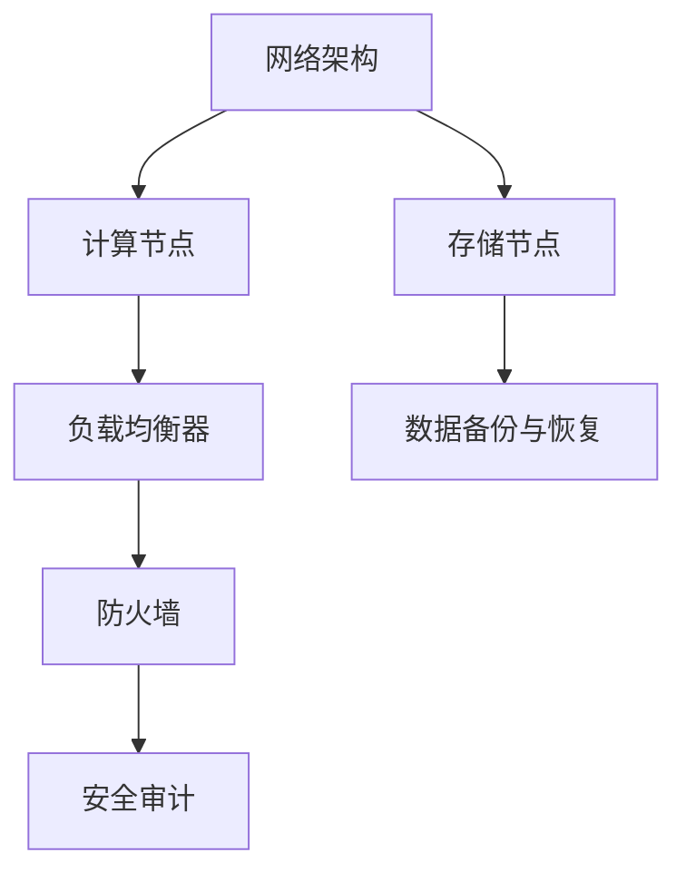
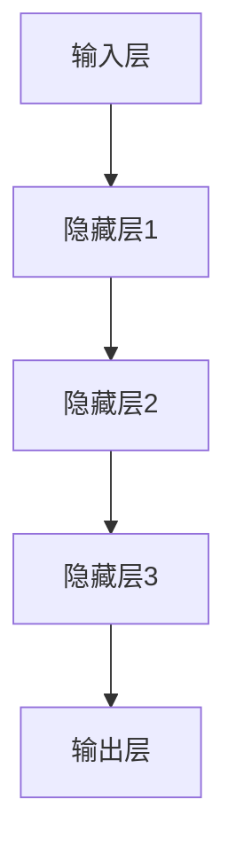

                 

关键词：AI大模型，数据中心，运维管理，架构设计，性能优化

摘要：本文从数据中心建设的角度，探讨了AI大模型应用数据中心的技术架构、运维管理、性能优化以及未来发展趋势。通过详细分析AI大模型的特性，阐述了数据中心建设中的关键环节和注意事项，为从事数据中心运维与管理工作的专业人士提供了有益的参考。

## 1. 背景介绍

随着人工智能技术的快速发展，AI大模型在各个行业得到了广泛应用。从语音识别、图像处理到自然语言理解，AI大模型展现出了强大的数据处理和分析能力。然而，AI大模型的运行需要大量计算资源和存储资源，这为数据中心的建设带来了新的挑战。

数据中心是现代企业计算的核心基础设施，其运维和管理水平直接影响到企业的业务连续性和数据安全性。在AI大模型应用场景下，数据中心需要具备更高的计算性能、更强的存储能力以及更稳定的网络环境。因此，如何建设一个满足AI大模型应用需求的数据中心，成为当前IT行业的一个重要课题。

## 2. 核心概念与联系

### 2.1 数据中心架构

数据中心架构是数据中心建设的基础，它包括网络架构、计算架构和存储架构。以下是一个简化的数据中心架构图（使用Mermaid绘制）：



### 2.2 AI大模型特性

AI大模型通常具有以下几个特点：

1. **大规模计算**：AI大模型在训练和推理过程中需要大量计算资源，这要求数据中心具备强大的计算能力。
2. **高存储需求**：AI大模型训练过程中产生的大量数据需要存储在数据中心，因此数据中心的存储容量也需要相应提高。
3. **低延迟要求**：AI大模型在实时应用场景下对延迟有较高要求，因此数据中心需要具备低延迟的网络环境。

## 3. 核心算法原理 & 具体操作步骤

### 3.1 算法原理概述

AI大模型的核心算法通常是基于深度学习的神经网络。神经网络通过多层神经元之间的连接，模拟人脑的思考过程，实现数据的学习和处理。以下是一个简化的神经网络结构图：



### 3.2 算法步骤详解

1. **数据预处理**：对输入数据进行清洗、归一化等处理，以便于神经网络的学习。
2. **模型构建**：根据任务需求构建神经网络模型，包括选择合适的网络结构、激活函数和优化器。
3. **模型训练**：使用训练数据对模型进行训练，通过反向传播算法不断调整模型参数，使模型输出结果与真实值越来越接近。
4. **模型评估**：使用测试数据对模型进行评估，判断模型是否达到预期效果。
5. **模型部署**：将训练好的模型部署到生产环境中，进行实时推理和应用。

### 3.3 算法优缺点

**优点**：

1. **强大的数据处理能力**：神经网络能够处理大规模、复杂的数据，适应各种应用场景。
2. **自适应性**：神经网络能够通过学习不断优化模型，提高模型的准确性和鲁棒性。

**缺点**：

1. **计算资源消耗大**：神经网络训练和推理过程需要大量计算资源和存储资源。
2. **数据需求高**：神经网络需要大量数据进行训练，对数据质量和数量有较高要求。

### 3.4 算法应用领域

AI大模型在各个领域都有广泛应用，如：

1. **计算机视觉**：图像识别、物体检测、人脸识别等。
2. **自然语言处理**：文本分类、机器翻译、情感分析等。
3. **语音识别**：语音识别、语音合成等。

## 4. 数学模型和公式 & 详细讲解 & 举例说明

### 4.1 数学模型构建

神经网络的核心是多层感知机（MLP），其数学模型可以表示为：

$$
y = \sigma(W_n \cdot a_{n-1} + b_n)
$$

其中，$y$为输出层节点值，$\sigma$为激活函数，$W_n$为权重矩阵，$a_{n-1}$为输入层节点值，$b_n$为偏置。

### 4.2 公式推导过程

神经网络的推导过程主要涉及以下几个步骤：

1. **输入层到隐藏层**：
   $$
   a_n = \sigma(W_n \cdot a_{n-1} + b_n)
   $$
2. **隐藏层到输出层**：
   $$
   y = \sigma(W_n \cdot a_n + b_n)
   $$
3. **反向传播**：
   $$
   \delta_n = (y - \hat{y}) \cdot \sigma'(W_n \cdot a_n + b_n)
   $$
   $$
   \delta_{n-1} = \delta_n \cdot W_n^T \cdot \sigma'(W_{n-1} \cdot a_{n-1} + b_{n-1})
   $$

### 4.3 案例分析与讲解

以一个简单的二分类问题为例，假设我们有以下训练数据：

$$
\begin{aligned}
&x_1 = (1, 0), y_1 = 1 \\
&x_2 = (0, 1), y_2 = 0 \\
\end{aligned}
$$

构建一个两层神经网络，隐藏层激活函数为$\sigma(x) = \frac{1}{1 + e^x}$，输出层激活函数为$\sigma(x) = x$。

1. **初始化参数**：
   $$
   W_1 = \begin{pmatrix}
   w_{11} & w_{12} \\
   w_{21} & w_{22} \\
   \end{pmatrix}, W_2 = \begin{pmatrix}
   w_{11} & w_{12} \\
   w_{21} & w_{22} \\
   \end{pmatrix}
   $$

2. **前向传播**：
   $$
   a_1 = \sigma(W_1 \cdot x) = \begin{pmatrix}
   \frac{1}{1 + e^{w_{11} + w_{12}}} & \frac{1}{1 + e^{w_{21} + w_{22}}} \\
   \end{pmatrix}
   $$
   $$
   y = \sigma(W_2 \cdot a_1) = \begin{pmatrix}
   w_{11} \cdot a_{11} + w_{12} \cdot a_{12} + b_1 & w_{21} \cdot a_{11} + w_{22} \cdot a_{12} + b_2 \\
   \end{pmatrix}
   $$

3. **反向传播**：
   $$
   \delta_2 = (y - \hat{y}) \cdot (1 - y)
   $$
   $$
   \delta_1 = \delta_2 \cdot W_2^T \cdot (1 - \sigma'(W_1 \cdot x))
   $$

4. **更新参数**：
   $$
   W_1 \leftarrow W_1 - \alpha \cdot \delta_1 \cdot x^T
   $$
   $$
   W_2 \leftarrow W_2 - \alpha \cdot \delta_2 \cdot a_1^T
   $$

## 5. 项目实践：代码实例和详细解释说明

### 5.1 开发环境搭建

1. 安装Python环境（版本3.6及以上）。
2. 安装TensorFlow库（版本2.0及以上）。

### 5.2 源代码详细实现

```python
import tensorflow as tf
import numpy as np

# 初始化参数
W1 = tf.Variable(np.random.randn(2, 2), dtype=tf.float32)
W2 = tf.Variable(np.random.randn(2, 2), dtype=tf.float32)

# 定义激活函数
sigma = lambda x: 1 / (1 + tf.exp(-x))

# 定义前向传播
a1 = sigma(tf.matmul(x, W1))
y = sigma(tf.matmul(a1, W2))

# 定义损失函数
loss = tf.reduce_mean(tf.square(y - y_))

# 定义反向传播
train_op = tf.train.GradientDescentOptimizer(learning_rate=0.1).minimize(loss)

# 训练模型
with tf.Session() as sess:
  sess.run(tf.global_variables_initializer())
  for i in range(1000):
    sess.run(train_op, feed_dict={x: x_, y_: y_})
    if i % 100 == 0:
      print("Step:", i, "Loss:", loss.eval(feed_dict={x: x_, y_: y_}))

# 模型评估
print("Model Accuracy:", loss.eval(feed_dict={x: x_, y_: y_}))
```

### 5.3 代码解读与分析

以上代码实现了一个简单的两层神经网络，用于解决二分类问题。代码主要分为以下几个部分：

1. **初始化参数**：随机初始化权重和偏置。
2. **定义激活函数**：使用sigmoid函数作为激活函数。
3. **定义前向传播**：实现输入层到隐藏层、隐藏层到输出层的前向传播。
4. **定义损失函数**：使用均方误差作为损失函数。
5. **定义反向传播**：使用梯度下降优化器进行反向传播。
6. **训练模型**：通过循环迭代训练模型。
7. **模型评估**：评估模型的准确率。

## 6. 实际应用场景

AI大模型在数据中心的应用场景广泛，如：

1. **智能监控**：使用AI大模型进行图像识别，实现数据中心的智能监控，提高安全性和效率。
2. **性能优化**：通过AI大模型分析数据中心性能数据，实现智能性能优化。
3. **能耗管理**：使用AI大模型预测数据中心的能耗，实现智能能耗管理，降低运行成本。

## 7. 工具和资源推荐

### 7.1 学习资源推荐

1. **《深度学习》**：Goodfellow, Bengio, Courville著，深入浅出地介绍了深度学习的理论基础和实践技巧。
2. **《TensorFlow实战》**：T providoe, Fowlers著，详细介绍了TensorFlow的使用方法和实践案例。

### 7.2 开发工具推荐

1. **Jupyter Notebook**：用于编写和运行Python代码，支持交互式计算和可视化。
2. **TensorBoard**：TensorFlow的可视化工具，用于分析模型结构和训练过程。

### 7.3 相关论文推荐

1. **“Deep Learning”**：Goodfellow, Bengio, Courville著，全面介绍了深度学习的理论和应用。
2. **“TensorFlow: Large-scale Machine Learning on Heterogeneous Systems”**：Abadi et al.著，详细介绍了TensorFlow的架构和实现。

## 8. 总结：未来发展趋势与挑战

### 8.1 研究成果总结

AI大模型在数据中心的应用取得了显著成果，如智能监控、性能优化和能耗管理等。同时，深度学习技术的不断发展也为数据中心建设提供了新的思路和工具。

### 8.2 未来发展趋势

1. **模型压缩与加速**：通过模型压缩和硬件加速，提高AI大模型的运行效率。
2. **分布式训练与推理**：实现分布式训练和推理，提高数据中心的计算能力。
3. **自动化运维与管理**：利用AI大模型实现数据中心的自动化运维和管理。

### 8.3 面临的挑战

1. **计算资源需求**：随着AI大模型规模的增大，对计算资源的需求将不断增加。
2. **数据安全与隐私**：数据中心需要确保数据的安全性和用户隐私。
3. **跨行业融合**：实现AI大模型与其他行业的深度融合，推动社会进步。

### 8.4 研究展望

未来，AI大模型在数据中心的应用将不断深入，为数据中心的建设和管理提供更加智能、高效、安全的技术手段。同时，深度学习技术的发展也将为数据中心建设带来更多的创新和突破。

## 9. 附录：常见问题与解答

### 9.1 如何选择合适的AI大模型？

1. 根据应用场景选择合适的神经网络结构。
2. 考虑模型的计算资源和存储需求。
3. 根据数据质量和数据量选择合适的模型。

### 9.2 数据中心如何保证数据安全？

1. 采用数据加密技术，确保数据在传输和存储过程中的安全性。
2. 建立严格的权限管理机制，控制对数据的访问。
3. 定期进行安全审计和漏洞扫描，确保数据中心的网络安全。

### 9.3 数据中心如何进行性能优化？

1. 优化网络架构，提高数据传输速度。
2. 实施负载均衡，避免单点故障。
3. 定期进行性能监控和调优，确保数据中心的高性能。

作者：禅与计算机程序设计艺术 / Zen and the Art of Computer Programming
```

