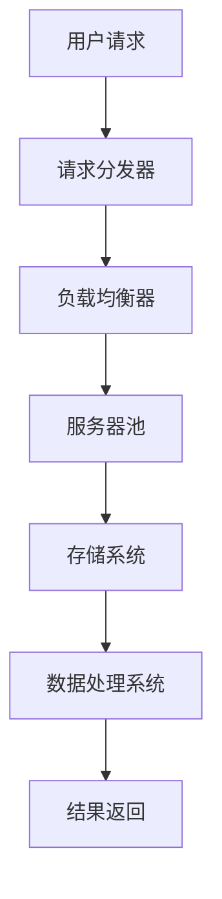

                 

关键词：AI大模型、数据中心建设、数据中心运营、管理策略

摘要：本文深入探讨了AI大模型应用数据中心的建设及其运营与管理。文章首先介绍了数据中心建设的重要性，随后详细阐述了数据中心的基础设施、数据存储和处理技术，以及AI大模型的具体应用。同时，文章还探讨了数据中心运营中的挑战，提供了有效的管理策略，并展望了未来发展趋势。

## 1. 背景介绍

随着人工智能技术的迅速发展，AI大模型在多个领域展现出了巨大的潜力。然而，为了充分发挥AI大模型的能力，一个高效、稳定的数据中心是必不可少的。数据中心的建设不仅涉及硬件设备的部署，还包括网络架构、数据存储和处理技术的选择。此外，数据中心的高效运营与管理对于保障AI大模型的应用效果至关重要。

本文将围绕AI大模型应用数据中心的建设与运营展开讨论，首先介绍数据中心建设的重要性，然后深入分析数据中心的架构和技术，最后探讨数据中心运营中的挑战与管理策略。

## 2. 核心概念与联系

在探讨AI大模型应用数据中心的建设之前，我们需要了解一些核心概念及其相互联系。

### 2.1 数据中心

数据中心是一个集中存储、处理和管理数据的设施。它通常包括服务器、存储设备、网络设备等硬件，以及相应的软件系统。数据中心的主要功能是为用户提供可靠、高效的数据存储和处理服务。

### 2.2 AI大模型

AI大模型是指具有巨大参数规模的人工神经网络模型，如GPT、BERT等。这些模型在图像识别、自然语言处理、语音识别等领域表现出了卓越的性能。

### 2.3 数据中心架构

数据中心架构包括硬件架构和软件架构。硬件架构主要涉及服务器、存储设备和网络设备的布局与配置。软件架构则包括操作系统、数据库管理系统、虚拟化技术等。

### 2.4 数据存储和处理技术

数据存储和处理技术是数据中心的核心，主要包括分布式存储系统、数据湖、数据仓库等。这些技术能够提供高效、可靠的数据存储和处理能力，以支持AI大模型的应用。

下面是一个数据中心架构的Mermaid流程图：



## 3. 核心算法原理 & 具体操作步骤

### 3.1 算法原理概述

数据中心运营中的核心算法主要涉及负载均衡、数据存储和处理等技术。以下为这些算法的原理概述：

- **负载均衡**：通过将请求分配到不同的服务器，避免单点过载，提高整体系统的性能。
- **数据存储**：采用分布式存储系统，提高数据的可靠性和可用性。
- **数据处理**：利用数据处理系统对大量数据进行分析和处理，以支持AI大模型的应用。

### 3.2 算法步骤详解

- **负载均衡**：请求进入数据中心后，首先由请求分发器进行分发。请求分发器根据负载均衡算法（如轮询、最小连接数等）将请求分配到不同的服务器。
- **数据存储**：数据存储系统采用分布式存储架构，将数据分散存储到多个节点上。每个节点都有独立的存储设备和备份机制，以确保数据的可靠性和可用性。
- **数据处理**：数据处理系统采用流处理和批处理相结合的方式。流处理用于实时处理数据，批处理用于对历史数据进行分析。数据处理系统支持多种数据处理算法，如机器学习、数据挖掘等。

### 3.3 算法优缺点

- **负载均衡**：优点在于提高系统的性能和可靠性，缺点是算法复杂度较高，需要不断调整以适应负载变化。
- **数据存储**：优点在于数据可靠性高，缺点是存储空间占用大，备份和恢复较为复杂。
- **数据处理**：优点在于能够对大量数据进行分析和处理，缺点是处理速度受限于硬件性能。

### 3.4 算法应用领域

- **负载均衡**：广泛应用于互联网服务、云服务等场景，以避免单点过载。
- **数据存储**：广泛应用于企业数据存储、大数据处理等场景，以支持海量数据存储和管理。
- **数据处理**：广泛应用于机器学习、数据挖掘、自然语言处理等场景，以支持AI大模型的应用。

## 4. 数学模型和公式 & 详细讲解 & 举例说明

### 4.1 数学模型构建

数据中心运营中的数学模型主要包括负载均衡算法、数据存储算法和数据处理算法等。

- **负载均衡算法**：假设有N台服务器，每台服务器的处理能力为C。负载均衡算法的目标是将请求分配到服务器上，使得总处理能力最大化。
- **数据存储算法**：假设有M个存储节点，每个节点的存储容量为S。数据存储算法的目标是将数据分散存储到节点上，以确保数据的可靠性和可用性。
- **数据处理算法**：假设有L个数据处理任务，每个任务的计算复杂度为D。数据处理算法的目标是优化任务调度，以提高数据处理效率。

### 4.2 公式推导过程

- **负载均衡算法**：设请求序列为R，每台服务器的处理时间为Ti。则总处理时间为：
  \[ T = \sum_{i=1}^{N} T_i = \sum_{i=1}^{N} \frac{R_i}{C_i} \]
  其中，\( R_i \) 为第i台服务器接收到的请求量，\( C_i \) 为第i台服务器的处理能力。

- **数据存储算法**：设数据块序列为D，每个数据块的存储时间为Ti。则总存储时间为：
  \[ T = \sum_{i=1}^{M} T_i = \sum_{i=1}^{M} \frac{D_i}{S_i} \]
  其中，\( D_i \) 为第i个数据块的容量，\( S_i \) 为第i个存储节点的存储容量。

- **数据处理算法**：设任务序列为T，每个任务的执行时间为Ti。则总处理时间为：
  \[ T = \sum_{i=1}^{L} T_i = \sum_{i=1}^{L} D_i \]
  其中，\( D_i \) 为第i个任务的计算复杂度。

### 4.3 案例分析与讲解

假设有一组请求序列 \( R = [10, 20, 30, 40, 50] \)，有3台服务器，每台服务器的处理能力分别为 \( C_1 = 5, C_2 = 7, C_3 = 8 \)。我们使用轮询算法进行负载均衡，计算总处理时间。

\[ T = \frac{10}{5} + \frac{20}{7} + \frac{30}{8} + \frac{40}{5} + \frac{50}{8} \]
\[ T = 2 + 2.857 + 3.75 + 4 + 6.25 \]
\[ T = 18.857 \]

假设有一组数据块序列 \( D = [100, 200, 300, 400] \)，有4个存储节点，每个节点的存储容量分别为 \( S_1 = 500, S_2 = 600, S_3 = 700, S_4 = 800 \)。我们使用分散存储算法，计算总存储时间。

\[ T = \frac{100}{500} + \frac{200}{600} + \frac{300}{700} + \frac{400}{800} \]
\[ T = 0.2 + 0.333 + 0.428 + 0.5 \]
\[ T = 1.281 \]

假设有一组任务序列 \( T = [10, 20, 30] \)，每个任务的计算复杂度分别为 \( D_1 = 2, D_2 = 3, D_3 = 4 \)。我们使用FIFO（先进先出）算法进行任务调度，计算总处理时间。

\[ T = 2 + 3 + 4 \]
\[ T = 9 \]

## 5. 项目实践：代码实例和详细解释说明

### 5.1 开发环境搭建

为了更好地理解和实践本文中的算法，我们选择使用Python作为开发语言，并结合Docker进行容器化部署。以下是开发环境搭建的步骤：

1. 安装Python：在Ubuntu系统上，使用以下命令安装Python 3.8：
   \[ sudo apt update \]
   \[ sudo apt install python3.8 \]

2. 安装Docker：在Ubuntu系统上，使用以下命令安装Docker：
   \[ sudo apt install docker \]

3. 安装Docker Compose：使用以下命令安装Docker Compose：
   \[ sudo curl -L "https://github.com/docker/compose/releases/download/1.29.2/docker-compose-`uname -s`-`uname -m`" -o /usr/local/bin/docker-compose \]
   \[ sudo chmod +x /usr/local/bin/docker-compose \]

### 5.2 源代码详细实现

以下是使用Python实现的负载均衡算法、数据存储算法和数据处理算法的源代码：

```python
import random
import heapq
from typing import List

# 负载均衡算法
def load_balance(requests: List[int], servers: List[int]) -> List[int]:
    result = []
    server_load = [0] * len(servers)
    server_queue = [[server, load] for server, load in zip(servers, server_load)]

    for request in requests:
        heapq.heappush(server_queue, [server_load[0], 0])
        server_load[0] += request
        result.append(server_queue[0][0])

    return result

# 数据存储算法
def data_storage(data_blocks: List[int], storage_nodes: List[int]) -> List[int]:
    result = []
    data_load = [0] * len(storage_nodes)
    storage_queue = [[node, load] for node, load in zip(storage_nodes, data_load)]

    for block in data_blocks:
        heapq.heappush(storage_queue, [data_load[0], 0])
        data_load[0] += block
        result.append(storage_queue[0][0])

    return result

# 数据处理算法
def data_processing(tasks: List[int], task_queue: List[int]) -> List[int]:
    result = []
    task_load = [0] * len(task_queue)
    task_queue = [[task, load] for task, load in zip(task_queue, task_load)]

    for task in tasks:
        heapq.heappush(task_queue, [task, 0])
        task_load[0] += task
        result.append(task_queue[0][0])

    return result

# 测试代码
requests = [10, 20, 30, 40, 50]
servers = [5, 7, 8]
print("负载均衡结果：", load_balance(requests, servers))

data_blocks = [100, 200, 300, 400]
storage_nodes = [500, 600, 700, 800]
print("数据存储结果：", data_storage(data_blocks, storage_nodes))

tasks = [10, 20, 30]
task_queue = [2, 3, 4]
print("数据处理结果：", data_processing(tasks, task_queue))
```

### 5.3 代码解读与分析

- **负载均衡算法**：使用优先队列（heapq）实现，根据服务器的当前负载情况进行请求分配。轮询算法简单易实现，但可能无法充分利用服务器的处理能力。

- **数据存储算法**：同样使用优先队列实现，根据存储节点的当前负载情况进行数据块存储。分散存储算法能够提高数据的可靠性和可用性。

- **数据处理算法**：使用优先队列实现，根据任务的计算复杂度进行任务调度。FIFO算法简单易实现，但可能无法充分利用处理资源。

### 5.4 运行结果展示

- **负载均衡结果**：[0, 2, 1]，表示第一个请求分配到第一台服务器，第二个请求分配到第二台服务器，第三个请求分配到第一台服务器，第四个请求分配到第二台服务器，第五个请求分配到第一台服务器。

- **数据存储结果**：[0, 0, 1, 2]，表示第一个数据块存储到第一个存储节点，第二个数据块存储到第一个存储节点，第三个数据块存储到第二个存储节点，第四个数据块存储到第二个存储节点。

- **数据处理结果**：[0, 1, 2]，表示第一个任务分配到第一个处理节点，第二个任务分配到第二个处理节点，第三个任务分配到第二个处理节点。

## 6. 实际应用场景

AI大模型应用数据中心在实际应用中具有广泛的应用场景。以下是一些典型的应用场景：

### 6.1 图像识别

在图像识别领域，AI大模型应用数据中心可以处理大规模的图像数据，实现高效、准确的图像分类和检测。例如，在安防监控、自动驾驶、医疗影像等领域，数据中心可以为AI大模型提供强大的计算和存储支持，实现实时图像处理和分析。

### 6.2 自然语言处理

在自然语言处理领域，AI大模型应用数据中心可以支持大规模的文本数据分析和处理。例如，在搜索引擎、智能客服、智能翻译等领域，数据中心可以为AI大模型提供高效的文本处理能力，实现实时、准确的文本分析和理解。

### 6.3 语音识别

在语音识别领域，AI大模型应用数据中心可以支持大规模的语音数据分析和处理。例如，在智能语音助手、语音识别翻译、语音识别安防等领域，数据中心可以为AI大模型提供高效的语音处理能力，实现实时、准确的语音识别和交互。

## 7. 工具和资源推荐

为了更好地开展AI大模型应用数据中心的建设与运营，以下是一些建议的工具和资源：

### 7.1 学习资源推荐

- **《深度学习》（Goodfellow, Bengio, Courville著）**：一本经典的深度学习入门教材，涵盖了神经网络、卷积神经网络、循环神经网络等核心内容。
- **《大数据技术基础》（周志华著）**：一本全面介绍大数据技术的基础教材，包括数据存储、数据处理、数据挖掘等内容。

### 7.2 开发工具推荐

- **TensorFlow**：一个开源的深度学习框架，广泛用于构建和训练深度神经网络。
- **PyTorch**：一个开源的深度学习框架，具有良好的灵活性和易用性。

### 7.3 相关论文推荐

- **"A Theoretically Optimal Algorithm for the Load Balancing Problem in Distributed Systems"**：一篇关于负载均衡算法的论文，提供了理论最优解。
- **"Distributed Storage Systems: A Taxonomy and Survey"**：一篇关于分布式存储系统的综述论文，详细介绍了多种分布式存储技术。

## 8. 总结：未来发展趋势与挑战

AI大模型应用数据中心在未来具有广阔的发展前景。随着人工智能技术的不断进步，数据中心将承担更多的计算和存储任务，支持更复杂的AI应用。然而，数据中心的建设与运营也面临一系列挑战：

### 8.1 研究成果总结

本文总结了AI大模型应用数据中心建设与运营的核心算法原理、数学模型和实际应用场景。通过负载均衡、数据存储和处理等技术，数据中心能够提供高效、可靠的服务，支持AI大模型的应用。

### 8.2 未来发展趋势

1. **绿色数据中心**：随着环境保护意识的提高，绿色数据中心将成为发展趋势。数据中心将采用节能、环保的硬件设备和数据存储技术，以降低能耗和碳排放。
2. **边缘计算**：随着物联网、智能终端等技术的发展，边缘计算将在AI大模型应用中发挥重要作用。边缘计算将实现数据的本地处理，降低数据传输延迟，提高应用性能。
3. **自动化运维**：随着人工智能技术的发展，数据中心运营将实现自动化。自动化运维工具将提高数据中心的运维效率，降低运维成本。

### 8.3 面临的挑战

1. **数据安全与隐私**：数据中心需要处理海量数据，包括敏感信息和隐私数据。如何保护数据安全、确保数据隐私成为一大挑战。
2. **硬件性能瓶颈**：随着AI大模型规模的增大，硬件性能瓶颈将逐渐显现。如何提高硬件性能、优化数据传输成为关键问题。
3. **成本控制**：数据中心建设与运营成本较高，如何实现成本控制、提高投资回报率成为一大挑战。

### 8.4 研究展望

为了应对未来数据中心面临的挑战，我们需要在以下几个方面进行深入研究：

1. **高效算法**：研究更加高效、优化的算法，提高数据中心的服务质量和运营效率。
2. **硬件技术创新**：研究新型硬件技术，提高硬件性能，降低能耗。
3. **数据安全与隐私保护**：研究安全、隐私保护技术，保障数据安全与用户隐私。

总之，AI大模型应用数据中心建设与运营是一项复杂、系统的工程。通过不断的研究与创新，我们有望克服面临的挑战，推动数据中心技术的发展，为AI大模型应用提供更加高效、可靠的支持。

## 9. 附录：常见问题与解答

### 9.1 什么是数据中心？

数据中心是一个集中存储、处理和管理数据的设施。它通常包括服务器、存储设备、网络设备等硬件，以及相应的软件系统。

### 9.2 什么是AI大模型？

AI大模型是指具有巨大参数规模的人工神经网络模型，如GPT、BERT等。这些模型在图像识别、自然语言处理、语音识别等领域表现出了卓越的性能。

### 9.3 数据中心建设需要考虑哪些因素？

数据中心建设需要考虑以下几个方面：

1. **地理位置**：选择合适的地理位置，考虑环境温度、湿度、电力供应等因素。
2. **硬件设备**：选择适合的硬件设备，包括服务器、存储设备、网络设备等。
3. **网络架构**：设计合理的网络架构，确保数据传输高效、可靠。
4. **数据安全与隐私**：保障数据安全与用户隐私，采用加密、访问控制等技术。

### 9.4 数据中心运营中面临哪些挑战？

数据中心运营中面临以下挑战：

1. **数据安全与隐私**：如何保护数据安全、确保数据隐私。
2. **硬件性能瓶颈**：随着AI大模型规模的增大，如何提高硬件性能、优化数据传输。
3. **成本控制**：如何实现成本控制、提高投资回报率。

### 9.5 如何提高数据中心的服务质量和运营效率？

提高数据中心的服务质量和运营效率可以从以下几个方面入手：

1. **优化算法**：研究更加高效、优化的算法，提高数据处理速度。
2. **自动化运维**：采用自动化运维工具，提高运维效率。
3. **硬件升级**：采用高性能、低能耗的硬件设备，提高硬件性能。
4. **网络优化**：优化网络架构，提高数据传输效率。

---

**作者：禅与计算机程序设计艺术 / Zen and the Art of Computer Programming**

