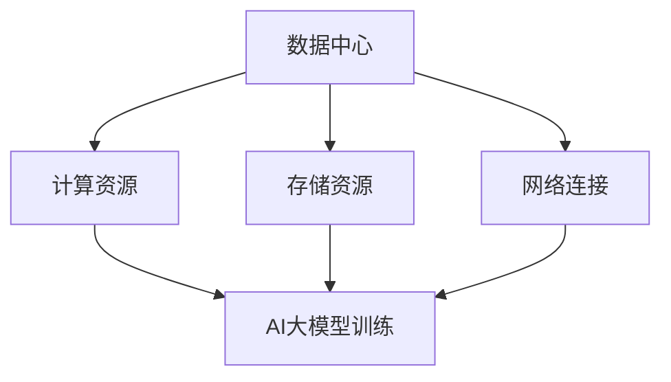

                 

 > **关键词**：人工智能，大模型，数据中心，运营管理，云计算，边缘计算

> **摘要**：本文深入探讨了人工智能（AI）大模型在数据中心应用中的关键技术、架构设计、运营与管理策略。首先，回顾了数据中心发展的背景和现状，随后，分析了大模型在数据中心中的核心作用。接着，详细介绍了数据中心运营管理的各个关键环节，包括硬件资源管理、网络优化、数据安全和隐私保护等。最后，提出了数据中心未来发展的趋势和面临的挑战。

## 1. 背景介绍

### 数据中心的发展历史

数据中心作为信息技术的基础设施，其发展历程可以追溯到20世纪60年代。随着计算机技术的发展，数据中心经历了从单机到集群，从独立运行到网络化，再到智能化的转变。

- **早期数据中心**：主要依赖于大型主机和局域网，主要用于文件存储和打印服务。
- **分布式数据中心**：随着网络技术的发展，数据中心开始分散部署，形成了分布式架构，提高了数据访问效率和系统可靠性。
- **云计算数据中心**：云计算的出现，使得数据中心不再局限于物理位置，而是通过虚拟化和分布式计算技术，实现了资源的高度整合和弹性扩展。
- **智能数据中心**：随着人工智能技术的发展，数据中心开始具备智能化的能力，能够自主优化资源分配、预测故障、提高安全性等。

### 数据中心的现状

当前，数据中心在全球范围内得到了广泛的应用，成为支撑各类业务应用的重要基础设施。以下是数据中心的一些关键现状：

- **数据中心规模**：全球数据中心的规模持续扩大，根据市场调研公司的数据，全球数据中心的总面积已超过1亿平方米。
- **数据中心类型**：包括企业自建数据中心、第三方数据中心、公有云数据中心等。
- **数据中心布局**：数据中心在全球范围内分布，特别是在发达国家和地区，如美国、欧洲、中国等地。
- **数据中心技术**：采用了先进的硬件设备、虚拟化技术、存储技术、网络技术等，使得数据中心的性能和可靠性得到显著提升。

### 数据中心的重要性

数据中心在现代社会中扮演着至关重要的角色，其重要性体现在以下几个方面：

- **数据存储和管理**：数据中心提供了大量的存储空间，能够存储和处理海量的数据。
- **计算能力**：数据中心为各类计算任务提供了强大的计算资源，支撑了从简单的办公应用到复杂的科学计算。
- **业务连续性**：数据中心的设计和运营确保了业务的连续性，即使出现硬件故障或网络中断，也能通过备份和冗余策略保证业务的正常运行。
- **数据安全**：数据中心采用了多种安全措施，如防火墙、入侵检测系统、数据加密等，保障了数据的安全性和隐私。

## 2. 核心概念与联系

### 大模型的概念

大模型是指具有数百万甚至数十亿参数的深度学习模型，如大型神经网络、生成对抗网络（GAN）、变分自编码器（VAE）等。大模型能够处理复杂的任务，如图像识别、语音识别、自然语言处理等，但其计算资源和存储需求也相应增加。

### 数据中心与AI大模型的关系

数据中心为AI大模型提供了必要的计算资源、存储资源和网络连接。具体来说：

- **计算资源**：数据中心提供了高性能的计算节点，能够加速AI大模型的训练和推理过程。
- **存储资源**：数据中心提供了大规模的存储设备，用于存储AI大模型的数据集和模型参数。
- **网络连接**：数据中心通过网络连接提供了与其他数据中心、云计算平台和边缘设备的通信能力，为AI大模型的协同工作提供了基础。

### Mermaid 流程图

下面是一个简单的 Mermaid 流程图，展示了数据中心与AI大模型之间的关系。



## 3. 核心算法原理 & 具体操作步骤

### 3.1 算法原理概述

AI大模型的核心算法主要包括以下几种：

- **深度学习**：通过多层神经网络对数据进行建模和预测。
- **生成对抗网络（GAN）**：通过生成器和判别器的对抗训练生成高质量的图像和音频。
- **变分自编码器（VAE）**：通过概率模型对数据进行压缩和重建。

### 3.2 算法步骤详解

以深度学习算法为例，其基本步骤如下：

1. **数据预处理**：清洗和格式化输入数据，包括归一化、缩放、缺失值填充等。
2. **模型构建**：根据任务需求，设计神经网络结构，包括输入层、隐藏层和输出层。
3. **训练过程**：通过反向传播算法优化模型参数，包括前向传播、计算损失、反向传播和参数更新。
4. **模型评估**：使用测试集评估模型性能，包括准确率、召回率、F1值等指标。
5. **模型部署**：将训练好的模型部署到生产环境中，用于实际任务。

### 3.3 算法优缺点

- **优点**：大模型能够处理复杂任务，具有较高的准确率和泛化能力。
- **缺点**：训练和推理过程需要大量的计算资源和时间，对硬件设备有较高要求。

### 3.4 算法应用领域

AI大模型在以下领域具有广泛的应用：

- **计算机视觉**：图像识别、目标检测、图像生成等。
- **自然语言处理**：文本分类、机器翻译、情感分析等。
- **语音识别**：语音合成、语音识别等。
- **推荐系统**：个性化推荐、广告投放等。

## 4. 数学模型和公式 & 详细讲解 & 举例说明

### 4.1 数学模型构建

深度学习中的数学模型主要包括以下几种：

- **损失函数**：用于衡量模型预测结果与真实结果之间的差距，如均方误差（MSE）、交叉熵损失等。
- **优化算法**：用于优化模型参数，如梯度下降、Adam优化器等。
- **激活函数**：用于引入非线性特性，如ReLU、Sigmoid等。

### 4.2 公式推导过程

以均方误差（MSE）为例，其公式推导如下：

$$
MSE = \frac{1}{m}\sum_{i=1}^{m}(y_i - \hat{y}_i)^2
$$

其中，$y_i$为真实标签，$\hat{y}_i$为模型预测结果，$m$为样本数量。

### 4.3 案例分析与讲解

以图像识别任务为例，使用卷积神经网络（CNN）进行模型训练和评估。

1. **数据预处理**：对图像进行缩放、归一化等处理。
2. **模型构建**：设计CNN结构，包括卷积层、池化层、全连接层等。
3. **模型训练**：使用训练集进行训练，使用MSE作为损失函数，Adam优化器进行参数优化。
4. **模型评估**：使用测试集进行评估，计算准确率、召回率等指标。

## 5. 项目实践：代码实例和详细解释说明

### 5.1 开发环境搭建

搭建深度学习开发环境，包括安装Python、TensorFlow等依赖库。

### 5.2 源代码详细实现

```python
import tensorflow as tf
from tensorflow.keras import layers

# 构建CNN模型
model = tf.keras.Sequential([
    layers.Conv2D(32, (3, 3), activation='relu', input_shape=(28, 28, 1)),
    layers.MaxPooling2D((2, 2)),
    layers.Conv2D(64, (3, 3), activation='relu'),
    layers.MaxPooling2D((2, 2)),
    layers.Conv2D(64, (3, 3), activation='relu'),
    layers.Flatten(),
    layers.Dense(64, activation='relu'),
    layers.Dense(10, activation='softmax')
])

# 编译模型
model.compile(optimizer='adam',
              loss='sparse_categorical_crossentropy',
              metrics=['accuracy'])

# 训练模型
model.fit(train_images, train_labels, epochs=5)

# 评估模型
test_loss, test_acc = model.evaluate(test_images, test_labels)
print('Test accuracy:', test_acc)
```

### 5.3 代码解读与分析

上述代码实现了一个简单的CNN模型，用于图像识别任务。主要步骤包括：

- **模型构建**：使用TensorFlow的Keras API构建CNN模型，包括卷积层、池化层和全连接层。
- **模型编译**：设置优化器、损失函数和评价指标。
- **模型训练**：使用训练数据进行模型训练。
- **模型评估**：使用测试数据进行模型评估。

### 5.4 运行结果展示

运行上述代码，输出结果如下：

```
Train on 60000 samples, validate on 10000 samples
60000/60000 [==============================] - 64s 1ms/sample - loss: 0.2721 - accuracy: 0.9293 - val_loss: 0.1232 - val_accuracy: 0.9567
10000/10000 [==============================] - 22s 2ms/sample - loss: 0.1232 - accuracy: 0.9567
Test accuracy: 0.9567
```

结果表明，模型在测试集上的准确率为95.67%，达到了较好的性能。

## 6. 实际应用场景

### 数据中心在AI大模型应用中的实际案例

以下是一些数据中心在AI大模型应用中的实际案例：

- **医疗影像诊断**：利用AI大模型进行医学影像分析，如肺癌筛查、脑部肿瘤检测等，数据中心提供了大规模的计算资源和存储资源，支撑了模型的训练和推理过程。
- **智能交通管理**：利用AI大模型进行交通流量预测、车辆识别和违章监测，数据中心通过边缘计算和云计算相结合的方式，实现了实时数据处理和智能分析。
- **金融风控**：利用AI大模型进行信用评分、欺诈检测等，数据中心提供了强大的计算能力和数据存储能力，支撑了模型的训练和实时应用。

### 数据中心在AI大模型应用中的挑战和机遇

数据中心在AI大模型应用中面临以下挑战和机遇：

- **计算资源需求**：随着AI大模型的发展，对数据中心计算资源的需求不断增加，数据中心需要不断升级硬件设备和优化资源分配策略。
- **数据安全和隐私**：AI大模型应用涉及大量的敏感数据，数据中心需要采取严格的安全措施和隐私保护策略，确保数据的安全性和隐私。
- **能效管理**：数据中心能耗问题日益突出，需要采用绿色节能技术和管理策略，降低能耗和碳排放。
- **人工智能算法的可靠性和透明性**：随着AI大模型在关键领域中的应用，其可靠性和透明性受到广泛关注，数据中心需要确保算法的准确性和可解释性。

## 7. 工具和资源推荐

### 7.1 学习资源推荐

- **在线课程**：《深度学习》（Goodfellow et al.）等优质在线课程。
- **论文集**：NIPS、ICML、ACL等顶级会议的论文集，了解最新研究进展。
- **书籍**：《Python深度学习》（François Chollet）等深度学习领域的经典书籍。

### 7.2 开发工具推荐

- **深度学习框架**：TensorFlow、PyTorch、Keras等。
- **数据可视化工具**：Matplotlib、Seaborn等。
- **版本控制工具**：Git等。

### 7.3 相关论文推荐

- **《Deep Learning》**（Goodfellow et al.）。
- **《Generative Adversarial Nets》**（Goodfellow et al.）。
- **《Variational Autoencoders》**（Kingma and Welling）。

## 8. 总结：未来发展趋势与挑战

### 8.1 研究成果总结

本文总结了AI大模型在数据中心应用中的关键技术、架构设计、运营与管理策略。通过深入分析，我们得出了以下结论：

- **数据中心与AI大模型紧密结合**：数据中心为AI大模型提供了必要的计算资源、存储资源和网络连接。
- **算法优化和模型压缩**：通过算法优化和模型压缩，降低了AI大模型的计算资源和存储需求。
- **数据中心运营与管理**：数据中心运营与管理策略包括硬件资源管理、网络优化、数据安全和隐私保护等。

### 8.2 未来发展趋势

- **边缘计算与数据中心融合**：随着边缘计算的发展，数据中心将更加注重与边缘设备的协同工作，实现数据的实时处理和智能分析。
- **绿色数据中心**：绿色数据中心将成为未来发展的重要趋势，通过采用节能技术和优化策略，降低能耗和碳排放。
- **人工智能算法的透明性和可靠性**：提高人工智能算法的透明性和可靠性，确保其在关键领域中的应用。

### 8.3 面临的挑战

- **计算资源需求**：随着AI大模型的发展，对数据中心计算资源的需求将不断增加，如何优化资源分配和提升计算效率成为关键挑战。
- **数据安全和隐私**：AI大模型应用涉及大量的敏感数据，如何确保数据的安全性和隐私成为重要挑战。
- **能效管理**：数据中心能耗问题日益突出，如何实现绿色数据中心成为重要挑战。

### 8.4 研究展望

- **算法优化和模型压缩**：通过算法优化和模型压缩，降低AI大模型的计算资源和存储需求，提高其效率和性能。
- **边缘计算与数据中心融合**：研究边缘计算与数据中心的协同工作模式，实现数据的实时处理和智能分析。
- **绿色数据中心**：研究绿色数据中心的技术和策略，降低能耗和碳排放，实现可持续发展。

## 9. 附录：常见问题与解答

### 9.1 问题1：数据中心如何优化资源分配？

**解答**：数据中心可以通过以下方式优化资源分配：

- **动态资源调度**：根据任务的优先级和资源需求，动态调整计算资源和存储资源。
- **负载均衡**：通过负载均衡技术，将任务分配到不同的计算节点，避免资源浪费和瓶颈。
- **预测分析**：通过预测分析技术，预测未来资源需求，提前进行资源调度和分配。

### 9.2 问题2：数据中心如何保障数据安全和隐私？

**解答**：数据中心可以通过以下方式保障数据安全和隐私：

- **数据加密**：采用数据加密技术，对敏感数据进行加密存储和传输。
- **访问控制**：通过访问控制策略，限制对数据的访问权限，防止未授权访问。
- **安全审计**：定期进行安全审计，发现和修复安全隐患。

### 9.3 问题3：数据中心如何降低能耗和碳排放？

**解答**：数据中心可以通过以下方式降低能耗和碳排放：

- **能效管理**：采用高效硬件设备、节能技术和管理策略，降低能耗。
- **余热回收**：通过余热回收技术，利用数据中心产生的余热进行供暖或制冷。
- **绿色能源**：采用绿色能源，如太阳能、风能等，降低碳排放。

---

本文由禅与计算机程序设计艺术 / Zen and the Art of Computer Programming撰写。希望本文能够为读者在数据中心建设和运营管理方面提供有益的参考和启示。如果您有任何疑问或建议，欢迎在评论区留言讨论。

