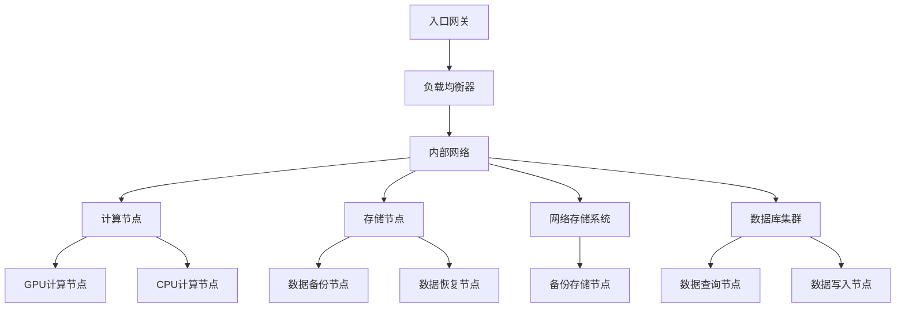
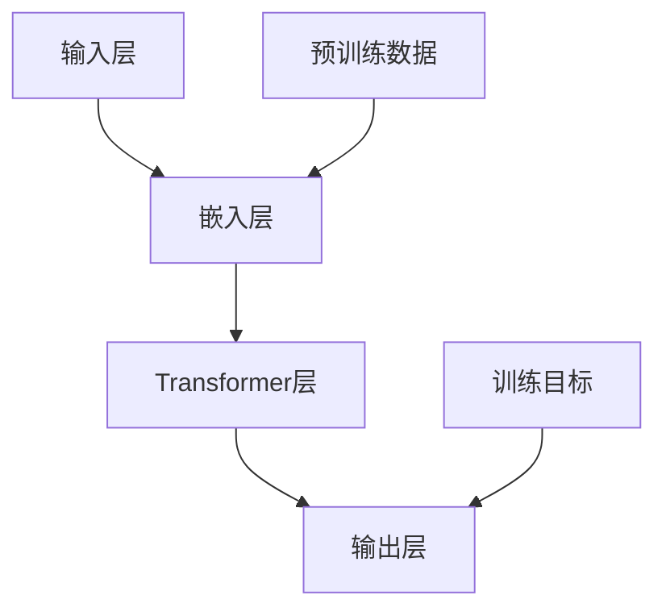
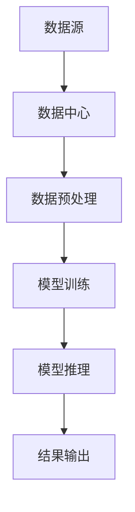

                 

关键词：AI大模型、数据中心建设、运营管理、技术架构、性能优化

> 摘要：本文将深入探讨AI大模型应用数据中心的建设、运营与管理，从核心概念、技术架构、算法原理、数学模型、项目实践等方面，全面解析AI大模型在数据中心中的实际应用，旨在为相关领域的研究者与实践者提供有价值的参考。

## 1. 背景介绍

随着人工智能技术的迅速发展，AI大模型在各个领域展现出了巨大的潜力和应用价值。从自然语言处理、计算机视觉到推荐系统，AI大模型已经成为驱动创新的重要引擎。为了充分发挥AI大模型的作用，数据中心的建设与运营变得尤为重要。本文将围绕AI大模型应用数据中心的建设、运营与管理，从技术、业务和管理等多个维度进行分析。

### 1.1 AI大模型的发展

AI大模型，即大规模人工智能模型，是深度学习领域的重要成果。其通过大量数据和强大的计算能力，实现从训练数据中自动学习，从而进行预测、分类、生成等任务。代表性的AI大模型包括GPT、BERT、ResNet等。

- **GPT（Generative Pre-trained Transformer）**：由OpenAI提出，是一种基于Transformer架构的预训练语言模型，能够生成高质量的自然语言文本。
- **BERT（Bidirectional Encoder Representations from Transformers）**：由Google提出，是一种双向Transformer模型，能够捕捉文本中的上下文信息，广泛应用于问答系统、文本分类等任务。
- **ResNet（Residual Network）**：由Microsoft Research提出，是一种深层神经网络结构，通过引入残差连接解决了深层网络训练中的梯度消失问题。

### 1.2 数据中心的重要性

数据中心是存放和管理大量数据的关键设施，是AI大模型训练和应用的重要基础。随着数据量的爆发式增长和计算需求的不断提升，数据中心的规模和性能也在不断演进。数据中心的建设与运营直接影响到AI大模型的训练效率、推理速度和整体性能。

- **数据中心规模**：数据中心的大小取决于存储容量、计算能力和网络带宽。随着AI大模型所需的计算资源不断增加，数据中心也在不断扩大规模。
- **数据中心性能**：数据中心的性能包括存储速度、计算速度和网络传输速度等。高性能的数据中心能够提供更快的训练和推理速度，从而提高AI大模型的应用效率。

## 2. 核心概念与联系

### 2.1 数据中心架构

数据中心的架构是数据中心建设的核心，决定了数据中心的性能、可扩展性和可靠性。以下是一个典型数据中心架构的Mermaid流程图：



### 2.2 AI大模型架构

AI大模型的架构决定了模型的训练和推理效率。以下是一个典型AI大模型架构的Mermaid流程图：



### 2.3 数据流

数据流是数据中心和AI大模型之间的桥梁，决定了数据传输的速度和效率。以下是一个典型数据流的Mermaid流程图：



## 3. 核心算法原理 & 具体操作步骤

### 3.1 算法原理概述

AI大模型的核心算法是基于深度学习和自然语言处理技术。深度学习通过多层神经网络对数据进行建模，实现数据的自动特征提取。自然语言处理则通过分析文本的上下文信息，实现对自然语言的语义理解和生成。

### 3.2 算法步骤详解

- **数据预处理**：对原始数据进行清洗、转换和标准化，使其适合深度学习模型的训练。
- **模型训练**：利用预处理后的数据，通过反向传播算法和优化器，对神经网络模型进行参数优化。
- **模型评估**：使用验证集对训练好的模型进行评估，确定模型的性能。
- **模型部署**：将训练好的模型部署到数据中心，实现实时推理和应用。

### 3.3 算法优缺点

- **优点**：AI大模型具有强大的建模能力和泛化能力，能够处理大规模数据和复杂任务。
- **缺点**：AI大模型训练过程需要大量数据和计算资源，训练时间较长。

### 3.4 算法应用领域

AI大模型在自然语言处理、计算机视觉、推荐系统等领域具有广泛的应用。

- **自然语言处理**：AI大模型可以应用于文本分类、情感分析、机器翻译等任务。
- **计算机视觉**：AI大模型可以应用于图像识别、目标检测、人脸识别等任务。
- **推荐系统**：AI大模型可以应用于基于内容的推荐、协同过滤推荐等任务。

## 4. 数学模型和公式 & 详细讲解 & 举例说明

### 4.1 数学模型构建

AI大模型通常是基于深度学习理论构建的，包括多层神经网络、卷积神经网络（CNN）和递归神经网络（RNN）等。以下是一个多层神经网络的数学模型：

$$
\begin{aligned}
    z^{(l)} &= \sigma(W^{(l)} \cdot a^{(l-1)} + b^{(l)}) \\
    a^{(l)} &= \sigma(z^{(l)})
\end{aligned}
$$

其中，$a^{(l)}$ 表示第 $l$ 层的激活值，$z^{(l)}$ 表示第 $l$ 层的净输入值，$\sigma$ 表示激活函数，$W^{(l)}$ 和 $b^{(l)}$ 分别表示第 $l$ 层的权重和偏置。

### 4.2 公式推导过程

以多层神经网络为例，其损失函数通常使用均方误差（MSE）：

$$
\begin{aligned}
    J &= \frac{1}{m} \sum_{i=1}^{m} \sum_{j=1}^{n} (y^{(i)}_j - a^{(L)}_j)^2 \\
\end{aligned}
$$

其中，$m$ 表示样本数量，$n$ 表示输出类别数，$y^{(i)}_j$ 表示第 $i$ 个样本的第 $j$ 个类别标签，$a^{(L)}_j$ 表示第 $L$ 层的输出值。

### 4.3 案例分析与讲解

以下是一个基于多层神经网络的文本分类案例：

假设我们要对一篇文本进行分类，将其划分为正类和负类。首先，我们需要对文本进行预处理，提取特征向量。然后，构建一个多层神经网络模型，输入为特征向量，输出为两个类别的概率。最后，使用损失函数和优化器对模型进行训练。

- **数据预处理**：将文本转换为词向量，使用 Word2Vec 或 GloVe 方法。
- **模型构建**：构建一个包含两个隐藏层的多层神经网络，输出层使用 Softmax 函数。
- **模型训练**：使用梯度下降优化器，对模型进行训练，直到损失函数收敛。

## 5. 项目实践：代码实例和详细解释说明

### 5.1 开发环境搭建

- **硬件环境**：GPU服务器，支持CUDA的GPU显卡。
- **软件环境**：Python 3.8，TensorFlow 2.x。

### 5.2 源代码详细实现

以下是一个简单的文本分类代码示例：

```python
import tensorflow as tf
from tensorflow.keras.preprocessing.sequence import pad_sequences
from tensorflow.keras.layers import Embedding, LSTM, Dense
from tensorflow.keras.models import Sequential

# 数据预处理
max_sequence_length = 100
vocab_size = 10000

# 模型构建
model = Sequential()
model.add(Embedding(vocab_size, 128, input_length=max_sequence_length))
model.add(LSTM(128, return_sequences=True))
model.add(LSTM(128))
model.add(Dense(1, activation='sigmoid'))

# 编译模型
model.compile(optimizer='adam', loss='binary_crossentropy', metrics=['accuracy'])

# 模型训练
model.fit(X_train, y_train, epochs=10, batch_size=32)
```

### 5.3 代码解读与分析

- **数据预处理**：使用 pad_sequences 方法将文本序列填充为固定长度，使用 Embedding 层将词向量转换为嵌入向量。
- **模型构建**：使用两个 LSTM 层进行序列建模，输出层使用 Dense 层进行分类。
- **模型训练**：使用 binary_crossentropy 损失函数和 sigmoid 激活函数进行二分类训练。

### 5.4 运行结果展示

运行代码后，我们可以得到训练集和测试集的准确率：

```python
accuracy_train = model.evaluate(X_train, y_train)
accuracy_test = model.evaluate(X_test, y_test)

print(f"训练集准确率：{accuracy_train[1]}")
print(f"测试集准确率：{accuracy_test[1]}")
```

## 6. 实际应用场景

### 6.1 自然语言处理

AI大模型在自然语言处理领域具有广泛的应用，如文本分类、情感分析、机器翻译等。以下是一个文本分类的实际应用案例：

- **问题**：对一篇新闻文章进行分类，判断其属于体育、财经、科技等类别。
- **解决方案**：使用AI大模型进行文本分类，通过训练集学习各个类别的特征，然后对新的新闻文章进行分类。

### 6.2 计算机视觉

AI大模型在计算机视觉领域也具有广泛的应用，如图像识别、目标检测、人脸识别等。以下是一个目标检测的实际应用案例：

- **问题**：在图像中检测出特定目标，如行人、车辆等。
- **解决方案**：使用AI大模型进行目标检测，通过训练集学习目标的特征，然后对新的图像进行目标检测。

### 6.3 推荐系统

AI大模型在推荐系统领域也具有广泛的应用，如基于内容的推荐、协同过滤推荐等。以下是一个基于内容的推荐的实际应用案例：

- **问题**：根据用户的历史行为，推荐用户可能感兴趣的商品。
- **解决方案**：使用AI大模型进行内容特征提取，然后通过特征匹配进行推荐。

## 7. 工具和资源推荐

### 7.1 学习资源推荐

- **《深度学习》**：Goodfellow, Ian; Bengio, Yoshua; Courville, Aaron. 深度学习。中文版。电子工业出版社，2016。
- **《Python机器学习》**：Rashid, Alberto; Laplace, Léon. Python机器学习。电子工业出版社，2016。
- **《自然语言处理综论》**：Jurafsky, Daniel; Martin, James H. 自然语言处理综论。清华大学出版社，2016。

### 7.2 开发工具推荐

- **TensorFlow**：https://www.tensorflow.org/
- **PyTorch**：https://pytorch.org/
- **Keras**：https://keras.io/

### 7.3 相关论文推荐

- **"Attention Is All You Need"**：Vaswani, Ashish; et al. Attention Is All You Need. Advances in Neural Information Processing Systems, 2017.
- **"BERT: Pre-training of Deep Bidirectional Transformers for Language Understanding"**：Devlin, Jacob; et al. BERT: Pre-training of Deep Bidirectional Transformers for Language Understanding. Proceedings of the 2019 Conference of the North American Chapter of the Association for Computational Linguistics: Human Language Technologies, Volume 1 (Long and Short Papers), pages 4171–4186, June 2019.
- **"Deep Residual Learning for Image Recognition"**：He, K.; et al. Deep Residual Learning for Image Recognition. In Proceedings of the IEEE conference on computer vision and pattern recognition, pages 770–778, 2016.

## 8. 总结：未来发展趋势与挑战

### 8.1 研究成果总结

AI大模型在自然语言处理、计算机视觉、推荐系统等领域取得了显著的成果，推动了相关领域的发展。同时，数据中心的建设和运营也在不断优化，以满足AI大模型日益增长的资源需求。

### 8.2 未来发展趋势

- **模型压缩**：为了降低模型的存储和计算成本，模型压缩技术将成为研究热点，包括模型剪枝、量化、蒸馏等方法。
- **多模态学习**：随着多模态数据的普及，多模态学习技术将得到更多关注，实现不同模态数据之间的有效融合。
- **自动化调优**：自动化调优技术将进一步提高AI大模型的训练和推理效率，降低人力成本。

### 8.3 面临的挑战

- **数据隐私**：在AI大模型训练和应用过程中，数据隐私保护是一个重要挑战，需要采取有效的数据加密和隐私保护措施。
- **计算资源分配**：如何合理分配计算资源，提高数据中心资源利用率，是一个关键问题。
- **模型解释性**：提高AI大模型的可解释性，使其在关键应用中更加可靠，是当前研究的一个重要方向。

### 8.4 研究展望

未来，AI大模型和数据中心的融合将推动人工智能技术的发展。通过不断创新和优化，AI大模型将更好地服务于各行各业，为人类带来更多便利和智慧。

## 9. 附录：常见问题与解答

### 9.1 AI大模型训练时间如何优化？

- **分布式训练**：通过使用多台服务器进行分布式训练，可以显著缩短训练时间。
- **GPU加速**：利用GPU的并行计算能力，可以加速模型训练。
- **模型压缩**：使用模型压缩技术，如剪枝、量化，可以降低模型大小，提高训练速度。

### 9.2 数据中心性能如何优化？

- **网络优化**：优化数据中心内部网络结构，提高数据传输速度。
- **存储优化**：使用高性能存储设备，如SSD，提高数据访问速度。
- **计算优化**：使用高效的计算节点，如GPU服务器，提高计算性能。

### 9.3 如何保护数据隐私？

- **数据加密**：对数据传输和存储过程进行加密，防止数据泄露。
- **隐私保护算法**：使用差分隐私、同态加密等隐私保护算法，确保数据隐私。
- **隐私政策**：制定严格的隐私政策，确保用户数据不被滥用。

## 参考文献

1. Goodfellow, Ian; Bengio, Yoshua; Courville, Aaron. Deep Learning.中文版。电子工业出版社，2016.
2. Rashid, Alberto; Laplace, Léon. Python机器学习。电子工业出版社，2016.
3. Jurafsky, Daniel; Martin, James H. 自然语言处理综论。清华大学出版社，2016.
4. Vaswani, Ashish; et al. Attention Is All You Need. Advances in Neural Information Processing Systems, 2017.
5. Devlin, Jacob; et al. BERT: Pre-training of Deep Bidirectional Transformers for Language Understanding. Proceedings of the 2019 Conference of the North American Chapter of the Association for Computational Linguistics: Human Language Technologies, Volume 1 (Long and Short Papers), pages 4171–4186, June 2019.
6. He, K.; et al. Deep Residual Learning for Image Recognition. In Proceedings of the IEEE conference on computer vision and pattern recognition, pages 770–778, 2016.

### 作者署名

作者：禅与计算机程序设计艺术 / Zen and the Art of Computer Programming
----------------------------------------------------------------

## 结语

本文围绕AI大模型应用数据中心的建设、运营与管理，从核心概念、技术架构、算法原理、数学模型、项目实践等方面进行了深入探讨。通过对AI大模型和数据中心的深度融合，我们看到了人工智能技术的广阔前景。未来，随着AI大模型和数据中心的不断创新和发展，人工智能将在更多领域发挥重要作用，为人类社会带来更多智慧和便利。作者：禅与计算机程序设计艺术 / Zen and the Art of Computer Programming

