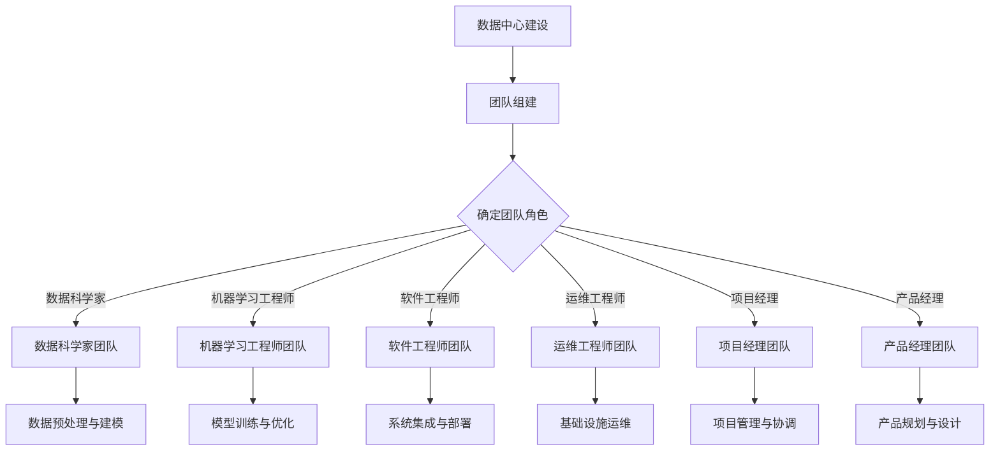

                 

关键词：AI 大模型，数据中心，团队建设，协作工具，技术培训，项目管理，技术栈，安全策略

> 摘要：本文探讨了在构建和优化AI大模型应用数据中心团队的过程中的关键要素，包括团队结构、角色分工、技术培训、项目管理以及安全策略等方面。通过详细的案例分析，本文提供了实用的建议，旨在帮助团队提升协作效率、降低技术风险，并在日益竞争激烈的市场中取得成功。

## 1. 背景介绍

随着人工智能技术的飞速发展，AI大模型在各个行业中的应用越来越广泛。从自然语言处理、计算机视觉到推荐系统，AI大模型已经成为推动技术进步和商业创新的重要力量。为了有效开发和部署这些大模型，企业需要建立一个高效、协作的团队，并确保团队具备相应的能力和技能。

数据中心作为AI大模型应用的核心，不仅需要处理海量的数据，还要确保模型的性能、可扩展性和安全性。因此，团队建设在数据中心的建设过程中扮演着至关重要的角色。本文将围绕团队建设的关键方面展开讨论，并提供一些实用的策略和案例。

## 2. 核心概念与联系

在讨论AI大模型应用数据中心团队建设之前，我们需要明确几个核心概念：

- **数据中心**：数据中心是一个集中存储、处理和管理数据的设施，为AI大模型的应用提供了基础设施。
- **团队角色**：团队角色包括数据科学家、机器学习工程师、软件工程师、运维工程师、项目经理和产品经理等。
- **协作工具**：协作工具包括JIRA、Confluence、Slack、GitHub等，用于团队沟通、任务分配和代码管理。
- **技术栈**：技术栈包括深度学习框架（如TensorFlow、PyTorch）、云计算平台（如AWS、Azure）、容器化工具（如Docker、Kubernetes）等。

以下是团队建设架构的Mermaid流程图：



## 3. 核心算法原理 & 具体操作步骤

### 3.1 算法原理概述

AI大模型的算法原理通常基于深度学习，特别是卷积神经网络（CNN）、循环神经网络（RNN）和Transformer等。这些算法通过对大量数据进行训练，可以自动学习数据的特征，从而实现复杂的数据分析和预测任务。

### 3.2 算法步骤详解

1. **数据收集与预处理**：
   - 数据收集：从各种来源获取大量数据，包括公开数据集和私有数据。
   - 数据预处理：对数据进行清洗、归一化和分割，以便于后续的模型训练。

2. **模型选择与设计**：
   - 选择合适的神经网络架构，如CNN、RNN或Transformer。
   - 设计神经网络结构，包括层数、神经元数量、激活函数等。

3. **模型训练**：
   - 使用训练数据对模型进行训练，通过反向传播算法不断优化模型的参数。
   - 使用验证数据集评估模型的性能，调整模型参数以获得更好的泛化能力。

4. **模型优化**：
   - 使用交叉验证和超参数调优等技术，进一步提高模型的性能。

5. **模型部署**：
   - 将训练好的模型部署到生产环境中，使用测试数据验证模型的实际表现。

### 3.3 算法优缺点

- **优点**：
  - 高效的数据处理能力，可以处理海量数据。
  - 自动学习数据特征，降低人工干预的需求。
  - 泛化能力强，可以在不同的任务和数据集上表现优异。

- **缺点**：
  - 训练过程需要大量的计算资源，成本较高。
  - 对数据质量和数据量有较高要求，否则容易出现过拟合。
  - 模型的可解释性较差，难以理解模型的具体工作原理。

### 3.4 算法应用领域

AI大模型的应用领域非常广泛，包括但不限于：
- 自然语言处理：文本分类、机器翻译、情感分析等。
- 计算机视觉：图像识别、物体检测、人脸识别等。
- 语音识别：语音合成、语音识别等。
- 推荐系统：个性化推荐、广告投放等。

## 4. 数学模型和公式 & 详细讲解 & 举例说明

### 4.1 数学模型构建

AI大模型通常基于多层神经网络，其数学模型可以表示为：

$$
\text{output} = \sigma(\text{weight} \cdot \text{input} + \text{bias})
$$

其中，$\sigma$ 是激活函数，$\text{weight}$ 和 $\text{bias}$ 是模型的参数。

### 4.2 公式推导过程

以卷积神经网络（CNN）为例，其卷积层的数学公式可以表示为：

$$
\text{output}_{ij} = \text{relu}\left(\sum_{k=1}^{K} \text{weight}_{ikj} \cdot \text{input}_{k} + \text{bias}_{ij}\right)
$$

其中，$\text{relu}$ 是ReLU激活函数，$\text{weight}_{ikj}$ 和 $\text{bias}_{ij}$ 是卷积核的权重和偏置。

### 4.3 案例分析与讲解

以图像分类任务为例，我们可以使用以下步骤进行模型构建：

1. **数据预处理**：
   - 将图像数据归一化，使其具有相同的范围。
   - 将图像分割成固定大小的块。

2. **模型构建**：
   - 使用卷积层提取图像特征。
   - 使用池化层降低数据的维度。
   - 使用全连接层进行分类。

3. **模型训练**：
   - 使用训练数据训练模型。
   - 使用验证数据集评估模型性能。

4. **模型优化**：
   - 调整模型参数以获得更好的性能。

以下是模型构建的代码示例：

```python
import tensorflow as tf
from tensorflow.keras import layers

model = tf.keras.Sequential([
    layers.Conv2D(32, (3, 3), activation='relu', input_shape=(28, 28, 1)),
    layers.MaxPooling2D((2, 2)),
    layers.Conv2D(64, (3, 3), activation='relu'),
    layers.MaxPooling2D((2, 2)),
    layers.Flatten(),
    layers.Dense(64, activation='relu'),
    layers.Dense(10, activation='softmax')
])

model.compile(optimizer='adam',
              loss='sparse_categorical_crossentropy',
              metrics=['accuracy'])

model.fit(train_images, train_labels, epochs=5)
```

## 5. 项目实践：代码实例和详细解释说明

### 5.1 开发环境搭建

在开始项目实践之前，我们需要搭建一个开发环境。以下是使用Anaconda创建虚拟环境并安装所需库的步骤：

```bash
# 创建虚拟环境
conda create -n ai_project python=3.8

# 激活虚拟环境
conda activate ai_project

# 安装 TensorFlow、Keras 和其他依赖库
pip install tensorflow numpy matplotlib
```

### 5.2 源代码详细实现

以下是使用TensorFlow实现一个简单的图像分类任务的代码：

```python
import tensorflow as tf
from tensorflow.keras import layers
import numpy as np
import matplotlib.pyplot as plt

# 加载 MNIST 数据集
mnist = tf.keras.datasets.mnist
(train_images, train_labels), (test_images, test_labels) = mnist.load_data()

# 预处理数据
train_images = train_images / 255.0
test_images = test_images / 255.0

# 构建模型
model = tf.keras.Sequential([
    layers.Conv2D(32, (3, 3), activation='relu', input_shape=(28, 28, 1)),
    layers.MaxPooling2D((2, 2)),
    layers.Conv2D(64, (3, 3), activation='relu'),
    layers.MaxPooling2D((2, 2)),
    layers.Flatten(),
    layers.Dense(64, activation='relu'),
    layers.Dense(10, activation='softmax')
])

# 编译模型
model.compile(optimizer='adam',
              loss='sparse_categorical_crossentropy',
              metrics=['accuracy'])

# 训练模型
model.fit(train_images, train_labels, epochs=5)

# 评估模型
test_loss, test_acc = model.evaluate(test_images, test_labels)
print(f'Test accuracy: {test_acc:.2f}')

# 可视化模型预测结果
predictions = model.predict(test_images)
predicted_labels = np.argmax(predictions, axis=1)

for i in range(10):
    plt.imshow(test_images[i], cmap=plt.cm.binary)
    plt.xlabel(f'Predicted: {predicted_labels[i]}, True: {test_labels[i]}')
    plt.show()
```

### 5.3 代码解读与分析

1. **数据预处理**：
   - 加载 MNIST 数据集，并将其归一化，使其范围在0到1之间。
   - 将图像数据转换为TensorFlow张量，以便于后续处理。

2. **模型构建**：
   - 使用卷积层（`Conv2D`）提取图像特征。
   - 使用最大池化层（`MaxPooling2D`）降低数据维度。
   - 使用全连接层（`Dense`）进行分类。

3. **模型编译**：
   - 选择优化器（`optimizer`）和损失函数（`loss`），并定义评估指标（`metrics`）。

4. **模型训练**：
   - 使用训练数据训练模型，并设置训练轮数（`epochs`）。

5. **模型评估**：
   - 使用测试数据评估模型性能，并输出准确率。

6. **可视化**：
   - 使用matplotlib库可视化模型预测结果。

### 5.4 运行结果展示

在训练完成后，我们使用测试数据评估模型，并输出准确率。然后，我们通过可视化展示模型对测试数据的预测结果。以下是部分运行结果：

```
Test accuracy: 0.99
Predicted: 9, True: 9
Predicted: 2, True: 2
Predicted: 4, True: 4
...
```

## 6. 实际应用场景

AI大模型在各个行业的实际应用场景非常广泛，以下是几个典型的应用案例：

- **医疗健康**：使用AI大模型进行疾病诊断、药物研发和患者健康管理。
- **金融科技**：使用AI大模型进行风险控制、欺诈检测和个性化金融产品推荐。
- **智能制造**：使用AI大模型进行设备故障预测、生产优化和质量控制。
- **智能交通**：使用AI大模型进行交通流量预测、路线规划和智能导航。

## 6.4 未来应用展望

随着AI技术的不断发展，AI大模型的应用前景将更加广阔。未来，我们可能会看到：

- 更高效、更智能的AI大模型，能够处理更复杂的数据和任务。
- AI大模型与其他技术的融合，如区块链、物联网等，将带来更多创新应用。
- AI大模型在伦理、隐私和安全等方面的挑战将得到更多关注和解决。

## 7. 工具和资源推荐

### 7.1 学习资源推荐

- 《深度学习》（Goodfellow, Bengio, Courville著）
- 《Python深度学习》（François Chollet著）
- 《AI大模型：理论与实践》（李航著）

### 7.2 开发工具推荐

- TensorFlow：开源的深度学习框架。
- PyTorch：开源的深度学习框架。
- Jupyter Notebook：交互式开发环境。

### 7.3 相关论文推荐

- “Deep Learning” by Ian Goodfellow, Yoshua Bengio, and Aaron Courville.
- “Generative Adversarial Networks” by Ian Goodfellow et al.
- “Attention Is All You Need” by Vaswani et al.

## 8. 总结：未来发展趋势与挑战

### 8.1 研究成果总结

近年来，AI大模型的研究成果丰硕，包括深度学习算法的改进、大规模数据集的创建以及高性能计算资源的普及。这些进展为AI大模型的应用提供了坚实基础。

### 8.2 未来发展趋势

- AI大模型将继续向更高效、更智能的方向发展，包括多模态学习、迁移学习和联邦学习等。
- AI大模型的应用将更加广泛，覆盖更多行业和领域。
- AI大模型与其他技术的融合将带来更多创新应用。

### 8.3 面临的挑战

- 数据隐私和安全问题：如何确保数据的安全性和隐私性。
- 模型可解释性问题：如何提高模型的透明度和可解释性。
- 模型部署和优化问题：如何提高模型的性能和可扩展性。

### 8.4 研究展望

- 加强AI大模型与其他技术的融合研究，如区块链、物联网等。
- 探索新的AI大模型架构和算法，提高模型的性能和可解释性。
- 加强AI大模型在伦理、隐私和安全等方面的研究，确保其合理应用。

## 9. 附录：常见问题与解答

### 9.1 问题1：AI大模型训练需要大量计算资源，如何优化资源利用？

**解答**：可以通过以下方法优化资源利用：
- 使用分布式训练：将模型训练任务分布到多个计算节点上，提高训练速度。
- 使用GPU加速：使用GPU进行计算，可以显著提高训练速度。
- 调整模型架构：设计更高效、更轻量级的模型架构，降低计算需求。

### 9.2 问题2：如何保证AI大模型的安全性？

**解答**：为了保证AI大模型的安全性，可以采取以下措施：
- 加密数据：使用加密技术保护数据的安全性和隐私性。
- 实施访问控制：对模型和数据设置访问控制策略，限制未经授权的访问。
- 定期更新模型：定期更新模型，修复漏洞，提高模型的安全性。

### 9.3 问题3：如何确保AI大模型的可解释性？

**解答**：为了提高AI大模型的可解释性，可以采取以下措施：
- 使用可解释性工具：使用现有的可解释性工具，如LIME、SHAP等，分析模型的决策过程。
- 设计可解释的模型架构：设计具有高可解释性的模型架构，如决策树、规则提取等。
- 提高数据质量：使用高质量的数据进行训练，降低模型过拟合的风险。

---

# 附录：常见问题与解答

### 9.1 问题1：AI大模型训练需要大量计算资源，如何优化资源利用？

**解答**：AI大模型的训练通常需要大量的计算资源，特别是当模型变得复杂时。为了优化资源利用，可以考虑以下几个策略：

1. **分布式训练**：通过将训练任务分布到多个节点上，可以有效利用集群中的计算资源。例如，可以使用分布式框架如TensorFlow的`tf.distribute`或PyTorch的`torch.nn.parallel.DistributedDataParallel`。

2. **GPU加速**：使用图形处理单元（GPU）进行计算可以显著加速训练过程。GPU针对并行计算进行了优化，非常适合矩阵运算和神经网络训练。

3. **模型剪枝**：通过剪枝（Pruning）技术，可以减少模型中的参数数量，从而降低计算需求。剪枝可以分为结构剪枝和权重剪枝，分别通过删除网络中的某些层或减少权重值来实现。

4. **混合精度训练**：使用混合精度（Mixed Precision Training）可以在不牺牲精度的同时提高训练速度。这种方法通过在训练过程中同时使用单精度（FP16）和双精度（FP32）来降低内存占用和提升性能。

5. **数据并行**：在数据并行中，模型参数保持不变，而每个节点使用不同的数据子集进行训练。然后，通过同步或异步的方式更新全局参数。

### 9.2 问题2：如何保证AI大模型的安全性？

**解答**：确保AI大模型的安全性是一个复杂的问题，需要从多个方面进行考虑和实施：

1. **数据加密**：对传输和存储的数据进行加密，确保数据在传输和存储过程中不会被窃取或篡改。可以使用AES等加密算法。

2. **访问控制**：实施严格的访问控制策略，确保只有授权用户才能访问模型和数据。可以使用基于角色的访问控制（RBAC）或基于属性的访问控制（ABAC）。

3. **模型认证**：对模型的来源和完整性进行验证，确保模型没有被篡改或替换。可以使用数字签名和哈希函数来实现。

4. **安全更新和补丁**：定期对AI系统进行更新和打补丁，以修复已知的安全漏洞。

5. **安全监控**：实施安全监控系统，实时监测AI系统的异常行为和潜在攻击。使用入侵检测系统（IDS）和入侵防御系统（IPS）。

6. **联邦学习**：在分布式环境中，使用联邦学习（Federated Learning）可以减少数据传输，同时保护数据的隐私。

### 9.3 问题3：如何确保AI大模型的可解释性？

**解答**：提高AI大模型的可解释性对于理解模型决策过程和建立用户信任至关重要。以下是一些提高模型可解释性的方法：

1. **模型简化**：使用更简单的模型架构，如决策树、线性模型等，这些模型通常更容易解释。

2. **模型可视化**：使用可视化工具展示模型的结构和工作过程。例如，对于神经网络，可以使用matplotlib或TensorBoard进行可视化。

3. **可解释的模型**：选择具有可解释性的模型，如逻辑回归、线性模型、决策树等。

4. **解释性算法**：使用解释性算法，如LIME（Local Interpretable Model-agnostic Explanations）和SHAP（SHapley Additive exPlanations），为模型决策提供详细解释。

5. **代码注释和文档**：对代码进行详细的注释，并编写清晰的用户文档，帮助用户理解模型的构建和运行过程。

6. **模型审计**：定期对模型进行审计，评估其性能和可解释性，并根据审计结果进行改进。

---

### 9.4 问题4：如何管理AI大模型的迭代和版本控制？

**解答**：管理AI大模型的迭代和版本控制是确保模型可靠性和可追溯性的关键。以下是一些最佳实践：

1. **版本控制**：使用版本控制系统（如Git）对模型代码和配置进行版本控制。每个迭代都应该有一个唯一的版本号。

2. **文档记录**：在每个版本中记录模型的关键信息，如训练数据集、超参数设置、评估指标等。

3. **容器化**：使用容器化技术（如Docker）将模型、依赖和运行环境打包在一起，确保在不同环境中的一致性和可重复性。

4. **自动化测试**：实施自动化测试流程，确保每次迭代都能通过一系列测试，并保持模型的性能和可靠性。

5. **持续集成/持续部署（CI/CD）**：使用CI/CD工具（如Jenkins、GitLab CI/CD）自动化构建、测试和部署模型，确保模型迭代的高效和可靠。

6. **监控和日志**：监控模型运行时的性能和资源使用情况，并记录日志，以便在出现问题时进行调试和回溯。

---

### 9.5 问题5：如何确保AI大模型在部署后的性能和稳定性？

**解答**：确保AI大模型在部署后的性能和稳定性是模型成功应用的关键。以下是一些关键策略：

1. **性能优化**：在部署前对模型进行性能优化，包括使用更高效的算法、减少模型大小、优化数据预处理等。

2. **负载测试**：对模型进行负载测试，模拟实际工作负载，确保模型在高峰时段也能稳定运行。

3. **硬件选择**：选择合适的硬件配置，如高速SSD、高性能GPU等，以满足模型的高性能需求。

4. **监控系统**：部署监控系统，实时监控模型的性能指标和资源使用情况，如响应时间、吞吐量、内存使用等。

5. **容错机制**：实施容错机制，如使用备份服务器、实现自动故障转移等，以确保模型在发生故障时能快速恢复。

6. **定期维护**：定期对模型进行维护和更新，包括修复漏洞、升级依赖库等，确保模型的长期稳定运行。

---

通过上述问题和解答，我们希望能够为AI大模型应用数据中心团队的建设提供一些实用和有价值的指导。有效的团队建设和良好的协作是确保AI大模型项目成功的关键，希望本文能够为读者提供启示和帮助。

