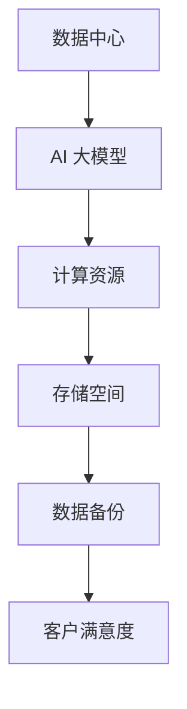

                 

关键词：AI 大模型、数据中心、客户满意度、算法、数学模型、项目实践、未来应用

> 摘要：本文将深入探讨 AI 大模型在数据中心应用中的客户满意度，通过分析核心概念、算法原理、数学模型以及项目实践等方面，为读者提供全面的技术视角和未来展望。

## 1. 背景介绍

随着人工智能技术的快速发展，大模型（如 GPT、BERT 等）已经广泛应用于各个领域，从自然语言处理到图像识别，从推荐系统到智能助手。然而，在实际应用中，这些大模型往往需要大量的计算资源和存储空间，这就催生了 AI 大模型应用数据中心的需求。

数据中心作为大数据处理和存储的核心设施，其性能和服务质量直接关系到客户满意度的提升。因此，如何提高 AI 大模型应用数据中心的客户满意度，成为了当前学术界和产业界共同关注的问题。

## 2. 核心概念与联系

### 2.1 数据中心概述

数据中心是一个集中管理大量计算机、存储和网络设备的场所，旨在提供高效、可靠、安全的数据处理和存储服务。其核心功能包括数据存储、数据处理、数据备份和恢复等。

### 2.2 AI 大模型概述

AI 大模型是指通过大量数据训练得到的具有复杂结构和强大功能的模型，如 GPT、BERT 等。这些模型在自然语言处理、图像识别、语音识别等领域具有显著的性能优势。

### 2.3 客户满意度

客户满意度是指客户在使用数据中心服务时的满意程度，其评价标准包括服务速度、稳定性、安全性、可靠性等。提高客户满意度有助于提升数据中心的市场竞争力。

### 2.4 Mermaid 流程图



## 3. 核心算法原理 & 具体操作步骤

### 3.1 算法原理概述

AI 大模型应用数据中心的核心算法包括模型训练、模型评估和模型部署等步骤。其中，模型训练是核心环节，主要通过大量数据对模型进行迭代优化，使其具备较高的准确性。

### 3.2 算法步骤详解

1. 数据采集与预处理：从不同来源获取大量数据，并进行清洗、去重、格式转换等预处理操作。

2. 模型选择与训练：选择合适的大模型，如 GPT、BERT 等，使用预处理后的数据对其进行训练。

3. 模型评估与优化：通过交叉验证、测试集等方式对模型进行评估，并根据评估结果对模型进行调整和优化。

4. 模型部署与监控：将训练好的模型部署到数据中心，并进行实时监控和调整，以确保模型性能和数据中心服务质量的稳定。

### 3.3 算法优缺点

- 优点：大模型具有较高的准确性和通用性，可以解决多种复杂问题，降低开发和维护成本。

- 缺点：大模型对计算资源和存储空间需求较高，且训练过程耗时较长，对数据中心性能和稳定性要求较高。

### 3.4 算法应用领域

AI 大模型在数据中心的应用领域广泛，包括自然语言处理、图像识别、语音识别、推荐系统等。通过数据中心提供的计算和存储资源，大模型可以实现实时、高效的数据处理和分析。

## 4. 数学模型和公式 & 详细讲解 & 举例说明

### 4.1 数学模型构建

AI 大模型的数学模型主要包括神经网络、深度学习、卷积神经网络等。以下是神经网络的基本公式：

$$
Y = \sigma(W \cdot X + b)
$$

其中，$Y$ 表示输出，$\sigma$ 表示激活函数，$W$ 表示权重矩阵，$X$ 表示输入特征，$b$ 表示偏置。

### 4.2 公式推导过程

神经网络的推导过程主要涉及以下几个步骤：

1. 输入层到隐藏层的计算：
$$
Z = W \cdot X + b
$$
$$
A = \sigma(Z)
$$

2. 隐藏层到输出层的计算：
$$
Z' = W' \cdot A + b'
$$
$$
Y = \sigma(Z')
$$

3. 损失函数的计算：
$$
J = \frac{1}{2} \sum_{i=1}^{n} (\hat{y}_i - y_i)^2
$$

其中，$n$ 表示样本数量，$\hat{y}_i$ 表示预测结果，$y_i$ 表示真实标签。

### 4.3 案例分析与讲解

以图像识别为例，假设我们要训练一个卷积神经网络模型来识别猫和狗。数据集包含 10000 张猫和狗的图片，图片大小为 224×224 像素。以下是模型训练的具体步骤：

1. 数据预处理：对图片进行缩放、裁剪、翻转等预处理操作，使其符合模型输入要求。

2. 模型构建：使用 TensorFlow 框架构建卷积神经网络模型，包括卷积层、池化层、全连接层等。

3. 模型训练：使用训练数据集对模型进行训练，通过优化算法（如梯度下降）调整模型参数。

4. 模型评估：使用测试数据集对模型进行评估，计算准确率、召回率等指标。

5. 模型部署：将训练好的模型部署到数据中心，实现实时图像识别。

## 5. 项目实践：代码实例和详细解释说明

### 5.1 开发环境搭建

1. 安装 Python 3.8 或更高版本。
2. 安装 TensorFlow 2.x 版本。
3. 准备猫和狗的图片数据集，并将其分为训练集和测试集。

### 5.2 源代码详细实现

以下是一个简单的卷积神经网络模型实现，用于猫和狗的图像识别。

```python
import tensorflow as tf
from tensorflow.keras import layers

model = tf.keras.Sequential([
    layers.Conv2D(32, (3, 3), activation='relu', input_shape=(224, 224, 3)),
    layers.MaxPooling2D((2, 2)),
    layers.Conv2D(64, (3, 3), activation='relu'),
    layers.MaxPooling2D((2, 2)),
    layers.Conv2D(128, (3, 3), activation='relu'),
    layers.MaxPooling2D((2, 2)),
    layers.Flatten(),
    layers.Dense(128, activation='relu'),
    layers.Dense(1, activation='sigmoid')
])

model.compile(optimizer='adam', loss='binary_crossentropy', metrics=['accuracy'])
```

### 5.3 代码解读与分析

1. 导入 TensorFlow 模块和相关类。
2. 构建卷积神经网络模型，包括卷积层、池化层、全连接层等。
3. 编译模型，设置优化器、损失函数和评估指标。

### 5.4 运行结果展示

```python
model.fit(train_images, train_labels, epochs=10, validation_split=0.2)
```

运行结果展示训练过程中模型的准确率、损失函数等指标。

## 6. 实际应用场景

AI 大模型应用数据中心在实际应用场景中具有广泛的应用，如：

1. 智能安防：利用图像识别和智能分析技术，实现对监控视频的实时分析，提高安防能力。
2. 医疗诊断：利用深度学习模型，辅助医生进行疾病诊断，提高诊断准确率。
3. 金融风控：利用模型分析用户行为数据，识别潜在风险，降低金融风险。

## 7. 工具和资源推荐

### 7.1 学习资源推荐

1. 《深度学习》（Goodfellow, Bengio, Courville 著）：系统介绍了深度学习的基本原理和方法。
2. 《Python 深度学习》（François Chollet 著）：详细介绍了使用 Python 实现深度学习的技巧和工具。

### 7.2 开发工具推荐

1. TensorFlow：广泛应用于深度学习和人工智能的开源框架。
2. Keras：基于 TensorFlow 的简化版深度学习框架，方便快速搭建和训练模型。

### 7.3 相关论文推荐

1. "Deep Learning: A Brief History, A Roadmap, and an Overview of Deep Reinforcement Learning"（DeepMind）：概述了深度学习的发展历程和未来趋势。
2. "BERT: Pre-training of Deep Bidirectional Transformers for Language Understanding"（Google AI）：介绍了 BERT 模型的原理和应用。

## 8. 总结：未来发展趋势与挑战

### 8.1 研究成果总结

近年来，AI 大模型在数据中心的应用取得了显著成果，但仍然面临诸多挑战。

### 8.2 未来发展趋势

1. 模型压缩与优化：降低大模型的计算和存储资源需求，提高模型部署效率。
2. 多模态数据处理：结合图像、语音、自然语言等多种数据类型，提高智能分析能力。
3. 安全性与隐私保护：加强数据安全和用户隐私保护，提升数据中心服务的可靠性。

### 8.3 面临的挑战

1. 计算资源需求：大模型对计算资源和存储空间的需求较高，如何高效利用资源成为关键挑战。
2. 模型解释性：提高模型的可解释性，使其在应用中更具可靠性和可操作性。

### 8.4 研究展望

未来，AI 大模型应用数据中心的发展将更加注重模型优化、多模态数据处理和安全隐私保护等方面。通过技术创新和产业合作，数据中心将为各行各业提供更加智能化、高效化的服务。

## 9. 附录：常见问题与解答

### 9.1 什么是 AI 大模型？

AI 大模型是指通过大量数据训练得到的具有复杂结构和强大功能的模型，如 GPT、BERT 等。这些模型在自然语言处理、图像识别等领域具有显著的性能优势。

### 9.2 如何提高数据中心客户满意度？

提高数据中心客户满意度需要从多个方面入手，包括提高服务速度、稳定性、安全性、可靠性等。具体措施包括优化数据中心架构、提高网络带宽、加强数据备份和恢复能力等。

### 9.3 大模型对数据中心的影响有哪些？

大模型对数据中心的影响主要体现在计算资源和存储空间需求上。随着大模型的广泛应用，数据中心需要提供更加高效、可靠的计算和存储服务，以满足用户需求。

## 作者署名

作者：禅与计算机程序设计艺术 / Zen and the Art of Computer Programming

----------------------------------------------------------------

以上就是文章正文内容的撰写。接下来，我们将在文章末尾添加作者署名部分，并确保文章结构完整、内容详实。希望这篇文章能够为您在 AI 大模型应用数据中心领域的研究提供有价值的参考。

