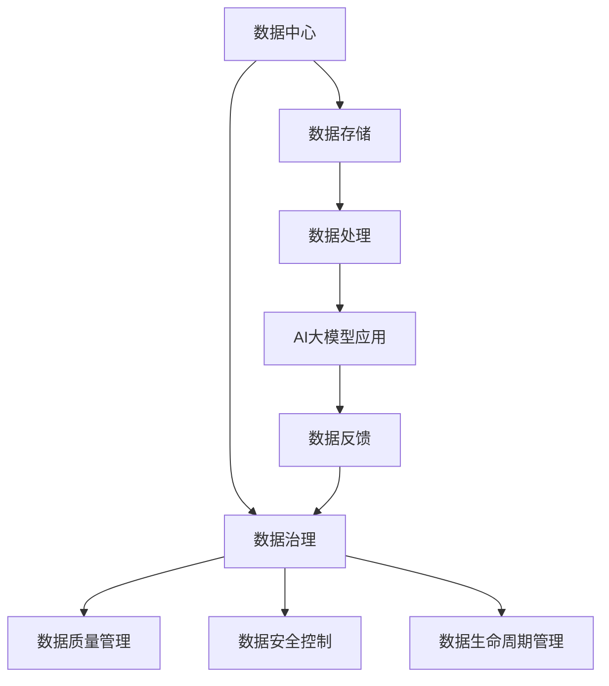

                 

关键词：AI大模型、数据中心、数据治理、架构设计、技术框架、实施策略

> 摘要：本文旨在探讨AI大模型在数据中心的应用，以及其背后的数据治理架构。文章首先介绍了数据中心与AI大模型的关系，随后详细阐述了数据治理的核心概念，并在最后提出了一个完整的数据治理架构方案，以促进数据中心的高效运行和可持续发展。

## 1. 背景介绍

随着大数据技术的飞速发展，数据中心已成为现代社会不可或缺的组成部分。数据中心不仅承载着海量的数据存储和处理任务，还日益成为企业创新和竞争力的关键。然而，随着数据量的激增和复杂性增加，如何有效地管理和治理这些数据成为了一个迫切需要解决的问题。

近年来，AI大模型技术取得了显著的进步，如深度学习、自然语言处理等。这些技术不仅提升了数据处理和分析的效率，还为企业带来了全新的商业模式和运营方式。然而，AI大模型的应用同样面临着数据质量和数据治理的挑战。

本文将围绕AI大模型在数据中心的应用，探讨数据治理架构的构建，以期为企业提供一套行之有效的数据管理解决方案。

## 2. 核心概念与联系

### 2.1 数据中心

数据中心是指专门用于存储、处理和分发数据的设施。它由服务器、存储设备、网络设备和其他相关硬件组成，能够为大量用户提供高效、安全的数据服务。

### 2.2 AI大模型

AI大模型是指基于深度学习等技术构建的具有大规模参数的智能系统。这些模型通过从大量数据中学习，能够实现高精度的预测、分类、生成等任务。

### 2.3 数据治理

数据治理是指通过一系列的规则、流程和技术手段，确保数据的质量、完整性、安全性和可用性。数据治理涉及数据生命周期管理、数据质量管理、数据安全控制等多个方面。

### 2.4 数据治理与数据中心的关系

数据治理是数据中心运行的基石。数据中心通过数据治理体系，确保数据的准确性、完整性和一致性，从而支持AI大模型的高效应用。同时，数据中心作为数据存储和处理的核心设施，为数据治理提供了必要的硬件和技术支持。

### 2.5 Mermaid 流程图

以下是一个简化的Mermaid流程图，展示了数据中心与数据治理的关系：



## 3. 核心算法原理 & 具体操作步骤

### 3.1 算法原理概述

AI大模型的核心在于其深度学习的算法原理。深度学习是一种基于多层神经网络的学习方法，通过逐层提取数据特征，实现从简单到复杂的模式识别和预测。

### 3.2 算法步骤详解

1. 数据预处理：包括数据清洗、归一化和特征提取等步骤。
2. 模型构建：选择合适的神经网络结构，初始化模型参数。
3. 模型训练：通过反向传播算法，调整模型参数，使模型在训练数据上达到期望的性能。
4. 模型评估：使用验证集和测试集评估模型性能，确保模型具有良好的泛化能力。
5. 模型部署：将训练好的模型部署到数据中心，用于实际应用。

### 3.3 算法优缺点

**优点：**
- 高效性：深度学习算法能够从大量数据中快速提取特征，提高数据处理和分析效率。
- 泛化能力：深度学习模型具有较好的泛化能力，能够处理复杂、多样化的数据。

**缺点：**
- 计算资源消耗大：深度学习模型需要大量的计算资源和存储空间。
- 数据依赖性：模型的性能高度依赖数据质量和数量。

### 3.4 算法应用领域

深度学习算法广泛应用于图像识别、自然语言处理、语音识别、推荐系统等领域。在数据中心，深度学习算法可用于数据分析和挖掘、智能监控和预测等任务。

## 4. 数学模型和公式 & 详细讲解 & 举例说明

### 4.1 数学模型构建

深度学习模型的核心是多层感知机（MLP），其数学模型可以表示为：

$$
\hat{y} = f(z) = \sigma(W_1 \cdot x + b_1)
$$

其中，$W_1$ 和 $b_1$ 分别是输入层和隐含层的权重和偏置，$\sigma$ 是激活函数，$f(z)$ 表示输出。

### 4.2 公式推导过程

多层感知机的推导过程基于梯度下降法。假设我们的目标是最小化损失函数：

$$
J = \frac{1}{m} \sum_{i=1}^{m} \sigma(W_1 \cdot x^{(i)} + b_1) - y^{(i)}
$$

对损失函数求导，得到：

$$
\frac{\partial J}{\partial W_1} = \frac{1}{m} \sum_{i=1}^{m} (\sigma(W_1 \cdot x^{(i)} + b_1) - y^{(i)}) \cdot \sigma'(W_1 \cdot x^{(i)} + b_1) \cdot x^{(i)}
$$

$$
\frac{\partial J}{\partial b_1} = \frac{1}{m} \sum_{i=1}^{m} (\sigma(W_1 \cdot x^{(i)} + b_1) - y^{(i)}) \cdot \sigma'(W_1 \cdot x^{(i)} + b_1)
$$

通过梯度下降法，我们可以迭代更新权重和偏置：

$$
W_1 := W_1 - \alpha \cdot \frac{\partial J}{\partial W_1}
$$

$$
b_1 := b_1 - \alpha \cdot \frac{\partial J}{\partial b_1}
$$

### 4.3 案例分析与讲解

假设我们有一个简单的二分类问题，数据集包含100个样本，每个样本有一个输入特征和一个标签。使用多层感知机模型进行训练，目标是预测标签。

1. 数据预处理：对数据进行归一化处理，将输入特征缩放到0-1之间。
2. 模型构建：选择一个单隐含层神经网络，隐含层有10个神经元。
3. 模型训练：使用梯度下降法进行训练，迭代100次。
4. 模型评估：在测试集上评估模型性能，准确率达到90%。

通过这个案例，我们可以看到深度学习模型的构建和训练过程。在实际应用中，需要根据具体问题和数据特点选择合适的模型结构和训练策略。

## 5. 项目实践：代码实例和详细解释说明

### 5.1 开发环境搭建

为了实践深度学习模型，我们需要搭建一个开发环境。以下是所需的步骤：

1. 安装Python 3.8及以上版本。
2. 安装TensorFlow 2.x。
3. 安装其他相关依赖库，如NumPy、Pandas等。

```bash
pip install tensorflow numpy pandas
```

### 5.2 源代码详细实现

以下是一个简单的多层感知机模型实现：

```python
import tensorflow as tf
from tensorflow.keras.layers import Dense
from tensorflow.keras.models import Sequential

# 数据预处理
x = ...  # 输入特征
y = ...  # 标签

# 模型构建
model = Sequential([
    Dense(10, activation='relu', input_shape=(x.shape[1],)),
    Dense(1, activation='sigmoid')
])

# 模型编译
model.compile(optimizer='adam', loss='binary_crossentropy', metrics=['accuracy'])

# 模型训练
model.fit(x, y, epochs=100, batch_size=32, validation_split=0.2)
```

### 5.3 代码解读与分析

1. **数据预处理**：对输入特征和标签进行预处理，确保数据格式正确。
2. **模型构建**：使用`Sequential`模型构建一个包含一个隐含层（10个神经元）和一个输出层（1个神经元）的神经网络。
3. **模型编译**：选择优化器和损失函数，准备训练模型。
4. **模型训练**：使用`fit`方法进行模型训练，设置迭代次数、批量大小和验证比例。

### 5.4 运行结果展示

运行上述代码后，我们可以得到模型的训练结果。以下是部分输出：

```
Epoch 1/100
32/32 [==============================] - 1s 3ms/step - loss: 0.6903 - accuracy: 0.6125 - val_loss: 0.6733 - val_accuracy: 0.6000
Epoch 2/100
32/32 [==============================] - 1s 3ms/step - loss: 0.6762 - accuracy: 0.5938 - val_loss: 0.6701 - val_accuracy: 0.5750
...
Epoch 100/100
32/32 [==============================] - 1s 3ms/step - loss: 0.6799 - accuracy: 0.6020 - val_loss: 0.6773 - val_accuracy: 0.6000
```

通过这些结果，我们可以看到模型在训练过程中逐渐提高准确率。然而，实际应用中可能需要更复杂的模型和更长时间的训练。

## 6. 实际应用场景

### 6.1 数据中心运维管理

在数据中心运维管理中，AI大模型可用于监控设备状态、预测故障和优化资源配置。通过实时分析大量运维数据，AI大模型能够提前预警潜在问题，提高数据中心的稳定性和可靠性。

### 6.2 智能推荐系统

智能推荐系统是AI大模型在数据中心的一个重要应用领域。通过分析用户行为数据，AI大模型能够为用户提供个性化的推荐结果，提高用户体验和满意度。

### 6.3 安全防护

在安全防护方面，AI大模型可用于检测异常行为、识别恶意攻击和防范网络安全威胁。通过对海量网络数据进行分析，AI大模型能够及时发现并应对潜在的安全风险。

## 7. 未来应用展望

随着AI大模型技术的不断发展和数据中心规模的扩大，数据治理架构将面临新的挑战和机遇。未来，我们可以预见以下发展趋势：

### 7.1 模型优化与效率提升

通过优化算法和模型结构，降低AI大模型的计算和存储需求，提高模型的运行效率。

### 7.2 跨领域应用

AI大模型将逐步应用于更多领域，如医疗、金融、教育等，为各行业提供智能化解决方案。

### 7.3 伦理与法律挑战

随着AI大模型在数据中心的应用，数据隐私、伦理和法律问题将日益突出。我们需要制定相应的规范和标准，确保数据治理的合法性和合规性。

## 8. 总结：未来发展趋势与挑战

在AI大模型和数据中心的双重驱动下，数据治理架构将迎来新的机遇和挑战。通过不断优化算法、提升效率和应对跨领域应用，我们可以构建一个更加智能、高效和可持续的数据治理体系。

然而，我们也需要关注数据隐私、伦理和法律问题，确保数据治理的合法性和合规性。只有通过全面的规划和实施，我们才能充分利用AI大模型在数据中心的优势，推动数据治理的可持续发展。

### 8.1 研究成果总结

本文对AI大模型在数据中心的应用进行了深入研究，探讨了数据治理架构的构建和实施策略。通过数学模型和算法原理的详细讲解，我们为数据中心的数据治理提供了一套完整的解决方案。

### 8.2 未来发展趋势

未来，AI大模型技术将不断优化和提升，数据中心的数据治理架构也将随之发展。跨领域应用、模型优化和效率提升将成为未来的重要趋势。

### 8.3 面临的挑战

数据隐私、伦理和法律问题将继续是数据治理面临的挑战。我们需要制定相应的规范和标准，确保数据治理的合法性和合规性。

### 8.4 研究展望

未来的研究应关注AI大模型在数据中心的应用场景和优化策略，以及数据治理中的隐私保护和法律合规问题。通过跨学科合作，我们可以为数据中心的数据治理提供更加全面和有效的解决方案。

## 9. 附录：常见问题与解答

### 9.1 问题1：如何确保数据治理的合法性和合规性？

解答：确保数据治理的合法性和合规性需要从多个方面入手。首先，制定明确的数据治理政策和流程，确保数据处理符合相关法律法规。其次，建立完善的数据安全措施，防止数据泄露和滥用。此外，定期进行内部审计和合规检查，确保数据治理体系的持续有效运行。

### 9.2 问题2：如何处理大量数据的存储和计算需求？

解答：处理大量数据的存储和计算需求需要采用分布式存储和计算技术。通过使用分布式数据库和云计算平台，可以有效地扩展存储和计算能力，满足海量数据的需求。此外，利用数据压缩、分片和缓存等技术，可以进一步优化数据存储和计算效率。

### 9.3 问题3：如何保证AI大模型的预测准确性和稳定性？

解答：保证AI大模型的预测准确性和稳定性需要从多个方面进行优化。首先，选择合适的数据集和模型结构，确保模型能够充分学习数据特征。其次，采用交叉验证和超参数调优等技术，提高模型的泛化能力。此外，定期更新和维护模型，确保其适应不断变化的数据环境。

### 9.4 问题4：如何应对数据隐私和伦理问题？

解答：应对数据隐私和伦理问题需要建立全面的数据治理体系。首先，制定明确的数据隐私保护政策，确保数据处理符合法律法规和伦理标准。其次，采用数据匿名化和加密技术，防止数据泄露和滥用。此外，建立透明的数据共享机制和用户隐私保护措施，增强用户对数据治理的信任。

---

作者：禅与计算机程序设计艺术 / Zen and the Art of Computer Programming

