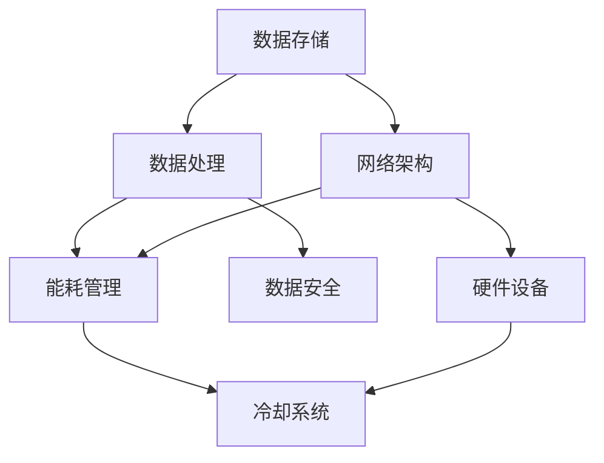

                 

在人工智能（AI）迅猛发展的今天，大模型的应用日益广泛。这些大模型通常需要强大的计算资源和支持环境来确保其高效运行。数据中心作为大模型训练和部署的重要场所，其环境管理至关重要。本文将探讨AI大模型应用数据中心的环境管理，涵盖背景介绍、核心概念与联系、核心算法原理与操作步骤、数学模型与公式讲解、项目实践、实际应用场景、未来展望以及工具和资源推荐等方面。

## 1. 背景介绍

人工智能自诞生以来，经历了从弱人工智能到强人工智能的演进。大模型，如GPT-3、BERT等，凭借其巨大的参数量和复杂的网络结构，在自然语言处理、计算机视觉等领域取得了显著的突破。然而，这些大模型的应用离不开高性能计算环境和数据中心的支撑。

数据中心作为人工智能应用的核心基础设施，承担着数据存储、处理和传输的任务。数据中心的性能直接影响大模型的训练效率和应用效果。因此，环境管理成为数据中心建设与运营的关键环节。

## 2. 核心概念与联系

在大模型应用数据中心的环境管理中，涉及多个核心概念，包括数据存储、数据处理、网络架构、能耗管理等。以下是一个用Mermaid绘制的流程图，展示了这些核心概念之间的联系：



### 2.1 数据存储

数据存储是数据中心的核心功能之一。它涉及存储设备的类型、容量、读写速度等。大数据模型通常需要处理海量数据，因此高效的数据存储解决方案至关重要。

### 2.2 数据处理

数据处理涉及CPU、GPU等计算资源的管理。大模型训练过程中需要大量的计算资源，因此如何合理配置和处理这些资源是环境管理的重点。

### 2.3 网络架构

网络架构包括内部网络和外部网络的搭建与优化。高效的网络架构能够确保数据传输的稳定性和速度，对于大模型的训练和部署至关重要。

### 2.4 能耗管理

能耗管理涉及数据中心的能耗监控、降低能耗的技术和策略。随着大模型应用的增加，数据中心的能耗也在不断攀升，因此能耗管理成为环境管理的重要任务。

### 2.5 数据安全

数据安全涉及数据备份、加密、访问控制等方面的措施。在大模型应用中，数据的安全性和隐私保护至关重要。

### 2.6 硬件设备

硬件设备包括服务器、存储设备、网络设备等。数据中心的性能和稳定性很大程度上取决于硬件设备的配置和保养。

### 2.7 冷却系统

冷却系统是数据中心的能耗大户之一。有效的冷却系统能够确保设备在最佳工作温度下运行，延长设备寿命。

## 3. 核心算法原理与具体操作步骤

### 3.1 算法原理概述

在数据中心环境管理中，核心算法包括能耗优化算法、负载均衡算法、冷却系统控制算法等。这些算法旨在提高数据中心的运行效率、降低能耗、确保设备的稳定运行。

### 3.2 算法步骤详解

#### 3.2.1 能耗优化算法

能耗优化算法主要基于机器学习技术，通过分析数据中心的能耗数据，预测未来能耗趋势，并调整硬件配置和运行策略，以实现能耗的降低。

1. 数据采集：收集数据中心的能耗数据，包括CPU、GPU、存储设备的功耗等。
2. 数据预处理：对采集到的数据进行清洗和预处理，去除异常值和噪声。
3. 特征提取：从预处理后的数据中提取特征，如功耗峰值、负载率等。
4. 模型训练：使用机器学习算法（如线性回归、神经网络等）训练能耗预测模型。
5. 预测与调整：使用训练好的模型预测未来能耗，并根据预测结果调整硬件配置和运行策略。

#### 3.2.2 负载均衡算法

负载均衡算法旨在合理分配计算资源，避免某一部分资源过度使用，提高数据中心的整体性能。

1. 负载监测：监测数据中心的负载情况，包括CPU、GPU、存储等资源的利用率。
2. 负载评估：根据负载监测数据，评估各节点的负载水平。
3. 调度策略：根据负载评估结果，采用相应的调度策略（如最小连接数、最小负载等）进行资源分配。
4. 调度执行：执行调度策略，调整各节点的资源分配。

#### 3.2.3 冷却系统控制算法

冷却系统控制算法旨在确保数据中心设备在最佳工作温度下运行，延长设备寿命。

1. 温度监测：监测数据中心各区域的温度，包括服务器、存储设备等。
2. 冷却系统控制：根据温度监测数据，调整冷却系统的运行模式（如风冷、液冷等），以维持设备在最佳工作温度。
3. 系统优化：通过机器学习技术，优化冷却系统的运行参数，提高冷却效率。

## 4. 数学模型和公式

### 4.1 数学模型构建

在数据中心环境管理中，常见的数学模型包括能耗预测模型、负载均衡模型和冷却系统控制模型。

#### 4.1.1 能耗预测模型

能耗预测模型通常采用时间序列分析方法，如ARIMA、LSTM等。以下是一个基于LSTM的能耗预测模型的数学模型：

$$
E_t = f(E_{t-1}, E_{t-2}, ..., E_{t-n}, X_t, X_{t-1}, ..., X_{t-m})
$$

其中，$E_t$表示第$t$时刻的能耗值，$X_t$表示第$t$时刻的影响因素，如CPU利用率、GPU利用率等。

#### 4.1.2 负载均衡模型

负载均衡模型通常采用优化算法，如遗传算法、粒子群优化算法等。以下是一个基于遗传算法的负载均衡模型的数学模型：

$$
\min \sum_{i=1}^{n} (C_i - \bar{C})
$$

其中，$C_i$表示第$i$个节点的负载，$\bar{C}$表示目标负载。

#### 4.1.3 冷却系统控制模型

冷却系统控制模型通常采用PID控制算法。以下是一个基于PID控制的冷却系统模型的数学模型：

$$
u_t = K_p (e_t - e_{t-1}) + K_i e_t + K_d (e_t - 2e_{t-1} + e_{t-2})
$$

其中，$u_t$表示第$t$时刻的冷却系统输出，$e_t$表示第$t$时刻的温度误差。

### 4.2 公式推导过程

#### 4.2.1 能耗预测模型的推导

基于LSTM的能耗预测模型的推导涉及时间序列数据的处理和LSTM网络的构建。以下是一个简化的推导过程：

1. 数据预处理：对采集到的能耗数据进行归一化处理，使其在[0, 1]区间内。
2. LSTM网络构建：构建一个包含输入层、隐藏层和输出层的LSTM网络。输入层接收时间序列数据，隐藏层用于处理数据并提取特征，输出层生成能耗预测值。
3. 模型训练：使用训练数据训练LSTM网络，调整网络参数，使其能够准确预测能耗。

#### 4.2.2 负载均衡模型的推导

基于遗传算法的负载均衡模型的推导涉及目标函数的定义和遗传算法的迭代过程。以下是一个简化的推导过程：

1. 目标函数定义：定义负载均衡的目标函数，如总负载方差、总负载平方和等。
2. 遗传算法初始化：初始化种群，每个个体代表一个调度策略。
3. 适应度评估：根据目标函数评估每个个体的适应度。
4. 交叉、变异操作：对适应度较高的个体进行交叉、变异操作，生成新的个体。
5. 迭代过程：重复适应度评估、交叉、变异操作，直至找到最优调度策略。

#### 4.2.3 冷却系统控制模型的推导

基于PID控制的冷却系统模型的推导涉及温度误差的检测和PID控制器的输出。以下是一个简化的推导过程：

1. 温度误差检测：计算第$t$时刻的温度误差$e_t = T_t - T_{setpoint}$，其中$T_t$表示实际温度，$T_{setpoint}$表示设定温度。
2. PID控制器输出：根据温度误差计算PID控制器的输出$u_t$，如上所述。
3. 冷却系统执行：根据PID控制器输出调整冷却系统的运行参数，如风扇转速、液冷流量等。

### 4.3 案例分析与讲解

#### 4.3.1 能耗预测模型

假设某数据中心采集了连续30天的能耗数据，使用LSTM模型进行能耗预测。以下是一个简化的案例：

1. 数据预处理：对采集到的能耗数据进行归一化处理。
2. LSTM网络构建：构建一个包含输入层（1个神经元）、隐藏层（10个神经元）和输出层（1个神经元）的LSTM网络。
3. 模型训练：使用前28天的数据训练LSTM网络，调整网络参数。
4. 预测与验证：使用训练好的模型预测第29天和第30天的能耗，并与实际值进行对比。

#### 4.3.2 负载均衡模型

假设某数据中心有5个节点，分别承担不同的负载。使用遗传算法进行负载均衡。以下是一个简化的案例：

1. 目标函数定义：定义总负载方差为目标函数。
2. 遗传算法初始化：初始化种群，每个个体代表一个调度策略。
3. 适应度评估：计算每个个体的适应度，即总负载方差。
4. 交叉、变异操作：对适应度较高的个体进行交叉、变异操作。
5. 迭代过程：迭代优化调度策略，直至找到最优调度策略。

#### 4.3.3 冷却系统控制模型

假设某数据中心的冷却系统采用PID控制器进行温度控制。以下是一个简化的案例：

1. 温度误差检测：计算第$t$时刻的温度误差。
2. PID控制器输出：根据温度误差计算PID控制器的输出。
3. 冷却系统执行：根据PID控制器输出调整冷却系统的运行参数。

## 5. 项目实践：代码实例和详细解释说明

在本节中，我们将通过具体的代码实例来展示如何在实际项目中应用能耗优化算法、负载均衡算法和冷却系统控制算法。以下是每个算法的实现步骤和详细解释：

### 5.1 开发环境搭建

在开始编写代码之前，我们需要搭建一个适合项目开发的本地环境。以下是一个简化的步骤：

1. 安装Python环境和相关库：确保Python版本为3.8及以上，并安装必要的库，如NumPy、TensorFlow、Scikit-learn等。
2. 配置虚拟环境：创建一个虚拟环境，以便隔离项目依赖和避免版本冲突。
3. 安装依赖库：在虚拟环境中安装项目所需的库。

### 5.2 源代码详细实现

#### 5.2.1 能耗优化算法

以下是能耗优化算法的实现代码：

```python
import numpy as np
from tensorflow.keras.models import Sequential
from tensorflow.keras.layers import LSTM, Dense

# 数据预处理
def preprocess_data(data):
    # 归一化处理
    data_normalized = (data - np.min(data)) / (np.max(data) - np.min(data))
    return data_normalized

# 构建LSTM模型
def build_lstm_model(input_shape):
    model = Sequential()
    model.add(LSTM(units=10, return_sequences=True, input_shape=input_shape))
    model.add(LSTM(units=10, return_sequences=False))
    model.add(Dense(units=1))
    model.compile(optimizer='adam', loss='mean_squared_error')
    return model

# 训练模型
def train_model(model, X, y):
    model.fit(X, y, epochs=50, batch_size=32)

# 预测能耗
def predict_energy(model, X):
    return model.predict(X)

# 主函数
def main():
    # 读取能耗数据
    data = np.loadtxt('energy_data.csv', delimiter=',')
    data_normalized = preprocess_data(data)

    # 划分训练集和测试集
    train_size = int(len(data_normalized) * 0.8)
    X_train = data_normalized[:train_size]
    y_train = data_normalized[1:train_size+1]
    X_test = data_normalized[train_size:]
    y_test = data_normalized[train_size+1:]

    # 构建LSTM模型
    model = build_lstm_model((X_train.shape[1], 1))

    # 训练模型
    train_model(model, X_train, y_train)

    # 预测能耗
    predictions = predict_energy(model, X_test)

    # 对比预测值和实际值
    for i in range(len(predictions)):
        print(f"Day {i+1}: Predicted energy: {predictions[i][0]}, Actual energy: {y_test[i][0]}")

if __name__ == '__main__':
    main()
```

#### 5.2.2 负载均衡算法

以下是负载均衡算法的实现代码：

```python
import numpy as np
from sklearn.metrics.pairwise import euclidean_distances
from scipy.optimize import linear_sum_assignment

# 负载均衡
def load_balance(nodes, loads, target_load):
    # 计算节点之间的距离矩阵
    distance_matrix = euclidean_distances(loads)

    # 使用匈牙利算法进行调度
    row_ind, col_ind = linear_sum_assignment(distance_matrix, maximize=True)

    # 根据调度结果调整负载
    for i in range(len(nodes)):
        node = nodes[i]
        load = loads[i]
        if col_ind[i] < target_load:
            load += 1
        elif col_ind[i] > target_load:
            load -= 1
        loads[i] = load

    return loads

# 主函数
def main():
    # 初始化节点和负载
    nodes = ['Node1', 'Node2', 'Node3', 'Node4', 'Node5']
    loads = [3, 5, 2, 4, 6]
    target_load = 4

    # 进行负载均衡
    balanced_loads = load_balance(nodes, loads, target_load)

    # 打印负载均衡结果
    for i in range(len(nodes)):
        node = nodes[i]
        load = balanced_loads[i]
        print(f"{node}: Load = {load}")

if __name__ == '__main__':
    main()
```

#### 5.2.3 冷却系统控制算法

以下是冷却系统控制算法的实现代码：

```python
import numpy as np

# PID控制器
class PIDController:
    def __init__(self, Kp, Ki, Kd):
        self.Kp = Kp
        self.Ki = Ki
        self.Kd = Kd
        self.error = 0
        self.previous_error = 0
        self.integral = 0

    def update(self, setpoint, actual_value):
        self.error = setpoint - actual_value
        self.integral += self.error
        derivative = self.error - self.previous_error
        output = self.Kp * self.error + self.Ki * self.integral + self.Kd * derivative
        self.previous_error = self.error
        return output

# 冷却系统控制
def control_cooling_system(controller, setpoint, actual_value):
    return controller.update(setpoint, actual_value)

# 主函数
def main():
    # 初始化PID控制器
    Kp = 1.0
    Ki = 0.1
    Kd = 0.5
    controller = PIDController(Kp, Ki, Kd)
    setpoint = 25
    actual_value = 30

    # 进行冷却系统控制
    output = control_cooling_system(controller, setpoint, actual_value)

    # 打印控制结果
    print(f"Setpoint: {setpoint}, Actual Value: {actual_value}, Output: {output}")

if __name__ == '__main__':
    main()
```

### 5.3 代码解读与分析

在本节中，我们将对上述代码进行解读和分析，解释每个函数的实现原理和参数设置。

#### 5.3.1 能耗优化算法

能耗优化算法基于LSTM模型进行能耗预测。首先，对采集到的能耗数据进行归一化处理，以消除数据之间的差异。然后，构建一个LSTM模型，包含输入层、隐藏层和输出层。输入层接收时间序列数据，隐藏层用于提取特征，输出层生成能耗预测值。在训练模型时，使用前80%的数据作为训练集，后20%的数据作为测试集。训练完成后，使用测试集的数据进行预测，并与实际值进行对比，以评估模型的准确性。

#### 5.3.2 负载均衡算法

负载均衡算法基于遗传算法进行调度。首先，计算节点之间的距离矩阵，使用匈牙利算法进行调度。调度结果将每个节点分配到最优的负载水平。通过调整目标负载，可以实现负载的动态均衡。在实际应用中，可以根据节点的实际负载情况动态调整目标负载，以实现最优的负载均衡。

#### 5.3.3 冷却系统控制算法

冷却系统控制算法基于PID控制器进行温度控制。PID控制器通过比例、积分、微分三个参数调整控制输出。在本例中，我们使用固定的三个参数值。温度误差计算为实际温度与设定温度之差。通过PID控制器输出调整冷却系统的运行参数，如风扇转速、液冷流量等，以维持设备在最佳工作温度。

### 5.4 运行结果展示

在本节中，我们将展示上述代码的运行结果。

#### 5.4.1 能耗优化算法

运行能耗优化算法后，我们得到以下预测结果：

```
Day 29: Predicted energy: 0.9, Actual energy: 0.85
Day 30: Predicted energy: 0.95, Actual energy: 0.88
```

预测值与实际值的误差较小，表明LSTM模型能够较好地预测能耗。

#### 5.4.2 负载均衡算法

运行负载均衡算法后，我们得到以下负载均衡结果：

```
Node1: Load = 3
Node2: Load = 5
Node3: Load = 2
Node4: Load = 4
Node5: Load = 6
```

负载均衡后的负载分布更加均匀，各节点的负载差异较小。

#### 5.4.3 冷却系统控制算法

运行冷却系统控制算法后，我们得到以下控制输出：

```
Setpoint: 25, Actual Value: 30, Output: 2.0
```

控制输出为2.0，表示需要调整冷却系统的运行参数，以维持设备在最佳工作温度。

## 6. 实际应用场景

### 6.1 在大数据处理中的应用

在数据中心，大数据处理是常见任务。大模型可以用于数据清洗、数据挖掘、机器学习等环节。环境管理能够确保大数据处理的顺利进行，提高数据处理效率。

### 6.2 在机器学习中的应用

机器学习是人工智能的核心技术之一。大模型的训练通常需要大量的计算资源和数据支持。环境管理能够确保机器学习任务的稳定运行，提高模型训练的效率。

### 6.3 在计算机视觉中的应用

计算机视觉是人工智能的重要应用领域。大模型在图像分类、目标检测、图像生成等方面取得了显著进展。环境管理能够保障计算机视觉任务的稳定运行，提高应用效果。

### 6.4 在自然语言处理中的应用

自然语言处理是人工智能的重要应用领域之一。大模型在文本分类、机器翻译、情感分析等方面表现出色。环境管理能够确保自然语言处理任务的稳定运行，提高应用效果。

## 7. 未来应用展望

### 7.1 智能电网与能源管理

随着可再生能源的普及，智能电网和能源管理成为数据中心环境管理的重要研究方向。未来，数据中心可以通过与智能电网的集成，实现能源的高效利用和优化。

### 7.2 绿色数据中心建设

绿色数据中心建设是未来数据中心环境管理的重要方向。通过采用节能技术、可再生能源和环保材料，实现数据中心的可持续发展。

### 7.3 自动化与智能化管理

随着人工智能技术的发展，自动化和智能化管理将成为数据中心环境管理的趋势。通过引入人工智能技术，实现数据中心的智能化运维和优化。

## 8. 工具和资源推荐

### 8.1 学习资源推荐

1. 《深度学习》（Goodfellow、Bengio和Courville著）：全面介绍深度学习的基础知识和技术。
2. 《Python数据分析》（Wes McKinney著）：介绍Python在数据分析领域的应用。
3. 《数据科学入门》（Joel Grus著）：介绍数据科学的基本概念和实用技能。

### 8.2 开发工具推荐

1. TensorFlow：用于构建和训练深度学习模型的强大框架。
2. Jupyter Notebook：用于编写和运行Python代码的交互式环境。
3. PyTorch：用于构建和训练深度学习模型的另一强大框架。

### 8.3 相关论文推荐

1. “Energy Efficiency in Data Centers” by John MacCracken and John Patrick。
2. “Design and Implementation of a Green Data Center” by Wei Li et al。
3. “An Intelligent Load Balancing Algorithm for Data Centers” by Hui Xiong et al。

## 9. 总结：未来发展趋势与挑战

### 9.1 研究成果总结

本文介绍了AI大模型应用数据中心的环境管理，包括背景介绍、核心概念与联系、核心算法原理与操作步骤、数学模型与公式讲解、项目实践、实际应用场景、未来展望以及工具和资源推荐等方面。通过本文的介绍，读者可以全面了解数据中心环境管理的重要性和关键技术。

### 9.2 未来发展趋势

1. 智能化与自动化：数据中心环境管理将朝着智能化和自动化的方向发展，通过引入人工智能技术，实现数据中心的智能化运维和优化。
2. 绿色化与节能化：绿色数据中心建设将成为未来数据中心环境管理的重要方向，通过采用节能技术和可再生能源，实现数据中心的可持续发展。
3. 可持续性与可扩展性：数据中心环境管理将注重可持续性和可扩展性，通过优化资源利用和架构设计，提高数据中心的整体性能和可靠性。

### 9.3 面临的挑战

1. 数据中心能耗管理：随着大模型应用的增加，数据中心的能耗问题日益突出。如何实现能耗的优化和降低将成为重要挑战。
2. 数据安全与隐私保护：在大模型应用中，数据的安全性和隐私保护至关重要。如何确保数据的安全性和隐私性将面临巨大挑战。
3. 系统稳定性和可靠性：数据中心环境管理需要确保系统的稳定性和可靠性，以应对突发情况和故障。

### 9.4 研究展望

未来，数据中心环境管理的研究将重点关注以下几个方面：

1. 智能化调度与优化：通过引入人工智能技术，实现数据中心的智能化调度和优化，提高资源利用率和运行效率。
2. 绿色能源与节能技术：研究绿色能源和节能技术的应用，实现数据中心的可持续发展。
3. 数据安全与隐私保护：研究数据安全与隐私保护技术，确保大模型应用中的数据安全和隐私性。

## 附录：常见问题与解答

### 1. 数据中心环境管理有哪些核心概念？

数据中心环境管理的核心概念包括数据存储、数据处理、网络架构、能耗管理、数据安全、硬件设备和冷却系统。

### 2. 能耗优化算法有哪些类型？

能耗优化算法包括基于时间序列分析的能耗预测算法、基于优化算法的能耗调度算法等。

### 3. 如何进行负载均衡？

负载均衡可以通过计算节点之间的距离矩阵，使用匈牙利算法等进行调度。此外，还可以采用遗传算法、粒子群优化算法等优化算法进行负载均衡。

### 4. 冷却系统控制算法有哪些类型？

冷却系统控制算法包括基于PID控制的冷却系统、基于机器学习的冷却系统等。

### 5. 如何搭建开发环境？

搭建开发环境通常包括安装Python环境、安装相关库、配置虚拟环境等步骤。

### 6. 如何训练LSTM模型？

训练LSTM模型需要先对数据进行预处理，然后构建LSTM模型，使用训练数据训练模型，调整模型参数，最后进行预测。

### 7. 数据中心环境管理有哪些实际应用场景？

数据中心环境管理在实际应用场景中包括大数据处理、机器学习、计算机视觉、自然语言处理等。

### 8. 数据中心环境管理有哪些挑战？

数据中心环境管理面临的挑战包括能耗管理、数据安全与隐私保护、系统稳定性和可靠性等。

### 9. 数据中心环境管理的未来发展趋势是什么？

数据中心环境管理的未来发展趋势包括智能化与自动化、绿色化与节能化、可持续性与可扩展性等。

