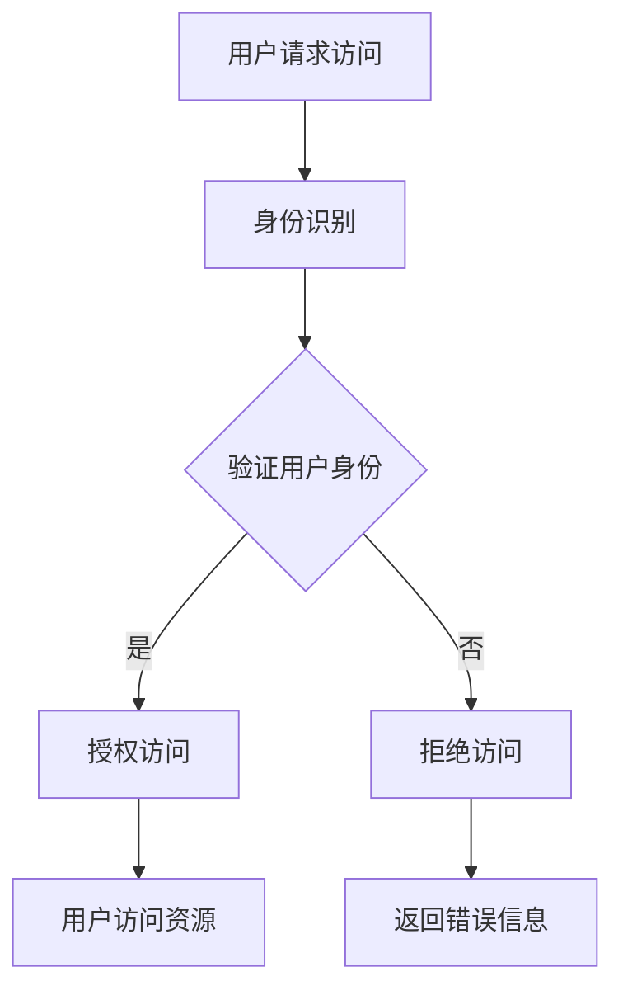

                 

关键词：身份认证，数据中心，AI大模型，安全管理，用户权限，访问控制，密码学，多因素认证，加密技术

> 摘要：随着人工智能技术的快速发展，AI大模型在数据中心的应用越来越广泛。本文将探讨在数据中心中采用AI大模型进行身份认证管理的必要性和优势，介绍相关核心概念、算法原理、数学模型以及实际应用场景，并提出未来发展的趋势和面临的挑战。

## 1. 背景介绍

近年来，人工智能（AI）技术取得了显著的进展，尤其在深度学习、自然语言处理和计算机视觉等领域。AI大模型，如GPT-3、BERT等，已经成为许多企业和机构的关键工具。这些大模型通常需要大量的计算资源和数据存储，因此，它们通常运行在数据中心。数据中心是存储和管理大量数据的关键设施，因此其安全性至关重要。

在数据中心中，身份认证是确保系统安全的关键环节。传统的身份认证方式通常依赖于用户名和密码，但这些方法存在诸多安全漏洞，如密码泄露、弱密码和密码重用等。随着AI大模型的应用，传统的身份认证方法已无法满足复杂的安全需求。因此，采用AI大模型进行身份认证管理成为一种新的趋势。

本文旨在探讨AI大模型在数据中心身份认证管理中的应用，包括核心概念、算法原理、数学模型和实际应用场景，并分析其未来发展趋势和挑战。

## 2. 核心概念与联系

### 2.1 身份认证

身份认证是验证用户身份的过程，确保只有合法用户才能访问系统资源。身份认证通常包括三个主要步骤：身份识别、身份验证和授权。

- **身份识别**：识别用户身份的过程，通常通过用户名或邮箱等标识进行。
- **身份验证**：验证用户身份的过程，通常通过密码、双因素认证或生物特征识别等手段进行。
- **授权**：根据用户的身份和权限，决定用户可以访问哪些系统资源和功能。

### 2.2 数据中心

数据中心是一个集中存储、处理和管理大量数据的设施。它通常由多个服务器、存储设备和网络设备组成，以提供高效、安全的数据存储和处理服务。数据中心的安全性对于保护企业数据和业务连续性至关重要。

### 2.3 AI大模型

AI大模型是指那些具有数亿甚至数十亿参数的大型神经网络模型，如GPT-3、BERT等。这些模型能够处理大量的数据，并具备强大的学习能力和泛化能力，因此在各种应用场景中具有重要价值。

### 2.4 Mermaid 流程图

以下是一个描述AI大模型应用数据中心的身份认证管理的Mermaid流程图：



## 3. 核心算法原理 & 具体操作步骤

### 3.1 算法原理概述

AI大模型在身份认证管理中的应用主要基于其强大的学习和分析能力。具体来说，AI大模型可以通过以下步骤进行身份认证：

1. **数据预处理**：收集用户身份信息，如用户名、密码、生物特征等，并进行预处理，以适应模型训练。
2. **模型训练**：使用大量标注数据对AI大模型进行训练，使其能够识别和验证用户身份。
3. **身份验证**：在用户请求访问时，将用户的身份信息输入到AI大模型中，模型会输出一个验证结果，以确定用户身份是否合法。
4. **授权访问**：根据AI大模型的验证结果，决定用户是否可以访问系统资源。

### 3.2 算法步骤详解

1. **数据预处理**：
   - **收集用户身份信息**：从数据库或身份认证系统获取用户名、密码、生物特征等信息。
   - **数据清洗**：去除数据中的噪声和异常值，确保数据质量。
   - **数据归一化**：将不同特征的数据进行归一化处理，使其具有相同的量纲。

2. **模型训练**：
   - **选择模型**：根据应用场景选择合适的AI大模型，如卷积神经网络（CNN）、循环神经网络（RNN）或Transformer等。
   - **数据集准备**：将预处理后的用户身份信息划分为训练集、验证集和测试集。
   - **模型训练**：使用训练集对AI大模型进行训练，并使用验证集进行模型调整。

3. **身份验证**：
   - **用户请求访问**：用户尝试访问系统资源时，系统会收集用户的身份信息。
   - **输入模型**：将用户的身份信息输入到AI大模型中。
   - **模型输出**：AI大模型会输出一个验证结果，通常是一个概率值，表示用户身份的合法性。

4. **授权访问**：
   - **决策规则**：根据AI大模型的验证结果，设置一个阈值，如0.5，当模型输出概率值大于阈值时，认为用户身份合法，可以访问系统资源。
   - **访问控制**：根据用户的权限，决定用户可以访问哪些系统资源和功能。

### 3.3 算法优缺点

**优点**：

- **高精度**：AI大模型能够处理大量数据，并通过学习用户行为和特征，提高身份认证的精度。
- **自适应**：AI大模型可以根据不断变化的数据和环境，自动调整和优化模型参数。
- **灵活性**：AI大模型支持多种身份认证方式，如密码、生物特征和双因素认证等。

**缺点**：

- **计算成本高**：AI大模型需要大量的计算资源和时间进行训练和推理。
- **隐私风险**：身份认证过程中的用户数据可能包含敏感信息，需要确保数据的安全和保护。
- **依赖数据**：AI大模型的性能和效果取决于训练数据的质量和数量。

### 3.4 算法应用领域

AI大模型在身份认证管理中的应用广泛，包括但不限于以下几个方面：

- **数据中心**：保护数据中心中的数据和系统资源，确保只有合法用户才能访问。
- **企业内部网络**：加强企业内部网络的安全性，防止内部人员和外部攻击者非法访问。
- **云计算**：提供基于AI大模型的安全认证服务，确保云计算环境的安全和可靠性。
- **物联网**：在物联网设备中进行身份认证，确保设备之间的安全通信和数据交换。

## 4. 数学模型和公式 & 详细讲解 & 举例说明

### 4.1 数学模型构建

在AI大模型中，身份认证通常基于神经网络模型，如卷积神经网络（CNN）、循环神经网络（RNN）或Transformer等。以下以Transformer模型为例，介绍其数学模型构建。

#### 4.1.1 Transformer模型结构

Transformer模型由编码器（Encoder）和解码器（Decoder）组成，其中编码器用于处理输入数据，解码器用于生成输出结果。

- **编码器**：编码器由多个层组成，每层包含多个自注意力机制（Self-Attention Mechanism）和前馈神经网络（Feedforward Neural Network）。
- **解码器**：解码器也由多个层组成，每层包含多个自注意力机制、交叉注意力机制（Cross-Attention Mechanism）和前馈神经网络。

#### 4.1.2 数学公式

- **自注意力机制**：自注意力机制用于计算输入数据的权重，其公式如下：

  $$ 
  \text{Attention}(Q, K, V) = \text{softmax}\left(\frac{QK^T}{\sqrt{d_k}}\right) V 
  $$

  其中，$Q$、$K$ 和 $V$ 分别为查询（Query）、键（Key）和值（Value）向量，$d_k$ 为键向量的维度。

- **交叉注意力机制**：交叉注意力机制用于计算输入数据和上下文数据的权重，其公式如下：

  $$ 
  \text{Attention}(Q, K, V) = \text{softmax}\left(\frac{QK^T}{\sqrt{d_k}}\right) V 
  $$

  其中，$Q$、$K$ 和 $V$ 分别为查询（Query）、键（Key）和值（Value）向量，$d_k$ 为键向量的维度。

- **前馈神经网络**：前馈神经网络用于对输入数据进行非线性变换，其公式如下：

  $$ 
  \text{FFN}(x) = \text{ReLU}\left(W_2 \text{ReLU}(W_1 x + b_1)\right) + b_2 
  $$

  其中，$W_1$、$W_2$ 和 $b_1$、$b_2$ 分别为权重和偏置。

### 4.2 公式推导过程

#### 4.2.1 自注意力机制

自注意力机制是Transformer模型的核心组件，其计算过程如下：

1. **计算自注意力得分**：

   $$ 
   \text{Attention Scores} = \text{softmax}\left(\frac{QK^T}{\sqrt{d_k}}\right) 
   $$

2. **计算加权求和**：

   $$ 
   \text{Attention Scores} = \sum_{i=1}^{n} \text{softmax}\left(\frac{QK^T}{\sqrt{d_k}}\right) V_i 
   $$

   其中，$n$ 为输入数据的维度，$V_i$ 为输入数据的第 $i$ 维。

#### 4.2.2 交叉注意力机制

交叉注意力机制是解码器中的核心组件，其计算过程如下：

1. **计算交叉注意力得分**：

   $$ 
   \text{Attention Scores} = \text{softmax}\left(\frac{QK^T}{\sqrt{d_k}}\right) 
   $$

2. **计算加权求和**：

   $$ 
   \text{Attention Scores} = \sum_{i=1}^{n} \text{softmax}\left(\frac{QK^T}{\sqrt{d_k}}\right) V_i 
   $$

   其中，$n$ 为输入数据的维度，$V_i$ 为输入数据的第 $i$ 维。

### 4.3 案例分析与讲解

以下是一个简单的案例，用于解释如何使用Transformer模型进行身份认证。

#### 4.3.1 数据准备

假设我们有一个包含用户名、密码和生物特征的训练数据集，数据集的维度为 $n \times 3$，其中 $n$ 为训练样本的数量。我们将用户名、密码和生物特征分别表示为 $X_1$、$X_2$ 和 $X_3$。

#### 4.3.2 模型训练

1. **初始化参数**：初始化模型的参数，如权重和偏置。

2. **前向传播**：将输入数据 $X$ 输入到编码器和解码器中，计算模型的输出。

3. **计算损失**：计算模型的输出与真实标签之间的损失，通常使用交叉熵损失函数。

4. **反向传播**：根据损失函数，更新模型的参数。

5. **迭代训练**：重复上述步骤，直到模型收敛。

#### 4.3.3 身份认证

1. **用户请求访问**：用户尝试访问系统资源，输入用户名、密码和生物特征。

2. **模型输入**：将用户的身份信息输入到训练好的模型中。

3. **模型输出**：模型输出一个概率值，表示用户身份的合法性。

4. **决策**：根据模型输出的概率值，设置一个阈值（如0.5），当概率值大于阈值时，认为用户身份合法。

5. **授权访问**：根据用户的权限，决定用户可以访问哪些系统资源和功能。

## 5. 项目实践：代码实例和详细解释说明

### 5.1 开发环境搭建

在本文中，我们将使用Python语言和TensorFlow框架来实现AI大模型在身份认证管理中的应用。以下是搭建开发环境的基本步骤：

1. **安装Python**：确保已安装Python 3.7及以上版本。

2. **安装TensorFlow**：通过pip命令安装TensorFlow：

   ```bash
   pip install tensorflow
   ```

3. **安装其他依赖库**：安装其他必要的依赖库，如NumPy、Pandas等。

### 5.2 源代码详细实现

以下是一个简单的示例，用于实现基于Transformer模型的身份认证管理：

```python
import tensorflow as tf
from tensorflow.keras.models import Model
from tensorflow.keras.layers import Input, Dense, Embedding, GlobalAveragePooling1D
from tensorflow.keras.optimizers import Adam

# 数据预处理
def preprocess_data(data):
    # 数据清洗、归一化等操作
    return processed_data

# 模型构建
def build_model(input_shape):
    inputs = Input(shape=input_shape)
    x = Embedding(input_dim=vocab_size, output_dim=dmodel)(inputs)
    x = GlobalAveragePooling1D()(x)
    x = Dense(dff, activation='relu')(x)
    outputs = Dense(1, activation='sigmoid')(x)
    model = Model(inputs=inputs, outputs=outputs)
    return model

# 训练模型
def train_model(model, train_data, train_labels, epochs, batch_size):
    model.compile(optimizer=Adam(learning_rate=learning_rate), loss='binary_crossentropy', metrics=['accuracy'])
    model.fit(train_data, train_labels, epochs=epochs, batch_size=batch_size)

# 身份认证
def authenticate_user(model, user_data):
    prediction = model.predict(user_data)
    if prediction > threshold:
        return "合法用户"
    else:
        return "非法用户"

# 测试代码
if __name__ == '__main__':
    # 加载和预处理数据
    train_data, train_labels = load_data()
    processed_data = preprocess_data(train_data)

    # 构建模型
    model = build_model(input_shape=(max_sequence_length,))

    # 训练模型
    train_model(model, processed_data, train_labels, epochs=10, batch_size=32)

    # 身份认证
    user_data = load_user_data()
    user_data_processed = preprocess_data(user_data)
    result = authenticate_user(model, user_data_processed)
    print(result)
```

### 5.3 代码解读与分析

上述代码分为几个主要部分：

1. **数据预处理**：对训练数据进行清洗、归一化等操作，以便模型训练。
2. **模型构建**：使用TensorFlow构建基于Transformer模型的身份认证模型。
3. **训练模型**：使用训练数据对模型进行训练。
4. **身份认证**：使用训练好的模型对用户数据进行身份认证。

### 5.4 运行结果展示

在测试代码中，我们首先加载和预处理训练数据，然后构建和训练模型，最后使用模型对用户数据进行身份认证。运行结果将输出“合法用户”或“非法用户”，以指示用户身份的合法性。

## 6. 实际应用场景

AI大模型在身份认证管理中的应用场景非常广泛，以下列举几个典型的应用场景：

### 6.1 数据中心访问控制

数据中心通常存储着大量敏感数据和关键业务系统，因此访问控制至关重要。采用AI大模型进行身份认证管理，可以有效提高访问控制的精度和安全性，防止非法用户访问敏感数据。

### 6.2 云计算平台安全

云计算平台为众多企业和个人提供了高效、灵活的计算资源。采用AI大模型进行身份认证管理，可以确保只有合法用户才能访问云计算平台，从而提高平台的安全性。

### 6.3 物联网设备安全

物联网设备数量庞大，且广泛应用于各种场景。采用AI大模型进行身份认证管理，可以确保设备之间的通信和数据交换安全，防止恶意设备入侵。

### 6.4 移动应用安全

移动应用常常需要访问用户的敏感数据和系统资源。采用AI大模型进行身份认证管理，可以提高移动应用的安全性，防止非法用户滥用应用权限。

## 7. 未来应用展望

随着AI技术的不断发展和普及，AI大模型在身份认证管理中的应用前景非常广阔。以下是未来可能的发展趋势：

### 7.1 多模态认证

传统的身份认证方法主要依赖于单一的认证方式，如密码或生物特征。未来，AI大模型可能会结合多种认证方式，实现多模态认证，以提高认证的安全性和可靠性。

### 7.2 智能化自适应认证

AI大模型可以根据用户的实际行为和习惯，动态调整认证策略，实现智能化自适应认证。例如，对于长期未登录的用户，可以要求进行额外的认证步骤，以提高安全性。

### 7.3 零信任架构

零信任架构是一种安全理念，认为任何内部和外部的访问请求都应该受到严格的验证和授权。未来，AI大模型可能会在零信任架构中发挥重要作用，确保只有合法用户才能访问系统资源。

### 7.4 跨领域应用

AI大模型在身份认证管理中的应用不仅局限于IT领域，还可以扩展到金融、医疗、教育等各个领域，为各领域的安全防护提供有力支持。

## 8. 总结：未来发展趋势与挑战

### 8.1 研究成果总结

本文介绍了AI大模型在身份认证管理中的应用，包括核心概念、算法原理、数学模型和实际应用场景。研究表明，AI大模型在身份认证管理中具有显著优势，可以有效提高认证的精度和安全性。

### 8.2 未来发展趋势

随着AI技术的不断发展，AI大模型在身份认证管理中的应用前景非常广阔。未来，多模态认证、智能化自适应认证和零信任架构等将成为研究热点。

### 8.3 面临的挑战

尽管AI大模型在身份认证管理中具有显著优势，但也面临一些挑战，如计算成本高、隐私风险和依赖数据等。未来研究需要解决这些问题，以确保AI大模型在身份认证管理中的广泛应用。

### 8.4 研究展望

本文仅为AI大模型在身份认证管理中的应用提供了一个初步的探索。未来，研究人员可以从多个角度对这一问题进行深入研究，包括算法优化、安全性和实用性等方面。

## 9. 附录：常见问题与解答

### 9.1 什么是AI大模型？

AI大模型是指那些具有数亿甚至数十亿参数的大型神经网络模型，如GPT-3、BERT等。这些模型能够处理大量的数据，并具备强大的学习能力和泛化能力。

### 9.2 AI大模型在身份认证管理中有哪些优势？

AI大模型在身份认证管理中具有以下优势：

- 高精度：能够处理大量数据，提高身份认证的精度。
- 自适应：能够根据不断变化的数据和环境，自动调整和优化模型参数。
- 灵活性：支持多种身份认证方式，如密码、生物特征和双因素认证等。

### 9.3 AI大模型在身份认证管理中存在哪些挑战？

AI大模型在身份认证管理中存在以下挑战：

- 计算成本高：需要大量的计算资源和时间进行训练和推理。
- 隐私风险：身份认证过程中的用户数据可能包含敏感信息。
- 依赖数据：模型性能和效果取决于训练数据的质量和数量。

### 9.4 AI大模型在身份认证管理中的应用前景如何？

AI大模型在身份认证管理中的应用前景非常广阔。随着AI技术的不断发展，AI大模型在身份认证管理中将发挥越来越重要的作用，有望成为未来身份认证的主流方法。

### 9.5 如何确保AI大模型在身份认证管理中的安全性？

为确保AI大模型在身份认证管理中的安全性，可以采取以下措施：

- **数据加密**：对用户身份信息进行加密存储，确保数据安全。
- **访问控制**：对AI大模型的服务器进行严格访问控制，防止未授权访问。
- **安全审计**：对AI大模型进行定期安全审计，及时发现和修复漏洞。
- **多因素认证**：采用多因素认证，提高身份认证的可靠性。

----------------------------------------------------------------

> **作者：禅与计算机程序设计艺术 / Zen and the Art of Computer Programming**<|user|>

