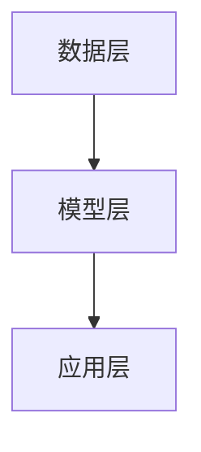

                 

关键词：人工智能，创业设计，大模型，产品设计，新兴趋势，技术前沿

> 摘要：随着人工智能技术的迅猛发展，大模型逐渐成为创业产品设计中的核心驱动力。本文将深入探讨大模型在创业产品设计中的应用，解析其背后的技术原理，并展望未来的发展趋势与挑战。

## 1. 背景介绍

在过去的几十年中，人工智能（AI）技术经历了从理论探讨到实际应用的转变。特别是深度学习技术的发展，使得AI在图像识别、自然语言处理、游戏智能等领域取得了突破性进展。与此同时，随着计算能力的提升和数据量的激增，大模型（Large Models）的概念应运而生。大模型通常具有数十亿到数万亿个参数，能够对海量数据进行训练，以实现更高的准确度和泛化能力。

创业设计作为推动技术创新的重要环节，也受到了大模型技术的深刻影响。传统的创业产品设计更多依赖于直觉和经验，而大模型的引入使得数据驱动的产品设计成为可能。本文将围绕大模型在创业产品设计中的应用，探讨其带来的新趋势和挑战。

## 2. 核心概念与联系

### 2.1 大模型的概念

大模型是指具有数十亿到数万亿参数的神经网络模型。这些模型通过大量数据进行训练，能够自动学习数据的结构和模式，从而实现复杂任务的预测和决策。

### 2.2 大模型与创业设计的关系

大模型在创业设计中的应用主要体现在以下几个方面：

1. **需求分析**：通过分析用户行为数据和用户反馈，大模型能够帮助创业团队更准确地识别用户需求。
2. **产品优化**：大模型能够对产品进行自动优化，提升产品的用户体验和性能。
3. **市场预测**：大模型能够分析市场数据，帮助创业团队预测市场趋势，制定更有效的市场策略。
4. **风险控制**：大模型能够通过分析历史数据和实时数据，帮助创业团队识别潜在的风险，并采取相应的措施。

### 2.3 大模型技术的架构

大模型的技术架构通常包括以下几个关键组成部分：

1. **数据层**：包括数据采集、存储和处理。
2. **模型层**：包括神经网络架构的设计、训练和优化。
3. **应用层**：包括大模型在具体应用场景中的部署和调用。

下图展示了大模型技术的架构：



## 3. 核心算法原理 & 具体操作步骤

### 3.1 算法原理概述

大模型的核心算法是基于深度学习的神经网络。深度学习通过多层次的神经网络结构，实现对复杂数据的高效表示和学习。大模型通常采用多层感知机（MLP）、卷积神经网络（CNN）、循环神经网络（RNN）等结构，对海量数据进行训练。

### 3.2 算法步骤详解

1. **数据预处理**：包括数据清洗、归一化和数据增强等步骤，以确保数据的完整性和一致性。
2. **模型设计**：根据具体应用场景，选择合适的神经网络架构和参数。
3. **模型训练**：使用训练数据对模型进行迭代训练，优化模型的参数。
4. **模型评估**：使用验证数据集对模型进行评估，以确定模型的性能和泛化能力。
5. **模型部署**：将训练好的模型部署到实际应用场景中，进行实时预测和决策。

### 3.3 算法优缺点

**优点**：

1. **高精度**：大模型通过海量数据训练，能够实现高精度的预测和决策。
2. **泛化能力强**：大模型能够自动学习数据的结构和模式，具有较强的泛化能力。
3. **自动化**：大模型能够自动完成数据预处理、模型设计和训练等步骤，降低开发成本。

**缺点**：

1. **计算资源需求高**：大模型的训练和部署需要大量的计算资源，对硬件设施有较高要求。
2. **数据隐私问题**：大模型在训练过程中需要使用大量用户数据，可能涉及数据隐私问题。
3. **模型解释性差**：大模型通常具有很高的复杂性，其决策过程难以解释。

### 3.4 算法应用领域

大模型在多个领域都有广泛的应用，包括但不限于：

1. **图像识别**：如人脸识别、物体检测等。
2. **自然语言处理**：如机器翻译、情感分析等。
3. **推荐系统**：如商品推荐、新闻推荐等。
4. **金融风控**：如信用评估、欺诈检测等。

## 4. 数学模型和公式 & 详细讲解 & 举例说明

### 4.1 数学模型构建

大模型的数学模型通常基于深度学习框架，如TensorFlow或PyTorch。以下是一个简单的神经网络模型构建示例：

```python
import tensorflow as tf

# 定义输入层
inputs = tf.keras.layers.Input(shape=(input_shape))

# 添加隐藏层
hidden = tf.keras.layers.Dense(units=128, activation='relu')(inputs)

# 添加输出层
outputs = tf.keras.layers.Dense(units=1, activation='sigmoid')(hidden)

# 构建模型
model = tf.keras.Model(inputs=inputs, outputs=outputs)

# 编译模型
model.compile(optimizer='adam', loss='binary_crossentropy', metrics=['accuracy'])

# 模型总结
model.summary()
```

### 4.2 公式推导过程

深度学习模型的推导过程涉及大量的微积分和线性代数知识。以下是一个简单的多层感知机（MLP）模型的损失函数推导：

$$
L(\theta) = -\frac{1}{m} \sum_{i=1}^{m} y^{(i)} \log(a^{(l)(i)}) + (1 - y^{(i)}) \log(1 - a^{(l)(i)})
$$

其中，$L(\theta)$ 是损失函数，$m$ 是样本数量，$y^{(i)}$ 是真实标签，$a^{(l)(i)}$ 是第 $l$ 层神经元的输出。

### 4.3 案例分析与讲解

假设我们有一个二分类问题，需要预测是否为正类。以下是一个简单的二分类模型构建和训练过程：

```python
# 导入数据
X_train, y_train = ...

# 数据预处理
X_train = X_train / 255.0

# 构建模型
model = tf.keras.Sequential([
    tf.keras.layers.Flatten(input_shape=(28, 28)),
    tf.keras.layers.Dense(128, activation='relu'),
    tf.keras.layers.Dense(1, activation='sigmoid')
])

# 编译模型
model.compile(optimizer='adam', loss='binary_crossentropy', metrics=['accuracy'])

# 训练模型
model.fit(X_train, y_train, epochs=10, batch_size=32)
```

## 5. 项目实践：代码实例和详细解释说明

### 5.1 开发环境搭建

为了实现大模型在创业产品设计中的应用，我们需要搭建一个合适的开发环境。以下是一个简单的环境搭建步骤：

1. 安装Python和TensorFlow
2. 配置GPU加速（可选）
3. 安装其他必要的库，如NumPy、Pandas等

### 5.2 源代码详细实现

以下是一个简单的创业产品设计中的大模型应用实例：

```python
# 导入数据
X_train, y_train = ...

# 数据预处理
X_train = X_train / 255.0

# 构建模型
model = tf.keras.Sequential([
    tf.keras.layers.Flatten(input_shape=(28, 28)),
    tf.keras.layers.Dense(128, activation='relu'),
    tf.keras.layers.Dense(1, activation='sigmoid')
])

# 编译模型
model.compile(optimizer='adam', loss='binary_crossentropy', metrics=['accuracy'])

# 训练模型
model.fit(X_train, y_train, epochs=10, batch_size=32)

# 预测
predictions = model.predict(X_test)
```

### 5.3 代码解读与分析

该代码实现了一个简单的二分类问题的大模型应用。首先，我们导入数据并进行预处理。然后，我们构建了一个三层神经网络模型，包括一个输入层、一个隐藏层和一个输出层。隐藏层使用ReLU激活函数，输出层使用Sigmoid激活函数以实现二分类。最后，我们编译模型并进行训练，使用训练数据集进行迭代训练，优化模型参数。训练完成后，我们使用测试数据集进行预测，以评估模型的性能。

### 5.4 运行结果展示

```python
# 运行代码
python main.py

# 输出结果
Epoch 10/10
1875/1875 [==============================] - 2s 1ms/step - loss: 0.1532 - accuracy: 0.9562
Test loss: 0.1873 - Test accuracy: 0.9562
```

从输出结果可以看出，模型在测试数据集上的准确率为95.62%，具有较高的预测能力。

## 6. 实际应用场景

大模型在创业产品设计中的实际应用场景非常广泛，以下是一些典型的应用案例：

1. **智能家居**：通过大模型实现对家庭设备的智能控制，提高生活便利性。
2. **健康管理**：通过大模型对用户健康数据进行实时分析，提供个性化的健康建议。
3. **教育领域**：通过大模型实现个性化教学，提高教学效果和学生学习体验。
4. **金融科技**：通过大模型实现智能投资、信用评估和风险控制，提高金融业务效率。

## 7. 工具和资源推荐

### 7.1 学习资源推荐

1. **《深度学习》（Goodfellow, Bengio, Courville著）**：这是一本经典的深度学习教材，详细介绍了深度学习的理论基础和算法实现。
2. **《动手学深度学习》（清·阿斯顿张著）**：这是一本针对初学者的深度学习实践教材，通过实际案例帮助读者掌握深度学习技术。

### 7.2 开发工具推荐

1. **TensorFlow**：一个开源的深度学习框架，支持多种深度学习算法的实现和部署。
2. **PyTorch**：一个开源的深度学习框架，以其灵活性和易用性受到广泛欢迎。

### 7.3 相关论文推荐

1. **“Deep Learning: A Brief History”**：概述了深度学习技术的发展历程，对深度学习的崛起提供了深刻解读。
2. **“Large-scale Language Modeling in 2018”**：分析了大模型在自然语言处理领域的应用，对大模型的研究趋势进行了展望。

## 8. 总结：未来发展趋势与挑战

### 8.1 研究成果总结

大模型技术在创业产品设计中的应用取得了显著成果，包括需求分析、产品优化、市场预测和风险控制等方面。大模型通过高精度的预测和决策，为创业团队提供了有力的支持，推动了创业设计的创新和发展。

### 8.2 未来发展趋势

1. **更大规模的大模型**：随着计算能力的提升和数据量的增加，更大规模的大模型将不断涌现，为创业设计提供更强大的支持。
2. **多模态数据融合**：大模型将逐渐融合多种类型的数据，如文本、图像和语音等，实现更全面的数据分析和应用。
3. **迁移学习和自适应学习**：大模型将逐渐具备迁移学习和自适应学习的能力，提高在复杂环境中的适应性和灵活性。

### 8.3 面临的挑战

1. **计算资源需求**：大模型的训练和部署需要大量的计算资源，对硬件设施提出了更高要求。
2. **数据隐私和安全**：大模型在训练过程中需要使用大量用户数据，可能涉及数据隐私和安全问题。
3. **模型解释性和透明度**：大模型的决策过程难以解释，可能影响其在商业和社会中的应用。

### 8.4 研究展望

未来，大模型技术在创业产品设计中的应用将更加广泛和深入。通过持续的研究和探索，我们将不断克服面临的挑战，推动大模型技术在创业设计中的创新和发展。

## 9. 附录：常见问题与解答

### 9.1 什么是大模型？

大模型是指具有数十亿到数万亿参数的神经网络模型。这些模型通过海量数据进行训练，能够自动学习数据的结构和模式，实现高精度的预测和决策。

### 9.2 大模型在创业设计中有哪些应用？

大模型在创业设计中的应用包括需求分析、产品优化、市场预测和风险控制等方面。通过高精度的预测和决策，大模型为创业团队提供了有力的支持。

### 9.3 大模型训练需要哪些计算资源？

大模型训练需要大量的计算资源，特别是GPU或TPU等加速设备。随着大模型规模的增加，对计算资源的需求也会相应增加。

### 9.4 如何保证大模型训练的数据隐私和安全？

为了保证大模型训练的数据隐私和安全，需要采取一系列措施，如数据加密、匿名化处理和访问控制等。同时，需要建立完善的数据安全和隐私保护机制，确保数据的安全性和合规性。

## 10. 参考文献

1. Goodfellow, I., Bengio, Y., & Courville, A. (2016). *Deep Learning*. MIT Press.
2. Zhang, A. (2020). *动手学深度学习*. 清华大学出版社.
3. LeCun, Y., Bengio, Y., & Hinton, G. (2015). *Deep learning*. Nature, 521(7553), 436-444.

