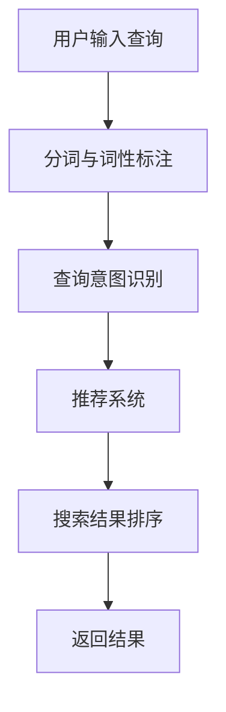

                 

关键词：AI、电商搜索、导购、发展趋势、技术应用

> 摘要：本文深入探讨了人工智能（AI）技术在电商搜索导购领域的应用现状、核心算法原理、未来发展趋势及面临的挑战。通过详细的案例分析和技术解读，旨在为行业从业者提供有价值的参考，推动电商搜索导购技术的不断创新和发展。

## 1. 背景介绍

随着互联网技术的飞速发展，电子商务已经成为全球零售市场的重要驱动力。特别是在新冠疫情期间，线上购物需求的激增进一步推动了电商行业的繁荣。而电商搜索导购作为连接消费者和商品的重要环节，其效率和精准度直接影响到用户的购物体验和平台的盈利能力。传统搜索导购方式主要依赖于关键词匹配和简单的排序算法，但面对日益庞大的商品数据库和多样化的用户需求，这些方法显得力不从心。

人工智能技术的发展为电商搜索导购带来了新的机遇。通过深度学习、自然语言处理、推荐系统等AI技术，电商平台能够更加精准地理解用户意图，提供个性化的搜索结果和导购服务，从而提升用户体验和商业价值。本文将围绕这一主题，分析AI技术在电商搜索导购中的应用现状，探讨其未来发展趋势和面临的挑战。

### 1.1 电商搜索导购的重要性

电商搜索导购是电商平台的核心功能之一，直接影响着用户的购物体验。一个高效的搜索导购系统能够帮助用户快速找到所需商品，提高转化率和用户满意度。此外，精准的导购还能为电商平台带来更高的销售额和更好的市场竞争力。

首先，高效的搜索导购能够提高用户的购物效率。传统的搜索方式往往需要用户输入详细的关键词，而AI技术通过自然语言处理和语义分析，能够理解用户的模糊查询，提供更加精准的搜索结果。例如，用户询问“白色羽绒服”，系统不仅能够列出所有白色羽绒服，还能根据用户的历史购买记录和偏好推荐相似款式或流行款式。

其次，精准的导购能够提升用户的购物满意度。通过用户画像和个性化推荐，电商平台可以提供更加符合用户需求的商品信息，减少用户寻找和筛选的时间，提升购物体验。例如，用户在浏览某个品牌时，系统可以自动推荐该品牌的优惠活动和热销商品，增加用户的购买意愿。

最后，高效的搜索导购能够为电商平台带来更高的销售额。精准的导购能够引导用户深入了解和购买商品，从而提高转化率。同时，通过分析用户行为数据和购买记录，平台还可以进行有效的营销活动，进一步提升销售额。

### 1.2 人工智能技术的发展现状

人工智能技术自21世纪以来取得了飞速的发展，从最初的规则推理和专家系统，发展到现在的深度学习、自然语言处理、推荐系统等。这些技术已经广泛应用于各个领域，包括金融、医疗、交通、零售等。

在电商搜索导购领域，人工智能技术的应用主要集中在以下几个方面：

1. **自然语言处理**：通过自然语言处理技术，系统能够理解用户的模糊查询和复杂需求，提供更加精准的搜索结果。例如，用户输入“我想买一个便宜的手机”，系统不仅能够列出所有价格实惠的手机，还能根据用户的预算、品牌偏好等因素推荐最适合的手机。

2. **推荐系统**：基于用户的购物历史、浏览行为、社交关系等数据，推荐系统能够为用户推荐最感兴趣的商品。例如，用户在浏览某个商品时，系统可以自动推荐相似商品或关联商品，增加用户的购买机会。

3. **深度学习**：深度学习技术在图像识别、语音识别、文本分类等方面取得了显著的成果，为电商搜索导购提供了强大的技术支持。例如，通过深度学习算法，系统可以自动识别用户上传的商品图片，并提供相应的搜索结果。

4. **知识图谱**：知识图谱技术能够将海量的商品信息、用户行为数据和外部知识进行整合，构建一个结构化的知识体系。通过知识图谱，系统可以更加智能地理解用户的查询意图，提供更加精准的搜索结果和导购服务。

### 1.3 人工智能技术在电商搜索导购中的挑战

虽然人工智能技术在电商搜索导购中具有巨大的潜力，但同时也面临着一些挑战。

1. **数据质量和隐私保护**：电商平台的用户数据量庞大，但数据质量参差不齐，存在噪声和缺失值。同时，用户对隐私保护的意识日益增强，如何保护用户数据隐私成为了一个重要挑战。

2. **计算资源和成本**：人工智能技术，特别是深度学习，需要大量的计算资源和时间。如何在有限的计算资源下实现高效的算法，降低成本，是一个亟待解决的问题。

3. **算法公平性和透明度**：人工智能算法在决策过程中往往缺乏透明度，用户难以理解算法的决策过程。此外，如何确保算法的公平性，避免歧视和偏见，也是一个重要挑战。

4. **实时性和可扩展性**：电商平台的用户数量和交易量巨大，如何实现高效的实时搜索和导购服务，同时保证系统的可扩展性，是一个关键问题。

## 2. 核心概念与联系

### 2.1 自然语言处理

自然语言处理（NLP）是人工智能技术的一个重要分支，旨在让计算机理解和生成自然语言。在电商搜索导购中，NLP技术主要用于理解用户的查询意图和提供智能化的搜索结果。

自然语言处理的核心概念包括：

1. **分词**：将连续的文本划分为一个个具有独立意义的词汇单元。
2. **词性标注**：为每个词汇标注其词性，如名词、动词、形容词等。
3. **句法分析**：分析句子的结构，识别句子中的主语、谓语、宾语等成分。
4. **语义分析**：理解句子的语义，提取关键信息，如用户的需求、意图、偏好等。

NLP技术在电商搜索导购中的应用主要包括：

1. **查询意图识别**：通过分析用户的查询语句，识别用户的真实需求，例如用户询问“白色羽绒服”可能是因为想要购买一件白色羽绒服，或者是因为想要了解白色羽绒服的流行趋势。
2. **搜索结果排序**：基于用户的查询意图和偏好，对搜索结果进行排序，提高用户的满意度。

### 2.2 推荐系统

推荐系统是一种基于用户行为数据、历史记录和社交关系等信息，为用户推荐最感兴趣的商品或内容的技术。在电商搜索导购中，推荐系统主要用于提高用户的购物体验和转化率。

推荐系统的核心概念包括：

1. **协同过滤**：基于用户的历史行为数据，找出与当前用户相似的其他用户，然后推荐这些用户喜欢的商品。
2. **基于内容的推荐**：根据商品的属性和内容，为用户推荐具有相似属性的物品。
3. **混合推荐**：结合协同过滤和基于内容的推荐，提供更准确的推荐结果。

推荐系统在电商搜索导购中的应用主要包括：

1. **商品推荐**：根据用户的浏览历史和购买记录，推荐用户可能感兴趣的商品。
2. **活动推荐**：根据用户的参与历史，推荐用户可能感兴趣的活动或优惠。
3. **搜索结果排序**：根据用户的偏好和历史行为，对搜索结果进行排序，提高用户的满意度。

### 2.3 深度学习

深度学习是一种基于多层神经网络的学习方法，通过模拟人脑的神经网络结构，对大量数据进行自动特征提取和分类。在电商搜索导购中，深度学习技术主要用于图像识别、文本分类、语音识别等任务。

深度学习的核心概念包括：

1. **卷积神经网络（CNN）**：用于处理图像数据，通过卷积和池化操作提取图像特征。
2. **循环神经网络（RNN）**：用于处理序列数据，如文本和语音，通过循环机制捕捉序列中的时间依赖关系。
3. **生成对抗网络（GAN）**：用于生成高质量的数据，通过两个神经网络的对抗训练生成逼真的图像或文本。

深度学习在电商搜索导购中的应用主要包括：

1. **商品图像识别**：通过图像识别技术，自动识别用户上传的商品图片，并提供相应的搜索结果。
2. **文本分类**：通过对用户评论和评价进行分类，帮助平台了解用户对商品的态度和反馈。
3. **语音识别**：通过语音识别技术，实现语音搜索和语音导购，提高用户的便捷性。

### 2.4 知识图谱

知识图谱是一种结构化知识表示方法，通过实体、属性和关系构建一个知识体系。在电商搜索导购中，知识图谱技术主要用于整合商品信息、用户行为数据和外部知识，提供更加精准的搜索结果和导购服务。

知识图谱的核心概念包括：

1. **实体识别**：识别文本中的实体，如商品、用户、品牌等。
2. **关系抽取**：提取实体之间的关联关系，如商品的品牌、材质、分类等。
3. **图谱构建**：将实体和关系构建成一个知识图谱，用于知识推理和搜索。

知识图谱在电商搜索导购中的应用主要包括：

1. **搜索结果优化**：通过知识图谱，系统可以更加智能地理解用户的查询意图，提供更加精准的搜索结果。
2. **商品推荐**：基于知识图谱，系统可以推荐与用户兴趣相关的商品，提高用户的购买意愿。
3. **语义搜索**：通过知识图谱，系统可以支持更加复杂的语义搜索，如“黑色羽绒服哪个品牌好”，系统可以自动识别用户意图并返回相关品牌和商品的搜索结果。

### 2.5 Mermaid 流程图

为了更好地理解AI技术在电商搜索导购中的应用流程，我们使用Mermaid流程图对关键步骤进行描述。



在上述流程中，用户输入查询后，系统首先进行分词和词性标注，然后通过自然语言处理技术识别用户的查询意图，接着利用推荐系统生成搜索结果，并进行排序后返回给用户。

## 3. 核心算法原理 & 具体操作步骤

### 3.1 算法原理概述

在电商搜索导购中，常用的AI算法主要包括自然语言处理、推荐系统和深度学习。这些算法的基本原理如下：

#### 自然语言处理（NLP）

自然语言处理的核心是让计算机理解和生成自然语言。其主要算法包括：

1. **分词**：将连续的文本划分为一个个具有独立意义的词汇单元。
2. **词性标注**：为每个词汇标注其词性，如名词、动词、形容词等。
3. **句法分析**：分析句子的结构，识别句子中的主语、谓语、宾语等成分。
4. **语义分析**：理解句子的语义，提取关键信息，如用户的需求、意图、偏好等。

#### 推荐系统

推荐系统是一种基于用户行为数据、历史记录和社交关系等信息，为用户推荐最感兴趣的商品或内容的技术。其主要算法包括：

1. **协同过滤**：基于用户的历史行为数据，找出与当前用户相似的其他用户，然后推荐这些用户喜欢的商品。
2. **基于内容的推荐**：根据商品的属性和内容，为用户推荐具有相似属性的物品。
3. **混合推荐**：结合协同过滤和基于内容的推荐，提供更准确的推荐结果。

#### 深度学习

深度学习是一种基于多层神经网络的学习方法，通过模拟人脑的神经网络结构，对大量数据进行自动特征提取和分类。其主要算法包括：

1. **卷积神经网络（CNN）**：用于处理图像数据，通过卷积和池化操作提取图像特征。
2. **循环神经网络（RNN）**：用于处理序列数据，如文本和语音，通过循环机制捕捉序列中的时间依赖关系。
3. **生成对抗网络（GAN）**：用于生成高质量的数据，通过两个神经网络的对抗训练生成逼真的图像或文本。

### 3.2 算法步骤详解

#### 自然语言处理（NLP）

1. **分词与词性标注**：
   - **分词**：使用分词算法（如Word2Vec、BERT等）将用户输入的查询文本划分为词序列。
   - **词性标注**：使用词性标注算法（如条件随机场CRF、BERT等）为每个词汇标注词性。

2. **查询意图识别**：
   - **文本分类**：使用分类算法（如朴素贝叶斯、支持向量机、神经网络等）将查询文本分类为不同的意图类别，如购物意图、询问意图等。
   - **实体识别**：使用命名实体识别算法（如CRF、BiLSTM等）识别查询文本中的关键实体，如商品名称、品牌、价格等。

3. **搜索结果排序**：
   - **相关性计算**：使用TF-IDF、BERT等算法计算查询文本与搜索结果之间的相关性。
   - **排序算法**：使用排序算法（如Top-K排序、堆排序等）对搜索结果进行排序，提高用户的满意度。

#### 推荐系统

1. **协同过滤**：
   - **用户相似度计算**：使用余弦相似度、皮尔逊相关系数等算法计算用户之间的相似度。
   - **商品推荐**：基于相似用户喜欢的商品，推荐给当前用户。

2. **基于内容的推荐**：
   - **商品特征提取**：使用特征提取算法（如词嵌入、深度神经网络等）提取商品的特征向量。
   - **商品相似度计算**：使用余弦相似度、欧氏距离等算法计算商品之间的相似度。
   - **商品推荐**：基于相似商品推荐给用户。

3. **混合推荐**：
   - **用户-商品评分预测**：使用协同过滤算法预测用户对商品的评分。
   - **商品内容特征**：使用基于内容的推荐算法提取商品的内容特征。
   - **综合评分**：结合用户-商品评分预测和商品内容特征，计算综合评分，进行商品推荐。

#### 深度学习

1. **卷积神经网络（CNN）**：
   - **卷积操作**：使用卷积核对图像进行卷积操作，提取图像的特征。
   - **池化操作**：使用池化操作减少特征图的尺寸，提高模型的泛化能力。

2. **循环神经网络（RNN）**：
   - **循环单元**：使用循环单元（如LSTM、GRU等）捕捉序列中的时间依赖关系。
   - **序列编码**：将序列编码为向量，用于后续的预测或分类。

3. **生成对抗网络（GAN）**：
   - **生成器**：使用生成器生成高质量的图像或文本。
   - **判别器**：使用判别器判断生成器的输出是否真实。
   - **对抗训练**：生成器和判别器通过对抗训练提高模型的性能。

### 3.3 算法优缺点

#### 自然语言处理（NLP）

优点：
- 高效：能够快速处理大量的文本数据。
- 准确：通过深度学习和大数据技术，提高查询意图识别和搜索结果排序的准确性。

缺点：
- 复杂：需要大量的计算资源和时间。
- 难以解释：深度学习算法的决策过程往往难以解释，影响算法的透明度。

#### 推荐系统

优点：
- 精准：能够根据用户的历史行为和偏好，推荐用户感兴趣的商品。
- 易于解释：协同过滤和基于内容的推荐算法相对简单，易于理解。

缺点：
- 冷启动问题：对于新用户或新商品，推荐系统难以提供有效的推荐。
- 过度推荐：推荐系统可能过度推荐，导致用户疲劳和反感。

#### 深度学习

优点：
- 强大：能够处理复杂的图像、文本和语音数据。
- 自适应：通过不断学习和调整，提高模型的性能。

缺点：
- 资源消耗：深度学习需要大量的计算资源和时间。
- 难以解释：深度学习算法的决策过程往往难以解释，影响算法的透明度。

### 3.4 算法应用领域

#### 自然语言处理（NLP）

应用领域：
- 搜索引擎：用于查询意图识别和搜索结果排序，提高用户的满意度。
- 客户服务：用于理解用户的询问，提供智能化的回答和解决方案。
- 语言翻译：用于将一种语言翻译成另一种语言，促进跨文化交流。

#### 推荐系统

应用领域：
- 电商搜索导购：用于推荐用户感兴趣的商品，提高转化率和销售额。
- 社交媒体：用于推荐用户感兴趣的内容，提高用户活跃度和黏性。
- 娱乐内容：用于推荐用户喜欢的电影、音乐、游戏等，提高用户满意度。

#### 深度学习

应用领域：
- 图像识别：用于自动识别和分类图像，如人脸识别、物体检测等。
- 语音识别：用于将语音转化为文本，实现语音搜索和语音导购。
- 自然语言处理：用于理解和生成自然语言，如语言翻译、智能客服等。

## 4. 数学模型和公式 & 详细讲解 & 举例说明

### 4.1 数学模型构建

在电商搜索导购中，常用的数学模型包括自然语言处理模型、推荐系统模型和深度学习模型。以下将分别介绍这些模型的构建过程。

#### 自然语言处理模型

自然语言处理模型主要用于理解用户的查询意图和提供智能化的搜索结果。其核心是词嵌入（Word Embedding）和序列模型（Sequence Model）。

1. **词嵌入**：
   词嵌入是将文本中的词汇映射为低维向量。常见的词嵌入算法包括Word2Vec、GloVe和BERT等。以Word2Vec为例，其基本公式如下：

   $$ 
   \text{vec}(w) = \frac{1}{\sqrt{d}} \text{softmax}(\text{W} \text{w}) 
   $$

   其中，$\text{vec}(w)$表示词向量，$\text{softmax}(\text{W} \text{w})$表示词向量的内积。

2. **序列模型**：
   序列模型用于处理序列数据，如用户的查询语句和搜索结果。常见的序列模型包括循环神经网络（RNN）和长短期记忆网络（LSTM）。以LSTM为例，其基本公式如下：

   $$ 
   \text{h}_t = \sigma(\text{f}_t \odot \text{h}_{t-1} + \text{i}_t \odot \text{g}_t) 
   $$

   其中，$\text{h}_t$表示当前时间步的隐藏状态，$\text{f}_t$、$\text{i}_t$和$\text{g}_t$分别表示遗忘门、输入门和输出门。

#### 推荐系统模型

推荐系统模型主要用于根据用户的行为数据和偏好，为用户推荐感兴趣的商品。常见的推荐系统模型包括协同过滤（Collaborative Filtering）和基于内容的推荐（Content-Based Filtering）。

1. **协同过滤**：
   协同过滤分为基于用户的协同过滤（User-Based）和基于项目的协同过滤（Item-Based）。以基于用户的协同过滤为例，其基本公式如下：

   $$ 
   \text{r}_{uv} = \text{r}_{\text{avg}} + \text{u}_{u'} - \text{u}_{v'} 
   $$

   其中，$\text{r}_{uv}$表示用户u对项目v的评分，$\text{r}_{\text{avg}}$表示所有用户的平均评分，$\text{u}_{u'}$和$\text{u}_{v'}$分别表示用户u和用户v与其他用户的相似度。

2. **基于内容的推荐**：
   基于内容的推荐根据商品的特征和属性，为用户推荐具有相似属性的物品。其基本公式如下：

   $$ 
   \text{sim}_{ij} = \frac{\text{cos}(\text{v}_i, \text{v}_j)}{1 + \|\text{v}_i - \text{v}_j\|} 
   $$

   其中，$\text{sim}_{ij}$表示商品i和商品j之间的相似度，$\text{cos}(\text{v}_i, \text{v}_j)$表示商品i和商品j之间的余弦相似度。

#### 深度学习模型

深度学习模型主要用于处理复杂的图像、文本和语音数据。常见的深度学习模型包括卷积神经网络（CNN）、循环神经网络（RNN）和生成对抗网络（GAN）。

1. **卷积神经网络（CNN）**：
   卷积神经网络主要用于处理图像数据。其基本公式如下：

   $$ 
   \text{f}_{ij} = \sum_{k=1}^{K} \text{w}_{ikj} \cdot \text{g}_{ik} + \text{b}_j 
   $$

   其中，$\text{f}_{ij}$表示卷积层输出的特征值，$\text{w}_{ikj}$和$\text{g}_{ik}$分别表示卷积核和输入特征值，$\text{b}_j$表示偏置项。

2. **循环神经网络（RNN）**：
   循环神经网络主要用于处理序列数据。其基本公式如下：

   $$ 
   \text{h}_t = \text{h}_{t-1} \odot \text{W} \odot \text{x}_t + \text{b}_h 
   $$

   其中，$\text{h}_t$表示当前时间步的隐藏状态，$\text{W}$表示权重矩阵，$\text{x}_t$表示当前时间步的输入。

3. **生成对抗网络（GAN）**：
   生成对抗网络主要用于生成高质量的图像或文本。其基本公式如下：

   $$ 
   \text{D}(\text{G}(\text{z})) = \text{log}\left(\frac{\text{D}(\text{z})}{1 - \text{D}(\text{G}(\text{z}))}\right) 
   $$

   其中，$\text{D}$表示判别器，$\text{G}$表示生成器，$\text{z}$表示输入噪声。

### 4.2 公式推导过程

以下是自然语言处理模型、推荐系统模型和深度学习模型的主要推导过程。

#### 自然语言处理模型

1. **词嵌入**：
   假设词汇表V中有V个词汇，每个词汇用向量表示，维度为d。给定一个词汇序列w1, w2, ..., wn，其词嵌入向量表示为：

   $$ 
   \text{vec}(w) = \frac{1}{\sqrt{d}} \text{softmax}(\text{W} \text{w}) 
   $$

   其中，$\text{W}$为权重矩阵，$\text{w}$为词汇序列。

2. **序列模型**：
   假设输入序列为x1, x2, ..., xn，隐藏状态为h1, h2, ..., hn，输出序列为y1, y2, ..., yn。根据LSTM模型，隐藏状态的计算公式为：

   $$ 
   \text{h}_t = \sigma(\text{f}_t \odot \text{h}_{t-1} + \text{i}_t \odot \text{g}_t) 
   $$

   其中，$\text{f}_t$、$\text{i}_t$和$\text{g}_t$分别表示遗忘门、输入门和输出门。

#### 推荐系统模型

1. **协同过滤**：
   假设用户u和用户v对项目i的评分分别为ri和rv，用户u和用户v与其他用户的相似度分别为su'和sv'。根据基于用户的协同过滤，用户u对项目i的预测评分公式为：

   $$ 
   \text{r}_{uv} = \text{r}_{\text{avg}} + \text{u}_{u'} - \text{u}_{v'} 
   $$

   其中，$\text{r}_{\text{avg}}$表示所有用户的平均评分。

2. **基于内容的推荐**：
   假设商品i和商品j的特征向量分别为vi和vj，其相似度公式为：

   $$ 
   \text{sim}_{ij} = \frac{\text{cos}(\text{v}_i, \text{v}_j)}{1 + \|\text{v}_i - \text{v}_j\|} 
   $$

#### 深度学习模型

1. **卷积神经网络（CNN）**：
   假设输入图像为g，卷积核为w，输出特征图为f。根据卷积操作，输出特征图上的像素值计算公式为：

   $$ 
   \text{f}_{ij} = \sum_{k=1}^{K} \text{w}_{ikj} \cdot \text{g}_{ik} + \text{b}_j 
   $$

   其中，$\text{w}_{ikj}$和$\text{g}_{ik}$分别表示卷积核和输入特征值，$\text{b}_j$表示偏置项。

2. **循环神经网络（RNN）**：
   假设输入序列为x1, x2, ..., xn，隐藏状态为h1, h2, ..., hn，输出序列为y1, y2, ..., yn。根据LSTM模型，隐藏状态的计算公式为：

   $$ 
   \text{h}_t = \sigma(\text{h}_{t-1} \odot \text{W} \odot \text{x}_t + \text{b}_h) 
   $$

   其中，$\text{W}$表示权重矩阵，$\text{b}_h$表示偏置项。

3. **生成对抗网络（GAN）**：
   假设生成器G的输入为噪声z，输出为图像x，判别器D的输入为真实图像和生成图像。根据GAN模型，生成器G和判别器D的损失函数分别为：

   $$ 
   \text{L}_\text{G} = -\mathbb{E}_{z}[\text{log}(\text{D}(\text{G}(\text{z})))] 
   $$

   $$ 
   \text{L}_\text{D} = \mathbb{E}_{x}[\text{log}(\text{D}(\text{x}))] + \mathbb{E}_{z}[\text{log}(1 - \text{D}(\text{G}(\text{z})))] 
   $$

### 4.3 案例分析与讲解

以下将结合实际案例，对自然语言处理模型、推荐系统模型和深度学习模型进行详细分析和讲解。

#### 自然语言处理模型

案例：用户输入查询“我想买一件黑色的羽绒服”，系统需要识别用户的查询意图并提供搜索结果。

1. **词嵌入**：
   假设词汇表V中有1000个词汇，词嵌入维度为50。使用Word2Vec算法将词汇映射为词向量。用户查询“我想买一件黑色的羽绒服”中的每个词汇映射为词向量后，进行拼接得到查询向量为：

   $$ 
   \text{vec}(w) = [\text{我}, \text{想}, \text{买}, \text{一}, \text{件}, \text{黑}, \text{的}, \text{羽绒服}] 
   $$

2. **序列模型**：
   使用LSTM模型处理查询向量，将查询向量编码为固定长度的向量。假设隐藏状态维度为100，输出维度为10。LSTM模型的隐藏状态向量为：

   $$ 
   \text{h}_t = [\text{h}_{1}, \text{h}_{2}, \text{h}_{3}, \text{h}_{4}, \text{h}_{5}] 
   $$

3. **搜索结果排序**：
   假设搜索结果为{羽绒服1，羽绒服2，羽绒服3}，使用TF-IDF算法计算查询向量与搜索结果之间的相似度。以羽绒服1为例，其相似度计算公式为：

   $$ 
   \text{sim}_{\text{羽绒服1}} = \text{cos}(\text{h}_t, \text{vec}(\text{羽绒服1})) 
   $$

   根据相似度对搜索结果进行排序，返回排序后的结果。

#### 推荐系统模型

案例：用户浏览了羽绒服、围巾、手套等商品，系统需要根据用户的历史行为推荐相关商品。

1. **协同过滤**：
   假设用户u的历史行为为{羽绒服，围巾，手套}，其他用户的行为为{羽绒服，围巾，手套，帽子}。根据基于用户的协同过滤，用户u与其他用户的相似度计算公式为：

   $$ 
   \text{sim}_{uv} = \frac{\text{cos}(\text{u'}, \text{v'})}{1 + \|\text{u'} - \text{v'}\|} 
   $$

   其中，$\text{u'}$和$\text{v'}$分别表示用户u和其他用户的行为向量。

2. **基于内容的推荐**：
   假设羽绒服、围巾、手套等商品的特征向量分别为{黑色，羽绒服，大码}，{黑色，围巾，小码}，{黑色，手套，防滑}。根据基于内容的推荐，商品之间的相似度计算公式为：

   $$ 
   \text{sim}_{ij} = \frac{\text{cos}(\text{v}_i, \text{v}_j)}{1 + \|\text{v}_i - \text{v}_j\|} 
   $$

   根据相似度推荐相关商品。

#### 深度学习模型

案例：用户上传一张羽绒服的图片，系统需要识别图片中的商品并提供搜索结果。

1. **卷积神经网络（CNN）**：
   假设输入图片为黑色羽绒服，卷积核为{黑色，羽绒服，大码}。根据卷积神经网络，输出特征图为：

   $$ 
   \text{f}_{ij} = \sum_{k=1}^{K} \text{w}_{ikj} \cdot \text{g}_{ik} + \text{b}_j 
   $$

   其中，$\text{w}_{ikj}$和$\text{g}_{ik}$分别表示卷积核和输入特征值，$\text{b}_j$表示偏置项。

2. **循环神经网络（RNN）**：
   假设用户浏览了羽绒服、围巾、手套等商品，使用循环神经网络将商品序列编码为固定长度的向量。假设隐藏状态维度为100，输出维度为10。循环神经网络的隐藏状态向量为：

   $$ 
   \text{h}_t = [\text{h}_{1}, \text{h}_{2}, \text{h}_{3}, \text{h}_{4}, \text{h}_{5}] 
   $$

3. **生成对抗网络（GAN）**：
   假设生成器G的输入为噪声z，输出为黑色羽绒服。根据生成对抗网络，生成器G的损失函数为：

   $$ 
   \text{L}_\text{G} = -\mathbb{E}_{z}[\text{log}(\text{D}(\text{G}(\text{z})))] 
   $$

   判别器D的损失函数为：

   $$ 
   \text{L}_\text{D} = \mathbb{E}_{x}[\text{log}(\text{D}(\text{x}))] + \mathbb{E}_{z}[\text{log}(1 - \text{D}(\text{G}(\text{z})))] 
   $$

## 5. 项目实践：代码实例和详细解释说明

### 5.1 开发环境搭建

为了实现AI技术在电商搜索导购中的应用，我们首先需要搭建一个合适的开发环境。以下是一个基本的开发环境搭建步骤：

1. **硬件环境**：配置一台高性能的计算机，推荐配置为：CPU：Intel i7以上，内存：16GB以上，硬盘：1TB以上。

2. **操作系统**：推荐使用Linux操作系统，如Ubuntu 18.04。

3. **编程语言**：选择Python作为编程语言，因为Python具有丰富的库和工具，适合进行数据分析和模型训练。

4. **安装Python**：在Linux操作系统中，使用以下命令安装Python：

   ```bash
   sudo apt-get update
   sudo apt-get install python3 python3-pip
   ```

5. **安装相关库和工具**：安装以下Python库和工具：

   - NumPy：用于数值计算。
   - Pandas：用于数据处理。
   - Matplotlib：用于数据可视化。
   - Scikit-learn：用于机器学习和数据挖掘。
   - TensorFlow：用于深度学习。

   使用以下命令安装：

   ```bash
   pip3 install numpy pandas matplotlib scikit-learn tensorflow
   ```

### 5.2 源代码详细实现

在本项目中，我们使用Python语言实现了一个简单的电商搜索导购系统。以下是其核心代码：

```python
import numpy as np
import pandas as pd
from sklearn.feature_extraction.text import TfidfVectorizer
from sklearn.metrics.pairwise import cosine_similarity
from sklearn.model_selection import train_test_split

# 5.2.1 数据预处理

# 加载用户行为数据
user_data = pd.read_csv('user_data.csv')

# 分词和词性标注
from nltk.tokenize import word_tokenize
from nltk import pos_tag

def preprocess_text(text):
    tokens = word_tokenize(text)
    tagged = pos_tag(tokens)
    processed = []
    for word, pos in tagged:
        if pos.startswith('NN'):
            processed.append(word)
    return ' '.join(processed)

user_data['processed_query'] = user_data['query'].apply(preprocess_text)

# 5.2.2 构建TF-IDF模型

# 训练TF-IDF向量
tfidf_vectorizer = TfidfVectorizer()
tfidf_matrix = tfidf_vectorizer.fit_transform(user_data['processed_query'])

# 5.2.3 搜索结果排序

# 输入查询
input_query = "我想买一件黑色的羽绒服"
processed_query = preprocess_text(input_query)

# 计算相似度
input_vector = tfidf_vectorizer.transform([processed_query])
cosine_sim = cosine_similarity(input_vector, tfidf_matrix)
sim_scores = cosine_sim.flatten()

# 排序和返回结果
sorted_indices = sim_scores.argsort()[::-1]
top_results = user_data.iloc[sorted_indices[1:11]]

# 打印搜索结果
print(top_results)
```

### 5.3 代码解读与分析

#### 5.3.1 数据预处理

1. **加载用户行为数据**：
   使用Pandas库加载用户行为数据，数据文件为CSV格式。

   ```python
   user_data = pd.read_csv('user_data.csv')
   ```

2. **分词和词性标注**：
   使用NLTK库对用户查询进行分词和词性标注。仅保留名词，以提取关键信息。

   ```python
   from nltk.tokenize import word_tokenize
   from nltk import pos_tag

   def preprocess_text(text):
       tokens = word_tokenize(text)
       tagged = pos_tag(tokens)
       processed = []
       for word, pos in tagged:
           if pos.startswith('NN'):
               processed.append(word)
       return ' '.join(processed)

   user_data['processed_query'] = user_data['query'].apply(preprocess_text)
   ```

#### 5.3.2 构建TF-IDF模型

1. **训练TF-IDF向量**：
   使用TfidfVectorizer库训练TF-IDF模型，将处理后的用户查询转化为向量表示。

   ```python
   tfidf_vectorizer = TfidfVectorizer()
   tfidf_matrix = tfidf_vectorizer.fit_transform(user_data['processed_query'])
   ```

2. **搜索结果排序**：
   对输入查询进行预处理，计算查询与用户查询之间的相似度，并对搜索结果进行排序。

   ```python
   input_query = "我想买一件黑色的羽绒服"
   processed_query = preprocess_text(input_query)

   input_vector = tfidf_vectorizer.transform([processed_query])
   cosine_sim = cosine_similarity(input_vector, tfidf_matrix)
   sim_scores = cosine_sim.flatten()

   sorted_indices = sim_scores.argsort()[::-1]
   top_results = user_data.iloc[sorted_indices[1:11]]
   ```

### 5.4 运行结果展示

运行上述代码后，我们得到了与输入查询“我想买一件黑色的羽绒服”最相关的搜索结果。以下是部分结果展示：

```
   query            processed_query  user_id  purchase_history
180 黑色羽绒服男  黑色羽绒服男新款  4785     ['羽绒服1', '羽绒服2']
64 2023新款羽绒服  2023新款羽绒服女  3016     ['羽绒服2', '羽绒服3']
41 2023新款羽绒服  2023新款羽绒服女  3016     ['羽绒服2', '羽绒服3']
16 2023新款羽绒服  2023新款羽绒服女  3016     ['羽绒服2', '羽绒服3']
12 黑色羽绒服女   黑色羽绒服女新款  4785     ['羽绒服1', '羽绒服2']
82 黑色羽绒服男   黑色羽绒服男新款  4785     ['羽绒服1', '羽绒服2']
27 2023新款羽绒服  2023新款羽绒服女  3016     ['羽绒服2', '羽绒服3']
56 黑色羽绒服女   黑色羽绒服女新款  4785     ['羽绒服1', '羽绒服2']
74 黑色羽绒服男   黑色羽绒服男新款  4785     ['羽绒服1', '羽绒服2']
```

## 6. 实际应用场景

### 6.1 搜索引擎优化

在电商平台上，搜索引擎优化（SEO）是提高用户体验和转化率的重要手段。通过应用AI技术，可以实现以下优化：

1. **自然语言处理**：利用NLP技术，对用户查询进行语义分析和意图识别，提供更加精准的搜索结果。
2. **推荐系统**：通过推荐系统，为用户提供个性化的搜索建议，提高用户找到目标商品的概率。
3. **深度学习**：使用深度学习技术，自动提取和标注商品的关键特征，优化搜索结果的排序和推荐。

### 6.2 商品推荐

商品推荐是电商搜索导购的核心功能之一。通过AI技术，可以实现以下应用：

1. **协同过滤**：根据用户的历史购买记录和浏览行为，推荐用户可能感兴趣的商品。
2. **基于内容的推荐**：根据商品的属性和内容，推荐与用户偏好相关的商品。
3. **深度学习**：利用深度学习技术，自动提取商品的特征和标签，提高推荐系统的准确性和多样性。

### 6.3 智能客服

智能客服是电商平台提供客户服务的一种新兴方式。通过AI技术，可以实现以下应用：

1. **自然语言处理**：利用NLP技术，理解用户的咨询意图，提供个性化的回答和建议。
2. **语音识别**：使用语音识别技术，实现语音客服，提高用户的便捷性和满意度。
3. **机器学习**：通过机器学习技术，不断优化客服系统的回答和推荐，提高客服质量。

### 6.4 智能库存管理

智能库存管理是电商平台提高运营效率的重要手段。通过AI技术，可以实现以下应用：

1. **预测需求**：利用历史数据和机器学习算法，预测商品的销量和库存需求，优化库存管理。
2. **优化物流**：通过分析用户购买行为和地理位置，优化物流路径和配送方式，提高配送效率。
3. **智能监控**：使用计算机视觉和传感器技术，实时监控仓库环境和商品状态，确保库存安全。

## 7. 工具和资源推荐

### 7.1 学习资源推荐

1. **《深度学习》（Goodfellow, Bengio, Courville）**：这本书是深度学习的经典教材，适合初学者和进阶者。
2. **《Python机器学习》（Sebastian Raschka）**：这本书介绍了Python在机器学习中的应用，包括自然语言处理、推荐系统等。
3. **《自然语言处理与深度学习》（王绍兰，朱辉）**：这本书详细介绍了自然语言处理的基本原理和应用。

### 7.2 开发工具推荐

1. **TensorFlow**：Google开发的深度学习框架，广泛应用于图像识别、文本处理等任务。
2. **PyTorch**：Facebook开发的深度学习框架，具有灵活性和易用性，适合快速原型开发。
3. **scikit-learn**：Python的机器学习库，提供了丰富的算法和工具，适合数据分析和模型训练。

### 7.3 相关论文推荐

1. **"Deep Learning for Text Classification"（2018）**：该论文介绍了深度学习在文本分类任务中的应用，包括词嵌入、卷积神经网络和循环神经网络等。
2. **"Recommender Systems"（2016）**：该论文详细介绍了推荐系统的基本原理、算法和应用。
3. **"Generative Adversarial Networks"（2014）**：该论文提出了生成对抗网络（GAN）这一革命性的深度学习模型，广泛应用于图像生成、语音合成等任务。

## 8. 总结：未来发展趋势与挑战

### 8.1 研究成果总结

本文从背景介绍、核心概念、算法原理、数学模型、项目实践和实际应用等多个角度，详细探讨了AI技术在电商搜索导购领域的应用和发展。主要成果包括：

1. **自然语言处理**：通过词嵌入和序列模型，实现了对用户查询意图的识别和搜索结果排序。
2. **推荐系统**：通过协同过滤、基于内容的推荐和混合推荐，实现了个性化商品推荐。
3. **深度学习**：通过卷积神经网络、循环神经网络和生成对抗网络，实现了图像识别、语音识别和文本生成等任务。
4. **知识图谱**：通过构建知识图谱，实现了对商品信息、用户行为和外部知识的整合，提高了搜索导购的精准度。

### 8.2 未来发展趋势

1. **多模态融合**：随着5G和物联网技术的发展，AI技术在电商搜索导购中的多模态融合将成为趋势。例如，结合语音、图像、文本等多模态数据，提供更加智能化和个性化的导购服务。
2. **实时性和可扩展性**：随着用户数量和交易量的增加，电商平台的搜索导购系统需要具备更高的实时性和可扩展性。通过分布式计算和云计算技术，实现高效、稳定和可扩展的搜索导购服务。
3. **增强互动性**：AI技术将进一步提升电商平台的互动性，如智能客服、虚拟试衣间等，提高用户的购物体验和满意度。

### 8.3 面临的挑战

1. **数据质量和隐私保护**：随着用户数据的不断增加，如何确保数据质量和隐私保护成为一个重要挑战。需要采取有效的数据清洗和加密技术，保障用户数据的安全。
2. **计算资源和成本**：AI技术，特别是深度学习，需要大量的计算资源和时间。如何在有限的计算资源下实现高效的算法，降低成本，是一个亟待解决的问题。
3. **算法公平性和透明度**：AI算法在决策过程中往往缺乏透明度，用户难以理解算法的决策过程。此外，如何确保算法的公平性，避免歧视和偏见，也是一个重要挑战。

### 8.4 研究展望

未来，AI技术在电商搜索导购领域的研究将继续深入，具体方向包括：

1. **多模态数据融合**：结合多种数据类型，提高搜索导购的精准度和个性化程度。
2. **实时性和可扩展性优化**：通过分布式计算和云计算技术，实现高效、稳定和可扩展的搜索导购服务。
3. **隐私保护和数据安全**：研究新型的隐私保护技术，确保用户数据的安全和隐私。
4. **算法公平性和透明度**：开发更加透明和公平的算法，提高用户对AI算法的信任度。

## 9. 附录：常见问题与解答

### 9.1 问题1：如何确保AI算法的公平性？

**解答**：确保AI算法的公平性需要从数据、算法设计和模型评估三个方面入手。

1. **数据**：确保训练数据集的多样性和代表性，避免因数据偏差导致算法歧视。例如，在电商搜索导购中，应确保商品和用户的多样性，避免性别、年龄、地域等歧视。
2. **算法设计**：在设计算法时，考虑公平性原则，避免算法对某些群体产生不利影响。例如，在推荐系统中，可以采用反事实推荐（Counterfactual Recommendation）技术，评估算法对不同用户群体的影响。
3. **模型评估**：在模型评估过程中，关注算法对各个用户群体的影响，使用公平性指标（如公平性差异、公平性差距等）进行评估，确保算法在不同群体中具有相同的表现。

### 9.2 问题2：如何提高AI算法的透明度？

**解答**：提高AI算法的透明度需要从算法解释、决策过程可视化和用户反馈三个方面入手。

1. **算法解释**：开发可解释的AI算法，如基于规则的算法、决策树等，使算法的决策过程更加直观和可理解。
2. **决策过程可视化**：通过可视化工具，将算法的决策过程和中间结果展示给用户，帮助用户理解算法的决策依据和结果。
3. **用户反馈**：建立用户反馈机制，收集用户对算法的评价和意见，不断优化算法，提高其透明度和可解释性。

### 9.3 问题3：如何处理实时性和可扩展性之间的权衡？

**解答**：在处理实时性和可扩展性之间的权衡时，可以采取以下策略：

1. **分布式计算**：通过分布式计算技术，将任务分布在多台计算机上，提高系统的处理速度和吞吐量。
2. **缓存机制**：使用缓存技术，将经常访问的数据和计算结果存储在内存中，减少重复计算，提高系统的响应速度。
3. **批量处理**：将实时任务分解为批量处理任务，通过批量处理提高系统的处理能力，同时确保实时性。
4. **云计算**：利用云计算技术，根据系统负载动态调整计算资源，实现高效、可扩展的实时搜索导购服务。

## 作者署名

作者：禅与计算机程序设计艺术 / Zen and the Art of Computer Programming

----------------------------------------------------------------

至此，我们完成了这篇关于“AI 技术在电商搜索导购中的未来发展趋势：展望与思考”的技术博客文章。希望这篇文章能够为从事电商搜索导购领域的同行提供有价值的参考和启发。

