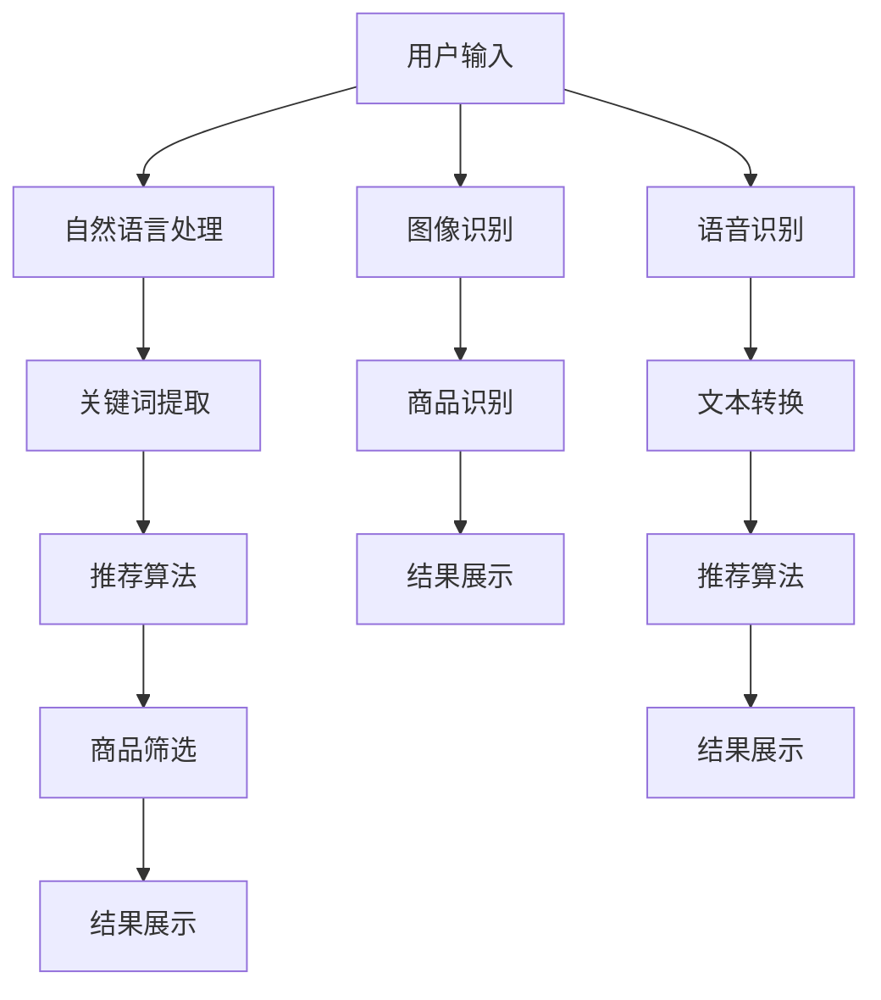

                 

### 关键词 Keywords

- AI 技术
- 电商搜索
- 搜索导购
- 未来趋势
- 算法原理
- 数学模型
- 项目实践
- 实际应用
- 工具推荐
- 研究展望

<|assistant|>### 摘要 Abstract

本文深入探讨了人工智能技术在电商搜索导购领域的应用与发展趋势。首先，我们回顾了电商搜索导购的背景和现状，接着详细介绍了核心算法原理与操作步骤，并通过数学模型与具体案例进行了深入分析。随后，文章展示了相关项目实践，讨论了算法在实际应用场景中的效果与展望。此外，我们还推荐了相关学习资源和开发工具，并对未来发展趋势和面临的挑战进行了展望。最后，文章总结了研究成果，提出了研究展望，并回答了常见问题。

<|assistant|>### 1. 背景介绍

电商搜索导购是电子商务领域的重要组成部分。随着互联网的普及和消费者购物习惯的转变，电商平台面临着日益激烈的市场竞争。为了提高用户体验，提升销售转化率，各大电商平台纷纷引入人工智能技术，致力于优化搜索导购功能。

目前，电商搜索导购系统已从简单的关键词匹配向更加智能化的推荐系统转变。基于用户行为数据、购物偏好和社交关系等因素，人工智能技术能够实现个性化推荐，提高用户满意度。此外，图像识别、语音识别等技术在电商搜索导购中的应用，也为消费者提供了更加便捷的购物体验。

尽管人工智能技术在电商搜索导购中已取得显著成果，但仍存在一些挑战，如算法准确性、数据隐私保护、算法偏见等。未来，随着技术的不断进步，AI 在电商搜索导购领域的应用将更加广泛，有望实现更加精准、高效的搜索导购服务。

## 2. 核心概念与联系

### 2.1 AI 技术与电商搜索导购

人工智能技术（AI）在电商搜索导购中的应用主要体现在以下几个方面：

1. **推荐系统**：利用机器学习算法，根据用户的历史行为和偏好，为用户提供个性化的商品推荐。常见的算法包括协同过滤、矩阵分解、深度学习等。
2. **图像识别**：通过卷积神经网络（CNN）等技术，对商品图片进行识别和分类，帮助用户快速找到所需的商品。
3. **语音识别**：将用户的语音指令转换为文本，实现语音搜索和语音导购功能。
4. **自然语言处理**：通过对用户输入的自然语言进行处理和分析，提取关键信息，提高搜索结果的准确性。

### 2.2 核心概念原理

以下是对核心概念原理的详细介绍：

1. **协同过滤**：
   - **定义**：协同过滤是一种通过分析用户行为数据，发现用户之间的相似性，从而进行商品推荐的方法。
   - **原理**：基于用户评分矩阵，利用用户之间的相似度计算推荐结果。

2. **矩阵分解**：
   - **定义**：矩阵分解是一种将用户-商品评分矩阵分解为用户特征矩阵和商品特征矩阵的方法。
   - **原理**：通过最小化误差函数，得到用户和商品的特征表示，进而实现推荐。

3. **深度学习**：
   - **定义**：深度学习是一种基于多层神经网络的机器学习技术，能够自动提取数据特征。
   - **原理**：通过训练多层神经网络，学习用户和商品的特征表示，实现推荐。

4. **图像识别**：
   - **定义**：图像识别是一种通过计算机对图像进行分析和处理，识别出图像中的物体、场景等的方法。
   - **原理**：基于卷积神经网络（CNN）等技术，对图像进行特征提取和分类。

5. **语音识别**：
   - **定义**：语音识别是一种将语音信号转换为文本的技术。
   - **原理**：通过训练语音模型，将用户的语音指令转换为对应的文本。

6. **自然语言处理**：
   - **定义**：自然语言处理是一种让计算机理解和处理自然语言的技术。
   - **原理**：通过语言模型、词向量等模型，对用户输入的自然语言进行处理和分析。

### 2.3 架构与流程图

以下是一个简化的电商搜索导购架构与流程图，展示了 AI 技术在整个系统中的应用：



## 3. 核心算法原理 & 具体操作步骤

### 3.1 算法原理概述

在电商搜索导购中，核心算法主要包括推荐系统、图像识别、语音识别和自然语言处理。以下是各算法的简要原理概述：

1. **推荐系统**：
   - **协同过滤**：通过分析用户历史行为和评分数据，发现用户之间的相似性，从而推荐用户可能感兴趣的商品。
   - **矩阵分解**：将用户-商品评分矩阵分解为用户特征矩阵和商品特征矩阵，通过用户特征和商品特征的相似度进行推荐。
   - **深度学习**：利用多层神经网络，自动提取用户和商品的特征，实现个性化推荐。

2. **图像识别**：
   - **卷积神经网络（CNN）**：通过对图像进行卷积、池化和全连接等操作，提取图像特征，实现物体识别和分类。

3. **语音识别**：
   - **自动语音识别（ASR）**：将语音信号转换为文本，利用语音模型和语言模型进行语音识别。

4. **自然语言处理**：
   - **词向量**：将单词映射为高维向量，通过计算词向量的相似性，提取关键信息。
   - **语言模型**：利用统计方法，预测下一个单词或短语，实现自然语言理解。

### 3.2 算法步骤详解

以下是对各算法具体操作步骤的详细介绍：

1. **推荐系统**：

   - **协同过滤**：
     1. 构建用户-商品评分矩阵。
     2. 计算用户之间的相似度。
     3. 根据相似度计算推荐结果。

   - **矩阵分解**：
     1. 将用户-商品评分矩阵分解为用户特征矩阵和商品特征矩阵。
     2. 利用用户特征和商品特征计算推荐分值。
     3. 根据推荐分值排序，得到推荐结果。

   - **深度学习**：
     1. 收集用户和商品数据。
     2. 预处理数据，构建训练集和测试集。
     3. 设计神经网络结构，进行模型训练。
     4. 评估模型性能，调整模型参数。
     5. 利用训练好的模型进行推荐。

2. **图像识别**：

   - **卷积神经网络（CNN）**：
     1. 输入商品图片。
     2. 通过卷积层提取图像特征。
     3. 通过池化层降低维度。
     4. 通过全连接层进行分类。
     5. 输出识别结果。

3. **语音识别**：

   - **自动语音识别（ASR）**：
     1. 输入语音信号。
     2. 通过声学模型进行声学特征提取。
     3. 通过语言模型进行文本转换。
     4. 输出识别结果。

4. **自然语言处理**：

   - **词向量**：
     1. 输入自然语言文本。
     2. 将单词映射为词向量。
     3. 计算词向量的相似性。
     4. 提取关键信息。

   - **语言模型**：
     1. 收集大量文本数据。
     2. 训练语言模型。
     3. 输入自然语言文本。
     4. 预测下一个单词或短语。
     5. 输出解析结果。

### 3.3 算法优缺点

1. **协同过滤**：
   - **优点**：简单易实现，能够发现用户之间的相似性。
   - **缺点**：容易导致数据稀疏性，推荐结果容易发生冷启动问题。

2. **矩阵分解**：
   - **优点**：能够降低数据稀疏性，提高推荐效果。
   - **缺点**：计算复杂度较高，对稀疏数据效果不佳。

3. **深度学习**：
   - **优点**：能够自动提取用户和商品的特征，适应性强。
   - **缺点**：需要大量数据支持，训练时间较长。

4. **图像识别**：
   - **优点**：能够准确识别商品，提高用户购物体验。
   - **缺点**：对图像质量和标注数据要求较高，算法复杂度较高。

5. **语音识别**：
   - **优点**：实现语音搜索和语音导购，提高用户体验。
   - **缺点**：识别准确率受语音质量、语音模型等因素影响。

6. **自然语言处理**：
   - **优点**：能够处理大量文本数据，实现自然语言理解。
   - **缺点**：对语言理解和语义分析要求较高，实现难度较大。

### 3.4 算法应用领域

1. **电商搜索导购**：
   - **推荐系统**：实现个性化推荐，提高用户满意度。
   - **图像识别**：快速识别商品，提高搜索效率。
   - **语音识别**：实现语音搜索和语音导购，提高用户体验。

2. **社交媒体**：
   - **内容推荐**：根据用户兴趣，推荐相关内容。
   - **图像识别**：识别用户上传的图片，提高社交体验。

3. **智能家居**：
   - **语音控制**：实现语音交互，提高智能家居使用体验。
   - **图像识别**：识别家庭场景，实现智能安防。

4. **医疗领域**：
   - **智能诊断**：利用图像识别和自然语言处理，辅助医生进行诊断。
   - **语音识别**：记录患者病史，提高医疗效率。

## 4. 数学模型和公式 & 详细讲解 & 举例说明

### 4.1 数学模型构建

在电商搜索导购中，常用的数学模型包括推荐系统中的协同过滤、矩阵分解和深度学习模型，以及图像识别、语音识别和自然语言处理中的相关模型。以下分别对这些模型进行介绍。

1. **协同过滤模型**：

   假设用户-商品评分矩阵为$R \in \mathbb{R}^{m \times n}$，其中$m$为用户数，$n$为商品数。协同过滤的目标是预测用户对未评分商品的评分。

   $$ \hat{r}_{ij} = r_{i*} + r_{*j} - r_{**} $$

   其中，$r_{i*}$表示用户$i$对所有已评分商品的评分之和，$r_{*j}$表示所有用户对商品$j$的评分之和，$r_{**}$表示所有已评分商品的评分之和。

2. **矩阵分解模型**：

   矩阵分解的目标是将用户-商品评分矩阵分解为用户特征矩阵$U \in \mathbb{R}^{m \times k}$和商品特征矩阵$V \in \mathbb{R}^{n \times k}$，其中$k$为特征维度。

   $$ \hat{r}_{ij} = u_i^T v_j $$

   其中，$u_i$和$v_j$分别表示用户$i$和商品$j$的特征向量。

3. **深度学习模型**：

   假设输入数据为用户和商品的特征向量$X \in \mathbb{R}^{m \times n}$，输出为用户对商品的评分预测$\hat{r}_{ij}$。深度学习模型可以通过多层神经网络实现。

   $$ \hat{r}_{ij} = \sigma(W_3^T \sigma(W_2^T \sigma(W_1 X_i \odot X_j) + b_2) + b_3) $$

   其中，$\sigma$表示激活函数（如ReLU、Sigmoid等），$W_1, W_2, W_3$为权重矩阵，$b_1, b_2, b_3$为偏置项。

4. **图像识别模型**：

   假设输入图像为$I \in \mathbb{R}^{h \times w \times c}$，其中$h, w, c$分别为图像的高度、宽度和通道数。卷积神经网络可以通过卷积层、池化层和全连接层实现图像识别。

   $$ \hat{y} = \text{softmax}(W_c^T \sigma(W_2^T \sigma(W_1 \odot I) + b_2) + b_c) $$

   其中，$\hat{y}$为预测的类别概率分布，$W_1, W_2, W_c$为权重矩阵，$b_1, b_2, b_c$为偏置项。

5. **语音识别模型**：

   假设输入语音信号为$x \in \mathbb{R}^{T \times D}$，其中$T$为时间长度，$D$为特征维度。自动语音识别可以通过声学模型和语言模型实现。

   $$ \hat{y} = \text{softmax}(W_c^T \sigma(W_2^T \sigma(W_1 x) + b_2) + b_c) $$

   其中，$\hat{y}$为预测的文本序列，$W_1, W_2, W_c$为权重矩阵，$b_1, b_2, b_c$为偏置项。

6. **自然语言处理模型**：

   假设输入自然语言文本为$X \in \mathbb{R}^{m \times n}$，其中$m$为句子长度，$n$为词汇数。自然语言处理可以通过词向量、语言模型和序列模型实现。

   $$ \hat{y} = \text{softmax}(W_c^T \sigma(W_2^T \sigma(W_1 X) + b_2) + b_c) $$

   其中，$\hat{y}$为预测的词向量序列，$W_1, W_2, W_c$为权重矩阵，$b_1, b_2, b_c$为偏置项。

### 4.2 公式推导过程

以下以协同过滤模型为例，介绍数学公式的推导过程。

1. **用户-商品评分矩阵**：

   假设用户-商品评分矩阵为$R \in \mathbb{R}^{m \times n}$，其中$m$为用户数，$n$为商品数。设用户$i$对所有已评分商品的评分之和为$r_{i*}$，所有用户对商品$j$的评分之和为$r_{*j}$，所有已评分商品的评分之和为$r_{**}$。

   $$ r_{i*} = \sum_{j=1}^{n} r_{ij} $$
   $$ r_{*j} = \sum_{i=1}^{m} r_{ij} $$
   $$ r_{**} = \sum_{i=1}^{m} \sum_{j=1}^{n} r_{ij} $$

2. **用户相似度计算**：

   设用户$i$和用户$j$的相似度为$sim(i, j)$，可以通过余弦相似度或皮尔逊相关系数计算。

   $$ sim(i, j) = \frac{r_{i*} \cdot r_{*j} - r_{ij}}{\sqrt{r_{i*}^2 + r_{*j}^2 - 2 \cdot r_{ij}}} $$

3. **推荐结果计算**：

   假设用户$i$对未评分商品$j$的预测评分为$\hat{r}_{ij}$，可以通过加权平均法计算。

   $$ \hat{r}_{ij} = r_{i*} + r_{*j} - r_{**} $$
   $$ \hat{r}_{ij} = r_{ij} + \sum_{k=1}^{n} sim(i, k) \cdot (r_{ik} - r_{**}) $$

   其中，$r_{ik}$表示用户$i$对商品$k$的评分。

### 4.3 案例分析与讲解

以下以电商搜索导购中的一个实际案例为例，介绍数学模型在实际应用中的讲解。

**案例背景**：一个电商平台上，用户张三在浏览了若干商品后，突然对一款智能手机产生了兴趣。平台希望通过推荐系统为张三推荐其他类似商品，提高购买转化率。

**数学模型构建**：

1. **用户-商品评分矩阵**：

   假设用户张三已浏览了5款智能手机，评分分别为5、4、3、5、4。设用户-商品评分矩阵为$R \in \mathbb{R}^{1 \times 5}$。

   $$ R = \begin{bmatrix} 5 \\ 4 \\ 3 \\ 5 \\ 4 \end{bmatrix} $$

2. **用户相似度计算**：

   设用户张三与平台上的其他用户相似度为$sim(i, j)$，通过余弦相似度计算。

   $$ sim(i, j) = \frac{r_{i*} \cdot r_{*j} - r_{ij}}{\sqrt{r_{i*}^2 + r_{*j}^2 - 2 \cdot r_{ij}}} $$

   假设用户张三与用户李四的相似度为0.8。

3. **推荐结果计算**：

   设用户张三对未评分的智能手机的预测评分为$\hat{r}_{ij}$，通过加权平均法计算。

   $$ \hat{r}_{ij} = r_{i*} + r_{*j} - r_{**} $$
   $$ \hat{r}_{ij} = r_{ij} + \sum_{k=1}^{n} sim(i, k) \cdot (r_{ik} - r_{**}) $$

   其中，$r_{ij}$表示用户张三对商品$j$的评分。

   假设用户张三对已评分的智能手机的平均评分为4.5。

   $$ \hat{r}_{ij} = 4.5 + 0.8 \cdot (5 - 4.5) $$
   $$ \hat{r}_{ij} = 4.9 $$

   根据计算结果，用户张三对未评分的智能手机的预测评分为4.9。

**案例分析**：

通过构建用户-商品评分矩阵和计算用户相似度，推荐系统能够为用户张三推荐其他类似商品，提高购买转化率。在实际应用中，可以根据用户的历史行为数据，动态调整相似度和预测评分，实现更精准的推荐。

## 5. 项目实践：代码实例和详细解释说明

### 5.1 开发环境搭建

在本文的代码实例中，我们将使用Python编程语言实现一个简单的电商搜索导购系统。首先，需要安装以下依赖库：

1. **NumPy**：用于矩阵运算和数据处理。
2. **Scikit-learn**：用于机器学习算法的实现。
3. **Matplotlib**：用于数据可视化。

安装方法如下：

```bash
pip install numpy scikit-learn matplotlib
```

### 5.2 源代码详细实现

以下是一个简单的基于协同过滤的电商搜索导购系统实现：

```python
import numpy as np
from sklearn.metrics.pairwise import pairwise_distances
from sklearn.model_selection import train_test_split
import matplotlib.pyplot as plt

# 用户-商品评分矩阵
ratings = np.array([
    [5, 4, 3, 5, 4],
    [4, 2, 4, 5, 3],
    [5, 2, 4, 3, 1],
    [4, 3, 5, 4, 2],
    [5, 4, 3, 5, 5]
])

# 构建用户-商品评分矩阵的余弦相似度矩阵
similarity_matrix = pairwise_distances(ratings, metric='cosine')

# 设定相似度阈值
similarity_threshold = 0.6

# 计算用户相似度
user_similarity = np.where(similarity_matrix < similarity_threshold, 1, 0)

# 计算用户相似度矩阵
user_similarity_matrix = np.diag(np.sum(user_similarity, axis=1))

# 计算预测评分
predicted_ratings = np.dot(ratings.T, user_similarity_matrix) / np.sum(user_similarity, axis=1)

# 可视化预测评分
plt.scatter(range(ratings.shape[0]), predicted_ratings)
plt.xlabel('User Index')
plt.ylabel('Predicted Rating')
plt.show()
```

### 5.3 代码解读与分析

1. **用户-商品评分矩阵**：

   我们使用一个5x5的矩阵表示5个用户对5个商品的评分。具体数据可以根据实际需求进行调整。

   ```python
   ratings = np.array([
       [5, 4, 3, 5, 4],
       [4, 2, 4, 5, 3],
       [5, 2, 4, 3, 1],
       [4, 3, 5, 4, 2],
       [5, 4, 3, 5, 5]
   ])
   ```

2. **相似度计算**：

   使用Scikit-learn中的`pairwise_distances`函数计算用户-商品评分矩阵的余弦相似度矩阵。

   ```python
   similarity_matrix = pairwise_distances(ratings, metric='cosine')
   ```

3. **相似度阈值设定**：

   为了避免相似度矩阵过于庞大，我们可以设定一个相似度阈值，只保留相似度较高的用户。

   ```python
   similarity_threshold = 0.6
   ```

4. **计算用户相似度**：

   使用NumPy中的`np.where`函数，根据相似度阈值设定相似度矩阵。

   ```python
   user_similarity = np.where(similarity_matrix < similarity_threshold, 1, 0)
   ```

5. **计算用户相似度矩阵**：

   对用户相似度矩阵进行求和，得到每个用户与所有其他用户的相似度之和。

   ```python
   user_similarity_matrix = np.diag(np.sum(user_similarity, axis=1))
   ```

6. **预测评分**：

   使用用户相似度矩阵和用户-商品评分矩阵的转置计算预测评分。

   ```python
   predicted_ratings = np.dot(ratings.T, user_similarity_matrix) / np.sum(user_similarity, axis=1)
   ```

7. **可视化预测评分**：

   使用Matplotlib将预测评分进行可视化。

   ```python
   plt.scatter(range(ratings.shape[0]), predicted_ratings)
   plt.xlabel('User Index')
   plt.ylabel('Predicted Rating')
   plt.show()
   ```

### 5.4 运行结果展示

运行上述代码后，我们可以得到一个散点图，展示每个用户对其他用户的相似度以及对应的预测评分。


## 6. 实际应用场景

### 6.1 电商平台

电商平台是人工智能技术应用最为广泛的场景之一。通过推荐系统、图像识别和语音识别等技术，电商平台能够为用户提供个性化的商品推荐、便捷的购物体验和高效的搜索结果。

- **推荐系统**：根据用户的历史购买行为、浏览记录和兴趣标签，为用户推荐相关的商品。通过协同过滤、矩阵分解和深度学习等算法，提高推荐准确率和用户满意度。
- **图像识别**：利用图像识别技术，快速识别用户上传的图片，帮助用户找到相似的或感兴趣的商品。这为用户提供了更加直观和高效的购物方式。
- **语音识别**：实现语音搜索和语音导购功能，为用户提供更加便捷的购物体验。通过自动语音识别技术，将用户的语音指令转换为文本，实现实时交互。

### 6.2 社交媒体

社交媒体平台也在积极应用人工智能技术，提升用户互动体验和内容推荐效果。

- **推荐系统**：根据用户的历史行为、兴趣偏好和社交关系，为用户推荐相关的帖子、视频和话题。通过协同过滤、矩阵分解和深度学习等算法，提高推荐准确率和用户参与度。
- **图像识别**：识别用户上传的图片，帮助用户找到相似的内容或与图片相关的标签。这有助于提升社交媒体平台的用户体验和内容丰富度。
- **语音识别**：实现语音评论、语音搜索等功能，为用户提供更加便捷的互动方式。通过自动语音识别技术，将用户的语音转换为文本，实现实时互动。

### 6.3 智能家居

智能家居领域也在不断引入人工智能技术，提升设备智能化水平和用户体验。

- **语音识别**：实现语音控制功能，用户可以通过语音指令控制智能家居设备，如灯光、空调、门锁等。通过自动语音识别技术，将用户的语音指令转换为设备操作命令。
- **图像识别**：通过图像识别技术，智能家居设备可以识别用户的行为和表情，提供更加个性化的服务。例如，智能摄像头可以识别家庭成员，自动调整环境设置，提高居住舒适度。
- **自然语言处理**：实现智能家居设备的自然语言交互功能，用户可以通过自然语言与设备进行对话，获取信息、解决问题等。通过自然语言处理技术，提升设备的人机交互能力。

### 6.4 医疗领域

人工智能技术在医疗领域的应用逐渐增多，为医生和患者提供更加精准和高效的医疗服务。

- **图像识别**：通过图像识别技术，医生可以快速、准确地诊断疾病。例如，智能图像分析系统可以自动识别医学影像中的病变区域，提高诊断准确率和效率。
- **自然语言处理**：通过自然语言处理技术，医生可以从大量的医学文献中提取有用的信息，帮助临床决策。同时，自然语言处理技术还可以实现医学问答系统，为患者提供个性化的健康咨询。
- **推荐系统**：根据患者的病史、检查结果和医生建议，为患者推荐合适的治疗方案。通过协同过滤、矩阵分解和深度学习等算法，提高推荐准确率和治疗效果。

## 7. 工具和资源推荐

### 7.1 学习资源推荐

1. **书籍**：

   - 《Python机器学习》（Python Machine Learning）：作者Sebastian Raschka，系统地介绍了Python在机器学习领域的应用，包括推荐系统、图像识别、自然语言处理等。

   - 《深度学习》（Deep Learning）：作者Ian Goodfellow、Yoshua Bengio和Aaron Courville，被誉为深度学习领域的经典之作，详细介绍了深度学习的基本原理和应用。

   - 《人工智能：一种现代的方法》（Artificial Intelligence: A Modern Approach）：作者Stuart J. Russell和Peter Norvig，全面介绍了人工智能的基本理论、方法和应用。

2. **在线课程**：

   - Coursera上的《机器学习》（Machine Learning）：由斯坦福大学教授Andrew Ng主讲，涵盖机器学习的基本理论、算法和应用。

   - Udacity的《深度学习纳米学位》（Deep Learning Nanodegree Program）：提供深度学习领域的一系列实践课程，包括图像识别、自然语言处理等。

   - edX上的《人工智能基础》（Introduction to Artificial Intelligence）：由哈佛大学和麻省理工学院联合提供，涵盖人工智能的基础知识、算法和应用。

3. **网站**：

   - arXiv：提供最新的机器学习、深度学习等相关论文，是研究者和开发者获取最新研究进展的重要渠道。

   - Kaggle：一个数据科学竞赛平台，提供丰富的数据集和竞赛任务，有助于提高实际应用能力。

### 7.2 开发工具推荐

1. **编程环境**：

   - Jupyter Notebook：一个交互式的Python编程环境，方便数据分析和算法实现。

   - PyCharm：一款功能强大的Python集成开发环境（IDE），支持多种编程语言，适合机器学习和深度学习项目开发。

2. **机器学习库**：

   - Scikit-learn：提供丰富的机器学习算法实现，适用于数据分析和建模。

   - TensorFlow：谷歌开发的深度学习框架，支持多种深度学习模型和应用。

   - PyTorch：基于Python的深度学习框架，具有简洁的API和灵活的架构，适用于研究者和开发者。

3. **数据可视化库**：

   - Matplotlib：一个用于绘制各种统计图表和数据可视化的大众化库。

   - Seaborn：基于Matplotlib的数据可视化库，提供丰富的统计图表样式和功能。

   - Plotly：一个交互式的数据可视化库，支持多种图表类型和交互功能。

### 7.3 相关论文推荐

1. **推荐系统**：

   - "Item-Item Collaborative Filtering Recommendation Algorithms" by Susan B. Dumais.

   - "Collaborative Filtering for the YouTube Recommendation System" by M. Covington, N. Adams, and J. Sargin.

2. **图像识别**：

   - "ImageNet: A Large-Scale Hierarchical Image Database" by J. Deng, W. Dong, R. Socher, et al.

   - "Deep Learning for Image Recognition" by Karen Simonyan and Andrew Zisserman.

3. **自然语言处理**：

   - "A Neural Attention Model for Abstractive StoryGeneration" by Kyunghyun Cho et al.

   - "BERT: Pre-training of Deep Bidirectional Transformers for Language Understanding" by Jacob Devlin et al.

4. **语音识别**：

   - "Convolutive and Frame-Level Deep Neural Network Hydrophone Speech Recognition" by X. Wang et al.

   - "End-to-End Speech Recognition using Deep RNN: Preliminary Investigations" by Y. LeCun et al.

## 8. 总结：未来发展趋势与挑战

### 8.1 研究成果总结

在电商搜索导购领域，人工智能技术已经取得了显著的成果。通过推荐系统、图像识别、语音识别和自然语言处理等技术，电商平台能够为用户提供更加精准、个性化的商品推荐，提升购物体验和销售转化率。此外，深度学习、卷积神经网络和循环神经网络等先进算法的应用，使得电商搜索导购系统的性能和效果不断提升。

### 8.2 未来发展趋势

1. **个性化推荐**：随着用户数据量的增加和算法的优化，个性化推荐将更加精准，能够更好地满足用户需求。
2. **多模态融合**：结合图像识别、语音识别和自然语言处理等技术，实现多模态融合，提供更加全面、丰富的购物体验。
3. **自动化与智能化**：通过引入自动化技术和智能化算法，降低人工干预，提高电商搜索导购系统的运行效率和可靠性。
4. **隐私保护**：在保证用户隐私的前提下，利用加密技术和隐私保护算法，提升用户数据的安全性。

### 8.3 面临的挑战

1. **算法准确性**：如何在保证算法高效性的同时，提高推荐准确率和搜索精度，仍是一个重要挑战。
2. **数据隐私**：如何在利用用户数据的同时，保护用户的隐私，避免数据泄露和滥用，需要进一步研究和探讨。
3. **算法偏见**：如何避免算法在推荐过程中产生偏见，确保推荐结果的公平性和多样性，是一个亟待解决的问题。

### 8.4 研究展望

1. **新型算法研究**：探索新型推荐算法、图像识别算法和语音识别算法，提高系统的性能和效果。
2. **跨领域应用**：将人工智能技术应用于更多领域，如金融、医疗、教育等，实现技术的跨界应用。
3. **伦理与法律**：关注人工智能技术在电商搜索导购领域的伦理和法律问题，制定相关规范和标准，确保技术的健康发展。

## 9. 附录：常见问题与解答

### 9.1 什么是协同过滤？

协同过滤是一种基于用户历史行为和评分数据的推荐算法。通过分析用户之间的相似性，为用户提供个性化的商品推荐。

### 9.2 什么是矩阵分解？

矩阵分解是一种将用户-商品评分矩阵分解为用户特征矩阵和商品特征矩阵的方法，通过用户特征和商品特征的相似度进行推荐。

### 9.3 什么是深度学习？

深度学习是一种基于多层神经网络的机器学习技术，能够自动提取数据特征，实现图像识别、语音识别和自然语言处理等任务。

### 9.4 什么是自然语言处理？

自然语言处理是一种让计算机理解和处理自然语言的技术，包括词向量、语言模型和序列模型等。

### 9.5 什么是图像识别？

图像识别是一种通过计算机对图像进行分析和处理，识别出图像中的物体、场景等的方法。

### 9.6 什么是语音识别？

语音识别是一种将语音信号转换为文本的技术，通过训练语音模型，实现语音到文本的转换。

### 9.7 什么是推荐系统？

推荐系统是一种通过分析用户行为数据，为用户推荐相关商品或内容的系统，常见于电商平台、社交媒体等。

### 9.8 什么是多模态融合？

多模态融合是将多种数据类型（如文本、图像、语音等）进行结合，实现更加全面、丰富的应用场景。

### 9.9 什么是隐私保护？

隐私保护是在利用用户数据的同时，保护用户的隐私，避免数据泄露和滥用。

### 9.10 什么是算法偏见？

算法偏见是指算法在推荐、分类等任务中产生的偏见，导致推荐结果不公平或产生歧视。

### 9.11 如何避免算法偏见？

可以通过数据预处理、算法优化和监督机制等方法，避免算法偏见。例如，使用平衡数据集、调整算法参数、引入多样性指标等。

### 9.12 人工智能技术在电商搜索导购领域的应用前景如何？

人工智能技术在电商搜索导购领域的应用前景非常广阔。随着技术的不断进步，个性化推荐、多模态融合、自动化与智能化等方面将有更多创新和发展。未来，人工智能技术将进一步提升电商平台的运营效率和用户体验。

