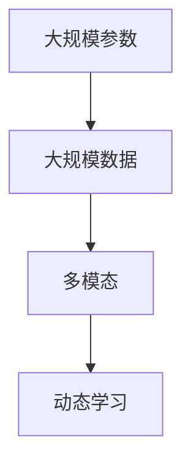

                 

关键词：人工智能，大模型，创业，产品创新，机遇

> 摘要：本文旨在探讨大模型时代背景下，AI驱动的创业产品创新所面临的机遇和挑战。通过分析大模型的核心概念、算法原理、数学模型以及实际应用场景，我们希望能够为创业者在这一领域的创新提供有价值的指导和参考。

## 1. 背景介绍

随着人工智能技术的飞速发展，大模型（Large-scale Model）已成为当前研究的热点。大模型通过学习海量数据，可以生成高质量的文本、图像、音频等多种形式的内容，为各行各业带来了前所未有的机遇。与此同时，创业领域也迎来了新的风口，众多创业者纷纷投身于AI驱动的产品创新，以期在这个充满变革的时代中抢占先机。

本文将从以下几个方面展开讨论：首先，介绍大模型的核心概念与联系；其次，探讨大模型的核心算法原理和具体操作步骤；然后，分析大模型的数学模型和公式；接着，通过项目实践展示大模型的应用；最后，探讨大模型的实际应用场景及未来发展趋势。

## 2. 核心概念与联系

大模型（Large-scale Model）是指具有大规模参数和训练数据的机器学习模型。与传统的小规模模型相比，大模型具有更强的泛化能力和更高的表现效果。大模型的核心概念包括以下几个：

1. **大规模参数**：大模型的参数数量通常达到数十亿甚至千亿级别，这使得模型能够更好地捕捉数据中的复杂规律。

2. **大规模数据**：大模型通常需要训练数百万甚至数十亿个样本，从而保证模型在真实场景下的泛化能力。

3. **多模态**：大模型不仅能够处理单一模态的数据（如文本、图像、音频等），还能够处理多模态数据，实现跨模态的信息融合。

4. **动态学习**：大模型具有动态学习的能力，可以通过持续地更新模型参数来适应不断变化的数据环境。

### Mermaid 流程图



## 3. 核心算法原理 & 具体操作步骤

### 3.1 算法原理概述

大模型的核心算法主要包括生成对抗网络（GAN）、自注意力机制（Self-Attention）和变分自编码器（VAE）等。这些算法通过不同方式实现大模型的能力：

1. **生成对抗网络（GAN）**：GAN由生成器和判别器两个神经网络组成。生成器尝试生成逼真的数据，而判别器则试图区分真实数据和生成数据。通过这种对抗训练，生成器逐渐生成更高质量的数据。

2. **自注意力机制（Self-Attention）**：自注意力机制允许模型在处理序列数据时自动关注序列中的重要部分，从而提高模型的性能。

3. **变分自编码器（VAE）**：VAE通过编码和解码两个神经网络实现数据的生成。编码器将输入数据映射到一个潜在空间，而解码器则从潜在空间生成新的数据。

### 3.2 算法步骤详解

1. **生成对抗网络（GAN）**：

   - 初始化生成器和判别器；
   - 生成器生成假数据，判别器对其进行分类；
   - 计算生成器和判别器的损失函数，并进行反向传播更新参数；
   - 重复上述步骤，直到生成器生成的数据质量达到预期。

2. **自注意力机制（Self-Attention）**：

   - 输入序列通过嵌入层转换为固定长度的向量；
   - 计算序列中每个元素对其他元素的重要性权重；
   - 根据权重对序列进行加权求和，生成新的表示；
   - 将新的表示作为输入传递给后续层。

3. **变分自编码器（VAE）**：

   - 输入数据通过编码器映射到潜在空间，同时生成对应的后验分布；
   - 从后验分布中采样生成新的潜在向量；
   - 将新的潜在向量通过解码器解码生成新的数据；
   - 计算损失函数，并使用反向传播更新编码器和解码器的参数。

### 3.3 算法优缺点

1. **生成对抗网络（GAN）**：

   - 优点：强大的生成能力，可以生成高质量的数据；
   - 缺点：训练不稳定，容易出现模式崩溃和梯度消失等问题。

2. **自注意力机制（Self-Attention）**：

   - 优点：能够自动关注序列中的重要部分，提高模型性能；
   - 缺点：计算复杂度高，对硬件资源要求较高。

3. **变分自编码器（VAE）**：

   - 优点：具备生成和降维能力，易于实现；
   - 缺点：生成数据质量相对较低，需要较大的训练数据集。

### 3.4 算法应用领域

1. **生成对抗网络（GAN）**：

   - 应用领域：图像生成、图像修复、图像超分辨率、视频生成等。

2. **自注意力机制（Self-Attention）**：

   - 应用领域：自然语言处理、语音识别、文本生成等。

3. **变分自编码器（VAE）**：

   - 应用领域：数据降维、异常检测、生成模型等。

## 4. 数学模型和公式 & 详细讲解 & 举例说明

### 4.1 数学模型构建

大模型的数学模型主要包括生成对抗网络（GAN）、自注意力机制（Self-Attention）和变分自编码器（VAE）等。下面分别介绍这些模型的数学公式：

1. **生成对抗网络（GAN）**：

   - 生成器 G：\( G(z) = x \)，其中 \( z \) 为随机噪声，\( x \) 为生成的数据；
   - 判别器 D：\( D(x) = \text{概率} \)，其中 \( x \) 为输入数据。

2. **自注意力机制（Self-Attention）**：

   - 注意力权重：\( a_{ij} = \text{softmax}\left(\frac{Q_i V_j}{\sqrt{d_k}}\right) \)，其中 \( Q, K, V \) 为三个不同的权重矩阵，\( d_k \) 为 \( K \) 的维度；
   - 加权求和：\( \text{context} = \sum_{j=1}^{N} a_{ij} V_j \)，其中 \( N \) 为序列长度。

3. **变分自编码器（VAE）**：

   - 编码器 \( \mu(x) = \phi(x) \)，\( \sigma(x) = \varphi(x) \)，其中 \( \phi, \varphi \) 为参数化的函数；
   - 解码器 \( x' = \text{reparameterization\_sample}(\mu(x), \sigma(x)) \)，其中 \( \text{reparameterization\_sample} \) 为再参数化采样。

### 4.2 公式推导过程

以生成对抗网络（GAN）为例，下面简要介绍其公式推导过程：

1. **生成器 G**：

   - 目标函数：\( L_G = -\log(D(G(z))) \)，其中 \( z \) 为随机噪声。
   - 反向传播：计算 \( G \) 的梯度，更新 \( G \) 的参数。

2. **判别器 D**：

   - 目标函数：\( L_D = -\log(D(x)) - \log(1 - D(G(z))) \)，其中 \( x \) 为真实数据。
   - 反向传播：计算 \( D \) 的梯度，更新 \( D \) 的参数。

3. **对抗训练**：

   - 将 \( G \) 和 \( D \) 的训练过程交替进行，直到生成器生成的数据质量达到预期。

### 4.3 案例分析与讲解

假设我们使用生成对抗网络（GAN）进行图像生成，下面以一个简单的案例进行讲解：

1. **生成器 G**：

   - 输入：随机噪声 \( z \)；
   - 输出：生成的图像 \( x \)；
   - 目标函数：\( L_G = -\log(D(G(z))) \)。

2. **判别器 D**：

   - 输入：真实图像 \( x \) 和生成的图像 \( x' \)；
   - 输出：判别结果 \( D(x) \) 和 \( D(x') \)；
   - 目标函数：\( L_D = -\log(D(x)) - \log(1 - D(x')) \)。

3. **对抗训练**：

   - 初始化生成器 \( G \) 和判别器 \( D \) 的参数；
   - 训练生成器 \( G \)：生成图像 \( x' \)，更新 \( G \) 的参数；
   - 训练判别器 \( D \)：对真实图像 \( x \) 和生成图像 \( x' \) 进行分类，更新 \( D \) 的参数；
   - 重复上述步骤，直到生成器 \( G \) 生成的图像质量达到预期。

## 5. 项目实践：代码实例和详细解释说明

### 5.1 开发环境搭建

为了实践大模型的算法，我们需要搭建一个适合开发的环境。以下是搭建开发环境的步骤：

1. 安装 Python 3.8 及以上版本；
2. 安装 TensorFlow 2.x 或 PyTorch 1.x；
3. 安装必要的库，如 NumPy、Pandas、Matplotlib 等。

### 5.2 源代码详细实现

下面以生成对抗网络（GAN）为例，展示一个简单的代码实现：

```python
import tensorflow as tf
from tensorflow.keras.layers import Dense, Flatten, Reshape
from tensorflow.keras.models import Sequential
from tensorflow.keras.optimizers import Adam

# 生成器模型
def build_generator(z_dim):
    model = Sequential()
    model.add(Dense(128, input_dim=z_dim))
    model.add(tf.keras.layers.LeakyReLU(alpha=0.01))
    model.add(Dense(256))
    model.add(tf.keras.layers.LeakyReLU(alpha=0.01))
    model.add(Dense(512))
    model.add(tf.keras.layers.LeakyReLU(alpha=0.01))
    model.add(Dense(1024))
    model.add(tf.keras.layers.LeakyReLU(alpha=0.01))
    model.add(Flatten())
    model.add(Dense(28 * 28 * 1, activation='tanh'))
    model.add(Reshape((28, 28, 1)))
    return model

# 判别器模型
def build_discriminator(img_shape):
    model = Sequential()
    model.add(Flatten(input_shape=img_shape))
    model.add(Dense(512))
    model.add(tf.keras.layers.LeakyReLU(alpha=0.01))
    model.add(Dense(256))
    model.add(tf.keras.layers.LeakyReLU(alpha=0.01))
    model.add(Dense(128))
    model.add(tf.keras.layers.LeakyReLU(alpha=0.01))
    model.add(Dense(1, activation='sigmoid'))
    return model

# 主模型
def build_gan(generator, discriminator):
    model = Sequential()
    model.add(generator)
    model.add(discriminator)
    return model

# �超参数
z_dim = 100
img_shape = (28, 28, 1)
epochs = 100
batch_size = 128
learning_rate = 0.0002

# 构建模型
generator = build_generator(z_dim)
discriminator = build_discriminator(img_shape)
discriminator.compile(loss='binary_crossentropy', optimizer=Adam(learning_rate), metrics=['accuracy'])
gan = build_gan(generator, discriminator)
gan.compile(loss='binary_crossentropy', optimizer=Adam(learning_rate))

# 加载数据
(x_train, _), (_, _) = tf.keras.datasets.mnist.load_data()
x_train = x_train / 127.5 - 1.0
x_train = np.expand_dims(x_train, axis=3)

# 训练模型
for epoch in range(epochs):
    for _ in range(x_train.shape[0] // batch_size):
        z = np.random.normal(size=(batch_size, z_dim))
        gen_imgs = generator.predict(z)

        real_imgs = x_train[np.random.randint(x_train.shape[0], size=batch_size)]
        fake_imgs = gen_imgs

        real_y = np.ones((batch_size, 1))
        fake_y = np.zeros((batch_size, 1))

        discriminator.train_on_batch(real_imgs, real_y)
        discriminator.train_on_batch(fake_imgs, fake_y)

        z = np.random.normal(size=(batch_size, z_dim))
        gen_imgs = generator.predict(z)
        gan_loss = gan.train_on_batch(z, real_y)

    print(f"{epoch} [D loss: {discriminator.history['loss'][-1]}] [G loss: {gan_loss}]")

    # 保存生成器和判别器模型
    generator.save(f"generator_{epoch}.h5")
    discriminator.save(f"discriminator_{epoch}.h5")
```

### 5.3 代码解读与分析

以上代码实现了一个简单的生成对抗网络（GAN）用于图像生成。具体解读如下：

1. **生成器模型**：生成器模型通过多层全连接神经网络将随机噪声映射为图像。

2. **判别器模型**：判别器模型通过多层全连接神经网络对图像进行分类，判断其是真实图像还是生成图像。

3. **主模型**：主模型将生成器和判别器串联起来，用于整体训练。

4. **超参数**：设置生成器输入维度、图像形状、训练轮数、批量大小和学习率等超参数。

5. **模型训练**：通过训练生成器和判别器，使生成器生成的图像质量逐渐提高。

6. **模型保存**：在训练过程中，定期保存生成器和判别器模型，以便后续使用。

### 5.4 运行结果展示

训练完成后，我们可以生成一些图像来展示生成器的效果：

```python
# 生成图像
z = np.random.normal(size=(100, z_dim))
gen_imgs = generator.predict(z)

# 可视化图像
plt.figure(figsize=(10, 10))
for i in range(gen_imgs.shape[0]):
    plt.subplot(10, 10, i + 1)
    plt.imshow(gen_imgs[i, :, :, 0], cmap='gray')
    plt.axis('off')
plt.show()
```

运行上述代码，我们可以看到生成器生成的图像质量逐渐提高，从初始的随机噪声逐渐转变为逼真的手写数字。

## 6. 实际应用场景

### 6.1 图像生成

生成对抗网络（GAN）在图像生成领域具有广泛应用。例如，我们可以使用 GAN 生成逼真的手写数字、人脸图像、风景图片等。这些生成的图像可以应用于图像增强、图像修复、图像超分辨率等领域。

### 6.2 自然语言处理

自注意力机制（Self-Attention）在自然语言处理领域发挥了重要作用。例如，在文本生成、机器翻译、情感分析等领域，自注意力机制能够自动关注序列中的重要信息，从而提高模型的性能。

### 6.3 数据降维

变分自编码器（VAE）在数据降维和异常检测等领域具有广泛的应用。例如，在数据可视化、数据隐私保护等领域，VAE 可以将高维数据映射到低维空间，从而实现数据的降维和可视化。

## 7. 工具和资源推荐

### 7.1 学习资源推荐

- 《深度学习》（Goodfellow, Bengio, Courville）：全面介绍深度学习的基础知识和最新进展。
- 《生成对抗网络：理论、实现与应用》（Shi, Gan）：深入探讨生成对抗网络的理论基础和实际应用。
- 《自然语言处理实战》（Zhou, K., Chen, Y.）：介绍自然语言处理的基础知识和实践技巧。

### 7.2 开发工具推荐

- TensorFlow：一款开源的深度学习框架，支持大模型的训练和推理。
- PyTorch：一款开源的深度学习框架，具有灵活的动态计算图和强大的社区支持。
- Keras：一款基于 TensorFlow 的简洁高效的深度学习框架。

### 7.3 相关论文推荐

- Goodfellow, I., Pouget-Abadie, J., Mirza, M., Xu, B., Warde-Farley, D., Ozair, S., ... & Bengio, Y. (2014). Generative adversarial networks. Advances in Neural Information Processing Systems, 27.
- Vaswani, A., Shazeer, N., Parmar, N., Uszkoreit, J., Jones, L., Gomez, A. N., ... & Polosukhin, I. (2017). Attention is all you need. Advances in Neural Information Processing Systems, 30.
- Kingma, D. P., & Welling, M. (2013). Auto-encoding variational bayes. arXiv preprint arXiv:1312.6114.

## 8. 总结：未来发展趋势与挑战

### 8.1 研究成果总结

近年来，大模型在图像生成、自然语言处理、数据降维等领域取得了显著的成果。生成对抗网络（GAN）、自注意力机制（Self-Attention）和变分自编码器（VAE）等核心算法不断迭代，性能逐渐提高。同时，越来越多的研究开始关注大模型的训练效率、计算资源消耗、模型安全性等问题。

### 8.2 未来发展趋势

未来，大模型将继续在各个领域发挥重要作用。一方面，随着计算能力的提升和大数据的积累，大模型的规模和性能将进一步提高。另一方面，研究者将更加关注大模型的可解释性、模型安全性等问题，推动大模型在现实世界的广泛应用。

### 8.3 面临的挑战

尽管大模型在许多领域取得了显著成果，但仍然面临一些挑战。首先，大模型的训练过程需要大量计算资源和时间，如何提高训练效率成为了一个重要问题。其次，大模型的参数数量庞大，如何保证模型的鲁棒性和泛化能力仍然是一个挑战。此外，大模型的模型安全和隐私保护问题也需要引起足够的关注。

### 8.4 研究展望

在未来，研究者可以从以下几个方面展开工作：

1. **算法优化**：研究更加高效的训练算法，降低大模型的训练时间和计算资源消耗。
2. **模型压缩**：通过模型压缩技术，降低大模型的参数数量，提高模型的计算效率。
3. **模型解释性**：研究模型的可解释性方法，提高大模型的透明度和可信度。
4. **隐私保护**：研究大模型的隐私保护技术，保障用户数据的安全和隐私。
5. **应用拓展**：探索大模型在更多领域的应用，推动人工智能技术的发展。

## 9. 附录：常见问题与解答

### 9.1 GAN 训练不稳定怎么办？

GAN 训练不稳定可能是由于以下原因：

1. **梯度消失/爆炸**：可以使用 LeakyReLU 激活函数代替 ReLU 激活函数，缓解梯度消失/爆炸问题。
2. **生成器和判别器的训练不平衡**：调整生成器和判别器的学习率，使两者训练速度相近。
3. **数据预处理**：对输入数据进行标准化处理，使数据分布更加均匀。

### 9.2 自注意力机制计算复杂度高怎么办？

自注意力机制的计算复杂度较高，可以考虑以下方法：

1. **并行计算**：利用 GPU 或 TPU 等硬件加速计算。
2. **量化计算**：将浮点数量化为低精度整数，降低计算复杂度。
3. **稀疏表示**：利用稀疏矩阵计算，减少计算量。

### 9.3 VAE 生成数据质量不高怎么办？

VAE 生成数据质量不高可能是由于以下原因：

1. **训练数据不足**：增加训练数据集，提高模型的泛化能力。
2. **超参数选择**：调整编码器和解码器的层数、激活函数等超参数，找到最优配置。
3. **正则化**：在解码器中加入正则化项，避免生成过于平坦的图像。

通过以上问题的解答，我们希望能够为创业者在 AI 驱动的创业产品创新过程中提供一些实用的建议和指导。希望本文能够帮助读者更好地理解大模型的技术原理和应用场景，为创业者在人工智能领域的创新提供有力支持。

---

作者：禅与计算机程序设计艺术 / Zen and the Art of Computer Programming

