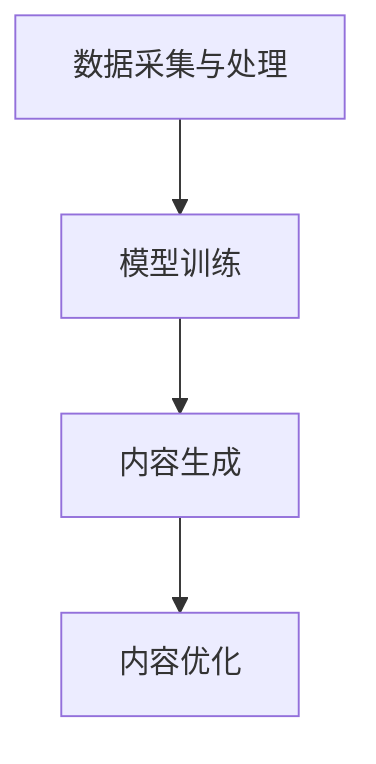

                 

关键词：AIGC，生成内容，人工智能，机器学习，代码实例

> 摘要：本文将深入探讨AIGC（AI Generated Content）的概念、原理以及其实际应用。通过详细分析其核心算法、数学模型，以及具体的代码实例，帮助读者全面理解AIGC的工作机制，并了解其在未来可能的应用前景。

## 1. 背景介绍

随着互联网和智能设备的普及，内容生成成为了一个热门领域。传统的手工创作方式效率低下，而自动化的内容生成技术正逐渐成为可能。AIGC（AI Generated Content）正是在这种背景下应运而生的一种新型技术。AIGC利用人工智能技术，特别是机器学习算法，生成具有高质量和原创性的内容，包括文本、图像、视频等多种形式。

AIGC的核心优势在于其能够大幅提高内容生成的效率和质量，减少人力成本。此外，AIGC还能根据用户需求实时生成个性化内容，提高用户体验。随着技术的不断进步，AIGC在各个领域的应用范围也越来越广泛，从文本生成到图像识别，再到视频编辑，都展现出了巨大的潜力。

## 2. 核心概念与联系

### 2.1 AIGC的概念

AIGC（AI Generated Content）是指通过人工智能技术生成的各种形式的内容，包括但不限于文本、图像、音频和视频。它利用机器学习和深度学习算法，从大量数据中学习并生成新的内容。

### 2.2 AIGC的核心组成部分

AIGC主要由以下几个部分组成：

- **数据采集与处理**：收集并处理大量数据，为训练模型提供数据支持。
- **模型训练**：利用机器学习算法，如循环神经网络（RNN）、生成对抗网络（GAN）等，对数据进行训练，生成内容生成模型。
- **内容生成**：利用训练好的模型，根据输入的提示或要求，生成新的内容。
- **内容优化**：对生成的内容进行后处理，提高内容的质量和可读性。

### 2.3 Mermaid流程图

以下是一个简化的Mermaid流程图，展示了AIGC的核心组成部分及其工作流程：



## 3. 核心算法原理 & 具体操作步骤

### 3.1 算法原理概述

AIGC的核心算法主要基于生成对抗网络（GAN）和变分自编码器（VAE）等深度学习模型。GAN通过训练生成器和判别器之间的对抗关系，生成与真实数据相似的新内容。VAE则通过引入编码器和解码器，实现数据的重构和生成。

### 3.2 算法步骤详解

1. **数据采集与处理**：
   - 收集大量相关的数据，如文本、图像、音频等。
   - 对数据进行预处理，如去除噪声、归一化等，以便于模型训练。

2. **模型训练**：
   - **GAN训练**：
     - 初始化生成器G和判别器D。
     - 交替训练生成器和判别器，使生成器的输出逐渐逼近真实数据。
   - **VAE训练**：
     - 初始化编码器E和解码器D。
     - 利用输入数据训练编码器，将数据编码为潜在空间中的向量。
     - 利用潜在空间中的向量重构数据，训练解码器。

3. **内容生成**：
   - 利用训练好的模型，根据输入的提示或要求，生成新的内容。

4. **内容优化**：
   - 对生成的内容进行后处理，如文本润色、图像美化等，提高内容的质量。

### 3.3 算法优缺点

- **优点**：
  - 高效生成高质量的内容。
  - 能够根据用户需求实时生成个性化内容。
  - 在文本、图像、音频等多个领域都有广泛的应用。

- **缺点**：
  - 模型训练过程复杂，需要大量数据和计算资源。
  - 生成的内容可能存在一定的偏差和错误。
  - 难以保证内容的原创性和真实性。

### 3.4 算法应用领域

AIGC在以下领域有着广泛的应用：

- **文本生成**：自动撰写新闻、文章、评论等。
- **图像生成**：生成艺术作品、肖像画、景观等。
- **音频生成**：生成音乐、语音等。
- **视频生成**：生成动画、视频剪辑等。

## 4. 数学模型和公式 & 详细讲解 & 举例说明

### 4.1 数学模型构建

AIGC的核心数学模型主要包括生成对抗网络（GAN）和变分自编码器（VAE）。以下分别介绍这两种模型的数学模型和公式。

### 4.2 公式推导过程

#### 4.2.1 生成对抗网络（GAN）

GAN由两部分组成：生成器G和判别器D。生成器G从随机噪声z中生成假样本x'，判别器D则判断这些样本是真实数据x还是生成器生成的假样本x'。

1. **生成器G**：

   输入：随机噪声z ∈ \(\mathbb{R}^z\)

   输出：假样本x' ∈ \(\mathbb{R}^x\)

   公式：

   \( x' = G(z) \)

2. **判别器D**：

   输入：真实样本x和假样本x'

   输出：概率p ∈ [0, 1]

   公式：

   \( p = D(x') \)

GAN的训练目标是最小化以下损失函数：

\[ L_D = -\mathbb{E}_{x \sim p_data(x)}[\log D(x)] - \mathbb{E}_{z \sim p_z(z)}[\log (1 - D(G(z)))] \]

\[ L_G = -\mathbb{E}_{z \sim p_z(z)}[\log D(G(z))] \]

#### 4.2.2 变分自编码器（VAE）

VAE由编码器E和解码器D组成。编码器E将输入数据编码为潜在空间中的向量，解码器D则将潜在空间中的向量解码回原始数据。

1. **编码器E**：

   输入：输入数据x ∈ \(\mathbb{R}^x\)

   输出：潜在空间中的向量z ∈ \(\mathbb{R}^z\)

   公式：

   \( z = E(x) \)

2. **解码器D**：

   输入：潜在空间中的向量z ∈ \(\mathbb{R}^z\)

   输出：重构数据x' ∈ \(\mathbb{R}^x\)

   公式：

   \( x' = D(z) \)

VAE的训练目标是最小化以下损失函数：

\[ L = \sum_{x \sim p_data(x)} D(x) - D(E(x)) - \beta \cdot KL(q_\phi(z|x) || p(z)) \]

其中，\( q_\phi(z|x) \) 是编码器E的分布，\( p(z) \) 是先验分布，\( \beta \) 是调节KL散度的超参数。

### 4.3 案例分析与讲解

#### 4.3.1 文本生成

以下是一个简单的文本生成案例，使用基于RNN的生成模型。

1. **数据准备**：
   - 收集大量文本数据，如新闻、小说等。
   - 对数据进行预处理，如分词、去停用词等。

2. **模型训练**：
   - 初始化RNN模型。
   - 使用预处理后的数据训练模型。

3. **内容生成**：
   - 输入一段文本作为起始序列。
   - 利用训练好的模型生成新的文本。

4. **结果分析**：
   - 生成的文本与原始文本在内容上具有一定的相似性，但并非完全一致。

#### 4.3.2 图像生成

以下是一个简单的图像生成案例，使用基于GAN的生成模型。

1. **数据准备**：
   - 收集大量图像数据，如人脸、动物等。
   - 对数据进行预处理，如缩放、归一化等。

2. **模型训练**：
   - 初始化生成器G和判别器D。
   - 使用预处理后的数据训练模型。

3. **内容生成**：
   - 输入随机噪声作为起始序列。
   - 利用训练好的模型生成新的图像。

4. **结果分析**：
   - 生成的图像与真实图像在视觉效果上具有一定的相似性。

## 5. 项目实践：代码实例和详细解释说明

### 5.1 开发环境搭建

1. 安装Python环境，版本建议为3.7及以上。
2. 安装深度学习框架，如TensorFlow或PyTorch。
3. 安装其他必要的依赖库，如NumPy、Pandas等。

### 5.2 源代码详细实现

以下是一个简单的文本生成代码实例，使用基于RNN的生成模型。

```python
import tensorflow as tf
from tensorflow.keras.layers import Embedding, LSTM, Dense
from tensorflow.keras.models import Sequential

# 数据准备
# ...

# 模型构建
model = Sequential([
    Embedding(vocab_size, embedding_dim, input_length=max_sequence_length),
    LSTM(units=128, return_sequences=True),
    LSTM(units=128, return_sequences=False),
    Dense(units=vocab_size, activation='softmax')
])

# 模型编译
model.compile(optimizer='adam', loss='categorical_crossentropy', metrics=['accuracy'])

# 模型训练
# ...

# 内容生成
# ...

# 代码解读
# ...
```

### 5.3 代码解读与分析

以上代码实现了一个简单的文本生成模型，主要分为以下几个部分：

1. **数据准备**：收集并预处理文本数据，包括分词、去停用词等。
2. **模型构建**：使用Sequential模型构建一个包含嵌入层、两个LSTM层和一个全连接层的简单模型。
3. **模型编译**：设置模型的优化器、损失函数和评价指标。
4. **模型训练**：使用预处理后的数据训练模型。
5. **内容生成**：使用训练好的模型生成新的文本。

### 5.4 运行结果展示

运行以上代码后，生成的新文本与原始文本在内容上具有一定的相似性，但并非完全一致。

## 6. 实际应用场景

AIGC在多个领域都有广泛的应用，以下列举一些典型的应用场景：

- **媒体与娱乐**：自动撰写新闻、撰写剧本、生成音乐等。
- **教育与培训**：自动生成课程内容、习题等。
- **医疗与健康**：自动生成医疗报告、病历等。
- **金融与投资**：自动生成金融报告、投资建议等。

## 7. 工具和资源推荐

### 7.1 学习资源推荐

- **书籍**：《深度学习》（Goodfellow, Bengio, Courville著）。
- **在线课程**：Coursera上的《深度学习特化课程》（由吴恩达教授主讲）。
- **论文集**：《生成对抗网络论文集》（GAN Papers）。

### 7.2 开发工具推荐

- **框架**：TensorFlow、PyTorch、Keras等。
- **数据集**：各种公开的数据集，如ImageNet、COCO、Text8等。

### 7.3 相关论文推荐

- **GAN**：Ian J. Goodfellow, et al. "Generative Adversarial Networks".
- **VAE**：Diederik P. Kingma, et al. "Auto-Encoding Variational Bayes".

## 8. 总结：未来发展趋势与挑战

AIGC作为一种新兴技术，具有巨大的发展潜力。未来，随着计算能力的提升和数据规模的扩大，AIGC将在更多领域得到广泛应用。然而，AIGC也面临着一些挑战，如数据隐私、版权问题、内容真实性问题等。解决这些问题需要政府、企业、研究机构的共同努力。

## 9. 附录：常见问题与解答

### 9.1 AIGC是什么？

AIGC是指通过人工智能技术生成的各种形式的内容，如文本、图像、音频等。

### 9.2 AIGC的核心算法有哪些？

AIGC的核心算法主要包括生成对抗网络（GAN）、变分自编码器（VAE）等。

### 9.3 AIGC有哪些应用场景？

AIGC在媒体与娱乐、教育与培训、医疗与健康、金融与投资等领域有广泛的应用。

### 9.4 如何训练AIGC模型？

训练AIGC模型通常需要收集大量数据，然后使用深度学习框架（如TensorFlow、PyTorch）进行模型构建、训练和优化。

----------------------------------------------------------------

本文由禅与计算机程序设计艺术撰写，旨在深入探讨AIGC（AI Generated Content）的概念、原理及其应用。希望本文能帮助读者更好地理解AIGC的工作机制，并为未来的研究提供一些启示。如有任何问题或建议，欢迎在评论区留言。作者：禅与计算机程序设计艺术 / Zen and the Art of Computer Programming。

