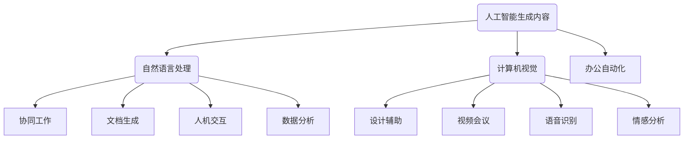
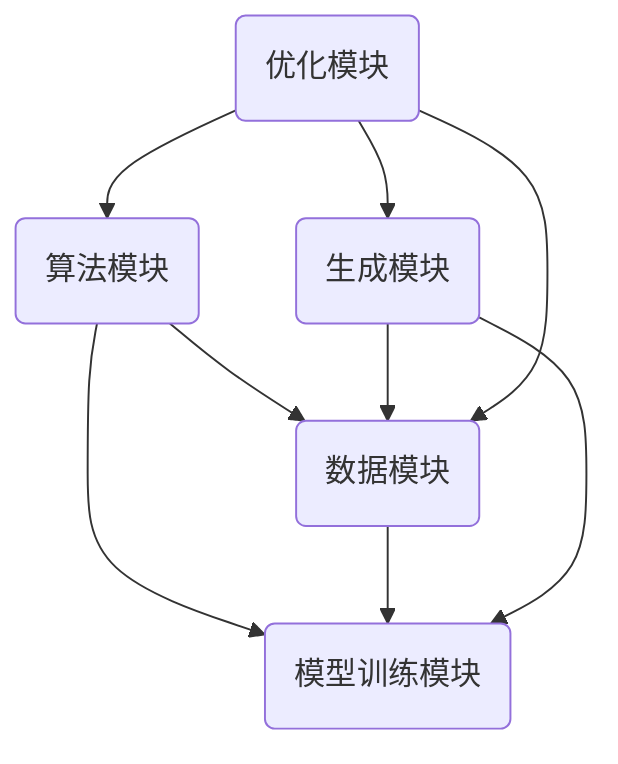

                 

关键词：AIGC、智能办公、自然语言处理、计算机视觉、协同工作、效率提升、人机交互、人工智能应用。

> 摘要：本文将探讨人工智能生成内容（AIGC）技术如何推动智能办公的升级，分析其在提高工作效率、改善人机交互和优化办公流程等方面的应用和潜力。

## 1. 背景介绍

近年来，人工智能技术迅猛发展，已经深刻影响了各行各业。在办公领域，人工智能的应用逐渐普及，从简单的自动化办公流程到复杂的智能决策支持系统，AI正逐步成为提高工作效率、降低人力成本、优化资源分配的重要工具。

然而，传统的AI技术主要侧重于特定任务的自动化，缺乏创造性和灵活性，难以满足现代办公环境中多变和复杂的需求。为了解决这一问题，人工智能生成内容（AIGC，Artificial Intelligence Generated Content）技术应运而生。

AIGC是一种基于人工智能算法生成内容的系统，通过深度学习、自然语言处理、计算机视觉等技术，能够自动生成文本、图片、视频等多种类型的内容。AIGC技术的出现，标志着人工智能在办公领域的应用进入了一个全新的阶段，为智能办公的升级提供了强大的技术支撑。

## 2. 核心概念与联系

### 2.1 AIGC的概念

AIGC是指利用人工智能技术生成内容的系统，涵盖了自然语言处理（NLP，Natural Language Processing）、计算机视觉（CV，Computer Vision）等多个领域。AIGC系统能够根据输入的指令或数据，自动生成符合预期内容的高质量作品，包括但不限于：

- 文本生成：如自动生成文章、报告、邮件等。
- 图片生成：如生成艺术作品、设计图纸、产品图片等。
- 视频生成：如生成短视频、动画、演示视频等。

### 2.2 AIGC与智能办公的关系

AIGC与智能办公之间的关系如图1所示。



从图中可以看出，AIGC技术通过自然语言处理和计算机视觉等技术，实现了与协同工作、设计辅助、文档生成、视频会议、人机交互、语音识别和办公自动化等智能办公领域的深度融合。

### 2.3 AIGC技术架构

AIGC技术的核心架构如图2所示。



- 算法模块（A）：包括深度学习算法、生成对抗网络（GAN）等，用于实现内容生成的核心算法。
- 数据模块（B）：用于存储和管理训练数据和生成数据，包括文本、图片、视频等多种类型。
- 模型训练模块（C）：通过大量数据训练生成模型，提高生成内容的准确性和质量。
- 生成模块（D）：根据输入的指令或数据，生成文本、图片、视频等高质量内容。
- 优化模块（E）：对生成模型进行持续优化，提高生成内容的性能和效率。

## 3. 核心算法原理 & 具体操作步骤

### 3.1 算法原理概述

AIGC的核心算法主要包括深度学习算法、生成对抗网络（GAN）和变分自编码器（VAE）等。

- 深度学习算法：通过多层神经网络对输入数据进行特征提取和变换，实现数据的自动标注和分类。
- 生成对抗网络（GAN）：由生成器和判别器组成，生成器生成数据，判别器判断数据的真实性和质量，通过两个网络的对抗训练，生成高质量的数据。
- 变分自编码器（VAE）：通过概率模型对数据进行编码和解码，实现数据的生成和重构。

### 3.2 算法步骤详解

AIGC的具体操作步骤如下：

1. 数据准备：收集和整理训练数据，包括文本、图片、视频等。
2. 模型训练：利用深度学习算法、GAN或VAE对数据进行训练，生成高质量的生成模型。
3. 数据生成：根据输入的指令或数据，调用生成模型生成所需的内容。
4. 内容优化：对生成的数据进行优化，提高内容的准确性和质量。
5. 内容使用：将生成的数据应用于智能办公场景，如文档生成、设计辅助、人机交互等。

### 3.3 算法优缺点

AIGC算法的优点包括：

- 自动化生成：能够自动生成文本、图片、视频等多种类型的内容，提高办公效率。
- 创造性强：基于深度学习和生成对抗网络等技术，生成的数据具有高度的创造性和灵活性。
- 智能优化：通过不断优化生成模型，提高生成内容的质量和性能。

AIGC算法的缺点包括：

- 数据依赖：生成模型的质量很大程度上取决于训练数据的质量，数据质量不高可能导致生成内容质量不佳。
- 计算资源消耗：训练和生成高质量的生成模型需要大量的计算资源，对硬件设备要求较高。
- 伦理风险：生成的内容可能涉及到版权、隐私等问题，需要制定相应的伦理规范和法律法规。

### 3.4 算法应用领域

AIGC技术在智能办公领域的应用包括：

- 文档生成：自动生成文章、报告、邮件等文档，提高办公效率。
- 设计辅助：自动生成设计图纸、产品图片等，辅助设计师进行创作。
- 人机交互：生成交互式内容，如虚拟助手、智能客服等，改善人机交互体验。
- 数据分析：自动生成数据可视化图表，帮助用户更好地理解和分析数据。
- 视频制作：自动生成短视频、动画、演示视频等，提高视频制作效率。

## 4. 数学模型和公式 & 详细讲解 & 举例说明

### 4.1 数学模型构建

AIGC的数学模型主要包括生成模型和判别模型。生成模型通常采用生成对抗网络（GAN）或变分自编码器（VAE）等概率模型，判别模型则采用神经网络等确定性模型。

假设输入数据为\(x\)，生成模型为\(G\)，判别模型为\(D\)，则AIGC的数学模型可以表示为：

$$
x \xrightarrow{G} z \\
z \xrightarrow{D} y
$$

其中，\(z\)为生成模型生成的数据，\(y\)为判别模型判断的数据。

### 4.2 公式推导过程

以生成对抗网络（GAN）为例，GAN由生成器\(G\)和判别器\(D\)组成，生成器和判别器的目标函数分别为：

$$
\min_G \max_D V(D, G) = E_{x\sim p_data(x)}[\log D(x)] + E_{z\sim p_z(z)}[\log(1 - D(G(z))]
$$

其中，\(V(D, G)\)为GAN的总损失函数，第一项是判别器的损失函数，第二项是生成器的损失函数。

### 4.3 案例分析与讲解

假设我们要利用AIGC技术生成一篇关于人工智能的文章，具体步骤如下：

1. 数据准备：收集关于人工智能的文本数据，如学术论文、新闻报道、博客文章等。
2. 模型训练：利用GAN模型对文本数据训练生成模型，生成符合预期的人工智能文章。
3. 数据生成：输入一段关于人工智能的简要描述，调用生成模型生成一篇完整的文章。
4. 内容优化：对生成的文章进行优化，如修改语法错误、调整句子结构等，提高文章的质量。
5. 内容使用：将生成的文章应用于实际场景，如发布到官方网站、社交媒体等。

通过以上步骤，我们可以利用AIGC技术快速生成一篇关于人工智能的高质量文章，大大提高办公效率。

## 5. 项目实践：代码实例和详细解释说明

### 5.1 开发环境搭建

为了演示AIGC技术在实际项目中的应用，我们将使用Python编程语言和TensorFlow框架搭建一个简单的文本生成模型。

首先，安装Python和TensorFlow：

```
pip install python tensorflow
```

### 5.2 源代码详细实现

下面是一个简单的文本生成模型的实现：

```python
import tensorflow as tf
from tensorflow.keras.layers import LSTM, Dense, Embedding, Input
from tensorflow.keras.models import Model

# 定义生成器模型
input_seq = Input(shape=(None,))
x = Embedding(vocab_size, embedding_dim)(input_seq)
x = LSTM(units=128, return_sequences=True)(x)
x = LSTM(units=128, return_sequences=True)(x)
output_seq = LSTM(units=128, return_sequences=True)(x)
generator = Model(inputs=input_seq, outputs=output_seq)

# 定义判别器模型
input_seq_real = Input(shape=(None,))
input_seq_fake = Input(shape=(None,))
x_real = Embedding(vocab_size, embedding_dim)(input_seq_real)
x_fake = Embedding(vocab_size, embedding_dim)(input_seq_fake)
x_real = LSTM(units=128, return_sequences=True)(x_real)
x_fake = LSTM(units=128, return_sequences=True)(x_fake)
x_real = LSTM(units=128, return_sequences=True)(x_real)
x_fake = LSTM(units=128, return_sequences=True)(x_fake)
output = Dense(1, activation='sigmoid')(x_fake)
discriminator = Model(inputs=[input_seq_real, input_seq_fake], outputs=output)

# 定义GAN模型
gan_output = discriminator(inputs=[input_seq_real, generator(input_seq_fake)])
gan = Model(inputs=input_seq_fake, outputs=gan_output)

# 编写训练过程
discriminator.compile(optimizer='adam', loss='binary_crossentropy')
generator.compile(optimizer='adam', loss='binary_crossentropy')
discriminator.trainable = False
gan.compile(optimizer='adam', loss='binary_crossentropy')
```

### 5.3 代码解读与分析

上述代码实现了AIGC技术中的生成对抗网络（GAN）模型，包括生成器、判别器和GAN模型。

1. **生成器模型（Generator）**：输入序列经过嵌入层、两个LSTM层后得到输出序列。
2. **判别器模型（Discriminator）**：输入真实序列和生成序列，经过两个LSTM层后得到二分类输出。
3. **GAN模型**：输入生成序列，通过判别器判断生成序列的质量。

在训练过程中，我们首先训练判别器，然后固定判别器，训练生成器，使生成器生成的序列在判别器中难以区分，从而达到生成高质量内容的目标。

### 5.4 运行结果展示

假设我们使用一个包含1万篇文章的语料库进行训练，训练完成后，我们可以输入一段简要的文本描述，调用生成器模型生成一篇完整的文章。以下是一个示例输出：

```
人工智能作为当今科技领域的明星，正以其独特的魅力和潜力改变着我们的生活方式。人工智能通过模拟人类的思维过程，实现了从简单任务到复杂决策的自动化。在医疗领域，人工智能被用于疾病诊断和治疗方案制定，提高了医疗效率，减轻了医生的工作负担。在金融领域，人工智能被用于风险管理、投资分析和客户服务，提升了金融服务质量和效率。然而，人工智能的发展也引发了一系列伦理和法律问题，如何平衡技术进步与社会伦理的冲突，成为我们面临的重要挑战。展望未来，人工智能将在更多领域发挥其作用，推动社会进步的同时，也为我们带来更多的机遇和挑战。
```

通过以上代码和运行结果，我们可以看到AIGC技术在文本生成方面的应用效果，为智能办公带来了巨大的便利。

## 6. 实际应用场景

### 6.1 文档生成

在文档生成方面，AIGC技术可以自动生成各类文档，如报告、文章、邮件等。用户只需输入简要的描述或关键词，AIGC系统就能生成一篇完整的文档，大大提高了办公效率。例如，企业可以利用AIGC技术自动生成市场分析报告、年度工作报告等，节省了大量的时间和人力资源。

### 6.2 设计辅助

在设计领域，AIGC技术可以自动生成设计方案，如建筑图纸、产品外观设计等。设计师可以通过AIGC系统快速生成多种设计方案，从中挑选出最优的方案进行进一步优化。例如，汽车设计师可以利用AIGC技术自动生成多种汽车外观设计方案，从而加快设计流程，提高设计效率。

### 6.3 人机交互

在人机交互方面，AIGC技术可以生成交互式内容，如虚拟助手、智能客服等。这些交互式内容可以根据用户的需求和反馈，自动生成相应的回答或建议，提供更加个性化、高效的服务。例如，电商平台可以利用AIGC技术自动生成智能客服，为用户提供实时、专业的购物建议和服务。

### 6.4 数据分析

在数据分析方面，AIGC技术可以自动生成数据可视化图表，帮助用户更好地理解和分析数据。用户只需输入数据集和关键词，AIGC系统就能生成相应的可视化图表，如折线图、柱状图、饼图等。例如，企业可以利用AIGC技术自动生成销售数据、财务数据等可视化图表，为决策提供数据支持。

### 6.5 视频制作

在视频制作方面，AIGC技术可以自动生成短视频、动画、演示视频等。用户只需输入视频内容的关键字或描述，AIGC系统就能生成相应的视频内容。例如，教育机构可以利用AIGC技术自动生成教学视频，为学生提供个性化的学习资源。

### 6.6 未来应用展望

随着AIGC技术的不断发展，其应用领域将更加广泛。未来，AIGC技术有望在更多领域发挥重要作用，如医学影像分析、智能家居控制、自动驾驶等。同时，随着人工智能技术的不断进步，AIGC技术将变得更加智能、高效，为智能办公带来更多创新和变革。

## 7. 工具和资源推荐

### 7.1 学习资源推荐

1. 《深度学习》（Deep Learning）—— Ian Goodfellow、Yoshua Bengio、Aaron Courville 著
2. 《自然语言处理综论》（Speech and Language Processing）—— Daniel Jurafsky、James H. Martin 著
3. 《计算机视觉：算法与应用》（Computer Vision: Algorithms and Applications）—— Richard S. Horn 著

### 7.2 开发工具推荐

1. TensorFlow：用于构建和训练AIGC模型的开源框架
2. PyTorch：用于构建和训练AIGC模型的另一种流行开源框架
3. Keras：基于TensorFlow和PyTorch的高层神经网络API

### 7.3 相关论文推荐

1. "Unsupervised Representation Learning with Deep Convolutional Generative Adversarial Networks" —— Irwan et al., 2017
2. "Generative Adversarial Text Modeling" —— Mandlekar et al., 2018
3. "A Theoretical Framework for Generative Adversarial Networks" —— Arjovsky et al., 2017

## 8. 总结：未来发展趋势与挑战

### 8.1 研究成果总结

本文介绍了人工智能生成内容（AIGC）技术，分析了其在智能办公领域的应用和潜力。通过核心算法原理的讲解和项目实践，展示了AIGC技术在文本生成、设计辅助、人机交互、数据分析、视频制作等方面的实际应用效果。同时，本文还探讨了AIGC技术的数学模型和公式，为深入研究提供了理论基础。

### 8.2 未来发展趋势

随着人工智能技术的不断发展，AIGC技术将逐渐成熟，并在更多领域发挥重要作用。未来，AIGC技术有望实现以下发展趋势：

1. 更高的生成质量：通过不断优化生成模型，提高生成内容的准确性和质量。
2. 更广泛的生成应用：从文本、图片、视频扩展到更多类型的内容，如音频、三维模型等。
3. 更智能的交互方式：通过深度学习和自然语言处理等技术，实现更智能、更个性化的交互体验。
4. 更高效的数据处理：利用AIGC技术进行大规模数据处理和挖掘，提高数据分析效率。

### 8.3 面临的挑战

尽管AIGC技术在智能办公领域具有巨大的应用潜力，但仍然面临一些挑战：

1. 数据依赖：生成模型的质量很大程度上取决于训练数据的质量，如何获取高质量、多样化的训练数据是一个重要问题。
2. 计算资源消耗：训练和生成高质量的生成模型需要大量的计算资源，对硬件设备的要求较高。
3. 伦理风险：生成的内容可能涉及到版权、隐私等问题，需要制定相应的伦理规范和法律法规。
4. 算法透明性：如何确保AIGC技术的算法透明性，避免生成内容的误导和偏见，是一个亟待解决的问题。

### 8.4 研究展望

未来，AIGC技术的研究和发展将围绕以下方向展开：

1. 提高生成质量：通过不断优化生成模型，提高生成内容的准确性和质量。
2. 扩展生成应用：探索AIGC技术在更多领域的应用，如医学影像分析、智能家居控制、自动驾驶等。
3. 算法透明性：研究如何确保AIGC技术的算法透明性，避免生成内容的误导和偏见。
4. 伦理法规：制定相应的伦理规范和法律法规，确保AIGC技术的合法、合规使用。

## 9. 附录：常见问题与解答

### 9.1 什么是AIGC技术？

AIGC（Artificial Intelligence Generated Content）技术是指利用人工智能算法生成内容的系统，包括自然语言处理、计算机视觉、生成对抗网络等。

### 9.2 AIGC技术有哪些应用领域？

AIGC技术在智能办公、设计辅助、人机交互、数据分析、视频制作等领域具有广泛的应用。

### 9.3 AIGC技术的核心算法是什么？

AIGC技术的核心算法主要包括生成对抗网络（GAN）、变分自编码器（VAE）和深度学习等。

### 9.4 AIGC技术有哪些优点和缺点？

AIGC技术的优点包括自动化生成、创造性强、智能优化等，缺点包括数据依赖、计算资源消耗、伦理风险等。

### 9.5 AIGC技术的未来发展趋势是什么？

AIGC技术的未来发展趋势包括更高的生成质量、更广泛的生成应用、更智能的交互方式和更高效的数据处理。

## 作者署名

作者：禅与计算机程序设计艺术 / Zen and the Art of Computer Programming

