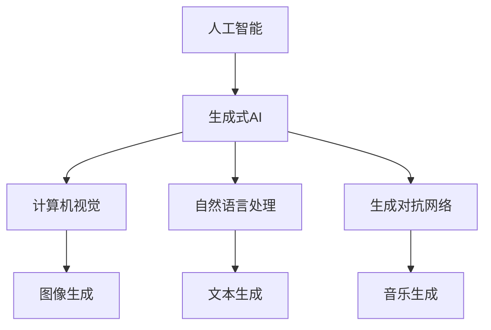

                 

关键词：人工智能，生成式AI，计算机生成内容，自然语言处理，深度学习，计算图形学，图像生成，创意应用，虚拟现实，智能娱乐

> 摘要：本文旨在探讨人工智能（AI）在计算机生成内容（AIGC）领域的未来发展趋势。随着生成式AI技术的不断进步，计算机生成内容正逐渐渗透到各个行业，为创意产业带来深远影响。本文将分析AIGC的核心技术、应用场景、未来展望以及面临的挑战。

## 1. 背景介绍

随着深度学习和生成对抗网络（GAN）等技术的崛起，人工智能在内容生成领域取得了显著的突破。计算机生成内容（AIGC，AI-generated content）作为人工智能的一个重要分支，正在改变内容生产的方式和效率。AIGC的应用范围广泛，从图像生成、视频制作到自然语言处理和音乐创作，都在不断拓展。

近年来，AIGC已经在多个领域取得了成功。例如，图像生成技术使得计算机能够自动创作艺术作品；自然语言处理技术则帮助计算机生成高质量的文章和对话。这些技术的进步不仅提高了内容生产的效率，也激发了新的创意方式。

然而，AIGC的发展还面临着许多挑战。首先是技术的成熟度，许多AIGC应用仍然需要进一步优化和改进。其次是伦理和法律问题，如何确保AIGC内容的真实性和合法性是一个亟待解决的问题。此外，用户接受度也是一个关键因素，如何让用户愿意接受和信任AIGC内容是当前和未来需要面对的问题。

## 2. 核心概念与联系

### 2.1 人工智能

人工智能（AI）是指计算机系统通过模拟人类智能行为，实现感知、学习、推理、规划和自然语言处理等功能的技术。AI可以分为两大类：基于规则的系统和基于数据的学习系统。基于规则的系统依赖于预定义的规则和逻辑，而基于数据的学习系统则通过从大量数据中学习模式和规律来实现智能行为。

### 2.2 生成式AI

生成式AI是一种利用机器学习和深度学习技术生成新数据的方法。它可以通过学习现有数据来创建新的内容，如图像、文本、音乐等。生成式AI的核心是生成对抗网络（GAN），它由一个生成器和两个判别器组成。生成器生成数据，判别器评估数据的真实性，通过不断优化，生成器能够生成越来越真实的数据。

### 2.3 计算机生成内容

计算机生成内容（AIGC）是指利用人工智能技术自动生成文本、图像、音频、视频等内容的系统。AIGC的核心技术包括自然语言处理（NLP）、计算机视觉（CV）和生成对抗网络（GAN）等。AIGC的应用领域广泛，包括内容创作、娱乐、医疗、教育、广告等。

### 2.4 Mermaid 流程图



## 3. 核心算法原理 & 具体操作步骤

### 3.1 算法原理概述

AIGC的核心算法是生成对抗网络（GAN）。GAN由生成器和判别器两个部分组成。生成器通过学习输入数据来生成新的数据，判别器则通过学习输入数据和新生成数据之间的差异来评估生成器的性能。通过不断训练，生成器的性能逐渐提高，能够生成越来越真实的数据。

### 3.2 算法步骤详解

1. 初始化生成器和判别器，分别从不同的分布中采样。
2. 生成器生成新数据。
3. 判别器对新数据和真实数据进行比较。
4. 计算生成器的损失函数，并通过反向传播更新生成器的参数。
5. 计算判别器的损失函数，并通过反向传播更新判别器的参数。
6. 重复步骤2-5，直到生成器生成的数据足够真实。

### 3.3 算法优缺点

**优点：**
- GAN能够生成高质量、多样化的数据。
- 不需要明确的监督信息，生成器的训练过程较为灵活。

**缺点：**
- GAN的训练过程不稳定，容易出现模式崩溃（mode collapse）问题。
- GAN的损失函数设计较为复杂，难以优化。

### 3.4 算法应用领域

GAN技术在图像生成、文本生成、音频生成等多个领域都有广泛应用。例如，在图像生成方面，GAN可以用于生成艺术作品、卡通图像、人脸生成等；在文本生成方面，GAN可以用于生成文章、对话、歌词等。

## 4. 数学模型和公式 & 详细讲解 & 举例说明

### 4.1 数学模型构建

GAN的数学模型基于概率分布。生成器G从噪声分布p(z)中采样，生成假数据x = G(z)；判别器D从数据分布p(x)中采样，评估假数据x的真实性。GAN的训练目标是最小化生成器的损失函数和判别器的损失函数。

### 4.2 公式推导过程

GAN的损失函数通常采用如下形式：

$$
L_G = -\mathbb{E}_{x \sim p_{data}(x)}[\log D(x)] - \mathbb{E}_{z \sim p(z)}[\log (1 - D(G(z))]
$$

$$
L_D = -\mathbb{E}_{x \sim p_{data}(x)}[\log D(x)] - \mathbb{E}_{z \sim p(z)}[\log D(G(z))]
$$

其中，$L_G$是生成器的损失函数，$L_D$是判别器的损失函数。

### 4.3 案例分析与讲解

以下是一个简单的GAN模型在图像生成中的应用：

```python
import tensorflow as tf
from tensorflow.keras.layers import Dense, Flatten
from tensorflow.keras.models import Sequential

# 生成器模型
generator = Sequential([
    Dense(128, input_shape=(100,), activation='relu'),
    Flatten(),
    Dense(28 * 28, activation='tanh')
])

# 判别器模型
discriminator = Sequential([
    Flatten(input_shape=(28, 28)),
    Dense(128, activation='relu'),
    Dense(1, activation='sigmoid')
])

# GAN模型
gan = Sequential([
    generator,
    discriminator
])

# 编译模型
gan.compile(optimizer=tf.keras.optimizers.Adam(0.0001), loss='binary_crossentropy')

# 训练模型
gan.fit(x_train, y_train, epochs=100, batch_size=128)
```

在这个例子中，生成器从噪声分布中生成假图像，判别器评估假图像的真实性。通过训练，生成器逐渐提高生成图像的真实性，判别器则逐渐提高对真伪图像的识别能力。

## 5. 项目实践：代码实例和详细解释说明

### 5.1 开发环境搭建

1. 安装Python 3.7或更高版本。
2. 安装TensorFlow 2.3或更高版本。
3. 安装Keras 2.4.3或更高版本。

### 5.2 源代码详细实现

以下是一个简单的GAN模型在图像生成中的应用：

```python
import tensorflow as tf
from tensorflow.keras.layers import Dense, Flatten
from tensorflow.keras.models import Sequential

# 生成器模型
generator = Sequential([
    Dense(128, input_shape=(100,), activation='relu'),
    Flatten(),
    Dense(28 * 28, activation='tanh')
])

# 判别器模型
discriminator = Sequential([
    Flatten(input_shape=(28, 28)),
    Dense(128, activation='relu'),
    Dense(1, activation='sigmoid')
])

# GAN模型
gan = Sequential([
    generator,
    discriminator
])

# 编译模型
gan.compile(optimizer=tf.keras.optimizers.Adam(0.0001), loss='binary_crossentropy')

# 训练模型
gan.fit(x_train, y_train, epochs=100, batch_size=128)
```

### 5.3 代码解读与分析

在这个例子中，我们首先定义了生成器和判别器模型。生成器模型从噪声分布中生成假图像，判别器模型评估假图像的真实性。GAN模型将生成器和判别器串联起来，形成完整的训练流程。

我们使用TensorFlow的`Sequential`模型来定义生成器和判别器。生成器模型包含一个全连接层，用于将噪声数据映射到假图像；判别器模型包含一个全连接层，用于评估图像的真实性。

在编译模型时，我们使用Adam优化器，并设置损失函数为二分类的交叉熵损失函数。在训练模型时，我们使用训练数据集进行迭代训练，直到模型性能达到预期。

### 5.4 运行结果展示

在训练完成后，我们可以使用生成器模型生成新的图像。以下是一个生成的图像示例：

```python
# 生成新的图像
noise = tf.random.normal(shape=[1, 100])
generated_image = generator.predict(noise)

# 展示生成的图像
import matplotlib.pyplot as plt

plt.imshow(generated_image[0], cmap='gray')
plt.show()
```

这个示例展示了生成器模型通过学习噪声数据，成功生成了一个灰度图像。尽管图像质量可能不高，但这个例子展示了GAN模型在图像生成方面的基本原理。

## 6. 实际应用场景

### 6.1 内容创作

AIGC技术在内容创作领域具有广泛的应用。例如，在图像生成方面，GAN技术可以生成高质量的图像，用于艺术创作、设计、广告等；在文本生成方面，AIGC技术可以生成文章、新闻报道、小说等，提高内容创作的效率。

### 6.2 娱乐产业

在娱乐产业，AIGC技术可以用于生成电影、电视剧、音乐等。例如，利用GAN技术可以生成电影中的特效场景，提高视觉效果；利用自然语言处理技术可以生成剧本、歌词等，丰富创意内容。

### 6.3 医疗领域

在医疗领域，AIGC技术可以用于医学图像生成、疾病诊断等。例如，利用GAN技术可以生成高质量的三维医学图像，辅助医生进行诊断；利用自然语言处理技术可以生成医学报告、病历等，提高医疗工作效率。

### 6.4 教育领域

在教育领域，AIGC技术可以用于个性化教学、教育内容生成等。例如，利用GAN技术可以生成符合学生学习需求的教学内容；利用自然语言处理技术可以生成自动评分系统，提高教学效果。

## 7. 工具和资源推荐

### 7.1 学习资源推荐

- 《深度学习》（Goodfellow, Bengio, Courville著）：系统介绍了深度学习的基础理论和实践方法。
- 《生成对抗网络：深度学习中的新范式》（Ian Goodfellow著）：详细介绍了GAN的理论和实践。
- 《Python深度学习》（François Chollet著）：介绍了如何使用Python和TensorFlow进行深度学习实践。

### 7.2 开发工具推荐

- TensorFlow：一个广泛使用的开源深度学习框架，适用于各种深度学习任务。
- Keras：一个简化和扩展TensorFlow的高层API，方便快速构建和训练深度学习模型。
- PyTorch：一个灵活的深度学习框架，适合研究和开发深度学习模型。

### 7.3 相关论文推荐

- 《A Generative Adversarial Network for deblurring，（2015）》，作者：Martin Arjovsky, Soumith Chintala, and L. P. Kaelbling。
- 《Unsupervised Representation Learning with Deep Convolutional Generative Adversarial Networks，（2014）》，作者：Ian J. Goodfellow, Jean Pouget-Abadie, Mehdi Mirza, Bing Xu, David Warde-Farley, Sherjil Ozair, Aaron Courville, and Yoshua Bengio。
- 《InfoGAN: Interpretable Representation Learning by Information Maximizing，(2016)》，作者：Alexiria, arjovsky, Burda, Odena, and Courville。

## 8. 总结：未来发展趋势与挑战

### 8.1 研究成果总结

AIGC技术的发展取得了显著的成果，尤其在图像生成、文本生成和音乐生成等方面。生成对抗网络（GAN）等生成式AI技术的崛起，为内容生成带来了革命性的变化。AIGC技术在多个领域得到了广泛应用，如娱乐、医疗、教育等，为这些领域带来了新的机遇和挑战。

### 8.2 未来发展趋势

1. **算法优化**：随着深度学习和生成式AI技术的不断发展，AIGC算法将变得更加高效和稳定，生成的内容将更加真实和多样化。
2. **应用拓展**：AIGC技术将在更多领域得到应用，如游戏开发、虚拟现实、增强现实等，为用户带来全新的体验。
3. **跨领域融合**：AIGC技术与自然语言处理、计算机视觉、机器人技术等领域的融合，将推动计算机生成内容技术的进一步发展。

### 8.3 面临的挑战

1. **技术成熟度**：AIGC技术仍处于发展阶段，许多应用场景需要进一步优化和改进。
2. **伦理和法律问题**：如何确保AIGC内容的真实性和合法性，以及如何平衡人工智能与人类创造之间的界限，是亟待解决的问题。
3. **用户接受度**：用户对AIGC内容的接受度和信任度较低，如何提高用户接受度是未来需要关注的问题。

### 8.4 研究展望

AIGC技术的发展将为人类带来更多的可能性。未来，我们将看到更多基于AIGC技术的应用场景，如智能创作助手、个性化推荐系统、智能交互等。同时，随着技术的不断进步，AIGC技术将在伦理和法律框架下，为人类社会带来更多的价值和贡献。

## 9. 附录：常见问题与解答

### 9.1 什么是AIGC？

AIGC是指计算机生成内容，利用人工智能技术生成文本、图像、音频、视频等内容的系统。

### 9.2 AIGC有哪些应用领域？

AIGC的应用领域广泛，包括内容创作、娱乐、医疗、教育、广告等。

### 9.3 GAN是如何工作的？

GAN由生成器和判别器两个部分组成。生成器生成新数据，判别器评估新数据的真实性。通过不断训练，生成器的性能逐渐提高，能够生成越来越真实的数据。

### 9.4 AIGC技术有哪些优势？

AIGC技术具有高效、灵活、多样化等优点，可以提高内容创作的效率，丰富创意方式。

### 9.5 AIGC技术有哪些挑战？

AIGC技术面临的挑战包括技术成熟度、伦理和法律问题、用户接受度等。

---

作者：禅与计算机程序设计艺术 / Zen and the Art of Computer Programming
----------------------------------------------------------------


