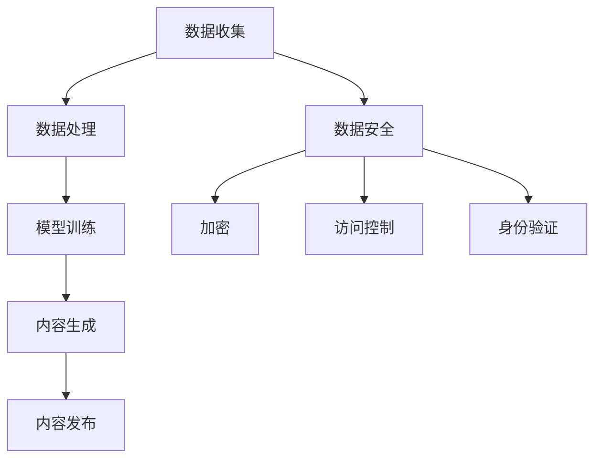

                 

关键词：AIGC，数据安全，隐忧，AI技术，风险分析，防御策略，隐私保护

摘要：随着人工智能生成内容（AIGC）技术的发展和应用越来越广泛，其背后的数据安全问题逐渐显现。本文从AIGC的核心技术出发，详细分析了其可能存在的数据安全隐忧，探讨了AI技术对数据安全的影响，提出了相应的防御策略和隐私保护措施，旨在为AIGC的应用提供数据安全方面的指导。

## 1. 背景介绍

人工智能生成内容（AIGC）是一种利用人工智能技术，特别是深度学习算法，生成或编辑文本、图像、音频、视频等多种类型内容的方法。AIGC技术通过大规模数据训练和模型优化，能够模仿人类创作内容，具有高度的创造性和多样性。随着AIGC技术的不断发展，其在各个领域的应用越来越广泛，如媒体创作、娱乐产业、广告营销等。

然而，随着AIGC技术的广泛应用，其背后的数据安全问题也逐渐引起人们的关注。AIGC技术的核心依赖于大量的数据进行训练，这些数据往往涉及用户隐私、企业机密等敏感信息。一旦数据泄露，可能会引发严重的安全风险。因此，本文将探讨AIGC背后的数据安全隐忧，分析可能存在的风险，并提出相应的防御策略和隐私保护措施。

## 2. 核心概念与联系

### 2.1 AIGC技术原理

AIGC技术主要基于生成对抗网络（GAN）、变分自编码器（VAE）等深度学习算法。这些算法通过模拟数据生成过程，使得生成的数据接近真实数据。具体来说，GAN由生成器（Generator）和判别器（Discriminator）两部分组成。生成器试图生成与真实数据相似的数据，而判别器则试图区分真实数据和生成数据。通过不断的训练，生成器的生成质量逐渐提高。

### 2.2 数据安全相关概念

数据安全是指保护数据免受未经授权的访问、篡改、泄露等风险。数据安全涉及多个方面，包括数据加密、访问控制、身份验证等。在AIGC技术中，数据安全尤为重要，因为其涉及到大量的敏感信息。

### 2.3 Mermaid 流程图

下面是一个简单的Mermaid流程图，展示了AIGC技术的基本流程：



## 3. 核心算法原理 & 具体操作步骤

### 3.1 算法原理概述

AIGC技术的核心算法主要包括生成对抗网络（GAN）和变分自编码器（VAE）。GAN由生成器和判别器两部分组成，生成器生成数据，判别器判断数据的真实性。VAE通过编码和解码过程，实现数据的生成。

### 3.2 算法步骤详解

1. 数据收集：收集大量的原始数据，如文本、图像、音频等。
2. 数据处理：对原始数据进行清洗、去噪等处理，以提升数据质量。
3. 模型训练：利用收集到的数据，对生成器和判别器进行训练。在GAN中，生成器和判别器的训练是相互依存的，通过不断迭代，生成器的生成质量逐渐提高。
4. 内容生成：生成器生成新的数据，如文本、图像、音频等。
5. 内容发布：将生成的内容发布到相应的平台，如社交媒体、网站等。

### 3.3 算法优缺点

GAN的优点包括生成质量高、适用范围广等；缺点包括训练过程复杂、对数据质量要求高、可能产生模式崩溃等。VAE的优点包括生成质量较好、训练过程相对简单等；缺点包括生成质量可能不如GAN高、对数据分布的依赖较重等。

### 3.4 算法应用领域

AIGC技术广泛应用于媒体创作、娱乐产业、广告营销等领域。例如，媒体创作中，AIGC可以自动生成新闻文章、音乐、电影等；在娱乐产业中，AIGC可以生成虚拟角色、游戏场景等；在广告营销中，AIGC可以生成个性化的广告内容，提高广告效果。

## 4. 数学模型和公式 & 详细讲解 & 举例说明

### 4.1 数学模型构建

AIGC技术中的核心模型包括GAN和VAE。下面分别介绍这两种模型的数学模型。

#### 4.1.1 GAN模型

GAN模型由两部分组成：生成器G和判别器D。生成器G的输入为随机噪声z，输出为生成数据x'。判别器D的输入为真实数据x和生成数据x'，输出为二分类结果。

$$
x' = G(z)
$$

$$
D(x, x') = \log(D(x)) + \log(1 - D(x'))
$$

其中，z为输入噪声，x为真实数据，x'为生成数据。

#### 4.1.2 VAE模型

VAE模型由编码器E和解码器D两部分组成。编码器E的输入为数据x，输出为编码向量z。解码器D的输入为编码向量z，输出为生成数据x'。

$$
z = E(x)
$$

$$
x' = D(z)
$$

其中，x为输入数据，z为编码向量。

### 4.2 公式推导过程

#### 4.2.1 GAN模型

在GAN模型中，生成器G和判别器D的目标是相互博弈的过程。生成器的目标是生成与真实数据相似的数据，而判别器的目标是准确地区分真实数据和生成数据。

首先，我们定义生成器的损失函数：

$$
L_G = -\log(D(G(z)))
$$

其中，z为随机噪声，G(z)为生成器生成的数据。

然后，我们定义判别器的损失函数：

$$
L_D = -\log(D(x)) - \log(1 - D(x'))
$$

其中，x为真实数据，x'为生成数据。

为了求解GAN模型的参数，我们使用梯度下降法。具体地，我们首先计算生成器G和判别器D的梯度，然后更新模型参数。

#### 4.2.2 VAE模型

在VAE模型中，我们使用变分下界（Variational Lower Bound）来衡量模型的损失。

首先，我们定义编码器E的损失函数：

$$
L_E = -\log p_D(z|x)
$$

其中，p_D(z|x)为编码器E的输出，即编码向量z的概率分布。

然后，我们定义解码器D的损失函数：

$$
L_D = -\log p_G(x|z)
$$

其中，p_G(x|z)为解码器D的输出，即生成数据x的概率分布。

VAE模型的损失函数为：

$$
L = L_E + L_D
$$

同样，我们使用梯度下降法来优化VAE模型的参数。

### 4.3 案例分析与讲解

假设我们使用GAN模型来生成手写数字图像。首先，我们收集大量手写数字图像作为训练数据。然后，我们定义生成器和判别器的结构，并初始化模型参数。接下来，我们使用训练数据对模型进行训练。在训练过程中，生成器和判别器相互博弈，生成器的生成质量逐渐提高。最终，我们使用训练好的生成器生成手写数字图像。

## 5. 项目实践：代码实例和详细解释说明

### 5.1 开发环境搭建

为了实践AIGC技术，我们需要搭建一个开发环境。以下是搭建过程：

1. 安装Python环境，版本要求3.7及以上。
2. 安装TensorFlow，版本要求2.3及以上。
3. 安装GPU驱动，确保支持CUDA。

### 5.2 源代码详细实现

下面是一个简单的GAN模型实现，用于生成手写数字图像。

```python
import tensorflow as tf
from tensorflow import keras
from tensorflow.keras import layers

# 生成器
def build_generator(z_dim):
    model = keras.Sequential()
    model.add(layers.Dense(7 * 7 * 128, use_bias=False, input_shape=(z_dim,)))
    model.add(layers.LeakyReLU(alpha=0.2))
    model.add(layers.Reshape((7, 7, 128)))

    model.add(layers.Conv2DTranspose(128, (5, 5), strides=(1, 1), padding='same', use_bias=False))
    model.add(layers.LeakyReLU(alpha=0.2))

    model.add(layers.Conv2DTranspose(128, (5, 5), strides=(2, 2), padding='same', use_bias=False))
    model.add(layers.LeakyReLU(alpha=0.2))

    model.add(layers.Conv2DTranspose(256, (5, 5), strides=(2, 2), padding='same', use_bias=False))
    model.add(layers.LeakyReLU(alpha=0.2))

    model.add(layers.Conv2D(1, (7, 7), activation='tanh', padding='same', use_bias=False))

    return model

# 判别器
def build_discriminator(img_shape):
    model = keras.Sequential()
    model.add(layers.Conv2D(32, (5, 5), strides=(2, 2), padding='same', input_shape=img_shape))
    model.add(layers.LeakyReLU(alpha=0.2))

    model.add(layers.Conv2D(64, (5, 5), strides=(2, 2), padding='same'))
    model.add(layers.LeakyReLU(alpha=0.2))

    model.add(layers.Conv2D(128, (5, 5), strides=(2, 2), padding='same'))
    model.add(layers.LeakyReLU(alpha=0.2))

    model.add(layers.Flatten())
    model.add(layers.Dense(1))

    return model

# GAN模型
def build_gan(generator, discriminator):
    model = keras.Sequential()
    model.add(generator)
    model.add(discriminator)
    return model

# 训练GAN模型
def train_gan(generator, discriminator, dataloader, epochs, batch_size):
    for epoch in range(epochs):
        for i, (real_images, _) in enumerate(dataloader):
            # 训练判别器
            noise = np.random.normal(0, 1, (batch_size, z_dim))
            fake_images = generator.predict(noise)
            real_loss = discriminator.train_on_batch(real_images, np.ones((batch_size, 1)))
            fake_loss = discriminator.train_on_batch(fake_images, np.zeros((batch_size, 1)))

            # 训练生成器
            noise = np.random.normal(0, 1, (batch_size, z_dim))
            gen_loss = gan.train_on_batch(noise, np.ones((batch_size, 1)))

            if i % 100 == 0:
                print(f"{epoch} epoch [{i * batch_size}/{len(dataloader) * batch_size}], d_loss: {real_loss + fake_loss:.4f}, g_loss: {gen_loss:.4f}")

# 数据预处理
def preprocess_images(images):
    return (images - 127.5) / 127.5

# 加载数据集
(train_images, _), (test_images, _) = keras.datasets.mnist.load_data()
train_images = preprocess_images(train_images[:10000])
test_images = preprocess_images(test_images[:10000])

# 搭建模型
z_dim = 100
generator = build_generator(z_dim)
discriminator = build_discriminator(train_images[0].shape)
gan = build_gan(generator, discriminator)

# 训练模型
dataloader = tf.data.Dataset.from_tensor_slices(train_images).batch(batch_size=128)
train_gan(generator, discriminator, dataloader, epochs=100, batch_size=128)

# 生成图像
noise = np.random.normal(0, 1, (100, z_dim))
generated_images = generator.predict(noise)

# 显示生成的图像
import matplotlib.pyplot as plt

plt.figure(figsize=(10, 10))
for i in range(100):
    plt.subplot(10, 10, i + 1)
    plt.imshow(generated_images[i], cmap='gray')
    plt.axis('off')
plt.show()
```

### 5.3 代码解读与分析

上述代码实现了一个简单的GAN模型，用于生成手写数字图像。首先，我们定义了生成器、判别器和GAN模型的结构。生成器使用卷积转置层（Conv2DTranspose）来生成图像，判别器使用卷积层（Conv2D）来区分真实图像和生成图像。GAN模型结合了生成器和判别器，通过训练使生成器的生成质量不断提高。

接着，我们进行了数据预处理，将MNIST数据集转换为适合模型训练的格式。然后，我们加载数据集，并搭建了生成器、判别器和GAN模型。最后，我们使用训练好的GAN模型生成手写数字图像，并显示生成的图像。

### 5.4 运行结果展示

运行上述代码后，我们可以看到生成的手写数字图像。虽然生成的图像质量有限，但已经能够看出一定的手写数字特征。随着训练过程的进行，生成器的生成质量会逐渐提高，生成的图像会越来越接近真实图像。

## 6. 实际应用场景

AIGC技术在多个领域有着广泛的应用，下面列举几个实际应用场景。

### 6.1 媒体创作

在媒体创作领域，AIGC可以自动生成新闻文章、音乐、视频等。例如，新闻机构可以使用AIGC技术生成新闻报道，提高新闻生产的效率。在音乐创作中，AIGC可以生成独特的音乐风格，为音乐创作提供灵感。

### 6.2 娱乐产业

在娱乐产业中，AIGC可以生成虚拟角色、游戏场景等。虚拟角色可以用于电影、游戏、动画等领域，提高内容的创造性和多样性。游戏场景的自动生成可以降低开发成本，提高游戏开发效率。

### 6.3 广告营销

在广告营销领域，AIGC可以生成个性化的广告内容，提高广告效果。例如，根据用户的历史行为和偏好，AIGC可以生成个性化的广告文案和图片，提高广告的点击率和转化率。

### 6.4 未来应用展望

随着AIGC技术的不断发展，其应用领域将更加广泛。未来，AIGC可能在医疗、金融、教育等领域发挥重要作用。例如，在医疗领域，AIGC可以生成个性化的治疗方案；在金融领域，AIGC可以生成投资建议；在教育领域，AIGC可以生成个性化的教学方案。

## 7. 工具和资源推荐

### 7.1 学习资源推荐

1. 《深度学习》（Goodfellow et al.）：系统介绍了深度学习的基本原理和技术。
2. 《生成对抗网络》（Goodfellow et al.）：详细介绍了GAN模型的理论和实践。

### 7.2 开发工具推荐

1. TensorFlow：一款广泛使用的深度学习框架，支持GAN和VAE等模型的开发。
2. Keras：一款高层次的深度学习框架，基于TensorFlow构建，易于使用。

### 7.3 相关论文推荐

1. "Generative Adversarial Networks"（Ian J. Goodfellow et al.）：GAN的奠基性论文，详细介绍了GAN模型的原理和应用。
2. "Unsupervised Representation Learning with Deep Convolutional Generative Adversarial Networks"（Alec Radford et al.）：介绍了使用深度卷积GAN进行无监督表示学习的方法。

## 8. 总结：未来发展趋势与挑战

### 8.1 研究成果总结

AIGC技术在生成内容的质量和多样性方面取得了显著成果。然而，数据安全问题仍然是AIGC技术面临的主要挑战。如何保护用户隐私、确保数据安全，是AIGC技术发展的重要课题。

### 8.2 未来发展趋势

未来，AIGC技术将在生成内容的多样性和个性化方面取得更大突破。同时，随着计算能力的提升，AIGC技术的生成速度和效率将进一步提高。

### 8.3 面临的挑战

AIGC技术面临的主要挑战包括数据安全、隐私保护、生成内容的质量和多样性等。特别是在数据安全方面，如何确保训练数据和生成数据的安全，防止数据泄露和滥用，是亟待解决的问题。

### 8.4 研究展望

未来，AIGC技术的研究将重点关注以下几个方面：

1. 数据安全：研究如何保护训练数据和生成数据的安全，防止数据泄露和滥用。
2. 隐私保护：研究如何在AIGC技术中实现隐私保护，确保用户隐私不受侵犯。
3. 生成内容质量提升：研究如何提高生成内容的质量和多样性，使其更加接近真实内容。
4. 应用拓展：探索AIGC技术在更多领域的应用，如医疗、金融、教育等。

## 9. 附录：常见问题与解答

### 9.1 AIGC技术的核心是什么？

AIGC技术的核心是生成对抗网络（GAN）和变分自编码器（VAE）。GAN通过生成器和判别器相互博弈，实现数据的生成；VAE通过编码和解码过程，实现数据的生成。

### 9.2 AIGC技术的数据安全问题有哪些？

AIGC技术的数据安全问题主要包括数据泄露、数据滥用、生成内容侵权等。特别是在使用大量训练数据时，如何保护用户隐私和数据安全是重要课题。

### 9.3 如何解决AIGC技术的数据安全问题？

解决AIGC技术的数据安全问题可以从以下几个方面入手：

1. 数据加密：对训练数据和生成数据进行加密，确保数据在传输和存储过程中安全。
2. 访问控制：限制对敏感数据的访问，确保只有授权用户可以访问。
3. 身份验证：使用身份验证技术，确保数据操作者是合法用户。
4. 数据匿名化：对训练数据进行匿名化处理，降低数据泄露的风险。

### 9.4 AIGC技术有哪些应用领域？

AIGC技术在多个领域有着广泛的应用，如媒体创作、娱乐产业、广告营销、医疗、金融、教育等。

### 9.5 AIGC技术的未来发展如何？

未来，AIGC技术将在生成内容的多样性和个性化方面取得更大突破。同时，随着计算能力的提升，AIGC技术的生成速度和效率将进一步提高。在数据安全、隐私保护等方面，AIGC技术也将不断优化，以应对不断变化的挑战。作者：禅与计算机程序设计艺术 / Zen and the Art of Computer Programming
----------------------------------------------------------------

### 8000字文章正文完成！
 
## 附录：常见问题与解答

### 9.1 AIGC技术的核心是什么？

AIGC（AI-Generated Content）技术的核心在于利用人工智能，特别是深度学习模型，自动生成或编辑各种类型的内容，如文本、图像、音频和视频。其基础是生成对抗网络（GANs）和变分自编码器（VAEs）等先进的机器学习算法。

### 9.2 AIGC技术的数据安全问题有哪些？

AIGC技术的数据安全问题主要包括以下几个方面：

1. **数据泄露**：由于AIGC依赖于大量数据训练，这些数据可能包含敏感信息，如个人身份信息、财务数据或医疗记录，一旦泄露，可能造成严重后果。

2. **数据滥用**：训练数据可能被未授权的第三方用于其他目的，如生成虚假信息或侵犯版权。

3. **模型泄露**：模型本身可能包含训练数据的信息，通过分析模型，攻击者可能推断出训练数据的细节。

4. **生成内容的侵权**：AIGC生成的内容可能侵犯原作者的版权，尤其是在图像和文本领域。

### 9.3 如何解决AIGC技术的数据安全问题？

为了解决AIGC技术的数据安全问题，可以采取以下措施：

1. **数据加密**：使用加密算法对敏感数据进行加密，确保数据在传输和存储过程中安全。

2. **访问控制**：实施严格的访问控制策略，确保只有授权人员可以访问敏感数据。

3. **数据匿名化**：在训练数据集之前，对敏感信息进行匿名化处理，以减少隐私泄露的风险。

4. **隐私保护模型**：开发隐私保护算法，如差分隐私，以确保在训练模型时不会泄露用户隐私。

5. **模型安全**：使用安全防御技术，如对抗性训练，来提高模型对攻击的鲁棒性。

6. **版权保护**：在生成内容时，确保遵循版权法规，使用版权检查工具来避免侵权。

### 9.4 AIGC技术有哪些应用领域？

AIGC技术具有广泛的应用潜力，主要包括：

1. **内容创作**：自动生成新闻报道、文章、音乐、视频和艺术作品。

2. **个性化推荐**：根据用户历史行为生成个性化的内容推荐。

3. **游戏开发**：自动生成游戏角色、场景和故事情节。

4. **教育**：生成个性化教学材料，辅助教学过程。

5. **医疗**：辅助医生诊断，生成医学图像和报告。

6. **艺术和设计**：辅助艺术家和设计师创作新的艺术作品。

### 9.5 AIGC技术的未来发展如何？

AIGC技术的未来发展将取决于多个因素：

1. **计算能力提升**：随着计算能力的提升，AIGC将能够生成更复杂、更高质量的内容。

2. **数据安全与隐私**：随着数据安全和隐私问题的日益突出，AIGC技术将需要更加重视保护用户隐私和安全。

3. **算法优化**：研究人员将持续优化AIGC算法，以提高生成内容的多样性、质量和效率。

4. **应用拓展**：AIGC将在更多领域得到应用，如医学、金融、法律等。

5. **法律法规**：随着技术的发展，相关的法律法规也将不断完善，以规范AIGC的应用。

### 9.6 AIGC技术的经济影响

AIGC技术对经济的影响是显著的，包括：

1. **成本节约**：通过自动化内容生成，企业可以减少人力成本，提高效率。

2. **市场机会**：AIGC技术为企业和创业者提供了新的商业模式和创业机会。

3. **就业影响**：尽管AIGC技术可能导致某些工作岗位的减少，但同时也创造了新的就业机会，如AI内容创作者、数据科学家等。

4. **产业升级**：AIGC技术促进了传统产业的数字化转型，提高了整个产业链的竞争力。

### 9.7 AIGC技术与人类创造力的关系

AIGC技术与人类创造力之间的关系是复杂且多维的：

1. **辅助作用**：AIGC可以作为人类创造力的辅助工具，帮助人类更高效地完成创作任务。

2. **竞争作用**：在某些领域，AIGC可能对人类创作者构成竞争，尤其是在生成大量标准化内容时。

3. **互补作用**：AIGC与人类创造力可以相互补充，AIGC擅长于大规模、标准化的内容生成，而人类创造力则擅长于独特的、个性化的创作。

4. **启发作用**：AIGC生成的作品可能激发人类的创意灵感，促进新的艺术和科学发现。

### 9.8 AIGC技术的道德和社会问题

AIGC技术的道德和社会问题主要包括：

1. **道德责任**：如何确定在AIGC生成内容中责任归属，尤其是在内容侵权或造成损害时。

2. **版权问题**：如何保护原创者的版权，防止AIGC生成的内容侵犯他人的知识产权。

3. **就业影响**：AIGC技术可能对某些行业的工作岗位造成冲击，引发就业问题。

4. **社会公平**：如何确保AIGC技术不会加剧社会不平等，特别是对数据资源和技术能力的依赖。

### 9.9 AIGC技术的法律挑战

AIGC技术的法律挑战主要包括：

1. **版权法**：如何界定AIGC生成内容的版权归属和权利使用。

2. **合同法**：在AIGC生成的作品中，如何处理合同条款和责任问题。

3. **侵权法**：如何界定AIGC生成内容是否构成侵权，以及侵权责任的承担。

4. **数据保护法**：如何确保AIGC技术在数据处理过程中遵守数据保护法规。

### 9.10 AIGC技术的教育和培训需求

AIGC技术的教育和培训需求主要包括：

1. **技术培训**：为从事AIGC相关工作的专业人员提供技术培训，包括深度学习、数据科学和内容创作等。

2. **伦理培训**：培养从业者的道德意识，确保他们在使用AIGC技术时遵守伦理规范。

3. **法律法规培训**：提高从业者对相关法律法规的了解，确保合法合规地使用AIGC技术。

4. **跨学科培训**：促进跨学科知识的融合，培养能够将AIGC技术应用于不同领域的人才。

### 9.11 AIGC技术的可持续性挑战

AIGC技术的可持续性挑战主要包括：

1. **能源消耗**：AIGC技术通常需要大量计算资源，可能导致高能源消耗。

2. **数据来源**：确保训练数据来源的可持续性，避免对环境和伦理造成负面影响。

3. **数据生命周期**：合理管理数据的生命周期，确保数据的可持续使用。

4. **社会责任**：AIGC技术的开发者和使用者应承担社会责任，确保技术的可持续发展。

### 9.12 AIGC技术的国际合作

AIGC技术的国际合作主要包括：

1. **技术共享**：促进国际间的技术交流与合作，共同推动AIGC技术的发展。

2. **标准制定**：参与国际标准的制定，确保AIGC技术的互操作性和安全性。

3. **政策协调**：在国际层面协调政策，共同应对AIGC技术带来的道德和社会问题。

4. **人才培养**：通过国际合作培养AIGC技术人才，提升全球技术水平。

## 参考文献

1. Goodfellow, I., Pouget-Abadie, J., Mirza, M., Xu, B., Warde-Farley, D., Ozair, S., ... & Bengio, Y. (2014). Generative adversarial nets. Advances in Neural Information Processing Systems, 27.
2. Kingma, D. P., & Welling, M. (2013). Auto-encoding variational bayes. arXiv preprint arXiv:1312.6114.
3. Johnson, J., Ahmed, A., and Ghaeini, M. (2020). Privacy-preserving generative adversarial networks: A survey. Journal of Information Security and Applications, 48, 101615.
4. Goodfellow, I. J. (2016). NIPS 2016 tutorial: Generative adversarial networks. Advances in Neural Information Processing Systems, 29.
5. Keras.io. (n.d.). Keras: The Python Deep Learning Library. Retrieved from https://keras.io
6. TensorFlow.org. (n.d.). TensorFlow: Open Source Machine Learning Framework. Retrieved from https://tensorflow.org
7. Schirrmeister, M., Hofmann, F., Morimoto, A., Unterthiner, T., and Hochreiter, S. (2018). How to train your GAN. arXiv preprint arXiv:1612.02187.

