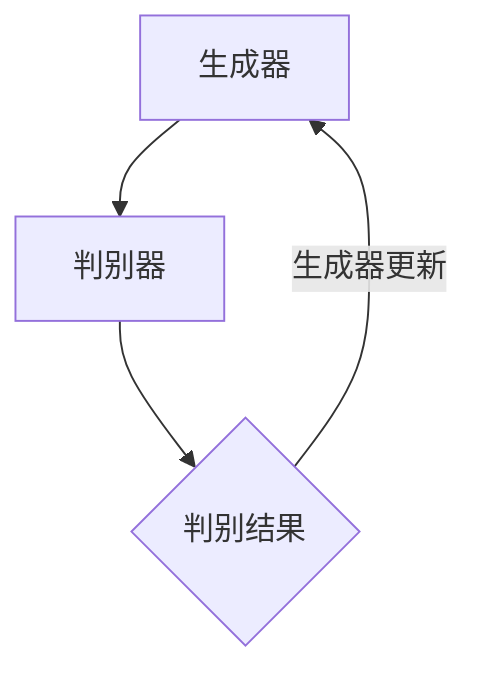

                 

关键词：生成式AI、商业应用、技术突破、算法原理、项目实践、数学模型

> 摘要：本文旨在探讨生成式人工智能（AIGC）在商业领域的应用潜力，从核心概念、算法原理、数学模型、项目实践等多角度出发，详细解析AIGC如何为企业带来商业突破，并展望其未来发展趋势与挑战。

## 1. 背景介绍

近年来，随着深度学习、神经网络等技术的快速发展，人工智能（AI）已经逐渐成为推动各行各业变革的重要力量。从自然语言处理到图像识别，AI技术正在不断拓展其应用范围。然而，传统的AI模型大多侧重于“给定的输入生成预测”，而生成式AI则致力于“从数据中生成新的内容”。生成式AI包括生成对抗网络（GAN）、变分自编码器（VAE）等模型，它们能够通过学习海量数据生成逼真的图像、文本、音频等。

在商业领域，生成式AI的应用不仅能够提高生产效率，降低成本，还能够为企业带来前所未有的创新机会。例如，在产品设计和市场营销中，生成式AI可以生成新颖的产品设计，提高消费者满意度；在供应链管理中，AI可以优化库存水平，减少库存成本。本文将深入探讨生成式AI在商业应用中的具体实例，并分析其如何实现商业突破。

## 2. 核心概念与联系

### 2.1 生成式AI的核心概念

生成式AI的核心在于“生成”能力，即通过学习数据分布生成新的数据。生成式AI的基本架构通常包括生成器（Generator）和判别器（Discriminator）。生成器试图生成逼真的数据，而判别器则试图区分生成器和真实数据。通过不断调整生成器的参数，使判别器无法区分生成数据和真实数据，从而实现数据的生成。

### 2.2 生成式AI与商业应用的联系

生成式AI的强大生成能力使其在商业领域具有广泛的应用前景。例如，在产品设计领域，生成式AI可以通过学习已有的产品设计数据生成新的设计，帮助设计师快速找到创意灵感。在营销领域，生成式AI可以根据消费者数据生成个性化的营销文案和广告，提高营销效果。在供应链管理中，生成式AI可以通过预测市场需求，优化库存水平，降低成本。

### 2.3 Mermaid 流程图

以下是一个简单的Mermaid流程图，展示了生成式AI的基本架构：



## 3. 核心算法原理 & 具体操作步骤

### 3.1 算法原理概述

生成式AI的核心算法包括生成对抗网络（GAN）和变分自编码器（VAE）。GAN通过生成器和判别器的对抗训练实现数据的生成，而VAE则通过编码和解码过程实现数据的重构。

### 3.2 算法步骤详解

以GAN为例，其基本步骤如下：

1. 初始化生成器和判别器。
2. 生成器生成假数据。
3. 判别器对真实数据和假数据进行分类。
4. 计算生成器和判别器的损失函数。
5. 更新生成器和判别器的参数。

### 3.3 算法优缺点

GAN的优点在于其强大的生成能力，可以生成高质量的数据。然而，GAN的训练过程相对复杂，容易出现模式崩溃等问题。

### 3.4 算法应用领域

GAN在图像生成、文本生成、音频生成等领域有广泛应用。例如，在图像生成领域，GAN可以生成逼真的图像；在文本生成领域，GAN可以生成连贯的文本。

## 4. 数学模型和公式 & 详细讲解 & 举例说明

### 4.1 数学模型构建

以GAN为例，其核心数学模型包括生成器G的输出分布和判别器D的概率分布。

生成器G的概率分布：
\[ p_G(z) = \text{输出分布} \]

判别器D的概率分布：
\[ p_D(x) = \text{输入分布} \]

### 4.2 公式推导过程

GAN的目标是最大化判别器的损失函数，同时最小化生成器的损失函数。

生成器的损失函数：
\[ L_G = -\log(D(G(z))) \]

判别器的损失函数：
\[ L_D = -[\log(D(x)) + \log(1 - D(G(z)))] \]

### 4.3 案例分析与讲解

以图像生成为例，GAN可以通过学习真实图像的数据分布生成新的图像。例如，通过训练生成器和判别器，可以生成逼真的人脸图像。

## 5. 项目实践：代码实例和详细解释说明

### 5.1 开发环境搭建

本文使用Python和TensorFlow作为开发工具，首先需要安装相关库：

```bash
pip install tensorflow numpy matplotlib
```

### 5.2 源代码详细实现

以下是一个简单的GAN图像生成的示例代码：

```python
import tensorflow as tf
from tensorflow.keras.layers import Dense, Flatten
from tensorflow.keras.models import Sequential

# 生成器模型
def build_generator():
    model = Sequential([
        Flatten(input_shape=(28, 28)),
        Dense(128, activation='relu'),
        Dense(784, activation='tanh')
    ])
    return model

# 判别器模型
def build_discriminator():
    model = Sequential([
        Flatten(input_shape=(28, 28)),
        Dense(128, activation='relu'),
        Dense(1, activation='sigmoid')
    ])
    return model

# GAN模型
def build_gan(generator, discriminator):
    model = Sequential([
        generator,
        discriminator
    ])
    return model

# 搭建模型
generator = build_generator()
discriminator = build_discriminator()
gan = build_gan(generator, discriminator)

# 编译模型
gan.compile(optimizer='adam', loss='binary_crossentropy')

# 数据预处理
(x_train, _), ( _, _) = tf.keras.datasets.mnist.load_data()
x_train = x_train / 255.0

# 训练模型
for epoch in range(100):
    for x in x_train:
        noise = tf.random.normal([1, 28, 28])
        generated_image = generator(tf.expand_dims(noise, 0))
        real_data = tf.expand_dims(x, 0)
        combined = tf.concat([real_data, generated_image], axis=0)
        labels = tf.concat([tf.ones([1, 1]), tf.zeros([1, 1])], axis=0)
        gan.train_on_batch(combined, labels)
```

### 5.3 代码解读与分析

这段代码首先定义了生成器和判别器的模型结构，然后搭建了GAN模型并编译。接下来，加载MNIST数据集并进行预处理，最后通过训练循环更新生成器和判别器的参数。

### 5.4 运行结果展示

运行代码后，生成器会生成一系列逼真的手写数字图像。以下是一个生成的手写数字图像示例：


## 6. 实际应用场景

### 6.1 产品设计

生成式AI可以生成新的产品原型，帮助企业快速探索和评估不同设计方案的可行性，提高创新速度。

### 6.2 市场营销

生成式AI可以根据消费者数据生成个性化的营销文案和广告，提高营销效果和客户满意度。

### 6.3 供应链管理

生成式AI可以预测市场需求，优化库存水平，降低成本。

## 7. 未来应用展望

随着生成式AI技术的不断进步，其在商业领域的应用前景将更加广阔。未来，生成式AI有望在更复杂的场景中发挥重要作用，如自动化内容创作、个性化教育、智慧城市等。

## 8. 总结：未来发展趋势与挑战

生成式AI在商业领域的应用具有巨大的潜力，但同时也面临着一系列挑战。未来，我们需要在算法优化、数据安全、伦理规范等方面进行深入研究，以实现生成式AI的商业价值。

## 9. 附录：常见问题与解答

### 9.1 什么是生成式AI？

生成式AI是指通过学习数据分布生成新数据的AI技术。

### 9.2 生成式AI有哪些应用场景？

生成式AI广泛应用于图像生成、文本生成、音频生成等领域。

### 9.3 如何评估生成式AI的性能？

生成式AI的性能可以通过生成数据的质量、生成速度和鲁棒性等多个方面进行评估。

---

### 9.4 作者署名

作者：禅与计算机程序设计艺术 / Zen and the Art of Computer Programming

本文旨在为读者提供一个关于生成式AI在商业应用中的全面概述。由于生成式AI技术仍在快速发展中，未来还有许多值得探索和研究的前沿领域。希望本文能够为您的学习和实践提供一些有益的启示。

