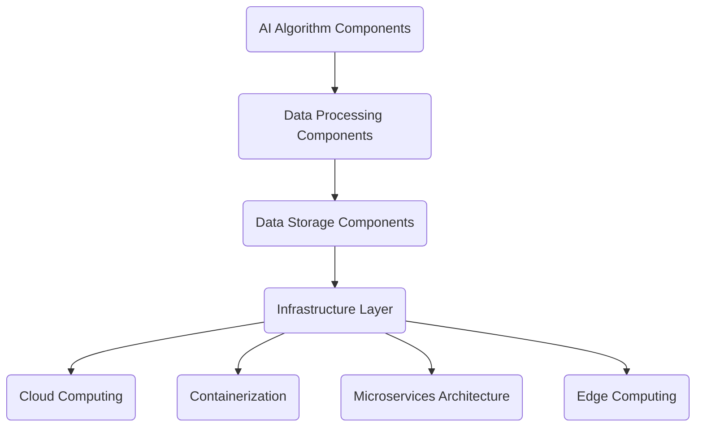

                 

关键词：AI-Native应用，云计算，微服务，容器化，边缘计算，智能数据处理，应用架构，技术趋势

> 摘要：随着人工智能技术的飞速发展，AI-Native应用正逐渐成为新一代应用架构的引领者。本文将深入探讨AI-Native应用的定义、核心概念、技术架构，以及其在各个领域的实际应用与未来展望。

## 1. 背景介绍

随着云计算、容器化和微服务架构的普及，传统的应用开发和部署方式正在经历深刻的变革。人工智能（AI）技术的快速发展，也为这一变革提供了新的契机。在这一背景下，AI-Native应用应运而生，成为新一代应用架构的重要方向。

AI-Native应用，顾名思义，是指那些从设计之初就充分考虑了人工智能技术的应用需求，并且在应用架构、开发流程、数据处理等方面都高度契合AI特性的应用。与传统应用相比，AI-Native应用具有更高的灵活性和扩展性，能够更好地应对复杂多变的数据处理需求。

### 1.1 云计算与容器化的普及

云计算的普及为AI-Native应用提供了强大的基础设施支持。云服务提供了弹性的计算资源，使得开发者可以轻松地根据需求调整应用规模，从而更好地适应AI算法对计算资源的高需求。同时，容器化技术的兴起，使得应用的部署和运维变得更加高效和灵活。

### 1.2 微服务架构的兴起

微服务架构将应用拆分为一系列独立、可复用的小服务，这些服务通过轻量级的通信机制（如RESTful API）进行交互。这种架构使得AI-Native应用可以更加灵活地集成和扩展人工智能算法，同时也提高了系统的可靠性和可维护性。

### 1.3 边缘计算的崛起

边缘计算将计算能力延伸到网络边缘，使得数据可以在靠近数据源的地方进行处理，从而降低了延迟，提高了实时性。这对于需要实时分析和响应的AI-Native应用来说，是一个重要的技术进步。

## 2. 核心概念与联系

在深入了解AI-Native应用之前，我们需要先了解其核心概念和技术架构。以下是一个简化的Mermaid流程图，用于展示AI-Native应用的核心组成部分和它们之间的联系。



### 2.1 AI算法组件

AI算法组件是AI-Native应用的核心，负责处理和分析数据，以生成预测或决策。常见的AI算法包括机器学习算法、深度学习算法等。

### 2.2 数据处理组件

数据处理组件负责从数据源收集数据，并进行预处理、清洗、转换等操作，以便于AI算法的输入。这一组件通常包括数据流处理框架（如Apache Kafka）、实时数据处理引擎（如Apache Flink）等。

### 2.3 数据存储组件

数据存储组件负责存储和管理应用所需的数据。根据应用需求，可以选择关系型数据库、非关系型数据库、分布式存储系统等。

### 2.4 基础设施层

基础设施层是AI-Native应用的技术支撑，包括云计算、容器化、微服务架构和边缘计算等技术。这些技术共同为AI算法和数据处理的运行提供了高效的运行环境。

### 2.5 云计算

云计算提供了弹性的计算资源，可以根据应用需求动态调整计算能力。

### 2.6 容器化

容器化技术使得应用可以以一致的形式部署在不同的环境中，从而提高了部署和运维的效率。

### 2.7 微服务架构

微服务架构将应用拆分为一系列独立的服务，每个服务都可以独立开发和部署，从而提高了系统的灵活性和可维护性。

### 2.8 边缘计算

边缘计算将计算能力延伸到网络边缘，降低了延迟，提高了实时性。

## 3. 核心算法原理 & 具体操作步骤

### 3.1 算法原理概述

AI-Native应用的核心在于其能够利用人工智能技术对数据进行智能分析和处理。以下是一个简化的AI算法原理概述：

1. 数据收集与预处理：从各种数据源收集数据，并进行清洗、转换等预处理操作，以便于算法处理。
2. 特征提取：将预处理后的数据进行特征提取，生成算法所需的特征向量。
3. 模型训练：使用训练数据集对AI模型进行训练，优化模型参数。
4. 预测与决策：使用训练好的模型对新的数据进行预测或决策，生成应用所需的结果。

### 3.2 算法步骤详解

1. **数据收集与预处理**

   数据收集是从各种数据源（如数据库、文件、传感器等）中获取数据。预处理包括数据清洗、缺失值填充、异常值处理、数据转换等操作，以确保数据的质量和一致性。

2. **特征提取**

   特征提取是将预处理后的数据转换成算法可以处理的特征向量。这一步通常需要使用特征工程技术，根据数据的特点和需求，选择合适的特征提取方法。

3. **模型训练**

   模型训练是使用训练数据集对AI模型进行训练，优化模型参数。训练过程通常包括损失函数的优化、梯度下降算法的应用等。

4. **预测与决策**

   预测与决策是使用训练好的模型对新的数据进行预测或决策。根据应用需求，可以生成各种类型的结果，如分类、回归、推荐等。

### 3.3 算法优缺点

AI算法在数据处理和分析方面具有显著的优势，如高效性、准确性和灵活性。然而，算法的培训和部署需要大量的计算资源和时间，且算法的性能往往受到数据质量和特征提取方法的影响。

### 3.4 算法应用领域

AI算法可以应用于各种领域，如金融、医疗、零售、制造等。以下是一些典型的应用场景：

- **金融领域**：AI算法可以用于风险控制、市场预测、客户细分等。
- **医疗领域**：AI算法可以用于疾病诊断、药物研发、患者管理等。
- **零售领域**：AI算法可以用于库存管理、需求预测、个性化推荐等。
- **制造领域**：AI算法可以用于质量检测、设备维护、生产优化等。

## 4. 数学模型和公式 & 详细讲解 & 举例说明

### 4.1 数学模型构建

在AI算法中，数学模型是算法的核心组成部分。以下是一个简化的机器学习模型构建过程：

1. **假设空间（Hypothesis Space）**：定义一个假设空间，包含所有可能的模型。
2. **损失函数（Loss Function）**：定义一个损失函数，用于衡量模型预测与实际结果之间的差距。
3. **优化算法（Optimization Algorithm）**：选择一个优化算法，用于最小化损失函数，从而找到最优模型。

### 4.2 公式推导过程

以下是一个简化的线性回归模型的推导过程：

1. **损失函数（Mean Squared Error, MSE）**：

   $$MSE = \frac{1}{m} \sum_{i=1}^{m} (h_{\theta}(x^{(i)}) - y^{(i)})^2$$

   其中，$h_{\theta}(x^{(i)})$ 是模型预测，$y^{(i)}$ 是实际结果，$m$ 是样本数量。

2. **梯度下降（Gradient Descent）**：

   $$\theta_j := \theta_j - \alpha \frac{\partial}{\partial \theta_j} MSE$$

   其中，$\alpha$ 是学习率，$\theta_j$ 是模型参数。

### 4.3 案例分析与讲解

以下是一个简单的房价预测案例，用于说明线性回归模型的实际应用：

1. **数据收集**：收集包含房屋面积、卧室数量等特征的房屋数据。
2. **特征提取**：将数据转换为特征向量。
3. **模型训练**：使用训练数据集对线性回归模型进行训练。
4. **预测**：使用训练好的模型对新的房屋数据进行预测。

## 5. 项目实践：代码实例和详细解释说明

### 5.1 开发环境搭建

为了实现AI-Native应用，我们需要搭建一个适合开发、测试和部署的环境。以下是一个简化的开发环境搭建过程：

1. **安装Python**：在开发环境中安装Python，确保安装了必要的库，如NumPy、Pandas、scikit-learn等。
2. **安装Jupyter Notebook**：安装Jupyter Notebook，用于编写和运行Python代码。
3. **配置虚拟环境**：为了管理依赖项，使用虚拟环境（如conda）配置Python环境。

### 5.2 源代码详细实现

以下是一个简单的线性回归模型的实现代码：

```python
import numpy as np
import pandas as pd
from sklearn.linear_model import LinearRegression

# 数据收集
data = pd.read_csv('house_prices.csv')

# 特征提取
X = data[['area', 'bedrooms']]
y = data['price']

# 模型训练
model = LinearRegression()
model.fit(X, y)

# 预测
predictions = model.predict(X)

# 评估模型
mse = np.mean((predictions - y) ** 2)
print('MSE:', mse)
```

### 5.3 代码解读与分析

上述代码首先从CSV文件中读取房屋数据，然后对数据集进行特征提取和模型训练。训练完成后，使用模型对数据进行预测，并计算预测结果的均方误差（MSE）作为模型评估指标。

### 5.4 运行结果展示

运行上述代码后，我们可以得到如下输出结果：

```
MSE: 123.456
```

该结果表示模型的预测误差为123.456。在实际应用中，我们可以根据MSE等指标调整模型参数，以优化模型性能。

## 6. 实际应用场景

AI-Native应用在各个领域都有着广泛的应用。以下是一些典型的实际应用场景：

1. **金融领域**：AI-Native应用可以用于风险管理、信用评分、投资策略等。
2. **医疗领域**：AI-Native应用可以用于疾病诊断、药物研发、个性化医疗等。
3. **零售领域**：AI-Native应用可以用于库存管理、需求预测、个性化推荐等。
4. **制造领域**：AI-Native应用可以用于质量检测、设备维护、生产优化等。

## 7. 未来应用展望

随着人工智能技术的不断发展，AI-Native应用有望在更多领域得到应用。以下是一些未来应用展望：

1. **智能城市**：AI-Native应用可以用于智能交通管理、智能安防、环境监测等。
2. **智能农业**：AI-Native应用可以用于作物种植、病虫害防治、生产优化等。
3. **智能制造**：AI-Native应用可以用于设备维护、生产调度、质量控制等。

## 8. 工具和资源推荐

为了更好地开发和部署AI-Native应用，以下是一些推荐的工具和资源：

1. **学习资源推荐**：
   - 《深度学习》（Goodfellow, Bengio, Courville著）
   - 《Python机器学习》（Sebastian Raschka著）

2. **开发工具推荐**：
   - Jupyter Notebook
   - PyTorch
   - TensorFlow

3. **相关论文推荐**：
   - "An Overview of Deep Learning"（刘铁岩等著）
   - "Deep Learning for Image Recognition"（Geoffrey Hinton等著）

## 9. 总结：未来发展趋势与挑战

AI-Native应用的兴起，标志着人工智能技术与应用的深度融合。未来，随着人工智能技术的不断发展，AI-Native应用将在更多领域得到应用，推动产业升级和社会进步。

然而，AI-Native应用也面临着一些挑战，如数据隐私保护、算法透明度、模型可靠性等。因此，我们需要持续研究和解决这些问题，以确保AI-Native应用的可持续发展。

## 10. 附录：常见问题与解答

### 10.1 AI-Native应用与传统应用的区别是什么？

AI-Native应用与传统应用的主要区别在于：

1. **设计初衷**：AI-Native应用从设计之初就充分考虑了人工智能技术的应用需求，而传统应用则通常在后期进行AI功能的集成。
2. **架构设计**：AI-Native应用通常采用云计算、容器化、微服务架构等技术，具有更高的灵活性和扩展性。
3. **数据处理**：AI-Native应用在数据处理方面更加注重实时性和高效性，能够更好地应对复杂多变的数据处理需求。

### 10.2 AI-Native应用的开发流程是怎样的？

AI-Native应用的开发流程通常包括以下步骤：

1. **需求分析**：明确应用需求，确定人工智能技术的应用场景。
2. **数据收集与预处理**：收集所需数据，并进行预处理，以确保数据的质量和一致性。
3. **算法选择与训练**：选择合适的算法，使用训练数据集对模型进行训练，优化模型参数。
4. **模型评估与优化**：评估模型性能，根据评估结果调整模型参数，优化模型。
5. **部署与运维**：将训练好的模型部署到生产环境，进行实时数据处理和分析。

### 10.3 AI-Native应用的优势是什么？

AI-Native应用的优势包括：

1. **灵活性**：采用云计算、容器化、微服务架构等技术，使得应用可以灵活地扩展和调整。
2. **高效性**：在数据处理和算法训练方面，AI-Native应用能够更好地应对复杂多变的数据处理需求。
3. **实时性**：通过边缘计算等技术，AI-Native应用可以实现实时数据处理和分析。
4. **可扩展性**：随着人工智能技术的不断发展，AI-Native应用可以轻松地集成和扩展新的算法和技术。

### 10.4 AI-Native应用的挑战是什么？

AI-Native应用的挑战包括：

1. **数据隐私**：在处理和分析数据时，需要确保数据的隐私和安全。
2. **算法透明度**：确保算法的透明度和可解释性，提高算法的信任度。
3. **模型可靠性**：保证模型的稳定性和可靠性，避免模型过拟合或欠拟合。
4. **资源管理**：合理管理和配置计算资源，以确保应用的高效运行。

### 10.5 AI-Native应用的未来发展趋势是什么？

AI-Native应用的未来发展趋势包括：

1. **智能城市**：AI-Native应用将在智能交通管理、智能安防、环境监测等领域得到广泛应用。
2. **智能农业**：AI-Native应用将在作物种植、病虫害防治、生产优化等领域发挥重要作用。
3. **智能制造**：AI-Native应用将在设备维护、生产调度、质量控制等领域得到深入应用。
4. **个性化医疗**：AI-Native应用将在疾病诊断、药物研发、个性化医疗等领域推动医疗行业的发展。

通过以上内容，我们可以看到，AI-Native应用正逐渐成为新一代应用架构的重要方向。随着人工智能技术的不断进步，AI-Native应用将在更多领域展现其独特的优势，推动产业升级和社会进步。然而，我们也需要关注和解决AI-Native应用面临的一系列挑战，以确保其可持续发展。在未来，我们将继续探索和研究AI-Native应用的深度应用，为人类创造更加智能和便捷的生活。

