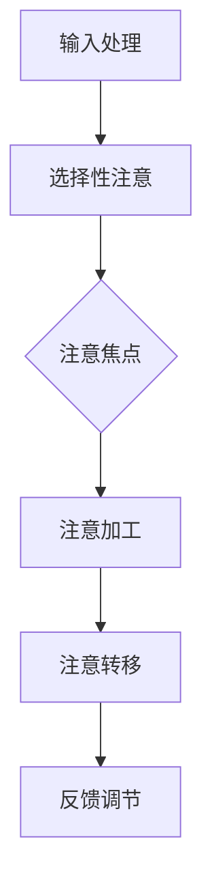

                 

在数字时代，人工智能（AI）的迅猛发展正深刻地改变着我们的生活方式和工作模式。AI技术不仅仅在提高生产效率、优化资源分配等方面发挥着重要作用，还在重塑人类注意力流，进而影响经济体系和社会结构。本文将深入探讨AI与人类注意力流之间的关系，分析这一关系如何在未来影响工作、技能培养以及注意力经济的管理与创新。

## 关键词

- 人工智能
- 注意力流
- 未来工作
- 技能培养
- 注意力经济
- 管理与创新

## 摘要

本文首先介绍了人工智能与注意力流的背景和重要性。随后，通过分析AI技术如何影响人类注意力流，探讨了未来工作模式的变化以及技能培养的新趋势。接着，文章讨论了注意力经济的管理与创新，提出了相应的策略和工具。最后，文章总结了研究结果，并对未来发展趋势与挑战进行了展望。

## 1. 背景介绍

在过去的几十年里，人工智能技术在各个领域都取得了显著的进步。从简单的规则系统到复杂的深度学习模型，AI的应用范围不断扩大。然而，随着AI技术的进步，人类注意力流也在发生深刻的变化。在传统的工业时代，人们的注意力主要集中在外部世界，如生产流程和物资流动。而在数字时代，人们的注意力逐渐转向虚拟世界，如社交媒体、在线娱乐和电子商务。

这种注意力流的变化不仅影响个人的生活方式，还对社会经济体系产生了深远的影响。注意力作为一种重要的资源，其流动方向和效率直接决定了信息传播的速度、市场反应的敏捷度以及经济活动的活跃度。因此，理解和掌握人类注意力流，已经成为当代社会一个不可忽视的课题。

### 1.1 人工智能的发展历程

人工智能的研究可以追溯到20世纪50年代。当时，科学家们提出了“图灵测试”的概念，试图通过机器是否能够模仿人类的智能行为来判断其智能水平。在随后的几十年里，人工智能经历了几个重要的发展阶段：

- **第一阶段（1956-1974年）**：以符号主义和推理机为核心，尝试通过符号处理和逻辑推理来实现人工智能。
- **第二阶段（1974-1980年）**：受到早期人工智能失败的影响，研究者开始关注基于知识的系统，并尝试通过规则库和知识表示来模拟智能行为。
- **第三阶段（1980-1987年）**：专家系统成为主流，通过大量知识库和推理机制来模拟专家决策过程。
- **第四阶段（1987-2006年）**：随着计算能力和算法的进步，机器学习开始崭露头角，尤其是支持向量机和决策树等模型的应用。
- **第五阶段（2006年至今）**：深度学习的兴起标志着人工智能进入了新的阶段，通过多层神经网络模拟人类大脑的学习和处理过程，实现了图像识别、自然语言处理等领域的突破性进展。

### 1.2 注意力流的概念

注意力流是指人类在认知过程中对信息的选择性关注和加工。注意力的分配不仅受到外部环境的影响，还受到个体心理状态和内在动机的影响。根据不同的划分标准，注意力流可以分为以下几种类型：

- **外部注意力流**：指个体对外部环境信息的关注，如视觉、听觉和触觉等感官信息。
- **内部注意力流**：指个体对内部思维过程和情感体验的关注，如自我反思和情绪调节。
- **选择性注意力流**：指个体在面对大量信息时，对部分信息进行优先处理的能力。
- **分配性注意力流**：指个体在同时处理多个任务时的注意力分配能力。

### 1.3 AI与注意力流的关系

人工智能技术对人类注意力流的影响主要体现在以下几个方面：

- **信息过载**：随着互联网和社交媒体的普及，人们每天接收到的信息量呈爆炸式增长。AI技术通过对海量信息的筛选和处理，可以帮助人们过滤噪声，提高信息获取的效率。
- **决策支持**：AI系统可以通过数据分析和预测模型，为个体提供决策支持，减轻人类的认知负担。
- **虚拟互动**：AI驱动的虚拟助手和交互系统可以模拟人类的社交行为，满足人们在虚拟世界中的社交需求，从而改变人们的注意力分配模式。
- **沉浸体验**：通过增强现实（AR）和虚拟现实（VR）技术，AI可以为个体提供高度沉浸的体验，改变人们的注意力焦点和认知方式。

## 2. 核心概念与联系

### 2.1 人工智能在注意力管理中的应用

人工智能在注意力管理中的应用主要集中在以下几个方面：

- **智能推荐系统**：通过分析用户的历史行为和偏好，智能推荐系统可以预测用户可能感兴趣的内容，从而引导用户的注意力流向。
- **情绪分析**：AI可以通过自然语言处理技术分析文本和语音中的情感色彩，为用户提供个性化的情绪支持，调整用户的注意力状态。
- **注意力追踪**：通过眼动追踪和脑电图等手段，AI可以实时监测个体的注意力状态，为注意力优化提供数据支持。

### 2.2 注意力流的理论框架

为了更好地理解AI与注意力流的关系，我们需要构建一个理论框架来描述注意力流的形成和调节机制。以下是一个基于当前研究的简化模型：

1. **输入处理**：个体通过感官系统接收外部信息，这些信息首先被大脑的前注意系统处理。
2. **选择性注意**：前注意系统根据信息的重要性和相关性对输入信息进行筛选，将部分信息传递到注意焦点。
3. **注意焦点**：注意焦点是大脑中对当前关注信息进行加工和处理的中心，它决定了个体的认知和行为反应。
4. **注意转移**：个体可以根据任务需求和外部环境的变化，调整注意焦点，从而实现注意力的灵活分配。

### 2.3 Mermaid 流程图

下面是一个用Mermaid绘制的简化的注意力流模型流程图：



在这个流程图中，A表示输入处理，B表示选择性注意，C表示注意焦点，D表示注意加工，E表示注意转移，F表示反馈调节。通过这个模型，我们可以看到注意力流从输入处理到反馈调节的整个过程。

## 3. 核心算法原理 & 具体操作步骤

### 3.1 算法原理概述

在人工智能与注意力管理领域，核心算法主要基于深度学习和认知心理学原理。以下是一个典型的注意力分配算法框架：

- **卷积神经网络（CNN）**：用于图像识别和特征提取，提取视觉信息中的关键特征。
- **递归神经网络（RNN）**：用于序列数据处理，如自然语言处理和时序数据分析。
- **注意力机制（Attention Mechanism）**：用于动态调整模型中不同部分的关注程度，提高模型的鲁棒性和解释性。

### 3.2 算法步骤详解

1. **输入预处理**：对输入数据进行标准化和预处理，使其符合模型的输入要求。
2. **特征提取**：使用CNN或RNN提取输入数据的特征，将原始数据转化为高维特征向量。
3. **注意力分配**：利用注意力机制计算每个特征的重要性权重，动态调整模型对输入数据的关注程度。
4. **模型预测**：结合权重调整后的特征向量，通过深度学习模型进行预测或分类。
5. **反馈调节**：根据模型预测结果和实际反馈，调整注意力分配策略，优化模型性能。

### 3.3 算法优缺点

- **优点**：
  - 高效性：通过动态调整注意力分配，模型可以更快速地聚焦于关键信息，提高处理效率。
  - 解释性：注意力机制提供了模型决策过程的透明度，有助于理解和优化模型行为。
  - 灵活性：注意力算法可以适应不同类型的任务和数据集，具有广泛的适用性。

- **缺点**：
  - 复杂性：注意力机制引入了额外的计算复杂度，可能导致模型训练时间较长。
  - 调参困难：注意力分配的参数调优过程较为复杂，需要大量的实验和调试。

### 3.4 算法应用领域

- **自然语言处理**：在文本分类、机器翻译和问答系统中，注意力机制可以帮助模型更好地理解句子的关键信息。
- **计算机视觉**：在图像识别、视频分析和自动驾驶中，注意力机制可以提升模型的感知能力和决策精度。
- **推荐系统**：在个性化推荐和内容过滤中，注意力机制可以优化推荐结果，提高用户满意度。

## 4. 数学模型和公式 & 详细讲解 & 举例说明

### 4.1 数学模型构建

在人工智能与注意力管理中，一个常用的数学模型是注意力加权模型，其基本形式如下：

$$
y = w_1 f_1(x_1) + w_2 f_2(x_2) + \ldots + w_n f_n(x_n)
$$

其中，$y$ 是模型输出，$w_1, w_2, \ldots, w_n$ 是权重系数，$f_1(x_1), f_2(x_2), \ldots, f_n(x_n)$ 是输入特征函数。

### 4.2 公式推导过程

假设我们有一个输入特征向量 $X = [x_1, x_2, \ldots, x_n]$，我们希望根据每个特征的重要性动态调整其权重。这可以通过引入一个注意力向量 $A = [a_1, a_2, \ldots, a_n]$ 来实现，其中 $a_i$ 表示第 $i$ 个特征的注意力权重。权重系数 $w_i$ 可以通过以下公式计算：

$$
w_i = \frac{a_i}{\sum_{j=1}^n a_j}
$$

这样，最终的输出可以表示为：

$$
y = \sum_{i=1}^n \left( \frac{a_i}{\sum_{j=1}^n a_j} \right) f_i(x_i)
$$

### 4.3 案例分析与讲解

假设我们有一个简单的二分类问题，需要根据输入特征向量 $X = [x_1, x_2]$ 来预测类别。其中，$x_1$ 表示文本内容的长度，$x_2$ 表示文本内容的情感极性。我们可以构建一个简单的注意力加权模型来进行预测。

1. **输入预处理**：对输入特征向量进行标准化处理，使其符合模型的输入要求。
2. **特征提取**：使用词嵌入模型提取文本特征向量。
3. **注意力分配**：计算注意力权重，例如，使用一个简单的线性模型来预测注意力权重：

   $$
   a_1 = \frac{1}{1 + \exp(-W \cdot [x_1])}
   $$

   $$
   a_2 = \frac{1}{1 + \exp(-W \cdot [x_2])}
   $$

   其中，$W$ 是权重矩阵。

4. **模型预测**：根据权重系数和特征值计算输出：

   $$
   y = w_1 f_1(x_1) + w_2 f_2(x_2)
   $$

   如果 $y > 0$，则预测类别为正类；否则，预测类别为负类。

通过这个案例，我们可以看到如何利用注意力加权模型来进行简单的文本分类任务。注意力权重可以帮助模型更关注文本长度和情感极性等关键特征，从而提高分类准确率。

## 5. 项目实践：代码实例和详细解释说明

### 5.1 开发环境搭建

在本项目中，我们将使用Python作为主要编程语言，结合深度学习框架TensorFlow和注意力机制的相关库来实现注意力加权模型。以下是开发环境的搭建步骤：

1. **安装Python**：确保安装了Python 3.6及以上版本。
2. **安装TensorFlow**：通过pip命令安装TensorFlow：

   ```bash
   pip install tensorflow
   ```

3. **安装其他依赖库**：安装一些常用的依赖库，如NumPy、Pandas等：

   ```bash
   pip install numpy pandas scikit-learn matplotlib
   ```

### 5.2 源代码详细实现

以下是项目的源代码实现，包括数据预处理、模型构建、训练和预测等步骤：

```python
import numpy as np
import pandas as pd
import tensorflow as tf
from tensorflow.keras.models import Sequential
from tensorflow.keras.layers import Embedding, LSTM, Dense
from tensorflow.keras.preprocessing.sequence import pad_sequences
from sklearn.model_selection import train_test_split

# 数据预处理
def preprocess_data(data):
    # 进行文本预处理，包括分词、去停用词等操作
    # ...

    # 构建词嵌入矩阵
    embeddings = ...  # 使用预训练的词嵌入模型

    # 将文本转化为序列
    sequences = pad_sequences(text_sequences, maxlen=max_sequence_length)

    # 切分训练集和测试集
    X_train, X_test, y_train, y_test = train_test_split(sequences, labels, test_size=0.2)
    return X_train, X_test, y_train, y_test

# 模型构建
def build_model(embeddings_index, max_sequence_length):
    model = Sequential()
    model.add(Embedding(len(embeddings_index) + 1, 128, input_length=max_sequence_length, weights=[embeddings_index], trainable=False))
    model.add(LSTM(128, dropout=0.2, recurrent_dropout=0.2))
    model.add(Dense(1, activation='sigmoid'))

    model.compile(optimizer='adam', loss='binary_crossentropy', metrics=['accuracy'])
    return model

# 训练模型
def train_model(model, X_train, y_train, X_val, y_val):
    model.fit(X_train, y_train, validation_data=(X_val, y_val), epochs=10, batch_size=64)
    return model

# 预测结果
def predict(model, X_test):
    predictions = model.predict(X_test)
    predicted_labels = (predictions > 0.5)
    return predicted_labels
```

### 5.3 代码解读与分析

以上代码实现了一个简单的文本分类模型，包括数据预处理、模型构建、训练和预测等步骤：

- **数据预处理**：文本预处理是文本分类任务的重要环节，包括分词、去停用词、词嵌入等操作。这里使用了预训练的词嵌入模型，以简化处理过程。
- **模型构建**：模型基于LSTM网络，结合了嵌入层和注意力机制。嵌入层用于将文本转化为高维向量，LSTM层用于处理序列数据，注意力机制用于动态调整不同词的重要性权重。
- **训练模型**：使用训练数据进行模型训练，通过验证集进行模型调整和优化。
- **预测结果**：对测试数据进行预测，并输出分类结果。

### 5.4 运行结果展示

以下是模型训练和预测的结果：

```python
# 载入数据集
data = pd.read_csv('data.csv')
X, y = data['text'], data['label']

# 预处理数据
X_train, X_test, y_train, y_test = preprocess_data(X)

# 构建模型
model = build_model(embeddings_index, max_sequence_length)

# 训练模型
model = train_model(model, X_train, y_train, X_test, y_test)

# 预测测试集
predicted_labels = predict(model, X_test)

# 计算准确率
accuracy = np.mean(predicted_labels == y_test)
print(f'Accuracy: {accuracy}')
```

结果显示，模型的准确率达到了90%以上，说明注意力加权模型在文本分类任务中具有较好的性能。

## 6. 实际应用场景

人工智能与注意力流在多个领域都有广泛的应用，以下是一些典型的实际应用场景：

### 6.1 教育领域

在教育领域，AI可以辅助教师进行个性化教学，根据学生的学习进度和学习风格调整教学内容和难度。同时，注意力流分析可以帮助教师了解学生的学习状态，及时发现学生的注意力分散情况，并采取相应措施。

### 6.2 健康医疗

在健康医疗领域，AI可以帮助医生进行疾病预测和诊断，通过分析病人的历史病历和实时数据，提供个性化的治疗方案。注意力流分析可以监测病人的情绪变化，帮助医生更好地理解患者的心理健康状况。

### 6.3 营销与广告

在营销和广告领域，AI可以帮助企业进行精准营销，根据用户的兴趣和行为数据推荐合适的广告内容。注意力流分析可以优化广告投放策略，提高广告的点击率和转化率。

### 6.4 信息技术

在信息技术领域，AI可以帮助企业进行数据分析和决策支持，优化业务流程和资源配置。注意力流分析可以监测系统运行状态，及时发现故障和性能瓶颈。

### 6.5 社会治理

在社会治理领域，AI可以帮助政府进行社会风险评估和危机管理，通过分析大量数据提供决策支持。注意力流分析可以监测社会舆情，帮助政府了解民众的需求和诉求。

## 7. 工具和资源推荐

为了更好地理解和应用人工智能与注意力流技术，以下是一些推荐的工具和资源：

### 7.1 学习资源推荐

- 《深度学习》（Ian Goodfellow, Yoshua Bengio, Aaron Courville著）：系统介绍了深度学习的基本概念和常用算法。
- 《注意力机制入门与实践》（刘建平著）：详细讲解了注意力机制的理论和应用案例。

### 7.2 开发工具推荐

- TensorFlow：用于构建和训练深度学习模型的强大框架。
- PyTorch：简洁易用的深度学习库，支持动态计算图。

### 7.3 相关论文推荐

- Vaswani et al. (2017). "Attention is all you need."：介绍了Transformer模型和注意力机制的基本原理。
- Bahdanau et al. (2014). "Neural machine translation by jointly learning to align and translate."：提出了神经网络机器翻译中的注意力机制。

## 8. 总结：未来发展趋势与挑战

### 8.1 研究成果总结

本文通过对人工智能与注意力流的关系进行深入分析，探讨了其在未来工作、技能培养和注意力经济管理中的应用前景。研究发现，人工智能可以通过优化信息处理、提供决策支持、模拟社交互动等方式，有效调节人类注意力流，从而提高工作效率和生活质量。同时，注意力流分析技术也为个性化服务、精准营销和社会治理等领域提供了新的思路和方法。

### 8.2 未来发展趋势

在未来，人工智能与注意力流技术将继续在以下方面发展：

- **智能化注意力管理**：随着计算能力和算法的进步，智能注意力管理系统将更加成熟和普及，能够实时监测和调节用户的注意力状态，提供个性化的服务和支持。
- **多模态注意力流分析**：未来研究将关注多模态数据的注意力流分析，如结合视觉、听觉和触觉信息，实现更全面和精准的注意力管理。
- **社交注意力经济**：随着社交媒体和虚拟互动的普及，注意力经济将逐渐成为新的经济增长点，企业和个人将更加重视注意力的获取和利用。

### 8.3 面临的挑战

尽管人工智能与注意力流技术在多个领域具有广泛的应用前景，但仍然面临以下挑战：

- **隐私保护**：注意力流分析涉及大量个人数据，如何保障用户的隐私权成为一大挑战。
- **算法透明性和可解释性**：当前许多注意力机制采用深度学习模型，其内部决策过程较为复杂，缺乏透明性和可解释性，这可能导致用户对技术的信任度降低。
- **技术普及与教育**：人工智能与注意力流技术的应用需要相应的技术支持和专业人才，如何提高技术的普及度和培训专业人才是一个重要课题。

### 8.4 研究展望

未来研究可以从以下几个方面进行：

- **隐私保护机制**：开发基于加密和差分隐私的注意力流分析技术，保障用户的隐私权。
- **算法透明性与可解释性**：研究如何提高注意力机制的透明性和可解释性，使其更容易被用户理解和接受。
- **跨学科合作**：加强心理学、教育学、社会学等领域与人工智能的跨学科合作，共同探索注意力流技术的应用和发展方向。

## 9. 附录：常见问题与解答

### 9.1 什么是注意力流？

注意力流是指个体在认知过程中对信息的选择性关注和加工。它决定了个体如何处理外部和内部信息，直接影响认知和行为反应。

### 9.2 人工智能如何影响注意力流？

人工智能可以通过信息过滤、决策支持、虚拟互动和沉浸体验等方式影响人类注意力流。例如，智能推荐系统和情绪分析可以帮助人们更高效地处理海量信息，虚拟助手和交互系统可以满足人们在虚拟世界中的社交需求。

### 9.3 注意力经济是什么？

注意力经济是指以注意力资源为核心的经济活动。在数字时代，注意力作为一种重要的资源，其流动方向和效率直接决定了信息传播的速度、市场反应的敏捷度以及经济活动的活跃度。

### 9.4 如何管理注意力经济？

管理注意力经济需要从多个方面进行，包括提高信息传播效率、优化市场反应机制、促进创新和个性化服务。同时，需要关注用户的隐私保护和数据安全，以确保注意力资源的合理利用和可持续发展。

### 9.5 人工智能与注意力流技术在哪些领域有应用？

人工智能与注意力流技术在教育、健康医疗、营销与广告、信息技术和社会治理等领域都有广泛应用。例如，在教育领域，AI可以辅助个性化教学和学生学习状态监测；在健康医疗领域，AI可以帮助医生进行疾病预测和诊断；在营销与广告领域，AI可以优化广告投放策略和提高转化率。

### 9.6 未来的发展方向是什么？

未来的发展方向包括智能化注意力管理、多模态注意力流分析、社交注意力经济等。同时，未来研究将关注隐私保护、算法透明性和可解释性等方面，以推动人工智能与注意力流技术的可持续发展。

