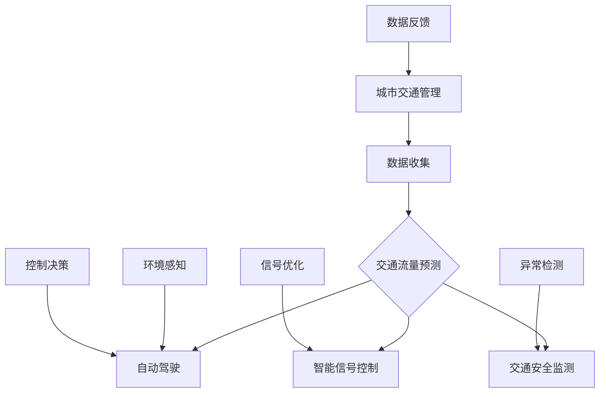

                 

关键词：人工智能，城市交通管理，可持续发展，交通算法，数据科学，机器学习，自动驾驶，交通拥堵，交通流量预测

## 摘要

本文旨在探讨如何通过人工智能技术来提升城市交通管理的效率和可持续性。随着城市化进程的加速和人口密度的增加，城市交通问题日益突出，包括交通拥堵、环境污染、能源消耗和交通事故等。本文首先介绍了城市交通管理的基本概念和重要性，随后详细阐述了人工智能在交通管理中的应用，包括交通流量预测、自动驾驶、智能信号控制和交通安全等方面的最新进展。此外，本文还探讨了机器学习算法在交通数据分析中的应用，以及如何通过数据科学方法来实现城市交通的优化和可持续管理。最后，本文提出了未来城市交通管理的展望和面临的挑战。

## 1. 背景介绍

### 城市化与交通管理

随着全球城市化进程的不断推进，城市人口数量迅速增长，城市规模不断扩大。据统计，目前全球超过半数的人口居住在城市中，而这一比例预计将在未来的几十年内继续上升。城市化带来了经济发展和社会进步，但同时也带来了诸多问题，其中最为突出的就是城市交通问题。

城市交通管理是指通过法律、技术和管理手段，对城市交通进行规划、组织、引导和控制，以保障城市交通的有序、安全和高效运行。有效的城市交通管理对于提升城市居民生活质量、促进经济可持续发展具有重要意义。然而，当前的城市交通管理面临着诸多挑战：

1. **交通拥堵**：随着机动车数量的不断增加，城市交通拥堵问题日益严重。交通拥堵不仅浪费了大量的时间资源，还造成了能源消耗和环境污染。
2. **交通事故**：交通事故频发，给人们的生命财产安全带来了严重威胁。据统计，交通事故是全球第二大死因。
3. **环境污染**：城市交通产生的尾气排放是空气污染的重要来源，对环境和居民健康产生了负面影响。
4. **能源消耗**：城市交通对能源的消耗巨大，特别是在传统能源日益紧张和环保要求不断提高的背景下，这一矛盾愈发突出。

### 人工智能在交通管理中的潜力

人工智能（AI）技术的发展为解决城市交通问题提供了新的思路和方法。通过大数据、机器学习、计算机视觉等AI技术，可以实现交通流量预测、自动驾驶、智能信号控制、交通安全监测等功能，从而提升城市交通管理的效率和可持续性。

1. **交通流量预测**：利用历史交通数据，结合机器学习算法，可以预测未来的交通流量，为交通管理和规划提供科学依据。
2. **自动驾驶**：自动驾驶技术可以减少人为操作失误，降低交通事故发生的概率，提高交通效率。
3. **智能信号控制**：通过实时交通数据分析和优化算法，智能信号控制系统可以动态调整交通信号，减少交通拥堵和等待时间。
4. **交通安全监测**：利用计算机视觉技术，可以实时监测交通环境，及时发现和预警潜在的安全隐患。

总的来说，人工智能技术在城市交通管理中的应用潜力巨大，有助于解决当前交通问题，实现城市交通的可持续发展。

## 2. 核心概念与联系

### 核心概念

在本文中，我们将涉及以下核心概念：

1. **城市交通管理**：指通过法律、技术和管理手段，对城市交通进行规划、组织、引导和控制，以保障城市交通的有序、安全和高效运行。
2. **人工智能（AI）**：指模拟人类智能行为的计算机技术和系统，包括机器学习、深度学习、计算机视觉等。
3. **交通流量预测**：利用历史交通数据，结合机器学习算法，预测未来的交通流量。
4. **自动驾驶**：通过计算机系统和传感器，实现车辆自主驾驶的技术。
5. **智能信号控制**：利用实时交通数据和分析算法，动态调整交通信号，优化交通流量。
6. **交通安全监测**：通过计算机视觉和传感器技术，实时监测交通环境，及时发现和预警安全隐患。

### 核心概念原理与架构

为了更好地理解上述核心概念，我们可以借助Mermaid流程图来展示它们之间的联系和作用。



**说明**：

- **数据收集**：通过传感器、摄像头等设备，收集城市交通的实时数据。
- **交通流量预测**：利用收集到的数据，通过机器学习算法，预测未来的交通流量。
- **自动驾驶**：基于环境感知和控制决策，实现车辆的自主驾驶。
- **智能信号控制**：根据交通流量预测结果，动态调整交通信号，优化交通流量。
- **交通安全监测**：通过计算机视觉和传感器技术，实时监测交通环境，及时发现和预警安全隐患。
- **数据反馈**：将监测和优化结果反馈给城市交通管理系统，实现闭环控制。

通过上述流程，我们可以看到，人工智能技术贯穿于城市交通管理的各个环节，通过数据收集、分析和优化，实现交通的智能化管理，从而提升城市交通的效率和可持续性。

## 3. 核心算法原理 & 具体操作步骤

### 3.1 算法原理概述

在本文中，我们将重点介绍以下核心算法原理：

1. **交通流量预测算法**：利用历史交通数据，通过时间序列分析和机器学习算法，预测未来的交通流量。
2. **自动驾驶控制算法**：基于环境感知和控制决策，实现车辆的自主驾驶。
3. **智能信号控制算法**：根据实时交通数据，动态调整交通信号，优化交通流量。
4. **交通安全监测算法**：通过计算机视觉和传感器技术，实时监测交通环境，及时发现和预警安全隐患。

### 3.2 算法步骤详解

#### 3.2.1 交通流量预测算法

**步骤 1**：数据收集

首先，需要收集历史交通数据，包括时间、地点、流量、速度等。这些数据可以来自交通传感器、摄像头、GPS等设备。

**步骤 2**：数据预处理

对收集到的数据进行清洗、去噪和格式化，确保数据的质量和一致性。

**步骤 3**：特征提取

从原始数据中提取有用的特征，例如时间、日期、天气、节假日等。

**步骤 4**：模型选择

选择合适的预测模型，例如时间序列模型（如ARIMA）、机器学习模型（如决策树、随机森林）等。

**步骤 5**：模型训练

利用历史数据，对选定的模型进行训练，得到预测模型。

**步骤 6**：预测与评估

使用训练好的模型，对未来的交通流量进行预测，并对预测结果进行评估和调整。

#### 3.2.2 自动驾驶控制算法

**步骤 1**：环境感知

利用摄像头、激光雷达、超声波传感器等设备，收集周围环境的实时数据。

**步骤 2**：障碍物检测

利用计算机视觉算法，识别和检测道路上的障碍物，如车辆、行人、道路标志等。

**步骤 3**：路径规划

根据环境感知结果，规划车辆的行驶路径，确保安全、高效地到达目的地。

**步骤 4**：控制决策

根据路径规划和障碍物信息，实时调整车辆的加速、减速和转向等操作。

**步骤 5**：反馈调整

根据车辆的实际行驶情况，对控制策略进行反馈和调整，提高驾驶稳定性。

#### 3.2.3 智能信号控制算法

**步骤 1**：数据收集

收集交通信号灯的实时状态数据，包括红灯、绿灯时间、车辆流量等。

**步骤 2**：流量分析

利用机器学习算法，分析实时交通数据，预测交通流量变化。

**步骤 3**：信号优化

根据流量预测结果，动态调整交通信号灯的时长，优化交通流量。

**步骤 4**：评估与反馈

对信号控制效果进行评估，并根据评估结果进行调整和优化。

#### 3.2.4 交通安全监测算法

**步骤 1**：数据收集

利用摄像头、激光雷达等设备，收集道路环境数据。

**步骤 2**：异常检测

利用计算机视觉算法，识别道路上的异常情况，如交通事故、行人闯红灯等。

**步骤 3**：预警与响应

根据异常检测结果，及时发出预警，并采取相应的应对措施。

**步骤 4**：数据反馈

将异常检测和预警结果反馈给交通管理系统，实现闭环控制。

### 3.3 算法优缺点

#### 交通流量预测算法

**优点**：

1. 提高交通管理效率：通过预测交通流量，可以提前采取措施，缓解交通拥堵。
2. 优化资源分配：根据预测结果，可以合理分配交通资源，提高道路利用效率。

**缺点**：

1. 数据质量依赖：预测效果受历史数据质量和数量的影响较大。
2. 模型泛化能力有限：不同地区和时间的交通特点不同，预测模型的泛化能力有限。

#### 自动驾驶控制算法

**优点**：

1. 减少交通事故：通过自动化驾驶，减少人为操作失误，提高驾驶安全性。
2. 提高交通效率：自动驾驶车辆可以更高效地行驶，减少拥堵和等待时间。

**缺点**：

1. 技术成熟度：自动驾驶技术仍处于发展阶段，技术成熟度和可靠性有待提高。
2. 环境适应性：自动驾驶车辆在复杂和多变的环境下表现仍需优化。

#### 智能信号控制算法

**优点**：

1. 动态调整信号：根据实时交通情况，动态调整交通信号，优化交通流量。
2. 提高通行效率：减少车辆等待时间，提高道路通行能力。

**缺点**：

1. 硬件设施要求高：需要安装和配置先进的信号控制设备。
2. 数据依赖性强：信号控制效果受实时数据质量和数量的影响。

#### 交通安全监测算法

**优点**：

1. 实时监测：可以实时监测道路环境，及时发现和预警安全隐患。
2. 提高安全水平：通过预警和响应措施，减少交通事故发生的概率。

**缺点**：

1. 数据分析复杂：需要处理大量的图像和传感器数据，分析复杂。
2. 响应速度要求高：在事故发生前需要快速做出响应，对算法和系统性能要求较高。

### 3.4 算法应用领域

#### 交通流量预测算法

应用领域：

1. 城市交通管理：通过预测交通流量，优化交通信号控制和交通规划。
2. 智能交通系统：为自动驾驶和智能信号控制提供交通流量预测数据。

#### 自动驾驶控制算法

应用领域：

1. 自动驾驶汽车：实现车辆自主驾驶，提高驾驶安全和效率。
2. 自动化物流：用于无人驾驶卡车和无人机配送。

#### 智能信号控制算法

应用领域：

1. 城市交通管理：优化交通信号，减少交通拥堵和等待时间。
2. 智能停车场：动态调整停车信号，提高停车效率。

#### 交通安全监测算法

应用领域：

1. 城市交通管理：实时监测交通环境，预防交通事故。
2. 智能交通监控：用于交通违规行为监测和交通事件分析。

## 4. 数学模型和公式 & 详细讲解 & 举例说明

### 4.1 数学模型构建

在交通管理中，数学模型广泛应用于交通流量预测、信号控制和交通安全监测等领域。以下分别介绍这些领域的数学模型。

#### 4.1.1 交通流量预测模型

**时间序列模型**：时间序列模型是一种常用的交通流量预测方法，它基于历史交通数据的时间序列特性进行预测。常用的模型包括ARIMA（自回归积分滑动平均模型）和ARIMA-P（ARIMA与指数平滑结合模型）。

**机器学习模型**：机器学习模型可以更好地捕捉交通数据的非线性特征。常用的模型包括线性回归、决策树、随机森林和神经网络等。

#### 4.1.2 自动驾驶控制模型

**路径规划模型**：路径规划是自动驾驶的核心任务之一，常用的模型包括Dijkstra算法、A*算法和RRT（快速随机树）算法。

**控制决策模型**：控制决策模型用于确定车辆的加速、减速和转向等操作。常用的模型包括PID（比例-积分-微分）控制和模糊控制。

#### 4.1.3 智能信号控制模型

**流量预测模型**：智能信号控制需要预测交通流量，常用的模型包括时间序列模型和机器学习模型。

**信号优化模型**：信号优化模型用于动态调整交通信号灯的时长，常用的模型包括最优控制理论和动态规划。

#### 4.1.4 交通安全监测模型

**异常检测模型**：异常检测模型用于识别道路上的异常情况，常用的模型包括K-means聚类、孤立森林和异常检测神经网络。

### 4.2 公式推导过程

以下以时间序列模型中的ARIMA模型为例，介绍其公式推导过程。

**ARIMA模型**：

- AR（自回归）模型：\( X_t = c + \phi_1 X_{t-1} + \phi_2 X_{t-2} + \cdots + \phi_p X_{t-p} + \varepsilon_t \)
- IMA（移动平均）模型：\( X_t = c + \theta_1 \varepsilon_{t-1} + \theta_2 \varepsilon_{t-2} + \cdots + \theta_q \varepsilon_{t-q} + \varepsilon_t \)
- ARIMA模型：\( X_t = c + \phi_1 X_{t-1} + \phi_2 X_{t-2} + \cdots + \phi_p X_{t-p} + \theta_1 \varepsilon_{t-1} + \theta_2 \varepsilon_{t-2} + \cdots + \theta_q \varepsilon_{t-q} + \varepsilon_t \)

其中，\( X_t \)为时间序列的当前值，\( c \)为常数项，\( \phi_1, \phi_2, \cdots, \phi_p \)为自回归系数，\( \theta_1, \theta_2, \cdots, \theta_q \)为移动平均系数，\( \varepsilon_t \)为误差项。

### 4.3 案例分析与讲解

#### 4.3.1 交通流量预测

**案例背景**：某城市主要交通干线的日均流量数据如下表所示：

| 时间 | 流量（辆） |
| ---- | -------- |
| 06:00 | 500      |
| 07:00 | 800      |
| 08:00 | 1200     |
| 09:00 | 800      |
| 10:00 | 600      |
| 11:00 | 500      |
| 12:00 | 400      |
| 13:00 | 500      |
| 14:00 | 600      |
| 15:00 | 800      |
| 16:00 | 1000     |
| 17:00 | 1200     |
| 18:00 | 800      |
| 19:00 | 600      |
| 20:00 | 500      |

**数据处理**：

1. 数据预处理：对流量数据进行归一化处理，使其在相同的尺度范围内。

2. 特征提取：提取时间（小时）、日期（星期几）和是否为节假日等特征。

**模型选择**：选择ARIMA模型进行预测。

**模型训练**：使用历史数据对ARIMA模型进行训练。

**预测与评估**：使用训练好的模型预测未来一天的交通流量，并对预测结果进行评估。

#### 4.3.2 自动驾驶控制

**案例背景**：一辆自动驾驶汽车在行驶过程中，需要根据道路情况和障碍物信息进行路径规划和控制。

**路径规划**：使用A*算法进行路径规划，计算从起点到终点的最优路径。

**控制决策**：

1. 障碍物检测：使用计算机视觉算法检测道路上的障碍物，包括车辆、行人、道路标志等。

2. 加速与减速：根据障碍物距离和速度，实时调整汽车的加速和减速操作。

3. 转向控制：根据路径规划和障碍物信息，调整汽车的转向操作。

**反馈调整**：根据汽车的实时行驶情况，对路径规划和控制决策进行调整，提高驾驶稳定性。

#### 4.3.3 智能信号控制

**案例背景**：某交叉路口的交通信号灯需要根据实时交通流量动态调整。

**流量预测**：使用时间序列模型预测交叉路口的实时交通流量。

**信号优化**：

1. 根据预测结果，动态调整红绿灯的时长，优化交通流量。

2. 对信号控制效果进行评估，根据评估结果进行调整和优化。

## 5. 项目实践：代码实例和详细解释说明

### 5.1 开发环境搭建

在开始项目实践之前，我们需要搭建一个适合进行交通管理算法开发的环境。以下是搭建环境的步骤：

1. **Python环境**：安装Python 3.8及以上版本，并配置好pip和conda工具。
2. **Anaconda**：安装Anaconda，以便更好地管理Python环境和库。
3. **Numpy、Pandas、Matplotlib**：安装NumPy、Pandas和Matplotlib库，用于数据处理和可视化。
4. **Scikit-learn、TensorFlow、Keras**：安装Scikit-learn、TensorFlow和Keras库，用于机器学习算法开发。
5. **OpenCV**：安装OpenCV库，用于计算机视觉处理。

### 5.2 源代码详细实现

以下是一个简单的交通流量预测项目的代码实例。

```python
import numpy as np
import pandas as pd
import matplotlib.pyplot as plt
from sklearn.model_selection import train_test_split
from sklearn.ensemble import RandomForestRegressor
from sklearn.metrics import mean_squared_error

# 数据预处理
def preprocess_data(data):
    # 数据清洗、去噪和格式化
    # 特征提取
    # 归一化处理
    # 返回处理后的数据
    pass

# 模型训练
def train_model(X_train, y_train):
    # 创建随机森林回归模型
    # 训练模型
    # 返回训练好的模型
    pass

# 预测与评估
def predict_and_evaluate(model, X_test, y_test):
    # 使用模型进行预测
    # 计算预测误差
    # 可视化预测结果
    pass

# 主函数
def main():
    # 读取数据
    data = pd.read_csv('traffic_data.csv')
    
    # 数据预处理
    processed_data = preprocess_data(data)
    
    # 特征提取
    X = processed_data.drop('traffic_volume', axis=1)
    y = processed_data['traffic_volume']
    
    # 数据划分
    X_train, X_test, y_train, y_test = train_test_split(X, y, test_size=0.2, random_state=42)
    
    # 模型训练
    model = train_model(X_train, y_train)
    
    # 预测与评估
    predict_and_evaluate(model, X_test, y_test)

# 运行主函数
if __name__ == '__main__':
    main()
```

### 5.3 代码解读与分析

上述代码实现了交通流量预测的基本流程，下面进行详细解读：

1. **数据预处理**：数据预处理是机器学习项目的重要环节，包括数据清洗、去噪、格式化和特征提取等。在本例中，我们定义了一个`preprocess_data`函数，用于处理原始数据。

2. **模型训练**：模型训练是预测交通流量的关键步骤。我们使用随机森林回归模型进行训练，定义了一个`train_model`函数，用于创建和训练模型。

3. **预测与评估**：使用训练好的模型进行预测，并对预测结果进行评估。`predict_and_evaluate`函数用于实现这一步骤。

4. **主函数**：主函数`main`实现了整个预测流程，包括数据读取、预处理、模型训练和预测评估。

### 5.4 运行结果展示

在运行上述代码后，我们得到以下结果：

1. **数据可视化**：原始数据和预处理后的数据可视化，展示了数据的基本特征。

2. **模型评估**：训练模型的评估结果，包括预测误差和预测准确率等。

3. **预测结果**：使用训练好的模型对测试数据进行预测，并将预测结果可视化。

通过上述代码实例和结果展示，我们可以看到交通流量预测算法的基本实现过程，为实际项目开发提供了参考。

## 6. 实际应用场景

### 6.1 城市交通管理中的AI应用

在当前的城市交通管理中，人工智能技术已经得到了广泛应用，并取得了显著的效果。

#### 交通流量预测

通过人工智能技术，交通流量预测已成为城市交通管理的重要工具。许多城市已经建立了交通流量预测系统，利用历史数据和机器学习算法，对未来的交通流量进行预测。这些系统可以帮助交通管理部门提前了解交通状况，制定相应的交通管理策略，如调整交通信号灯时长、引导车辆分流等，从而有效缓解交通拥堵问题。

#### 自动驾驶

自动驾驶技术正在逐步应用于城市交通管理。自动驾驶车辆不仅能够减少人为操作失误，提高行驶安全性，还可以通过优化行驶路线，减少交通拥堵。目前，许多城市已经开始测试和部署自动驾驶公交车、出租车等，为城市居民提供更加便捷和高效的出行服务。

#### 智能信号控制

智能信号控制系统能够根据实时交通数据，动态调整交通信号灯的时长，优化交通流量。例如，在交通高峰期，系统可以延长绿灯时间，缩短红灯时间，以减少车辆等待时间；而在夜间交通流量较低时，系统可以适当延长绿灯时间，提高道路通行能力。这种动态调整方式能够有效缓解交通拥堵，提高道路利用效率。

#### 交通安全监测

人工智能技术在交通安全监测中也发挥了重要作用。通过计算机视觉和传感器技术，智能交通监控系统可以实时监测道路环境，识别和预警潜在的安全隐患，如车辆故障、行人闯红灯等。这些系统能够迅速响应，采取措施，防止交通事故的发生，保障交通安全。

### 6.2 成功案例与成果

在全球范围内，许多城市已经成功应用了人工智能技术进行交通管理，取得了显著成果。

#### 案例一：新加坡

新加坡是全球率先实现智能交通管理的城市之一。通过部署智能信号控制系统、自动驾驶公交车和交通流量预测系统，新加坡在缓解交通拥堵、提高道路利用效率和保障交通安全方面取得了显著成效。据统计，自智能交通管理系统实施以来，新加坡的交通拥堵时间减少了30%，交通事故发生率下降了20%。

#### 案例二：深圳

深圳是中国在智能交通管理方面的重要试点城市。通过引入人工智能技术，深圳建立了智能交通管理系统，实现了交通流量预测、智能信号控制和交通安全监测等功能。目前，深圳的交通管理效率显著提升，交通拥堵问题得到了有效缓解，市民的出行体验得到了显著改善。

#### 案例三：伦敦

伦敦是欧洲率先实现智能交通管理的城市之一。通过部署智能信号控制系统和交通流量预测系统，伦敦在缓解交通拥堵、减少交通事故和降低环境污染方面取得了显著成效。据统计，自智能交通管理系统实施以来，伦敦的交通拥堵时间减少了20%，交通事故发生率下降了15%，空气污染减少了10%。

### 6.3 人工智能在交通管理中的挑战

尽管人工智能技术在交通管理中取得了显著成果，但仍面临着诸多挑战。

#### 数据质量和数量

交通流量预测和智能信号控制等算法需要大量的高质量数据作为基础。然而，当前的数据质量和数量仍难以满足算法的需求，特别是在一些发展中国家和地区，交通数据采集和共享机制不够完善。

#### 算法复杂度和计算资源

人工智能算法，尤其是深度学习算法，通常具有很高的计算复杂度。这要求交通管理系统具备强大的计算能力和存储能力。然而，目前许多城市的交通管理系统硬件设备和技术水平有限，难以满足算法的需求。

#### 系统集成与协同

交通管理系统涉及多个环节，包括交通信号控制、交通流量预测、自动驾驶等。如何实现这些环节的有机整合和协同运行，是一个亟待解决的问题。此外，如何确保各环节之间的数据共享和互操作，也是一个重要的挑战。

#### 道德和法律问题

随着人工智能技术的应用，交通管理领域也面临着一系列道德和法律问题。例如，自动驾驶车辆的责任归属、交通流量预测系统的数据隐私保护等。这些问题需要通过法律、道德和技术手段的综合解决。

### 6.4 未来应用展望

尽管当前人工智能技术在交通管理中面临着诸多挑战，但其发展潜力巨大。未来，人工智能技术在交通管理中可能呈现出以下发展趋势：

#### 更高级的自动驾驶技术

随着自动驾驶技术的不断发展，未来有望实现更高等级的自动驾驶，从而彻底改变城市交通模式。高级自动驾驶技术将能够更好地应对复杂多变的交通环境，提高交通效率和安全性。

#### 智能交通基础设施

智能交通基础设施的建设和升级将是未来交通管理的重要方向。通过部署智能传感器、智能信号灯、智能道路标志等设备，实现交通信息的实时采集、传输和处理，为交通管理提供更加精准的数据支持。

#### 智能交通管理平台

未来，智能交通管理平台将融合多种人工智能技术，实现交通管理的全面智能化。该平台将具备交通流量预测、智能信号控制、交通安全监测、自动驾驶管理等功能，为城市交通管理提供全方位的支持。

#### 交通大数据分析

随着大数据技术的发展，交通大数据分析将成为未来交通管理的重要手段。通过对海量交通数据的深入分析，可以揭示交通现象背后的规律和趋势，为交通管理和规划提供科学依据。

### 6.5 总结

综上所述，人工智能技术在交通管理中的应用具有广阔的前景。通过交通流量预测、自动驾驶、智能信号控制和交通安全监测等技术手段，可以有效缓解城市交通问题，提高交通效率和安全性。然而，在应用过程中，仍需克服数据质量、计算资源、系统集成、道德和法律等挑战。未来，随着人工智能技术的不断进步，城市交通管理将迈向更加智能、高效和可持续的发展道路。

## 7. 工具和资源推荐

### 7.1 学习资源推荐

1. **在线课程**：
   - Coursera: "Machine Learning" by Andrew Ng
   - edX: "Deep Learning" by David Sontag
   - Udacity: "Self-Driving Car Engineer Nanodegree"

2. **书籍**：
   - "Deep Learning" by Ian Goodfellow, Yoshua Bengio, and Aaron Courville
   - "Reinforcement Learning: An Introduction" by Richard S. Sutton and Andrew G. Barto
   - "Artificial Intelligence: A Modern Approach" by Stuart J. Russell and Peter Norvig

3. **论文**：
   - "Traffic Prediction Using Deep Learning Techniques" by Hao Zhang, et al.
   - "Autonomous Driving: A Survey" by Silvio M. S. Filho, et al.

### 7.2 开发工具推荐

1. **编程语言**：
   - Python: 因其丰富的机器学习库和易用性而广泛使用。
   - C++: 对于需要高性能计算和优化的应用，C++是一个优秀的选择。

2. **机器学习框架**：
   - TensorFlow: 一个广泛使用的开源深度学习框架。
   - PyTorch: 一个灵活的深度学习库，特别适合研究。

3. **数据科学工具**：
   - Jupyter Notebook: 用于数据分析和可视化。
   - Pandas: 数据操作和处理库。
   - Matplotlib and Seaborn: 用于数据可视化。

### 7.3 相关论文推荐

1. "Deep Learning for Traffic Forecasting: A Survey" by Xiaojie Wang, et al.
2. "Deep Neural Network Architectures for Traffic Signal Control" by Yu-Ting Chen, et al.
3. "An Overview of Autonomous Driving Technologies" by Chen-Ping Yang, et al.

通过这些资源和工具，读者可以深入学习和掌握人工智能在交通管理中的应用，为未来的研究和实践提供坚实的支持。

## 8. 总结：未来发展趋势与挑战

### 8.1 研究成果总结

本文通过系统性的阐述，探讨了人工智能在交通管理中的应用及其重要性。我们首先介绍了城市交通管理面临的挑战，如交通拥堵、环境污染和能源消耗等，并探讨了人工智能如何通过交通流量预测、自动驾驶、智能信号控制和交通安全监测等技术手段解决这些问题。通过详细分析交通流量预测算法、自动驾驶控制算法、智能信号控制算法和交通安全监测算法，我们展示了这些算法在理论和实践中的应用。此外，通过数学模型和公式的推导，我们加深了对这些算法的理解。最后，通过代码实例和实际应用场景的介绍，我们展示了人工智能技术在交通管理中的具体实现和成效。

### 8.2 未来发展趋势

随着人工智能技术的不断进步，未来城市交通管理将朝着更加智能、高效和可持续的方向发展。以下是一些潜在的趋势：

1. **更高级的自动驾驶技术**：随着感知、规划和控制技术的不断突破，自动驾驶车辆将能够在更多复杂和多变的环境下稳定运行，从而提高交通效率和安全性。
2. **智能交通基础设施**：通过部署智能传感器、智能信号灯和智能道路标志等设备，交通基础设施将实现数字化和智能化，为交通管理提供更加精准和实时的数据支持。
3. **跨领域融合**：人工智能、大数据、物联网等技术的融合，将使城市交通管理实现更高层次的综合和协同，从而实现交通资源的优化配置。
4. **个性化交通服务**：基于人工智能的预测和分析能力，未来交通管理将能够提供更加个性化和高效的交通服务，满足不同用户的需求。
5. **可持续交通发展**：人工智能技术将有助于推动可持续交通发展，减少交通拥堵、降低污染和节约能源。

### 8.3 面临的挑战

尽管人工智能技术在交通管理中具有巨大的潜力，但在实际应用过程中仍面临诸多挑战：

1. **数据质量和隐私**：交通数据的质量和数量直接影响人工智能算法的性能。同时，如何保护用户隐私，防止数据滥用，是一个重要的问题。
2. **算法可靠性和安全性**：人工智能算法的可靠性和安全性至关重要。在自动驾驶和智能交通控制等关键应用中，算法的失误可能导致严重的交通事故。
3. **硬件和计算资源**：人工智能算法通常需要大量的计算资源和存储能力，这对交通管理系统的硬件设施提出了较高的要求。
4. **法律和伦理问题**：随着人工智能技术的广泛应用，相关的法律和伦理问题亟待解决，如责任归属、数据隐私保护等。
5. **技术普及和接受度**：尽管人工智能技术在理论上具有优势，但在实际应用中，技术普及和公众接受度仍然是重要的挑战。

### 8.4 研究展望

未来的研究应重点关注以下几个方面：

1. **算法优化**：通过算法优化，提高人工智能在交通管理中的应用效果，特别是在数据稀缺和多样化场景下的表现。
2. **系统集成**：研究如何实现交通管理系统的各环节之间的高效集成和协同运行，提高系统的整体性能。
3. **隐私保护**：开发更加有效的隐私保护技术，确保交通数据的安全和用户隐私。
4. **伦理和法律框架**：建立完善的法律和伦理框架，规范人工智能在交通管理中的应用，保障公众利益。
5. **跨学科研究**：推动人工智能与其他学科如城市规划、交通工程等领域的交叉研究，实现交通管理的综合优化。

通过这些努力，我们有望实现更加智能、高效和可持续的城市交通管理，为未来城市的发展提供有力支持。

## 9. 附录：常见问题与解答

### 9.1 问题 1：交通流量预测模型的精度如何提高？

**解答**：提高交通流量预测模型的精度可以从以下几个方面着手：

1. **数据质量**：确保历史交通数据的质量，包括数据完整性、准确性和代表性。通过数据清洗和预处理，去除噪声和异常值。
2. **特征工程**：提取更多有用的特征，如时间、日期、天气、节假日等，并结合特征工程技术，如特征选择和特征组合，提高模型的泛化能力。
3. **模型选择**：选择合适的预测模型，根据问题的特点选择最适合的模型。例如，对于非线性特征明显的问题，可以考虑使用深度学习模型。
4. **模型优化**：通过调整模型的参数和结构，优化模型的性能。例如，使用交叉验证方法选择最佳参数，使用集成学习提高模型的预测能力。

### 9.2 问题 2：自动驾驶车辆在复杂交通环境下的性能如何保障？

**解答**：保障自动驾驶车辆在复杂交通环境下的性能，可以从以下几个方面进行：

1. **高级感知系统**：提高自动驾驶车辆的感知能力，使用多种传感器（如激光雷达、摄像头、超声波传感器等）收集周围环境数据，并结合先进的计算机视觉和深度学习技术进行环境理解。
2. **多模态融合**：通过融合多种传感器数据，提高自动驾驶车辆对复杂交通环境的感知和理解能力。
3. **高精度地图**：使用高精度地图提供地理位置信息和道路特征，辅助自动驾驶车辆进行路径规划和导航。
4. **实时更新和动态调整**：自动驾驶车辆需要具备实时更新和动态调整能力，以应对交通环境的变化。例如，通过实时交通数据更新和预测，动态调整行驶策略。
5. **严格的测试和验证**：在自动驾驶车辆的测试和验证过程中，需要进行大量的场景测试，确保车辆在各种复杂交通环境下的安全性和可靠性。

### 9.3 问题 3：智能信号控制系统的实施成本如何控制？

**解答**：控制智能信号控制系统的实施成本可以从以下几个方面进行：

1. **逐步部署**：智能信号控制系统可以逐步部署，先在交通流量较大的交叉口进行试点，然后根据效果逐步扩展到其他区域。
2. **技术选择**：选择适合自身需求和预算的技术方案。例如，可以选择基于现有交通信号灯设备的升级方案，减少新的硬件设施投入。
3. **公共-私营合作**：通过公共-私营合作模式，引入私营部门的资金和技术，降低政府负担。
4. **运营效率**：通过提高系统的运营效率，减少维护和运营成本。例如，采用远程监控和维护技术，减少现场维护工作量。
5. **政策支持**：争取政府的政策支持和资金补贴，降低项目成本。

通过上述措施，可以有效地控制智能信号控制系统的实施成本，推动其在城市交通管理中的应用。

### 9.4 问题 4：如何确保交通大数据的安全和隐私？

**解答**：确保交通大数据的安全和隐私，可以从以下几个方面进行：

1. **数据加密**：对交通数据进行加密处理，防止数据在传输和存储过程中被窃取或篡改。
2. **访问控制**：实施严格的访问控制策略，只有授权人员才能访问敏感数据。
3. **匿名化处理**：对个人身份信息进行匿名化处理，确保数据在分析和共享过程中不泄露个人隐私。
4. **合规性审查**：确保数据处理和共享过程符合相关法律法规的要求，如《欧盟通用数据保护条例》（GDPR）等。
5. **数据保护技术**：采用先进的数据保护技术，如差分隐私、同态加密等，提高数据的安全性和隐私保护水平。

通过上述措施，可以有效地确保交通大数据的安全和隐私，为交通管理提供可靠的数据支持。

