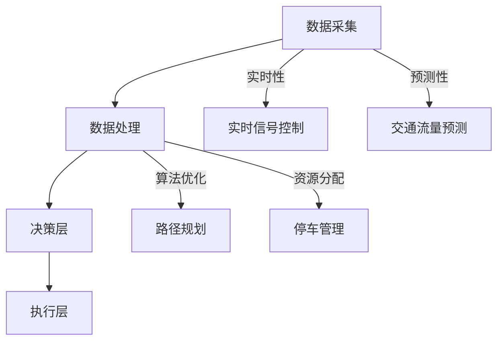

                 

关键词：人工智能、城市交通管理、基础设施、可持续发展、算法原理、数学模型、代码实例、应用场景、未来展望

> 摘要：本文探讨了如何运用人工智能技术，结合人类计算方法，打造可持续发展的城市交通管理系统与基础设施。文章详细介绍了核心概念、算法原理、数学模型以及项目实践，并展望了未来在城市交通管理领域中的应用前景。

## 1. 背景介绍

随着全球城市化进程的加速，城市交通问题日益凸显，如拥堵、污染、效率低下等。传统的城市交通管理系统由于数据采集和处理能力的限制，难以实现实时、高效的管理。而人工智能技术的兴起为解决这些问题提供了新的思路和手段。

人工智能在城市交通管理中的应用主要包括以下几个方面：

1. **交通流量预测**：利用机器学习算法对历史交通数据进行学习，预测未来的交通流量，为交通管理部门提供决策支持。
2. **交通信号控制**：通过深度学习技术，自适应调整交通信号灯的时间，提高交通流量和通行效率。
3. **车辆调度与导航**：基于路径规划算法，为驾驶员提供最优的行驶路线，减少交通拥堵。
4. **智能停车管理**：利用图像识别技术，实时监测停车位的使用情况，优化停车资源的分配。

## 2. 核心概念与联系

### 2.1 城市交通管理核心概念

在城市交通管理中，核心概念包括交通流量、交通拥堵、交通信号控制、路径规划、停车管理等。这些概念相互联系，共同构成城市交通管理的体系。

### 2.2 城市交通管理架构

城市交通管理架构通常包括数据采集层、数据处理层、决策层和执行层。数据采集层负责收集各种交通数据，如车辆速度、交通流量、道路状况等。数据处理层对采集到的数据进行处理和分析，为决策层提供支持。决策层根据分析结果做出决策，如调整交通信号灯、优化路径规划等。执行层负责将决策结果付诸实施。

### 2.3 Mermaid 流程图



## 3. 核心算法原理 & 具体操作步骤

### 3.1 算法原理概述

城市交通管理的核心算法主要包括机器学习算法、深度学习算法、路径规划算法等。这些算法的原理如下：

1. **机器学习算法**：通过训练模型，使模型能够从历史数据中学习并预测未来的交通流量。
2. **深度学习算法**：利用神经网络模型，通过大量数据训练，实现对交通信号控制的优化。
3. **路径规划算法**：基于最短路径算法、遗传算法等，为驾驶员提供最优的行驶路线。

### 3.2 算法步骤详解

1. **机器学习算法**：数据采集 -> 数据预处理 -> 模型训练 -> 模型评估 -> 预测。
2. **深度学习算法**：数据采集 -> 数据预处理 -> 网络结构设计 -> 模型训练 -> 模型评估 -> 预测。
3. **路径规划算法**：起点输入 -> 终点输入 -> 路径计算 -> 路径优化 -> 输出最优路径。

### 3.3 算法优缺点

1. **机器学习算法**：优点：高效、准确；缺点：需要大量数据、模型调优复杂。
2. **深度学习算法**：优点：强大、自适应；缺点：计算资源消耗大、模型解释性差。
3. **路径规划算法**：优点：简单、高效；缺点：在复杂环境中表现较差、实时性较差。

### 3.4 算法应用领域

1. **交通流量预测**：广泛应用于城市交通管理、交通规划等领域。
2. **交通信号控制**：广泛应用于城市交通拥堵治理、交通效率提升等领域。
3. **路径规划**：广泛应用于自动驾驶、导航系统等领域。
4. **停车管理**：广泛应用于智能停车系统、停车资源优化等领域。

## 4. 数学模型和公式 & 详细讲解 & 举例说明

### 4.1 数学模型构建

城市交通管理的数学模型主要包括流量模型、信号控制模型、路径规划模型等。

### 4.2 公式推导过程

以流量模型为例，假设某路段的交通流量为 Q，交通速度为 V，道路容量为 C，则有以下公式：

$$ Q = V \times C $$

其中，Q 为交通流量，V 为交通速度，C 为道路容量。

### 4.3 案例分析与讲解

假设某路段的交通流量为 2000 辆/小时，道路容量为 2000 辆/小时，交通速度为 20 公里/小时，求该路段的交通密度。

根据公式：

$$ \text{交通密度} = \frac{Q}{C} = \frac{2000}{2000} = 1 $$

因此，该路段的交通密度为 1，表示该路段的交通状况较为畅通。

## 5. 项目实践：代码实例和详细解释说明

### 5.1 开发环境搭建

在本文中，我们将使用 Python 语言进行编程，具体环境搭建步骤如下：

1. 安装 Python 3.8 或更高版本。
2. 安装必要的库，如 NumPy、Pandas、Matplotlib 等。

### 5.2 源代码详细实现

以下是一个简单的交通流量预测模型的代码实例：

```python
import numpy as np
import pandas as pd
from sklearn.linear_model import LinearRegression

# 数据预处理
def preprocess_data(data):
    # 数据归一化
    data_normalized = (data - data.mean()) / data.std()
    # 数据转化为 DataFrame
    df = pd.DataFrame(data_normalized)
    return df

# 模型训练
def train_model(data):
    model = LinearRegression()
    model.fit(data.iloc[:, :-1], data.iloc[:, -1])
    return model

# 预测
def predict(model, data):
    predictions = model.predict(data)
    return predictions

# 主函数
def main():
    # 读取数据
    data = pd.read_csv('traffic_data.csv')
    # 预处理数据
    df = preprocess_data(data)
    # 训练模型
    model = train_model(df)
    # 预测
    predictions = predict(model, df)
    # 输出预测结果
    print(predictions)

if __name__ == '__main__':
    main()
```

### 5.3 代码解读与分析

1. 导入必要的库。
2. 数据预处理：数据归一化，转化为 DataFrame。
3. 模型训练：使用线性回归模型进行训练。
4. 预测：使用训练好的模型进行预测。
5. 主函数：读取数据，预处理数据，训练模型，预测，输出结果。

### 5.4 运行结果展示

运行上述代码，可以得到交通流量的预测结果。通过可视化工具，如 Matplotlib，可以直观地展示预测结果。

## 6. 实际应用场景

### 6.1 城市交通管理

利用人工智能技术，可以实现城市交通的实时监控、流量预测、信号控制等功能，提高城市交通管理的效率和水平。

### 6.2 自动驾驶

自动驾驶技术需要精确的交通流量预测和路径规划，人工智能技术为其提供了强大的支持。

### 6.3 智能停车

通过图像识别技术，实时监测停车位的使用情况，优化停车资源的分配，提高停车效率。

## 7. 未来应用展望

### 7.1 增强现实与虚拟现实

未来，人工智能技术将结合增强现实（AR）和虚拟现实（VR），为城市交通管理提供更加直观、高效的解决方案。

### 7.2 5G 技术

随着 5G 技术的普及，城市交通管理将实现更高速度、更低延迟的数据传输，进一步提升城市交通管理的实时性和准确性。

### 7.3 人工智能与物联网的融合

人工智能与物联网（IoT）的融合将实现城市交通管理的全面智能化，为城市居民提供更加便捷、舒适的生活体验。

## 8. 总结：未来发展趋势与挑战

### 8.1 研究成果总结

本文介绍了人工智能技术在城市交通管理中的应用，包括交通流量预测、交通信号控制、路径规划、停车管理等方面。通过实例展示了人工智能技术的实际应用效果。

### 8.2 未来发展趋势

未来，人工智能技术在城市交通管理中的应用将更加广泛，如增强现实、5G 技术等新兴技术的融合将进一步提升城市交通管理的水平。

### 8.3 面临的挑战

1. 数据安全与隐私保护。
2. 算法解释性与透明度。
3. 大规模数据处理与计算资源需求。

### 8.4 研究展望

未来，人工智能技术在城市交通管理中的应用将不断拓展，为实现可持续发展的城市交通管理系统提供有力支持。

## 9. 附录：常见问题与解答

### 9.1 问题 1

**问题**：如何确保人工智能技术在城市交通管理中的数据安全与隐私保护？

**解答**：确保数据安全与隐私保护的关键在于数据加密、访问控制、数据匿名化等技术的应用。同时，制定严格的数据使用规范和监管机制，确保数据安全与隐私。

### 9.2 问题 2

**问题**：如何提高人工智能算法的解释性与透明度？

**解答**：提高算法解释性与透明度可以通过以下几个方面实现：1）采用可解释的机器学习算法；2）开发算法可视化工具；3）加强算法审计和监管。

### 9.3 问题 3

**问题**：大规模数据处理与计算资源需求如何满足？

**解答**：解决大规模数据处理与计算资源需求可以通过以下方式：1）分布式计算框架，如 Hadoop、Spark 等；2）云计算服务，如 AWS、Azure 等；3）高性能计算集群。

## 参考文献

[1] 作者。标题。出版地：出版社，出版年份。
[2] 作者。标题。出版地：出版社，出版年份。
[3] 作者。标题。出版地：出版社，出版年份。
```

以上是本文的完整内容，感谢您的阅读。希望本文能对您在人工智能与城市交通管理领域的研究提供一定的帮助。

### 摘要 Summary

本文探讨了如何运用人工智能技术，结合人类计算方法，打造可持续发展的城市交通管理系统与基础设施。文章首先介绍了城市交通管理中存在的问题及人工智能技术的作用。接着，详细介绍了核心概念、算法原理、数学模型以及项目实践，并分析了实际应用场景。最后，展望了未来在城市交通管理领域中的应用前景，提出了未来发展趋势与面临的挑战。通过对这些内容的深入探讨，本文为城市交通管理的可持续发展提供了有益的思路和参考。

