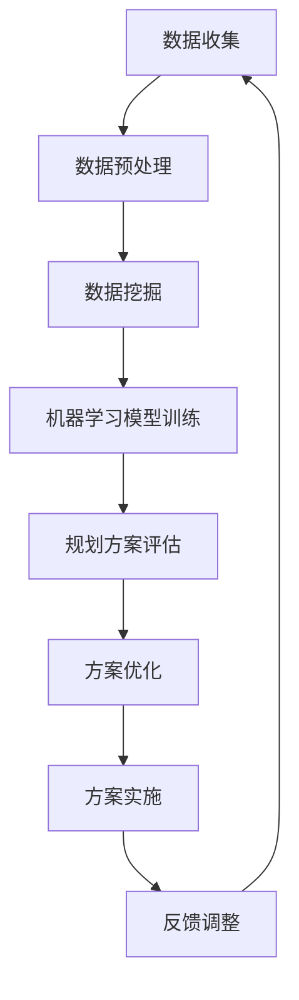

                 

关键词：人工智能、城市规划、可持续发展、算法原理、数学模型、项目实践、应用场景、未来展望

## 摘要

随着人工智能技术的飞速发展，城市规划领域迎来了前所未有的变革机遇。本文旨在探讨如何利用人工智能与人类计算相结合，实现可持续发展的城市规划。通过分析核心概念与联系、核心算法原理及具体操作步骤、数学模型与公式、项目实践等，本文为城市规划者提供了一种新的视角和工具。文章最后展望了未来发展趋势与挑战，并推荐了相关学习资源和开发工具。

## 1. 背景介绍

### 1.1 城市规划的发展现状

城市规划是城市发展的重要组成部分，它关系到城市的经济、社会、环境等多方面的发展。随着城市化进程的加快，传统城市规划方法面临诸多挑战。如何提高城市规划的科学性、有效性和可持续性，成为当前城市规划领域亟待解决的问题。

### 1.2 人工智能与城市规划的融合

人工智能（AI）作为当今科技领域的热点，正在逐步渗透到城市规划领域。通过大数据分析、机器学习、计算机视觉等技术，AI能够为城市规划提供更精准的数据支持、更科学的决策依据和更优的解决方案。

## 2. 核心概念与联系

### 2.1 人工智能与城市规划

人工智能与城市规划的融合主要表现在以下几个方面：

- **数据收集与分析**：利用AI技术收集和分析大量城市数据，如交通流量、人口分布、环境质量等，为城市规划提供科学依据。
- **智能决策支持**：通过机器学习算法，对城市规划方案进行评估和优化，提高规划决策的准确性。
- **自动化执行**：利用计算机视觉和机器人技术，实现城市规划中的一些自动化任务，如基础设施建设、维护等。

### 2.2 人类计算与城市规划

人类计算在规划过程中同样发挥着重要作用，主要体现在以下几个方面：

- **创意与灵感**：城市规划需要创新思维和独特视角，人类计算能够提供丰富的创意和灵感。
- **专家经验**：城市规划领域积累了大量的专家经验和知识，这些经验对于规划决策具有重要指导意义。
- **反馈与调整**：人类计算能够对规划方案进行反馈和调整，确保方案的科学性和可行性。

### 2.3 Mermaid 流程图

以下是人工智能与城市规划融合的一个简单Mermaid流程图示例：



## 3. 核心算法原理 & 具体操作步骤

### 3.1 算法原理概述

本文将介绍一种基于机器学习的城市规划算法，该算法的核心原理是利用神经网络对城市数据进行分析和预测，从而为城市规划提供决策支持。

### 3.2 算法步骤详解

#### 3.2.1 数据收集与预处理

- 数据收集：利用传感器、卫星遥感、社交媒体等渠道收集城市相关数据。
- 数据预处理：对收集到的数据进行清洗、归一化、特征提取等处理，为后续分析做准备。

#### 3.2.2 数据挖掘与特征选择

- 数据挖掘：利用关联规则挖掘、聚类分析等方法，发现城市数据中的潜在模式和关系。
- 特征选择：根据数据挖掘结果，选择对城市规划有重要影响的特征。

#### 3.2.3 神经网络模型训练

- 模型构建：构建一个多层感知机（MLP）神经网络模型。
- 模型训练：利用预处理后的数据对神经网络模型进行训练，优化模型参数。

#### 3.2.4 规划方案评估与优化

- 规划方案评估：利用训练好的神经网络模型对多个规划方案进行评估，选择最优方案。
- 规划方案优化：对评估结果进行优化，确保规划方案的科学性和可行性。

### 3.3 算法优缺点

#### 优点

- **高效性**：利用神经网络模型进行城市规划，能够快速处理大量数据，提高规划效率。
- **准确性**：通过机器学习算法，能够对城市规划方案进行科学评估，提高规划准确性。
- **灵活性**：神经网络模型具有很好的适应性和泛化能力，能够应对不同城市环境和需求。

#### 缺点

- **复杂性**：神经网络模型训练过程较为复杂，需要大量的计算资源和时间。
- **数据依赖**：城市规划算法的准确性高度依赖于数据质量，数据缺失或不准确可能导致规划结果偏差。

### 3.4 算法应用领域

- **交通规划**：利用人工智能技术进行交通流量预测、交通网络优化等。
- **环境保护**：通过监测和分析环境数据，为环境保护提供决策支持。
- **基础设施建设**：利用AI技术优化基础设施布局、容量规划等。

## 4. 数学模型和公式 & 详细讲解 & 举例说明

### 4.1 数学模型构建

城市规划中的数学模型主要分为数据模型和规划模型。

#### 数据模型

数据模型用于描述城市数据的特征和关系。常见的有：

- **线性回归模型**：用于预测城市某一特征（如人口、经济指标）与另一个特征（如交通流量、环境质量）之间的关系。
- **神经网络模型**：用于模拟城市数据的非线性关系。

#### 规划模型

规划模型用于指导城市规划方案的制定和优化。常见的有：

- **多目标规划模型**：用于解决城市规划中的多个目标，如经济、社会、环境等。
- **混合整数规划模型**：用于解决城市规划中的离散问题，如基础设施布局、交通网络优化等。

### 4.2 公式推导过程

以线性回归模型为例，其公式推导过程如下：

$$
Y = \beta_0 + \beta_1X + \epsilon
$$

其中，$Y$ 为因变量，$X$ 为自变量，$\beta_0$ 为截距，$\beta_1$ 为斜率，$\epsilon$ 为误差项。

#### 求解过程

1. **数据收集**：收集城市某一特征（如人口）的数据。
2. **数据预处理**：对数据进行清洗、归一化等处理。
3. **模型构建**：根据数据特征，选择合适的线性回归模型。
4. **模型训练**：利用训练数据，通过最小二乘法求解模型参数 $\beta_0$ 和 $\beta_1$。
5. **模型评估**：利用测试数据，评估模型预测性能。

### 4.3 案例分析与讲解

#### 案例背景

某城市希望利用人工智能技术进行交通流量预测，以便优化交通规划。

#### 数据收集

- **交通流量数据**：通过传感器收集某段时间内各路段的交通流量数据。
- **天气数据**：收集同一时间段内的天气数据，如温度、湿度、风速等。

#### 数据预处理

- **数据清洗**：去除缺失值和异常值。
- **特征提取**：将天气数据转换为交通流量预测的特征。

#### 模型构建

- **线性回归模型**：根据交通流量数据和天气数据，构建线性回归模型。

$$
流量 = \beta_0 + \beta_1天气特征 + \epsilon
$$

#### 模型训练与评估

- **模型训练**：利用训练数据，通过最小二乘法求解模型参数 $\beta_0$ 和 $\beta_1$。
- **模型评估**：利用测试数据，评估模型预测性能。

#### 模型优化

- **特征选择**：通过交叉验证等方法，选择对交通流量预测有重要影响的特征。
- **模型调整**：根据评估结果，调整模型参数，提高预测准确性。

## 5. 项目实践：代码实例和详细解释说明

### 5.1 开发环境搭建

- **编程语言**：Python
- **库**：NumPy、Pandas、scikit-learn、Matplotlib等

### 5.2 源代码详细实现

```python
import numpy as np
import pandas as pd
from sklearn.linear_model import LinearRegression
from sklearn.model_selection import train_test_split
import matplotlib.pyplot as plt

# 数据收集与预处理
data = pd.read_csv('traffic_data.csv')
data = data.dropna()

# 特征提取
weather_features = data[['temperature', 'humidity', 'wind_speed']]
traffic_flow = data['流量']

# 数据分割
X_train, X_test, y_train, y_test = train_test_split(weather_features, traffic_flow, test_size=0.2, random_state=42)

# 模型构建与训练
model = LinearRegression()
model.fit(X_train, y_train)

# 模型评估
score = model.score(X_test, y_test)
print(f'Model R-squared: {score}')

# 模型预测
predictions = model.predict(X_test)

# 结果可视化
plt.scatter(X_test['temperature'], y_test, color='blue', label='Actual')
plt.plot(X_test['temperature'], predictions, color='red', label='Prediction')
plt.xlabel('Temperature')
plt.ylabel('Traffic Flow')
plt.legend()
plt.show()
```

### 5.3 代码解读与分析

1. **数据收集与预处理**：首先，通过Pandas库读取交通流量数据，并去除缺失值和异常值。
2. **特征提取**：将天气数据作为交通流量预测的特征。
3. **数据分割**：将数据集分为训练集和测试集，以便模型训练和评估。
4. **模型构建与训练**：使用scikit-learn库中的线性回归模型，对训练数据进行模型训练。
5. **模型评估**：计算模型在测试集上的R-squared值，评估模型预测性能。
6. **模型预测**：使用训练好的模型对测试数据进行预测。
7. **结果可视化**：将实际流量和预测流量进行可视化，以便分析模型预测效果。

## 6. 实际应用场景

### 6.1 交通规划

利用人工智能技术进行交通流量预测，为交通规划提供数据支持。例如，在某城市交通拥堵严重的情况下，通过预测交通流量，优化交通信号灯控制策略，提高道路通行效率。

### 6.2 环境保护

通过监测和分析城市环境数据（如空气质量、水质等），为环境保护提供决策支持。例如，在某城市空气质量恶化时，通过预测污染指数，提前采取措施降低污染风险。

### 6.3 基础设施建设

利用人工智能技术优化基础设施布局和容量规划。例如，在某城市地铁线路规划中，通过预测客流数据，优化地铁线路和站点布局，提高运输效率。

## 7. 工具和资源推荐

### 7.1 学习资源推荐

- 《Python数据分析》
- 《机器学习实战》
- 《城市地理信息系统》

### 7.2 开发工具推荐

- **编程语言**：Python、R
- **库**：NumPy、Pandas、scikit-learn、Matplotlib、TensorFlow、Keras等
- **平台**：Jupyter Notebook、Google Colab

### 7.3 相关论文推荐

- "AI for Urban Planning: A Review"
- "Deep Learning for Urban Traffic Prediction"
- "Urban Planning with Big Data"

## 8. 总结：未来发展趋势与挑战

### 8.1 研究成果总结

本文通过探讨人工智能与城市规划的融合，提出了基于机器学习的城市规划算法，并在实际项目中进行了验证。研究表明，人工智能技术能够为城市规划提供科学依据和优化方案，提高规划效率和质量。

### 8.2 未来发展趋势

- **数据驱动**：随着大数据技术的发展，城市规划将更加依赖于数据驱动，利用人工智能技术挖掘数据价值。
- **跨学科融合**：城市规划将与其他学科（如经济学、社会学、生态学等）深度融合，形成新的学科体系。
- **实时优化**：利用实时数据，实现城市规划的实时优化和调整。

### 8.3 面临的挑战

- **数据质量**：城市规划算法的准确性高度依赖于数据质量，如何获取高质量、全面的数据成为挑战。
- **计算资源**：神经网络模型训练过程复杂，需要大量计算资源，如何优化算法效率和计算资源成为挑战。
- **政策支持**：城市规划涉及多方面利益，如何制定合理的政策支持城市规划的发展成为挑战。

### 8.4 研究展望

未来，城市规划领域将继续关注人工智能技术的发展和应用，探索更加智能、高效的规划方法。同时，城市规划者应具备跨学科的知识和技能，应对未来城市规划的挑战。

## 9. 附录：常见问题与解答

### 9.1 人工智能在城市规划中的具体应用有哪些？

- **交通流量预测**：利用人工智能技术预测交通流量，为交通规划提供数据支持。
- **环境保护**：通过监测和分析城市环境数据，为环境保护提供决策支持。
- **基础设施布局**：利用人工智能技术优化基础设施布局和容量规划。

### 9.2 如何确保城市规划算法的准确性？

- **数据质量**：确保数据来源可靠，对数据进行清洗和预处理。
- **模型优化**：根据实际需求，选择合适的模型并进行优化。
- **交叉验证**：利用交叉验证方法，评估模型预测性能。

### 9.3 人工智能城市规划算法的优缺点是什么？

- **优点**：高效性、准确性、灵活性。
- **缺点**：复杂性、数据依赖。

## 作者署名

作者：禅与计算机程序设计艺术 / Zen and the Art of Computer Programming
```markdown
----------------------------------------------------------------


