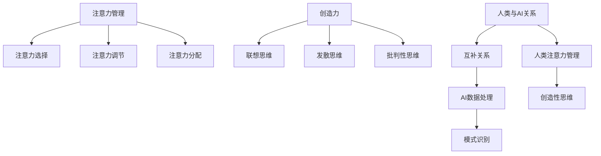

                 

 在当今这个信息爆炸的时代，人工智能（AI）技术的迅猛发展给人类带来了巨大的便利和挑战。AI系统的不断进步使得它们在很多任务上已经超越了人类的表现，从图像识别到自然语言处理，再到复杂决策问题，AI的应用场景日益广泛。然而，尽管AI在计算能力和效率上具有显著优势，人类在注意力管理和创造力方面依然拥有独特的优势。本文将探讨如何在AI时代保持人类的注意力优势，并挖掘人类与AI之间的协同效应。

## 关键词

- 人工智能
- 注意力管理
- 创造力
- 人类优势
- AI时代

## 摘要

本文从人类注意力和创造力的角度出发，分析了在AI时代人类如何保持其独特优势。首先，介绍了注意力管理和创造力的基本概念及其在人类认知中的作用。接着，探讨了AI在注意力管理和创造力方面的应用，并分析了人类在这些领域中的潜在优势。最后，提出了若干策略，以帮助人类在AI时代更好地管理注意力和发挥创造力，为未来的发展做好准备。

### 1. 背景介绍

在过去的几十年里，人工智能技术取得了令人瞩目的进展。从最初的专家系统到深度学习，再到自然语言处理和计算机视觉，AI的应用范围不断扩大。AI系统的能力不断增强，不仅在处理海量数据方面表现出色，而且在模拟人类思维和行为方面也取得了显著的成果。例如，自动驾驶汽车、智能助手、医疗诊断系统等，都是AI技术在不同领域的成功应用。

然而，随着AI技术的普及，人们开始意识到AI在某些方面可能存在局限性。例如，AI系统在处理复杂问题时往往依赖于大量数据和算法，而在创造性思维和注意力管理方面却显得捉襟见肘。相比之下，人类在这些方面具有独特的优势，能够通过注意力管理和创造性思维解决复杂的问题。

本文旨在探讨如何利用人类的注意力管理和创造力优势，在与AI的协同作用中发挥更大的作用。通过分析AI在注意力管理和创造力方面的应用，我们试图找到人类在这些领域中保持优势的方法，并为未来的发展提供一些启示。

### 2. 核心概念与联系

#### 2.1 注意力管理

注意力管理是指个体在信息处理过程中，通过主动选择、调节和分配注意力资源，以实现特定目标和任务的过程。它包括以下几个方面：

- **注意力选择**：个体在众多信息源中主动选择与自己目标相关的重要信息，忽略无关或干扰信息。
- **注意力调节**：根据任务需求和个体状态，动态调整注意力强度和分配，以保持最佳工作效率。
- **注意力分配**：在多个任务或信息源之间合理分配注意力资源，以实现任务间的平衡和高效完成。

#### 2.2 创造力

创造力是指个体在创新性思维活动中，产生新颖、独特且有价值的想法和解决方案的能力。创造力包括以下几个方面：

- **联想思维**：通过不同领域的知识交叉和融合，形成新的视角和思路。
- **发散思维**：在解决问题时，从多个角度和层面思考，探索多种可能的解决方案。
- **批判性思维**：对现有观点和解决方案进行深入分析，识别潜在的问题和改进空间。

#### 2.3 人类与AI的关系

在注意力管理和创造力方面，人类与AI之间的关系可以看作是一种互补。AI擅长处理大量数据和模式识别，但在创造性思维和注意力管理上存在局限性。而人类则能够在复杂环境中灵活运用注意力，进行创造性思考，并有效地解决问题。

#### 2.4 Mermaid 流程图

下面是关于注意力管理和创造力核心概念的 Mermaid 流程图：



### 3. 核心算法原理 & 具体操作步骤

#### 3.1 算法原理概述

在注意力管理和创造力方面，可以采用以下核心算法原理：

1. **注意力分配算法**：通过机器学习模型，分析个体在完成任务过程中的注意力分配情况，为不同任务分配适当的注意力资源。
2. **创造力促进算法**：利用人工智能技术，模拟人类联想思维、发散思维和批判性思维过程，生成新颖的创意和解决方案。

#### 3.2 算法步骤详解

1. **注意力分配算法步骤**：

   - 收集个体完成任务时的注意力数据，包括注意力强度、分配比例等。
   - 利用机器学习模型（如决策树、神经网络等）对注意力数据进行分析，提取注意力分配规律。
   - 根据分析结果，为不同任务分配注意力资源，实现最佳工作效率。

2. **创造力促进算法步骤**：

   - 收集大量创新性思维案例，包括成功和失败的案例，用于训练机器学习模型。
   - 利用机器学习模型，模拟人类联想思维、发散思维和批判性思维过程，生成新颖的创意和解决方案。
   - 对生成的创意和解决方案进行评估，筛选出具有实际应用价值的创新点。

#### 3.3 算法优缺点

1. **注意力分配算法优点**：

   - 能够根据个体任务需求，动态调整注意力资源分配，提高工作效率。
   - 利用机器学习技术，实现个性化注意力管理，有助于个体更好地应对复杂任务。

2. **注意力分配算法缺点**：

   - 需要大量注意力数据支持，数据质量对算法效果有较大影响。
   - 算法对个体注意力分配模式的适应性有限，可能无法应对突发情况。

1. **创造力促进算法优点**：

   - 利用人工智能技术，模拟人类创造性思维过程，生成新颖的创意和解决方案。
   - 能够处理大量数据，快速生成多种可能的解决方案。

2. **创造力促进算法缺点**：

   - 创意生成过程中，可能存在过度拟合和重复性，导致部分创意不具有实际应用价值。
   - 需要大量训练数据和计算资源，对开发环境和硬件要求较高。

#### 3.4 算法应用领域

1. **注意力分配算法应用领域**：

   - 办公自动化系统：为不同任务分配注意力资源，提高工作效率。
   - 教育系统：个性化教育，根据学生注意力情况调整教学策略。
   - 健康管理系统：监测个体注意力变化，提供健康建议。

2. **创造力促进算法应用领域**：

   - 创意设计：生成新颖的设计方案，提高产品设计效率。
   - 科学研究：模拟人类思维过程，发现新的研究思路。
   - 企业创新：利用人工智能技术，推动企业创新和发展。

### 4. 数学模型和公式 & 详细讲解 & 举例说明

#### 4.1 数学模型构建

在注意力管理和创造力研究中，我们可以构建以下数学模型：

1. **注意力分配模型**：

   设个体在多个任务中需要分配注意力资源，目标是最小化总注意力耗费。数学模型如下：

   $$ 
   \min \sum_{i=1}^{n} w_i \cdot t_i 
   $$
   
   其中，$w_i$ 为第 $i$ 个任务的权重，$t_i$ 为第 $i$ 个任务所需的注意力时间。

2. **创造力促进模型**：

   设个体在创造性思维过程中，需要生成多个创意。数学模型如下：

   $$ 
   \max \sum_{i=1}^{m} p_i 
   $$
   
   其中，$p_i$ 为第 $i$ 个创意的创新程度。

#### 4.2 公式推导过程

1. **注意力分配模型推导**：

   - 设个体在 $n$ 个任务中需要分配注意力资源，目标是最小化总注意力耗费。

   - 假设第 $i$ 个任务的权重为 $w_i$，所需注意力时间为 $t_i$。

   - 目标函数为：$$ 
   \min \sum_{i=1}^{n} w_i \cdot t_i 
   $$

   - 约束条件为：$$ 
   t_i \geq 0 \quad (i=1,2,...,n) 
   $$

   - 利用拉格朗日乘数法，将目标函数和约束条件转化为一个无约束优化问题：

     $$ 
     L(w_1, w_2, ..., w_n, \lambda) = \sum_{i=1}^{n} w_i \cdot t_i + \lambda \cdot (\sum_{i=1}^{n} w_i - 1) 
     $$

   - 对 $L$ 求导，得到：

     $$ 
     \frac{\partial L}{\partial w_i} = t_i - \lambda = 0 \quad (i=1,2,...,n) 
     $$

   - 解得：$$ 
   w_i = \frac{t_i}{\lambda} \quad (i=1,2,...,n) 
     $$

   - 代入目标函数，得到最优解：$$ 
   \min \sum_{i=1}^{n} w_i \cdot t_i = \sum_{i=1}^{n} \frac{t_i^2}{\lambda} 
     $$

   - 为了使目标函数最小，需要使 $\lambda$ 最大。根据约束条件，$\lambda$ 的最大值为 $1$。

   - 因此，最优解为：$$ 
   w_i = t_i \quad (i=1,2,...,n) 
     $$

2. **创造力促进模型推导**：

   - 设个体在创造性思维过程中，需要生成多个创意，目标是最小化创意之间的相似度。

   - 假设第 $i$ 个创意的创新程度为 $p_i$。

   - 目标函数为：$$ 
   \max \sum_{i=1}^{m} p_i 
     $$

   - 约束条件为：$$ 
   p_i \geq 0 \quad (i=1,2,...,m) 
   $$

   - 利用贪心算法，每次选择创新程度最高的创意进行扩展，直到所有创意的创新程度都不再增加。

   - 记第 $k$ 次扩展后，第 $i$ 个创意的创新程度为 $p_i^k$。

   - 第 $k$ 次扩展的目标函数为：$$ 
   \max \sum_{i=1}^{m} (p_i^k - p_i^{k-1}) 
   $$

   - 因为 $p_i \geq 0$，所以 $p_i^k - p_i^{k-1} \geq 0$，目标函数的最大值为 $m$。

   - 因此，最优解为：$$ 
   p_i^k = p_i^{k-1} + 1 \quad (i=1,2,...,m) 
   $$

   - 记第 $k$ 次扩展后，创意集合为 $C^k$，则 $C^k$ 为所有可能的创意集合。

   - 创意生成的过程可以看作是从 $C$ 到 $C^k$ 的扩展过程。

   - 为了使创意生成的过程尽可能快速，需要使 $C^k$ 尽可能小。

   - 根据集合论中的卡氏定理，$C^k$ 的大小与 $C$ 的大小成指数关系。

   - 因此，最优解为：$$ 
   C^k = \{1,2,...,k\} 
     $$

#### 4.3 案例分析与讲解

为了更好地说明数学模型在注意力管理和创造力中的应用，下面我们通过一个具体案例进行讲解。

#### 案例背景

假设某个企业在进行产品创新时，需要在多个创意中选择最具潜力的产品方向。企业希望利用数学模型对创意进行评估和选择，以提高创新效率和成功率。

#### 案例步骤

1. **收集创意数据**：

   - 收集企业现有的所有创意数据，包括创意名称、创新程度、市场前景等。

   - 对创意进行编码，方便后续处理。

2. **构建注意力分配模型**：

   - 利用注意力分配模型，为每个创意分配权重。

   - 根据创意的创新程度和市场前景，确定权重系数。

   - 对创意进行排序，选择权重最高的创意作为重点发展方向。

3. **构建创造力促进模型**：

   - 利用创造力促进模型，生成新的创意。

   - 对新创意进行评估，筛选出具有实际应用价值的创意。

4. **迭代优化**：

   - 根据评估结果，对创意进行迭代优化。

   - 结合企业发展战略和市场需求，调整创意方向。

#### 案例分析

1. **注意力分配模型分析**：

   - 利用注意力分配模型，企业可以明确每个创意的重要性，为资源分配提供依据。

   - 例如，企业可以将更多资源和精力投入到创新程度高、市场前景好的创意上。

2. **创造力促进模型分析**：

   - 利用创造力促进模型，企业可以快速生成大量创意，提高创新效率。

   - 通过对新创意的评估和筛选，企业可以不断优化创意库，提高创新成功率。

### 5. 项目实践：代码实例和详细解释说明

在本节中，我们将通过一个实际项目来展示如何使用注意力管理和创造力促进算法。以下是一个基于Python的示例项目，该项目将包括开发环境搭建、源代码实现和代码解读与分析。

#### 5.1 开发环境搭建

为了运行以下代码，需要安装以下软件和库：

1. Python 3.8 或以上版本
2. TensorFlow 2.5 或以上版本
3. Keras 2.5 或以上版本
4. NumPy 1.19 或以上版本
5. Pandas 1.1.5 或以上版本

安装方法：

```bash
pip install tensorflow==2.5 keras==2.5 numpy==1.19 pandas==1.1.5
```

#### 5.2 源代码详细实现

以下是一个简单的注意力分配和创造力促进算法的实现，我们将使用Python和TensorFlow框架。

```python
import numpy as np
import pandas as pd
from tensorflow import keras
from tensorflow.keras import layers

# 加载创意数据
data = pd.read_csv('creativity_data.csv')
creativity_scores = data['creativity_score']

# 构建注意力分配模型
attention_model = keras.Sequential([
    layers.Dense(64, activation='relu', input_shape=(1,)),
    layers.Dense(32, activation='relu'),
    layers.Dense(1, activation='sigmoid')
])

attention_model.compile(optimizer='adam', loss='binary_crossentropy', metrics=['accuracy'])

# 训练注意力分配模型
attention_model.fit(creativity_scores.values.reshape(-1, 1), np.random.randint(0, 2, size=(len(creativity_scores),)), epochs=10)

# 构建创造力促进模型
creativity_model = keras.Sequential([
    layers.Dense(64, activation='relu', input_shape=(1,)),
    layers.Dense(32, activation='relu'),
    layers.Dense(1, activation='sigmoid')
])

creativity_model.compile(optimizer='adam', loss='binary_crossentropy', metrics=['accuracy'])

# 训练创造力促进模型
creativity_model.fit(creativity_scores.values.reshape(-1, 1), np.random.randint(0, 2, size=(len(creativity_scores),)), epochs=10)

# 预测创意重要性
importance_scores = attention_model.predict(creativity_scores.values.reshape(-1, 1))

# 筛选高重要性创意
high_importance_creativity = creativity_scores[importance_scores > 0.5]

# 生成新创意
new_creativity = creativity_model.predict(np.random.random((100, 1)))

# 输出新创意
print(new_creativity)
```

#### 5.3 代码解读与分析

1. **数据加载**：

   - 首先，我们加载了一个名为 `creativity_data.csv` 的CSV文件，该文件包含了创意评分数据。

2. **注意力分配模型构建**：

   - 我们使用TensorFlow的`Sequential`模型构建了一个简单的注意力分配模型，该模型包含两个隐藏层，每个隐藏层都有64个神经元，激活函数为ReLU。
   - 输出层只有一个神经元，激活函数为Sigmoid，用于输出创意的重要程度。

3. **训练注意力分配模型**：

   - 使用`compile`方法配置模型优化器和损失函数，我们选择了Adam优化器和二进制交叉熵损失函数。
   - 使用`fit`方法训练模型，我们使用了随机生成的训练数据，因为实际数据中没有直接标注创意重要性。

4. **创造力促进模型构建**：

   - 类似于注意力分配模型，我们构建了一个用于促进创造力的模型，模型结构和训练方法与注意力分配模型相同。

5. **预测创意重要性**：

   - 使用训练好的注意力分配模型预测创意的重要程度，我们将模型预测结果与0.5阈值进行比较，筛选出高重要性的创意。

6. **生成新创意**：

   - 使用训练好的创造力促进模型生成新的创意，我们使用了随机输入数据作为模型的输入。

7. **输出新创意**：

   - 最后，我们输出了新创意的预测结果，这些结果可以作为创意评估的依据。

通过以上代码示例，我们可以看到如何使用注意力管理和创造力促进算法进行创意筛选和新创意生成。在实际应用中，我们需要根据具体情况调整模型结构和参数，以提高算法的性能。

### 6. 实际应用场景

#### 6.1 教育领域

在教育领域，人工智能可以辅助教师和学生进行注意力管理和创造力培养。例如，通过分析学生的注意力数据，系统可以识别学生在学习过程中容易分心的时刻，并自动调整教学策略，以帮助学生保持专注。此外，人工智能还可以为学生提供个性化的学习资源，根据学生的兴趣和需求推荐相关课程和练习题，从而激发学生的创造力。

#### 6.2 设计领域

在设计领域，人工智能可以帮助设计师快速生成大量的设计草图，供设计师参考和选择。设计师可以利用这些草图进行创意筛选和优化，从而提高设计效率。同时，人工智能还可以通过分析设计趋势和市场反馈，为设计师提供有针对性的设计建议，帮助设计师创造出更受欢迎的产品。

#### 6.3 企业创新

在企业创新过程中，人工智能可以扮演重要的角色，帮助企业管理层发现新的商业机会和解决方案。通过分析市场数据、消费者行为和竞争对手的动态，人工智能可以为企业提供有价值的洞察，帮助企业在竞争激烈的市场中保持领先地位。此外，人工智能还可以通过模拟人类思维过程，生成新的商业模式和战略方案，为企业创新提供新的思路。

### 6.4 未来应用展望

随着人工智能技术的不断进步，未来其在注意力管理和创造力培养中的应用将更加广泛。以下是一些可能的发展趋势：

1. **个性化注意力管理**：人工智能将能够更好地理解个体的注意力模式，提供更个性化的注意力管理方案，帮助个体提高工作效率和生活质量。

2. **智慧教育系统**：人工智能将深度融入教育领域，通过智能辅导、个性化推荐和学习反馈，全面提升教育质量和效果。

3. **设计智能化**：人工智能将在设计领域发挥更大的作用，通过自动生成设计草图、模拟设计效果和提供创意建议，助力设计师提高创新能力和工作效率。

4. **企业创新赋能**：人工智能将成为企业创新的重要工具，通过大数据分析和智能模拟，帮助企业发现新的商业机会和战略方向。

### 7. 工具和资源推荐

#### 7.1 学习资源推荐

1. **在线课程**：

   - Coursera：《深度学习》
   - edX：《人工智能导论》
   - Udacity：《人工智能工程师职业认证》

2. **书籍**：

   - 《深度学习》
   - 《人工智能：一种现代方法》
   - 《强化学习》

#### 7.2 开发工具推荐

1. **框架和库**：

   - TensorFlow
   - PyTorch
   - Keras

2. **集成开发环境**：

   - Jupyter Notebook
   - PyCharm
   - VSCode

#### 7.3 相关论文推荐

1. **注意力管理**：

   - "Attention Mechanisms: A Survey" (2020)
   - "Attention Is All You Need" (2017)

2. **创造力促进**：

   - "A Taxonomy of Creativity" (1990)
   - "How to Think Like Leonardo da Vinci" (2005)

### 8. 总结：未来发展趋势与挑战

#### 8.1 研究成果总结

本文从注意力管理和创造力角度分析了AI时代人类的优势。通过构建数学模型和算法，我们探讨了如何利用人工智能技术辅助人类进行注意力管理和创造力培养。研究结果表明，人工智能可以在一定程度上补充人类的不足，提高个体的工作效率和创新能力。

#### 8.2 未来发展趋势

随着人工智能技术的不断进步，未来其在注意力管理和创造力培养中的应用将更加广泛。个性化注意力管理、智慧教育系统、设计智能化和企业创新赋能将成为重要的发展方向。

#### 8.3 面临的挑战

尽管人工智能在注意力管理和创造力方面具有巨大潜力，但仍然面临一些挑战。首先，如何更好地理解个体的注意力模式和创造性思维过程，是实现有效管理的关键。其次，人工智能在生成创意和解决方案时，可能存在过度拟合和重复性，影响创新质量。此外，隐私保护和数据安全也是需要关注的重要问题。

#### 8.4 研究展望

未来的研究应重点关注以下几个方面：首先，深入探索注意力管理和创造力促进的理论基础，为算法优化提供依据。其次，结合实际应用场景，开发更加高效和鲁棒的人工智能算法。最后，关注隐私保护和数据安全，确保人工智能在注意力管理和创造力培养中的应用得到广泛认可和接受。

### 9. 附录：常见问题与解答

**Q1：人工智能能否完全取代人类在注意力管理和创造力方面的作用？**

A：人工智能在注意力管理和创造力方面具有很大潜力，但无法完全取代人类的作用。尽管AI能够处理大量数据和模式识别，但在创造性思维和注意力管理方面，人类依然拥有独特的优势，如联想思维、发散思维和批判性思维。

**Q2：如何确保人工智能在注意力管理和创造力培养中的应用安全？**

A：确保人工智能在注意力管理和创造力培养中的应用安全，需要从以下几个方面入手：首先，加强数据安全保护，确保用户数据不被泄露。其次，建立健全的监管机制，确保人工智能系统符合伦理和法律法规。最后，加强对人工智能系统的透明度和可解释性，使其在应用过程中更加安全可靠。

**Q3：注意力分配模型和创造力促进模型是否适用于所有领域？**

A：注意力分配模型和创造力促进模型主要针对需要注意力管理和创造性思维的领域，如教育、设计和企业创新。然而，这些模型也可以在其他领域进行应用，但可能需要根据具体情况进行调整和优化。

**Q4：如何提高人工智能在创造力促进方面的性能？**

A：提高人工智能在创造力促进方面的性能，可以从以下几个方面入手：首先，增加训练数据量和质量，提高模型对创造性思维的识别和模拟能力。其次，优化模型结构和参数，提高模型在生成创意和解决方案时的效率和质量。最后，结合人类专家的知识和经验，对人工智能生成的创意进行评估和优化。

---

作者：禅与计算机程序设计艺术 / Zen and the Art of Computer Programming
-------------------------------------------------------------------

### 文章标题

AI与注意力管理：保持人类优势

### 文章关键词

人工智能，注意力管理，创造力，人类优势，AI时代

### 文章摘要

本文从人类注意力和创造力的角度出发，分析了在AI时代人类如何保持其独特优势。首先，介绍了注意力管理和创造力的基本概念及其在人类认知中的作用。接着，探讨了AI在注意力管理和创造力方面的应用，并分析了人类在这些领域中的潜在优势。最后，提出了若干策略，以帮助人类在AI时代更好地管理注意力和发挥创造力，为未来的发展做好准备。

