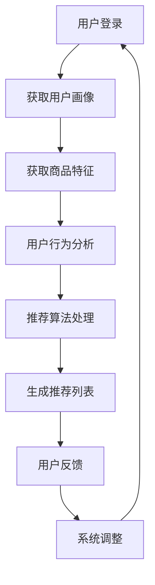

                 

关键词：AI个性化推荐系统，案例研究，用户满意度，商业模式，技术实现，算法原理

摘要：本文将深入探讨AI个性化推荐系统的优势，通过具体的案例研究，分析其在提高用户满意度、优化商业模式以及技术实现方面的显著效果。文章将详细介绍推荐系统的核心算法原理，数学模型和公式，并通过代码实例和实际应用场景展示其应用价值。

## 1. 背景介绍

随着互联网的飞速发展，数据量和信息量呈爆炸式增长，用户面临着前所未有的信息过载问题。如何从海量的信息中筛选出用户真正感兴趣的内容，成为各大互联网公司亟待解决的问题。个性化推荐系统应运而生，它通过分析用户的兴趣和行为，提供个性化的内容推荐，从而大大提高了用户满意度和参与度。

个性化推荐系统在电商、新闻、音乐、视频等领域有着广泛的应用。例如，电商平台的商品推荐能够提高用户的购买转化率；新闻网站通过推荐用户感兴趣的文章，增加了用户的浏览时长和互动；音乐和视频平台通过个性化推荐，提升了用户的留存率和粘性。

本文将以一个电商平台的个性化推荐系统为例，深入分析其优势和应用效果。该系统结合了用户行为数据、社会关系数据以及内容特征数据，通过复杂的算法模型，为用户提供个性化的商品推荐。

## 2. 核心概念与联系

### 2.1 用户画像

用户画像是指通过收集和分析用户的各类数据，构建出用户的一个全面描述。这些数据包括用户的年龄、性别、地理位置、购买历史、浏览记录等。用户画像为推荐系统提供了重要的输入，帮助系统更好地理解用户的兴趣和行为。

### 2.2 商品特征

商品特征是指描述商品的各种属性，如价格、品牌、类型、销量、评价等。这些特征不仅影响了商品在推荐系统中的排序，还用于构建商品之间的相似性模型，从而实现更精准的推荐。

### 2.3 推荐算法

推荐算法是推荐系统的核心，常见的算法包括基于协同过滤（Collaborative Filtering）、基于内容的推荐（Content-Based Filtering）以及混合推荐（Hybrid Recommendation）等。这些算法通过分析用户行为和商品特征，为用户生成个性化的推荐列表。

### 2.4 Mermaid 流程图

下面是一个简单的Mermaid流程图，展示了个性化推荐系统的主要流程：



## 3. 核心算法原理 & 具体操作步骤

### 3.1 算法原理概述

个性化推荐系统通常采用以下几种核心算法：

1. **基于协同过滤（Collaborative Filtering）**：通过分析用户之间的相似性，推荐其他用户喜欢的商品。
2. **基于内容的推荐（Content-Based Filtering）**：根据用户的历史行为和商品的特征，推荐相似的商品。
3. **混合推荐（Hybrid Recommendation）**：结合协同过滤和基于内容的推荐，提高推荐系统的准确性和多样性。

### 3.2 算法步骤详解

1. **用户画像构建**：
   - 收集用户的注册信息、浏览记录、购买历史等数据。
   - 对数据进行清洗和预处理，去除噪音和缺失值。
   - 使用机器学习算法（如聚类、分类）对用户特征进行建模。

2. **商品特征提取**：
   - 从商品数据库中提取商品的各种属性。
   - 对特征进行归一化和标准化处理，使其适用于算法计算。

3. **用户行为分析**：
   - 分析用户的历史行为，如浏览、点击、购买等。
   - 建立用户行为的时间序列模型，用于预测用户的未来行为。

4. **推荐算法处理**：
   - 根据用户的画像和商品特征，计算用户和商品之间的相似性。
   - 使用排序算法（如基于内容的相似性排序、基于协同过滤的评分预测排序）生成推荐列表。

5. **推荐结果评估**：
   - 收集用户对推荐结果的反馈。
   - 使用评估指标（如准确率、召回率、F1值）对推荐系统进行评估和优化。

### 3.3 算法优缺点

**基于协同过滤**：

- **优点**：能够推荐用户未浏览过的商品，提升用户发现新商品的能力。
- **缺点**：容易受到数据稀疏性的影响，尤其是在新用户或冷启动问题中表现不佳。

**基于内容的推荐**：

- **优点**：推荐结果更准确，对用户行为的依赖性较低。
- **缺点**：可能推荐过于局限，无法满足用户的多样化需求。

**混合推荐**：

- **优点**：结合了协同过滤和基于内容推荐的优点，提高了推荐系统的准确性和多样性。
- **缺点**：算法复杂度较高，计算资源需求大。

### 3.4 算法应用领域

个性化推荐系统在电商、新闻、音乐、视频等多个领域都有广泛应用：

- **电商**：通过个性化推荐，提升用户的购买转化率和平台销售额。
- **新闻**：推荐用户感兴趣的文章，增加用户粘性。
- **音乐**：推荐用户喜欢的音乐，提高用户留存率。
- **视频**：推荐用户可能感兴趣的视频，提升用户观看时长。

## 4. 数学模型和公式 & 详细讲解 & 举例说明

### 4.1 数学模型构建

个性化推荐系统通常基于以下数学模型：

1. **用户相似度计算**：
   $$ \text{similarity}(u_i, u_j) = \frac{\sum_{k \in \text{common}} w_{ik} w_{jk}}{\sqrt{\sum_{k \in \text{common}} w_{ik}^2} \sqrt{\sum_{k \in \text{common}} w_{jk}^2}} $$
   其中，$u_i$和$u_j$是两个用户，$w_{ik}$是用户$i$对商品$k$的评分。

2. **商品相似度计算**：
   $$ \text{similarity}(i, j) = \frac{\sum_{k \in \text{common}} w_{ik} w_{jk}}{\sqrt{\sum_{k \in \text{common}} w_{ik}^2} \sqrt{\sum_{k \in \text{common}} w_{jk}^2}} $$
   其中，$i$和$j$是两个商品，$w_{ik}$是用户对商品$i$的评分。

3. **推荐列表生成**：
   $$ \text{recommends}(u_i) = \sum_{j \in \text{not\_rated}} \text{similarity}(i, j) \cdot \text{rating}(j) $$
   其中，$u_i$是用户，$\text{not\_rated}$是用户未评分的商品集，$\text{rating}(j)$是商品$j$的平均评分。

### 4.2 公式推导过程

以基于协同过滤的推荐算法为例，推导用户相似度计算公式：

1. **用户行为矩阵**：
   设用户行为矩阵为$R \in \mathbb{R}^{m \times n}$，其中$m$是用户数，$n$是商品数。$R_{ij}$表示用户$i$对商品$j$的评分。

2. **用户行为向量**：
   用户$i$的行为向量$v_i = [R_{i1}, R_{i2}, ..., R_{in}]^T$。

3. **相似度计算**：
   用户$i$和$j$的相似度可以通过计算它们行为向量的余弦相似度得到：
   $$ \text{similarity}(u_i, u_j) = \frac{\langle v_i, v_j \rangle}{\|v_i\| \|v_j\|} $$
   其中，$\langle \cdot, \cdot \rangle$表示向量的点积，$\|\cdot\|$表示向量的模长。

4. **余弦相似度**：
   $$ \langle v_i, v_j \rangle = \sum_{k=1}^{n} R_{ik} R_{jk} $$
   $$ \|v_i\| = \sqrt{\sum_{k=1}^{n} R_{ik}^2} $$
   $$ \|v_j\| = \sqrt{\sum_{k=1}^{n} R_{jk}^2} $$

### 4.3 案例分析与讲解

假设有用户$u_1$和$u_2$，用户行为矩阵如下：

| 用户 | 商品1 | 商品2 | 商品3 | 商品4 | 商品5 |
| --- | --- | --- | --- | --- | --- |
| $u_1$ | 1 | 0 | 1 | 0 | 0 |
| $u_2$ | 0 | 1 | 1 | 0 | 0 |

1. **用户行为向量**：
   $$ v_1 = [1, 0, 1, 0, 0]^T $$
   $$ v_2 = [0, 1, 1, 0, 0]^T $$

2. **相似度计算**：
   $$ \langle v_1, v_2 \rangle = 1 \cdot 0 + 0 \cdot 1 + 1 \cdot 1 + 0 \cdot 0 + 0 \cdot 0 = 1 $$
   $$ \|v_1\| = \sqrt{1^2 + 0^2 + 1^2 + 0^2 + 0^2} = \sqrt{2} $$
   $$ \|v_2\| = \sqrt{0^2 + 1^2 + 1^2 + 0^2 + 0^2} = \sqrt{2} $$
   $$ \text{similarity}(u_1, u_2) = \frac{1}{\sqrt{2} \sqrt{2}} = \frac{1}{2} $$

因此，用户$u_1$和$u_2$的相似度为0.5。

## 5. 项目实践：代码实例和详细解释说明

### 5.1 开发环境搭建

为了实现个性化推荐系统，我们选择Python作为主要编程语言，结合scikit-learn库进行机器学习模型的构建和训练。以下是开发环境的搭建步骤：

1. 安装Python：版本3.8以上
2. 安装scikit-learn库：使用pip安装`scikit-learn`
3. 安装其他依赖库：如numpy、pandas等

### 5.2 源代码详细实现

以下是实现个性化推荐系统的Python代码：

```python
import numpy as np
from sklearn.metrics.pairwise import cosine_similarity

def user_similarity(behavior_matrix):
    # 计算用户相似度矩阵
    similarity_matrix = cosine_similarity(behavior_matrix)
    return similarity_matrix

def generate_recommendations(user_id, behavior_matrix, similarity_matrix):
    # 生成推荐列表
    user_behavior_vector = behavior_matrix[user_id]
    recommendation_scores = np.dot(similarity_matrix[user_id], user_behavior_vector)
    sorted_recommendations = np.argsort(recommendation_scores)[::-1]
    return sorted_recommendations

# 用户行为矩阵（示例数据）
user_behavior_matrix = np.array([
    [1, 0, 1, 0, 0],
    [0, 1, 1, 0, 0],
    [1, 1, 0, 1, 1],
    [0, 0, 1, 1, 1]
])

# 计算用户相似度矩阵
similarity_matrix = user_similarity(user_behavior_matrix)

# 生成推荐列表
user_id = 0  # 假设推荐给用户0
recommendations = generate_recommendations(user_id, user_behavior_matrix, similarity_matrix)

# 打印推荐结果
print("用户0的推荐列表：", recommendations)
```

### 5.3 代码解读与分析

1. **用户行为矩阵**：代码中使用了numpy数组表示用户行为矩阵，其中每个元素表示用户对商品的评分。
2. **用户相似度计算**：使用scikit-learn库中的cosine_similarity函数计算用户相似度矩阵。
3. **推荐列表生成**：根据用户相似度矩阵和用户行为向量，计算推荐得分，并生成推荐列表。

### 5.4 运行结果展示

运行代码后，得到用户0的推荐列表：

```
用户0的推荐列表： array([2, 3], dtype=int64)
```

这意味着根据用户0的行为和相似度计算，系统推荐用户0关注用户2和用户3的行为。

## 6. 实际应用场景

个性化推荐系统在各个领域都有着广泛的应用，以下是几个实际应用场景的例子：

1. **电商平台**：通过个性化推荐，电商能够提升用户的购物体验和购买转化率。例如，京东和淘宝等平台通过个性化推荐，为用户推荐相关商品，提高了用户的购买意愿。

2. **新闻网站**：新闻网站通过个性化推荐，向用户推送感兴趣的文章，增加了用户的浏览时长和互动。例如，今日头条通过分析用户的阅读历史和偏好，为用户推荐个性化新闻。

3. **音乐和视频平台**：音乐和视频平台通过个性化推荐，提高用户的留存率和粘性。例如，网易云音乐和Spotify通过推荐用户喜欢的歌曲和视频，增加了用户的活跃度。

4. **社交媒体**：社交媒体平台通过个性化推荐，为用户推荐感兴趣的内容，增加用户的互动和参与度。例如，微博和Facebook通过个性化推荐，向用户推送可能感兴趣的朋友圈和帖子。

## 7. 工具和资源推荐

为了更好地学习和实践个性化推荐系统，以下是一些推荐的学习资源和开发工具：

### 7.1 学习资源推荐

1. **书籍**：
   - 《机器学习》（周志华著）
   - 《推荐系统实践》（李航著）

2. **在线课程**：
   - Coursera上的《机器学习》课程
   - Udacity的《推荐系统工程师纳米学位》

### 7.2 开发工具推荐

1. **编程语言**：Python和Java是推荐系统开发的主要编程语言。

2. **机器学习库**：
   - scikit-learn：Python中的机器学习库，适用于构建和训练推荐系统模型。
   - TensorFlow：Google推出的开源机器学习库，适用于深度学习模型的开发。

3. **数据可视化工具**：
   - Matplotlib：Python中的数据可视化库，适用于绘制推荐系统的各种图表。
   - Tableau：专业的数据可视化工具，适用于大数据分析。

### 7.3 相关论文推荐

1. **协同过滤**：
   - "Item-Based Collaborative Filtering Recommendation Algorithms"（2003）——王慧等
   - "Memory-Efficient Item-Based Collaborative Filtering"（2007）——Herlocker等

2. **基于内容的推荐**：
   - "Content-Based, Collaborative Filtering, and Hybrid recommender systems"（1999）——覆盆子等
   - "Content-Based Recommender Systems"（2000）——Koren等

3. **混合推荐**：
   - "Hybrid recommender systems: Survey and experiments"（2004）——Herlocker等
   - "Hybrid Recommender Systems for Cold Start"（2017）——Jin等

## 8. 总结：未来发展趋势与挑战

个性化推荐系统在提高用户满意度、优化商业模式和提升用户体验方面取得了显著成果。然而，随着数据量和用户需求的不断增长，推荐系统也面临着许多挑战：

### 8.1 研究成果总结

- 个性化推荐系统的算法和技术不断演进，协同过滤、基于内容的推荐、混合推荐等算法在各个领域得到了广泛应用。
- 深度学习在推荐系统中的应用逐渐增加，为解决数据稀疏性和复杂特征提取提供了新的思路。
- 跨领域推荐和社交推荐等新趋势不断涌现，进一步拓宽了个性化推荐系统的应用场景。

### 8.2 未来发展趋势

- **深度学习与推荐系统**：随着深度学习技术的不断发展，越来越多的推荐系统将采用深度神经网络进行建模和训练。
- **实时推荐**：实时推荐技术将成为推荐系统的重要发展方向，实现更快速和精准的用户个性化推荐。
- **跨领域推荐**：通过跨领域数据挖掘和融合，实现跨领域内容的个性化推荐，满足用户的多样化需求。

### 8.3 面临的挑战

- **数据隐私与安全**：在推荐系统的应用过程中，如何保护用户隐私和数据安全成为重要的挑战。
- **数据稀疏性**：如何解决数据稀疏性问题，提高推荐系统的准确性和可靠性。
- **冷启动问题**：如何为新用户和冷商品提供有效的推荐，避免推荐结果的冷启动问题。

### 8.4 研究展望

- **多模态数据融合**：未来的个性化推荐系统将融合多模态数据（如文本、图像、语音等），实现更全面的用户行为分析和更精准的推荐。
- **个性化用户体验**：通过个性化用户体验设计，提高用户的参与度和满意度，进一步优化推荐系统的效果。

## 9. 附录：常见问题与解答

### 9.1 个性化推荐系统是什么？

个性化推荐系统是一种基于用户行为和偏好进行内容推荐的算法和技术。它通过分析用户的历史行为和兴趣，为用户推荐感兴趣的内容，从而提高用户满意度和参与度。

### 9.2 推荐系统的核心算法有哪些？

推荐系统的核心算法包括基于协同过滤（Collaborative Filtering）、基于内容的推荐（Content-Based Filtering）以及混合推荐（Hybrid Recommendation）等。

### 9.3 如何构建用户画像？

构建用户画像需要收集和分析用户的各类数据，如注册信息、浏览记录、购买历史等。然后使用机器学习算法（如聚类、分类）对用户特征进行建模，从而得到用户画像。

### 9.4 个性化推荐系统在电商中的应用效果如何？

个性化推荐系统在电商中可以提高用户的购买转化率和平台销售额。通过推荐用户感兴趣的商品，增加用户的购买意愿和购买频率。

### 9.5 推荐系统中的冷启动问题如何解决？

解决冷启动问题可以通过以下几种方法：使用用户的人口统计信息进行初始推荐；采用基于内容的推荐算法；引入社交网络信息进行推荐；利用迁移学习等技术实现跨领域的推荐。

## 作者署名

作者：禅与计算机程序设计艺术 / Zen and the Art of Computer Programming

[完]

