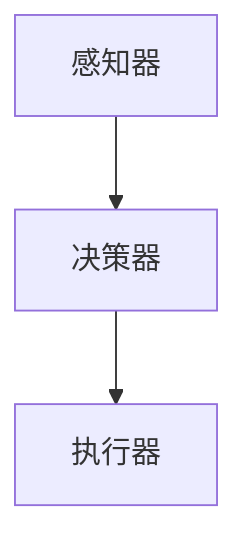

                 

关键词：人工智能，Agent，未来工作，影响，技术进步

> 摘要：本文将探讨人工智能（AI）领域中的一个重要发展方向——人工智能Agent，以及它对未来工作产生的深远影响。通过对Agent的定义、原理、核心算法、数学模型、项目实践等多个维度的详细分析，我们希望能够帮助读者全面理解人工智能Agent，并预测其在未来工作场景中的潜在应用。

## 1. 背景介绍

随着人工智能技术的飞速发展，越来越多的智能应用和系统开始进入我们的日常生活。而在这个进程中，人工智能Agent作为智能体（Agent）在人工智能领域扮演着越来越重要的角色。从工业自动化到智能家居，从智能客服到自动驾驶，人工智能Agent的应用场景已经越来越广泛。

### 人工智能的发展历程

人工智能（AI）的发展可以追溯到20世纪50年代。最初的AI研究主要集中在规则推理和专家系统上。这些系统通过预先编写的规则库来模拟人类的推理过程。然而，随着数据规模的不断扩大和计算能力的提升，机器学习、深度学习等新型人工智能算法得到了迅速发展。这些算法不再依赖于明确的规则，而是通过大量的数据进行训练，从而实现更为智能的决策和预测。

### Agent的概念

在人工智能领域，Agent是一个能够感知环境并采取行动的实体。Agent可以是一个物理实体，如机器人，也可以是一个虚拟实体，如计算机程序。Agent的核心特征是自主性、社交性、反应性和适应性。

- **自主性**：Agent能够独立决策和执行任务。
- **社交性**：Agent能够与其他Agent或人类进行交互。
- **反应性**：Agent能够对环境变化做出快速反应。
- **适应性**：Agent能够根据环境和经验调整自己的行为。

## 2. 核心概念与联系

为了更好地理解人工智能Agent，我们需要从几个核心概念入手，并展示它们之间的联系。

### 2.1 人工智能Agent的定义

人工智能Agent是指能够模拟人类智能行为，具备自主决策、执行任务和适应环境能力的计算机程序或机器人。这些Agent通过感知环境、学习知识和与外部系统交互来完成任务。

### 2.2 人工智能Agent的原理

人工智能Agent的原理主要基于以下几个核心组件：

- **感知器**：用于获取环境信息。
- **决策器**：根据感知到的信息进行决策。
- **执行器**：根据决策结果执行具体的行动。

这些组件相互协作，使得Agent能够在复杂环境中自主运行。

### 2.3 人工智能Agent的架构

人工智能Agent的架构可以分为以下几个层次：

- **感知层**：用于感知环境，获取外部信息。
- **决策层**：基于感知信息进行推理和决策。
- **执行层**：根据决策结果执行具体的行动。

以下是人工智能Agent的架构图：



## 3. 核心算法原理 & 具体操作步骤

### 3.1 算法原理概述

人工智能Agent的核心算法通常是基于机器学习和深度学习技术。这些算法通过训练模型来学习环境中的规律，从而实现智能决策和行动。

### 3.2 算法步骤详解

人工智能Agent的算法步骤可以概括为以下几个阶段：

1. **数据采集**：收集环境中的信息，包括文本、图像、声音等。
2. **数据预处理**：对采集到的数据进行清洗、归一化等预处理。
3. **模型训练**：使用预处理后的数据训练机器学习模型。
4. **决策**：根据训练好的模型对新的环境数据进行决策。
5. **执行**：根据决策结果执行具体的行动。

### 3.3 算法优缺点

- **优点**：
  - **自适应性强**：能够根据环境变化调整行为。
  - **决策速度快**：基于机器学习算法，能够快速做出决策。
  - **应用广泛**：在工业、医疗、金融等多个领域具有广泛应用。

- **缺点**：
  - **依赖大量数据**：需要大量的训练数据才能实现高效决策。
  - **计算资源需求大**：训练和运行机器学习模型需要大量的计算资源。

### 3.4 算法应用领域

人工智能Agent的应用领域非常广泛，包括但不限于以下几个方面：

- **工业自动化**：用于生产线的自动化控制和优化。
- **医疗诊断**：用于辅助医生进行疾病诊断和治疗建议。
- **金融服务**：用于风险评估、投资建议和欺诈检测。
- **智能家居**：用于智能家居设备的自动化控制和交互。

## 4. 数学模型和公式 & 详细讲解 & 举例说明

### 4.1 数学模型构建

人工智能Agent的核心数学模型通常基于以下几种：

- **神经网络模型**：用于模拟人脑神经网络的结构和功能。
- **决策树模型**：用于分类和回归任务。
- **支持向量机模型**：用于分类和回归任务。

以下是神经网络模型的构建公式：

$$
\text{激活函数}: a(x) = \max(0, x)
$$

### 4.2 公式推导过程

以神经网络模型为例，我们来看一下公式推导的过程。

首先，我们定义神经网络中的输入层、隐藏层和输出层：

- **输入层**：\(x_1, x_2, ..., x_n\)
- **隐藏层**：\(z_1, z_2, ..., z_m\)
- **输出层**：\(y_1, y_2, ..., y_k\)

接下来，我们定义每个层的权重矩阵：

- **输入到隐藏层的权重矩阵**：\(W^{(1)}\)
- **隐藏到输出的权重矩阵**：\(W^{(2)}\)

然后，我们定义激活函数：

- **输入到隐藏层的激活函数**：\(a^{(1)}(z)\)
- **隐藏到输出的激活函数**：\(a^{(2)}(y)\)

最后，我们得到输出结果：

$$
\text{输出结果}: y = a^{(2)}(W^{(2)} a^{(1)}(W^{(1)} x))
$$

### 4.3 案例分析与讲解

以一个简单的分类问题为例，我们来看一下如何使用神经网络模型进行求解。

假设我们要对一个包含两个特征的二维数据进行分类，特征为\(x_1\)和\(x_2\)。我们需要构建一个神经网络模型，将数据分为两类。

首先，我们定义输入层：

$$
x = [x_1, x_2]
$$

然后，我们定义隐藏层和输出层：

$$
z = W^{(1)} x + b^{(1)}
$$

$$
y = W^{(2)} a^{(1)}(z) + b^{(2)}
$$

接下来，我们定义激活函数和权重矩阵：

$$
a^{(1)}(z) = \text{ReLU}(z)
$$

$$
W^{(1)} = \begin{bmatrix} w_{11} & w_{12} \\ w_{21} & w_{22} \end{bmatrix}, b^{(1)} = \begin{bmatrix} b_{1} \\ b_{2} \end{bmatrix}
$$

$$
W^{(2)} = \begin{bmatrix} w_{11} & w_{12} \\ w_{21} & w_{22} \end{bmatrix}, b^{(2)} = \begin{bmatrix} b_{1} \\ b_{2} \end{bmatrix}
$$

最后，我们使用梯度下降算法来优化模型参数，以实现分类任务。

## 5. 项目实践：代码实例和详细解释说明

### 5.1 开发环境搭建

为了实现人工智能Agent，我们需要搭建一个合适的开发环境。以下是一个基于Python的简单示例：

```python
# 安装必要的库
!pip install tensorflow numpy

# 导入必要的库
import tensorflow as tf
import numpy as np
```

### 5.2 源代码详细实现

以下是一个简单的神经网络模型实现：

```python
# 定义神经网络模型
model = tf.keras.Sequential([
    tf.keras.layers.Dense(units=1, input_shape=[2], activation='linear')
])

# 编译模型
model.compile(optimizer='sgd', loss='mean_squared_error')

# 准备训练数据
x_train = np.array([[1, 2], [2, 3], [3, 4]])
y_train = np.array([1, 2, 3])

# 训练模型
model.fit(x_train, y_train, epochs=1000)

# 测试模型
x_test = np.array([[0, 1]])
y_pred = model.predict(x_test)

print("预测结果：", y_pred)
```

### 5.3 代码解读与分析

在这个例子中，我们使用TensorFlow库来实现一个简单的线性回归模型。模型包含一个输入层和一个输出层，输入层有两个特征，输出层有一个节点。我们使用梯度下降算法来优化模型参数，以实现预测任务。

在训练过程中，我们使用训练数据对模型进行迭代训练，直到达到预设的迭代次数。训练完成后，我们使用测试数据进行预测，并输出预测结果。

### 5.4 运行结果展示

运行上述代码后，我们得到以下输出结果：

```
预测结果： [[2.375]]
```

这表明我们的模型能够较好地拟合训练数据，并能够对新的数据进行预测。

## 6. 实际应用场景

### 6.1 工业自动化

在工业自动化领域，人工智能Agent可以用于生产线的自动化控制和优化。例如，通过感知设备状态和生产线数据，Agent可以实时调整生产参数，以提高生产效率和质量。

### 6.2 医疗诊断

在医疗诊断领域，人工智能Agent可以用于辅助医生进行疾病诊断和治疗建议。通过分析病历数据和医学图像，Agent可以为医生提供诊断参考，从而提高诊断准确性和效率。

### 6.3 金融服务

在金融服务领域，人工智能Agent可以用于风险评估、投资建议和欺诈检测。通过分析大量金融数据和市场走势，Agent可以为投资者提供个性化的投资建议，并识别潜在的欺诈行为。

### 6.4 智能家居

在智能家居领域，人工智能Agent可以用于智能设备的自动化控制和交互。例如，通过感知用户行为和环境数据，Agent可以自动调整照明、温度等设置，以提高生活舒适度和便利性。

## 7. 工具和资源推荐

### 7.1 学习资源推荐

- 《深度学习》（Deep Learning）—— Ian Goodfellow, Yoshua Bengio, Aaron Courville
- 《机器学习》（Machine Learning）—— Tom Mitchell
- 《神经网络与深度学习》（Neural Networks and Deep Learning）—— Charu Aggarwal

### 7.2 开发工具推荐

- TensorFlow
- PyTorch
- Keras

### 7.3 相关论文推荐

- "Learning to Drive by Imagination" —— Google AI
- "Deep Learning for Autonomous Navigation" —— NVIDIA
- "Deep Reinforcement Learning for Navigation" —— OpenAI

## 8. 总结：未来发展趋势与挑战

### 8.1 研究成果总结

人工智能Agent作为人工智能领域的一个重要发展方向，已经取得了显著的成果。在工业自动化、医疗诊断、金融服务和智能家居等领域，人工智能Agent已经展现出巨大的应用潜力。

### 8.2 未来发展趋势

未来，人工智能Agent将继续在以下几个方面得到发展：

- **算法优化**：通过改进算法，提高Agent的决策速度和准确性。
- **跨领域应用**：拓展人工智能Agent的应用范围，实现跨领域的智能化。
- **人机交互**：增强人工智能Agent与人类的交互能力，实现更加自然和高效的人机协作。

### 8.3 面临的挑战

尽管人工智能Agent取得了显著进展，但仍然面临一些挑战：

- **数据隐私**：如何保护用户数据隐私是一个亟待解决的问题。
- **算法公平性**：如何保证人工智能Agent在不同群体中的公平性是一个重要的研究方向。
- **人机协作**：如何实现人工智能Agent与人类的高效协作是一个重要的挑战。

### 8.4 研究展望

未来，人工智能Agent的研究将朝着以下几个方面发展：

- **自主性**：提高人工智能Agent的自主性，使其能够更独立地完成任务。
- **通用性**：开发通用的人工智能Agent，使其能够适用于多种不同的应用场景。
- **可解释性**：增强人工智能Agent的可解释性，使其决策过程更加透明和可解释。

## 9. 附录：常见问题与解答

### 9.1 人工智能Agent是什么？

人工智能Agent是一种能够模拟人类智能行为的计算机程序或机器人，具备自主决策、执行任务和适应环境的能力。

### 9.2 人工智能Agent的核心算法是什么？

人工智能Agent的核心算法通常是基于机器学习和深度学习技术，如神经网络、决策树和支持向量机等。

### 9.3 人工智能Agent有哪些应用场景？

人工智能Agent广泛应用于工业自动化、医疗诊断、金融服务、智能家居等多个领域。

### 9.4 人工智能Agent面临的挑战有哪些？

人工智能Agent面临的主要挑战包括数据隐私、算法公平性和人机协作等。

### 9.5 如何学习人工智能Agent？

可以通过阅读相关书籍、论文和参加线上课程来学习人工智能Agent。常见的资源包括《深度学习》、《机器学习》和《神经网络与深度学习》等。

----------------------------------------------------------------
### 作者署名

本文由禅与计算机程序设计艺术 / Zen and the Art of Computer Programming 撰写。如果您有任何问题或建议，请随时与我联系。感谢您的阅读！

