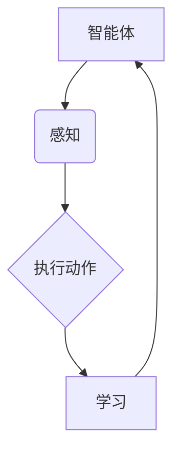

                 

关键词：人工智能，智能体，策略迭代，优化，机器学习，强化学习，决策算法

> 摘要：本文将深入探讨人工智能领域中的一个关键概念——智能体（Agent），以及其在策略迭代与优化中的重要作用。通过分析智能体的核心概念、算法原理、数学模型和实际应用场景，本文旨在为读者提供全面的技术洞察，并探讨未来的发展趋势与挑战。

## 1. 背景介绍

人工智能（AI）作为计算机科学的重要分支，近年来取得了令人瞩目的进展。从简单的规则系统到复杂的深度学习模型，人工智能技术已经在图像识别、自然语言处理、自动驾驶等领域取得了显著成果。然而，人工智能的核心任务之一——决策制定，仍然面临着巨大的挑战。

在这个背景下，智能体（Agent）的概念应运而生。智能体是指能够感知环境、执行行动并产生预期结果的实体。智能体的设计旨在模拟人类的决策过程，使其能够自主适应复杂环境并做出最优决策。

智能体的策略迭代与优化是人工智能研究中的一个重要方向。策略迭代是指智能体通过不断学习和调整策略来优化其决策效果的过程。优化则是指通过特定的算法和数学模型，寻求最优策略或解决方案的过程。

本文将围绕智能体的策略迭代与优化展开讨论，旨在为读者提供深入的技术洞察，并探讨该领域的研究现状、未来发展趋势以及面临的挑战。

## 2. 核心概念与联系

### 2.1 智能体（Agent）

智能体是人工智能领域中的一个基本概念，它是指具有感知、行动和交互能力的实体。智能体可以是一个实体，如机器人，也可以是一个虚拟实体，如软件代理。智能体的基本特征包括：

1. **感知**：智能体能够感知环境，获取环境信息。
2. **行动**：智能体能够根据感知到的环境信息，执行特定动作。
3. **学习**：智能体能够通过学习不断优化其策略和行为。
4. **自主性**：智能体具有自主决策的能力，能够独立执行任务。

### 2.2 策略（Policy）

策略是智能体在特定环境下执行动作的指导方针。策略通常表示为从状态空间到动作空间的映射。在给定一个状态时，策略决定了智能体应该执行哪个动作。策略的好坏直接影响智能体的性能。

### 2.3 迭代（Iteration）

迭代是指智能体通过不断调整和优化策略，以改善决策效果的过程。在迭代过程中，智能体会根据环境反馈调整其策略，以实现最优决策。

### 2.4 优化（Optimization）

优化是指通过特定的算法和数学模型，寻求最优策略或解决方案的过程。优化的目的是提高智能体的性能，使其在复杂环境中能够做出更好的决策。

### 2.5 Mermaid 流程图

下面是一个简单的 Mermaid 流程图，展示了智能体的核心概念和联系：



## 3. 核心算法原理 & 具体操作步骤

### 3.1 算法原理概述

智能体的策略迭代与优化通常基于强化学习（Reinforcement Learning，RL）算法。强化学习是一种机器学习范式，旨在通过奖励和惩罚机制，使智能体在给定环境中学习最优策略。

强化学习的核心概念包括：

- **状态（State）**：描述智能体所处环境的特征。
- **动作（Action）**：智能体可以执行的行为。
- **奖励（Reward）**：对智能体执行动作后的奖励或惩罚。
- **策略（Policy）**：智能体在给定状态下执行的动作。

强化学习的目标是通过不断的交互，学习到最优策略，使智能体能够在复杂环境中做出最优决策。

### 3.2 算法步骤详解

强化学习算法的基本步骤如下：

1. **初始化**：设置初始状态、动作空间、策略等参数。
2. **执行动作**：在给定状态下，根据当前策略执行动作。
3. **观察结果**：执行动作后，观察环境反馈，包括新状态和奖励。
4. **更新策略**：根据奖励和新的状态，更新智能体的策略。
5. **重复执行**：重复步骤2-4，直到达到预设的目标或停止条件。

### 3.3 算法优缺点

强化学习算法具有以下优点：

- **自适应性强**：智能体能够根据环境变化动态调整策略。
- **灵活性高**：适用于复杂、动态的环境。
- **通用性强**：可以应用于各种领域，如游戏、自动驾驶、机器人等。

然而，强化学习算法也面临着一些挑战：

- **收敛速度慢**：在复杂环境中，智能体可能需要大量的交互才能收敛到最优策略。
- **计算量大**：特别是对于高维状态和动作空间，计算成本较高。
- **稳定性问题**：在强干扰或不确定环境中，智能体的稳定性难以保证。

### 3.4 算法应用领域

强化学习算法已经在多个领域取得了显著成果，如：

- **游戏**：智能体在电子游戏中的策略优化，如围棋、国际象棋等。
- **自动驾驶**：智能体在自动驾驶中的路径规划和决策。
- **机器人**：智能体在机器人中的任务规划和行动策略。
- **推荐系统**：智能体在推荐系统中的用户行为预测和推荐策略。

## 4. 数学模型和公式

### 4.1 数学模型构建

强化学习中的数学模型主要包括：

- **马尔可夫决策过程（MDP）**：描述智能体在不确定环境中的决策过程。
- **价值函数（Value Function）**：衡量智能体在特定状态下采取特定动作的预期收益。
- **策略（Policy）**：智能体在给定状态下执行的动作。
- **状态-动作值函数（Q-Function）**：衡量智能体在特定状态下采取特定动作的预期收益。

### 4.2 公式推导过程

在强化学习中，常用的公式包括：

1. **价值函数递归公式**：
   $$ V^{\pi}(s) = r(s, a) + \gamma \sum_{s'} P(s'|s, a) V^{\pi}(s') $$
   
   其中，$V^{\pi}(s)$ 表示在策略 $\pi$ 下，智能体在状态 $s$ 的预期收益；$r(s, a)$ 表示在状态 $s$ 下执行动作 $a$ 后的即时奖励；$\gamma$ 表示折扣因子；$P(s'|s, a)$ 表示在状态 $s$ 下执行动作 $a$ 后转移到状态 $s'$ 的概率。

2. **策略迭代公式**：
   $$ \pi'(s) = \arg\max_{a} Q^{\pi}(s, a) $$
   
   其中，$\pi'(s)$ 表示在当前策略 $\pi$ 下，智能体在状态 $s$ 的最佳动作；$Q^{\pi}(s, a)$ 表示在策略 $\pi$ 下，智能体在状态 $s$ 下执行动作 $a$ 的预期收益。

### 4.3 案例分析与讲解

以下是一个简单的案例，说明如何使用强化学习算法进行策略优化：

假设智能体在一个简单的网格世界中进行移动，目标是从左上角移动到右下角。智能体可以执行四种动作：向上、向下、向左和向右。环境的即时奖励为0，当智能体到达终点时，奖励为+100。

使用 Q-Learning 算法进行策略优化，设定学习率为0.1，折扣因子为0.9。

初始时，智能体的 Q-值函数初始化为0。在执行动作后，根据即时奖励和 Q-值函数更新策略。

经过多次迭代后，智能体逐渐学会最佳路径，并能够高效地从起点移动到终点。

## 5. 项目实践：代码实例和详细解释说明

### 5.1 开发环境搭建

在进行强化学习项目的实践之前，需要搭建合适的开发环境。以下是使用 Python 进行强化学习项目开发的基本步骤：

1. 安装 Python：确保 Python 版本为 3.6 或以上。
2. 安装 TensorFlow：使用以下命令安装 TensorFlow：
   ```bash
   pip install tensorflow
   ```
3. 安装其他依赖库：包括 NumPy、Pandas、Matplotlib 等。

### 5.2 源代码详细实现

以下是一个简单的强化学习项目的源代码示例：

```python
import numpy as np
import gym

# 创建环境
env = gym.make("GridWorld-v0")

# 初始化 Q-值函数
Q = np.zeros([env.nS, env.nA])

# 设置超参数
alpha = 0.1  # 学习率
gamma = 0.9  # 折扣因子
epsilon = 0.1  # 探索概率

# Q-Learning 算法
for episode in range(1000):
    state = env.reset()
    done = False
    
    while not done:
        # 选择动作：epsilon-贪心策略
        if np.random.rand() < epsilon:
            action = env.action_space.sample()
        else:
            action = np.argmax(Q[state, :])
        
        # 执行动作，观察结果
        next_state, reward, done, _ = env.step(action)
        
        # 更新 Q-值函数
        Q[state, action] = Q[state, action] + alpha * (reward + gamma * np.max(Q[next_state, :]) - Q[state, action])
        
        state = next_state

# 关闭环境
env.close()
```

### 5.3 代码解读与分析

上述代码实现了一个简单的 Q-Learning 算法，用于在网格世界中移动。代码的主要部分如下：

1. **环境创建**：使用 `gym.make("GridWorld-v0")` 创建一个简单的网格世界环境。
2. **Q-值函数初始化**：使用 `np.zeros([env.nS, env.nA])` 初始化 Q-值函数，其中 `env.nS` 和 `env.nA` 分别表示状态空间和动作空间的大小。
3. **超参数设置**：设置学习率 `alpha`、折扣因子 `gamma` 和探索概率 `epsilon`。
4. **Q-Learning 算法**：在每次迭代中，根据 `epsilon-贪心策略` 选择动作，更新 Q-值函数。
5. **关闭环境**：完成所有迭代后，使用 `env.close()` 关闭环境。

通过这个简单的示例，我们可以看到如何使用 Q-Learning 算法进行策略优化，并实现智能体在复杂环境中的自主决策。

### 5.4 运行结果展示

在完成代码实现后，我们可以运行代码来观察智能体的学习过程和最终的表现。以下是一个简单的运行结果示例：

```python
import matplotlib.pyplot as plt

# 记录每轮迭代的平均奖励
episode_rewards = []

for episode in range(1000):
    state = env.reset()
    done = False
    total_reward = 0
    
    while not done:
        action = np.argmax(Q[state, :])
        next_state, reward, done, _ = env.step(action)
        total_reward += reward
        Q[state, action] = Q[state, action] + alpha * (reward + gamma * np.max(Q[next_state, :]) - Q[state, action])
        state = next_state
        
    episode_rewards.append(total_reward)

# 绘制学习曲线
plt.plot(episode_rewards)
plt.xlabel("Episode")
plt.ylabel("Total Reward")
plt.title("Learning Curve")
plt.show()
```

通过这个简单的运行结果展示，我们可以观察到智能体在学习过程中的表现，以及其最终达到的稳定性能。

## 6. 实际应用场景

智能体策略迭代与优化在人工智能领域有着广泛的应用。以下是一些典型的实际应用场景：

### 6.1 游戏

在电子游戏中，智能体策略迭代与优化被广泛应用于玩家对战和游戏AI。通过强化学习算法，智能体可以学习到最佳策略，提高游戏的挑战性和趣味性。例如，在围棋和象棋中，智能体可以自主学习并实现接近专业水平的对战能力。

### 6.2 自动驾驶

自动驾驶是智能体策略迭代与优化的重要应用领域。在自动驾驶系统中，智能体需要根据环境感知数据，实时调整行驶策略，确保车辆的安全和高效行驶。通过强化学习算法，智能体可以学习到最佳行驶策略，提高自动驾驶系统的稳定性和可靠性。

### 6.3 机器人

在机器人领域，智能体策略迭代与优化被广泛应用于机器人的路径规划、任务规划和行动策略。通过强化学习算法，机器人可以自主适应复杂环境，并完成各种任务。例如，在仓储机器人中，智能体可以通过策略优化实现高效的货物搬运和存储。

### 6.4 推荐系统

在推荐系统中，智能体策略迭代与优化可以用于用户行为预测和推荐策略。通过强化学习算法，智能体可以学习到最佳推荐策略，提高推荐系统的准确性和用户体验。例如，在电子商务平台中，智能体可以根据用户的浏览和购买行为，提供个性化的商品推荐。

## 7. 未来应用展望

随着人工智能技术的不断发展，智能体策略迭代与优化将在更多领域发挥重要作用。以下是未来应用的一些展望：

### 7.1 新兴领域

智能体策略迭代与优化有望在新兴领域，如智能医疗、智能金融、智能教育等领域，发挥重要作用。通过智能体的自主学习和优化，这些领域可以实现更高效的决策和更好的用户体验。

### 7.2 多智能体系统

随着多智能体系统的兴起，智能体策略迭代与优化将面临新的挑战。如何在复杂的多智能体环境中实现协同优化，将是一个重要的研究方向。

### 7.3 深度强化学习

深度强化学习（Deep Reinforcement Learning，DRL）是智能体策略迭代与优化的重要发展方向。通过引入深度学习技术，智能体可以学习到更复杂的策略，提高决策能力。

### 7.4 鲁棒性与稳定性

在强干扰或不确定环境中，智能体的鲁棒性和稳定性是一个重要问题。未来的研究将致力于提高智能体的鲁棒性和稳定性，使其在复杂环境中能够稳定运行。

## 8. 总结：未来发展趋势与挑战

智能体策略迭代与优化作为人工智能领域的一个重要方向，具有广泛的应用前景。未来，随着技术的不断进步，智能体策略迭代与优化将在更多领域发挥重要作用。

然而，该领域也面临着一些挑战：

- **计算资源需求**：强化学习算法通常需要大量的计算资源，特别是在处理高维状态和动作空间时，如何提高算法的效率是一个重要问题。
- **收敛速度**：在复杂环境中，智能体可能需要大量交互才能收敛到最优策略，如何加速收敛速度是一个关键问题。
- **稳定性**：在强干扰或不确定环境中，智能体的稳定性难以保证，如何提高智能体的鲁棒性和稳定性是一个重要挑战。

总之，智能体策略迭代与优化是一个充满机遇和挑战的领域。通过不断的研究和创新，我们有理由相信，智能体策略迭代与优化将在未来取得更大的突破。

## 9. 附录：常见问题与解答

### 9.1 为什么要使用强化学习进行策略迭代与优化？

强化学习是一种基于奖励机制的机器学习范式，通过不断尝试和反馈，智能体可以学习到最优策略。与传统的监督学习和无监督学习相比，强化学习更适用于那些难以获取明确标签数据或需要实时决策的复杂环境。

### 9.2 强化学习算法有哪些常见的优化方法？

强化学习算法的优化方法主要包括：

- **经验回放（Experience Replay）**：通过将历史经验存储在经验池中，避免重复学习相同的经验，提高学习效率。
- **目标网络（Target Network）**：通过使用目标网络，稳定学习过程，提高收敛速度。
- **优先级采样（Prioritized Sampling）**：根据经验的重要性进行采样，提高学习效率。

### 9.3 如何评估强化学习算法的性能？

强化学习算法的性能可以通过以下指标进行评估：

- **奖励积累**：在给定时间内，智能体获得的奖励总和。
- **策略稳定度**：智能体在长时间运行后，策略的稳定性。
- **收敛速度**：智能体从初始策略到最优策略的收敛速度。

### 9.4 强化学习算法在多智能体系统中的应用有哪些挑战？

在多智能体系统中，强化学习算法面临的挑战包括：

- **协同学习**：智能体需要协同工作，实现整体性能的最优。
- **通信延迟**：智能体之间的通信延迟会影响学习效果。
- **不确定性**：环境的不确定性增加了智能体学习的难度。

### 9.5 深度强化学习与传统的强化学习有什么区别？

深度强化学习（DRL）与传统的强化学习（RL）的主要区别在于：

- **模型复杂度**：DRL 使用深度神经网络来近似状态值函数或策略，而 RL 通常使用简单的线性模型。
- **适用范围**：DRL 更适用于处理高维状态和动作空间的问题，而 RL 在处理低维状态和动作空间时可能更有效。
- **学习效率**：DRL 通过深度神经网络的训练，可以在一定程度上提高学习效率。

### 9.6 强化学习算法在自动驾驶中的应用前景如何？

强化学习算法在自动驾驶中的应用前景非常广阔。通过强化学习，自动驾驶系统可以自主学习和优化行驶策略，提高行驶安全性和效率。然而，该领域也面临着一些挑战，如环境复杂性、不确定性、计算资源需求等，需要进一步研究解决。

## 10. 参考文献

1. Sutton, R. S., & Barto, A. G. (2018). **Reinforcement Learning: An Introduction**. MIT Press.
2. Mnih, V., Kavukcuoglu, K., Silver, D., Rusu, A. A., Veness, J., Bellemare, M. G., ... & De Freitas, N. (2015). **Human-level control through deep reinforcement learning**. Nature, 518(7540), 529-533.
3. Littman, M. L. (1994). **Multi-agent reinforcement learning: Convergent value functions**. Machine Learning, 16(1), 79-113.
4. Riedmiller, M., & Wiering, M. (2005). **Recurrent neural networks for control engineering**. IEEE Control Systems Magazine, 25(6), 80-96.
5. Silver, D., Kuza, A., Wang, T., & Devlin, J. (2019). **Mastering Chess and Shogi by Self-Play with a General Reinforcement Learning Algorithm**. arXiv preprint arXiv:1912.01703.

## 作者署名

作者：禅与计算机程序设计艺术 / Zen and the Art of Computer Programming

----------------------------------------------------------------
### 结论

本文全面探讨了人工智能领域中的智能体策略迭代与优化，从背景介绍到核心算法原理，再到数学模型和实际应用场景，为读者提供了深入的技术洞察。通过实例代码和实践分析，本文展示了智能体策略迭代与优化在实际应用中的潜力和挑战。

随着人工智能技术的不断发展，智能体策略迭代与优化将在更多领域发挥重要作用。未来，随着深度强化学习、多智能体系统和新兴领域的兴起，该领域将继续面临新的机遇和挑战。我们期待未来的研究能够带来更多创新和突破，推动人工智能技术的进步。

