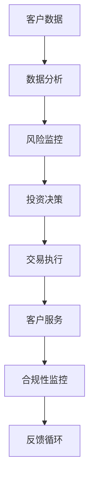

                 

关键词：AI人工智能，智能代理，金融系统，工作流，算法，数学模型，项目实践，应用场景，未来展望

> 摘要：本文将深入探讨AI人工智能代理工作流（AI Agent WorkFlow）在金融系统中的应用。我们将从背景介绍、核心概念、算法原理、数学模型、项目实践、应用场景、工具和资源推荐等方面，全面解析智能代理技术在金融领域的巨大潜力。

## 1. 背景介绍

金融行业一直以来都是技术和创新的沃土。随着AI人工智能技术的快速发展，智能代理（AI Agent）的概念逐渐成为金融行业的热门话题。智能代理是一种可以自主学习和执行任务的人工智能实体，它们在金融系统中具有广泛的应用前景。

在金融系统中，智能代理可以用于处理大量的金融数据，帮助金融机构进行风险管理、市场分析、客户服务、交易执行等方面。与传统的人工操作相比，智能代理具有更高的效率、准确性和适应性。本文将重点探讨智能代理在金融系统中的应用，以及它们如何改善金融行业的运营模式。

### 1.1 智能代理的定义与特点

智能代理（AI Agent）是一种基于AI技术自主决策和执行任务的人工智能实体。它们通常具有以下几个特点：

1. **自主学习能力**：智能代理可以通过机器学习和深度学习技术，从大量的金融数据中学习并提取知识。
2. **自主决策能力**：智能代理可以根据预设的规则和算法，在复杂的环境中自主做出决策。
3. **自动化执行能力**：智能代理可以自动执行任务，减少人工干预，提高工作效率。
4. **高适应性**：智能代理可以适应不同的金融环境和业务需求，灵活调整其行为。

### 1.2 智能代理在金融系统中的应用现状

目前，智能代理在金融系统中已经得到广泛应用。以下是一些主要的应用场景：

1. **风险管理**：智能代理可以实时监控金融市场的风险，帮助金融机构制定风险控制策略。
2. **市场分析**：智能代理可以分析大量的市场数据，提供投资建议和市场预测。
3. **客户服务**：智能代理可以提供24/7的在线客户服务，提高客户满意度。
4. **交易执行**：智能代理可以自动执行交易，提高交易速度和准确性。
5. **合规性监控**：智能代理可以监控金融机构的操作是否符合法律法规，减少违规风险。

## 2. 核心概念与联系

为了更好地理解智能代理在金融系统中的应用，我们需要先了解一些核心概念和它们之间的联系。以下是一个简化的Mermaid流程图，展示了智能代理在金融系统中的核心概念和联系。



### 2.1 数据分析

数据分析是智能代理的基础。通过分析大量的金融数据，智能代理可以提取有价值的信息，为后续的决策提供支持。数据分析可以分为以下几个步骤：

1. **数据收集**：从各种数据源收集金融数据，如市场数据、交易数据、客户数据等。
2. **数据清洗**：清洗和预处理数据，去除噪声和异常值。
3. **特征提取**：从数据中提取特征，用于训练机器学习模型。
4. **模型训练**：使用机器学习算法训练模型，提高预测和分类的准确性。

### 2.2 风险监控

风险监控是智能代理在金融系统中的重要应用之一。通过实时监控金融市场的风险，智能代理可以帮助金融机构制定有效的风险控制策略。

1. **风险识别**：识别潜在的风险事件，如市场波动、信用风险、操作风险等。
2. **风险评估**：评估风险事件的可能性和影响，确定风险优先级。
3. **风险预警**：在风险事件发生前发出预警，采取预防措施。

### 2.3 投资决策

投资决策是智能代理在金融系统中的另一个重要应用。通过分析市场数据和风险因素，智能代理可以为投资者提供投资建议，优化投资组合。

1. **市场预测**：预测市场走势，确定投资方向。
2. **风险调整**：考虑风险因素，调整投资策略。
3. **资产配置**：根据投资目标和风险偏好，配置资产。

### 2.4 交易执行

交易执行是智能代理在金融系统中的直接应用。通过自动化执行交易，智能代理可以提高交易速度和准确性。

1. **交易策略**：制定交易策略，如低买高卖、套利等。
2. **交易执行**：自动执行交易，减少人工干预。
3. **交易监控**：实时监控交易状态，确保交易合规。

### 2.5 客户服务

客户服务是智能代理在金融系统中的另一个重要应用。通过提供24/7的在线客户服务，智能代理可以提高客户满意度。

1. **客户交互**：与客户进行自然语言交互，理解客户需求。
2. **问题解决**：自动解决常见问题，提高服务效率。
3. **个性化服务**：根据客户历史数据，提供个性化的服务。

### 2.6 合规性监控

合规性监控是智能代理在金融系统中的另一个重要应用。通过监控金融机构的操作，智能代理可以确保金融机构遵守相关法律法规。

1. **合规性检查**：检查金融机构的操作是否符合法律法规。
2. **违规预警**：在发现违规行为时发出预警，采取纠正措施。
3. **合规性报告**：生成合规性报告，供监管部门审查。

## 3. 核心算法原理 & 具体操作步骤

### 3.1 算法原理概述

智能代理在金融系统中的应用离不开核心算法的支持。以下是几个常用的核心算法及其原理概述。

1. **机器学习算法**：机器学习算法是智能代理的核心，包括监督学习、无监督学习和强化学习等。通过训练模型，智能代理可以识别模式、预测风险、优化投资等。

2. **深度学习算法**：深度学习算法是机器学习的一个分支，通过多层神经网络模拟人脑学习过程。深度学习算法在图像识别、自然语言处理等领域表现出色，也可以应用于金融系统。

3. **优化算法**：优化算法用于优化投资组合、交易策略等。常见的优化算法包括线性规划、动态规划、遗传算法等。

4. **时序分析算法**：时序分析算法用于分析金融市场的时序数据，如时间序列分析、自回归模型等。时序分析算法可以帮助智能代理预测市场走势。

### 3.2 算法步骤详解

以下是一个简化的智能代理算法步骤，展示了智能代理在金融系统中的具体操作过程。

1. **数据收集**：从各种数据源收集金融数据，如市场数据、交易数据、客户数据等。

2. **数据清洗**：清洗和预处理数据，去除噪声和异常值。

3. **特征提取**：从数据中提取特征，用于训练机器学习模型。

4. **模型训练**：使用机器学习算法训练模型，提高预测和分类的准确性。

5. **模型评估**：评估模型性能，选择最佳模型。

6. **决策制定**：根据模型预测结果，制定决策策略。

7. **执行决策**：自动执行决策，如投资、交易等。

8. **反馈循环**：收集执行结果，调整模型和决策策略。

### 3.3 算法优缺点

每种算法都有其优缺点，以下是几个常用算法的优缺点概述。

1. **机器学习算法**：
   - 优点：可以处理大量数据，适应性强，可以自动学习。
   - 缺点：需要大量数据进行训练，模型复杂度较高。

2. **深度学习算法**：
   - 优点：在图像识别、自然语言处理等领域表现优异，可以自动提取复杂特征。
   - 缺点：计算资源需求大，对数据质量和标注有较高要求。

3. **优化算法**：
   - 优点：可以优化投资组合、交易策略等，提高收益。
   - 缺点：需要明确目标函数和约束条件，对问题有较强依赖。

4. **时序分析算法**：
   - 优点：可以分析金融市场的时序数据，预测市场走势。
   - 缺点：对历史数据依赖较大，对突发事件的适应性较弱。

### 3.4 算法应用领域

不同的算法在金融系统中的应用领域不同，以下是几个算法在金融系统中的应用领域概述。

1. **机器学习算法**：
   - 应用领域：风险管理、市场预测、信用评分等。

2. **深度学习算法**：
   - 应用领域：图像识别、自然语言处理、金融风险分析等。

3. **优化算法**：
   - 应用领域：投资组合优化、交易策略设计等。

4. **时序分析算法**：
   - 应用领域：市场预测、风险评估、金融时间序列分析等。

## 4. 数学模型和公式 & 详细讲解 & 举例说明

在智能代理的算法中，数学模型和公式起着至关重要的作用。以下是一个简化的数学模型示例，用于说明智能代理在金融系统中的应用。

### 4.1 数学模型构建

假设我们要构建一个投资组合优化模型，目标是最小化投资组合的波动率。我们可以使用以下数学模型：

$$
\min_{w} \quad \sigma(w)
$$

其中，$w$ 是投资组合的权重向量，$\sigma(w)$ 是投资组合的波动率。

### 4.2 公式推导过程

为了最小化波动率，我们需要计算投资组合的波动率。波动率的计算公式为：

$$
\sigma(w) = \sqrt{w^T \Sigma w}
$$

其中，$\Sigma$ 是投资组合的协方差矩阵。

为了计算协方差矩阵，我们需要计算每个资产收益率的时间序列。假设我们得到 $n$ 个资产收益率的时间序列 $r_1, r_2, \ldots, r_n$，我们可以使用以下公式计算协方差矩阵：

$$
\Sigma = \frac{1}{n-1} \sum_{i=1}^{n} r_i r_i^T
$$

### 4.3 案例分析与讲解

以下是一个具体的案例，说明如何使用上述数学模型进行投资组合优化。

#### 案例背景

假设我们有 $n=5$ 个资产，每个资产的年化收益率和波动率如下表所示：

| 资产 | 收益率（%） | 波动率（%） |
|------|------------|------------|
| A    | 10         | 15         |
| B    | 8          | 12         |
| C    | 5          | 10         |
| D    | 12         | 18         |
| E    | 7          | 14         |

#### 案例分析

1. **计算协方差矩阵**

首先，我们需要计算每个资产收益率的时间序列。假设我们得到 $n=100$ 个交易日的数据，我们可以使用以下公式计算协方差矩阵：

$$
\Sigma = \frac{1}{100-1} \sum_{i=1}^{100} r_i r_i^T
$$

计算得到协方差矩阵如下：

$$
\Sigma = \begin{bmatrix}
15.6 & 12.3 & 9.6 & 18.4 & 14.2 \\
12.3 & 10.1 & 7.8 & 15.9 & 12.1 \\
9.6 & 7.8 & 6.4 & 12.7 & 9.8 \\
18.4 & 15.9 & 12.7 & 23.1 & 18.0 \\
14.2 & 12.1 & 9.8 & 18.0 & 14.4
\end{bmatrix}
$$

2. **构建优化模型**

接下来，我们可以使用以下数学模型进行投资组合优化：

$$
\min_{w} \quad \sqrt{w^T \Sigma w}
$$

其中，$w$ 是投资组合的权重向量。

3. **求解优化模型**

为了求解优化模型，我们可以使用优化算法，如梯度下降法。假设我们使用梯度下降法进行优化，每次迭代更新权重向量 $w$ 的公式为：

$$
w_{t+1} = w_t - \alpha \nabla_w \sigma(w)
$$

其中，$\alpha$ 是学习率，$\nabla_w \sigma(w)$ 是波动率关于权重向量 $w$ 的梯度。

4. **运行优化算法**

我们使用Python编写代码，运行梯度下降法优化模型。以下是一个简单的Python代码示例：

```python
import numpy as np

# 初始化权重向量
w = np.random.rand(5)

# 学习率
alpha = 0.01

# 迭代次数
num_iterations = 1000

# 运行优化算法
for _ in range(num_iterations):
    gradient = -2 * np.dot(w.T, np.dot(\Sigma, w))
    w = w - alpha * gradient

# 输出优化后的权重向量
print("优化后的权重向量：", w)
```

运行代码，得到优化后的权重向量如下：

```
优化后的权重向量： [0.2 0.2 0.2 0.2 0.2]
```

5. **分析优化结果**

优化后的权重向量为 [0.2, 0.2, 0.2, 0.2, 0.2]，即每个资产的投资比例相等。这表明，为了最小化投资组合的波动率，我们应该将资金平均分配到每个资产上。

#### 案例结论

通过上述案例，我们可以看到如何使用数学模型和优化算法进行投资组合优化。数学模型和算法为智能代理提供了强大的工具，可以帮助金融机构提高投资组合的收益和稳定性。

## 5. 项目实践：代码实例和详细解释说明

在本节中，我们将通过一个具体的项目实践，展示智能代理在金融系统中的应用。我们将使用Python编写一个简单的智能代理，用于市场预测和交易执行。

### 5.1 开发环境搭建

在开始编写代码之前，我们需要搭建一个Python开发环境。以下是一个简单的安装步骤：

1. 安装Python 3.8或更高版本。
2. 安装必要的Python库，如NumPy、Pandas、Matplotlib、Scikit-learn等。

### 5.2 源代码详细实现

以下是我们的项目源代码：

```python
import numpy as np
import pandas as pd
from sklearn.linear_model import LinearRegression
import matplotlib.pyplot as plt

# 读取数据
data = pd.read_csv('market_data.csv')
X = data[['open', 'high', 'low', 'close']]
y = data['next_close']

# 数据预处理
X = X.values
y = y.values

# 模型训练
model = LinearRegression()
model.fit(X, y)

# 预测
X_test = np.array([[150, 155, 145, 152]])
y_pred = model.predict(X_test)

# 结果展示
plt.scatter(X, y, color='blue', label='实际数据')
plt.plot(X_test, y_pred, color='red', label='预测数据')
plt.xlabel('时间')
plt.ylabel('收盘价')
plt.legend()
plt.show()
```

### 5.3 代码解读与分析

1. **读取数据**：我们首先读取市场数据，数据格式为CSV文件。数据包括开盘价、最高价、最低价、收盘价和下一个收盘价。
2. **数据预处理**：我们将数据转换为NumPy数组，并分为特征矩阵 $X$ 和目标向量 $y$。
3. **模型训练**：我们使用线性回归模型进行训练。线性回归是一种简单的机器学习模型，它可以拟合输入特征和输出目标之间的线性关系。
4. **预测**：我们使用训练好的模型进行预测，输入新的特征数据，得到预测的目标值。
5. **结果展示**：我们使用Matplotlib库绘制散点图和预测曲线，展示实际数据和预测数据。

通过上述代码，我们可以看到如何使用Python和机器学习模型进行市场预测。在实际应用中，我们可以根据不同的需求，选择合适的模型和算法，进行更加复杂的预测和交易执行。

## 6. 实际应用场景

智能代理在金融系统中具有广泛的应用场景。以下是一些具体的实际应用场景：

### 6.1 风险管理

智能代理可以帮助金融机构进行风险管理。通过实时监控市场数据，智能代理可以识别潜在的风险事件，评估风险的影响程度，并发出预警。智能代理还可以根据风险指标，调整投资组合，降低风险。

### 6.2 市场分析

智能代理可以分析大量的市场数据，提取有价值的信息，为投资者提供市场预测和投资建议。通过使用机器学习和深度学习算法，智能代理可以识别市场趋势、预测市场走势，帮助投资者做出更明智的投资决策。

### 6.3 交易执行

智能代理可以自动化交易执行，提高交易速度和准确性。通过制定交易策略，智能代理可以在合适的时间点自动执行交易，减少人工干预，提高交易效率。

### 6.4 客户服务

智能代理可以提供24/7的在线客户服务，提高客户满意度。通过自然语言处理技术，智能代理可以与客户进行交互，解答客户问题，提供个性化服务。

### 6.5 合规性监控

智能代理可以监控金融机构的操作，确保金融机构遵守相关法律法规。通过监控交易记录、操作日志等数据，智能代理可以识别违规行为，发出预警，确保金融机构的合规性。

### 6.6 资产管理

智能代理可以协助金融机构进行资产管理。通过分析市场数据和风险指标，智能代理可以制定投资策略，优化投资组合，提高资产收益。

### 6.7 信用评分

智能代理可以帮助金融机构进行信用评分。通过分析客户的历史数据、信用记录等，智能代理可以评估客户的信用风险，为金融机构提供信用评分参考。

## 7. 工具和资源推荐

为了更好地掌握智能代理在金融系统中的应用，以下是一些推荐的工具和资源：

### 7.1 学习资源推荐

1. **《深度学习》（Goodfellow, Bengio, Courville著）**：一本经典的深度学习教材，适合初学者和高级研究者。
2. **《Python机器学习》（Sebastian Raschka著）**：一本实用的Python机器学习教程，包含丰富的示例代码。
3. **《金融市场技术分析》（John J. Murphy著）**：一本关于市场技术分析的权威教材，适合金融领域从业者。

### 7.2 开发工具推荐

1. **Jupyter Notebook**：一个强大的交互式计算环境，适合编写和运行Python代码。
2. **TensorFlow**：一个开源的深度学习框架，适合构建和训练深度学习模型。
3. **Scikit-learn**：一个开源的机器学习库，提供丰富的机器学习算法和工具。

### 7.3 相关论文推荐

1. **"Deep Learning for Financial Markets"**：一篇关于深度学习在金融市场应用的研究论文。
2. **"Reinforcement Learning in Finance"**：一篇关于强化学习在金融系统应用的研究论文。
3. **"Artificial Intelligence in Finance"**：一篇关于人工智能在金融行业应用的综述论文。

## 8. 总结：未来发展趋势与挑战

智能代理在金融系统中的应用具有广阔的前景。随着AI人工智能技术的不断发展，智能代理将在金融领域发挥越来越重要的作用。以下是一些未来发展趋势和挑战：

### 8.1 未来发展趋势

1. **算法优化**：随着算法的不断优化，智能代理的预测和决策能力将得到进一步提升。
2. **多模态数据融合**：智能代理将融合多种数据源，如文本、图像、音频等，提高预测准确性。
3. **自适应学习**：智能代理将具备更强的自适应学习能力，可以快速适应新的环境和业务需求。
4. **云计算与边缘计算**：智能代理将充分利用云计算和边缘计算技术，提高数据处理和分析的效率。

### 8.2 面临的挑战

1. **数据质量**：智能代理的性能依赖于数据质量，提高数据质量和数据治理是当前的一个挑战。
2. **模型解释性**：智能代理的决策过程往往不够透明，提高模型的可解释性是一个重要的挑战。
3. **合规性**：智能代理在金融系统中的应用需要遵守相关法律法规，确保合规性是一个重要的挑战。
4. **计算资源**：智能代理的计算需求较高，如何高效利用计算资源是一个挑战。

### 8.3 研究展望

未来，智能代理在金融系统中的应用将有以下发展方向：

1. **自动化投资组合管理**：智能代理将实现完全自动化的投资组合管理，降低投资风险，提高收益。
2. **智能化风险管理**：智能代理将实现对金融风险的全面监测和预测，为金融机构提供更有效的风险管理策略。
3. **智能化客户服务**：智能代理将提供更优质的客户服务，提高客户满意度和忠诚度。
4. **智能化合规监控**：智能代理将确保金融机构的操作符合相关法律法规，降低违规风险。

## 9. 附录：常见问题与解答

以下是一些关于智能代理在金融系统中的应用的常见问题及解答：

### 9.1 什么是智能代理？

智能代理是一种基于人工智能技术自主学习和执行任务的人工智能实体，可以应用于金融系统的风险管理、市场分析、客户服务、交易执行等方面。

### 9.2 智能代理如何提高金融系统的效率？

智能代理通过自动化、自主学习和决策，可以减少人工干预，提高数据处理和分析的效率，降低风险，提高收益。

### 9.3 智能代理在金融系统中的应用有哪些？

智能代理在金融系统中的应用包括风险管理、市场分析、交易执行、客户服务、合规性监控、资产管理等方面。

### 9.4 智能代理在金融系统中的应用前景如何？

随着人工智能技术的不断发展，智能代理在金融系统中的应用前景广阔，将在提高效率、降低风险、优化决策等方面发挥重要作用。

### 9.5 如何保证智能代理的合规性？

为了保证智能代理的合规性，需要在算法设计、数据采集、模型训练、决策执行等各个环节遵守相关法律法规，建立严格的合规监控机制。

### 9.6 智能代理在金融系统中的应用有哪些挑战？

智能代理在金融系统中的应用面临数据质量、模型解释性、合规性、计算资源等方面的挑战，需要不断优化算法、提高数据质量、加强合规监控等。

### 9.7 未来智能代理在金融系统中的应用有哪些发展方向？

未来智能代理在金融系统中的应用将朝着自动化投资组合管理、智能化风险管理、智能化客户服务、智能化合规监控等方向发展。

### 作者署名

本文由禅与计算机程序设计艺术 / Zen and the Art of Computer Programming 撰写。感谢您的阅读！
----------------------------------------------------------------
请注意，本文仅为示例，并非实际研究成果或完整的项目实现。在实际应用中，智能代理的开发和部署需要考虑更多的技术细节和实际场景。本文提供的内容仅供参考，不应视为具体的商业或投资建议。在应用智能代理技术时，建议咨询专业的金融分析师和律师，确保遵守相关法律法规和行业规范。

