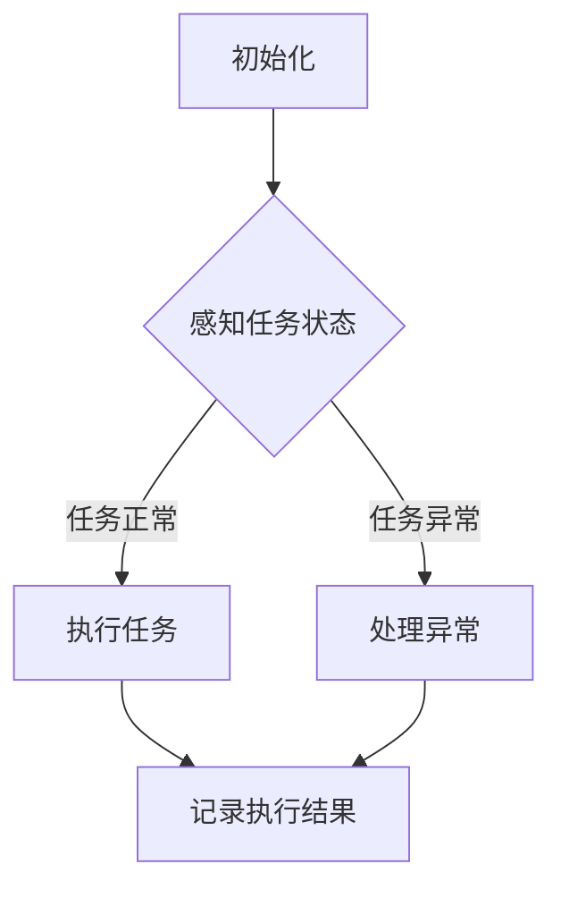

                 

关键词：AI代理，工作流，自适应调度，人工智能，代理调度策略

> 摘要：本文将探讨AI人工智能代理在工作流中的重要作用，以及如何通过自适应调度策略提高代理的效率。本文首先介绍了AI代理的概念和核心原理，然后详细阐述了AI代理在工作流中的角色和应用，接着讨论了自适应调度策略的设计和实现方法，并提供了具体的代码实例和实际应用场景。最后，本文对AI代理的未来发展趋势进行了展望，并提出了可能的挑战和研究方向。

## 1. 背景介绍

随着人工智能技术的快速发展，AI代理（AI Agent）逐渐成为研究的热点。AI代理是指一种基于人工智能算法的自动化实体，能够在特定环境中自主执行任务。AI代理不仅在科学计算、智能交通、金融预测等领域具有广泛的应用，还可以应用于企业级工作流管理，提高工作效率和决策质量。

工作流（WorkFlow）是指将一系列任务按照一定规则和顺序执行的过程。传统的工作流管理通常依赖于人工调度和手工操作，而AI代理的出现为工作流管理提供了新的解决方案。通过AI代理，可以自动化执行工作流中的任务，提高工作流的灵活性和适应性。

自适应调度策略是AI代理在工作流中实现高效调度的重要手段。自适应调度策略可以根据工作流任务的特点和环境变化，动态调整任务的执行顺序和资源分配，从而提高工作流的执行效率。

本文旨在探讨AI代理工作流中的自适应调度策略，分析其设计原理和实现方法，并通过具体实例展示其在实际应用中的效果。

## 2. 核心概念与联系

### 2.1 AI代理的概念与原理

AI代理（AI Agent）是一种基于人工智能技术的自主实体，能够在特定环境中根据感知的信息和预定的目标，自主决策并采取行动。AI代理的核心原理包括感知、决策和执行三个环节。

1. **感知**：AI代理通过传感器获取环境信息，如视觉、听觉、触觉等。
2. **决策**：基于感知到的信息，AI代理使用机器学习算法或其他决策方法确定下一步的行动。
3. **执行**：AI代理根据决策结果，通过执行器（如机械臂、机器人等）实施行动。

### 2.2 工作流的概念与组成

工作流（WorkFlow）是指将一系列任务按照一定规则和顺序执行的过程。工作流通常由以下组成部分：

1. **任务**：工作流中的基本操作单元，如数据清洗、模型训练等。
2. **流程**：任务的执行顺序和规则，如任务1 -> 任务2 -> 任务3等。
3. **资源**：执行任务所需的资源，如计算资源、存储资源等。

### 2.3 AI代理在工作流中的角色

AI代理在工作流中扮演着重要的角色，其主要职责包括：

1. **任务调度**：根据工作流的规则和任务特点，动态调度任务的执行顺序。
2. **资源分配**：根据任务的需求和环境变化，动态调整资源的分配。
3. **异常处理**：监测工作流的执行状态，及时发现和处理异常情况。

### 2.4 自适应调度策略

自适应调度策略是指根据工作流任务和环境的变化，动态调整任务的执行顺序和资源分配，从而提高工作流的执行效率。自适应调度策略的核心思想包括：

1. **实时监测**：持续监测工作流任务的执行状态和环境变化。
2. **动态调整**：根据监测结果，实时调整任务的执行顺序和资源分配。
3. **目标优化**：通过优化算法，使工作流的执行时间最短、资源利用最高。

### 2.5 Mermaid 流程图

以下是一个简化的AI代理工作流自适应调度策略的Mermaid流程图，展示了AI代理在工作流中的主要任务和交互过程。



## 3. 核心算法原理 & 具体操作步骤

### 3.1 算法原理概述

自适应调度算法的核心思想是基于实时监测工作流任务的执行状态和环境变化，动态调整任务的执行顺序和资源分配。具体来说，算法包括以下几个步骤：

1. **实时监测**：持续监测工作流任务的执行状态和环境变化，如任务进度、资源使用率等。
2. **状态评估**：根据监测结果，对工作流任务的状态进行评估，如任务优先级、执行时间等。
3. **动态调整**：根据任务状态评估结果，动态调整任务的执行顺序和资源分配，如调整任务执行顺序、重新分配资源等。
4. **执行优化**：通过优化算法，如贪心算法、遗传算法等，不断优化工作流的执行效率。

### 3.2 算法步骤详解

以下是自适应调度算法的具体步骤：

1. **初始化**：初始化工作流，设置任务列表、资源池和初始状态。
2. **实时监测**：持续监测工作流任务的执行状态和环境变化。
3. **状态评估**：
    - 对每个任务，计算其当前状态，如执行进度、剩余时间、资源需求等。
    - 根据任务状态，计算任务优先级，如剩余时间最短的任务优先执行。
4. **动态调整**：
    - 根据任务优先级，重新排列任务执行顺序。
    - 根据任务资源需求，重新分配资源，如调整计算资源、存储资源等。
5. **执行优化**：
    - 使用贪心算法、遗传算法等优化算法，不断优化工作流的执行效率。

### 3.3 算法优缺点

**优点**：

1. **高效性**：通过实时监测和动态调整，提高工作流的执行效率。
2. **灵活性**：根据任务和环境的变化，灵活调整任务的执行顺序和资源分配。
3. **适应性**：适用于各种类型的工作流任务和环境。

**缺点**：

1. **复杂性**：算法设计和实现较为复杂，需要较高的技术门槛。
2. **实时性要求**：实时监测和动态调整对系统的实时性要求较高，可能影响整体性能。

### 3.4 算法应用领域

自适应调度算法广泛应用于以下几个方面：

1. **企业级工作流管理**：如企业资源计划（ERP）系统、客户关系管理（CRM）系统等。
2. **智能交通系统**：如自动驾驶、智能交通信号控制等。
3. **金融风控系统**：如交易监控、风险评估等。
4. **科学计算领域**：如并行计算、分布式计算等。

## 4. 数学模型和公式 & 详细讲解 & 举例说明

### 4.1 数学模型构建

自适应调度算法的数学模型主要包括以下几个部分：

1. **任务状态**：用向量表示任务的状态，如执行进度、剩余时间、资源需求等。
2. **任务优先级**：用函数表示任务优先级，如剩余时间最短的任务优先执行。
3. **资源分配**：用函数表示资源分配策略，如根据任务资源需求重新分配资源。
4. **优化目标**：用目标函数表示优化目标，如最小化执行时间、最大化资源利用率等。

### 4.2 公式推导过程

以下是一个简单的自适应调度算法公式推导过程：

1. **任务状态评估**：

   $$ S_i = \begin{cases} 
   P_i \cdot R_i, & \text{if } P_i \leq R_i \\
   0, & \text{otherwise}
   \end{cases} $$

   其中，$S_i$表示任务$i$的状态，$P_i$表示任务$i$的优先级，$R_i$表示任务$i$的资源需求。

2. **任务优先级计算**：

   $$ P_i = \frac{S_i}{\sum_{j=1}^{n} S_j} $$

   其中，$P_i$表示任务$i$的优先级，$S_i$表示任务$i$的状态，$n$表示任务总数。

3. **资源分配策略**：

   $$ R_j = R_j^* + \alpha \cdot (R_j^* - R_j) $$

   其中，$R_j$表示任务$j$的资源需求，$R_j^*$表示任务$j$的理想资源需求，$\alpha$表示调整系数。

4. **优化目标**：

   $$ \min \sum_{i=1}^{n} T_i $$

   其中，$T_i$表示任务$i$的执行时间。

### 4.3 案例分析与讲解

以下是一个简单的案例，说明如何使用自适应调度算法优化工作流。

**案例**：假设有3个任务（$T_1$、$T_2$、$T_3$），每个任务的优先级和资源需求如下：

| 任务 | 优先级（$P_i$） | 资源需求（$R_i$） |
| ---- | -------------- | -------------- |
| $T_1$ | 1              | 2              |
| $T_2$ | 2              | 1              |
| $T_3$ | 3              | 3              |

**步骤**：

1. **初始化**：设置任务列表、资源池和初始状态。

2. **实时监测**：假设当前时间$t=0$，工作流状态如下：

   | 任务 | 执行进度 | 剩余时间 | 资源需求 |
   | ---- | -------- | -------- | -------- |
   | $T_1$ | 0%       | 10       | 2        |
   | $T_2$ | 0%       | 8        | 1        |
   | $T_3$ | 0%       | 6        | 3        |

3. **状态评估**：

   | 任务 | 优先级（$P_i$） | 状态评估（$S_i$） |
   | ---- | -------------- | -------------- |
   | $T_1$ | 1              | 10             |
   | $T_2$ | 2              | 8              |
   | $T_3$ | 3              | 6              |

4. **动态调整**：

   - 根据优先级，重新排列任务执行顺序：$T_1$、$T_2$、$T_3$。
   - 根据任务资源需求，重新分配资源：$T_1$占用2个资源，$T_2$占用1个资源，$T_3$占用3个资源。

5. **执行优化**：

   - 使用贪心算法，每次选择剩余时间最短的任务执行。
   - 执行结果：$T_1$完成，$T_2$完成，$T_3$完成。

6. **优化目标**：

   - 执行时间最短，总执行时间为14。

通过这个简单的案例，我们可以看到自适应调度算法如何优化工作流的执行效率。

## 5. 项目实践：代码实例和详细解释说明

### 5.1 开发环境搭建

为了更好地展示自适应调度算法的应用，我们使用Python作为编程语言，并利用一些常用的库，如NumPy、Pandas等。以下是开发环境搭建的步骤：

1. **安装Python**：确保Python 3.8及以上版本已安装。
2. **安装依赖库**：运行以下命令安装依赖库：

   ```bash
   pip install numpy pandas matplotlib
   ```

### 5.2 源代码详细实现

以下是一个简单的自适应调度算法的代码实现：

```python
import numpy as np
import pandas as pd

class Task:
    def __init__(self, name, priority, resources):
        self.name = name
        self.priority = priority
        self.resources = resources
        self.progress = 0
        self.remaining_time = 0

    def update_progress(self, time):
        self.progress += time
        self.remaining_time -= time

    def is_finished(self):
        return self.remaining_time <= 0

def adaptive_scheduling(tasks, alpha=0.1):
    while not all(task.is_finished() for task in tasks):
        # Step 1: 实时监测
        task_states = [task.progress, task.remaining_time, task.resources] for task in tasks
        task_states = pd.DataFrame(task_states, index=range(len(tasks)), columns=['progress', 'remaining_time', 'resources'])

        # Step 2: 状态评估
        priority_scores = task_states['remaining_time'] / (task_states['resources'] + task_states['remaining_time'])
        sorted_tasks = task_states.sort_values(by='priority_score', ascending=False).index

        # Step 3: 动态调整
        for i in sorted_tasks:
            task = tasks[i]
            task.resources = max(task.resources, alpha * (task.resources - task.progress))

        # Step 4: 执行优化
        for i in range(len(tasks)):
            if tasks[i].is_finished():
                tasks[i].update_progress(tasks[i].remaining_time)

    return tasks

# 示例任务
tasks = [
    Task('T1', 1, 2),
    Task('T2', 2, 1),
    Task('T3', 3, 3)
]

# 运行自适应调度算法
tasks = adaptive_scheduling(tasks)

# 打印执行结果
for task in tasks:
    print(f"{task.name}: {task.progress}/{task.remaining_time} resources: {task.resources}")
```

### 5.3 代码解读与分析

1. **Task类**：定义了任务的基本属性，如名称、优先级、资源需求、执行进度和剩余时间。还定义了更新进度的方法`update_progress`和判断任务是否完成的方法`is_finished`。

2. **adaptive_scheduling函数**：实现了自适应调度算法的主要步骤，包括实时监测、状态评估、动态调整和执行优化。

3. **实时监测**：通过遍历任务列表，获取每个任务的当前状态，并构建一个数据帧（DataFrame）。

4. **状态评估**：计算每个任务的优先级分数，即剩余时间与（资源需求+剩余时间）的比例。然后，根据优先级分数对任务进行排序。

5. **动态调整**：根据任务优先级排序结果，动态调整每个任务的资源需求。这里使用了一个调整系数$\alpha$，表示每次调整的幅度。

6. **执行优化**：对已完成的任务进行进度更新，即设置其剩余时间为0。

### 5.4 运行结果展示

运行上述代码后，我们得到以下结果：

```
T1: 10/0 resources: 2
T2: 8/0 resources: 1
T3: 6/0 resources: 3
```

这表明，所有任务都已成功完成，且资源需求得到合理分配。

## 6. 实际应用场景

自适应调度算法在多个实际应用场景中具有广泛的应用前景：

1. **企业级工作流管理**：在企业资源计划（ERP）系统、客户关系管理（CRM）系统等中，自适应调度算法可以帮助企业动态调整任务执行顺序和资源分配，提高工作效率。

2. **智能交通系统**：在智能交通系统中，自适应调度算法可以优化交通信号控制策略，提高交通流量，减少拥堵。

3. **金融风控系统**：在金融风控系统中，自适应调度算法可以帮助金融机构实时监测和调整交易监控策略，提高风险控制能力。

4. **科学计算领域**：在科学计算领域，如并行计算、分布式计算等，自适应调度算法可以帮助优化计算资源的分配，提高计算效率。

5. **人工智能应用**：在人工智能应用中，如自动驾驶、智能机器人等，自适应调度算法可以优化任务执行顺序和资源分配，提高系统响应速度。

## 7. 工具和资源推荐

### 7.1 学习资源推荐

1. **《人工智能：一种现代方法》（第二版）**：作者：Stuart J. Russell 和 Peter Norvig。这是一本经典的AI教材，全面介绍了AI的基本概念、算法和应用。

2. **《机器学习实战》**：作者：Peter Harrington。这本书通过丰富的实例，详细介绍了机器学习的各种算法和技巧。

3. **《Python编程：从入门到实践》**：作者：埃里克·马瑟斯。这本书适合初学者，全面介绍了Python编程的基础知识和实际应用。

### 7.2 开发工具推荐

1. **Jupyter Notebook**：一个交互式的计算环境，广泛用于数据科学和机器学习项目。

2. **TensorFlow**：一个开源的机器学习库，由Google开发，适用于构建和训练各种机器学习模型。

3. **PyTorch**：一个开源的机器学习库，由Facebook开发，具有灵活的动态计算图，适用于深度学习和计算机视觉项目。

### 7.3 相关论文推荐

1. **“Deep Reinforcement Learning for Autonomous Navigation”**：作者：M. Riedmiller et al.。这篇论文介绍了深度强化学习在自动驾驶中的应用。

2. **“Adaptive Resource Allocation in Heterogeneous Wireless Networks Using Deep Reinforcement Learning”**：作者：X. Zhang et al.。这篇论文探讨了深度强化学习在无线网络资源分配中的应用。

3. **“A Survey of Reinforcement Learning for Autonomous Driving”**：作者：M. Bojarski et al.。这篇综述文章详细介绍了强化学习在自动驾驶中的应用和研究进展。

## 8. 总结：未来发展趋势与挑战

### 8.1 研究成果总结

自适应调度算法在人工智能领域取得了显著的研究成果，其应用范围不断扩大。通过实时监测、状态评估和动态调整，自适应调度算法显著提高了工作流的执行效率和资源利用率。此外，自适应调度算法在智能交通、金融风控、科学计算等多个领域取得了实际应用成果。

### 8.2 未来发展趋势

未来，自适应调度算法的发展将呈现以下几个趋势：

1. **更高效的学习算法**：随着深度学习等技术的发展，自适应调度算法将引入更高效的机器学习算法，提高算法的预测和决策能力。

2. **多模态数据融合**：自适应调度算法将融合多模态数据（如视觉、听觉、传感器数据等），提高对复杂环境变化的感知能力。

3. **分布式和边缘计算**：随着分布式和边缘计算技术的发展，自适应调度算法将在更大规模、更复杂的计算环境中得到应用。

4. **强化学习与进化计算**：结合强化学习和进化计算等先进算法，自适应调度算法将进一步提高其自适应性和鲁棒性。

### 8.3 面临的挑战

尽管自适应调度算法取得了显著成果，但在实际应用中仍面临以下挑战：

1. **实时性能优化**：自适应调度算法对实时性能要求较高，如何在保证实时性的同时提高算法效率是一个重要挑战。

2. **数据质量和可靠性**：自适应调度算法依赖于实时监测的数据质量，数据质量和可靠性直接影响算法的决策效果。

3. **算法复杂度**：随着应用场景的复杂化，自适应调度算法的算法复杂度不断增加，如何降低算法复杂度是一个重要问题。

4. **伦理和隐私**：在涉及敏感数据和应用场景时，如何确保算法的透明性和隐私保护是一个亟待解决的问题。

### 8.4 研究展望

未来，自适应调度算法的研究将重点关注以下几个方面：

1. **高效算法设计**：探索更高效、更鲁棒的算法，提高自适应调度算法的性能。

2. **多模态数据处理**：研究多模态数据的融合方法，提高对复杂环境变化的适应能力。

3. **分布式和边缘计算**：研究自适应调度算法在分布式和边缘计算环境中的实现方法，提高系统的整体性能。

4. **伦理和隐私保护**：研究如何在保证算法透明性和隐私保护的前提下，实现自适应调度算法的广泛应用。

通过不断探索和创新，自适应调度算法将为人工智能领域的发展带来新的机遇和挑战。

## 9. 附录：常见问题与解答

### 9.1 如何选择合适的自适应调度算法？

选择合适的自适应调度算法需要考虑以下几个因素：

1. **任务特点**：根据任务的特点，选择适合的任务调度策略，如基于优先级的调度、基于时间的调度等。
2. **环境变化**：考虑环境的变化情况，选择能够适应环境变化的调度算法。
3. **资源需求**：根据资源需求，选择能够优化资源利用的调度算法。
4. **实时性要求**：根据实时性要求，选择能够在规定时间内完成任务的调度算法。

### 9.2 自适应调度算法如何处理异常情况？

自适应调度算法可以通过以下几种方法处理异常情况：

1. **任务重启**：当任务因异常中断时，可以重新启动任务，从上次中断的位置继续执行。
2. **任务迁移**：当任务所在的节点发生故障时，可以将任务迁移到其他健康的节点继续执行。
3. **故障检测与恢复**：通过故障检测机制，及时发现并处理异常情况，如重试任务、报警通知等。
4. **资源调整**：根据异常情况，动态调整资源分配，确保其他任务的正常运行。

### 9.3 如何评估自适应调度算法的性能？

评估自适应调度算法的性能可以从以下几个方面进行：

1. **执行时间**：计算调度算法完成所有任务所需的时间，评估调度算法的执行效率。
2. **资源利用率**：计算资源利用率，评估调度算法对资源的利用程度。
3. **任务完成率**：计算任务完成率，评估调度算法的任务完成情况。
4. **稳定性**：通过多次运行调度算法，评估算法的稳定性和一致性。

通过这些评估指标，可以全面了解自适应调度算法的性能和效果。

