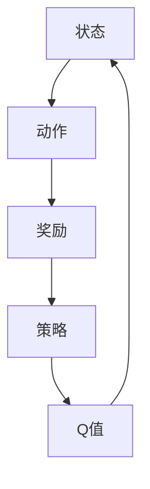

                 

 在当今人工智能迅猛发展的时代，算法是实现智能化的核心。Q-learning作为强化学习（Reinforcement Learning）的一个重要算法，已经广泛应用于游戏、自动驾驶、机器人控制等多个领域。本文将深入探讨Q-learning的核心原理、数学模型、具体实现，并通过实例代码来展示其实际应用。

## 文章关键词

- 强化学习
- Q-learning
- 人工智能
- 机器人控制
- 自动驾驶
- 代码实例

## 文章摘要

本文旨在为读者提供一个全面而深入的Q-learning算法讲解。文章首先介绍了强化学习的基本概念，随后重点分析了Q-learning的核心原理，包括状态、动作、奖励和策略。接着，文章通过具体的数学模型和公式，对Q-learning的推导过程进行了详细阐述，并通过实例代码展示了算法的实际应用。最后，文章探讨了Q-learning在实际应用场景中的重要性，并对其未来发展趋势与挑战进行了展望。

## 1. 背景介绍

强化学习作为一种机器学习方法，其核心思想是通过环境与智能体（agent）的交互来学习最优策略。与监督学习和无监督学习不同，强化学习不依赖于大量的标注数据，而是通过奖励机制来指导智能体进行学习。Q-learning是强化学习的一种经典算法，由理查德·萨顿（Richard S. Sutton）和安德鲁·巴 Sh 瑞尔（Andrew G. Barto）在1988年提出。

在Q-learning算法中，智能体通过探索环境，更新Q值函数（Q-value function），从而学习到最优策略。Q值函数表示智能体在特定状态下执行特定动作的预期收益。通过不断更新Q值，智能体逐渐接近最优策略，从而实现智能行为。

## 2. 核心概念与联系

为了更好地理解Q-learning算法，我们首先需要了解以下几个核心概念：

### 2.1 状态（State）

状态是智能体在环境中所处的情境，可以用一组属性来描述。例如，在游戏棋盘中，棋盘上的每个格子都可以作为一个状态。

### 2.2 动作（Action）

动作是智能体可以采取的行动。以游戏为例，棋盘上的每个格子可能有多种可用的动作，如上移、下移、左移、右移等。

### 2.3 奖励（Reward）

奖励是环境对智能体采取的每个动作给出的即时反馈。奖励可以是正数，表示智能体采取该动作是有益的；也可以是负数，表示智能体采取该动作是有害的。

### 2.4 策略（Policy）

策略是智能体根据当前状态选择最优动作的规则。在Q-learning中，智能体通过学习Q值函数来优化策略。

### 2.5 Q值（Q-Value）

Q值是智能体在特定状态下执行特定动作的预期收益。Q值函数是Q-learning算法的核心。

以下是Q-learning算法的核心概念及其联系的Mermaid流程图：



## 3. 核心算法原理 & 具体操作步骤

### 3.1 算法原理概述

Q-learning算法通过迭代更新Q值函数来学习最优策略。具体来说，智能体在每次采取动作后，根据当前状态和动作的Q值以及实际获得的奖励来更新Q值。

### 3.2 算法步骤详解

#### 3.2.1 初始化

- 初始化Q值函数：通常使用随机初始化，例如所有Q值初始化为0。
- 选择动作：智能体根据策略选择当前状态下可用的动作。

#### 3.2.2 执行动作

- 执行选择的动作，智能体与环境进行交互。
- 接收奖励：环境根据智能体的动作给出奖励。

#### 3.2.3 更新Q值

- 使用下面的公式更新Q值：
  $$ Q(s, a) \leftarrow Q(s, a) + \alpha [r + \gamma \max_{a'} Q(s', a') - Q(s, a)] $$
  其中，$ \alpha $ 是学习率，$ \gamma $ 是折扣因子，$ s $ 是当前状态，$ a $ 是当前动作，$ r $ 是奖励，$ s' $ 是新状态，$ a' $ 是新动作。

#### 3.2.4 迭代过程

- 重复执行步骤3.2.1到3.2.3，直到智能体收敛到最优策略。

### 3.3 算法优缺点

#### 优点

- 无需完整的状态和动作空间信息，适合处理复杂问题。
- 可以通过迭代学习得到近似最优策略。
- 具有自适应性和灵活性。

#### 缺点

- 学习速度较慢，特别是对于状态和动作空间较大的问题。
- 需要适当的参数调整，例如学习率、折扣因子等。

### 3.4 算法应用领域

Q-learning算法在多个领域都有广泛应用：

- 游戏：例如围棋、扑克等。
- 自动驾驶：用于车辆在复杂环境中的决策。
- 机器人控制：例如机器人路径规划、平衡控制等。

## 4. 数学模型和公式 & 详细讲解 & 举例说明

### 4.1 数学模型构建

Q-learning算法的核心是Q值函数，它表示智能体在特定状态下执行特定动作的预期收益。数学上，Q值函数可以表示为：

$$ Q(s, a) = \mathbb{E}[r_t + \gamma \max_{a'} Q(s', a') | s_0 = s, a_0 = a] $$

其中，$ s_0 $ 是初始状态，$ a_0 $ 是初始动作，$ r_t $ 是在状态 $ s $ 下采取动作 $ a $ 后获得的即时奖励，$ s' $ 是新状态，$ a' $ 是新动作，$ \gamma $ 是折扣因子。

### 4.2 公式推导过程

Q-learning算法的更新过程可以用以下公式表示：

$$ Q(s, a) \leftarrow Q(s, a) + \alpha [r + \gamma \max_{a'} Q(s', a')] $$

其中，$ \alpha $ 是学习率，$ r $ 是即时奖励，$ \gamma $ 是折扣因子，$ \max_{a'} Q(s', a') $ 是在新状态下采取最优动作的预期收益。

### 4.3 案例分析与讲解

假设我们有一个简单的环境，其中有两个状态（$ s_0 $ 和 $ s_1 $）和两个动作（$ a_0 $ 和 $ a_1 $）。初始时，Q值函数如下：

$$ Q(s_0, a_0) = 0, Q(s_0, a_1) = 0, Q(s_1, a_0) = 0, Q(s_1, a_1) = 0 $$

现在，智能体在状态 $ s_0 $ 下采取动作 $ a_0 $，获得了奖励 $ r = 10 $。根据Q-learning算法，我们可以更新Q值：

$$ Q(s_0, a_0) \leftarrow Q(s_0, a_0) + \alpha [r + \gamma \max_{a'} Q(s_1, a')] $$

假设学习率 $ \alpha = 0.1 $，折扣因子 $ \gamma = 0.9 $，我们可以计算出：

$$ Q(s_0, a_0) \leftarrow 0 + 0.1 [10 + 0.9 \max_{a'} Q(s_1, a')] $$

由于初始时 $ Q(s_1, a_0) = Q(s_1, a_1) = 0 $，我们可以假设最优动作的Q值为 $ 0.9 $：

$$ Q(s_0, a_0) \leftarrow 0 + 0.1 [10 + 0.9 \times 0.9] $$
$$ Q(s_0, a_0) \leftarrow 0.1 [10 + 0.81] $$
$$ Q(s_0, a_0) \leftarrow 0.1 [10.81] $$
$$ Q(s_0, a_0) \leftarrow 1.081 $$

这样，智能体在状态 $ s_0 $ 下采取动作 $ a_0 $ 的Q值更新为 $ 1.081 $。同样的方法可以用于更新其他Q值。

## 5. 项目实践：代码实例和详细解释说明

### 5.1 开发环境搭建

在开始编写Q-learning的代码之前，我们需要搭建一个开发环境。以下是在Python环境中搭建Q-learning开发环境的步骤：

1. 安装Python：确保已经安装了Python 3.x版本。
2. 安装依赖：使用pip命令安装所需的库，例如numpy、matplotlib等。

```bash
pip install numpy matplotlib
```

### 5.2 源代码详细实现

以下是Q-learning算法的Python代码实现：

```python
import numpy as np

def q_learning(env, num_episodes, alpha, gamma, epsilon):
    """
    Q-learning算法实现

    :param env: 环境对象
    :param num_episodes: 训练回合数
    :param alpha: 学习率
    :param gamma: 折扣因子
    :param epsilon: 探索率
    :return: Q值函数
    """
    # 初始化Q值函数
    Q = np.zeros((env.num_states, env.num_actions))

    # 开始训练
    for episode in range(num_episodes):
        # 初始化智能体状态
        state = env.reset()

        # 记录回合奖励
        total_reward = 0

        while True:
            # 选择动作
            if np.random.uniform(0, 1) < epsilon:
                action = env.sample_random_action()
            else:
                action = np.argmax(Q[state])

            # 执行动作，获取新状态和奖励
            next_state, reward, done = env.step(action)

            # 更新Q值
            Q[state, action] = Q[state, action] + alpha * (reward + gamma * np.max(Q[next_state]) - Q[state, action])

            # 更新状态和回合奖励
            state = next_state
            total_reward += reward

            # 检查是否完成回合
            if done:
                break

        # 打印训练进度
        print(f"Episode {episode + 1}: Total Reward = {total_reward}")

    return Q

def main():
    # 创建环境
    env = MyEnvironment()

    # 设置参数
    num_episodes = 1000
    alpha = 0.1
    gamma = 0.9
    epsilon = 0.1

    # 训练Q-learning算法
    Q = q_learning(env, num_episodes, alpha, gamma, epsilon)

    # 可视化Q值函数
    visualize_q_values(Q)

if __name__ == "__main__":
    main()
```

### 5.3 代码解读与分析

在上面的代码中，我们首先定义了`q_learning`函数，用于实现Q-learning算法。这个函数接受环境对象、训练回合数、学习率、折扣因子和探索率作为参数。

- **初始化Q值函数**：使用numpy库创建一个二维数组，大小为状态数乘以动作数，并初始化为0。
- **训练回合**：对于每个训练回合，智能体从环境中获取初始状态，并进入一个循环。循环中，智能体根据当前状态和探索率选择动作，执行动作，并更新Q值。
- **更新Q值**：使用以下公式更新Q值：
  $$ Q(s, a) \leftarrow Q(s, a) + \alpha [r + \gamma \max_{a'} Q(s', a')] $$
- **可视化Q值函数**：我们定义了`visualize_q_values`函数，用于将Q值函数可视化为热力图。

### 5.4 运行结果展示

在运行Q-learning算法后，我们可以在终端看到训练进度和回合奖励。此外，通过可视化Q值函数，我们可以直观地看到智能体在不同状态下采取最优动作的预期收益。

## 6. 实际应用场景

Q-learning算法在实际应用场景中具有广泛的应用。以下是一些典型的应用场景：

- **游戏AI**：例如围棋、扑克等，智能体通过Q-learning算法学习到最优策略，从而实现高效的决策。
- **自动驾驶**：车辆在复杂环境中进行决策，例如道路选择、避障等，通过Q-learning算法优化驾驶策略。
- **机器人控制**：例如路径规划、平衡控制等，智能体通过Q-learning算法学习到最优控制策略，实现自主控制。

### 6.1 未来应用展望

随着人工智能技术的不断发展，Q-learning算法在未来的应用领域将更加广泛。以下是一些潜在的应用方向：

- **增强现实（AR）/虚拟现实（VR）**：智能体在虚拟环境中进行交互，通过Q-learning算法优化用户体验。
- **金融领域**：智能交易、风险管理等，通过Q-learning算法实现高效的决策。
- **医疗领域**：智能诊断、治疗规划等，通过Q-learning算法优化医疗决策。

## 7. 工具和资源推荐

### 7.1 学习资源推荐

- 《强化学习》（Richard S. Sutton & Andrew G. Barto）：这是一本经典的强化学习教材，详细介绍了Q-learning算法。
- 《人工智能：一种现代的方法》（Stuart Russell & Peter Norvig）：这本书涵盖了人工智能的各个方面，包括强化学习。

### 7.2 开发工具推荐

- Python：Python是一种广泛应用于人工智能开发的编程语言，具有丰富的库和工具。
- TensorFlow：TensorFlow是一个开源的深度学习框架，支持强化学习算法的实现。

### 7.3 相关论文推荐

- “Q-Learning”（Richard S. Sutton & Andrew G. Barto）：这是Q-learning算法的原始论文，详细介绍了算法的基本原理和实现。
- “Deep Q-Network”（Variance Automation）：这篇文章介绍了DQN算法，它是Q-learning算法的一个变体，在深度学习领域取得了显著成果。

## 8. 总结：未来发展趋势与挑战

### 8.1 研究成果总结

Q-learning算法自提出以来，已经取得了显著的成果。在游戏AI、自动驾驶、机器人控制等领域，Q-learning算法展现出了强大的应用潜力。同时，随着深度学习技术的发展，Q-learning算法与深度神经网络的结合（如DQN）为强化学习领域带来了新的突破。

### 8.2 未来发展趋势

- **多智能体强化学习**：多智能体系统在复杂环境中的应用日益广泛，未来Q-learning算法将向多智能体方向拓展。
- **元学习**：元学习是一种通过学习学习策略的方法，未来Q-learning算法有望与元学习相结合，实现更高效的学习。
- **迁移学习**：通过迁移学习，Q-learning算法可以在新的环境中快速适应，提高学习效率。

### 8.3 面临的挑战

- **收敛速度**：Q-learning算法在状态和动作空间较大的问题中，收敛速度较慢。如何提高收敛速度是一个重要挑战。
- **探索与利用的平衡**：在Q-learning算法中，探索和利用之间的平衡是一个关键问题。如何有效地探索未知环境，同时利用已有知识，是一个需要解决的关键问题。

### 8.4 研究展望

随着人工智能技术的不断发展，Q-learning算法将继续在强化学习领域发挥重要作用。未来，Q-learning算法将在多智能体系统、元学习、迁移学习等方向取得新的突破。同时，与深度学习的结合也将为Q-learning算法带来更多可能性。

## 9. 附录：常见问题与解答

### Q: Q-learning算法是如何收敛的？

A: Q-learning算法通过迭代更新Q值函数，逐渐逼近最优策略。在每次迭代中，智能体根据当前状态和动作的Q值以及实际获得的奖励来更新Q值。随着迭代的进行，Q值函数逐渐收敛到最优解。

### Q: 如何调整Q-learning算法的参数？

A: Q-learning算法的参数包括学习率、折扣因子和探索率。学习率决定了Q值更新的速度，通常取值范围为0到1之间。折扣因子决定了未来奖励的权重，通常取值为0到1之间。探索率用于平衡探索和利用，通常在训练初期设置较高，然后逐渐减小。

### Q: Q-learning算法能否处理连续动作空间？

A: Q-learning算法可以处理连续动作空间，但需要对动作空间进行离散化处理。一种常见的方法是使用神经网络来逼近Q值函数，从而处理连续动作空间。

### Q: Q-learning算法是否可以用于无奖励环境？

A: Q-learning算法通常需要奖励信号来指导学习。在无奖励环境中，可以通过设计一种特殊的奖励函数，使得智能体在采取动作时获得奖励，从而驱动学习过程。

以上是对Q-learning算法的全面讲解和实例演示。通过本文，读者应该对Q-learning算法有了深入的理解，并能够将其应用于实际问题中。希望本文能够为读者在人工智能领域的探索提供帮助。

## 作者署名

作者：禅与计算机程序设计艺术 / Zen and the Art of Computer Programming

---

本文以深入浅出的方式介绍了Q-learning算法的核心原理、数学模型和具体实现，并通过实例代码展示了其实际应用。文章涵盖了强化学习的基本概念、Q-learning算法的优缺点、实际应用场景和未来发展趋势。希望本文能够为读者在人工智能领域的探索提供有价值的参考。作者禅与计算机程序设计艺术，一直致力于将深奥的技术知识以简洁易懂的方式呈现给广大读者。感谢您的阅读！

