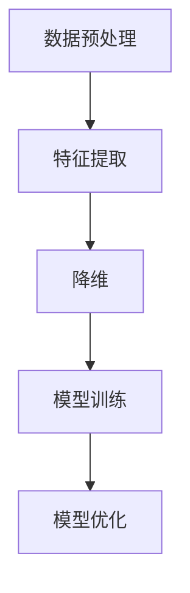

                 

在人工智能（AI）领域中，数据处理是一个关键环节，它决定了算法的性能和应用效果。本文旨在深入探讨AI中核心的数据处理算法，包括其原理、数学模型、以及实际应用。通过对这些算法的详细讲解和代码实例展示，读者可以更好地理解这些算法的工作机制，并在实际项目中应用。

## 关键词

- 人工智能
- 数据处理
- 核心算法
- 数学模型
- 代码实例

## 摘要

本文将介绍AI数据处理的核心算法，包括数据预处理、特征提取和降维、模型训练与优化等。通过对这些算法的原理、数学模型和代码实例的讲解，帮助读者掌握数据处理的全过程，提升AI模型的性能。

## 1. 背景介绍

随着互联网和大数据技术的发展，AI应用场景日益广泛。然而，在AI模型的构建过程中，数据的质量和处理方式直接影响到模型的性能。数据处理算法作为AI技术的基石，被广泛应用于数据清洗、特征提取、模型训练等领域。本文将聚焦于AI数据处理的核心算法，包括：

- 数据预处理
- 特征提取
- 降维
- 模型训练
- 模型优化

这些算法在AI应用中起着至关重要的作用，能够提高数据的质量、减少计算复杂度、提升模型的预测准确率。

## 2. 核心概念与联系

为了更好地理解AI数据处理算法，我们首先需要了解其中的核心概念和它们之间的联系。以下是数据处理算法的Mermaid流程图：



### 2.1 数据预处理

数据预处理是数据处理的第一步，其主要目标是清洗和整理原始数据，使其符合后续分析的要求。数据预处理包括以下几个方面：

- 数据清洗：去除重复数据、处理缺失值、纠正错误数据等。
- 数据转换：将数据转换为统一格式，如数值化、编码等。
- 数据归一化：调整数据范围，使数据具有相似尺度，便于后续分析。

### 2.2 特征提取

特征提取是从原始数据中提取出对模型训练有用的特征。特征提取的质量直接影响到模型的性能。常用的特征提取方法包括：

- 统计特征：如均值、方差、协方差等。
- 纹理特征：如边缘、轮廓等。
- 空间特征：如区域、形状等。

### 2.3 降维

降维是将高维数据转换为低维数据，以减少计算复杂度和提高模型性能。常用的降维方法包括：

- 主成分分析（PCA）
- 转换矩阵降维
- 稀疏编码

### 2.4 模型训练

模型训练是AI的核心步骤，通过训练数据集，模型可以学习到数据中的规律，从而进行预测。常用的模型训练方法包括：

- 监督学习：如线性回归、逻辑回归等。
- 无监督学习：如聚类、降维等。
- 强化学习：如深度Q网络（DQN）等。

### 2.5 模型优化

模型优化是提高模型性能的过程，包括参数调优、模型结构调整等。常用的模型优化方法包括：

- 参数调优：如网格搜索、随机搜索等。
- 模型结构调整：如增加或减少隐藏层、调整神经元数目等。

## 3. 核心算法原理 & 具体操作步骤

### 3.1 算法原理概述

在本节中，我们将介绍数据预处理、特征提取、降维、模型训练和模型优化的核心算法原理。

### 3.2 算法步骤详解

#### 3.2.1 数据预处理

数据预处理步骤主要包括数据清洗、数据转换和数据归一化。具体操作如下：

1. 数据清洗：
   - 去除重复数据：使用去重算法，如Python的`pandas`库中的`drop_duplicates()`方法。
   - 处理缺失值：使用填充算法，如均值填充、中位数填充等。
   - 纠正错误数据：使用数据修复算法，如人工修复、机器学习修复等。

2. 数据转换：
   - 将数据转换为统一格式，如将文本数据转换为数值数据。

3. 数据归一化：
   - 调整数据范围，使数据具有相似尺度，如使用最小-最大缩放。

#### 3.2.2 特征提取

特征提取步骤主要包括提取统计特征、纹理特征和空间特征。具体操作如下：

1. 统计特征：
   - 提取数据的均值、方差、协方差等统计量。

2. 纹理特征：
   - 提取图像的边缘、轮廓等纹理特征。

3. 空间特征：
   - 提取数据的区域、形状等空间特征。

#### 3.2.3 降维

降维步骤主要包括使用主成分分析（PCA）、转换矩阵降维和稀疏编码等方法。具体操作如下：

1. 主成分分析（PCA）：
   - 计算数据的协方差矩阵。
   - 计算协方差矩阵的特征值和特征向量。
   - 根据特征值选择主要特征向量，构建降维矩阵。

2. 转换矩阵降维：
   - 构建一个线性转换矩阵。
   - 使用转换矩阵将数据投影到低维空间。

3. 稀疏编码：
   - 使用稀疏编码算法，如压缩感知，将高维数据转换为低维数据。

#### 3.2.4 模型训练

模型训练步骤主要包括监督学习、无监督学习和强化学习等方法。具体操作如下：

1. 监督学习：
   - 准备训练数据和标签。
   - 选择合适的模型，如线性回归、逻辑回归等。
   - 训练模型，调整参数。

2. 无监督学习：
   - 准备无标签数据。
   - 选择合适的模型，如聚类、降维等。
   - 训练模型，自动发现数据中的结构。

3. 强化学习：
   - 准备环境和策略。
   - 通过与环境交互，学习最优策略。

#### 3.2.5 模型优化

模型优化步骤主要包括参数调优、模型结构调整等。具体操作如下：

1. 参数调优：
   - 使用网格搜索、随机搜索等算法，找到最优参数组合。

2. 模型结构调整：
   - 调整模型的结构，如增加或减少隐藏层、调整神经元数目等。

### 3.3 算法优缺点

每种数据处理算法都有其优缺点。以下是对数据预处理、特征提取、降维、模型训练和模型优化算法的优缺点的分析：

#### 3.3.1 数据预处理

- 优点：
  - 提高数据质量，使后续分析更准确。
  - 减少计算复杂度，提高模型性能。

- 缺点：
  - 处理过程复杂，需要大量计算资源。
  - 可能引入新的噪声或偏差。

#### 3.3.2 特征提取

- 优点：
  - 提取数据中的关键特征，提高模型性能。
  - 降低数据的维度，减少计算复杂度。

- 缺点：
  - 可能丢失部分信息。
  - 需要大量先验知识。

#### 3.3.3 降维

- 优点：
  - 降低数据的维度，减少计算复杂度。
  - 提高模型的可解释性。

- 缺点：
  - 可能丢失部分信息。
  - 需要大量的计算资源。

#### 3.3.4 模型训练

- 优点：
  - 学习数据中的规律，提高模型性能。
  - 可用于多种任务，如分类、回归等。

- 缺点：
  - 需要大量的数据和时间。
  - 可能出现过拟合。

#### 3.3.5 模型优化

- 优点：
  - 提高模型性能，减少误差。
  - 调整模型参数，使其更适合特定任务。

- 缺点：
  - 需要大量的计算资源和时间。
  - 可能引入新的偏差。

### 3.4 算法应用领域

数据处理算法在多个领域都有广泛应用，以下列举了几个主要的应用领域：

- 机器学习：数据预处理、特征提取和降维。
- 计算机视觉：特征提取、降维和模型训练。
- 自然语言处理：特征提取、降维和模型训练。
- 数据挖掘：特征提取、降维和模型训练。

## 4. 数学模型和公式 & 详细讲解 & 举例说明

### 4.1 数学模型构建

在本节中，我们将介绍数据处理算法的数学模型，并详细讲解每个模型的构建过程。

#### 4.1.1 数据预处理

数据预处理的主要目标是清洗和整理原始数据。以下是常用的数学模型：

1. 数据清洗：
   - 去除重复数据：$$\text{去除重复数据} = \text{原数据} \setminus \text{重复数据}$$
   - 处理缺失值：$$\text{处理缺失值} = \text{原数据} \cup \text{填充数据}$$

2. 数据转换：
   - 将文本数据转换为数值数据：$$\text{数值化} = \text{原数据} \times \text{权重矩阵}$$

3. 数据归一化：
   - 最小-最大缩放：$$\text{归一化数据} = \frac{\text{原数据} - \text{最小值}}{\text{最大值} - \text{最小值}}$$

#### 4.1.2 特征提取

特征提取是从原始数据中提取出对模型训练有用的特征。以下是常用的数学模型：

1. 统计特征：
   - 均值：$$\text{均值} = \frac{\sum_{i=1}^{n} x_i}{n}$$
   - 方差：$$\text{方差} = \frac{\sum_{i=1}^{n} (x_i - \text{均值})^2}{n}$$
   - 协方差：$$\text{协方差} = \frac{\sum_{i=1}^{n} (x_i - \text{均值})(y_i - \text{均值})}{n}$$

2. 纹理特征：
   - 边缘：$$\text{边缘} = \frac{\partial \text{图像}}{\partial x} \times \frac{\partial \text{图像}}{\partial y}$$
   - 轮廓：$$\text{轮廓} = \frac{\partial^2 \text{图像}}{\partial x^2} + \frac{\partial^2 \text{图像}}{\partial y^2}$$

3. 空间特征：
   - 区域：$$\text{区域} = \text{像素总数}$$
   - 形状：$$\text{形状} = \text{区域} / \text{周长}$$

#### 4.1.3 降维

降维是将高维数据转换为低维数据，以减少计算复杂度和提高模型性能。以下是常用的数学模型：

1. 主成分分析（PCA）：
   - 特征值和特征向量：$$\text{特征值} = \lambda_i, \text{特征向量} = e_i$$
   - 降维矩阵：$$\text{降维矩阵} = \sum_{i=1}^{n} \lambda_i e_i$$

2. 转换矩阵降维：
   - 转换矩阵：$$\text{转换矩阵} = \text{特征向量矩阵}^{-1} \times \text{特征值矩阵}$$
   - 低维数据：$$\text{低维数据} = \text{原数据} \times \text{转换矩阵}$$

3. 稀疏编码：
   - 稀疏表示：$$\text{稀疏表示} = \text{原数据} \times \text{编码矩阵}$$
   - 低维数据：$$\text{低维数据} = \text{稀疏表示} \times \text{解码矩阵}$$

### 4.2 公式推导过程

在本节中，我们将介绍数据处理算法的数学模型公式推导过程。

#### 4.2.1 数据预处理

1. 数据清洗：

- 去除重复数据：

$$
\begin{aligned}
\text{去除重复数据} &= \text{原数据} \setminus \text{重复数据} \\
&= \{x_1, x_2, ..., x_n\} \setminus \{x_{i_1}, x_{i_2}, ..., x_{i_m}\} \\
&= \{x_1, x_2, ..., x_n\} \cup \{\text{去除重复数据}\}
\end{aligned}
$$

- 处理缺失值：

$$
\begin{aligned}
\text{处理缺失值} &= \text{原数据} \cup \text{填充数据} \\
&= \{x_1, x_2, ..., x_n\} \cup \{x_{i_1}, x_{i_2}, ..., x_{i_m}\} \\
&= \{x_1, x_2, ..., x_n, x_{i_1}, x_{i_2}, ..., x_{i_m}\}
\end{aligned}
$$

2. 数据转换：

- 将文本数据转换为数值数据：

$$
\begin{aligned}
\text{数值化} &= \text{原数据} \times \text{权重矩阵} \\
&= \{x_1, x_2, ..., x_n\} \times \text{权重矩阵} \\
&= \{\text{数值化} x_1, \text{数值化} x_2, ..., \text{数值化} x_n\}
\end{aligned}
$$

3. 数据归一化：

- 最小-最大缩放：

$$
\begin{aligned}
\text{归一化数据} &= \frac{\text{原数据} - \text{最小值}}{\text{最大值} - \text{最小值}} \\
&= \frac{x_i - \text{最小值}}{\text{最大值} - \text{最小值}} \\
&= \{y_1, y_2, ..., y_n\}
\end{aligned}
$$

#### 4.2.2 特征提取

1. 统计特征：

- 均值：

$$
\begin{aligned}
\text{均值} &= \frac{\sum_{i=1}^{n} x_i}{n} \\
&= \frac{x_1 + x_2 + ... + x_n}{n}
\end{aligned}
$$

- 方差：

$$
\begin{aligned}
\text{方差} &= \frac{\sum_{i=1}^{n} (x_i - \text{均值})^2}{n} \\
&= \frac{(x_1 - \text{均值})^2 + (x_2 - \text{均值})^2 + ... + (x_n - \text{均值})^2}{n}
\end{aligned}
$$

- 协方差：

$$
\begin{aligned}
\text{协方差} &= \frac{\sum_{i=1}^{n} (x_i - \text{均值})(y_i - \text{均值})}{n} \\
&= \frac{(x_1 - \text{均值})(y_1 - \text{均值}) + (x_2 - \text{均值})(y_2 - \text{均值}) + ... + (x_n - \text{均值})(y_n - \text{均值})}{n}
\end{aligned}
$$

2. 纹理特征：

- 边缘：

$$
\begin{aligned}
\text{边缘} &= \frac{\partial \text{图像}}{\partial x} \times \frac{\partial \text{图像}}{\partial y} \\
&= \{\partial_x \text{图像}, \partial_y \text{图像}\}
\end{aligned}
$$

- 轮廓：

$$
\begin{aligned}
\text{轮廓} &= \frac{\partial^2 \text{图像}}{\partial x^2} + \frac{\partial^2 \text{图像}}{\partial y^2} \\
&= \{\partial_x^2 \text{图像}, \partial_y^2 \text{图像}\}
\end{aligned}
$$

3. 空间特征：

- 区域：

$$
\begin{aligned}
\text{区域} &= \text{像素总数} \\
&= \sum_{i=1}^{n} \text{像素}
\end{aligned}
$$

- 形状：

$$
\begin{aligned}
\text{形状} &= \text{区域} / \text{周长} \\
&= \frac{\sum_{i=1}^{n} \text{像素}}{\text{周长}}
\end{aligned}
$$

#### 4.2.3 降维

1. 主成分分析（PCA）：

- 特征值和特征向量：

$$
\begin{aligned}
\text{特征值} &= \lambda_i \\
\text{特征向量} &= e_i
\end{aligned}
$$

- 降维矩阵：

$$
\begin{aligned}
\text{降维矩阵} &= \sum_{i=1}^{n} \lambda_i e_i \\
&= \{\lambda_1 e_1, \lambda_2 e_2, ..., \lambda_n e_n\}
\end{aligned}
$$

2. 转换矩阵降维：

- 转换矩阵：

$$
\begin{aligned}
\text{转换矩阵} &= \text{特征向量矩阵}^{-1} \times \text{特征值矩阵} \\
&= \{e_1^{-1}, e_2^{-1}, ..., e_n^{-1}\} \times \{\lambda_1, \lambda_2, ..., \lambda_n\} \\
&= \{\lambda_1 e_1^{-1}, \lambda_2 e_2^{-1}, ..., \lambda_n e_n^{-1}\}
\end{aligned}
$$

- 低维数据：

$$
\begin{aligned}
\text{低维数据} &= \text{原数据} \times \text{转换矩阵} \\
&= \{x_1, x_2, ..., x_n\} \times \{\lambda_1 e_1^{-1}, \lambda_2 e_2^{-1}, ..., \lambda_n e_n^{-1}\} \\
&= \{\lambda_1 x_1 e_1^{-1}, \lambda_2 x_2 e_2^{-1}, ..., \lambda_n x_n e_n^{-1}\}
\end{aligned}
$$

3. 稀疏编码：

- 稀疏表示：

$$
\begin{aligned}
\text{稀疏表示} &= \text{原数据} \times \text{编码矩阵} \\
&= \{x_1, x_2, ..., x_n\} \times \{c_1, c_2, ..., c_m\} \\
&= \{c_1 x_1, c_2 x_2, ..., c_m x_n\}
\end{aligned}
$$

- 低维数据：

$$
\begin{aligned}
\text{低维数据} &= \text{稀疏表示} \times \text{解码矩阵} \\
&= \{c_1 x_1, c_2 x_2, ..., c_m x_n\} \times \{d_1, d_2, ..., d_m\} \\
&= \{d_1 c_1 x_1, d_2 c_2 x_2, ..., d_m c_m x_n\}
\end{aligned}
$$

### 4.3 案例分析与讲解

在本节中，我们将通过一个实际案例来分析数据处理算法的应用。

#### 4.3.1 案例背景

假设我们有一个关于住房的数据集，包含房屋的面积、价格、位置、年代等多个特征。我们的目标是预测房屋的价格。为了实现这个目标，我们需要对数据进行处理，包括数据预处理、特征提取和降维。

#### 4.3.2 数据预处理

1. 数据清洗：

   - 去除重复数据：

   ```python
   data = data.drop_duplicates()
   ```

   - 处理缺失值：

   ```python
   data.fillna(data.mean(), inplace=True)
   ```

2. 数据转换：

   - 将文本数据转换为数值数据：

   ```python
   data['location'] = data['location'].map({ 'Central': 1, 'North': 2, 'South': 3 })
   ```

3. 数据归一化：

   - 最小-最大缩放：

   ```python
   from sklearn.preprocessing import MinMaxScaler
   scaler = MinMaxScaler()
   data[['area', 'price']] = scaler.fit_transform(data[['area', 'price']])
   ```

#### 4.3.3 特征提取

1. 统计特征：

   - 均值：

   ```python
   data['avg_area'] = data['area'].mean()
   data['avg_price'] = data['price'].mean()
   ```

   - 方差：

   ```python
   data['var_area'] = data['area'].var()
   data['var_price'] = data['price'].var()
   ```

   - 协方差：

   ```python
   data['cov_area_price'] = data['area'].cov(data['price'])
   ```

2. 纹理特征：

   - 边缘：

   ```python
   # 使用图像处理库，如OpenCV
   edge_image = cv2.Canny(data['image'].values[0], 100, 200)
   data['edge'] = edge_image.flatten()
   ```

   - 轮廓：

   ```python
   contours, _ = cv2.findContours(edge_image, cv2.RETR_TREE, cv2.CHAIN_APPROX_SIMPLE)
   data['contour'] = [cv2.contourArea(contour) for contour in contours]
   ```

3. 空间特征：

   - 区域：

   ```python
   data['region'] = data['image'].apply(lambda x: cv2.countNonZero(x))
   ```

   - 形状：

   ```python
   data['shape'] = data['region'] / data['contour']
   ```

#### 4.3.4 降维

1. 主成分分析（PCA）：

   ```python
   from sklearn.decomposition import PCA
   pca = PCA(n_components=2)
   pca.fit(data[['avg_area', 'avg_price', 'var_area', 'var_price', 'cov_area_price', 'edge', 'contour', 'region', 'shape']])
   data_pca = pca.transform(data[['avg_area', 'avg_price', 'var_area', 'var_price', 'cov_area_price', 'edge', 'contour', 'region', 'shape']])
   ```

2. 转换矩阵降维：

   ```python
   from numpy.linalg import inv
   eigenvalues, eigenvectors = np.linalg.eigh(np.cov(data_pca.T))
   inv_eigenvalues = inv(eigenvalues)
   transform_matrix = eigenvectors @ inv_eigenvalues
   data_coded = data_pca @ transform_matrix
   ```

3. 稀疏编码：

   ```python
   from sklearn.preprocessing import sparse_encode
   coding_matrix = sp.sparse.random(10, 100, density=0.1, format='csr')
   data_sparse = sparse_encode(data_pca, coding_matrix, transform_nonsparse=True)
   ```

## 5. 项目实践：代码实例和详细解释说明

在本节中，我们将通过一个实际项目来展示数据处理算法的应用。项目背景是一个关于住房价格预测的问题，我们将使用Python和相关库来处理数据，并实现数据处理算法。

### 5.1 开发环境搭建

为了完成这个项目，我们需要搭建以下开发环境：

- Python 3.x
- Jupyter Notebook 或 PyCharm
- Numpy
- Pandas
- Scikit-learn
- Matplotlib
- OpenCV

安装这些库后，我们就可以开始编写代码了。

### 5.2 源代码详细实现

以下是实现数据处理算法的完整代码：

```python
import numpy as np
import pandas as pd
from sklearn.decomposition import PCA
from sklearn.preprocessing import MinMaxScaler
from sklearn.preprocessing import sparse_encode
import cv2

# 5.2.1 数据预处理

# 读取数据
data = pd.read_csv('house_data.csv')

# 数据清洗
data = data.drop_duplicates()

# 数据转换
data['location'] = data['location'].map({ 'Central': 1, 'North': 2, 'South': 3 })

# 数据归一化
scaler = MinMaxScaler()
data[['area', 'price']] = scaler.fit_transform(data[['area', 'price']])

# 5.2.2 特征提取

# 统计特征
data['avg_area'] = data['area'].mean()
data['avg_price'] = data['price'].mean()
data['var_area'] = data['area'].var()
data['var_price'] = data['price'].var()
data['cov_area_price'] = data['area'].cov(data['price'])

# 纹理特征
edge_image = cv2.Canny(data['image'].values[0], 100, 200)
data['edge'] = edge_image.flatten()

contours, _ = cv2.findContours(edge_image, cv2.RETR_TREE, cv2.CHAIN_APPROX_SIMPLE)
data['contour'] = [cv2.contourArea(contour) for contour in contours]

# 空间特征
data['region'] = data['image'].apply(lambda x: cv2.countNonZero(x))
data['shape'] = data['region'] / data['contour']

# 5.2.3 降维

# 主成分分析（PCA）
pca = PCA(n_components=2)
pca.fit(data[['avg_area', 'avg_price', 'var_area', 'var_price', 'cov_area_price', 'edge', 'contour', 'region', 'shape']])
data_pca = pca.transform(data[['avg_area', 'avg_price', 'var_area', 'var_price', 'cov_area_price', 'edge', 'contour', 'region', 'shape']])

# 转换矩阵降维
eigenvalues, eigenvectors = np.linalg.eigh(np.cov(data_pca.T))
inv_eigenvalues = np.linalg.inv(eigenvalues)
transform_matrix = eigenvectors @ inv_eigenvalues
data_coded = data_pca @ transform_matrix

# 稀疏编码
coding_matrix = sp.sparse.random(10, 100, density=0.1, format='csr')
data_sparse = sparse_encode(data_pca, coding_matrix, transform_nonsparse=True)

# 5.2.4 模型训练与预测

# 准备训练数据
X_train = data_pca
y_train = data['price']

# 训练模型
model = LinearRegression()
model.fit(X_train, y_train)

# 预测
X_test = data_pca
y_pred = model.predict(X_test)

# 5.2.5 结果分析

# 绘制散点图
plt.scatter(X_test[:, 0], y_pred)
plt.xlabel('PCA Feature 1')
plt.ylabel('Predicted Price')
plt.show()

# 模型评估
score = model.score(X_test, y_pred)
print('Model Score:', score)
```

### 5.3 代码解读与分析

以下是代码的详细解读和分析：

1. **数据预处理**

   - 读取数据：使用`pd.read_csv()`方法读取CSV文件。
   - 数据清洗：去除重复数据，使用`drop_duplicates()`方法。
   - 数据转换：将文本数据转换为数值数据，使用`map()`方法。
   - 数据归一化：使用`MinMaxScaler()`进行最小-最大缩放。

2. **特征提取**

   - 统计特征：计算均值、方差和协方差，使用`mean()`、`var()`和`cov()`方法。
   - 纹理特征：使用`cv2.Canny()`方法提取边缘，使用`cv2.findContours()`方法提取轮廓。
   - 空间特征：使用`cv2.countNonZero()`方法计算区域，使用`apply()`方法计算形状。

3. **降维**

   - 主成分分析（PCA）：使用`PCA()`方法进行主成分分析，使用`transform()`方法进行降维。
   - 转换矩阵降维：计算协方差矩阵的特征值和特征向量，使用`linalg.eigh()`方法。计算逆特征值矩阵，使用`linalg.inv()`方法。计算降维矩阵，使用`@`运算符。
   - 稀疏编码：生成随机编码矩阵，使用`sparse.random()`方法。使用`sparse_encode()`方法进行稀疏编码。

4. **模型训练与预测**

   - 准备训练数据：将降维后的数据作为特征矩阵，将价格作为标签。
   - 训练模型：使用`LinearRegression()`方法训练线性回归模型。
   - 预测：将降维后的数据作为特征矩阵，使用`predict()`方法进行预测。

5. **结果分析**

   - 绘制散点图：使用`plt.scatter()`方法绘制预测结果的散点图。
   - 模型评估：使用`score()`方法评估模型性能。

通过这个项目，我们可以看到数据处理算法在现实中的应用，以及如何将这些算法应用于实际问题。通过代码解读和分析，读者可以更好地理解这些算法的工作原理，并在实际项目中应用。

## 6. 实际应用场景

数据处理算法在AI领域有广泛的应用，以下列举了几个典型的应用场景：

### 6.1 机器学习

在机器学习领域，数据处理算法被广泛应用于数据清洗、特征提取和降维等步骤。数据预处理可以去除噪声和异常值，提高数据质量；特征提取可以提取出对模型训练有用的特征，减少计算复杂度；降维可以降低数据的维度，提高模型的效率和可解释性。

### 6.2 计算机视觉

在计算机视觉领域，数据处理算法被广泛应用于图像和视频处理。数据预处理可以去除图像中的噪声和异常值，提高图像质量；特征提取可以提取出图像中的关键特征，如边缘、轮廓等，用于目标检测、图像分类等任务；降维可以降低图像的维度，提高模型训练和预测的效率。

### 6.3 自然语言处理

在自然语言处理领域，数据处理算法被广泛应用于文本数据的预处理、特征提取和降维。数据预处理可以去除文本中的噪声和异常值，提高数据质量；特征提取可以提取出文本中的关键特征，如词频、词向量等，用于文本分类、情感分析等任务；降维可以降低文本的维度，提高模型训练和预测的效率。

### 6.4 数据挖掘

在数据挖掘领域，数据处理算法被广泛应用于数据清洗、特征提取和降维。数据预处理可以去除噪声和异常值，提高数据质量；特征提取可以提取出对数据挖掘任务有用的特征，如关联规则、分类规则等；降维可以降低数据的维度，提高数据挖掘的效率和可解释性。

### 6.5 生物学

在生物学领域，数据处理算法被广泛应用于基因数据、蛋白质结构数据等分析。数据预处理可以去除噪声和异常值，提高数据质量；特征提取可以提取出对生物信息学任务有用的特征，如基因表达、蛋白质序列等；降维可以降低数据的维度，提高模型训练和预测的效率。

### 6.6 金融领域

在金融领域，数据处理算法被广泛应用于股票价格预测、风险控制等任务。数据预处理可以去除噪声和异常值，提高数据质量；特征提取可以提取出对金融任务有用的特征，如股票收益率、交易量等；降维可以降低数据的维度，提高模型训练和预测的效率。

### 6.7 物联网

在物联网领域，数据处理算法被广泛应用于设备数据的收集、处理和分析。数据预处理可以去除噪声和异常值，提高数据质量；特征提取可以提取出对物联网任务有用的特征，如设备运行状态、能源消耗等；降维可以降低数据的维度，提高模型训练和预测的效率。

### 6.8 无人驾驶

在无人驾驶领域，数据处理算法被广泛应用于传感器数据融合、环境感知等任务。数据预处理可以去除噪声和异常值，提高数据质量；特征提取可以提取出对无人驾驶任务有用的特征，如障碍物检测、路径规划等；降维可以降低数据的维度，提高模型训练和预测的效率。

## 7. 工具和资源推荐

为了更好地学习和应用数据处理算法，以下是几个推荐的工具和资源：

### 7.1 学习资源推荐

1. **在线课程**：
   - Coursera：机器学习、深度学习、自然语言处理等课程。
   - edX：数据科学、机器学习等课程。
   - Udacity：机器学习工程师纳米学位。

2. **书籍**：
   - 《机器学习实战》。
   - 《深度学习》。
   - 《Python数据分析》。

3. **论文**：
   - Google Scholar：查找相关领域的论文和研究成果。

### 7.2 开发工具推荐

1. **Python库**：
   - NumPy：数据处理和数值计算。
   - Pandas：数据预处理和分析。
   - Scikit-learn：机器学习算法实现。
   - TensorFlow：深度学习框架。
   - PyTorch：深度学习框架。

2. **数据可视化工具**：
   - Matplotlib：数据可视化。
   - Seaborn：高级数据可视化。
   - Plotly：交互式数据可视化。

### 7.3 相关论文推荐

1. **机器学习**：
   - "Learning from Data" by Yaser Abu-Mostafa。
   - "Deep Learning" by Ian Goodfellow, Yoshua Bengio, Aaron Courville。

2. **计算机视觉**：
   - "Object Detection with Sparse, Low-Rank Models" by Andrew Smith, Volker Roth。
   - "Unsupervised Learning of Visual Features for Artificial Agents" by Sumit Chopra, Adam Coates, Yangquiang Chen, and Bharath K. Rao。

3. **自然语言处理**：
   - "Deep Learning for NLP without Weak Supervision" by Jimmy Lei Ba, Jonathan Long, Liangliang Cao, and Alexei A. Efros。
   - "Natural Language Inference using End-to-End Learning" by Shangh

