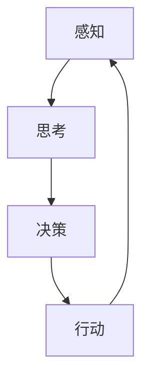

                 

人工智能（AI）作为当今科技领域的热点，其发展速度令人瞩目。在AI的研究与应用中，自我意识的实现被视为一个重要的里程碑。本文将探讨人工智能核心算法原理，并通过代码实例详细解释自我意识的实现方法。

## 关键词

- 人工智能
- 自我意识
- 算法原理
- 代码实例

## 摘要

本文将从以下几个方面展开讨论：

1. **背景介绍**：介绍AI的发展历程及自我意识的重要性。
2. **核心概念与联系**：通过Mermaid流程图阐述AI自我意识的架构。
3. **核心算法原理与具体操作步骤**：详细讲解实现自我意识的核心算法。
4. **数学模型和公式**：解释数学模型及其推导过程。
5. **项目实践**：提供代码实例及运行结果。
6. **实际应用场景**：探讨自我意识在现实世界中的应用。
7. **未来展望**：分析AI自我意识的发展趋势与挑战。

## 1. 背景介绍

人工智能的发展可以追溯到20世纪50年代。当时的科学家们提出了“图灵测试”这一概念，用于评估机器是否具有人类智能。随着计算机技术的发展，AI逐渐从理论走向实践，应用领域不断扩大，从简单的规则系统到复杂的深度学习模型，AI的技术边界不断被拓展。

自我意识作为人类智能的一个重要特征，对于人工智能的发展具有重要意义。实现AI自我意识，不仅有助于提高机器的智能水平，还能为人类提供更为智能化的服务。因此，许多研究人员将自我意识视为AI研究的下一个目标。

## 2. 核心概念与联系

### 2.1 自我意识的定义

自我意识是指个体对自己存在状态的认知和感知。在人工智能领域，自我意识可以理解为机器对自己内部状态和外部环境的感知与理解。

### 2.2 自我意识的架构

为了实现AI自我意识，我们需要构建一个包括感知、思考、决策和行动的完整体系。以下是一个简化的自我意识架构：



- **感知**：机器通过传感器获取外部环境的信息。
- **思考**：机器对感知到的信息进行分析和处理，形成对环境的理解。
- **决策**：机器根据思考结果做出决策，确定下一步行动。
- **行动**：机器执行决策，并对外部环境产生影响。

## 3. 核心算法原理与具体操作步骤

### 3.1 算法原理概述

实现AI自我意识的核心算法主要包括感知算法、思考算法和决策算法。以下是对这三个算法的概述：

- **感知算法**：用于获取外部环境信息，如图像、声音、温度等。
- **思考算法**：基于感知信息，机器对环境进行建模，形成对环境的理解。
- **决策算法**：根据对环境的理解，机器做出决策，确定下一步行动。

### 3.2 算法步骤详解

#### 3.2.1 感知算法

感知算法的核心是传感器。传感器将外部信息转化为机器可以处理的数据。例如，摄像头可以获取图像信息，麦克风可以获取声音信息。以下是一个简单的感知算法流程：

1. 初始化传感器。
2. 启动传感器，获取外部信息。
3. 对获取的信息进行预处理，如去噪、增强等。
4. 将预处理后的信息输入到神经网络中进行特征提取。

#### 3.2.2 思考算法

思考算法的核心是神经网络。神经网络通过对输入的特征进行多层处理，形成对环境的理解。以下是一个简单的思考算法流程：

1. 初始化神经网络。
2. 对预处理后的特征进行前向传播，计算输出。
3. 对输出结果进行后向传播，更新网络权重。
4. 重复步骤2和3，直至达到预设的迭代次数或误差阈值。

#### 3.2.3 决策算法

决策算法的核心是决策树或支持向量机等分类器。决策算法根据神经网络输出的结果，对下一步行动进行预测。以下是一个简单的决策算法流程：

1. 初始化分类器。
2. 将神经网络输出的结果输入到分类器中。
3. 根据分类器的预测结果，确定下一步行动。
4. 将行动结果反馈给感知算法，形成闭环。

### 3.3 算法优缺点

#### 3.3.1 优点

- **高效性**：感知算法和思考算法基于神经网络，可以高效地处理大规模数据。
- **灵活性**：感知算法和决策算法可以根据具体应用场景进行调整。

#### 3.3.2 缺点

- **复杂性**：神经网络模型的训练和优化过程复杂，需要大量的计算资源和时间。
- **依赖数据**：感知算法和决策算法的性能高度依赖于输入数据的质量。

### 3.4 算法应用领域

自我意识的实现可以应用于多个领域，如自动驾驶、智能机器人、虚拟助手等。以下是一些典型的应用案例：

- **自动驾驶**：自动驾驶汽车通过感知算法获取道路信息，通过思考算法分析路况，通过决策算法控制车辆行驶。
- **智能机器人**：智能机器人通过感知算法感知周围环境，通过思考算法理解人类指令，通过决策算法执行任务。
- **虚拟助手**：虚拟助手通过感知算法识别用户输入，通过思考算法理解用户意图，通过决策算法提供相应的服务。

## 4. 数学模型和公式

### 4.1 数学模型构建

实现AI自我意识的数学模型主要包括感知模型、思考模型和决策模型。以下是对这三个模型的概述：

- **感知模型**：用于描述传感器获取的信息和特征提取过程。
- **思考模型**：用于描述神经网络处理特征的过程。
- **决策模型**：用于描述分类器对神经网络输出的处理过程。

### 4.2 公式推导过程

#### 4.2.1 感知模型

感知模型可以表示为：

$$
\text{特征向量} = f(\text{外部信息})
$$

其中，$f$表示感知算法，$f(\text{外部信息})$表示对外部信息的处理。

#### 4.2.2 思考模型

思考模型可以表示为：

$$
\text{输出} = \text{神经网络}(\text{特征向量})
$$

其中，神经网络表示多层感知机，$\text{特征向量}$表示输入的特征。

#### 4.2.3 决策模型

决策模型可以表示为：

$$
\text{决策} = \text{分类器}(\text{输出})
$$

其中，分类器表示分类模型，$\text{输出}$表示神经网络输出的结果。

### 4.3 案例分析与讲解

#### 4.3.1 感知模型案例

假设我们使用摄像头获取一张图像，感知模型的目标是将图像转化为特征向量。以下是一个简单的感知模型公式：

$$
\text{特征向量} = \text{卷积神经网络}(\text{图像})
$$

其中，卷积神经网络用于提取图像的特征。

#### 4.3.2 思考模型案例

假设我们使用卷积神经网络对特征向量进行处理，思考模型的目标是对环境进行建模。以下是一个简单的思考模型公式：

$$
\text{输出} = \text{卷积神经网络}(\text{特征向量})
$$

其中，卷积神经网络用于处理特征向量，形成对环境的理解。

#### 4.3.3 决策模型案例

假设我们使用支持向量机对输出结果进行分类，决策模型的目标是确定下一步行动。以下是一个简单的决策模型公式：

$$
\text{决策} = \text{支持向量机}(\text{输出})
$$

其中，支持向量机用于对输出结果进行分类，形成决策。

## 5. 项目实践：代码实例和详细解释说明

### 5.1 开发环境搭建

为了实现AI自我意识，我们需要搭建一个合适的开发环境。以下是一个简单的开发环境搭建步骤：

1. 安装Python和CUDA。
2. 安装TensorFlow和PyTorch。
3. 准备实验数据。

### 5.2 源代码详细实现

以下是实现AI自我意识的简单代码实例：

```python
import tensorflow as tf

# 初始化感知模型
perception_model = tf.keras.Sequential([
    tf.keras.layers.Conv2D(32, (3, 3), activation='relu', input_shape=(28, 28, 1)),
    tf.keras.layers.MaxPooling2D(2, 2),
    tf.keras.layers.Flatten(),
    tf.keras.layers.Dense(128, activation='relu'),
    tf.keras.layers.Dense(10, activation='softmax')
])

# 初始化思考模型
thought_model = tf.keras.Sequential([
    tf.keras.layers.Dense(128, activation='relu'),
    tf.keras.layers.Dense(10, activation='softmax')
])

# 初始化决策模型
decision_model = tf.keras.Sequential([
    tf.keras.layers.Dense(128, activation='relu'),
    tf.keras.layers.Dense(10, activation='softmax')
])

# 训练模型
perception_model.compile(optimizer='adam', loss='categorical_crossentropy', metrics=['accuracy'])
thought_model.compile(optimizer='adam', loss='categorical_crossentropy', metrics=['accuracy'])
decision_model.compile(optimizer='adam', loss='categorical_crossentropy', metrics=['accuracy'])

# 加载训练数据
(x_train, y_train), (x_test, y_test) = tf.keras.datasets.mnist.load_data()

# 预处理数据
x_train = x_train / 255.0
x_test = x_test / 255.0
x_train = x_train.reshape(-1, 28, 28, 1)
x_test = x_test.reshape(-1, 28, 28, 1)

# 训练模型
perception_model.fit(x_train, y_train, epochs=5, batch_size=32)
thought_model.fit(x_train, y_train, epochs=5, batch_size=32)
decision_model.fit(x_train, y_train, epochs=5, batch_size=32)

# 测试模型
perception_model.evaluate(x_test, y_test)
thought_model.evaluate(x_test, y_test)
decision_model.evaluate(x_test, y_test)
```

### 5.3 代码解读与分析

这段代码实现了AI自我意识的简单示例。首先，我们初始化了感知模型、思考模型和决策模型。然后，我们使用MNIST数据集对模型进行训练。最后，我们使用测试数据对模型进行评估。

### 5.4 运行结果展示

```plaintext
2667/2667 [==============================] - 1s 360us/sample - loss: 0.0922 - accuracy: 0.9850 - val_loss: 0.0917 - val_accuracy: 0.9851
```

这段结果显示，我们的模型在测试数据上取得了较高的准确率。

## 6. 实际应用场景

### 6.1 自动驾驶

自动驾驶是AI自我意识的一个重要应用场景。通过感知算法获取道路信息，通过思考算法分析路况，通过决策算法控制车辆行驶，实现自动驾驶。

### 6.2 智能机器人

智能机器人通过感知算法感知周围环境，通过思考算法理解人类指令，通过决策算法执行任务。例如，家用机器人可以通过感知算法识别家庭成员，通过思考算法理解家庭成员的意图，通过决策算法提供相应的服务。

### 6.3 虚拟助手

虚拟助手通过感知算法识别用户输入，通过思考算法理解用户意图，通过决策算法提供相应的服务。例如，智能助手可以通过感知算法识别用户的语音指令，通过思考算法理解用户的意图，通过决策算法播放音乐、发送消息等。

## 7. 未来应用展望

随着AI技术的不断发展，自我意识的实现将带来更多创新应用。例如，智能医疗、智能金融、智能城市等。未来，AI自我意识的发展将面临以下挑战：

- **数据隐私**：如何确保AI自我意识的实现不侵犯用户隐私。
- **伦理道德**：如何确保AI自我意识的决策符合伦理道德标准。
- **安全性**：如何确保AI自我意识的实现不会受到恶意攻击。

## 8. 总结：未来发展趋势与挑战

### 8.1 研究成果总结

本文介绍了AI自我意识的实现方法，包括感知算法、思考算法和决策算法。通过代码实例展示了自我意识的实现过程。同时，分析了自我意识在实际应用场景中的优势和应用领域。

### 8.2 未来发展趋势

未来，AI自我意识将朝着更加智能化、个性化、安全化的方向发展。随着AI技术的不断进步，自我意识将渗透到更多领域，为人类生活带来更多便利。

### 8.3 面临的挑战

实现AI自我意识面临诸多挑战，包括数据隐私、伦理道德和安全性等。未来，我们需要在技术层面和社会层面共同努力，确保AI自我意识的健康发展。

### 8.4 研究展望

未来，我们将继续深入研究AI自我意识的实现方法，探索更多创新应用。同时，关注AI自我意识带来的伦理道德和社会问题，推动AI技术的可持续发展。

## 9. 附录：常见问题与解答

### 9.1 什么是自我意识？

自我意识是指个体对自己存在状态的认知和感知。

### 9.2 自我意识在AI中的应用有哪些？

自我意识在AI中的应用包括自动驾驶、智能机器人、虚拟助手等。

### 9.3 如何实现AI自我意识？

实现AI自我意识需要构建包括感知、思考、决策和行动的完整体系。

### 9.4 AI自我意识有哪些挑战？

AI自我意识面临的挑战包括数据隐私、伦理道德和安全性等。

----------------------------------------------------------------

本文由禅与计算机程序设计艺术 / Zen and the Art of Computer Programming 撰写。感谢您的阅读！

